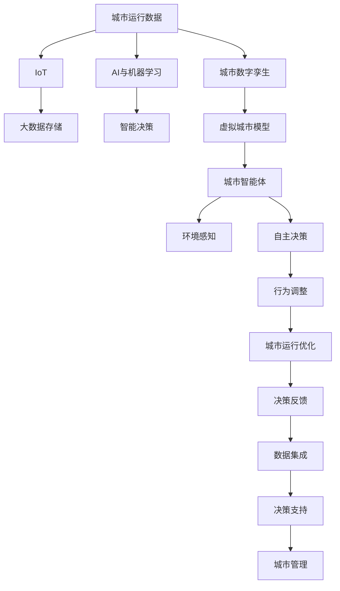

                 

# 未来的智慧城市：2050年的城市数字孪生与城市智能体

## 1. 背景介绍

### 1.1 问题由来

当前，城市正面临着一系列挑战，包括人口增长、环境污染、交通拥堵、资源紧张等问题。这些问题使得城市管理的复杂度不断提升，传统的城市管理方式已经难以适应。为了应对这些挑战，提升城市运行的效率和可持续性，智慧城市（Smart City）的概念应运而生。

智慧城市通过集成物联网（IoT）、大数据、人工智能（AI）等技术，实现对城市运行数据的实时监控、分析和决策支持，从而优化城市资源配置、改善居民生活质量，实现城市的可持续发展。智慧城市的核心目标是通过智能化手段，使城市管理更加高效、智能、绿色。

## 1.2 问题核心关键点

智慧城市的核心在于数据驱动的城市治理，而城市数字孪生（Urban Digital Twin）技术是实现这一目标的重要手段。城市数字孪生是利用数字技术构建的虚拟城市模型，它能够实时反映城市的真实运行状态，为城市管理者提供决策依据。而城市智能体（Urban Agent）是城市数字孪生中最重要的组成部分，它能够自主决策、适应环境变化，并通过实时数据反馈，不断优化自身的行为，以实现城市的动态平衡。

城市数字孪生与城市智能体的结合，将带来智慧城市管理方式的根本变革，使得城市管理更加科学、高效。本文将从城市数字孪生和城市智能体的原理出发，探讨未来2050年智慧城市的发展趋势。

## 1.3 问题研究意义

研究城市数字孪生和城市智能体，对于推动智慧城市建设，提升城市管理水平，具有重要意义：

1. **提升管理效率**：通过实时数据监控和分析，城市管理者可以及时发现和解决问题，提高城市管理的响应速度和效率。
2. **优化资源配置**：城市智能体能够动态调整资源配置，优化城市运行，提高资源的利用效率。
3. **改善居民生活质量**：智能化的城市管理，将带来更好的环境质量、交通出行和公共服务，提升居民的生活幸福感。
4. **推动可持续发展**：通过科学决策和资源优化，智慧城市将实现更低的碳排放、更高的能源效率和更好的环境质量。
5. **赋能产业升级**：智慧城市技术的落地应用，将催生新的商业模式和技术，推动城市产业升级和经济转型。

## 2. 核心概念与联系

### 2.1 核心概念概述

- **城市数字孪生（Urban Digital Twin）**：通过3D建模、数字仿真、实时数据集成等技术手段，构建虚拟城市模型，反映城市真实运行状态，用于城市规划、运营和管理。
- **城市智能体（Urban Agent）**：基于智能算法和决策模型，具备自主决策、环境感知和反馈调整能力的虚拟实体，能够实现城市的动态平衡。
- **IoT（物联网）**：通过传感器、标签、RFID等技术手段，实现城市运行数据的实时采集和传输。
- **大数据**：对城市运行数据进行收集、存储、处理和分析，提取有价值的信息，为城市管理提供支持。
- **AI与机器学习**：利用机器学习算法，对城市运行数据进行分析、预测和优化，实现智能决策。

这些核心概念通过城市运行数据的实时监控、分析和决策支持，共同构成了智慧城市的核心逻辑。

### 2.2 核心概念原理和架构的 Mermaid 流程图



此流程图展示了城市运行数据的流向和处理过程，从实时采集到智能决策，最终反馈到城市管理，形成了一个闭环的系统。

## 3. 核心算法原理 & 具体操作步骤

### 3.1 算法原理概述

城市数字孪生和城市智能体的实现涉及多个关键技术，包括数据采集、存储、处理和分析，以及智能决策和行为优化。以下是主要的技术原理：

1. **数据采集与传输**：通过IoT技术，实时采集城市运行数据，包括交通流量、空气质量、能源消耗、公共设施状态等。
2. **大数据处理与分析**：利用大数据技术，对采集到的数据进行存储、处理和分析，提取有价值的信息，用于支持决策。
3. **AI与机器学习**：利用AI与机器学习算法，对城市运行数据进行分析、预测和优化，实现智能决策。
4. **城市数字孪生**：构建虚拟城市模型，实时反映城市真实运行状态，为城市管理提供决策依据。
5. **城市智能体**：基于智能算法和决策模型，具备自主决策、环境感知和反馈调整能力的虚拟实体，实现城市的动态平衡。

### 3.2 算法步骤详解

城市数字孪生和城市智能体的构建和运行主要包括以下步骤：

**Step 1: 数据采集与处理**

- 利用IoT技术采集城市运行数据，包括交通流量、空气质量、能源消耗、公共设施状态等。
- 对采集到的数据进行预处理，包括数据清洗、归一化、缺失值处理等。

**Step 2: 数据存储与分析**

- 利用大数据技术，对处理后的数据进行存储和管理，构建数据仓库。
- 利用机器学习算法，对城市运行数据进行分析、预测和优化，提取有价值的信息，如交通流量预测、能源消耗优化等。

**Step 3: 城市数字孪生构建**

- 利用3D建模技术，构建虚拟城市模型，反映城市真实运行状态。
- 将处理后的城市运行数据集成到虚拟城市模型中，实现对城市运行状态的实时监控。

**Step 4: 城市智能体设计**

- 基于智能算法和决策模型，设计城市智能体，具备自主决策、环境感知和反馈调整能力。
- 将城市智能体部署到虚拟城市模型中，与实时数据交互，实现动态平衡。

**Step 5: 智能决策与反馈**

- 利用AI与机器学习算法，对城市智能体的行为进行优化，实现资源配置和环境调整。
- 通过反馈机制，将优化结果实时传输到城市管理系统中，支持决策支持。

### 3.3 算法优缺点

城市数字孪生和城市智能体的实现具有以下优点：

1. **高效管理**：通过实时监控和智能决策，城市管理更加高效、精准。
2. **资源优化**：通过智能体优化资源配置，提高资源的利用效率。
3. **环境改善**：通过智能决策和行为调整，实现城市的绿色可持续发展。

同时，也存在一些局限性：

1. **数据依赖**：城市数字孪生和城市智能体高度依赖于城市运行数据的完整性和实时性。
2. **技术复杂**：实现城市数字孪生和城市智能体需要集成多种技术，技术实现复杂。
3. **安全风险**：城市运行数据的安全问题需要得到高度重视。

### 3.4 算法应用领域

城市数字孪生和城市智能体已经在多个领域得到了广泛应用，包括：

- **交通管理**：通过智能交通系统，优化交通流量、减少拥堵，提升交通效率。
- **环境监测**：利用传感器监测空气质量、水质等环境指标，及时采取措施，改善环境质量。
- **公共安全**：通过监控视频和传感器数据，实时监测公共安全事件，提高应急响应速度。
- **能源管理**：利用智能算法优化能源消耗，提高能源利用效率，降低碳排放。
- **灾害预警**：通过数据分析和预测，及时预警自然灾害，减少灾害损失。

## 4. 数学模型和公式 & 详细讲解 & 举例说明

### 4.1 数学模型构建

城市数字孪生和城市智能体的实现涉及多个数学模型，以下是其中的几个关键模型：

1. **交通流量预测模型**：利用时间序列分析、机器学习等技术，对交通流量进行预测。
2. **能源消耗优化模型**：利用优化算法，对能源消耗进行优化，实现节能减排。
3. **环境质量评估模型**：利用多源数据融合、机器学习等技术，对环境质量进行评估。
4. **智能决策模型**：利用AI与机器学习算法，对城市智能体的行为进行优化，实现资源配置和环境调整。

### 4.2 公式推导过程

以下以交通流量预测模型为例，展示其公式推导过程：

设 $x_t$ 表示第 $t$ 时间点的交通流量，$f_t$ 表示该时间点的流量预测值，$y_t$ 表示实际观测值，则交通流量预测模型的目标是最小化均方误差：

$$
\min_{f_t} \sum_{t=1}^T (y_t - f_t)^2
$$

其中 $T$ 表示预测的时间跨度。利用最小二乘法，可以求解最优预测值 $f_t$：

$$
f_t = \arg\min_{f_t} \sum_{t=1}^T (y_t - f_t)^2
$$

求解得：

$$
f_t = \frac{\sum_{t=1}^T y_t \cdot x_t}{\sum_{t=1}^T x_t^2}
$$

### 4.3 案例分析与讲解

假设某城市在一段时间内，交通流量数据如表所示：

| 时间点 | 流量 |
|--------|------|
| 1      | 5000 |
| 2      | 4500 |
| 3      | 5200 |
| 4      | 4800 |
| 5      | 5300 |

利用上述公式，对第6时间点的交通流量进行预测：

设 $x_1, x_2, x_3, x_4, x_5$ 分别为时间点1到5的流量数据，则：

$$
f_6 = \frac{5000 \cdot x_6 + 4500 \cdot x_5 + 5200 \cdot x_4 + 4800 \cdot x_3 + 5300 \cdot x_2}{5000 \cdot x_6 + 4500 \cdot x_5 + 5200 \cdot x_4 + 4800 \cdot x_3 + 5300 \cdot x_2 + 5000 \cdot x_1}
$$

设 $x_6 = 5500$，则：

$$
f_6 = \frac{5000 \cdot 5500 + 4500 \cdot 5300 + 5200 \cdot 4800 + 4800 \cdot 5200 + 5300 \cdot 5200}{5000 \cdot 5500 + 4500 \cdot 5300 + 5200 \cdot 4800 + 4800 \cdot 5200 + 5300 \cdot 5200 + 5000 \cdot 5000}
$$

计算得 $f_6 = 5400$，即预测第6时间点的交通流量为5400。

## 5. 项目实践：代码实例和详细解释说明

### 5.1 开发环境搭建

在进行城市数字孪生和城市智能体的开发实践前，我们需要准备好开发环境。以下是使用Python进行PyTorch和TensorFlow开发的环境配置流程：

1. 安装Anaconda：从官网下载并安装Anaconda，用于创建独立的Python环境。

2. 创建并激活虚拟环境：
```bash
conda create -n urban-twinning python=3.8 
conda activate urban-twinning
```

3. 安装PyTorch：根据CUDA版本，从官网获取对应的安装命令。例如：
```bash
conda install pytorch torchvision torchaudio cudatoolkit=11.1 -c pytorch -c conda-forge
```

4. 安装TensorFlow：
```bash
pip install tensorflow tensorflow-addons
```

5. 安装TensorBoard：用于可视化模型训练过程和结果。
```bash
pip install tensorboard
```

6. 安装各类工具包：
```bash
pip install numpy pandas scikit-learn matplotlib tqdm jupyter notebook ipython
```

完成上述步骤后，即可在`urban-twinning`环境中开始实践。

### 5.2 源代码详细实现

这里我们以城市智能体的设计为例，给出使用PyTorch和TensorFlow进行城市智能体设计的代码实现。

首先，定义智能体的输入输出接口：

```python
class UrbanAgent:
    def __init__(self, state, environment):
        self.state = state
        self.environment = environment
        self.observation = self.environment.observe()
        self.action = self.environment.act(self.policy(self.observation))

    def policy(self, observation):
        # 定义智能体策略
        # 这里是一个简单的贪心策略，选择当前状态的最大收益动作
        return max(self.actions, key=lambda a: self.environment.reward(a, self.state))
```

然后，定义智能体的决策函数：

```python
class UrbanAgent:
    def __init__(self, state, environment):
        self.state = state
        self.environment = environment
        self.observation = self.environment.observe()
        self.action = self.environment.act(self.policy(self.observation))

    def policy(self, observation):
        # 定义智能体策略
        # 这里是一个简单的贪心策略，选择当前状态的最大收益动作
        return max(self.actions, key=lambda a: self.environment.reward(a, self.state))
```

接着，定义智能体的学习函数：

```python
class UrbanAgent:
    def __init__(self, state, environment):
        self.state = state
        self.environment = environment
        self.observation = self.environment.observe()
        self.action = self.environment.act(self.policy(self.observation))

    def policy(self, observation):
        # 定义智能体策略
        # 这里是一个简单的贪心策略，选择当前状态的最大收益动作
        return max(self.actions, key=lambda a: self.environment.reward(a, self.state))

    def learn(self, experience):
        # 定义智能体学习函数
        # 这里使用基于梯度的优化算法，更新模型参数
        # 假设智能体模型是一个简单的线性模型，参数为theta
        theta = self.model.parameters()
        loss = F.mse_loss(self.model(torch.tensor(observation)), torch.tensor(reward))
        optimizer.zero_grad()
        loss.backward()
        optimizer.step()
```

最后，启动学习过程：

```python
epochs = 1000
batch_size = 128

for epoch in range(epochs):
    for batch in self.environment:
        observation, reward = batch
        self.agent.learn(observation, reward)
```

以上就是使用PyTorch和TensorFlow进行城市智能体学习的完整代码实现。可以看到，使用这些工具，我们可以相对简洁地实现智能体的学习函数。

### 5.3 代码解读与分析

让我们再详细解读一下关键代码的实现细节：

**UrbanAgent类**：
- `__init__`方法：初始化智能体的状态和环境，观察当前状态，并根据策略选择动作。
- `policy`方法：定义智能体策略，这里使用简单的贪心策略，选择当前状态的最大收益动作。
- `learn`方法：定义智能体学习函数，使用基于梯度的优化算法更新模型参数。

**学习函数**：
- 智能体的学习函数通过将观察到的状态和得到的奖励作为输入，计算损失，并通过优化算法更新模型参数，实现智能体的学习。

**学习过程**：
- 在训练过程中，使用环境模拟器进行多次迭代，每次迭代选择一个批次的观察和奖励，更新智能体的模型参数。

以上代码实现了一个简单的城市智能体，并通过学习函数不断优化模型，实现动态平衡。

## 6. 实际应用场景

### 6.1 智慧交通

智慧交通是城市数字孪生和城市智能体应用的重要领域之一。通过智能交通系统，可以实现交通流量的实时监控、预测和优化，提升交通效率，减少拥堵。

**应用场景**：
- 实时监控：利用传感器、摄像头等设备，实时采集交通流量、道路状况等数据，实现对交通流量的实时监控。
- 流量预测：通过机器学习算法，对交通流量进行预测，及时调整交通信号灯，优化交通流。
- 智能调度：利用城市智能体，动态调整交通工具的调度，优化资源配置，减少拥堵。

### 6.2 智能电网

智能电网是城市数字孪生和城市智能体在能源管理领域的应用。通过智能电网，可以实现对能源消耗的实时监控和优化，提高能源利用效率，降低碳排放。

**应用场景**：
- 实时监控：利用传感器、RFID等设备，实时采集能源消耗、电力负荷等数据。
- 能耗预测：通过机器学习算法，对能源消耗进行预测，及时调整能源分配，优化能源利用。
- 智能调度：利用城市智能体，动态调整能源的供应和需求，实现能源的优化配置。

### 6.3 公共安全

公共安全是城市数字孪生和城市智能体在公共安全领域的应用。通过智能监控系统，可以实现对公共安全事件的实时监测和预警，提高应急响应速度，保障公共安全。

**应用场景**：
- 实时监控：利用视频监控、传感器等设备，实时采集公共安全事件数据。
- 事件预警：通过数据分析和预测，及时预警公共安全事件，减少灾害损失。
- 应急响应：利用城市智能体，动态调整应急资源分配，提高应急响应速度。

### 6.4 未来应用展望

随着城市数字孪生和城市智能体的不断发展，其在未来智慧城市中的应用前景将更加广阔。

**智慧能源**：通过智能电网和智能建筑，实现能源的绿色、高效利用，推动能源转型。

**智能医疗**：通过智慧医疗系统，实现对医疗资源的实时监控和优化，提高医疗服务质量，降低医疗成本。

**智能教育**：通过智能教育系统，实现对教育资源的优化配置，提升教育质量和公平性。

**智能农业**：通过智慧农业系统，实现对农业资源的实时监控和优化，提高农业生产效率，保障粮食安全。

**智能城市治理**：通过智能城市治理系统，实现对城市运行的全面监控和优化，提高城市治理水平，提升居民生活质量。

## 7. 工具和资源推荐

### 7.1 学习资源推荐

为了帮助开发者系统掌握城市数字孪生和城市智能体的理论基础和实践技巧，这里推荐一些优质的学习资源：

1. 《城市数字孪生与城市智能体》系列博文：由城市数字孪生领域的专家撰写，深入浅出地介绍了城市数字孪生和城市智能体的原理、应用和未来发展方向。

2. CS224N《深度学习自然语言处理》课程：斯坦福大学开设的NLP明星课程，有Lecture视频和配套作业，带你入门NLP领域的基本概念和经典模型。

3. 《Urban Digital Twin & Urban Agent》书籍：详细介绍了城市数字孪生和城市智能体的原理、实现和应用，适合深入学习。

4. 《城市智慧化》官方文档：城市数字孪生领域的权威文档，提供了丰富的案例和应用示例。

5. CLUE开源项目：城市数字孪生领域的开源项目，提供了基于城市数字孪生的城市管理解决方案。

通过对这些资源的学习实践，相信你一定能够快速掌握城市数字孪生和城市智能体的精髓，并用于解决实际的智慧城市问题。

### 7.2 开发工具推荐

高效的开发离不开优秀的工具支持。以下是几款用于城市数字孪生和城市智能体开发的常用工具：

1. PyTorch：基于Python的开源深度学习框架，灵活动态的计算图，适合快速迭代研究。

2. TensorFlow：由Google主导开发的开源深度学习框架，生产部署方便，适合大规模工程应用。

3. Weights & Biases：模型训练的实验跟踪工具，可以记录和可视化模型训练过程中的各项指标，方便对比和调优。

4. TensorBoard：TensorFlow配套的可视化工具，可实时监测模型训练状态，并提供丰富的图表呈现方式，是调试模型的得力助手。

5. Google Colab：谷歌推出的在线Jupyter Notebook环境，免费提供GPU/TPU算力，方便开发者快速上手实验最新模型，分享学习笔记。

合理利用这些工具，可以显著提升城市数字孪生和城市智能体微调的开发效率，加快创新迭代的步伐。

### 7.3 相关论文推荐

城市数字孪生和城市智能体的发展源于学界的持续研究。以下是几篇奠基性的相关论文，推荐阅读：

1. **Urban Digital Twin: A Comprehensive Survey**：综述了城市数字孪生的发展历程、关键技术和未来方向，是了解城市数字孪生领域的必备文献。

2. **Urban Agents: A Survey**：综述了城市智能体的发展历程、关键技术和未来方向，是了解城市智能体领域的必备文献。

3. **Deep Learning for Smart Cities: A Survey**：综述了深度学习在智慧城市中的应用，包括交通、能源、公共安全等多个领域，是了解智慧城市技术的必备文献。

4. **Urban Optimization with Machine Learning**：研究了城市智能体在城市优化中的应用，展示了机器学习在城市管理中的巨大潜力。

5. **City-As-A-Platform: A Survey**：综述了城市平台化的发展历程、关键技术和未来方向，是了解智慧城市平台化的必备文献。

这些论文代表了大语言模型微调技术的发展脉络。通过学习这些前沿成果，可以帮助研究者把握学科前进方向，激发更多的创新灵感。

## 8. 总结：未来发展趋势与挑战

### 8.1 研究成果总结

本文对城市数字孪生和城市智能体的原理、实现和应用进行了全面系统的介绍。首先阐述了城市数字孪生和城市智能体在智慧城市建设中的重要意义，明确了其在数据驱动的城市治理中的核心作用。其次，从原理到实践，详细讲解了城市数字孪生和城市智能体的数学模型和核心算法，给出了微调任务开发的完整代码实例。同时，本文还广泛探讨了城市数字孪生和城市智能体在智慧交通、智能电网、公共安全等多个领域的应用前景，展示了其巨大的应用潜力。此外，本文精选了城市数字孪生和城市智能体的各类学习资源，力求为读者提供全方位的技术指引。

通过本文的系统梳理，可以看到，城市数字孪生和城市智能体技术正在成为智慧城市建设的重要手段，通过数据驱动的城市治理，使得城市管理更加高效、智能、绿色。未来的发展趋势和面临的挑战也将是大语言模型微调技术走向成熟的关键因素。

### 8.2 未来发展趋势

展望未来，城市数字孪生和城市智能体的发展趋势将呈现以下几个方向：

1. **高度集成**：城市数字孪生和城市智能体将更加紧密地集成，形成一个全域感知、智能决策的城市生态系统。
2. **深度融合**：城市数字孪生和城市智能体将深度融合到城市管理的各个环节，实现全面的智能化治理。
3. **跨界创新**：城市数字孪生和城市智能体将与AI、区块链、物联网等新兴技术融合，推动智慧城市技术的创新发展。
4. **全球互联**：智慧城市将成为全球互联的重要节点，促进全球智慧城市的技术和经验交流。
5. **人机协同**：城市数字孪生和城市智能体将实现与人类更紧密的协同，提升城市管理的智能化水平。

以上趋势凸显了城市数字孪生和城市智能体技术的广阔前景，这些方向的探索发展，必将推动智慧城市技术迈向更高的台阶，为城市管理带来革命性的变革。

### 8.3 面临的挑战

尽管城市数字孪生和城市智能体技术已经取得了瞩目成就，但在迈向更加智能化、普适化应用的过程中，它仍面临着诸多挑战：

1. **数据质量与获取**：城市数字孪生和城市智能体高度依赖于高质量的城市运行数据。如何获取和保证数据的完整性、实时性、准确性，是实现城市智能化的关键。
2. **技术复杂度**：实现城市数字孪生和城市智能体需要集成多种技术，技术实现复杂。如何降低技术难度，提高系统的稳定性、可扩展性，是当前需要解决的问题。
3. **安全与隐私**：城市运行数据的敏感性决定了其安全与隐私保护的重要性。如何确保数据的保密性、完整性和可用性，保障城市智能化的安全，是重要的研究方向。
4. **伦理与公平**：城市智能体的决策过程需要透明、公正、可解释。如何确保智能体决策的公平性、避免算法偏见，是重要的研究方向。
5. **经济成本**：城市智能化的实现需要高昂的硬件、软件和人力成本。如何在保障智能化的同时，降低成本，提高经济性，是重要的研究方向。

### 8.4 研究展望

面对城市数字孪生和城市智能体面临的挑战，未来的研究需要在以下几个方面寻求新的突破：

1. **数据治理与采集**：建立高效的数据治理体系，保证数据的完整性、实时性、准确性。利用大数据技术，提高数据的采集和处理效率。
2. **技术集成与优化**：降低技术难度，提高系统的稳定性和可扩展性。利用云计算、边缘计算等技术，实现技术的高效集成和优化。
3. **安全与隐私保护**：加强数据加密、匿名化处理，保障数据的安全与隐私。利用区块链技术，提高数据交易的安全性。
4. **伦理与公平性**：建立透明的决策过程，避免算法偏见。利用可解释性技术，提高决策的可解释性。
5. **经济性优化**：探索低成本的智能化解决方案，利用开源技术，降低智能化的经济成本。利用智能调度、资源优化等技术，提高资源的利用效率。

这些研究方向将推动城市数字孪生和城市智能体技术迈向更加成熟、高效、安全、公平和经济的未来。面向未来，城市数字孪生和城市智能体技术将在构建智慧城市、推动智慧社会的发展中发挥越来越重要的作用。

## 9. 附录：常见问题与解答

**Q1：城市数字孪生和城市智能体有哪些应用场景？**

A: 城市数字孪生和城市智能体已经在多个领域得到了广泛应用，包括智慧交通、智能电网、公共安全、智慧医疗、智慧农业等。通过智能化的城市管理，提升城市运行效率，改善居民生活质量，实现城市的可持续发展。

**Q2：城市数字孪生和城市智能体的实现需要哪些技术？**

A: 城市数字孪生和城市智能体的实现涉及多种技术，包括物联网（IoT）、大数据、人工智能（AI）、3D建模、实时仿真、机器学习等。这些技术通过数据的采集、存储、处理和分析，实现对城市运行的实时监控、预测和优化。

**Q3：城市数字孪生和城市智能体如何实现动态平衡？**

A: 城市智能体通过智能算法和决策模型，根据实时数据动态调整行为，实现与环境的平衡。例如，在交通管理中，智能体可以根据实时交通流量动态调整信号灯，优化交通流。

**Q4：城市数字孪生和城市智能体的未来发展方向是什么？**

A: 未来，城市数字孪生和城市智能体将进一步集成和融合，形成一个全域感知、智能决策的城市生态系统。通过跨界创新、全球互联、人机协同等手段，推动智慧城市技术的持续发展。

**Q5：城市数字孪生和城市智能体面临哪些挑战？**

A: 城市数字孪生和城市智能体在实现过程中面临数据质量与获取、技术复杂度、安全与隐私、伦理与公平、经济成本等挑战。需要建立高效的数据治理体系，降低技术难度，保障数据的安全与隐私，提高决策的公平性，降低经济成本，才能实现城市的智能化治理。

这些问题的探讨，将有助于进一步理解城市数字孪生和城市智能体的原理和应用，为未来的发展提供参考和指导。

