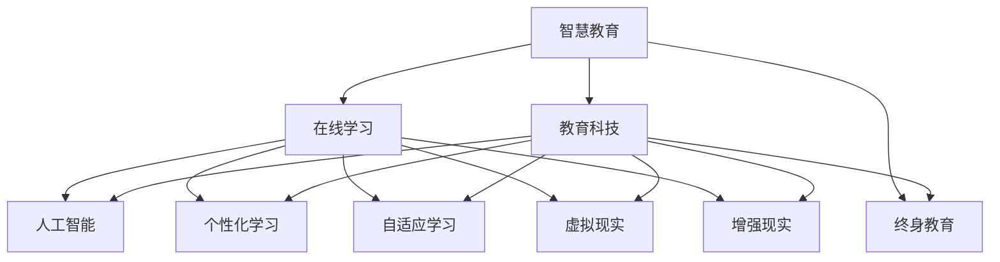

                 

# 未来的智慧教育：2050年的在线学习与终身教育

> 关键词：智慧教育, 在线学习, 终身教育, 人工智能, 个性化学习, 自适应学习, 虚拟现实, 增强现实, 教育科技

## 1. 背景介绍

### 1.1 教育发展历程回顾

教育是人类社会进步的重要基石，从古代私塾到现代大学，教育的形式和内容都在不断地演进。20世纪以来，信息技术的发展为教育带来了翻天覆地的变化。从早期的广播课程到现代的在线教育，从单一的学习模式到多元化的学习体验，教育的形态正在经历前所未有的变革。

随着信息技术的进一步发展，特别是人工智能、大数据、物联网等新兴技术的出现，教育正朝着更加智能化、个性化、互动化的方向发展。教育的本质不再是知识的传授，而是引导学生掌握学习方法，培养其批判性思维和创新能力。

### 1.2 当前教育面临的挑战

当前的教育体系仍然存在诸多问题，难以适应未来社会的需求。这些问题主要体现在以下几个方面：

- **知识更新快**：知识更新速度加快，传统的学科体系和教材无法及时反映最新的科技成果。
- **教育资源不均**：教育资源在城乡、地区之间分配不均，优质教育资源难以覆盖所有学生。
- **个性化教育需求**：学生的需求日益个性化，同一课程对不同学生的适用性较差。
- **教学效果评估**：传统的考试评估方式无法全面反映学生的学习效果，缺乏量化和综合性的评价体系。

## 2. 核心概念与联系

### 2.1 核心概念概述

为了更好地理解未来教育的发展方向，本节将介绍几个密切相关的核心概念：

- **智慧教育**：利用信息技术手段，通过个性化、智能化的方式，提高教育质量和效率，实现教育公平和个性化。
- **在线学习**：通过互联网平台，进行灵活自主的学习方式，突破时间和空间的限制。
- **终身教育**：强调教育不仅限于学校阶段，而是贯穿人的一生，持续更新知识和技能。
- **人工智能**：通过算法和计算能力，模拟人类智能，解决复杂问题，提升教育体验。
- **个性化学习**：根据学生的兴趣、能力、需求等个性化特征，提供量身定制的学习方案。
- **自适应学习**：根据学习者反馈，动态调整教学内容和策略，实现个性化和即时化的学习。
- **虚拟现实**（Virtual Reality, VR）：利用计算机模拟的三维环境，提供沉浸式学习体验。
- **增强现实**（Augmented Reality, AR）：将数字信息叠加到现实世界中，增强学习内容。
- **教育科技**：利用信息技术改善教育过程，提高教育质量和效率。

这些核心概念之间的逻辑关系可以通过以下Mermaid流程图来展示：



这个流程图展示了许多核心概念之间的关系：

1. 智慧教育与在线学习、终身教育密不可分，它们共同构成了未来教育的重要基础。
2. 人工智能技术是智慧教育、在线学习的重要支撑，通过个性化、自适应学习等手段，提升教育质量和效率。
3. 虚拟现实、增强现实等教育科技手段，进一步丰富了学习的体验，使得学习更加互动、沉浸。
4. 教育科技的应用，实现了教育资源的数字化、智能化，有助于实现教育公平和个性化。

这些概念共同构成了未来教育的发展框架，为构建智能、公平、个性化的教育体系提供了方向。

## 3. 核心算法原理 & 具体操作步骤

### 3.1 算法原理概述

基于人工智能和大数据技术，未来的智慧教育将实现个性化、自适应和智能化的学习模式。具体来说，通过以下几个核心算法，构建未来教育体系：

- **推荐算法**：根据学生的学习历史和行为，推荐适合的学习内容。
- **自适应算法**：根据学生的学习进度和效果，动态调整学习内容和难度。
- **情感分析算法**：通过分析学生的情感反馈，优化教学策略。
- **知识图谱算法**：构建知识图谱，支持知识迁移和联结。

这些算法共同构成了智慧教育的核心技术框架，通过数据的收集和分析，实现智能化的教育服务。

### 3.2 算法步骤详解

以下是基于人工智能技术，实现未来教育的核心算法步骤：

1. **数据采集**：收集学生的学习数据，包括学习历史、行为、反馈等，构建数据集。
2. **特征提取**：从数据中提取关键特征，如学习兴趣、能力、情感状态等。
3. **模型训练**：使用推荐算法、自适应算法、情感分析算法、知识图谱算法等，构建预测模型。
4. **教学优化**：根据预测模型的输出，动态调整教学内容和方法。
5. **效果评估**：使用评估指标，如学习效果、满意度、情感反馈等，持续优化教学策略。

### 3.3 算法优缺点

基于人工智能技术，智慧教育的优势主要体现在以下几个方面：

- **个性化**：通过分析学生的个性化特征，提供量身定制的学习方案。
- **自适应**：根据学生的学习进度和效果，动态调整教学内容。
- **智能推荐**：通过算法推荐适合的学习资源，提高学习效率。
- **实时反馈**：通过情感分析等技术，实时了解学生的学习状态和情感反馈。

然而，这些算法也存在一些局限性：

- **数据隐私**：大规模数据采集和分析，可能涉及学生隐私，需要严格的数据保护措施。
- **算法偏见**：算法可能存在偏见，导致推荐结果不公平。
- **资源消耗**：大规模数据分析和实时处理，需要高性能计算资源。
- **教育公平**：算法依赖数据，可能加剧数据分布不均，导致教育资源的不公平。

### 3.4 算法应用领域

基于人工智能技术的智慧教育，在多个领域已得到应用：

- **在线教育平台**：如Coursera、Edx、Udacity等，提供个性化推荐和自适应学习。
- **智能辅导系统**：如Khan Academy、Duolingo等，通过推荐算法和自适应算法，提供高效的学习支持。
- **虚拟教室**：利用虚拟现实和增强现实技术，构建沉浸式学习环境。
- **个性化学习管理系统**：如Moodle、Canvas等，通过大数据和机器学习，实现智能化的学习管理。
- **智能作业系统**：如Socrative、Google Classroom等，通过智能评估和反馈，提高作业质量和效率。

## 4. 数学模型和公式 & 详细讲解 & 举例说明

### 4.1 数学模型构建

本节将使用数学语言对未来智慧教育的算法模型进行更加严格的刻画。

记学生 $i$ 的学习历史为 $\mathcal{H}_i$，包括历史成绩、学习时间、学习内容等。设推荐算法使用的目标函数为 $F_i(\mathcal{H}_i)$，目标是最小化预测误差，即：

$$
\min_{\mathcal{H}_i} F_i(\mathcal{H}_i) = \sum_{j=1}^n (\hat{y}_{ij} - y_{ij})^2
$$

其中 $\hat{y}_{ij}$ 为算法推荐的学习内容，$y_{ij}$ 为实际选择的学习内容，$n$ 为学习内容总数。

### 4.2 公式推导过程

以推荐算法为例，其基本流程包括特征提取、模型训练、预测和评估。具体推导如下：

1. **特征提取**：将学生历史数据 $\mathcal{H}_i$ 转化为特征向量 $\vec{h}_i$，如学生的学习时长、成绩、兴趣标签等。
2. **模型训练**：使用机器学习算法（如SVM、神经网络等）训练推荐模型，得到参数 $\theta$。
3. **预测**：根据学生的特征向量 $\vec{h}_i$ 和训练好的模型 $\theta$，计算推荐内容 $\hat{y}_{ij}$。
4. **评估**：计算推荐效果与实际选择的匹配度，如准确率、召回率等。

### 4.3 案例分析与讲解

假设某在线教育平台使用协同过滤算法进行推荐，平台收集了500名学生的学习数据，包括学习时间、成绩、兴趣标签等。使用线性回归模型，将学生特征转化为线性组合，得到推荐内容。具体步骤如下：

1. **数据预处理**：将学生数据标准化，去除噪声和异常值。
2. **特征提取**：提取学生特征 $f_1,f_2,\ldots,f_n$。
3. **模型训练**：使用最小二乘法训练模型，得到系数 $\theta_1,\theta_2,\ldots,\theta_n$。
4. **预测**：根据学生特征 $\vec{h}_i$，计算推荐内容 $\hat{y}_{ij} = \theta_1 f_{1i} + \theta_2 f_{2i} + \cdots + \theta_n f_{ni}$。
5. **评估**：计算推荐准确率和召回率，优化模型参数。

## 5. 项目实践：代码实例和详细解释说明

### 5.1 开发环境搭建

在进行智慧教育开发前，我们需要准备好开发环境。以下是使用Python进行PyTorch开发的环境配置流程：

1. 安装Anaconda：从官网下载并安装Anaconda，用于创建独立的Python环境。
2. 创建并激活虚拟环境：
```bash
conda create -n pytorch-env python=3.8 
conda activate pytorch-env
```
3. 安装PyTorch：根据CUDA版本，从官网获取对应的安装命令。例如：
```bash
conda install pytorch torchvision torchaudio cudatoolkit=11.1 -c pytorch -c conda-forge
```
4. 安装Transformers库：
```bash
pip install transformers
```
5. 安装各类工具包：
```bash
pip install numpy pandas scikit-learn matplotlib tqdm jupyter notebook ipython
```

完成上述步骤后，即可在`pytorch-env`环境中开始智慧教育项目的开发。

### 5.2 源代码详细实现

下面我们以推荐算法为例，给出使用PyTorch实现推荐系统的代码实现。

```python
import torch
from sklearn.datasets import make_classification
from sklearn.model_selection import train_test_split
from sklearn.linear_model import LogisticRegression
from sklearn.metrics import accuracy_score
from torch.utils.data import Dataset, DataLoader

class StudentDataset(Dataset):
    def __init__(self, data, labels):
        self.data = data
        self.labels = labels
        
    def __len__(self):
        return len(self.data)
    
    def __getitem__(self, item):
        return self.data[item], self.labels[item]

# 生成随机数据
X, y = make_classification(n_samples=500, n_features=10, n_classes=5, random_state=42)
X_train, X_test, y_train, y_test = train_test_split(X, y, test_size=0.2, random_state=42)

# 转换为PyTorch数据集
dataset = StudentDataset(X_train, y_train)

# 构建数据加载器
train_loader = DataLoader(dataset, batch_size=32, shuffle=True)

# 定义模型和优化器
model = LogisticRegression()
optimizer = torch.optim.Adam(model.parameters(), lr=0.001)

# 训练过程
for epoch in range(100):
    for batch_idx, (data, target) in enumerate(train_loader):
        optimizer.zero_grad()
        output = model(data)
        loss = torch.nn.functional.cross_entropy(output, target)
        loss.backward()
        optimizer.step()
    
    # 计算准确率
    predictions = model(X_test)
    accuracy = accuracy_score(y_test, predictions.argmax(dim=1))
    print(f"Epoch {epoch+1}, accuracy: {accuracy:.3f}")
```

以上是使用PyTorch实现推荐系统的完整代码实现。可以看到，利用PyTorch和Sklearn，我们可以快速构建并训练推荐模型，从而实现个性化推荐。

### 5.3 代码解读与分析

让我们再详细解读一下关键代码的实现细节：

**StudentDataset类**：
- `__init__`方法：初始化数据和标签，构建PyTorch数据集。
- `__len__`方法：返回数据集的大小。
- `__getitem__`方法：对单个样本进行处理，返回模型所需的输入和标签。

**模型定义**：
- 使用LogisticRegression模型进行二分类推荐。
- 定义优化器Adam，学习率为0.001。

**训练过程**：
- 对数据集进行批处理，计算损失函数。
- 反向传播更新模型参数。
- 计算测试集上的准确率。

可以看到，利用PyTorch的便捷性和Scikit-learn的丰富算法库，我们能够快速实现推荐算法，并进行模型训练和评估。这为未来智慧教育的开发提供了坚实的基础。

当然，实际的智慧教育系统还需要考虑更多因素，如多用户交互、课程推荐、学习路径优化等，但核心的推荐算法基本与此类似。

## 6. 实际应用场景

### 6.1 在线教育平台

在线教育平台是智慧教育的重要应用场景之一。通过大规模数据收集和分析，平台可以提供个性化的学习建议和推荐，帮助学生更高效地学习。

以Coursera为例，平台通过收集学生的学习历史、兴趣偏好、反馈等数据，使用协同过滤和内容推荐算法，为学生推荐适合的课程和资源。此外，平台还利用自适应算法，根据学生的学习进度和效果，动态调整学习内容和难度，提高学习效果。

### 6.2 智能辅导系统

智能辅导系统利用AI技术，为学生提供一对一的辅导和支持，解决学习中的疑难问题。

以Khan Academy为例，平台使用自适应学习技术，根据学生的学习进度和效果，动态调整教学内容和难度。同时，平台还利用情感分析算法，实时了解学生的学习状态和情感反馈，优化教学策略。

### 6.3 虚拟教室

虚拟教室利用虚拟现实和增强现实技术，为学生提供沉浸式学习体验。

以虚拟现实教室Edx为例，平台通过VR技术，构建三维模拟学习环境，学生可以在虚拟教室中自由探索和互动，学习效果显著提升。同时，平台还利用增强现实技术，将数字信息叠加到现实世界中，增强学习内容，提高学生的学习兴趣和参与度。

### 6.4 未来应用展望

随着人工智能和大数据技术的不断进步，未来的智慧教育将呈现以下几个发展趋势：

1. **数据驱动决策**：基于大数据分析，实现教学策略的智能优化，提高教育质量和效果。
2. **个性化和自适应学习**：利用AI技术，提供个性化和自适应的学习方案，满足不同学生的需求。
3. **虚拟现实和增强现实**：通过VR和AR技术，构建沉浸式学习环境，提高学生的学习体验和效果。
4. **持续学习与终身教育**：利用AI技术，支持终身学习，提供灵活自主的学习方式，提升个人竞争力。
5. **智能评估与反馈**：利用AI技术，实现智能评估和反馈，实时了解学生的学习状态和效果，优化教学策略。

以上趋势凸显了智慧教育的广阔前景。这些方向的探索发展，必将进一步提升教育质量和效率，为构建更加公平、智能、个性化的教育体系铺平道路。

## 7. 工具和资源推荐

### 7.1 学习资源推荐

为了帮助开发者系统掌握智慧教育的理论基础和实践技巧，这里推荐一些优质的学习资源：

1. 《机器学习基础》系列课程：由Coursera、edX等在线教育平台提供的机器学习入门课程，涵盖多种算法和应用。
2. 《深度学习与自然语言处理》书籍：深入浅出地介绍深度学习和自然语言处理的基础知识和前沿技术。
3. 《智慧教育：技术驱动的未来教育》书籍：系统介绍智慧教育的理念、技术和应用，提供丰富的案例和实践建议。
4. 《教育大数据分析与实践》书籍：介绍教育大数据的采集、处理和分析方法，探讨数据驱动的智慧教育策略。
5. 《人工智能在教育中的应用》专题论文集：收录最新的人工智能教育应用研究，展示前沿技术和应用案例。

通过对这些资源的学习实践，相信你一定能够快速掌握智慧教育的精髓，并用于解决实际的NLP问题。

### 7.2 开发工具推荐

高效的开发离不开优秀的工具支持。以下是几款用于智慧教育开发的常用工具：

1. PyTorch：基于Python的开源深度学习框架，灵活动态的计算图，适合快速迭代研究。
2. TensorFlow：由Google主导开发的开源深度学习框架，生产部署方便，适合大规模工程应用。
3. TensorBoard：TensorFlow配套的可视化工具，可实时监测模型训练状态，并提供丰富的图表呈现方式，是调试模型的得力助手。
4. Weights & Biases：模型训练的实验跟踪工具，可以记录和可视化模型训练过程中的各项指标，方便对比和调优。
5. Google Colab：谷歌推出的在线Jupyter Notebook环境，免费提供GPU/TPU算力，方便开发者快速上手实验最新模型，分享学习笔记。
6. HuggingFace Transformers库：提供丰富的预训练语言模型，支持PyTorch和TensorFlow，是进行智慧教育开发的利器。

合理利用这些工具，可以显著提升智慧教育开发的速度和效率，加速创新迭代的步伐。

### 7.3 相关论文推荐

智慧教育和大数据技术的发展源于学界的持续研究。以下是几篇奠基性的相关论文，推荐阅读：

1. "Machine Learning in Education: The Case for Personalization"：讨论了机器学习在教育中的潜力，强调个性化学习的重要性。
2. "From ICT to IoT: Transforming Learning and Teaching in the Age of the Internet of Things"：探讨了物联网技术对教育的影响，提出智慧教育的新模式。
3. "Artificial Intelligence in Educational Settings: Opportunities and Challenges"：综述了AI在教育中的应用，分析了其潜力和挑战。
4. "Adaptive Learning: A Survey of the State-of-the-Art"：系统回顾了自适应学习的研究进展，总结了最新技术和发展趋势。
5. "Towards a Data-Driven Future of Education"：探讨了数据驱动的教育未来，提出基于大数据的教育决策方法。

这些论文代表了大数据技术在教育领域的研究进展，通过学习这些前沿成果，可以帮助研究者把握学科前进方向，激发更多的创新灵感。

## 8. 总结：未来发展趋势与挑战

### 8.1 总结

本文对基于人工智能技术的智慧教育进行了全面系统的介绍。首先阐述了智慧教育的发展背景和应用前景，明确了数据驱动、个性化、自适应等关键技术在智慧教育中的重要价值。其次，从原理到实践，详细讲解了推荐算法、自适应算法等核心算法的数学原理和操作步骤，给出了智慧教育项目开发的完整代码实例。同时，本文还广泛探讨了智慧教育在在线教育平台、智能辅导系统、虚拟教室等多个领域的应用，展示了智慧教育的广阔前景。此外，本文精选了智慧教育的各类学习资源，力求为读者提供全方位的技术指引。

通过本文的系统梳理，可以看到，基于人工智能技术的智慧教育正处于快速发展阶段，为构建公平、智能、个性化的教育体系提供了新的技术路径。未来，伴随人工智能和大数据技术的不断演进，智慧教育必将在更多领域得到应用，为教育公平和教育质量的提升提供新的动力。

### 8.2 未来发展趋势

展望未来，智慧教育的发展将呈现以下几个趋势：

1. **技术集成化**：智慧教育技术将与更多学科和技术进行深度集成，如物联网、区块链、大数据等，构建更加复杂多变的学习环境。
2. **服务模式多样化**：智慧教育服务将从单一模式扩展到多种形式，如智能课堂、虚拟实验室、在线辅导等，满足不同学生的学习需求。
3. **数据驱动决策**：基于大数据和AI技术，实现教学策略的智能优化，提高教育质量和效果。
4. **跨学科教育**：利用AI技术，整合跨学科知识，培养学生的综合能力和创新思维。
5. **终身学习与职业发展**：利用智慧教育平台，支持终身学习，提供灵活自主的学习方式，提升个人竞争力。

这些趋势凸显了智慧教育的广阔前景。这些方向的探索发展，必将进一步提升教育质量和效率，为构建更加公平、智能、个性化的教育体系铺平道路。

### 8.3 面临的挑战

尽管智慧教育技术已经取得了显著进展，但在迈向更加智能化、普适化应用的过程中，它仍面临着诸多挑战：

1. **数据隐私与安全**：大规模数据采集和分析，可能涉及学生隐私，需要严格的数据保护措施。
2. **算法公平性**：算法可能存在偏见，导致推荐结果不公平。
3. **资源均衡**：智慧教育技术依赖高性能计算资源，可能加剧教育资源的不均衡。
4. **教学效果评估**：传统的考试评估方式无法全面反映学生的学习效果，缺乏量化和综合性的评价体系。
5. **技术应用复杂性**：智慧教育技术应用复杂，需要教师和学生具备较高的技术素养。

### 8.4 研究展望

面对智慧教育面临的这些挑战，未来的研究需要在以下几个方面寻求新的突破：

1. **隐私保护技术**：研究数据隐私保护技术，确保学生数据的安全性和隐私性。
2. **公平算法设计**：开发公平性更高的算法，消除算法偏见，提升推荐结果的公平性。
3. **资源优化策略**：研究资源优化策略，降低智慧教育技术对高性能计算资源的依赖，提升应用的可扩展性和可访问性。
4. **综合评估体系**：构建综合性的评估体系，全面反映学生的学习效果，支持个性化的教学优化。
5. **技术普及教育**：开展技术普及教育，提升教师和学生的技术素养，推动智慧教育技术的广泛应用。

这些研究方向将为智慧教育的发展提供新的技术支撑，推动智慧教育技术的进一步成熟和普及。

## 9. 附录：常见问题与解答

**Q1：智慧教育技术的应用是否仅限于在线教育平台？**

A: 智慧教育技术的应用不仅限于在线教育平台。实际上，智慧教育技术在智能辅导系统、虚拟教室、个性化学习管理系统、智能作业系统等多个领域都有广泛应用。平台、系统、应用等多种形式，都可以实现智慧教育的目标。

**Q2：智慧教育技术的优势主要体现在哪些方面？**

A: 智慧教育技术的优势主要体现在以下几个方面：
1. **个性化**：通过分析学生的个性化特征，提供量身定制的学习方案。
2. **自适应**：根据学生的学习进度和效果，动态调整教学内容和难度。
3. **智能推荐**：通过算法推荐适合的学习资源，提高学习效率。
4. **实时反馈**：通过情感分析等技术，实时了解学生的学习状态和情感反馈，优化教学策略。

**Q3：智慧教育技术的应用对教师有哪些要求？**

A: 智慧教育技术的应用对教师有以下要求：
1. **技术素养**：教师需要掌握智慧教育技术的基本原理和应用方法。
2. **教学设计**：教师需要设计符合智慧教育技术要求的教学方案和活动。
3. **学生引导**：教师需要引导学生使用智慧教育技术，激发学生的主动性和创造力。
4. **反馈机制**：教师需要建立及时有效的反馈机制，根据学生的学习效果调整教学策略。

**Q4：智慧教育技术如何支持终身学习？**

A: 智慧教育技术支持终身学习主要体现在以下几个方面：
1. **灵活学习方式**：智慧教育技术提供灵活自主的学习方式，学生可以根据自身需求和时间安排进行学习。
2. **知识更新**：智慧教育技术支持实时更新和学习新知识，确保学生掌握最新的科技成果。
3. **多样化资源**：智慧教育技术提供丰富的学习资源，如在线课程、虚拟教室、智能辅导等，满足学生的多样化学习需求。
4. **个性化学习路径**：智慧教育技术根据学生的学习进度和效果，提供个性化的学习路径和推荐，帮助学生高效学习。

**Q5：智慧教育技术的未来发展方向是什么？**

A: 智慧教育技术的未来发展方向包括：
1. **技术集成化**：智慧教育技术将与更多学科和技术进行深度集成，如物联网、区块链、大数据等，构建更加复杂多变的学习环境。
2. **服务模式多样化**：智慧教育服务将从单一模式扩展到多种形式，如智能课堂、虚拟实验室、在线辅导等，满足不同学生的学习需求。
3. **数据驱动决策**：基于大数据和AI技术，实现教学策略的智能优化，提高教育质量和效果。
4. **跨学科教育**：利用AI技术，整合跨学科知识，培养学生的综合能力和创新思维。
5. **终身学习与职业发展**：利用智慧教育平台，支持终身学习，提供灵活自主的学习方式，提升个人竞争力。

总之，智慧教育技术的发展方向是多样化、智能化、个性化、数据驱动，未来必将在更多领域得到应用，为教育公平和教育质量的提升提供新的动力。

---

作者：禅与计算机程序设计艺术 / Zen and the Art of Computer Programming

