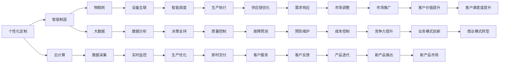

                 

## 1. 背景介绍

在人类社会的发展历程中，制造业始终是推动经济增长、改善人民生活水平的关键力量。随着信息技术、智能制造和物联网技术的蓬勃发展，未来制造业将朝着个性化定制与服务型制造的方向迈进，形成全新的产业生态。本文旨在探讨2050年智能制造的演进路径，以及个性化定制与服务型制造的前景。

## 2. 核心概念与联系

### 2.1 核心概念概述

为深入理解未来智能制造的演进，需首先明确以下几个核心概念：

- **个性化定制**：基于用户需求，通过先进的信息技术、制造技术和数据分析技术，实现产品设计的个性化，生产过程的柔性化和生产结果的精准化。
- **服务型制造**：将制造过程与售后服务融合，提供从设计到交付的全生命周期服务，增强客户满意度，提升品牌忠诚度。
- **智能制造**：融合信息技术、制造技术和工程技术的深度融合，实现从产品设计到生产、物流等全流程的智能化。
- **云计算、物联网、大数据**：支撑智能制造的基础设施，提供强大的计算能力、数据存储和处理能力，实现数据的实时采集、传输和分析。

这些概念之间相互依存、相互作用，共同推动制造业向更高层次发展。

### 2.2 核心概念联系的Mermaid流程图



## 3. 核心算法原理 & 具体操作步骤

### 3.1 算法原理概述

个性化定制与服务型制造的核心在于对用户需求的精准捕捉和高效响应，这一过程需要依托于高效的信息传递、数据分析和决策支持系统。算法原理主要包括以下几个方面：

- **需求分析**：通过用户调查、行为分析、社交媒体挖掘等手段，获取用户需求数据。
- **数据分析**：利用大数据、机器学习等技术，进行用户需求建模、预测和优化。
- **制造执行**：通过智能制造系统，实现制造过程的柔性化、自动化和精准化。
- **服务管理**：提供售后服务，包括产品维护、客户支持、故障处理等，提升客户满意度。

### 3.2 算法步骤详解

1. **需求收集与分析**：
    - 利用传感器、问卷调查、社交媒体分析等手段，收集用户需求数据。
    - 使用文本分析、情感分析等技术，理解用户需求的具体内容。

2. **产品设计个性化**：
    - 将用户需求数据输入设计系统，通过设计软件生成个性化设计方案。
    - 利用虚拟仿真、增强现实等技术，验证设计方案的可行性。

3. **制造过程柔性化**：
    - 在制造系统中引入柔性制造单元，实现生产线的灵活调整。
    - 采用模块化设计，根据用户需求快速切换生产任务。

4. **生产执行智能化**：
    - 利用物联网技术，实现生产设备、零件和成品的实时监控和数据采集。
    - 通过智能控制系统，优化生产流程和资源配置。

5. **服务与维护**：
    - 构建售后服务平台，提供在线咨询、技术支持等服务。
    - 利用预测性维护技术，实时监测设备状态，预防故障发生。

### 3.3 算法优缺点

#### 优点：

- **高效响应**：通过自动化和智能化的系统，快速响应用户需求，提升服务效率。
- **成本优化**：通过柔性化生产，减少库存和过剩生产，降低成本。
- **定制化产品**：满足用户个性化需求，提升产品竞争力。
- **数据驱动决策**：通过大数据和人工智能，进行精准的决策支持。

#### 缺点：

- **技术复杂性高**：需要融合多种技术，开发和维护难度大。
- **数据隐私和安全问题**：大量用户数据的收集和处理，存在隐私泄露和数据安全风险。
- **初始投入高**：智能制造系统和高技术人才的引入，需要较高的初始投资。

### 3.4 算法应用领域

未来智能制造的个性化定制与服务型制造，将广泛应用于以下领域：

- **消费电子**：如智能手机、智能家居等个性化智能产品的定制。
- **汽车制造**：通过智能制造平台，实现个性化汽车配置和快速生产。
- **医疗健康**：实现个性化医疗方案和健康管理。
- **建筑行业**：根据客户需求，实现定制化设计和快速施工。
- **航空航天**：通过智能制造，实现飞行器和航天器的高精度制造。

## 4. 数学模型和公式 & 详细讲解 & 举例说明

### 4.1 数学模型构建

1. **需求预测模型**：
   $$
   \hat{d}_{t+1} = \alpha \hat{d}_t + (1-\alpha) d_t
   $$
   其中，$\hat{d}_{t+1}$为下期的预测需求，$d_t$为实际需求，$\alpha$为平滑因子。

2. **生产优化模型**：
   $$
   \min \sum_{i} c_i q_i \quad s.t. \quad \sum_i a_{ij} q_i = d_j
   $$
   其中，$c_i$为单位产品成本，$q_i$为第$i$种产品的产量，$a_{ij}$为需求与产量的关系矩阵。

### 4.2 公式推导过程

需求预测模型通过时间序列数据，采用指数平滑法进行预测。生产优化模型基于线性规划，通过最小化成本函数，满足生产约束条件。

### 4.3 案例分析与讲解

以汽车制造业为例，需求预测模型可用于预测客户对不同配置汽车的偏好，生产优化模型则可用于优化生产排程和库存管理，提升生产效率。

## 5. 项目实践：代码实例和详细解释说明

### 5.1 开发环境搭建

搭建一个包含云计算、物联网、大数据和智能制造系统的开发环境，需要以下步骤：

1. 部署云平台：如AWS、阿里云等，提供计算、存储和网络服务。
2. 安装物联网设备：如传感器、标签、RFID等，用于实时数据采集。
3. 搭建大数据平台：如Hadoop、Spark等，进行数据存储和处理。
4. 开发智能制造系统：利用工业物联网平台和制造执行系统，实现智能制造。

### 5.2 源代码详细实现

以下是一个基于Python的物联网数据采集和处理代码示例：

```python
import paho.mqtt.client as mqtt
import time

def on_connect(client, userdata, flags, rc):
    print("Connected with result code "+str(rc))
    client.subscribe("temperature")

def on_message(client, userdata, msg):
    print(msg.topic+" "+str(msg.payload))

client = mqtt.Client()
client.on_connect = on_connect
client.on_message = on_message
client.connect("mqtt.example.com", 1883, 60)
client.loop_start()

while True:
    time.sleep(1)
```

### 5.3 代码解读与分析

该示例代码使用了MQTT协议，实现温度数据的实时采集和处理。通过订阅温度传感器发布的主题，获取传感器数据，并打印输出。

### 5.4 运行结果展示

运行该代码后，即开始接收温度传感器数据，并将其打印输出，供进一步的数据分析和处理。

## 6. 实际应用场景

### 6.1 智能汽车制造

在智能汽车制造中，通过物联网技术实现生产设备的实时监控和数据采集，利用大数据和机器学习进行生产优化和故障预测。同时，通过智能制造平台，提供个性化配置选项，满足用户需求。

### 6.2 个性化医疗

在个性化医疗中，通过大数据分析用户健康数据，提供个性化的医疗方案和健康管理建议。利用智能制造技术，实现个性化药物和医疗器械的生产。

### 6.3 智慧城市

在智慧城市建设中，通过物联网和云计算技术，实现城市基础设施的智能管理。通过大数据分析，优化城市交通、能源、环境等管理，提升城市运行效率。

### 6.4 未来应用展望

未来智能制造将朝着更高层次发展，实现更加全面、精准的个性化定制与服务型制造。智能制造技术将与人工智能、物联网、区块链等技术深度融合，形成更加智能、高效、安全的产业生态。

## 7. 工具和资源推荐

### 7.1 学习资源推荐

- **《智能制造技术与应用》**：介绍了智能制造的基本概念、技术体系和应用案例。
- **《物联网技术与应用》**：涵盖物联网的原理、架构和应用场景，提供实践案例。
- **《大数据科学与工程》**：涵盖大数据的采集、存储、处理和分析技术，提供深度学习等工具的实践指南。

### 7.2 开发工具推荐

- **AWS IoT**：提供物联网设备连接、数据管理和分析的云服务。
- **Apache Kafka**：开源分布式流处理平台，提供实时数据采集和处理功能。
- **Hadoop/Spark**：开源大数据处理平台，提供大规模数据存储和处理能力。

### 7.3 相关论文推荐

- **"Personalized Medicine through Genomic Data Mining"**：利用大数据分析用户基因数据，提供个性化医疗方案。
- **"Towards a Smart Manufacturing System"**：介绍智能制造系统的架构和应用案例。
- **"Real-Time Industrial Monitoring Based on IoT"**：基于物联网的工业实时监测和故障预测技术。

## 8. 总结：未来发展趋势与挑战

### 8.1 研究成果总结

未来智能制造的个性化定制与服务型制造，是制造业发展的必然趋势。通过融合信息技术、智能制造和物联网技术，实现从设计到交付的全生命周期服务，提升客户满意度，增强企业竞争力。

### 8.2 未来发展趋势

- **技术融合**：融合物联网、云计算、大数据和人工智能技术，实现全面智能化。
- **定制化**：提供个性化设计、生产和服务，满足用户多样化需求。
- **服务型制造**：实现全生命周期服务，提升客户满意度。
- **可持续发展**：通过智能制造，实现资源优化和环境保护。

### 8.3 面临的挑战

- **技术复杂性**：多种技术的融合和应用，需要高技术人才和复杂的管理。
- **数据隐私和安全**：用户数据的收集和处理，存在隐私泄露和数据安全风险。
- **成本投入**：智能制造系统的引入，需要较高的初始投资。
- **市场接受度**：新技术的推广，需要时间和市场的教育。

### 8.4 研究展望

未来需进一步研究以下方向：

- **智能制造系统的优化**：优化系统架构和算法，提升性能和稳定性。
- **智能制造的推广应用**：探索智能制造在不同行业的推广应用。
- **智能制造的标准化**：制定智能制造的标准和规范，促进技术的普及和应用。
- **智能制造的伦理和法律**：研究智能制造的伦理和法律问题，确保技术的可持续发展和应用。

## 9. 附录：常见问题与解答

**Q1: 如何实现智能制造中的实时监控和数据采集？**

A: 通过物联网技术，将传感器、标签和RFID等设备与制造设备连接，实现数据的实时采集和传输。利用MQTT、HTTP等协议，将数据传输到云计算平台进行存储和分析。

**Q2: 智能制造中的数据安全如何保障？**

A: 采用数据加密、访问控制、权限管理等措施，保障数据的安全性和隐私性。定期进行安全审计，及时发现和修复漏洞。

**Q3: 智能制造中的数据如何进行分析？**

A: 利用大数据分析和机器学习技术，进行需求预测、生产优化和故障预测等。通过建立数学模型，进行数据分析和决策支持。

**Q4: 智能制造中的个性化定制如何实现？**

A: 通过需求分析，获取用户需求数据。利用智能设计软件和3D打印技术，实现个性化设计。通过智能制造系统，实现个性化生产。

**Q5: 智能制造中的服务型制造如何构建？**

A: 通过构建售后服务平台，提供在线咨询、技术支持和故障处理等服务。利用预测性维护技术，实时监测设备状态，预防故障发生。

---

作者：禅与计算机程序设计艺术 / Zen and the Art of Computer Programming

