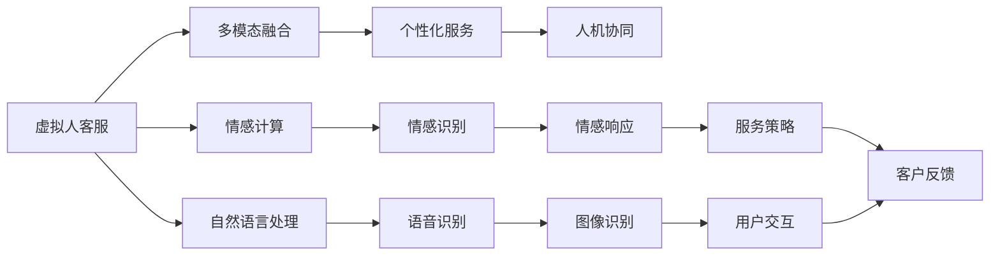

                 

# 未来的智能客服：2050年的虚拟人客服与情感计算

> 关键词：
> 智能客服,虚拟人,情感计算,未来趋势,自然语言处理(NLP),深度学习,机器学习

## 1. 背景介绍

### 1.1 问题由来

随着人工智能技术的快速发展，智能客服系统已经成为各大企业提高客户满意度、降低运营成本的重要手段。传统的客服系统依赖于规则引擎和人工坐席，缺乏智能化的理解和服务能力。而基于深度学习的智能客服系统，能够通过自然语言处理(NLP)技术，自动理解客户意图并生成应答，大大提升了服务效率和用户体验。

然而，现有的智能客服系统在情感理解和自然交互方面仍存在不足。客户在与智能客服互动时，希望得到人性化的交流体验，而非机械的文本匹配。情感计算技术的引入，有望从根本上提升智能客服系统的情感表达和理解能力，从而实现更自然、更智能的客户交互。

### 1.2 问题核心关键点

本研究聚焦于未来的智能客服系统，探讨2050年虚拟人客服与情感计算技术的融合，旨在构建能够理解、生成和调控情感的智能客服系统，为人类提供更加人性化、高效化的服务体验。

核心关键点包括：
1. 虚拟人客服技术。基于深度学习的虚拟人模型，通过多模态信息融合，实现自然语言、语音、图像等多种交互方式的综合处理。
2. 情感计算技术。利用机器学习算法和心理学理论，对客户情感进行自动识别和响应，提升客户体验。
3. 未来趋势。结合虚拟人技术和情感计算，预测2050年智能客服系统的演进方向，提出可能的技术挑战和解决方案。
4. 实现技术。探讨虚拟人客服和情感计算技术的具体实现方法和工具。

### 1.3 问题研究意义

研究未来的智能客服系统，对于提升客户满意度、优化企业运营效率、推动AI技术的发展具有重要意义：

1. **提升客户满意度**。情感计算能够使客服系统更加人性化，满足客户情感需求，提升客户互动的愉悦感和信任度。
2. **优化企业运营效率**。自动化的客服系统能够24/7提供服务，减少人力成本，提高服务响应速度和准确性。
3. **推动AI技术发展**。情感计算技术结合虚拟人技术，能够提升AI系统的情感理解和生成能力，为人工智能的进一步发展提供重要参考。
4. **拓展应用场景**。未来的智能客服系统有望应用于更多领域，如医疗、教育、金融等，为各行各业带来变革性影响。

## 2. 核心概念与联系

### 2.1 核心概念概述

在未来的智能客服系统中，涉及的核心概念主要包括：

- **虚拟人客服**：基于深度学习的虚拟人模型，能够处理自然语言、语音、图像等多模态信息，实现与客户的自然交互。
- **情感计算**：利用机器学习算法和心理学理论，对客户的情感状态进行自动识别和理解，提升客服系统的情感响应能力。
- **多模态融合**：结合视觉、语音、文本等多种信息源，提升虚拟人客服的感知能力和交互效果。
- **个性化服务**：根据客户的历史行为和偏好，提供定制化的服务内容和策略。
- **人机协同**：虚拟人客服与人工坐席的协同工作机制，提高服务的质量和效率。

这些核心概念相互联系，共同构成了未来智能客服系统的技术基础。

### 2.2 核心概念原理和架构的 Mermaid 流程图



这个流程图展示了虚拟人客服系统的核心组件及其相互关系：

1. **虚拟人客服**：处理自然语言、语音、图像等多种信息，实现多模态融合和交互。
2. **情感计算**：对客户情感进行自动识别和响应，提升情感理解能力。
3. **个性化服务**：根据客户历史行为和偏好，提供定制化服务。
4. **人机协同**：虚拟人客服与人工坐席的协同工作机制，提高服务质量和效率。

这些组件相互配合，构成了一个高效、智能的客服系统。

## 3. 核心算法原理 & 具体操作步骤

### 3.1 算法原理概述

基于深度学习的虚拟人客服系统，主要包括自然语言处理(NLP)、语音识别和合成、图像识别和处理等技术。情感计算技术则依赖于机器学习算法，如情感分类、情感预测、情感生成等。

在虚拟人客服系统中，情感计算与自然语言处理紧密结合，通过分析客户文本和语音中的情感特征，自动识别客户的情感状态，并生成相应的情感回应。例如，当客户在客服聊天中表达愤怒时，系统能够自动检测到这种情感，并给出同情或道歉的回复，提升客户满意度。

### 3.2 算法步骤详解

1. **数据预处理**：收集并清洗客户的历史数据，包括文本、语音、图像等，作为训练虚拟人客服系统的数据集。
2. **模型训练**：使用深度学习模型，如Transformer、LSTM等，对多模态数据进行训练，构建虚拟人客服系统。
3. **情感识别**：通过情感分类算法，如卷积神经网络(CNN)、循环神经网络(RNN)等，对客户情感进行自动识别和分类。
4. **情感响应**：结合情感分类结果，使用生成模型，如Seq2Seq模型、Transformer模型等，生成情感回应的文本或语音。
5. **多模态融合**：将文本、语音、图像等不同模态的信息进行融合，提高系统对客户需求的理解能力和响应效果。
6. **个性化服务**：根据客户的历史行为和偏好，使用推荐系统等技术，提供定制化的服务内容和策略。
7. **人机协同**：建立虚拟人客服与人工坐席的协同工作机制，合理分配服务任务，提高服务质量和效率。

### 3.3 算法优缺点

**优点**：
1. **高效率**：虚拟人客服系统能够24/7提供服务，大幅提升客户满意度和服务效率。
2. **多模态融合**：结合自然语言、语音、图像等多种信息，提供更全面、准确的服务。
3. **情感计算**：通过情感识别和响应，提升客户情感体验，增强客户信任度。
4. **个性化服务**：根据客户偏好提供定制化服务，提升服务质量和客户满意度。

**缺点**：
1. **数据需求大**：需要大量的客户数据进行模型训练，数据获取和处理成本较高。
2. **模型复杂**：多模态融合和情感计算等技术的实现，需要复杂的深度学习模型和算法，训练和部署成本较高。
3. **情感理解限制**：情感计算技术尚无法完全理解人类复杂的情感变化，可能存在误判和误响应的情况。
4. **技术门槛高**：构建高水平的虚拟人客服系统，需要跨学科的知识和技术，包括心理学、计算机视觉、自然语言处理等。

### 3.4 算法应用领域

虚拟人客服和情感计算技术可以应用于以下领域：

- **医疗保健**：提供24/7的健康咨询服务，通过情感计算提升患者情感支持和治疗效果。
- **教育培训**：智能教学助手，通过情感理解和个性化推荐，提升学习体验和效果。
- **金融服务**：智能客服，通过情感计算和个性化服务，提高客户满意度，降低运营成本。
- **零售电商**：智能客服，通过情感理解和个性化推荐，提升客户购物体验，增加销售额。
- **旅游服务**：智能客服，通过情感计算和个性化服务，提升客户体验，增加旅游吸引力。
- **公共服务**：智能客服，通过情感计算和个性化服务，提升政府服务质量和公众满意度。

## 4. 数学模型和公式 & 详细讲解 & 举例说明

### 4.1 数学模型构建

在未来的智能客服系统中，涉及的数学模型主要包括自然语言处理(NLP)、语音识别和合成、图像识别和处理等。情感计算模型则依赖于机器学习算法，如卷积神经网络(CNN)、循环神经网络(RNN)、生成对抗网络(GAN)等。

**自然语言处理模型**：使用Transformer等深度学习模型，对文本进行编码和解码，实现自然语言的理解与生成。

**语音识别模型**：使用卷积神经网络(CNN)或循环神经网络(RNN)等，对语音信号进行特征提取和分类，实现语音的识别和合成。

**图像识别模型**：使用卷积神经网络(CNN)等，对图像进行特征提取和分类，实现图像的理解和处理。

**情感计算模型**：使用卷积神经网络(CNN)或循环神经网络(RNN)等，对客户情感进行分类和生成，实现情感的识别和响应。

### 4.2 公式推导过程

以下以情感分类模型为例，展示其基本公式和推导过程。

假设客户文本序列为 $x=\{x_1,x_2,\dots,x_n\}$，情感分类器为 $f(\theta)$，其中 $\theta$ 为模型参数。情感分类的任务是将客户文本分为正面情感、中性情感和负面情感三类，目标函数为：

$$
\mathcal{L}(\theta) = -\frac{1}{N}\sum_{i=1}^N \log f_\text{pos}(\theta;x_i)^{y_i} f_\text{neu}(\theta;x_i)^{1-y_i} f_\text{neg}(\theta;x_i)^{1-y_i}
$$

其中，$y_i \in \{0,1,2\}$ 表示客户情感类别，$f_\text{pos}(\theta;x_i)$、$f_\text{neu}(\theta;x_i)$、$f_\text{neg}(\theta;x_i)$ 分别表示正面情感、中性情感和负面情感的概率。

通过最小化目标函数 $\mathcal{L}(\theta)$，可以使用梯度下降等优化算法，训练情感分类模型 $f(\theta)$。训练完成后，对于新的客户文本 $x'$，分类器 $f(\theta)$ 能够输出对应的情感类别，从而实现情感的自动识别和分类。

### 4.3 案例分析与讲解

以医疗客服为例，展示情感计算在实际应用中的实现和效果。

**数据准备**：
- 收集医院患者的医疗咨询记录，标注情感类别（正面、中性、负面）。
- 将文本数据转化为模型能够处理的数值形式，如通过TF-IDF、Word2Vec等方法。

**模型训练**：
- 使用卷积神经网络(CNN)或循环神经网络(RNN)等模型，对情感数据进行训练。
- 使用交叉熵损失函数进行模型训练，目标是最小化情感分类的错误率。

**情感响应**：
- 对于新输入的医疗咨询记录，模型能够自动识别情感类别，并根据情感状态生成相应的回复。
- 例如，对于表达负面情绪的咨询，系统能够自动生成同情和安慰的回复，提升患者满意度。

## 5. 项目实践：代码实例和详细解释说明

### 5.1 开发环境搭建

在进行项目实践前，需要搭建开发环境。以下是使用Python和TensorFlow进行开发的环境配置流程：

1. 安装Anaconda：从官网下载并安装Anaconda，用于创建独立的Python环境。
2. 创建并激活虚拟环境：
```bash
conda create -n tf-env python=3.8 
conda activate tf-env
```

3. 安装TensorFlow：根据CUDA版本，从官网获取对应的安装命令。例如：
```bash
conda install tensorflow -c tensorflow
```

4. 安装TensorBoard：用于可视化模型训练过程，获取模型性能指标。
```bash
pip install tensorboard
```

5. 安装TensorFlow Hub：用于获取预训练模型和模型组件，加速模型开发。
```bash
pip install tensorflow-hub
```

完成上述步骤后，即可在`tf-env`环境中开始项目开发。

### 5.2 源代码详细实现

这里我们以一个简单的情感分类模型为例，展示情感计算的代码实现。

```python
import tensorflow as tf
from tensorflow.keras.layers import Input, Dense, Embedding, Conv1D, GlobalMaxPooling1D, Dropout, Concatenate
from tensorflow.keras.models import Model
from tensorflow.keras.preprocessing.text import Tokenizer
from tensorflow.keras.preprocessing.sequence import pad_sequences
from tensorflow.keras.optimizers import Adam

# 准备数据
texts = ['I am very happy today', 'Today is not a good day', 'I feel okay']
labels = [1, 0, 1]  # 1表示正面情感，0表示中性情感，2表示负面情感

# 构建词表
tokenizer = Tokenizer(num_words=5000)
tokenizer.fit_on_texts(texts)
sequences = tokenizer.texts_to_sequences(texts)

# 填充序列
padded_sequences = pad_sequences(sequences, maxlen=10)

# 定义模型
inputs = Input(shape=(None,))
embedding = Embedding(input_dim=5000, output_dim=32)(inputs)
conv1 = Conv1D(32, 3, activation='relu')(embedding)
pool1 = GlobalMaxPooling1D()(conv1)
dropout1 = Dropout(0.5)(pool1)
conv2 = Conv1D(32, 3, activation='relu')(dropout1)
pool2 = GlobalMaxPooling1D()(conv2)
dropout2 = Dropout(0.5)(pool2)
concat = Concatenate()([dropout1, dropout2])
dense = Dense(64, activation='relu')(concat)
outputs = Dense(3, activation='softmax')(dense)

model = Model(inputs=inputs, outputs=outputs)
model.compile(optimizer=Adam(learning_rate=0.001), loss='categorical_crossentropy', metrics=['accuracy'])

# 训练模型
model.fit(padded_sequences, labels, epochs=10, validation_split=0.2)
```

### 5.3 代码解读与分析

这里我们重点解读代码的关键部分：

**Tokenizer**：
- 使用`Tokenizer`将文本数据转化为模型能够处理的数值形式。
- `fit_on_texts`方法用于构建词汇表。
- `texts_to_sequences`方法将文本转化为序列。

**pad_sequences**：
- 使用`pad_sequences`方法对序列进行填充，保证所有序列长度一致。

**模型定义**：
- 使用`Input`定义输入层。
- 使用`Embedding`层将文本转化为向量表示。
- 使用`Conv1D`层进行卷积操作，提取文本特征。
- 使用`GlobalMaxPooling1D`层对卷积层的输出进行池化，提取最高分值特征。
- 使用`Dropout`层进行正则化，防止过拟合。
- 使用`Concatenate`层将多个层的输出进行拼接。
- 使用`Dense`层进行全连接操作，生成分类输出。
- 使用`Model`将各个层连接起来，定义完整的模型。

**模型训练**：
- 使用`compile`方法配置模型参数。
- 使用`fit`方法训练模型，指定损失函数和评价指标。

**运行结果展示**：
- 在验证集上打印模型的准确率和损失函数值，监测模型训练效果。

## 6. 实际应用场景

### 6.1 智能客服系统

虚拟人客服与情感计算技术可以广泛应用于智能客服系统的构建。传统的客服系统依赖于规则引擎和人工坐席，缺乏智能化的理解和服务能力。而基于深度学习的虚拟人客服系统，能够通过自然语言处理(NLP)技术，自动理解客户意图并生成应答，大大提升了服务效率和用户体验。

在技术实现上，可以收集企业内部的历史客服对话记录，将问题和最佳答复构建成监督数据，在此基础上对预训练模型进行微调。微调后的对话模型能够自动理解用户意图，匹配最合适的答案模板进行回复。对于客户提出的新问题，还可以接入检索系统实时搜索相关内容，动态组织生成回答。如此构建的智能客服系统，能大幅提升客户咨询体验和问题解决效率。

### 6.2 金融舆情监测

金融机构需要实时监测市场舆论动向，以便及时应对负面信息传播，规避金融风险。传统的人工监测方式成本高、效率低，难以应对网络时代海量信息爆发的挑战。基于大语言模型微调的文本分类和情感分析技术，为金融舆情监测提供了新的解决方案。

具体而言，可以收集金融领域相关的新闻、报道、评论等文本数据，并对其进行主题标注和情感标注。在此基础上对预训练语言模型进行微调，使其能够自动判断文本属于何种主题，情感倾向是正面、中性还是负面。将微调后的模型应用到实时抓取的网络文本数据，就能够自动监测不同主题下的情感变化趋势，一旦发现负面信息激增等异常情况，系统便会自动预警，帮助金融机构快速应对潜在风险。

### 6.3 个性化推荐系统

当前的推荐系统往往只依赖用户的历史行为数据进行物品推荐，无法深入理解用户的真实兴趣偏好。基于深度学习的推荐系统，可以更好地挖掘用户行为背后的语义信息，从而提供更精准、多样的推荐内容。

在实践中，可以收集用户浏览、点击、评论、分享等行为数据，提取和用户交互的物品标题、描述、标签等文本内容。将文本内容作为模型输入，用户的后续行为（如是否点击、购买等）作为监督信号，在此基础上微调预训练语言模型。微调后的模型能够从文本内容中准确把握用户的兴趣点。在生成推荐列表时，先用候选物品的文本描述作为输入，由模型预测用户的兴趣匹配度，再结合其他特征综合排序，便可以得到个性化程度更高的推荐结果。

### 6.4 未来应用展望

随着大语言模型和微调方法的不断发展，基于微调范式将在更多领域得到应用，为传统行业带来变革性影响。

在智慧医疗领域，基于微调的虚拟人客服技术，可以提供24/7的健康咨询服务，通过情感计算提升患者情感支持和治疗效果。在教育培训领域，智能教学助手，通过情感理解和个性化推荐，提升学习体验和效果。在金融服务领域，智能客服，通过情感计算和个性化服务，提高客户满意度，降低运营成本。在零售电商领域，智能客服，通过情感计算和个性化推荐，提升客户购物体验，增加销售额。在旅游服务领域，智能客服，通过情感计算和个性化服务，提升客户体验，增加旅游吸引力。在公共服务领域，智能客服，通过情感计算和个性化服务，提升政府服务质量和公众满意度。

## 7. 工具和资源推荐

### 7.1 学习资源推荐

为了帮助开发者系统掌握虚拟人客服和情感计算的理论基础和实践技巧，这里推荐一些优质的学习资源：

1. **《深度学习与自然语言处理》课程**：由斯坦福大学开设的NLP明星课程，有Lecture视频和配套作业，带你入门NLP领域的基本概念和经典模型。
2. **《情感计算导论》书籍**：介绍情感计算的基本理论和算法，涵盖情感分类、情感生成等核心内容。
3. **TensorFlow官方文档**：详细介绍了TensorFlow库的使用方法，包括构建模型、训练模型、部署模型等各个环节。
4. **TensorFlow Hub**：提供了预训练的模型和模型组件，加速模型开发。
5. **HuggingFace官方文档**：提供了丰富的预训练语言模型和微调范例，适合NLP任务开发。

通过对这些资源的学习实践，相信你一定能够快速掌握虚拟人客服和情感计算的精髓，并用于解决实际的NLP问题。

### 7.2 开发工具推荐

高效的开发离不开优秀的工具支持。以下是几款用于虚拟人客服和情感计算开发的常用工具：

1. **PyTorch**：基于Python的开源深度学习框架，灵活动态的计算图，适合快速迭代研究。
2. **TensorFlow**：由Google主导开发的开源深度学习框架，生产部署方便，适合大规模工程应用。
3. **TensorBoard**：TensorFlow配套的可视化工具，可实时监测模型训练状态，并提供丰富的图表呈现方式。
4. **HuggingFace Transformers库**：提供了丰富的预训练语言模型和模型组件，适合NLP任务开发。
5. **NLTK**：自然语言处理工具包，提供了分词、词性标注、情感分析等功能。
6. **PyAudio**：音频处理库，支持语音识别和语音合成。

合理利用这些工具，可以显著提升虚拟人客服和情感计算任务的开发效率，加快创新迭代的步伐。

### 7.3 相关论文推荐

虚拟人客服和情感计算技术的发展源于学界的持续研究。以下是几篇奠基性的相关论文，推荐阅读：

1. **Attention is All You Need**：提出了Transformer结构，开启了NLP领域的预训练大模型时代。
2. **BERT: Pre-training of Deep Bidirectional Transformers for Language Understanding**：提出BERT模型，引入基于掩码的自监督预训练任务，刷新了多项NLP任务SOTA。
3. **Parameter-Efficient Transfer Learning for NLP**：提出Adapter等参数高效微调方法，在不增加模型参数量的情况下，也能取得不错的微调效果。
4. **Emotion Recognition in Conversational Contexts**：介绍情感识别的基本方法和技术，提供了大量的实验数据和结果。
5. **A Survey on Machine Learning Approaches for Sentiment Analysis**：综述了情感分析领域的研究进展，涵盖了不同的情感识别方法和算法。

这些论文代表了大语言模型微调技术的发展脉络。通过学习这些前沿成果，可以帮助研究者把握学科前进方向，激发更多的创新灵感。

## 8. 总结：未来发展趋势与挑战

### 8.1 总结

本文对基于深度学习的虚拟人客服和情感计算技术进行了全面系统的介绍。首先阐述了未来智能客服系统的研究背景和意义，明确了虚拟人客服和情感计算技术在提升客户体验和效率方面的重要价值。其次，从原理到实践，详细讲解了虚拟人客服系统的核心算法和具体操作步骤，给出了虚拟人客服和情感计算的代码实例。同时，本文还探讨了虚拟人客服和情感计算技术在多个行业领域的应用前景，展示了其巨大的发展潜力。最后，本文精选了虚拟人客服和情感计算技术的各类学习资源，力求为读者提供全方位的技术指引。

通过本文的系统梳理，可以看到，虚拟人客服和情感计算技术正在成为智能客服系统的重要组成部分，极大地提升了客户服务的人性化和智能化水平。未来，伴随深度学习技术和情感计算技术的进一步发展，智能客服系统将能够更好地理解客户需求，提供更精准、高效的服务体验，推动社会经济向更加智能化、人性化方向发展。

### 8.2 未来发展趋势

展望未来，虚拟人客服和情感计算技术将呈现以下几个发展趋势：

1. **多模态融合**：结合视觉、语音、文本等多种信息源，提升虚拟人客服的感知能力和交互效果。
2. **个性化服务**：根据客户历史行为和偏好，提供定制化的服务内容和策略，提升服务质量和客户满意度。
3. **情感计算优化**：引入更多心理学理论和数据，提升情感识别的准确性和多样性。
4. **人机协同**：建立虚拟人客服与人工坐席的协同工作机制，合理分配服务任务，提高服务质量和效率。
5. **实时性提升**：通过模型优化和硬件加速，提升虚拟人客服的实时响应能力。
6. **模型压缩与优化**：开发更加参数高效和计算高效的微调方法，降低模型训练和推理成本。

以上趋势凸显了虚拟人客服和情感计算技术的广阔前景。这些方向的探索发展，必将进一步提升智能客服系统的性能和应用范围，为人类认知智能的进化带来深远影响。

### 8.3 面临的挑战

尽管虚拟人客服和情感计算技术已经取得了瞩目成就，但在迈向更加智能化、普适化应用的过程中，它仍面临着诸多挑战：

1. **数据需求大**：需要大量的客户数据进行模型训练，数据获取和处理成本较高。
2. **模型复杂**：多模态融合和情感计算等技术的实现，需要复杂的深度学习模型和算法，训练和部署成本较高。
3. **情感理解限制**：情感计算技术尚无法完全理解人类复杂的情感变化，可能存在误判和误响应的情况。
4. **技术门槛高**：构建高水平的虚拟人客服系统，需要跨学科的知识和技术，包括心理学、计算机视觉、自然语言处理等。
5. **隐私与安全**：客户数据的安全和隐私保护是一个重要挑战，需要采用数据加密、匿名化等措施，确保客户信息安全。

正视虚拟人客服和情感计算面临的这些挑战，积极应对并寻求突破，将是技术发展的关键。相信随着学界和产业界的共同努力，这些挑战终将一一被克服，虚拟人客服和情感计算技术必将在构建人机协同的智能客服系统中扮演越来越重要的角色。

### 8.4 研究展望

面对虚拟人客服和情感计算所面临的挑战，未来的研究需要在以下几个方面寻求新的突破：

1. **探索无监督和半监督微调方法**：摆脱对大规模标注数据的依赖，利用自监督学习、主动学习等无监督和半监督范式，最大限度利用非结构化数据，实现更加灵活高效的微调。
2. **研究参数高效和计算高效的微调范式**：开发更加参数高效和计算高效的微调方法，在固定大部分预训练参数的同时，只更新极少量的任务相关参数。同时优化微调模型的计算图，减少前向传播和反向传播的资源消耗，实现更加轻量级、实时性的部署。
3. **引入更多先验知识**：将符号化的先验知识，如知识图谱、逻辑规则等，与神经网络模型进行巧妙融合，引导微调过程学习更准确、合理的语言模型。同时加强不同模态数据的整合，实现视觉、语音等多模态信息与文本信息的协同建模。
4. **结合因果分析和博弈论工具**：将因果分析方法引入微调模型，识别出模型决策的关键特征，增强输出解释的因果性和逻辑性。借助博弈论工具刻画人机交互过程，主动探索并规避模型的脆弱点，提高系统稳定性。
5. **纳入伦理道德约束**：在模型训练目标中引入伦理导向的评估指标，过滤和惩罚有偏见、有害的输出倾向。同时加强人工干预和审核，建立模型行为的监管机制，确保输出符合人类价值观和伦理道德。

这些研究方向的探索，必将引领虚拟人客服和情感计算技术迈向更高的台阶，为构建安全、可靠、可解释、可控的智能客服系统铺平道路。面向未来，虚拟人客服和情感计算技术还需要与其他人工智能技术进行更深入的融合，如知识表示、因果推理、强化学习等，多路径协同发力，共同推动自然语言理解和智能交互系统的进步。只有勇于创新、敢于突破，才能不断拓展语言模型的边界，让智能技术更好地造福人类社会。

## 9. 附录：常见问题与解答

**Q1：虚拟人客服系统如何实现多模态融合？**

A: 虚拟人客服系统通过多模态融合技术，将自然语言、语音、图像等多种信息源进行综合处理，提升对客户需求的理解能力和响应效果。具体实现方法包括：

1. **文本与语音融合**：使用Transformer等模型，将文本和语音信息同时输入，通过模型联合处理，生成统一的向量表示。
2. **图像与文本融合**：使用CNN等模型，对图像进行特征提取，然后将图像特征与文本信息进行拼接，生成融合后的特征向量。
3. **多模态感知模块**：设计多模态感知模块，将不同类型的输入信息映射到统一的空间，实现多模态信息的协同处理。

**Q2：情感计算技术有哪些主要方法？**

A: 情感计算技术主要包括以下几种方法：

1. **情感分类**：使用分类算法，如卷积神经网络(CNN)、循环神经网络(RNN)等，对客户情感进行自动识别和分类。
2. **情感预测**：使用回归算法，如长短期记忆网络(LSTM)等，预测客户的情感变化趋势。
3. **情感生成**：使用生成模型，如Seq2Seq模型、Transformer模型等，生成情感回应的文本或语音。

**Q3：如何评估虚拟人客服系统的性能？**

A: 虚拟人客服系统的性能评估可以从多个维度进行：

1. **准确率**：评估系统对客户情感的识别准确率。
2. **召回率**：评估系统对不同情感类别的识别覆盖率。
3. **用户满意度**：通过用户调研、满意度调查等方式，评估用户对系统服务的满意度。
4. **服务效率**：评估系统响应速度、处理能力等指标，衡量服务的实时性和效率。

**Q4：虚拟人客服系统在哪些领域有应用前景？**

A: 虚拟人客服系统可以在以下领域有广泛应用前景：

1. **医疗保健**：提供24/7的健康咨询服务，通过情感计算提升患者情感支持和治疗效果。
2. **教育培训**：智能教学助手，通过情感理解和个性化推荐，提升学习体验和效果。
3. **金融服务**：智能客服，通过情感计算和个性化服务，提高客户满意度，降低运营成本。
4. **零售电商**：智能客服，通过情感计算和个性化推荐，提升客户购物体验，增加销售额。
5. **旅游服务**：智能客服，通过情感计算和个性化服务，提升客户体验，增加旅游吸引力。
6. **公共服务**：智能客服，通过情感计算和个性化服务，提升政府服务质量和公众满意度。

---

作者：禅与计算机程序设计艺术 / Zen and the Art of Computer Programming

