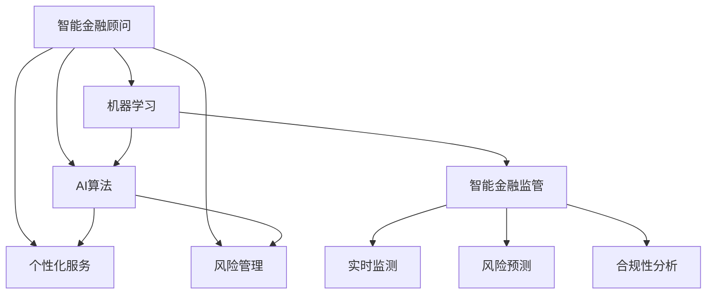

                 

# 未来的智能金融：2050年的AI金融顾问与智能金融监管

> 关键词：智能金融顾问,智能金融监管,AI算法,机器学习,金融科技,风险管理,区块链技术,隐私保护

## 1. 背景介绍

### 1.1 问题由来
随着金融科技的迅猛发展，传统的金融服务模式正在逐步向智能金融转型。智能金融系统不仅能够提供更为精准、高效的金融服务，还能在风险管理、市场分析、客户服务等多个方面发挥重要作用。然而，随着金融服务智能化程度的提升，如何保障数据安全、模型透明、合规性等问题也成为智能金融发展过程中不可回避的挑战。

### 1.2 问题核心关键点
本文章聚焦于未来的智能金融系统，探索AI金融顾问与智能金融监管技术的应用前景和发展趋势。智能金融顾问能够提供个性化、定制化的金融服务，而智能金融监管系统则能够实时监测和预防金融风险，保护投资者利益。

### 1.3 问题研究意义
本研究的目的是为了揭示智能金融技术在未来的发展方向和应用潜力，同时识别智能金融系统可能面临的技术挑战和伦理问题。通过对智能金融顾问和智能金融监管的深入研究，希望能为金融科技企业提供有价值的指导，推动智能金融技术的创新与进步。

## 2. 核心概念与联系

### 2.1 核心概念概述

智能金融顾问（Smart Financial Advisor, SFA）：通过人工智能技术，为用户提供个性化的金融规划、投资建议和风险管理服务的智能系统。

智能金融监管（Smart Financial Regulation, SFR）：运用人工智能和大数据技术，实时监控金融市场行为，预测金融风险，提供合规性分析的智能系统。

AI算法：指基于机器学习、深度学习等人工智能技术设计的算法模型，用于金融数据的处理、分析和预测。

机器学习（Machine Learning, ML）：一种通过算法让机器从数据中学习，并能够对新数据进行预测或决策的技术。

金融科技（FinTech）：利用互联网、大数据、人工智能等技术，改进金融产品和服务的方式。

风险管理（Risk Management）：通过各种工具、技术对金融风险进行识别、计量、评估、监测和控制的过程。

区块链技术（Blockchain Technology）：一种去中心化的分布式账本技术，具有不可篡改、透明、安全等特性。

隐私保护（Privacy Protection）：采取各种技术和手段，确保用户数据在金融交易中的安全性和隐私性。

这些核心概念之间的逻辑关系可以通过以下Mermaid流程图来展示：



这个流程图展示出了智能金融顾问和智能金融监管的核心概念及其相互关系：

1. 智能金融顾问通过AI算法和机器学习技术，提供个性化服务，包括风险管理等。
2. 智能金融监管利用AI算法、实时监测和风险预测等技术，对金融市场行为进行监控，提供合规性分析。
3. 智能金融顾问和智能金融监管可以结合区块链技术，提高数据安全性、透明性和不可篡改性。

## 3. 核心算法原理 & 具体操作步骤
### 3.1 算法原理概述

智能金融顾问与智能金融监管系统都基于人工智能和大数据技术，主要算法原理如下：

- 智能金融顾问：
  - 通过历史交易数据和用户行为数据，利用机器学习模型（如回归、分类、聚类等），预测市场走势和用户偏好，生成个性化投资建议。
  - 使用自然语言处理（NLP）技术，分析用户咨询的文本信息，提供定制化的金融建议。
  - 结合风险管理技术，评估投资组合的风险水平，提供风险控制建议。

- 智能金融监管：
  - 收集金融市场数据，利用时间序列分析和异常检测算法，实时监测市场波动和异常交易。
  - 使用深度学习模型，对金融数据进行预测，发现潜在的金融风险。
  - 通过法律规则库和合规性检查算法，分析金融行为是否符合法律法规要求。

### 3.2 算法步骤详解

智能金融顾问和智能金融监管的主要操作步骤如下：

**智能金融顾问步骤：**

1. 数据收集：收集历史交易数据、用户行为数据、市场信息等。
2. 数据预处理：对数据进行清洗、归一化等预处理操作，确保数据质量。
3. 模型训练：选择适当的机器学习模型，利用训练数据对模型进行训练。
4. 服务实现：将训练好的模型部署到服务中，提供个性化金融建议。
5. 监控与优化：对模型进行实时监控，根据用户反馈进行模型优化。

**智能金融监管步骤：**

1. 数据采集：实时采集金融市场数据，包括交易数据、新闻信息等。
2. 数据处理：对采集到的数据进行清洗、分类、归一化等处理。
3. 模型训练：训练深度学习模型，对金融数据进行预测和异常检测。
4. 风险评估：分析金融行为是否符合法律法规，评估金融风险。
5. 实时监控：对金融市场进行实时监控，及时发现并应对异常情况。

### 3.3 算法优缺点

智能金融顾问和智能金融监管的主要优点如下：

- 智能金融顾问：
  - 能够提供个性化、定制化的金融服务，满足用户多样化需求。
  - 利用大数据和机器学习技术，提高投资建议的准确性和可靠性。
  - 能够实时监控投资组合的风险水平，提供风险控制建议。

- 智能金融监管：
  - 能够实时监控金融市场行为，预测金融风险，保障金融稳定。
  - 提供合规性分析，确保金融行为符合法律法规要求。
  - 利用深度学习技术，提高风险预测的准确性。

主要缺点如下：

- 智能金融顾问：
  - 数据隐私和安全问题：金融数据涉及用户隐私，数据泄露可能带来风险。
  - 模型透明性问题：机器学习模型的决策过程不易理解，难以解释。
  - 公平性问题：机器学习模型可能会存在偏见，影响服务公平性。

- 智能金融监管：
  - 技术复杂度高：深度学习模型训练复杂，需要大量标注数据和计算资源。
  - 合规性挑战：金融市场行为复杂多样，合规性规则不断变化，监管难度大。
  - 数据安全性问题：金融数据涉及敏感信息，数据泄露可能带来严重后果。

### 3.4 算法应用领域

智能金融顾问和智能金融监管在多个金融领域得到了广泛应用：

- 在投资管理方面，智能金融顾问能够为用户提供个性化的投资建议，优化资产配置，提高投资回报率。
- 在风险管理方面，智能金融监管能够实时监测市场风险，及时预警，控制投资风险。
- 在金融交易方面，智能金融顾问能够分析用户行为，提供交易建议，降低交易成本。
- 在金融合规方面，智能金融监管能够分析金融行为，确保合规性，避免法律风险。

除了这些核心应用领域外，智能金融顾问和智能金融监管还广泛应用于金融产品推荐、信用评分、客户服务等多个方面。

## 4. 数学模型和公式 & 详细讲解 & 举例说明

### 4.1 数学模型构建

智能金融顾问和智能金融监管系统都基于大量的数学模型，主要包括：

- 机器学习模型：如线性回归、决策树、随机森林、神经网络等。
- 时间序列模型：如ARIMA、LSTM等。
- 深度学习模型：如CNN、RNN、GAN等。

以线性回归模型为例，假设有一组历史交易数据$(x_1, y_1), (x_2, y_2), ..., (x_n, y_n)$，其中$x_i$为输入特征，$y_i$为目标变量。线性回归模型的目标是通过最小化均方误差，拟合一条最佳拟合线，从而预测新数据的输出。数学表达式为：

$$ y = \beta_0 + \beta_1 x_1 + \beta_2 x_2 + ... + \beta_n x_n + \epsilon $$

其中，$\beta_0, \beta_1, ..., \beta_n$为模型的权重参数，$\epsilon$为误差项。

### 4.2 公式推导过程

线性回归模型的推导过程如下：

1. 假设样本$(x_1, y_1), (x_2, y_2), ..., (x_n, y_n)$服从正态分布，均值为$\mu$，方差为$\sigma^2$。
2. 根据最小二乘法原理，最小化样本的均方误差：

$$ \min_{\beta} \sum_{i=1}^n (y_i - \beta_0 - \beta_1 x_1 - \beta_2 x_2 - ... - \beta_n x_n)^2 $$

3. 对上式求导，得到参数$\beta$的最优解：

$$ \frac{\partial}{\partial \beta} \sum_{i=1}^n (y_i - \beta_0 - \beta_1 x_1 - \beta_2 x_2 - ... - \beta_n x_n)^2 = 0 $$

4. 解方程组，得到：

$$ \beta = (X^TX)^{-1}X^Ty $$

其中，$X$为样本特征矩阵，$y$为样本目标向量，$(X^TX)^{-1}$为矩阵$X^TX$的逆矩阵。

### 4.3 案例分析与讲解

以股票投资组合风险管理为例，利用线性回归模型评估投资组合的风险水平。假设有一组历史股票价格数据，通过对价格数据进行线性回归，可以得到模型预测的收益率。将收益率与实际收益率的差值作为风险值，通过回归模型对风险值进行预测和监控。具体步骤如下：

1. 收集历史股票价格数据，计算收益率。
2. 利用回归模型，对收益率进行预测。
3. 计算预测收益率与实际收益率的差值，得到风险值。
4. 对风险值进行回归分析，识别高风险资产。
5. 根据风险值调整投资组合，控制风险水平。

## 5. 项目实践：代码实例和详细解释说明

### 5.1 开发环境搭建

在进行智能金融顾问和智能金融监管系统开发前，需要搭建好开发环境。以下是使用Python进行TensorFlow开发的环境配置流程：

1. 安装Anaconda：从官网下载并安装Anaconda，用于创建独立的Python环境。
2. 创建并激活虚拟环境：
```bash
conda create -n tf-env python=3.8 
conda activate tf-env
```
3. 安装TensorFlow：根据CUDA版本，从官网获取对应的安装命令。例如：
```bash
conda install tensorflow -c pytorch -c conda-forge
```
4. 安装各类工具包：
```bash
pip install numpy pandas scikit-learn matplotlib tqdm jupyter notebook ipython
```
完成上述步骤后，即可在`tf-env`环境中开始项目实践。

### 5.2 源代码详细实现

下面我们以智能金融顾问为例，给出使用TensorFlow进行线性回归模型构建的PyTorch代码实现。

```python
import tensorflow as tf
import pandas as pd
from sklearn.model_selection import train_test_split

# 读取数据集
data = pd.read_csv('stock_prices.csv')

# 分离特征和标签
X = data.drop('Return', axis=1)
y = data['Return']

# 划分训练集和测试集
X_train, X_test, y_train, y_test = train_test_split(X, y, test_size=0.2, random_state=42)

# 定义模型
model = tf.keras.Sequential([
    tf.keras.layers.Dense(units=64, activation='relu', input_shape=[len(X_train.keys())]),
    tf.keras.layers.Dense(units=1)
])

# 编译模型
model.compile(optimizer='adam', loss='mse')

# 训练模型
model.fit(X_train, y_train, epochs=100, validation_data=(X_test, y_test))

# 预测新数据
new_data = pd.read_csv('new_stock_prices.csv')
y_pred = model.predict(new_data)

print(y_pred)
```

以上代码实现了基于TensorFlow的线性回归模型训练和预测过程。可以看到，TensorFlow通过高层API实现模型的定义、编译和训练，使得模型构建和调参更加便捷。

### 5.3 代码解读与分析

让我们再详细解读一下关键代码的实现细节：

1. 读取数据集：使用Pandas库读取CSV文件，获取历史股票价格数据。
2. 分离特征和标签：将特征数据和标签数据分离，便于后续处理。
3. 划分训练集和测试集：使用sklearn库的train_test_split函数，将数据集划分为训练集和测试集，用于模型评估。
4. 定义模型：使用TensorFlow的Sequential API，定义一个包含两个全连接层的神经网络模型，其中第一层有64个神经元，使用ReLU激活函数。
5. 编译模型：使用Adam优化器和均方误差损失函数，定义模型训练的目标。
6. 训练模型：使用fit函数对模型进行训练，设定训练轮数为100。
7. 预测新数据：读取新数据，使用训练好的模型进行预测，输出预测收益率。

可以看到，TensorFlow通过API化的设计，大大降低了模型构建和调参的复杂度，使得开发者能够专注于核心算法的实现。

## 6. 实际应用场景

### 6.1 智能金融顾问在投资管理中的应用

智能金融顾问在投资管理中的应用场景如下：

1. 个性化投资建议：根据用户的历史交易数据和行为数据，利用机器学习模型生成个性化投资建议。
2. 风险控制：通过风险管理技术，评估投资组合的风险水平，提供风险控制建议。
3. 交易建议：分析市场走势和用户行为，提供交易建议，优化投资决策。

以股票投资组合管理为例，智能金融顾问可以通过分析用户的历史交易数据，识别用户的投资风格和偏好，生成个性化的投资建议。同时，通过风险管理技术，对投资组合的风险水平进行评估，提供风险控制建议，帮助用户规避风险。

### 6.2 智能金融监管在金融市场监测中的应用

智能金融监管在金融市场监测中的应用场景如下：

1. 实时监控：实时采集金融市场数据，利用时间序列分析和异常检测算法，监控市场波动和异常交易。
2. 风险预测：使用深度学习模型，对金融数据进行预测，发现潜在的金融风险。
3. 合规性分析：分析金融行为是否符合法律法规要求，确保合规性。

以股市波动监测为例，智能金融监管可以实时采集股票交易数据，利用时间序列分析和异常检测算法，监测市场波动。同时，使用深度学习模型，对市场数据进行预测，识别潜在的金融风险。最后，通过合规性检查算法，确保金融行为符合法律法规要求，保障市场稳定。

## 7. 工具和资源推荐

### 7.1 学习资源推荐

为了帮助开发者系统掌握智能金融顾问和智能金融监管的理论基础和实践技巧，这里推荐一些优质的学习资源：

1. 《深度学习入门》系列博文：由深度学习专家撰写，深入浅出地介绍了深度学习的基本概念和算法原理。
2. 《TensorFlow实战》书籍：TensorFlow官方文档，包含丰富的示例和实践指南，适合入门学习和项目开发。
3. 《机器学习实战》书籍：Manning出版社的经典入门教材，涵盖机器学习的基本算法和实战案例。
4. 《金融科技：如何重新定义金融》书籍：探讨金融科技的发展趋势和应用场景，适合金融科技从业者阅读。
5. 《区块链技术与应用》课程：介绍区块链技术的原理和应用场景，适合区块链技术爱好者学习。

通过对这些资源的学习实践，相信你一定能够快速掌握智能金融顾问和智能金融监管的精髓，并用于解决实际的金融问题。

### 7.2 开发工具推荐

高效的开发离不开优秀的工具支持。以下是几款用于智能金融顾问和智能金融监管开发的常用工具：

1. TensorFlow：基于Python的开源深度学习框架，灵活动态的计算图，适合快速迭代研究。大部分预训练语言模型都有TensorFlow版本的实现。
2. PyTorch：基于Python的开源深度学习框架，灵活的动态计算图，适合学术研究和工业应用。同样有丰富的预训练语言模型资源。
3. TensorFlow Lite：TensorFlow的移动端优化版本，支持在移动设备和嵌入式设备上进行模型部署。
4. TensorFlow Extended (TFX)：TensorFlow的高级开发工具，提供数据预处理、模型训练、模型部署等功能，适合复杂的金融项目开发。
5. Jupyter Notebook：开源的交互式笔记本，支持Python、R等多种语言，适合数据处理和模型训练。

合理利用这些工具，可以显著提升智能金融顾问和智能金融监管任务的开发效率，加快创新迭代的步伐。

### 7.3 相关论文推荐

智能金融顾问和智能金融监管的发展源于学界的持续研究。以下是几篇奠基性的相关论文，推荐阅读：

1. 《Recurrent Neural Networks for Sequence Prediction》：Hinton等人提出RNN模型，用于序列数据的预测，奠定了时间序列分析的基础。
2. 《Deep Neural Networks for Large-Scale Image Recognition》：AlexNet模型，利用深度神经网络实现大规模图像识别，推动了深度学习的发展。
3. 《A Survey on Machine Learning for Credit Risk Evaluation》：综述机器学习在信用评分中的应用，分析了各种机器学习模型的优缺点。
4. 《Blockchain Technology: A Comprehensive Review》：Pan和Wang综述了区块链技术的原理、应用和挑战，适合区块链技术研究者阅读。
5. 《A Survey on Financial Technology Development and Innovation》：Surya等人综述了金融科技的发展现状和未来趋势，适合金融科技从业者阅读。

这些论文代表了大金融模型微调技术的发展脉络。通过学习这些前沿成果，可以帮助研究者把握学科前进方向，激发更多的创新灵感。

## 8. 总结：未来发展趋势与挑战

### 8.1 总结

本文对智能金融顾问和智能金融监管技术的未来发展趋势进行了全面系统的介绍。首先阐述了智能金融顾问和智能金融监管的研究背景和意义，明确了其在金融科技发展中的重要地位。其次，从原理到实践，详细讲解了智能金融顾问和智能金融监管的核心算法和操作步骤，给出了实际应用中的代码实现。同时，本文还广泛探讨了智能金融顾问和智能金融监管在未来金融市场中的广泛应用前景。

通过本文的系统梳理，可以看到，智能金融顾问和智能金融监管技术在未来的发展方向和应用潜力。这些技术的不断进步，必将在智能金融系统的建设中发挥重要作用，推动金融科技的持续创新和发展。

### 8.2 未来发展趋势

展望未来，智能金融顾问和智能金融监管技术将呈现以下几个发展趋势：

1. 智能化程度提升：未来的智能金融顾问将具备更强的自主决策能力，能够在没有人类干预的情况下，进行投资组合优化和风险管理。
2. 跨领域融合：智能金融顾问和智能金融监管将与其他AI技术（如自然语言处理、计算机视觉等）进行深度融合，提升系统的综合性能。
3. 多模态融合：智能金融顾问和智能金融监管将实现多模态数据的整合，综合利用文本、图像、语音等多种数据，提升决策的准确性和可靠性。
4. 隐私保护增强：未来的智能金融系统将更加注重用户隐私保护，采用差分隐私、联邦学习等技术，保护用户数据安全。
5. 透明度和可解释性：智能金融顾问和智能金融监管将更加注重系统的透明度和可解释性，采用可解释性模型和解释工具，确保决策过程的公平性和可信度。

以上趋势凸显了智能金融技术在未来的发展方向。这些方向的探索发展，必将在推动金融科技行业迈向更高的智能化水平的同时，保障金融市场的稳定和健康。

### 8.3 面临的挑战

尽管智能金融顾问和智能金融监管技术已经取得了瞩目成就，但在迈向更加智能化、普适化应用的过程中，它仍面临着诸多挑战：

1. 数据质量和隐私保护：金融数据涉及敏感信息，数据泄露可能带来严重后果。如何确保数据安全和隐私保护，是未来智能金融系统的关键挑战之一。
2. 模型公平性和透明性：机器学习模型可能会存在偏见，影响服务公平性。同时，模型的决策过程不易理解，难以解释。如何提高模型的公平性和透明性，将是未来智能金融系统的核心课题。
3. 技术复杂度：智能金融系统涉及大数据、深度学习、区块链等多个技术领域，开发和维护复杂度较高。如何简化技术实现，提升系统稳定性，也是未来智能金融系统需要解决的问题。
4. 合规性问题：金融市场行为复杂多样，法律法规不断变化，监管难度大。如何确保系统合规性，避免法律风险，将是未来智能金融系统的重要任务。

### 8.4 研究展望

面对智能金融顾问和智能金融监管所面临的种种挑战，未来的研究需要在以下几个方面寻求新的突破：

1. 数据隐私保护技术：开发高效的数据隐私保护技术，如差分隐私、联邦学习等，确保金融数据的安全性和隐私性。
2. 可解释性模型开发：开发可解释性强的模型，如LIME、SHAP等，提高系统的透明度和可信度。
3. 模型公平性算法：开发公平性模型，如Adversarial Debiasing等，消除模型偏见，提升服务公平性。
4. 多模态数据融合技术：开发多模态数据融合算法，实现文本、图像、语音等多种数据的综合利用，提升系统的综合性能。
5. 智能金融系统架构设计：设计高效、可扩展、易维护的智能金融系统架构，提升系统的稳定性和可靠性。

这些研究方向的探索，必将在推动智能金融顾问和智能金融监管技术向更高层次发展的同时，为金融科技行业带来新的突破和创新。面向未来，智能金融技术的发展潜力巨大，需要更多科研力量和技术资源的投入，方能实现全面落地和普及。

## 9. 附录：常见问题与解答

**Q1: 智能金融顾问和智能金融监管的区别是什么？**

A: 智能金融顾问主要为用户提供个性化、定制化的金融服务，如投资建议、风险管理等。而智能金融监管则主要对金融市场行为进行实时监控，预测金融风险，提供合规性分析。两者虽然都基于AI技术，但应用场景和任务目标不同。

**Q2: 智能金融顾问和智能金融监管的开发难点是什么？**

A: 智能金融顾问和智能金融监管的开发难点在于：
1. 数据隐私和安全问题：金融数据涉及用户隐私，数据泄露可能带来风险。
2. 模型公平性和透明性问题：机器学习模型可能会存在偏见，影响服务公平性。同时，模型的决策过程不易理解，难以解释。
3. 技术复杂度高：智能金融系统涉及大数据、深度学习、区块链等多个技术领域，开发和维护复杂度较高。
4. 合规性问题：金融市场行为复杂多样，法律法规不断变化，监管难度大。

**Q3: 智能金融顾问和智能金融监管在实际应用中有哪些成功案例？**

A: 智能金融顾问和智能金融监管在实际应用中有以下成功案例：
1. 智能投顾平台：如Betterment、Wealthfront等，利用智能金融顾问技术，提供个性化投资建议和风险管理。
2. 金融市场监测系统：如AlphaSense、Bloomberg等，利用智能金融监管技术，实时监控市场行为，预测金融风险。
3. 区块链金融应用：如Ripple、Bitmain等，利用区块链技术，提高金融交易的透明性和安全性。

**Q4: 智能金融顾问和智能金融监管的未来发展方向是什么？**

A: 智能金融顾问和智能金融监管的未来发展方向在于：
1. 智能化程度提升：未来的智能金融顾问将具备更强的自主决策能力，能够在没有人类干预的情况下，进行投资组合优化和风险管理。
2. 跨领域融合：智能金融顾问和智能金融监管将与其他AI技术（如自然语言处理、计算机视觉等）进行深度融合，提升系统的综合性能。
3. 多模态融合：智能金融顾问和智能金融监管将实现多模态数据的整合，综合利用文本、图像、语音等多种数据，提升决策的准确性和可靠性。
4. 隐私保护增强：未来的智能金融系统将更加注重用户隐私保护，采用差分隐私、联邦学习等技术，保护用户数据安全。
5. 透明度和可解释性：智能金融顾问和智能金融监管将更加注重系统的透明度和可解释性，采用可解释性模型和解释工具，确保决策过程的公平性和可信度。

综上所述，智能金融顾问和智能金融监管技术将在未来金融科技的发展中扮演重要角色，带来更多创新和变革。

---

作者：禅与计算机程序设计艺术 / Zen and the Art of Computer Programming

