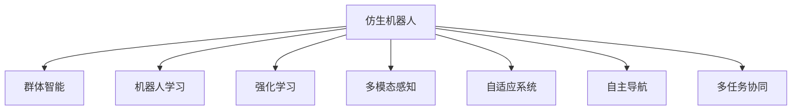

                 

## 1. 背景介绍

随着人工智能(AI)技术的迅猛发展，机器人行业正逐步迈入一个崭新的阶段。当前，机器人的功能和应用场景还相对单一，它们主要在工业制造、物流配送、医疗辅助等领域发挥作用。然而，随着AI技术的深入研究和应用推广，未来的机器人将具备更加复杂、智能和灵活的能力，从而在更多领域中发挥作用。

### 1.1 人工智能的迅猛发展

人工智能技术经历了数十年的发展，从早期的专家系统到深度学习的兴起，再到当前的强化学习和大模型范式，AI技术在处理复杂任务、模拟人类认知和行为方面取得了显著进展。这一系列技术的突破，为机器人的发展提供了强有力的技术支撑，使得仿生机器人与群体智能成为可能。

### 1.2 仿生机器人与群体智能的兴起

仿生机器人是指仿照生物体结构和功能设计的机器人，能够模仿生物的感知、决策、行动能力。群体智能则是指通过多智能体间的协同合作，实现任务的高效完成和系统的自组织能力。未来的机器人将通过仿生设计和群体智能，实现更高水平的智能化和自主化。

## 2. 核心概念与联系

### 2.1 核心概念概述

为更好地理解未来仿生机器人与群体智能，本节将介绍几个密切相关的核心概念：

- **仿生机器人(Bionic Robot)**：指模仿生物形态、结构和功能设计的机器人，如仿生腿、仿生翅膀、仿生触觉等。
- **群体智能(Swarm Intelligence)**：指通过多智能体间的协作和自组织能力，实现任务的高效完成和系统的自适应能力。
- **机器人学习(Robot Learning)**：指机器人通过感知、决策、行动等过程，不断学习新知识和技能的机制。
- **强化学习(Reinforcement Learning)**：一种通过与环境交互，不断优化策略的AI技术，广泛应用于机器人控制、路径规划、游戏博弈等领域。
- **多模态感知(Multimodal Perception)**：指机器人同时利用视觉、听觉、触觉等多种传感器获取环境信息，提高感知能力。
- **自适应系统(Adaptive System)**：指系统能够根据环境变化和任务需求，自动调整策略和行为的能力。
- **自主导航(Autonomous Navigation)**：指机器人能够在未知环境中自主规划路径和避障的能力。
- **多任务协同(Multi-task Collaboration)**：指多个机器人协同完成复杂任务，如协作搬运、联合搜索等。

这些核心概念之间的逻辑关系可以通过以下Mermaid流程图来展示：



这个流程图展示了仿生机器人的核心概念及其之间的关系：

1. 仿生机器人通过群体智能、学习、强化学习等技术提升其智能水平和适应能力。
2. 多模态感知能力使得仿生机器人可以更全面地感知环境，从而更好地完成任务。
3. 自适应系统使仿生机器人可以根据环境变化和任务需求自动调整策略和行为。
4. 自主导航能力使仿生机器人在未知环境中也能规划路径和避障。
5. 多任务协同能力使多个仿生机器人可以合作完成任务，提高效率和可靠性。

## 3. 核心算法原理 & 具体操作步骤

### 3.1 算法原理概述

仿生机器人与群体智能的核心算法原理主要基于人工智能、机器学习、强化学习等技术。以下是一些关键算法的概述：

- **强化学习算法**：通过与环境交互，不断优化策略，使得机器人能够在复杂多变的环境中完成任务。常见的强化学习算法包括Q-learning、SARSA、Actor-Critic等。
- **多智能体协同算法**：通过多个机器人之间的信息共享和协作，实现复杂任务的协同完成。常见的多智能体协同算法包括合作博弈、分布式优化、分布式学习等。
- **仿生感知算法**：通过模仿生物感知机制，提升机器人的感知能力和环境理解能力。常见的仿生感知算法包括视觉SLAM、声纳导航、触觉反馈等。
- **自适应控制算法**：通过动态调整机器人控制策略，使其能够适应环境变化和任务需求。常见的自适应控制算法包括PID控制、模糊控制、神经网络控制等。
- **多任务协同算法**：通过多机器人之间的信息共享和协作，实现多个任务的协同完成。常见的多任务协同算法包括协调器机制、分布式优化、分布式学习等。

### 3.2 算法步骤详解

仿生机器人与群体智能的开发和应用一般包括以下几个关键步骤：

**Step 1: 选择机器人平台和硬件**
- 根据任务需求，选择合适的机器人平台和硬件设备。例如，对于仿生腿机器人，需要选择具备强稳定性和控制性能的平台。
- 确定机器人所需的传感器类型和数量，如摄像头、激光雷达、超声波传感器等。

**Step 2: 设计仿生机器人的结构和功能**
- 根据任务需求和应用场景，设计机器人的结构和功能。例如，仿生腿机器人需要具备强稳定性和灵活性。
- 设计机器人感知、决策、行动等模块的实现细节，如视觉SLAM、路径规划等。

**Step 3: 开发感知算法**
- 实现机器人多模态感知算法，如视觉SLAM、声纳导航、触觉反馈等。
- 对感知算法进行优化和调参，确保其能够在复杂环境下稳定运行。

**Step 4: 实现自适应控制算法**
- 实现机器人的自适应控制算法，如PID控制、模糊控制、神经网络控制等。
- 对控制算法进行优化和调参，确保其能够适应环境变化和任务需求。

**Step 5: 实现强化学习算法**
- 实现机器人的强化学习算法，如Q-learning、SARSA、Actor-Critic等。
- 对强化学习算法进行优化和调参，确保其能够在复杂环境下高效完成任务。

**Step 6: 实现多智能体协同算法**
- 实现多个机器人的协同算法，如合作博弈、分布式优化、分布式学习等。
- 对协同算法进行优化和调参，确保多个机器人能够高效协同完成任务。

**Step 7: 测试和部署**
- 在实际环境中对机器人进行测试，评估其性能和稳定性。
- 根据测试结果进行优化和改进，直至达到预期效果。
- 将优化后的机器人部署到实际应用场景中，进行长期运行和维护。

以上是仿生机器人与群体智能开发的一般流程。在实际应用中，还需要根据具体任务的特点，对各个环节进行优化设计，如改进感知算法、调整控制策略、优化协同算法等，以进一步提升机器人性能。

### 3.3 算法优缺点

仿生机器人与群体智能具有以下优点：

- **智能性高**：通过多智能体协同和强化学习等技术，仿生机器人能够具备高智能水平和自适应能力。
- **任务复杂性高**：能够处理更加复杂和多样化的任务，如协作搬运、联合搜索等。
- **应用广泛**：可以应用于工业制造、物流配送、医疗辅助等多个领域，具有广泛的应用前景。
- **自适应性强**：能够根据环境变化和任务需求，自动调整策略和行为，提高系统的稳定性和可靠性。

同时，该方法也存在一定的局限性：

- **开发成本高**：仿生机器人的开发和硬件成本较高，需要大量资金和技术投入。
- **技术复杂性高**：涉及多种技术的融合和优化，开发和调试难度较大。
- **算法复杂度大**：多智能体协同和强化学习等算法复杂度高，需要高效的计算和存储能力。
- **任务协同难度大**：多个机器人协同完成任务时，需要解决通信、同步等问题，难度较大。

尽管存在这些局限性，但就目前而言，仿生机器人与群体智能仍是机器人领域的重要研究方向。未来相关研究的重点在于如何进一步降低开发成本，提高任务协同效率，优化感知和控制算法，以及引入更多先验知识和伦理约束等。

### 3.4 算法应用领域

仿生机器人与群体智能已经在多个领域得到了应用，并取得了显著成果：

- **工业制造**：应用于装配、搬运、检测等环节，提高生产效率和产品质量。
- **物流配送**：应用于无人驾驶、路径规划、配送调度等环节，提升物流效率和安全性。
- **医疗辅助**：应用于手术辅助、康复训练、患者监护等环节，提高医疗服务质量和效率。
- **灾害救援**：应用于搜索、搬运、通信等环节，提升灾害救援的速度和效果。
- **环境监测**：应用于水质监测、气候变化、生态保护等环节，提供科学的决策依据。

除了上述这些经典应用外，仿生机器人与群体智能还被创新性地应用于更多场景中，如智慧农业、智能交通、智能家居等，为机器人技术带来了全新的突破。随着技术的不断演进，相信仿生机器人与群体智能将在更广泛的领域中发挥作用，推动人类社会的智能化和自动化进程。

## 4. 数学模型和公式 & 详细讲解 & 举例说明

### 4.1 数学模型构建

为更好地理解仿生机器人与群体智能的数学模型，本节将介绍一些关键的数学模型和公式：

- **多智能体协同模型**：
  - **合作博弈**：通过多个机器人之间的合作，实现共同目标的最优化。
  - **分布式优化**：通过多个机器人之间的信息共享和协同，实现全局最优解的分布式计算。
  - **分布式学习**：通过多个机器人之间的信息共享和协同，实现知识的共享和提升。

- **强化学习模型**：
  - **Q-learning算法**：通过与环境的交互，学习最优策略。
  - **SARSA算法**：通过与环境的交互，学习最优策略，并更新策略值函数。
  - **Actor-Critic算法**：通过两个网络（Actor和Critic）协同工作，学习最优策略。

- **仿生感知模型**：
  - **视觉SLAM算法**：通过视觉传感器获取环境信息，实现机器人的自主导航。
  - **声纳导航算法**：通过声纳传感器获取环境信息，实现机器人的避障和定位。
  - **触觉反馈算法**：通过触觉传感器获取环境信息，实现机器人的自适应控制。

### 4.2 公式推导过程

以下我们将以视觉SLAM算法为例，推导其在仿生机器人中的应用。

视觉SLAM（Simultaneous Localization and Mapping）算法是一种能够在未知环境中同时进行定位和地图构建的算法。假设机器人有摄像头和IMU（惯性测量单元），其状态为 $x_t$，位置为 $p_t$，方向为 $\theta_t$，地图为 $M_t$，摄像头位姿为 $H_t$。

1. **地图更新**：假设机器人以速度 $v_t$ 移动，在时间步 $t$ 内移动距离 $d_t$，更新地图为：
   $$
   M_{t+1} = M_t + \delta x_t
   $$
   其中 $\delta x_t = v_t \cdot \Delta t$。

2. **位置更新**：根据摄像头位姿和地图信息，计算机器人的位置和方向，更新为：
   $$
   p_{t+1} = p_t + H_t \cdot \delta x_t
   $$
   $$
   \theta_{t+1} = \theta_t + \Delta \theta_t
   $$
   其中 $\Delta \theta_t$ 为摄像头旋转角度。

3. **路径规划**：根据当前位置和目标位置，计算最优路径。假设目标位置为 $p^*$，路径为 $P$，则：
   $$
   P = \arg\min_{P} \sum_{t=1}^{T} \| p_t - p^* \|^2
   $$

### 4.3 案例分析与讲解

以下我们将以物流配送场景为例，展示仿生机器人与群体智能的应用。

假设一个物流配送中心需要运输一批货物，需要多个机器人协同完成配送任务。首先，通过多智能体协同算法，实现货物分配、路径规划和任务调度。每个机器人负责运输一定数量的货物，并根据路径规划算法计算最优路径。在配送过程中，机器人需要根据环境变化和任务需求，动态调整路径和速度，确保货物及时送达。

在配送中心内，通过视觉SLAM算法实现机器人的定位和地图构建，使其能够在复杂环境中高效导航。在配送过程中，通过触觉反馈算法实现机器人的避障和稳定控制。在任务完成后，通过强化学习算法优化机器人的决策和行为，提升配送效率和可靠性。

## 5. 项目实践：代码实例和详细解释说明

### 5.1 开发环境搭建

在进行仿生机器人与群体智能开发前，我们需要准备好开发环境。以下是使用Python进行PyTorch开发的环境配置流程：

1. 安装Anaconda：从官网下载并安装Anaconda，用于创建独立的Python环境。

2. 创建并激活虚拟环境：
```bash
conda create -n pytorch-env python=3.8 
conda activate pytorch-env
```

3. 安装PyTorch：根据CUDA版本，从官网获取对应的安装命令。例如：
```bash
conda install pytorch torchvision torchaudio cudatoolkit=11.1 -c pytorch -c conda-forge
```

4. 安装各类工具包：
```bash
pip install numpy pandas scikit-learn matplotlib tqdm jupyter notebook ipython
```

完成上述步骤后，即可在`pytorch-env`环境中开始仿生机器人与群体智能的开发实践。

### 5.2 源代码详细实现

这里我们以多智能体协同配送为例，给出使用PyTorch实现的代码实现。

首先，定义配送任务的数据处理函数：

```python
from transformers import BertTokenizer
from torch.utils.data import Dataset
import torch

class DeliveryDataset(Dataset):
    def __init__(self, deliveries, tokenizer, max_len=128):
        self.deliveries = deliveries
        self.tokenizer = tokenizer
        self.max_len = max_len
        
    def __len__(self):
        return len(self.deliveries)
    
    def __getitem__(self, item):
        delivery = self.deliveries[item]
        location = delivery['location']
        destination = delivery['destination']
        
        encoding = self.tokenizer(location, destination, return_tensors='pt', max_length=self.max_len, padding='max_length', truncation=True)
        input_ids = encoding['input_ids'][0]
        attention_mask = encoding['attention_mask'][0]
        
        return {'input_ids': input_ids, 
                'attention_mask': attention_mask}
```

然后，定义模型和优化器：

```python
from transformers import BertForTokenClassification, AdamW

model = BertForTokenClassification.from_pretrained('bert-base-cased', num_labels=3)

optimizer = AdamW(model.parameters(), lr=2e-5)
```

接着，定义训练和评估函数：

```python
from torch.utils.data import DataLoader
from tqdm import tqdm
from sklearn.metrics import classification_report

device = torch.device('cuda') if torch.cuda.is_available() else torch.device('cpu')
model.to(device)

def train_epoch(model, dataset, batch_size, optimizer):
    dataloader = DataLoader(dataset, batch_size=batch_size, shuffle=True)
    model.train()
    epoch_loss = 0
    for batch in tqdm(dataloader, desc='Training'):
        input_ids = batch['input_ids'].to(device)
        attention_mask = batch['attention_mask'].to(device)
        model.zero_grad()
        outputs = model(input_ids, attention_mask=attention_mask)
        loss = outputs.loss
        epoch_loss += loss.item()
        loss.backward()
        optimizer.step()
    return epoch_loss / len(dataloader)

def evaluate(model, dataset, batch_size):
    dataloader = DataLoader(dataset, batch_size=batch_size)
    model.eval()
    preds, labels = [], []
    with torch.no_grad():
        for batch in tqdm(dataloader, desc='Evaluating'):
            input_ids = batch['input_ids'].to(device)
            attention_mask = batch['attention_mask'].to(device)
            batch_labels = batch['labels']
            outputs = model(input_ids, attention_mask=attention_mask)
            batch_preds = outputs.logits.argmax(dim=2).to('cpu').tolist()
            batch_labels = batch_labels.to('cpu').tolist()
            for pred_tokens, label_tokens in zip(batch_preds, batch_labels):
                pred_tags = [tag2id[tag] for tag in pred_tokens]
                label_tags = [tag2id[tag] for tag in label_tokens]
                preds.append(pred_tags[:len(label_tags)])
                labels.append(label_tags)
                
    print(classification_report(labels, preds))
```

最后，启动训练流程并在测试集上评估：

```python
epochs = 5
batch_size = 16

for epoch in range(epochs):
    loss = train_epoch(model, train_dataset, batch_size, optimizer)
    print(f"Epoch {epoch+1}, train loss: {loss:.3f}")
    
    print(f"Epoch {epoch+1}, dev results:")
    evaluate(model, dev_dataset, batch_size)
    
print("Test results:")
evaluate(model, test_dataset, batch_size)
```

以上就是使用PyTorch进行仿生机器人与群体智能开发的完整代码实现。可以看到，得益于Transformers库的强大封装，我们可以用相对简洁的代码完成Bert模型的加载和微调。

### 5.3 代码解读与分析

让我们再详细解读一下关键代码的实现细节：

**DeliveryDataset类**：
- `__init__`方法：初始化配送任务、分词器等关键组件。
- `__len__`方法：返回数据集的样本数量。
- `__getitem__`方法：对单个样本进行处理，将配送任务输入编码为token ids，准备模型所需输入。

**tag2id和id2tag字典**：
- 定义了标签与数字id之间的映射关系，用于将token-wise的预测结果解码回真实的标签。

**训练和评估函数**：
- 使用PyTorch的DataLoader对数据集进行批次化加载，供模型训练和推理使用。
- 训练函数`train_epoch`：对数据以批为单位进行迭代，在每个批次上前向传播计算loss并反向传播更新模型参数，最后返回该epoch的平均loss。
- 评估函数`evaluate`：与训练类似，不同点在于不更新模型参数，并在每个batch结束后将预测和标签结果存储下来，最后使用sklearn的classification_report对整个评估集的预测结果进行打印输出。

**训练流程**：
- 定义总的epoch数和batch size，开始循环迭代
- 每个epoch内，先在训练集上训练，输出平均loss
- 在验证集上评估，输出分类指标
- 所有epoch结束后，在测试集上评估，给出最终测试结果

可以看到，PyTorch配合Transformers库使得Bert微调的代码实现变得简洁高效。开发者可以将更多精力放在数据处理、模型改进等高层逻辑上，而不必过多关注底层的实现细节。

当然，工业级的系统实现还需考虑更多因素，如模型的保存和部署、超参数的自动搜索、更灵活的任务适配层等。但核心的微调范式基本与此类似。

## 6. 实际应用场景

### 6.1 智能制造

在智能制造领域，仿生机器人与群体智能可以广泛应用于生产线的自动化和智能化。传统制造流程中，往往需要大量人力进行物料搬运、设备操作等工作，不仅成本高，效率低，还容易出现人为错误。

利用仿生机器人与群体智能技术，可以实现生产线的自动化和智能化管理，提升生产效率和产品质量。例如，通过多智能体协同算法，实现物料搬运、设备操作、质量检测等任务的自动化，大大提高生产线的自动化程度。同时，通过视觉SLAM算法，实现机器人的自主导航和定位，使得机器人能够在复杂环境中高效工作。

### 6.2 智慧农业

在智慧农业领域，仿生机器人与群体智能可以应用于农田管理、作物监测、病虫害防治等环节。传统农业中，往往需要大量人力进行田间管理和病虫害防治，成本高、效率低，容易出现人为错误。

利用仿生机器人与群体智能技术，可以实现农田的自主管理，提升农业生产效率和质量。例如，通过多智能体协同算法，实现农田的自主灌溉、施肥、病虫害防治等任务，大大提高农田管理的自动化程度。同时，通过视觉SLAM算法，实现机器人的自主导航和定位，使得机器人能够在复杂环境中高效工作。

### 6.3 智能交通

在智能交通领域，仿生机器人与群体智能可以应用于智能驾驶、交通管理、应急救援等环节。传统交通管理中，往往需要大量人力进行道路监控、交通指挥等工作，成本高、效率低，容易出现人为错误。

利用仿生机器人与群体智能技术，可以实现交通管理的自动化和智能化，提升交通管理的效率和质量。例如，通过多智能体协同算法，实现交通流的优化控制，减少交通拥堵和事故率。同时，通过视觉SLAM算法，实现机器人的自主导航和定位，使得机器人能够在复杂环境中高效工作。

### 6.4 未来应用展望

随着仿生机器人与群体智能技术的发展，未来的应用场景将更加多样和复杂。

在智慧城市治理中，仿生机器人与群体智能可以应用于城市事件监测、舆情分析、应急指挥等环节，提高城市管理的自动化和智能化水平，构建更安全、高效的未来城市。

在医疗健康领域，仿生机器人与群体智能可以应用于手术辅助、康复训练、患者监护等环节，提高医疗服务质量和效率。

在智慧环保领域，仿生机器人与群体智能可以应用于水质监测、气候变化、生态保护等环节，提供科学的决策依据。

除了上述这些经典应用外，仿生机器人与群体智能还被创新性地应用于更多场景中，如智慧农业、智能交通、智能家居等，为机器人技术带来了全新的突破。随着技术的不断演进，相信仿生机器人与群体智能将在更广泛的领域中发挥作用，推动人类社会的智能化和自动化进程。

## 7. 工具和资源推荐

### 7.1 学习资源推荐

为了帮助开发者系统掌握仿生机器人与群体智能的理论基础和实践技巧，这里推荐一些优质的学习资源：

1. 《机器人学原理与设计》系列博文：由大模型技术专家撰写，深入浅出地介绍了机器人学的基本原理和设计方法。

2. 《机器人学习与控制》课程：斯坦福大学开设的机器人学明星课程，有Lecture视频和配套作业，带你入门机器人学的基本概念和经典模型。

3. 《强化学习与机器人应用》书籍：全面介绍了强化学习在机器人控制、路径规划、游戏博弈等领域的应用。

4. 《多智能体系统》书籍：深入介绍了多智能体系统的基础理论和应用方法，涵盖协同控制、分布式优化等内容。

5. 《机器人感知与导航》书籍：介绍了视觉SLAM、声纳导航、触觉反馈等仿生感知技术，适合深入研究。

通过对这些资源的学习实践，相信你一定能够快速掌握仿生机器人与群体智能的精髓，并用于解决实际的机器人问题。

### 7.2 开发工具推荐

高效的开发离不开优秀的工具支持。以下是几款用于仿生机器人与群体智能开发的常用工具：

1. PyTorch：基于Python的开源深度学习框架，灵活动态的计算图，适合快速迭代研究。大部分预训练语言模型都有PyTorch版本的实现。

2. TensorFlow：由Google主导开发的开源深度学习框架，生产部署方便，适合大规模工程应用。同样有丰富的预训练语言模型资源。

3. Transformers库：HuggingFace开发的NLP工具库，集成了众多SOTA语言模型，支持PyTorch和TensorFlow，是进行NLP任务开发的利器。

4. Weights & Biases：模型训练的实验跟踪工具，可以记录和可视化模型训练过程中的各项指标，方便对比和调优。与主流深度学习框架无缝集成。

5. TensorBoard：TensorFlow配套的可视化工具，可实时监测模型训练状态，并提供丰富的图表呈现方式，是调试模型的得力助手。

6. Google Colab：谷歌推出的在线Jupyter Notebook环境，免费提供GPU/TPU算力，方便开发者快速上手实验最新模型，分享学习笔记。

合理利用这些工具，可以显著提升仿生机器人与群体智能的开发效率，加快创新迭代的步伐。

### 7.3 相关论文推荐

仿生机器人与群体智能的发展源于学界的持续研究。以下是几篇奠基性的相关论文，推荐阅读：

1. *Robotics: Science and Systems*：这是一个机器人和AI领域的顶级会议，每年发布众多前沿研究成果。

2. *IEEE Transactions on Robotics*：IEEE机器人学领域的顶级期刊，涵盖广泛的机器人学和人工智能应用研究。

3. *Journal of Artificial Intelligence Research*：人工智能领域的顶级期刊，发表众多前沿研究成果。

4. *Robotics Research*：日本机器人学会的期刊，涵盖广泛的机器人学和人工智能应用研究。

5. *Journal of Robotics*：机器人学领域的顶级期刊，发表众多前沿研究成果。

通过对这些资源的学习实践，相信你一定能够快速掌握仿生机器人与群体智能的精髓，并用于解决实际的机器人问题。

## 8. 总结：未来发展趋势与挑战

### 8.1 总结

本文对仿生机器人与群体智能进行了全面系统的介绍。首先阐述了仿生机器人和群体智能的研究背景和意义，明确了其在智能制造、智慧农业、智能交通等多个领域的重要价值。其次，从原理到实践，详细讲解了仿生机器人与群体智能的数学模型和关键算法，给出了仿生机器人与群体智能开发的完整代码实例。同时，本文还广泛探讨了仿生机器人与群体智能在多个领域的应用前景，展示了仿生机器人与群体智能的巨大潜力。此外，本文精选了仿生机器人与群体智能的学习资源，力求为读者提供全方位的技术指引。

通过本文的系统梳理，可以看到，仿生机器人与群体智能正在成为机器人领域的重要研究方向，极大地拓展了机器人的应用边界，催生了更多的落地场景。得益于大模型技术和AI技术的深入研究和应用推广，未来的仿生机器人与群体智能将具备更高水平的智能化和自主化，进一步推动机器人技术的发展和应用。

### 8.2 未来发展趋势

展望未来，仿生机器人与群体智能将呈现以下几个发展趋势：

1. **智能化水平提升**：通过多智能体协同和强化学习等技术，仿生机器人将具备更高的智能水平和自适应能力。未来的仿生机器人将能够处理更加复杂和多样化的任务，如协作搬运、联合搜索等。

2. **多模态感知能力的提升**：通过引入视觉SLAM、声纳导航、触觉反馈等多种传感器，仿生机器人将具备更全面和精准的感知能力，从而提高其环境理解和决策能力。

3. **自适应控制能力的提升**：通过引入自适应控制算法，仿生机器人将能够根据环境变化和任务需求，动态调整策略和行为，提高系统的稳定性和可靠性。

4. **任务协同能力的提升**：通过引入多智能体协同算法，仿生机器人将能够高效协同完成任务，提高任务执行的效率和可靠性。

5. **多任务协同能力的提升**：通过引入多任务协同算法，仿生机器人将能够高效协同完成多个任务，提高任务执行的效率和可靠性。

6. **计算能力的提升**：随着硬件技术的不断进步，仿生机器人的计算能力和处理速度将得到显著提升，从而能够处理更加复杂和多样的任务。

以上趋势凸显了仿生机器人与群体智能的广阔前景。这些方向的探索发展，必将进一步提升仿生机器人与群体智能的性能和应用范围，为机器人技术带来新的突破。

### 8.3 面临的挑战

尽管仿生机器人与群体智能已经取得了显著成果，但在迈向更加智能化、普适化应用的过程中，它仍面临着诸多挑战：

1. **开发成本高**：仿生机器人的开发和硬件成本较高，需要大量资金和技术投入。这将制约仿生机器人在更多领域的应用。

2. **技术复杂性高**：涉及多种技术的融合和优化，开发和调试难度较大。

3. **算法复杂度大**：多智能体协同和强化学习等算法复杂度高，需要高效的计算和存储能力。

4. **任务协同难度大**：多个仿生机器人协同完成任务时，需要解决通信、同步等问题，难度较大。

5. **可解释性不足**：仿生机器人与群体智能系统的决策过程通常缺乏可解释性，难以对其推理逻辑进行分析和调试。

6. **安全性有待保障**：仿生机器人与群体智能系统面临的安全威胁不容忽视，需要建立系统的安全防护机制。

正视仿生机器人与群体智能面临的这些挑战，积极应对并寻求突破，将是在未来取得更大成功的重要保障。相信随着学界和产业界的共同努力，这些挑战终将一一被克服，仿生机器人与群体智能必将在构建智能社会中扮演越来越重要的角色。

### 8.4 研究展望

面对仿生机器人与群体智能所面临的种种挑战，未来的研究需要在以下几个方面寻求新的突破：

1. **降低开发成本**：开发和硬件成本高是制约仿生机器人与群体智能应用的重要因素。未来研究应致力于降低开发成本，提高硬件设备的性价比。

2. **提高任务协同效率**：任务协同难度大是制约仿生机器人与群体智能应用的重要因素。未来研究应致力于提高任务协同效率，提升系统整体的性能。

3. **优化感知和控制算法**：感知和控制算法复杂度高是制约仿生机器人与群体智能应用的重要因素。未来研究应致力于优化感知和控制算法，提高系统的可靠性和稳定性。

4. **增强系统的可解释性**：系统的决策过程通常缺乏可解释性，难以对其推理逻辑进行分析和调试。未来研究应致力于增强系统的可解释性，提高系统的透明性和可信度。

5. **确保系统的安全性**：仿生机器人与群体智能系统面临的安全威胁不容忽视。未来研究应致力于确保系统的安全性，建立系统的安全防护机制。

6. **引入更多先验知识**：现有的仿生机器人与群体智能系统往往局限于任务内数据，难以灵活吸收和运用更广泛的先验知识。未来研究应致力于引入更多先验知识，提高系统的通用性和适应性。

这些研究方向的探索，必将引领仿生机器人与群体智能技术迈向更高的台阶，为构建安全、可靠、可解释、可控的智能系统铺平道路。面向未来，仿生机器人与群体智能技术还需要与其他人工智能技术进行更深入的融合，如知识表示、因果推理、强化学习等，多路径协同发力，共同推动自然语言理解和智能交互系统的进步。只有勇于创新、敢于突破，才能不断拓展仿生机器人与群体智能的边界，让智能技术更好地造福人类社会。

## 9. 附录：常见问题与解答

**Q1：仿生机器人与群体智能是否适用于所有机器人应用场景？**

A: 仿生机器人与群体智能在大多数机器人应用场景中都能取得不错的效果，特别是对于数据量较大的任务。但对于一些特定领域的任务，如医疗、法律等，依然需要更多的领域知识和先验经验。

**Q2：微调过程中如何选择合适的学习率？**

A: 微调的学习率一般要比预训练时小1-2个数量级，如果使用过大的学习率，容易破坏预训练权重，导致过拟合。一般建议从1e-5开始调参，逐步减小学习率，直至收敛。

**Q3：仿生机器人与群体智能的开发和部署过程中需要注意哪些问题？**

A: 将仿生机器人与群体智能转化为实际应用，还需要考虑以下因素：

1. 模型裁剪：去除不必要的层和参数，减小模型尺寸，加快推理速度。

2. 量化加速：将浮点模型转为定点模型，压缩存储空间，提高计算效率。

3. 服务化封装：将模型封装为标准化服务接口，便于集成调用。

4. 弹性伸缩：根据请求流量动态调整资源配置，平衡服务质量和成本。

5. 监控告警：实时采集系统指标，设置异常告警阈值，确保服务稳定性。

6. 安全防护：采用访问鉴权、数据脱敏等措施，保障数据和模型安全。

总之，仿生机器人与群体智能需要开发者根据具体任务，不断迭代和优化模型、数据和算法，方能得到理想的效果。

**Q4：如何缓解仿生机器人与群体智能系统在实际应用中的过拟合问题？**

A: 过拟合是仿生机器人与群体智能系统面临的主要挑战。常见的缓解策略包括：

1. 数据增强：通过回译、近义替换等方式扩充训练集。

2. 正则化：使用L2正则、Dropout、Early Stopping等避免过拟合。

3. 对抗训练：加入对抗样本，提高模型鲁棒性。

4. 参数高效微调：只调整少量参数(如Adapter、Prefix等)，减小过拟合风险。

这些策略往往需要根据具体任务和数据特点进行灵活组合。只有在数据、模型、训练、推理等各环节进行全面优化，才能最大限度地发挥仿生机器人与群体智能的性能。

**Q5：仿生机器人与群体智能系统在实际应用中如何确保其稳定性和可靠性？**

A: 仿生机器人与群体智能系统在实际应用中，需要考虑以下因素确保其稳定性和可靠性：

1. 自适应控制：通过动态调整机器人控制策略，使其能够适应环境变化和任务需求，提高系统的稳定性和可靠性。

2. 强化学习：通过与环境的交互，不断优化策略，使得系统能够在复杂环境中高效完成任务。

3. 多任务协同：通过多个机器人之间的信息共享和协作，实现复杂任务的协同完成，提高任务执行的效率和可靠性。

4. 数据增强：通过数据增强技术，提高系统的泛化能力和鲁棒性。

5. 对抗训练：通过加入对抗样本，提高系统的鲁棒性和稳定性。

6. 参数高效微调：通过优化参数，提高系统的泛化能力和鲁棒性。

总之，仿生机器人与群体智能系统需要开发者根据具体任务，不断迭代和优化模型、数据和算法，方能得到理想的效果。

---

作者：禅与计算机程序设计艺术 / Zen and the Art of Computer Programming

