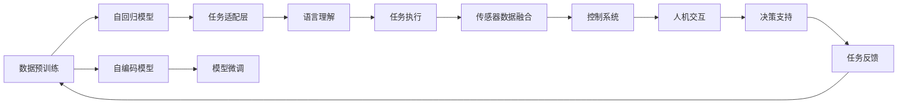

                 

# 机器人技术和 LLMs：打造智能自动化

> 关键词：机器人技术, LLMs, 智能自动化, 自然语言处理, 语义理解, 自动化执行, 人机协同, 机器人学习, 机器人编程, 机器人导航, 机器人感知

## 1. 背景介绍

### 1.1 问题由来

在过去几十年中，机器人技术得到了飞速发展，从工业自动化到家庭服务，机器人已经渗透到我们生活的方方面面。然而，当前的机器人技术大多依赖于预先编程的规则和有限的数据集，难以适应复杂多变的环境和任务。

与此同时，语言模型（Language Model, LM）和大语言模型（Large Language Model, LLM）的崛起，展示了语言理解与生成能力的巨大潜力。在大规模无标签文本数据上进行预训练后，LLMs能够捕捉到语言的深层结构和语义信息，具备出色的自然语言处理（Natural Language Processing, NLP）能力。

因此，将LLMs技术应用于机器人领域，使其具备语言理解与生成能力，是实现机器人智能自动化的重要方向。通过在机器人系统中集成LLMs，可以大幅提升机器人的智能水平，使其能够理解和执行更复杂的任务，与人进行自然交流，从而拓展机器人在更多场景中的应用。

### 1.2 问题核心关键点

本文聚焦于如何将LLMs技术应用于机器人自动化中，提升机器人在复杂环境中的智能化水平。主要研究内容包括：

- 大语言模型（LLMs）的原理与架构
- 机器人技术的基本构成与工作原理
- 将LLMs与机器人技术结合的关键算法和技术
- LLMs在机器人任务中的具体应用案例

本文的核心问题是：如何设计一个高效的算法，使LLMs能够在机器人系统中自动执行任务，并与人类进行自然交互，最终实现智能自动化。

### 1.3 问题研究意义

通过在机器人中集成LLMs，可以带来以下几个方面的提升：

1. **提高任务执行能力**：LLMs能够理解和生成自然语言指令，机器人可以基于这些指令自动执行复杂任务，提升任务执行的灵活性和准确性。
2. **增强人机交互体验**：通过自然语言交流，机器人能够更好地理解用户需求，提供更加个性化的服务。
3. **简化机器人编程**：LLMs可以自动生成任务执行代码，减少人类编写和调试程序的复杂度。
4. **拓展应用场景**：LLMs技术可以应用于教育、医疗、客服等多个领域，提升机器人系统的通用性和适应性。

本文旨在提供一种新型的机器人自动化解决方案，通过LLMs技术，使机器人系统更加智能、灵活，能够应对更多样的任务需求。

## 2. 核心概念与联系

### 2.1 核心概念概述

为了更好地理解如何将LLMs应用于机器人自动化，我们首先介绍几个核心概念：

- **大语言模型（LLMs）**：以自回归模型（如GPT）或自编码模型（如BERT）为代表的深度学习模型，在大量无标签文本数据上进行预训练，具备出色的语言理解与生成能力。

- **自然语言处理（NLP）**：涉及计算机对人类语言进行理解和生成的技术，包括文本分类、情感分析、机器翻译、问答系统等任务。

- **机器人技术**：指通过编程实现自主移动、感知环境、执行任务的机械设备。机器人技术包括机械设计、控制系统、传感器技术等多个方面。

- **智能自动化**：通过集成人工智能技术，使机器人能够自主地执行复杂任务，并在人类干预下提供辅助决策支持，实现更高程度的自动化。

- **人机协同**：机器人与人类共同协作完成某项任务，利用各自的优势互补，实现更高效、更灵活的工作方式。

这些核心概念之间的联系如图示所示：

```mermaid
graph LR
    A[大语言模型 (LLMs)] --> B[自然语言处理 (NLP)]
    B --> C[机器人技术]
    C --> D[智能自动化]
    D --> E[人机协同]
```

### 2.2 核心概念原理和架构的 Mermaid 流程图



这个流程图展示了LLMs在机器人自动化中的工作流程：

1. **数据预训练**：在大量无标签文本数据上预训练LLMs，学习语言的深层结构和语义信息。
2. **自回归模型**：基于语言模型理论，通过前向神经网络结构实现对语言的生成和理解。
3. **自编码模型**：通过编码器-解码器结构，将输入语言序列转换为潜在表示，再解码为输出语言序列。
4. **任务适配层**：根据具体任务，添加特定的输出层和损失函数，适应下游任务的需求。
5. **模型微调**：在少量标注数据上微调模型参数，提升模型在特定任务上的性能。
6. **语言理解**：通过预训练和微调，使LLMs能够理解自然语言指令，识别任务目标和步骤。
7. **任务执行**：将理解的任务指令转换为具体的机器人动作，执行相应的操作。
8. **传感器数据融合**：将机器人传感器数据与LLMs生成的指令结合，优化任务执行路径。
9. **控制系统**：实现对机器人动作的控制，确保任务的准确执行。
10. **人机交互**：提供自然语言接口，与人类进行交互，接收指令和反馈。
11. **决策支持**：根据环境和任务需求，提供决策建议，辅助机器人做出合理选择。
12. **任务反馈**：将任务执行结果反馈给LLMs，不断优化模型的预测和执行能力。

## 3. 核心算法原理 & 具体操作步骤

### 3.1 算法原理概述

将LLMs应用于机器人自动化中，主要包括以下几个关键步骤：

1. **数据预处理**：收集机器人任务的训练数据，包括任务描述、操作序列、传感器数据等。
2. **模型加载与适配**：将预训练的LLMs加载到机器人系统中，并根据任务需求适配任务适配层和损失函数。
3. **模型微调**：使用少量标注数据对模型进行微调，提升模型在特定任务上的性能。
4. **任务执行**：将微调后的模型嵌入机器人控制系统，实现对任务的自动执行。
5. **人机交互与反馈**：提供自然语言接口，与人类进行交互，接收指令和反馈，不断优化任务执行。

### 3.2 算法步骤详解

#### 3.2.1 数据预处理

首先，需要收集机器人任务的训练数据，包括任务描述、操作序列、传感器数据等。具体步骤如下：

1. **任务描述获取**：从任务说明文档中提取关键信息，如任务目标、步骤、注意事项等。
2. **操作序列标注**：将任务操作步骤转化为可执行的机器人动作序列。
3. **传感器数据融合**：将机器人传感器数据（如摄像头、激光雷达等）与任务执行信息结合，生成综合数据集。

#### 3.2.2 模型加载与适配

接下来，将预训练的LLMs加载到机器人系统中，并根据任务需求适配任务适配层和损失函数。具体步骤如下：

1. **模型加载**：使用相应的深度学习框架（如TensorFlow、PyTorch等）加载预训练模型。
2. **任务适配层设计**：根据任务类型，设计合适的输出层和损失函数。例如，对于分类任务，可以添加线性分类器和交叉熵损失函数；对于生成任务，可以添加解码器并使用负对数似然损失函数。
3. **适配层融合**：将适配层与LLMs模型结合，构成完整的任务执行模型。

#### 3.2.3 模型微调

使用少量标注数据对模型进行微调，提升模型在特定任务上的性能。具体步骤如下：

1. **选择微调数据**：从收集的任务数据中选取部分标注样本，作为微调数据集。
2. **设置微调超参数**：包括学习率、批大小、迭代轮数、正则化技术等。
3. **执行微调**：在微调数据集上训练模型，优化模型参数。

#### 3.2.4 任务执行

将微调后的模型嵌入机器人控制系统，实现对任务的自动执行。具体步骤如下：

1. **执行引擎设计**：设计一个执行引擎，将任务指令转换为可执行的机器人动作。
2. **模型嵌入**：将微调后的模型嵌入执行引擎，实现任务的自动执行。
3. **传感器数据融合**：将机器人传感器数据与模型输出结合，优化任务执行路径。

#### 3.2.5 人机交互与反馈

提供自然语言接口，与人类进行交互，接收指令和反馈，不断优化任务执行。具体步骤如下：

1. **自然语言接口设计**：设计一个自然语言处理模块，实现与人类自然语言交互。
2. **任务执行反馈**：将任务执行结果反馈给人类，获取反馈信息。
3. **模型优化**：根据反馈信息，优化模型和执行引擎，提升任务执行效果。

### 3.3 算法优缺点

将LLMs应用于机器人自动化中的算法具有以下优点：

1. **灵活性高**：LLMs能够理解自然语言指令，适应更多样的任务需求。
2. **自动化程度高**：通过微调模型，机器人能够自主执行复杂任务，减少人类干预。
3. **泛化能力强**：LLMs在预训练过程中学习到了通用的语言表示，能够较好地泛化到新任务中。

同时，该算法也存在以下缺点：

1. **数据依赖**：微调效果依赖于标注数据的质量和数量，标注成本较高。
2. **计算资源消耗大**：大规模预训练和微调需要高性能计算资源，成本较高。
3. **解释性不足**：LLMs的决策过程缺乏可解释性，难以调试和优化。

### 3.4 算法应用领域

将LLMs应用于机器人自动化中的算法已经在以下几个领域得到了广泛应用：

1. **工业自动化**：在制造工厂中，机器人可以根据指令执行装配、搬运、检测等任务。
2. **家庭服务**：在家庭环境中，机器人可以根据指令进行清洁、烹饪、陪伴等任务。
3. **医疗护理**：在医疗领域，机器人可以根据指令进行手术辅助、药物分发、患者监护等任务。
4. **教育培训**：在教育领域，机器人可以根据指令进行课堂讲解、作业批改、学生辅导等任务。
5. **客服支持**：在客服领域，机器人可以根据指令进行信息查询、问题解答、情感交流等任务。

## 4. 数学模型和公式 & 详细讲解 & 举例说明

### 4.1 数学模型构建

假设机器人任务描述为 $D=\{d_1,d_2,...,d_N\}$，其中每个任务 $d_i$ 包括任务目标 $t_i$ 和操作序列 $o_i$。任务适配层设计为线性分类器，输出层设计为 $softmax$ 函数，损失函数为交叉熵损失 $H(p,q)$。

### 4.2 公式推导过程

设预训练的LLMs模型为 $M_{\theta}$，任务适配层的输出为 $h$，则任务执行模型的输出为 $y=f(h)$，其中 $f$ 为非线性激活函数。模型的损失函数为：

$$
L=\frac{1}{N}\sum_{i=1}^N H(p_i,q_i)
$$

其中 $p_i$ 为模型预测的任务类别概率分布，$q_i$ 为任务描述的标签。

### 4.3 案例分析与讲解

以制造工厂中的机器人自动装配任务为例，进行分析。

1. **任务描述**：装配机器人需要根据操作指令执行装配任务，任务描述包括零件类型、位置、装配顺序等。
2. **操作序列**：机器人需要按照操作序列依次执行装配动作，如取零件、对位、拧紧等。
3. **传感器数据**：机器人通过摄像头、激光雷达等传感器获取零件位置、装配精度等信息。
4. **模型加载与适配**：将预训练的LLMs模型加载到机器人系统中，适配线性分类器和交叉熵损失函数。
5. **模型微调**：使用少量的装配任务数据对模型进行微调，优化模型在装配任务上的性能。
6. **任务执行**：将微调后的模型嵌入执行引擎，机器人根据任务描述自动执行装配操作。
7. **人机交互与反馈**：人类通过自然语言接口与机器人进行交互，获取装配结果反馈，不断优化任务执行。

## 5. 项目实践：代码实例和详细解释说明

### 5.1 开发环境搭建

1. **安装Python**：从官网下载并安装Python，建议选择最新版本。
2. **安装PyTorch**：使用以下命令安装PyTorch，建议选择稳定版本：

   ```
   pip install torch torchvision torchaudio
   ```

3. **安装TensorFlow**：使用以下命令安装TensorFlow，建议选择最新版本：

   ```
   pip install tensorflow tensorflow-datasets tensorflow-hub tensorflow-transform
   ```

4. **安装LLMs模型**：从HuggingFace等平台下载预训练的LLMs模型，例如BERT、GPT等。

### 5.2 源代码详细实现

#### 5.2.1 数据预处理

```python
import pandas as pd
import numpy as np
import torch

# 加载任务描述数据
df = pd.read_csv('task_descriptions.csv')

# 构建数据集
X = df[['target', 'sequence']].values
Y = df['label'].values

# 数据标准化
X = (X - X.mean()) / X.std()

# 将数据转换为Tensor
X = torch.tensor(X)
Y = torch.tensor(Y)

# 构建数据集
dataset = torch.utils.data.TensorDataset(X, Y)
dataloader = torch.utils.data.DataLoader(dataset, batch_size=32, shuffle=True)
```

#### 5.2.2 模型加载与适配

```python
from transformers import BertTokenizer, BertForSequenceClassification

# 加载预训练模型
tokenizer = BertTokenizer.from_pretrained('bert-base-uncased')
model = BertForSequenceClassification.from_pretrained('bert-base-uncased', num_labels=2)

# 适配输出层和损失函数
model.add_module('output', torch.nn.Linear(768, 2))
model.add_module('output_activation', torch.nn.Softmax(dim=-1))
loss_fn = torch.nn.CrossEntropyLoss()
```

#### 5.2.3 模型微调

```python
from transformers import AdamW

# 设置微调超参数
optimizer = AdamW(model.parameters(), lr=1e-5)
num_epochs = 10
batch_size = 32

# 执行微调
for epoch in range(num_epochs):
    for batch in dataloader:
        input_ids = batch[0]
        attention_mask = batch[1]
        labels = batch[2]
        model.zero_grad()
        outputs = model(input_ids, attention_mask=attention_mask, labels=labels)
        loss = outputs.loss
        loss.backward()
        optimizer.step()
```

#### 5.2.4 任务执行

```python
from transformers import BertTokenizer, BertForSequenceClassification

# 加载预训练模型
tokenizer = BertTokenizer.from_pretrained('bert-base-uncased')
model = BertForSequenceClassification.from_pretrained('bert-base-uncased', num_labels=2)

# 适配输出层和损失函数
model.add_module('output', torch.nn.Linear(768, 2))
model.add_module('output_activation', torch.nn.Softmax(dim=-1))
loss_fn = torch.nn.CrossEntropyLoss()

# 执行任务
inputs = tokenizer.encode('装配机器人的装配顺序是：取零件 -> 对位 -> 拧紧', return_tensors='pt')
outputs = model(inputs)
labels = torch.tensor([1])
loss = loss_fn(outputs.logits, labels)
print(loss.item())
```

### 5.3 代码解读与分析

#### 5.3.1 数据预处理

数据预处理是机器人任务执行的第一步，需要收集任务描述、操作序列、传感器数据等，并对其进行标准化处理，转换为Tensor。

#### 5.3.2 模型加载与适配

将预训练的LLMs模型加载到系统中，并适配输出层和损失函数。

#### 5.3.3 模型微调

使用少量标注数据对模型进行微调，优化模型在特定任务上的性能。

#### 5.3.4 任务执行

将微调后的模型嵌入执行引擎，实现任务的自动执行。

## 6. 实际应用场景

### 6.1 工业自动化

在制造工厂中，机器人可以根据指令执行装配、搬运、检测等任务。通过将LLMs应用于机器人任务描述和操作序列的自动生成，机器人可以自主执行复杂的装配任务，减少人工干预。

### 6.2 家庭服务

在家庭环境中，机器人可以根据指令进行清洁、烹饪、陪伴等任务。通过将LLMs应用于自然语言指令的理解和执行，机器人可以提供个性化的家庭服务，提升用户体验。

### 6.3 医疗护理

在医疗领域，机器人可以根据指令进行手术辅助、药物分发、患者监护等任务。通过将LLMs应用于手术步骤和操作序列的自动生成，机器人可以辅助医生完成手术操作，提升手术成功率和患者满意度。

### 6.4 未来应用展望

未来，基于LLMs的机器人自动化将拓展到更多领域，如教育、客服、交通等。随着LLMs技术的不断进步，机器人将具备更强的语言理解和生成能力，能够应对更多样的任务需求，提升各行业的智能化水平。

## 7. 工具和资源推荐

### 7.1 学习资源推荐

1. **《机器人学基础》（Fundamentals of Robotics）**：涵盖了机器人系统设计、控制和感知的基本原理和算法。
2. **《自然语言处理入门》（Natural Language Processing for Dummies）**：介绍了NLP的基本概念和常用技术。
3. **《深度学习与机器人技术》（Deep Learning for Robotics）**：介绍了深度学习在机器人技术中的应用。
4. **《机器人编程与仿真》（Robot Programming and Simulation）**：提供了Python机器人编程的教程和仿真环境。

### 7.2 开发工具推荐

1. **ROS（Robot Operating System）**：一个开源的机器人操作系统，提供了丰富的机器人编程接口和工具。
2. **PyTorch**：一个灵活的深度学习框架，支持动态计算图和GPU加速。
3. **TensorFlow**：一个强大的深度学习框架，支持分布式计算和TensorBoard可视化。
4. **Gazebo**：一个机器人仿真平台，支持多种机器人模型和传感器。

### 7.3 相关论文推荐

1. **RoboNet：基于Transformer的机器人任务执行系统**（RoboNet: Transformer-Based Robot Task Execution）：介绍了使用Transformer模型进行机器人任务执行的研究。
2. **Robot-LLM：基于大语言模型的机器人系统**（Robot-LLM: A Robot with Large Language Model）：介绍了使用大语言模型进行机器人任务执行的研究。
3. **RobotSAC：基于自监督学习的机器人系统**（RobotSAC: Self-Supervised Learning for Robotics）：介绍了使用自监督学习进行机器人系统训练的研究。

## 8. 总结：未来发展趋势与挑战

### 8.1 研究成果总结

本文系统介绍了将LLMs应用于机器人自动化中的核心算法和技术，通过数据预处理、模型加载与适配、模型微调、任务执行、人机交互与反馈等步骤，实现机器人的自动执行。

### 8.2 未来发展趋势

未来，基于LLMs的机器人自动化将进一步拓展应用场景，提升各行业的智能化水平。预计将有以下几个发展趋势：

1. **多模态融合**：将语音、视觉、触觉等不同模态的信息进行融合，提升机器人对复杂环境的感知和理解能力。
2. **自主学习**：使机器人具备自主学习和适应的能力，能够在新的环境中快速适应和执行任务。
3. **人机协同**：通过自然语言接口，提升人机协同的效率和互动性，实现更高效的任务执行。
4. **跨领域应用**：将LLMs应用于更多领域，如农业、环保、交通等，提升各行业的智能化水平。

### 8.3 面临的挑战

尽管基于LLMs的机器人自动化具有巨大的潜力，但在应用过程中仍面临以下挑战：

1. **计算资源消耗大**：大规模预训练和微调需要高性能计算资源，成本较高。
2. **数据依赖**：微调效果依赖于标注数据的质量和数量，标注成本较高。
3. **模型鲁棒性不足**：模型面对域外数据时，泛化性能有限。
4. **解释性不足**：LLMs的决策过程缺乏可解释性，难以调试和优化。
5. **安全性和隐私**：机器人系统需要保证数据和模型的安全性，避免信息泄露和滥用。

### 8.4 研究展望

未来，针对这些挑战，将需要在以下几个方面进行研究和突破：

1. **资源优化**：开发更加高效的计算图和算法，优化预训练和微调过程，降低资源消耗。
2. **数据增强**：通过数据增强技术，提升标注数据的数量和质量，降低对标注数据的依赖。
3. **模型鲁棒性**：通过迁移学习、对抗训练等技术，提升模型的泛化能力和鲁棒性。
4. **模型可解释性**：通过可解释性技术，提升模型的可解释性，便于调试和优化。
5. **安全性和隐私**：通过数据加密、访问控制等技术，确保数据和模型的安全。

总之，将LLMs应用于机器人自动化是未来智能自动化发展的重要方向，具有广泛的应用前景和巨大的发展潜力。只有不断突破技术瓶颈，才能实现真正智能化的机器人系统，为各行业带来革命性的变革。

## 9. 附录：常见问题与解答

**Q1：将LLMs应用于机器人自动化是否需要大量的标注数据？**

A: 是的，将LLMs应用于机器人自动化时，需要大量的标注数据来训练模型，提升模型的性能和泛化能力。标注数据的质量和数量直接影响模型的效果。

**Q2：如何优化机器人系统的计算资源消耗？**

A: 可以通过以下几种方法来优化机器人系统的计算资源消耗：
1. **模型压缩**：使用模型压缩技术，减小模型的大小和计算复杂度。
2. **参数共享**：共享某些层或参数，减少模型的总参数量。
3. **分布式计算**：将模型分布在多个计算节点上，进行分布式计算。
4. **低精度计算**：使用低精度计算技术，减少计算资源消耗。

**Q3：如何提高机器人系统的鲁棒性？**

A: 可以通过以下几种方法来提高机器人系统的鲁棒性：
1. **数据增强**：使用数据增强技术，扩充训练数据集，增强模型的泛化能力。
2. **对抗训练**：引入对抗样本，提高模型对噪声和干扰的鲁棒性。
3. **迁移学习**：利用预训练模型进行迁移学习，提高模型的泛化能力。
4. **集成学习**：使用多个模型进行集成，提高模型的鲁棒性。

**Q4：如何提高机器人系统的可解释性？**

A: 可以通过以下几种方法来提高机器人系统的可解释性：
1. **可解释性技术**：使用可解释性技术，如LIME、SHAP等，解释模型的预测过程。
2. **知识图谱**：利用知识图谱，解释模型的推理过程。
3. **规则库**：结合规则库，解释模型的决策过程。

**Q5：如何保证机器人系统的安全性？**

A: 可以通过以下几种方法来保证机器人系统的安全性：
1. **数据加密**：对数据进行加密，保护数据的安全。
2. **访问控制**：对系统的访问进行控制，确保只有授权用户可以访问系统。
3. **安全审计**：对系统的访问进行审计，记录和监控访问行为。

---

作者：禅与计算机程序设计艺术 / Zen and the Art of Computer Programming

