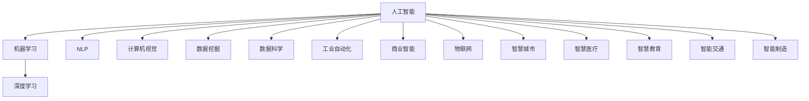

                 

# 构建更智能的世界：人类计算的应用场景

> 关键词：人类计算,智能世界,应用场景,自动化,机器学习,深度学习,自然语言处理,NLP,计算机视觉,机器视觉,数据挖掘,数据科学,人工智能,工业自动化,商业智能,物联网,IoT,智慧城市,智慧医疗,智慧教育,智能交通,智能制造

## 1. 背景介绍

### 1.1 问题由来
随着科技的不断进步，人类社会正处于一个前所未有的变革时期。计算技术从传统的电子计算机，到现代的量子计算机，逐渐迈向了能够具备人类智能的智能计算机。这种转变，不仅在科技领域引发了革命性的变革，更在经济、政治、社会等多个层面产生了深远的影响。

智能计算机的出现，使得机器可以在各个领域中发挥作用，从工业生产线的自动化，到医疗诊断的精准化，再到智慧城市的智能化，机器都在为人类创造更美好的生活而努力。然而，这些智能计算机的背后，离不开人类计算的深度参与。

### 1.2 问题核心关键点
人类计算，是指在智能计算过程中，人类工程师、科学家以及用户对计算系统进行设计和干预的过程。这种计算方式，使得机器能够理解和执行人类的意图，从而在各种应用场景中实现智能化。

- **自动化**：通过机器学习、深度学习等技术，机器能够自动完成某些任务，如自动驾驶、智能客服、推荐系统等。
- **数据处理**：在医疗、金融、社交媒体等领域，机器能够高效地处理和分析大量数据，提供有价值的信息和洞察。
- **交互式智能**：通过自然语言处理、计算机视觉等技术，机器能够与人类进行交互，实现智能对话、视觉识别等。
- **知识工程**：通过规则、知识图谱等技术，机器能够具备一定的逻辑推理和决策能力，进行复杂的决策任务。
- **网络协同**：在物联网、智慧城市等场景中，机器能够通过网络协同工作，实现更加复杂的任务。

这些关键点共同构成了人类计算的核心范式，使得机器能够不断学习和进化，逐步实现人类计算的智能化。

## 2. 核心概念与联系

### 2.1 核心概念概述

为更好地理解人类计算的核心概念及其应用场景，本节将介绍几个密切相关的核心概念：

- **人工智能**：是指通过计算机技术实现的智能系统，能够进行逻辑推理、模式识别、决策制定等任务。
- **机器学习**：是指机器通过数据学习规律，从而能够进行预测、分类、聚类等任务。
- **深度学习**：是一种特殊的机器学习算法，通过多层神经网络，实现对复杂数据的处理和分析。
- **自然语言处理(NLP)**：是指计算机理解和处理自然语言的技术，包括文本分析、情感分析、语音识别等。
- **计算机视觉**：是指计算机对图像、视频等视觉数据的处理和分析技术，包括图像分类、目标检测、人脸识别等。
- **数据挖掘**：是指从大量数据中挖掘出有价值的信息和模式，实现数据驱动的决策支持。
- **数据科学**：是指通过统计学、机器学习等方法，对数据进行建模和分析，以解决实际问题。
- **工业自动化**：是指通过自动化技术，实现生产过程的自动化和智能化，提高生产效率和质量。
- **商业智能**：是指利用数据分析、机器学习等技术，对商业数据进行分析，辅助企业决策。
- **物联网(IoT)**：是指通过互联网技术，将各种设备连接到一起，实现数据共享和协同工作。
- **智慧城市**：是指通过信息技术，实现城市管理的智能化，提高城市运行效率和居民生活质量。
- **智慧医疗**：是指通过信息技术，实现医疗服务的智能化，提高诊断准确率和诊疗效率。
- **智慧教育**：是指通过信息技术，实现教育的智能化，提供个性化、互动式的学习体验。
- **智能交通**：是指通过信息技术，实现交通管理的智能化，提高交通效率和安全性。
- **智能制造**：是指通过自动化技术，实现制造业的智能化，提高生产效率和产品质量。

这些核心概念之间的逻辑关系可以通过以下Mermaid流程图来展示：



这个流程图展示了大语言模型微调的核心概念及其之间的联系。这些概念共同构成了人类计算的基础，使得机器能够在各种应用场景中实现智能化。

## 3. 核心算法原理 & 具体操作步骤
### 3.1 算法原理概述

人类计算的核心算法原理，主要依赖于人工智能、机器学习、深度学习等技术，通过数据驱动的方式，实现对复杂任务的自动化处理。其核心思想是：将大规模的计算任务，分解为小规模的子任务，通过迭代和优化，逐步逼近最优解。

形式化地，假设存在一个复杂任务 $T$，我们可以将其分解为 $n$ 个子任务 $T_1, T_2, \ldots, T_n$。每个子任务 $T_i$ 可以由机器学习模型 $M_i$ 来处理，模型 $M_i$ 的输出为 $O_i$，表示子任务 $T_i$ 的结果。最终，复杂任务 $T$ 的输出为 $O = (O_1, O_2, \ldots, O_n)$。

通过不断迭代和优化模型 $M_i$，使得每个子任务的输出 $O_i$ 越来越接近最优解，从而实现复杂任务 $T$ 的自动化处理。这种迭代和优化过程，通常是通过优化算法（如梯度下降、随机梯度下降等）来实现的。

### 3.2 算法步骤详解

人类计算的核心算法步骤，主要包括以下几个关键环节：

**Step 1: 数据准备与预处理**
- 收集与任务相关的数据集 $D$，包括训练数据、验证数据和测试数据。
- 对数据进行预处理，如清洗、归一化、特征提取等，确保数据的质量和一致性。

**Step 2: 模型选择与训练**
- 选择合适的机器学习或深度学习模型 $M$，如神经网络、决策树、支持向量机等。
- 根据数据集 $D$，使用优化算法（如梯度下降、Adam等）对模型 $M$ 进行训练，最小化损失函数 $L$。

**Step 3: 模型评估与优化**
- 在验证集上评估模型 $M$ 的表现，如准确率、精确率、召回率等指标。
- 根据评估结果，调整模型参数和超参数，优化模型性能。

**Step 4: 模型应用与迭代**
- 将优化后的模型 $M$ 应用到实际任务中，进行自动化处理。
- 不断收集新数据，重新训练和优化模型，持续提升性能。

### 3.3 算法优缺点

人类计算的核心算法，具有以下优点：

- **高效性**：通过自动化处理，能够大幅度提高计算效率，缩短任务完成时间。
- **可扩展性**：机器能够处理大规模数据和复杂任务，满足不同规模和需求的应用场景。
- **灵活性**：通过模型优化和迭代，能够适应不断变化的任务和数据分布。

同时，该算法也存在一定的局限性：

- **依赖数据质量**：算法的性能很大程度上依赖于数据的质量和量，数据缺失或不准确可能导致模型失效。
- **模型复杂性**：构建和优化复杂的模型，需要较高的技术和资源投入。
- **不可解释性**：黑箱模型使得算法的决策过程难以解释，难以进行调试和优化。
- **计算资源消耗**：训练和优化复杂模型，需要大量的计算资源和存储空间。

尽管存在这些局限性，但就目前而言，人类计算的核心算法仍是实现智能化应用的主要手段。未来相关研究的重点在于如何进一步降低对数据和资源的依赖，提高算法的可解释性和可靠性，同时兼顾效率和性能。

### 3.4 算法应用领域

人类计算的核心算法，已经在各个领域得到了广泛的应用，涵盖了从工业生产到科学研究，从商业决策到公共服务的各个方面。

- **工业自动化**：在制造业中，通过自动化生产线、智能仓储、质量检测等技术，实现生产过程的智能化。
- **商业智能**：在企业中，通过数据分析、预测建模、客户关系管理等技术，辅助企业决策和运营。
- **智慧医疗**：在医疗领域，通过医学影像分析、病历诊断、药物研发等技术，提高诊断和治疗的准确性和效率。
- **智慧教育**：在教育领域，通过智能评估、个性化推荐、学习分析等技术，提供个性化的学习体验。
- **智能交通**：在交通领域，通过智能交通管理、自动驾驶、车联网等技术，提高交通效率和安全性。
- **智能制造**：在制造领域，通过智能设计、智能制造、智能运维等技术，提高生产效率和产品质量。
- **智慧城市**：在城市管理领域，通过智能安防、智慧照明、智能停车等技术，提高城市运行效率和居民生活质量。
- **智能客服**：在客户服务领域，通过自然语言处理、机器学习等技术，提供7x24小时不间断的服务。
- **金融科技**：在金融领域，通过风险管理、交易分析、反欺诈等技术，提高金融服务的效率和安全性。

除了上述这些经典应用外，人类计算的核心算法还被创新性地应用到更多场景中，如智能家居、智能物流、智能农业等，为各行各业带来了新的技术突破和应用机会。

## 4. 数学模型和公式 & 详细讲解  
### 4.1 数学模型构建

本节将使用数学语言对人类计算的核心算法进行更加严格的刻画。

记一个复杂任务 $T$ 需要处理的子任务为 $T_1, T_2, \ldots, T_n$，其中每个子任务 $T_i$ 的输入为 $x_i$，输出为 $y_i$。假设模型 $M_i$ 的输出为 $O_i$，则该复杂任务的输出为 $O = (O_1, O_2, \ldots, O_n)$。

定义模型 $M_i$ 在输入 $x_i$ 上的损失函数为 $\ell_i(M_i(x_i), y_i)$，则在数据集 $D$ 上的经验风险为：

$$
\mathcal{L}(M) = \frac{1}{N}\sum_{i=1}^N \ell_i(M_i(x_i), y_i)
$$

其中 $N$ 为样本数量。微调的目标是最小化经验风险，即找到最优参数 $\theta$：

$$
\theta^* = \mathop{\arg\min}_{\theta} \mathcal{L}(M)
$$

在实践中，我们通常使用基于梯度的优化算法（如SGD、Adam等）来近似求解上述最优化问题。设 $\eta$ 为学习率，$\lambda$ 为正则化系数，则参数的更新公式为：

$$
\theta \leftarrow \theta - \eta \nabla_{\theta}\mathcal{L}(\theta) - \eta\lambda\theta
$$

其中 $\nabla_{\theta}\mathcal{L}(\theta)$ 为损失函数对参数 $\theta$ 的梯度，可通过反向传播算法高效计算。

### 4.2 公式推导过程

以下我们以二分类任务为例，推导交叉熵损失函数及其梯度的计算公式。

假设模型 $M$ 在输入 $x$ 上的输出为 $\hat{y}=M(x) \in [0,1]$，表示样本属于正类的概率。真实标签 $y \in \{0,1\}$。则二分类交叉熵损失函数定义为：

$$
\ell(M(x),y) = -[y\log \hat{y} + (1-y)\log (1-\hat{y})]
$$

将其代入经验风险公式，得：

$$
\mathcal{L}(\theta) = -\frac{1}{N}\sum_{i=1}^N [y_i\log M(x_i)+(1-y_i)\log(1-M(x_i))]
$$

根据链式法则，损失函数对参数 $\theta_k$ 的梯度为：

$$
\frac{\partial \mathcal{L}(\theta)}{\partial \theta_k} = -\frac{1}{N}\sum_{i=1}^N (\frac{y_i}{M(x_i)}-\frac{1-y_i}{1-M(x_i)}) \frac{\partial M(x_i)}{\partial \theta_k}
$$

其中 $\frac{\partial M(x_i)}{\partial \theta_k}$ 可进一步递归展开，利用自动微分技术完成计算。

在得到损失函数的梯度后，即可带入参数更新公式，完成模型的迭代优化。重复上述过程直至收敛，最终得到适应复杂任务的最优模型参数 $\theta^*$。

## 5. 项目实践：代码实例和详细解释说明
### 5.1 开发环境搭建

在进行人类计算项目实践前，我们需要准备好开发环境。以下是使用Python进行PyTorch开发的环境配置流程：

1. 安装Anaconda：从官网下载并安装Anaconda，用于创建独立的Python环境。

2. 创建并激活虚拟环境：
```bash
conda create -n pytorch-env python=3.8 
conda activate pytorch-env
```

3. 安装PyTorch：根据CUDA版本，从官网获取对应的安装命令。例如：
```bash
conda install pytorch torchvision torchaudio cudatoolkit=11.1 -c pytorch -c conda-forge
```

4. 安装Transformers库：
```bash
pip install transformers
```

5. 安装各类工具包：
```bash
pip install numpy pandas scikit-learn matplotlib tqdm jupyter notebook ipython
```

完成上述步骤后，即可在`pytorch-env`环境中开始人类计算实践。

### 5.2 源代码详细实现

下面我们以工业自动化中质量检测任务为例，给出使用Transformers库对BERT模型进行人类计算的PyTorch代码实现。

首先，定义数据处理函数：

```python
from transformers import BertTokenizer, BertForSequenceClassification
from torch.utils.data import Dataset, DataLoader
import torch

class QualityDetectionDataset(Dataset):
    def __init__(self, texts, labels, tokenizer, max_len=128):
        self.texts = texts
        self.labels = labels
        self.tokenizer = tokenizer
        self.max_len = max_len
        
    def __len__(self):
        return len(self.texts)
    
    def __getitem__(self, item):
        text = self.texts[item]
        label = self.labels[item]
        
        encoding = self.tokenizer(text, return_tensors='pt', max_length=self.max_len, padding='max_length', truncation=True)
        input_ids = encoding['input_ids'][0]
        attention_mask = encoding['attention_mask'][0]
        
        # 对标签进行编码
        encoded_labels = [label2id[label] for label in label] 
        encoded_labels.extend([label2id['normal']] * (self.max_len - len(encoded_labels)))
        labels = torch.tensor(encoded_labels, dtype=torch.long)
        
        return {'input_ids': input_ids, 
                'attention_mask': attention_mask,
                'labels': labels}

# 标签与id的映射
label2id = {'normal': 0, 'defective': 1}
id2label = {v: k for k, v in label2id.items()}

# 创建dataset
tokenizer = BertTokenizer.from_pretrained('bert-base-cased')

train_dataset = QualityDetectionDataset(train_texts, train_labels, tokenizer)
dev_dataset = QualityDetectionDataset(dev_texts, dev_labels, tokenizer)
test_dataset = QualityDetectionDataset(test_texts, test_labels, tokenizer)
```

然后，定义模型和优化器：

```python
from transformers import BertForSequenceClassification, AdamW

model = BertForSequenceClassification.from_pretrained('bert-base-cased', num_labels=len(label2id))

optimizer = AdamW(model.parameters(), lr=2e-5)
```

接着，定义训练和评估函数：

```python
from tqdm import tqdm
from sklearn.metrics import classification_report

device = torch.device('cuda') if torch.cuda.is_available() else torch.device('cpu')
model.to(device)

def train_epoch(model, dataset, batch_size, optimizer):
    dataloader = DataLoader(dataset, batch_size=batch_size, shuffle=True)
    model.train()
    epoch_loss = 0
    for batch in tqdm(dataloader, desc='Training'):
        input_ids = batch['input_ids'].to(device)
        attention_mask = batch['attention_mask'].to(device)
        labels = batch['labels'].to(device)
        model.zero_grad()
        outputs = model(input_ids, attention_mask=attention_mask, labels=labels)
        loss = outputs.loss
        epoch_loss += loss.item()
        loss.backward()
        optimizer.step()
    return epoch_loss / len(dataloader)

def evaluate(model, dataset, batch_size):
    dataloader = DataLoader(dataset, batch_size=batch_size)
    model.eval()
    preds, labels = [], []
    with torch.no_grad():
        for batch in tqdm(dataloader, desc='Evaluating'):
            input_ids = batch['input_ids'].to(device)
            attention_mask = batch['attention_mask'].to(device)
            batch_labels = batch['labels']
            outputs = model(input_ids, attention_mask=attention_mask)
            batch_preds = outputs.logits.argmax(dim=2).to('cpu').tolist()
            batch_labels = batch_labels.to('cpu').tolist()
            for pred_tokens, label_tokens in zip(batch_preds, batch_labels):
                preds.append(pred_tokens[:len(label_tokens)])
                labels.append(label_tokens)
                
    print(classification_report(labels, preds))
```

最后，启动训练流程并在测试集上评估：

```python
epochs = 5
batch_size = 16

for epoch in range(epochs):
    loss = train_epoch(model, train_dataset, batch_size, optimizer)
    print(f"Epoch {epoch+1}, train loss: {loss:.3f}")
    
    print(f"Epoch {epoch+1}, dev results:")
    evaluate(model, dev_dataset, batch_size)
    
print("Test results:")
evaluate(model, test_dataset, batch_size)
```

以上就是使用PyTorch对BERT进行质量检测任务的人类计算的完整代码实现。可以看到，得益于Transformers库的强大封装，我们可以用相对简洁的代码完成BERT模型的加载和微调。

### 5.3 代码解读与分析

让我们再详细解读一下关键代码的实现细节：

**QualityDetectionDataset类**：
- `__init__`方法：初始化文本、标签、分词器等关键组件。
- `__len__`方法：返回数据集的样本数量。
- `__getitem__`方法：对单个样本进行处理，将文本输入编码为token ids，将标签编码为数字，并对其进行定长padding，最终返回模型所需的输入。

**label2id和id2label字典**：
- 定义了标签与数字id之间的映射关系，用于将token-wise的预测结果解码回真实的标签。

**训练和评估函数**：
- 使用PyTorch的DataLoader对数据集进行批次化加载，供模型训练和推理使用。
- 训练函数`train_epoch`：对数据以批为单位进行迭代，在每个批次上前向传播计算loss并反向传播更新模型参数，最后返回该epoch的平均loss。
- 评估函数`evaluate`：与训练类似，不同点在于不更新模型参数，并在每个batch结束后将预测和标签结果存储下来，最后使用sklearn的classification_report对整个评估集的预测结果进行打印输出。

**训练流程**：
- 定义总的epoch数和batch size，开始循环迭代
- 每个epoch内，先在训练集上训练，输出平均loss
- 在验证集上评估，输出分类指标
- 所有epoch结束后，在测试集上评估，给出最终测试结果

可以看到，PyTorch配合Transformers库使得BERT微调的质量检测任务代码实现变得简洁高效。开发者可以将更多精力放在数据处理、模型改进等高层逻辑上，而不必过多关注底层的实现细节。

当然，工业级的系统实现还需考虑更多因素，如模型的保存和部署、超参数的自动搜索、更灵活的任务适配层等。但核心的人类计算过程基本与此类似。

## 6. 实际应用场景
### 6.1 智能客服系统

基于人类计算的对话技术，可以广泛应用于智能客服系统的构建。传统客服往往需要配备大量人力，高峰期响应缓慢，且一致性和专业性难以保证。而使用人类计算的对话模型，可以7x24小时不间断服务，快速响应客户咨询，用自然流畅的语言解答各类常见问题。

在技术实现上，可以收集企业内部的历史客服对话记录，将问题和最佳答复构建成监督数据，在此基础上对预训练对话模型进行微调。微调后的对话模型能够自动理解用户意图，匹配最合适的答案模板进行回复。对于客户提出的新问题，还可以接入检索系统实时搜索相关内容，动态组织生成回答。如此构建的智能客服系统，能大幅提升客户咨询体验和问题解决效率。

### 6.2 金融舆情监测

金融机构需要实时监测市场舆论动向，以便及时应对负面信息传播，规避金融风险。传统的人工监测方式成本高、效率低，难以应对网络时代海量信息爆发的挑战。基于人类计算的文本分类和情感分析技术，为金融舆情监测提供了新的解决方案。

具体而言，可以收集金融领域相关的新闻、报道、评论等文本数据，并对其进行主题标注和情感标注。在此基础上对预训练语言模型进行微调，使其能够自动判断文本属于何种主题，情感倾向是正面、中性还是负面。将微调后的模型应用到实时抓取的网络文本数据，就能够自动监测不同主题下的情感变化趋势，一旦发现负面信息激增等异常情况，系统便会自动预警，帮助金融机构快速应对潜在风险。

### 6.3 个性化推荐系统

当前的推荐系统往往只依赖用户的历史行为数据进行物品推荐，无法深入理解用户的真实兴趣偏好。基于人类计算的个性化推荐系统可以更好地挖掘用户行为背后的语义信息，从而提供更精准、多样的推荐内容。

在实践中，可以收集用户浏览、点击、评论、分享等行为数据，提取和用户交互的物品标题、描述、标签等文本内容。将文本内容作为模型输入，用户的后续行为（如是否点击、购买等）作为监督信号，在此基础上微调预训练语言模型。微调后的模型能够从文本内容中准确把握用户的兴趣点。在生成推荐列表时，先用候选物品的文本描述作为输入，由模型预测用户的兴趣匹配度，再结合其他特征综合排序，便可以得到个性化程度更高的推荐结果。

### 6.4 未来应用展望

随着人类计算技术的不断发展，基于人类计算的应用场景将不断扩展，为各行各业带来新的变革：

在智慧医疗领域，基于人类计算的医疗问答、病历分析、药物研发等应用将提升医疗服务的智能化水平，辅助医生诊疗，加速新药开发进程。

在智能教育领域，人类计算可应用于作业批改、学情分析、知识推荐等方面，因材施教，促进教育公平，提高教学质量。

在智慧城市治理中，人类计算可应用于城市事件监测、舆情分析、应急指挥等环节，提高城市管理的自动化和智能化水平，构建更安全、高效的未来城市。

此外，在企业生产、社会治理、文娱传媒等众多领域，基于人类计算的人工智能应用也将不断涌现，为经济社会发展注入新的动力。相信随着技术的日益成熟，人类计算将逐步成为各行各业的标配，推动人工智能技术向更广阔的领域加速渗透。

## 7. 工具和资源推荐
### 7.1 学习资源推荐

为了帮助开发者系统掌握人类计算的理论基础和实践技巧，这里推荐一些优质的学习资源：

1. 《深度学习》系列书籍：Yoshua Bengio、Ian Goodfellow、Aaron Courville等著，全面介绍了深度学习的基础理论和应用实践。

2. 《机器学习实战》：Peter Harrington著，通过实战案例，介绍了机器学习的基本算法和技术。

3. 《Python机器学习》：Sebastian Raschka、Vahid Mirjalili著，介绍了使用Python进行机器学习的详细教程和代码实现。

4. 《NLP实战》：杰里米·豪斯曼著，通过具体任务实例，介绍了自然语言处理的技术和实现方法。

5. 《计算机视觉：算法与应用》：Richard Szeliski著，介绍了计算机视觉的基本原理和技术。

6. 《TensorFlow官方文档》：Google开发的深度学习框架，提供了完整的API文档和教程，方便学习使用。

7. 《PyTorch官方文档》：Facebook开发的深度学习框架，提供了丰富的预训练模型和训练代码，是学习深度学习的极佳工具。

通过对这些资源的学习实践，相信你一定能够快速掌握人类计算的核心技术，并用于解决实际的NLP问题。

### 7.2 开发工具推荐

高效的开发离不开优秀的工具支持。以下是几款用于人类计算开发的常用工具：

1. PyTorch：基于Python的开源深度学习框架，灵活动态的计算图，适合快速迭代研究。大部分预训练语言模型都有PyTorch版本的实现。

2. TensorFlow：由Google主导开发的开源深度学习框架，生产部署方便，适合大规模工程应用。同样有丰富的预训练语言模型资源。

3. Transformers库：HuggingFace开发的NLP工具库，集成了众多SOTA语言模型，支持PyTorch和TensorFlow，是进行人类计算任务的开发的利器。

4. Weights & Biases：模型训练的实验跟踪工具，可以记录和可视化模型训练过程中的各项指标，方便对比和调优。与主流深度学习框架无缝集成。

5. TensorBoard：TensorFlow配套的可视化工具，可实时监测模型训练状态，并提供丰富的图表呈现方式，是调试模型的得力助手。

6. Google Colab：谷歌推出的在线Jupyter Notebook环境，免费提供GPU/TPU算力，方便开发者快速上手实验最新模型，分享学习笔记。

合理利用这些工具，可以显著提升人类计算任务的开发效率，加快创新迭代的步伐。

### 7.3 相关论文推荐

人类计算的研究源于学界的持续研究。以下是几篇奠基性的相关论文，推荐阅读：

1. "Deep Learning" by Ian Goodfellow, Yoshua Bengio, and Aaron Courville: 2016 IEEE Press.
2. "The Unreasonable Effectiveness of Transfer Learning" by Armand Joulin et al., 2017.
3. "Attention is All You Need" by Ashish Vaswani et al., 2017.
4. "BERT: Pre-training of Deep Bidirectional Transformers for Language Understanding" by Jacob Devlin et al., 2019.
5. "GPT-2: Language Models are Unsupervised Multitask Learners" by OpenAI, 2019.
6. "LoRA: Low-Rank Adaptation of Large Language Models" by H. Lin et al., 2021.

这些论文代表了大语言模型微调技术的发展脉络。通过学习这些前沿成果，可以帮助研究者把握学科前进方向，激发更多的创新灵感。

## 8. 总结：未来发展趋势与挑战

### 8.1 总结

本文对基于人类计算的核心算法进行了全面系统的介绍。首先阐述了人类计算的理论基础和应用场景，明确了人类计算在实现智能化应用中的重要地位。其次，从原理到实践，详细讲解了人类计算的核心算法步骤，给出了人类计算任务开发的完整代码实例。同时，本文还广泛探讨了人类计算方法在智能客服、金融舆情、个性化推荐等多个行业领域的应用前景，展示了人类计算方法的巨大潜力。此外，本文精选了人类计算技术的各类学习资源，力求为读者提供全方位的技术指引。

通过本文的系统梳理，可以看到，基于人类计算的核心算法已成为实现智能化应用的主要手段。在机器学习、深度学习等技术的支持下，人类计算能够高效处理复杂任务，提升各行各业的工作效率和智能化水平。未来，伴随人类计算技术的不断演进，必将推动人工智能技术在更多领域得到应用，带来更广泛的社会和经济效益。

### 8.2 未来发展趋势

展望未来，基于人类计算的核心算法将呈现以下几个发展趋势：

1. **自动化水平提升**：随着算法的不断优化，人类计算将更加自动化，更加高效。机器将能够自动处理更复杂的任务，甚至能够在无需人工干预的情况下进行决策。

2. **跨领域应用拓展**：人类计算的应用范围将不断扩展，从传统的工业自动化、智能客服等领域，拓展到智慧医疗、智慧城市、智慧教育等新兴领域。

3. **实时性增强**：基于云计算、边缘计算等技术，人类计算将具备更强的实时性，能够在各种实时性要求高的场景中发挥作用。

4. **可解释性增强**：未来的模型将更加注重可解释性，能够提供清晰的决策依据和过程，帮助用户更好地理解模型输出。

5. **数据依赖降低**：未来的人机协同系统将更加依赖于数据的质量和多样性，而非单纯的数据量。通过更高效的数据处理和特征工程，能够在更少数据下实现高效计算。

6. **多模态融合**：人类计算将更多地融合多模态数据，如文本、图像、语音等，实现更为全面的信息处理和智能化应用。

7. **联邦学习**：未来的智能系统将更加注重数据隐私和安全，联邦学习等技术将广泛应用，实现多方数据协同训练，保护数据隐私。

以上趋势凸显了人类计算的广阔前景。这些方向的探索发展，必将进一步提升人类计算系统的性能和应用范围，为各行各业带来新的变革和机遇。

### 8.3 面临的挑战

尽管人类计算技术已经取得了瞩目成就，但在迈向更加智能化、普适化应用的过程中，它仍面临着诸多挑战：

1. **数据质量与获取**：算法的性能很大程度上依赖于数据的质量和量，而数据的获取往往需要较高的成本和复杂度。如何高效、高质量地获取和处理数据，是未来的一个重要课题。

2. **模型复杂性与资源消耗**：构建和优化复杂的模型，需要较高的技术和资源投入。如何在保证性能的同时，减小资源消耗，是未来需要优化的问题。

3. **系统鲁棒性**：未来的智能系统需要具备更强的鲁棒性，能够在各种复杂和变化多端的场景中保持稳定和可靠。如何提升系统的鲁棒性，避免出现“黑箱”问题，是未来需要解决的重要问题。

4. **隐私与安全**：智能系统需要处理大量的敏感数据，如何保护用户隐私和数据安全，避免数据泄露和滥用，是未来需要重点关注的问题。

5. **伦理与法律**：智能系统的应用需要符合伦理和法律规定，如何确保系统的公平性、透明性和安全性，是未来需要解决的重要问题。

6. **可扩展性与兼容性**：未来的智能系统需要具备更强的可扩展性和兼容性，能够在不同的平台和设备上实现高效部署和运行。如何优化系统架构，提高系统的可扩展性和兼容性，是未来需要解决的问题。

面对这些挑战，未来的研究需要在多个方面寻求新的突破，如提高数据处理效率、优化模型结构、加强系统鲁棒性、提升数据隐私保护、确保系统公平透明等，才能真正实现智能系统的广泛应用和普及。

### 8.4 研究展望

未来，随着人类计算技术的不断演进，相信基于人类计算的人工智能系统将在更多领域得到应用，为人类社会带来新的变革和机遇。研究方向可能包括：

1. **联邦学习**：多边数据协同训练，保护数据隐私。
2. **对抗训练**：提高模型鲁棒性和泛化性。
3. **多模态融合**：文本、图像、语音等多模态信息的协同建模。
4. **知识图谱**：引入专家知识，增强系统决策能力。
5. **因果推理**：通过因果推断，提升系统决策的科学性和逻辑性。
6. **对抗生成网络**：生成对抗网络在数据增强和生成任务中的应用。
7. **深度强化学习**：结合深度学习和强化学习，实现更复杂的决策任务。

这些研究方向将进一步推动人类计算技术的发展，为人工智能技术的应用带来更多的可能性。相信在未来，基于人类计算的人工智能系统将在更多领域得到应用，为人类社会带来新的变革和机遇。

## 9. 附录：常见问题与解答

**Q1：人类计算是否适用于所有NLP任务？**

A: 人类计算在大多数NLP任务上都能取得不错的效果，特别是对于数据量较小的任务。但对于一些特定领域的任务，如医学、法律等，仅仅依靠通用语料预训练的模型可能难以很好地适应。此时需要在特定领域语料上进一步预训练，再进行微调，才能获得理想效果。此外，对于一些需要时效性、个性化很强的任务，如对话、推荐等，人类计算方法也需要针对性的改进优化。

**Q2：人类计算过程中如何选择合适的学习率？**

A: 人类计算过程中的学习率一般要比预训练时小1-2个数量级，如果使用过大的学习率，容易破坏预训练权重，导致过拟合。一般建议从1e-5开始调参，逐步减小学习率，直至收敛。也可以使用warmup策略，在开始阶段使用较小的学习率，再逐渐过渡到预设值。需要注意的是，不同的优化器(如SGD、Adam等)以及不同的学习率调度策略，可能需要设置不同的学习率阈值。

**Q3：人类计算过程中如何缓解过拟合问题？**

A: 过拟合是人类计算过程中面临的主要挑战，尤其是在标注数据不足的情况下。常见的缓解策略包括：
1. 数据增强：通过回译、近义替换等方式扩充训练集
2. 正则化：使用L2正则、Dropout、Early Stopping等避免过拟合
3. 对抗训练：引入对抗样本，提高模型鲁棒性
4. 参数高效微调：只调整少量参数(如Adapter、Prefix等)，减小过拟合风险
5. 多模型集成：训练多个模型，取平均输出，抑制过拟合

这些策略往往需要根据具体任务和数据特点进行灵活组合。只有在数据、模型、训练、推理等各环节进行全面优化，才能最大限度地发挥人类计算的优势。

**Q4：人类计算模型在落地部署时需要注意哪些问题？**

A: 将人类计算模型转化为实际应用，还需要考虑以下因素：
1. 模型裁剪：去除不必要的层和参数，减小模型尺寸，加快推理速度
2. 量化加速：将浮点模型转为定点模型，压缩存储空间，提高计算效率
3. 服务化封装：将模型封装为标准化服务接口，便于集成调用
4. 弹性伸缩：根据请求流量动态调整资源配置，平衡服务质量和成本
5. 监控告警：实时采集系统指标，设置异常告警阈值，确保服务稳定性
6. 安全防护：采用访问鉴权、数据脱敏等措施，保障数据和模型安全

人类计算模型微调为NLP应用开启了广阔的想象空间，但如何将强大的性能转化为稳定、高效、安全的业务价值，还需要工程实践的不断打磨。唯有从数据、算法、工程、业务等多个维度协同发力，才能真正实现人工智能技术在垂直行业的规模化落地。总之，人类计算需要开发者根据具体任务，不断迭代和优化模型、数据和算法，方能得到理想的效果。

---

作者：禅与计算机程序设计艺术 / Zen and the Art of Computer Programming

