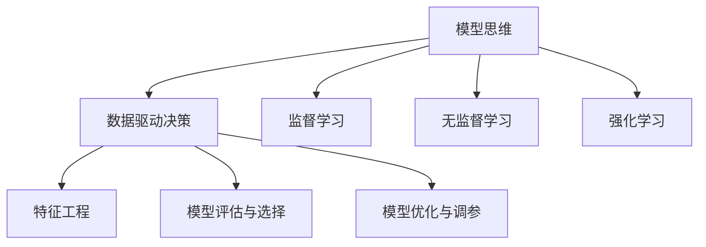

                 

## 1. 背景介绍

### 1.1 问题由来

在快速发展的数字时代，决策分析变得越来越复杂和多样。传统的决策分析方法，如经验判断、统计分析等，已无法满足日益增长的需求。近年来，随着人工智能和大数据技术的不断进步，模型思维作为一种量化、科学的决策方法，开始在各领域广泛应用。模型思维不仅能处理大量数据，还能通过机器学习等算法发现数据中的潜在规律，为决策提供可靠的依据。

然而，模型思维的广泛应用也带来了新的挑战。如何构建合适的模型，选择适合的算法，解释模型的输出，都是决策分析中需要解决的关键问题。本文旨在深入探讨模型思维在决策分析中的运用，从理论到实践，全面解析其核心原理和应用流程。

### 1.2 问题核心关键点

- **模型构建与选择**：选择何种模型，使用何种算法，如何构建和优化模型。
- **数据处理与特征工程**：如何处理和提取数据特征，构建特征集。
- **模型训练与优化**：如何训练模型，选择超参数，优化模型性能。
- **结果解释与应用**：如何解释模型输出，应用模型结果进行决策。

这些核心关键点涵盖了模型思维运用的全过程，对于构建可靠、高效的决策分析系统至关重要。

### 1.3 问题研究意义

模型思维在决策分析中的运用，对于提升决策的科学性和准确性，降低决策成本，具有重要意义：

1. **数据驱动**：通过数据驱动的方法，减少主观判断，提高决策的客观性和科学性。
2. **性能提升**：利用先进的算法和技术，提高决策效率和精度。
3. **风险控制**：通过模型训练和优化，识别和控制决策中的风险因素。
4. **应用广泛**：在金融、医疗、电商、供应链管理等多个领域，模型思维都能提供强有力的支持。

随着数据量的激增和算法技术的进步，模型思维在决策分析中的应用将更加广泛，成为提高决策质量和效率的重要手段。

## 2. 核心概念与联系

### 2.1 核心概念概述

为更好地理解模型思维在决策分析中的运用，本节将介绍几个关键概念：

- **模型思维**：基于数据和算法的决策分析方法，通过构建模型、训练模型、解释模型输出，实现科学决策。
- **数据驱动决策**：利用数据分析和算法模型，减少主观判断，提高决策的科学性和客观性。
- **监督学习**：通过标注数据训练模型，使其能够预测新样本的输出。
- **无监督学习**：利用未标注数据，发现数据中的潜在结构和规律。
- **强化学习**：通过奖励机制训练模型，使其在特定环境中采取最优策略。
- **特征工程**：从原始数据中提取、选择和构造特征，构建高质量的特征集。
- **模型评估与选择**：通过交叉验证、ROC曲线等方法，评估和选择最优模型。
- **模型优化与调参**：通过调整模型超参数和算法参数，提升模型性能。

这些概念之间的逻辑关系可以通过以下Mermaid流程图来展示：



这个流程图展示了模型思维运用的全过程：

1. 通过数据驱动的方式构建模型。
2. 选择适合的算法（监督、无监督或强化学习）进行模型训练。
3. 对模型进行特征工程，提取高质量特征集。
4. 使用交叉验证、ROC曲线等方法评估和选择最优模型。
5. 调整模型超参数和算法参数，优化模型性能。

这些概念共同构成了模型思维在决策分析中的核心框架，使其能够有效地处理各种决策问题。

## 3. 核心算法原理 & 具体操作步骤
### 3.1 算法原理概述

模型思维在决策分析中的核心原理，是通过构建模型、训练模型、解释模型输出，实现科学决策。其核心步骤包括：

1. **数据预处理**：清洗和标准化数据，构建特征集。
2. **模型构建**：选择适合的模型架构，进行模型训练。
3. **模型评估**：通过交叉验证等方法评估模型性能。
4. **模型选择**：选择最优模型。
5. **模型调优**：调整模型超参数和算法参数，优化模型性能。
6. **结果解释**：解释模型输出，提供决策依据。

### 3.2 算法步骤详解

#### 3.2.1 数据预处理

数据预处理是构建高质量模型的第一步。其核心步骤如下：

1. **数据清洗**：删除缺失值、异常值和重复数据，确保数据质量。
2. **特征提取**：从原始数据中提取和构造特征，构建特征集。
3. **特征选择**：选择最相关的特征，减少数据维度，提升模型性能。

#### 3.2.2 模型构建

模型构建阶段，需要选择合适的模型架构和算法，进行模型训练。其核心步骤如下：

1. **选择模型架构**：根据任务类型选择合适的模型，如线性回归、决策树、神经网络等。
2. **模型训练**：使用标注数据训练模型，学习数据特征和规律。
3. **模型评估**：通过交叉验证等方法评估模型性能，选择合适的模型。

#### 3.2.3 模型评估与选择

模型评估与选择是模型构建的重要环节。其核心步骤如下：

1. **交叉验证**：通过k折交叉验证等方法，评估模型性能，避免过拟合。
2. **模型选择**：选择最优模型，进行后续调优。

#### 3.2.4 模型调优

模型调优是提升模型性能的关键步骤。其核心步骤如下：

1. **超参数选择**：选择合适的超参数，如学习率、正则化系数等。
2. **模型调参**：通过网格搜索、随机搜索等方法调整超参数，优化模型性能。

#### 3.2.5 结果解释

结果解释是模型思维运用的最后一步。其核心步骤如下：

1. **模型输出**：使用训练好的模型预测新样本的输出。
2. **结果解释**：通过特征重要性分析、模型可解释性工具等，解释模型输出，提供决策依据。

### 3.3 算法优缺点

模型思维在决策分析中的运用，具有以下优点：

1. **数据驱动**：利用数据驱动的方法，减少主观判断，提高决策的客观性和科学性。
2. **性能提升**：通过先进算法和技术，提高决策效率和精度。
3. **可解释性**：通过特征重要性分析、模型可解释性工具等，解释模型输出，提供决策依据。

同时，模型思维也存在一些局限性：

1. **数据质量要求高**：对数据的清洗和标准化要求高，数据质量直接影响模型性能。
2. **模型选择困难**：模型选择和调参需要经验，需要大量的试错过程。
3. **结果解释难度大**：复杂模型的解释难度大，需要额外的技术手段和工具支持。
4. **过拟合风险**：在数据量不足或特征工程不当的情况下，容易发生过拟合。

尽管存在这些局限性，但就目前而言，模型思维仍是决策分析中最主流和有效的方法之一。未来相关研究将进一步降低对数据质量和模型选择的依赖，提高模型的可解释性和鲁棒性，提升决策分析的准确性和可靠性。

### 3.4 算法应用领域

模型思维在决策分析中的应用，几乎涵盖了所有领域。以下是几个典型应用领域：

1. **金融风险控制**：通过构建信用评分模型、信用风险预测模型等，评估贷款申请人的信用风险。
2. **医疗诊断**：构建疾病诊断模型、治疗效果评估模型等，辅助医生进行诊断和治疗决策。
3. **电商推荐系统**：构建用户行为分析模型、商品推荐模型等，提升用户购物体验和电商销售转化率。
4. **供应链管理**：构建库存优化模型、供应链风险评估模型等，提高供应链的效率和稳定性。
5. **智能交通**：构建交通流量预测模型、路径优化模型等，优化交通管理。

除了上述这些领域外，模型思维还被应用于更多场景中，如金融欺诈检测、网络安全、工业制造等，为决策分析提供了强有力的支持。

## 4. 数学模型和公式 & 详细讲解 & 举例说明

### 4.1 数学模型构建

本节将使用数学语言对模型思维运用的全过程进行更加严格的刻画。

记决策任务为 $Y=\{y_1, y_2, \ldots, y_n\}$，其中 $y_i \in \{0, 1\}$ 表示决策结果，即 $y_i=1$ 表示正确决策，$y_i=0$ 表示错误决策。设训练数据集为 $D=\{(x_i, y_i)\}_{i=1}^N$，其中 $x_i \in \mathcal{X}$ 表示输入特征，$y_i$ 表示决策结果。

定义模型 $M_{\theta}$ 在输入 $x$ 上的预测结果为 $\hat{y}=M_{\theta}(x)$，其中 $\theta$ 为模型参数。模型的目标是最小化分类错误率，即：

$$
\mathcal{L}(\theta) = \frac{1}{N}\sum_{i=1}^N \ell(\hat{y_i}, y_i)
$$

其中 $\ell(\hat{y_i}, y_i)$ 为损失函数，如交叉熵损失、均方误差损失等。

### 4.2 公式推导过程

以下我们以二分类任务为例，推导交叉熵损失函数及其梯度的计算公式。

假设模型 $M_{\theta}$ 在输入 $x$ 上的输出为 $\hat{y}=M_{\theta}(x) \in [0,1]$，表示样本属于正类的概率。真实标签 $y \in \{0,1\}$。则二分类交叉熵损失函数定义为：

$$
\ell(M_{\theta}(x),y) = -[y\log \hat{y} + (1-y)\log (1-\hat{y})]
$$

将其代入经验风险公式，得：

$$
\mathcal{L}(\theta) = -\frac{1}{N}\sum_{i=1}^N [y_i\log M_{\theta}(x_i)+(1-y_i)\log(1-M_{\theta}(x_i))]
$$

根据链式法则，损失函数对参数 $\theta_k$ 的梯度为：

$$
\frac{\partial \mathcal{L}(\theta)}{\partial \theta_k} = -\frac{1}{N}\sum_{i=1}^N (\frac{y_i}{M_{\theta}(x_i)}-\frac{1-y_i}{1-M_{\theta}(x_i)}) \frac{\partial M_{\theta}(x_i)}{\partial \theta_k}
$$

其中 $\frac{\partial M_{\theta}(x_i)}{\partial \theta_k}$ 可进一步递归展开，利用自动微分技术完成计算。

在得到损失函数的梯度后，即可带入参数更新公式，完成模型的迭代优化。重复上述过程直至收敛，最终得到适应决策任务的最优模型参数 $\theta^*$。

### 4.3 案例分析与讲解

以下我们以信用风险评估模型为例，展示模型思维在决策分析中的应用。

**案例背景**：某银行希望构建一个信用评分模型，评估客户的信用风险。银行收集了大量客户的个人信息、历史交易数据和信用记录，用于训练模型。

**数据处理**：

1. **数据清洗**：删除缺失值、异常值和重复数据，确保数据质量。
2. **特征提取**：从原始数据中提取和构造特征，如年龄、婚姻状况、收入、负债等。
3. **特征选择**：选择最相关的特征，减少数据维度，提升模型性能。

**模型构建**：

1. **选择模型架构**：选择逻辑回归模型，构建信用评分模型。
2. **模型训练**：使用标注数据训练模型，学习数据特征和规律。
3. **模型评估**：通过交叉验证等方法评估模型性能，选择合适的模型。

**模型调优**：

1. **超参数选择**：选择合适的超参数，如学习率、正则化系数等。
2. **模型调参**：通过网格搜索、随机搜索等方法调整超参数，优化模型性能。

**结果解释**：

1. **模型输出**：使用训练好的模型预测新客户的信用评分。
2. **结果解释**：通过特征重要性分析、模型可解释性工具等，解释模型输出，提供决策依据。

通过以上步骤，银行可以构建一个高效、科学的信用风险评估模型，辅助银行进行贷款审批和风险控制。

## 5. 项目实践：代码实例和详细解释说明

### 5.1 开发环境搭建

在进行模型思维运用的实践前，我们需要准备好开发环境。以下是使用Python进行Scikit-learn开发的环境配置流程：

1. 安装Anaconda：从官网下载并安装Anaconda，用于创建独立的Python环境。

2. 创建并激活虚拟环境：
```bash
conda create -n model-env python=3.8 
conda activate model-env
```

3. 安装Scikit-learn：从官网获取安装命令，如：
```bash
conda install scikit-learn
```

4. 安装各类工具包：
```bash
pip install numpy pandas scikit-learn matplotlib tqdm jupyter notebook ipython
```

完成上述步骤后，即可在`model-env`环境中开始模型构建实践。

### 5.2 源代码详细实现

下面我们以信用风险评估模型为例，给出使用Scikit-learn构建逻辑回归模型的PyTorch代码实现。

首先，定义模型和数据：

```python
from sklearn.linear_model import LogisticRegression
from sklearn.model_selection import train_test_split
import pandas as pd
import numpy as np

# 加载数据集
data = pd.read_csv('credit_data.csv')

# 定义特征和标签
X = data[['age', 'income', 'married', 'education']]
y = data['default']

# 划分训练集和测试集
X_train, X_test, y_train, y_test = train_test_split(X, y, test_size=0.2, random_state=42)
```

然后，训练逻辑回归模型：

```python
# 定义模型
model = LogisticRegression()

# 训练模型
model.fit(X_train, y_train)

# 评估模型
y_pred = model.predict(X_test)
print(classification_report(y_test, y_pred))
```

接着，使用交叉验证评估模型性能：

```python
from sklearn.model_selection import cross_val_score

# 使用交叉验证评估模型性能
scores = cross_val_score(model, X_train, y_train, cv=5)
print('交叉验证得分:', scores.mean())
```

最后，输出模型参数和特征重要性：

```python
# 输出模型参数
print(model.coef_)

# 输出特征重要性
importances = model.coef_[0]
indices = np.argsort(importances)[-10:]
plt.title('特征重要性')
plt.barh(range(len(indices)), importances[indices], color='b', align='center')
plt.yticks(range(len(indices)), [X.columns[i] for i in indices])
plt.xlabel('特征重要性')
plt.show()
```

以上就是使用Scikit-learn构建逻辑回归模型的完整代码实现。可以看到，Scikit-learn的API简洁易用，模型构建和评估都非常方便。

### 5.3 代码解读与分析

让我们再详细解读一下关键代码的实现细节：

**数据预处理**：
- `pd.read_csv()`：从文件中加载数据集。
- `train_test_split()`：将数据集划分为训练集和测试集。

**模型构建**：
- `LogisticRegression()`：定义逻辑回归模型。
- `model.fit()`：使用训练集训练模型。

**模型评估**：
- `classification_report()`：输出模型的分类报告。
- `cross_val_score()`：使用交叉验证评估模型性能。

**结果解释**：
- `model.coef_`：输出模型的系数，用于解释特征的重要性。
- `plt.barh()`：使用matplotlib绘制特征重要性的条形图。

可以看到，Scikit-learn提供了强大的模型构建和评估工具，使得模型思维在决策分析中的应用变得非常便捷和高效。

当然，工业级的系统实现还需考虑更多因素，如模型保存和部署、超参数自动搜索、更灵活的特征工程等。但核心的模型构建和评估逻辑基本与此类似。

## 6. 实际应用场景

### 6.1 金融风险控制

模型思维在金融风险控制中的应用，可以通过构建信用评分模型、信用风险预测模型等，评估贷款申请人的信用风险。

在技术实现上，可以收集大量客户的个人信息、历史交易数据和信用记录，构建特征集。然后使用逻辑回归、决策树、神经网络等算法，构建信用评分模型。通过交叉验证、ROC曲线等方法评估模型性能，选择最优模型。最终使用训练好的模型进行信用风险评估，辅助银行进行贷款审批和风险控制。

### 6.2 医疗诊断

模型思维在医疗诊断中的应用，可以通过构建疾病诊断模型、治疗效果评估模型等，辅助医生进行诊断和治疗决策。

在技术实现上，可以收集患者的病历数据、实验室检查结果等，构建特征集。然后使用支持向量机、随机森林、深度学习等算法，构建疾病诊断模型和治疗效果评估模型。通过交叉验证、ROC曲线等方法评估模型性能，选择最优模型。最终使用训练好的模型进行疾病诊断和治疗效果评估，辅助医生进行诊断和治疗决策。

### 6.3 电商推荐系统

模型思维在电商推荐系统中的应用，可以通过构建用户行为分析模型、商品推荐模型等，提升用户购物体验和电商销售转化率。

在技术实现上，可以收集用户的历史浏览、购买、评价等数据，构建特征集。然后使用协同过滤、内容推荐、深度学习等算法，构建用户行为分析模型和商品推荐模型。通过交叉验证、ROC曲线等方法评估模型性能，选择最优模型。最终使用训练好的模型进行用户推荐和商品推荐，提升用户购物体验和电商销售转化率。

### 6.4 智能交通

模型思维在智能交通中的应用，可以通过构建交通流量预测模型、路径优化模型等，优化交通管理。

在技术实现上，可以收集交通流量、道路状况、天气等数据，构建特征集。然后使用时间序列分析、神经网络等算法，构建交通流量预测模型和路径优化模型。通过交叉验证、ROC曲线等方法评估模型性能，选择最优模型。最终使用训练好的模型进行交通流量预测和路径优化，优化交通管理。

### 6.5 未来应用展望

随着模型思维在决策分析中的应用不断深入，其未来前景广阔，将在更多领域得到应用：

- **智慧医疗**：通过构建医疗决策支持系统、智能诊疗系统等，提升医疗服务水平和效率。
- **智能制造**：通过构建供应链优化模型、设备故障预测模型等，提升制造企业的运营效率。
- **智能客服**：通过构建智能问答系统、情感分析模型等，提升客户服务体验。
- **智慧物流**：通过构建仓储管理优化模型、配送路径优化模型等，提升物流企业的运营效率。

未来，随着数据量的激增和算法技术的进步，模型思维在决策分析中的应用将更加广泛，为各行各业带来更多的变革和创新。

## 7. 工具和资源推荐

### 7.1 学习资源推荐

为了帮助开发者系统掌握模型思维在决策分析中的运用，这里推荐一些优质的学习资源：

1. 《模型思维》系列书籍：介绍模型思维的基本概念和应用方法，适合初学者入门。
2. 《机器学习实战》：通过实际案例展示机器学习算法在各领域的应用，帮助读者理解和应用机器学习。
3. 《深度学习》：深入讲解深度学习算法和应用，适合对深度学习感兴趣的读者。
4. Kaggle竞赛平台：通过实际数据集和竞赛任务，锻炼数据处理和模型构建能力。
5. Coursera在线课程：提供系统性、高质量的机器学习和深度学习课程，适合在线学习。

通过对这些资源的学习实践，相信你一定能够快速掌握模型思维的基本原理和应用方法，并用于解决实际的决策问题。

### 7.2 开发工具推荐

高效的开发离不开优秀的工具支持。以下是几款用于模型思维开发的常用工具：

1. Scikit-learn：Python中的经典机器学习库，提供了丰富的模型构建和评估工具，简单易用。
2. TensorFlow和PyTorch：深度学习领域的主流框架，支持广泛的模型构建和训练。
3. Jupyter Notebook：交互式的数据科学开发环境，支持代码执行和可视化。
4. Weights & Biases：模型训练的实验跟踪工具，可以记录和可视化模型训练过程中的各项指标，方便对比和调优。
5. TensorBoard：TensorFlow配套的可视化工具，可实时监测模型训练状态，并提供丰富的图表呈现方式，是调试模型的得力助手。

合理利用这些工具，可以显著提升模型思维在决策分析中的开发效率，加快创新迭代的步伐。

### 7.3 相关论文推荐

模型思维在决策分析中的应用，得益于学界的持续研究。以下是几篇奠基性的相关论文，推荐阅读：

1. "A Course in Machine Learning"：斯坦福大学的入门课程，系统介绍机器学习和深度学习的基本概念和方法。
2. "Pattern Recognition and Machine Learning"：机器学习领域的经典教材，深入讲解各种机器学习算法。
3. "Deep Learning"：深度学习领域的经典教材，介绍深度学习算法和应用。
4. "Statistical Learning Theory"：机器学习理论基础，介绍统计学习的基本原理和方法。
5. "The Elements of Statistical Learning"：机器学习理论基础，深入讲解统计学习的基本原理和方法。

这些论文代表了大模型思维的研究脉络，通过学习这些前沿成果，可以帮助研究者把握学科前进方向，激发更多的创新灵感。

## 8. 总结：未来发展趋势与挑战

### 8.1 总结

本文对模型思维在决策分析中的运用进行了全面系统的介绍。首先阐述了模型思维的基本原理和应用背景，明确了模型思维在决策分析中的独特价值。其次，从理论到实践，详细讲解了模型思维运用的全过程，包括数据预处理、模型构建、模型评估、结果解释等关键步骤。最后，本文还探讨了模型思维在实际应用中的挑战和未来发展方向，提出了一些可行的解决方案。

通过本文的系统梳理，可以看到，模型思维在决策分析中的运用，具有广泛的应用前景和深远的社会意义。未来，随着数据量的激增和算法技术的进步，模型思维将在更多领域得到应用，为各行各业带来更多的变革和创新。

### 8.2 未来发展趋势

展望未来，模型思维在决策分析中的应用将呈现以下几个发展趋势：

1. **模型自动化**：自动化机器学习技术的发展，将使得模型构建和调优过程更加自动化，减少人工干预，提高效率。
2. **模型可解释性**：模型的可解释性将变得更加重要，通过模型可视化、特征重要性分析等方法，增强模型输出的可信度和可理解性。
3. **跨领域应用**：模型思维将突破原有领域，应用于更多场景，如智能制造、智能交通、智能农业等，推动各行各业的智能化转型。
4. **多模态融合**：模型思维将融合多模态数据，如文本、图像、语音等，实现更加全面、准确的决策分析。
5. **在线学习**：通过在线学习技术，模型可以持续更新，适应数据分布的变化，保持高性能。
6. **隐私保护**：在数据隐私保护的要求下，模型思维将更加注重数据安全，采用联邦学习、差分隐私等技术，保护用户隐私。

以上趋势凸显了模型思维在决策分析中的广阔前景，这些方向的探索发展，必将进一步提升决策分析的准确性和效率，为各行各业带来更多的变革和创新。

### 8.3 面临的挑战

尽管模型思维在决策分析中的应用已经取得了显著进展，但在迈向更加智能化、普适化应用的过程中，仍面临诸多挑战：

1. **数据质量要求高**：对数据的清洗和标准化要求高，数据质量直接影响模型性能。
2. **模型选择困难**：模型选择和调参需要经验，需要大量的试错过程。
3. **结果解释难度大**：复杂模型的解释难度大，需要额外的技术手段和工具支持。
4. **过拟合风险**：在数据量不足或特征工程不当的情况下，容易发生过拟合。
5. **隐私保护**：在数据隐私保护的要求下，模型思维将更加注重数据安全，采用联邦学习、差分隐私等技术，保护用户隐私。

尽管存在这些挑战，但未来的研究需要在以下几个方面寻求新的突破：

1. **自动化机器学习**：开发自动化机器学习工具，减少人工干预，提高模型构建和调优的效率。
2. **模型可解释性**：开发模型可解释性工具，增强模型输出的可信度和可理解性。
3. **跨领域应用**：推动模型思维在更多领域的融合应用，提升各行各业的智能化水平。
4. **多模态融合**：推动多模态数据融合，实现更加全面、准确的决策分析。
5. **在线学习**：开发在线学习技术，使模型持续更新，适应数据分布的变化。
6. **隐私保护**：采用联邦学习、差分隐私等技术，保护用户隐私。

这些研究方向将进一步推动模型思维在决策分析中的应用，为各行各业带来更多的变革和创新。

### 8.4 研究展望

面向未来，模型思维在决策分析中的研究将持续深入，探索更多前沿技术：

1. **自动化机器学习**：开发自动化机器学习工具，减少人工干预，提高模型构建和调优的效率。
2. **模型可解释性**：开发模型可解释性工具，增强模型输出的可信度和可理解性。
3. **跨领域应用**：推动模型思维在更多领域的融合应用，提升各行各业的智能化水平。
4. **多模态融合**：推动多模态数据融合，实现更加全面、准确的决策分析。
5. **在线学习**：开发在线学习技术，使模型持续更新，适应数据分布的变化。
6. **隐私保护**：采用联邦学习、差分隐私等技术，保护用户隐私。

这些研究方向将进一步推动模型思维在决策分析中的应用，为各行各业带来更多的变革和创新。

## 9. 附录：常见问题与解答

**Q1：模型思维在决策分析中的核心优势是什么？**

A: 模型思维在决策分析中的核心优势主要体现在以下几个方面：

1. **数据驱动**：利用数据驱动的方法，减少主观判断，提高决策的客观性和科学性。
2. **性能提升**：通过先进算法和技术，提高决策效率和精度。
3. **可解释性**：通过特征重要性分析、模型可解释性工具等，解释模型输出，提供决策依据。

**Q2：模型思维在决策分析中如何构建高质量的特征集？**

A: 构建高质量的特征集是模型思维应用的关键步骤。以下是构建特征集的步骤：

1. **数据清洗**：删除缺失值、异常值和重复数据，确保数据质量。
2. **特征提取**：从原始数据中提取和构造特征，如年龄、收入、历史行为等。
3. **特征选择**：选择最相关的特征，减少数据维度，提升模型性能。

**Q3：模型思维在决策分析中如何选择最优模型？**

A: 选择最优模型是模型思维应用的重要环节。以下是选择最优模型的步骤：

1. **模型构建**：选择适合的模型架构，进行模型训练。
2. **模型评估**：通过交叉验证等方法评估模型性能，选择合适的模型。

**Q4：模型思维在决策分析中如何解释模型输出？**

A: 解释模型输出是模型思维应用的关键步骤。以下是解释模型输出的方法：

1. **特征重要性分析**：通过特征重要性分析，了解哪些特征对模型预测有重要影响。
2. **模型可视化**：通过模型可视化工具，理解模型决策的内部机制。
3. **可解释性工具**：使用可解释性工具，如LIME、SHAP等，解释模型的决策过程。

**Q5：模型思维在决策分析中如何应对数据隐私问题？**

A: 应对数据隐私问题是模型思维应用的重要挑战。以下是一些应对方法：

1. **差分隐私**：在模型训练和评估过程中，引入噪声保护用户隐私。
2. **联邦学习**：在分布式环境中，通过联邦学习技术，保护数据隐私。
3. **匿名化处理**：对数据进行匿名化处理，防止数据泄露。

这些方法能够有效保护数据隐私，同时保证模型的性能和效果。

---

作者：禅与计算机程序设计艺术 / Zen and the Art of Computer Programming

