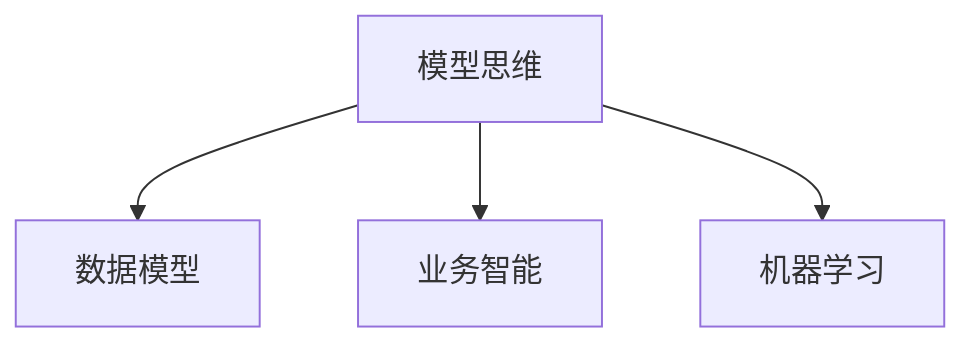

                 

# 模型思维在管理培训中的运用

> 关键词：模型思维,管理培训,数据模型,业务智能,Business Intelligence(BI),机器学习

## 1. 背景介绍

在当今信息爆炸的时代，管理者面临的环境越来越复杂，需要处理的数据量越来越大，决策的难度也随之增加。传统的经验决策方式已经不能满足现代管理的需求，管理培训需要引入更加科学、系统的方法来提高管理者的决策能力。模型思维就是在这样的背景下提出的一种新型的管理思维方法，它将数据驱动的方法引入到管理决策中，通过构建模型来预测未来、优化资源配置和提升决策质量。

模型思维的核心理念是：通过构建和分析数据模型，将数据转化为知识和决策依据，从而提升管理的科学性和效率。它不仅适用于金融、电商等数据驱动的行业，同样在传统行业的管理培训中也有广泛的应用前景。

## 2. 核心概念与联系

### 2.1 核心概念概述

为了更好地理解模型思维在管理培训中的应用，本节将介绍几个关键概念：

- 模型思维(Model Thinking)：一种基于数据驱动的管理思维方法，通过构建和分析模型来提升管理决策的科学性和有效性。
- 数据模型(Data Model)：由数据、模型结构和分析方法组成的系统，用于描述和管理数据，并从中提取有用的信息。
- 业务智能(Business Intelligence, BI)：一种数据驱动的决策支持技术，通过数据仓库、数据挖掘、数据可视化等技术，帮助企业管理者从大量数据中发现业务规律和商业机会。
- 机器学习(Machine Learning, ML)：一种通过算法和模型训练机器自动从数据中学习的技术，可以用于构建预测模型和优化模型。

这些核心概念之间的联系可以通过以下Mermaid流程图来展示：



这个流程图展示了一些关键概念之间的联系：

1. 模型思维基于数据模型，通过构建和分析模型来提升管理决策。
2. 业务智能是模型思维的一种应用，通过数据仓库、数据挖掘等技术，辅助管理者发现商业规律。
3. 机器学习则是构建数据模型的重要手段，通过算法和模型训练，从数据中提取规律和知识。

## 3. 核心算法原理 & 具体操作步骤

### 3.1 算法原理概述

模型思维在管理培训中的运用，主要涉及数据模型构建、业务智能分析和机器学习模型训练等核心算法。其核心思想是：通过构建数据模型和优化模型，从大量数据中发现规律，辅助管理决策，提升资源配置效率和决策质量。

形式化地，假设管理者需要处理的数据集为 $D=\{(x_i, y_i)\}_{i=1}^N$，其中 $x_i$ 为输入特征，$y_i$ 为输出结果。模型思维的目标是构建一个模型 $M$，使得 $M$ 能够尽可能准确地预测未来的输出 $y_{new}$。

数学上，模型的目标是找到最优参数 $\theta$，使得模型的预测值 $M(x_{new}, \theta)$ 与真实值 $y_{new}$ 之间的误差最小化，即：

$$
\theta^* = \mathop{\arg\min}_{\theta} \sum_{i=1}^N \mathcal{L}(M(x_i, \theta), y_i)
$$

其中 $\mathcal{L}$ 为损失函数，可以是均方误差、交叉熵等。

### 3.2 算法步骤详解

基于模型思维的管理培训，一般包括以下几个关键步骤：

**Step 1: 数据收集与清洗**
- 收集与培训目标相关的数据，如销售数据、客户反馈、财务数据等。
- 对数据进行清洗，去除噪声和异常值，保证数据的准确性和一致性。

**Step 2: 构建数据模型**
- 选择合适的模型结构，如线性回归、决策树、随机森林等，根据数据特征和分析目的构建模型。
- 使用训练数据集训练模型，优化模型参数，得到最终的预测模型。

**Step 3: 数据分析与可视化**
- 利用数据可视化工具，如Tableau、Power BI等，将数据模型分析结果可视化，辅助管理者理解模型结果。
- 使用数据挖掘技术，如关联规则挖掘、聚类分析等，发现数据中的规律和趋势。

**Step 4: 业务智能应用**
- 将数据模型和分析结果应用于实际业务决策中，如销售预测、客户细分、财务分析等。
- 根据模型预测结果，制定相应的业务策略，优化资源配置和业务流程。

**Step 5: 持续优化**
- 定期更新数据模型，加入新的数据和业务信息，提升模型的准确性和适用性。
- 根据模型预测结果和业务反馈，不断优化模型结构，改进决策过程。

### 3.3 算法优缺点

模型思维在管理培训中具有以下优点：
1. 提升决策科学性：通过构建和分析数据模型，能够从大量数据中发现规律，辅助管理者做出更加科学、合理的决策。
2. 提高资源配置效率：通过优化模型和分析结果，可以优化资源配置和业务流程，提升企业运营效率。
3. 支持数据驱动的培训：通过数据驱动的培训方式，能够提高培训效果，增强管理者的数据分析和决策能力。

同时，该方法也存在一定的局限性：
1. 数据依赖度高：模型思维依赖高质量、大样本量的数据，数据不足或数据质量不高，可能影响模型效果。
2. 模型复杂度高：复杂的模型结构和算法，需要较高的计算资源和时间成本。
3. 对业务理解要求高：构建和分析模型需要管理者对业务有深入的理解，否则容易出现误导性结果。
4. 结果解释性差：数据模型和分析结果有时难以解释，管理者难以理解其背后的逻辑和原因。

尽管存在这些局限性，但就目前而言，模型思维是提升管理决策科学性的重要手段，已经在大企业和管理培训中得到了广泛的应用。未来相关研究的重点在于如何进一步降低数据依赖，提高模型的可解释性，同时兼顾业务理解和模型复杂度等因素。

### 3.4 算法应用领域

基于模型思维的管理培训方法，已经在金融、零售、制造业等多个行业得到应用，具体包括：

- 销售预测：通过构建和分析历史销售数据，预测未来的销售趋势和业绩表现。
- 客户细分：根据客户行为和特征，对客户进行分类和细分，提高客户管理的针对性和效果。
- 财务分析：利用财务数据，构建预测模型和优化模型，辅助财务决策。
- 风险评估：通过分析历史风险数据，构建风险预测模型，帮助企业识别和管理风险。
- 供应链优化：通过分析供应链数据，构建优化模型，提高供应链效率和响应速度。

除了上述这些经典应用外，模型思维还被创新性地应用到更多场景中，如企业战略规划、产品生命周期管理、市场营销策略等，为管理培训提供了新的技术方向。

## 4. 数学模型和公式 & 详细讲解 & 举例说明

### 4.1 数学模型构建

本节将使用数学语言对基于模型思维的管理培训过程进行更加严格的刻画。

假设管理者需要预测销售数据 $y$ 与时间 $x$ 之间的关系，可以构建如下的线性回归模型：

$$
y = \beta_0 + \beta_1x + \epsilon
$$

其中 $\beta_0, \beta_1$ 为模型的参数，$\epsilon$ 为误差项。模型的目标是最小化误差项 $\epsilon$ 的方差，即：

$$
\theta^* = \mathop{\arg\min}_{\theta} \sum_{i=1}^N (y_i - M(x_i, \theta))^2
$$

其中 $M(x_i, \theta) = \beta_0 + \beta_1x_i$ 为模型的预测值。

### 4.2 公式推导过程

在得到损失函数后，可以将其带入梯度下降等优化算法，计算模型参数的梯度，并更新参数，最小化损失函数。以梯度下降法为例，参数的更新公式为：

$$
\theta \leftarrow \theta - \eta \nabla_{\theta}\mathcal{L}(\theta)
$$

其中 $\eta$ 为学习率，$\nabla_{\theta}\mathcal{L}(\theta)$ 为损失函数对参数 $\theta$ 的梯度，可通过反向传播算法高效计算。

通过上述公式，可以不断迭代优化模型参数，使得模型的预测值与真实值之间的误差最小化，从而构建出用于管理培训的预测模型。

### 4.3 案例分析与讲解

假设某电商企业希望通过销售数据分析来预测下一季度的销售业绩。具体步骤如下：

**Step 1: 数据收集与清洗**

从企业的历史销售数据中，收集季度销售额、季节性因素、促销活动等因素，并进行数据清洗，去除异常值和噪声。

**Step 2: 构建数据模型**

构建线性回归模型 $M(x_i, \theta) = \beta_0 + \beta_1x_i$，其中 $x_i$ 为第 $i$ 季度的季节性因素，$\theta = (\beta_0, \beta_1)$ 为模型参数。

**Step 3: 数据分析与可视化**

利用线性回归模型对历史数据进行拟合，得到模型的拟合曲线。使用数据可视化工具，如Tableau，将拟合曲线和实际销售数据进行对比，辅助管理者理解模型的预测效果。

**Step 4: 业务智能应用**

根据线性回归模型的预测结果，制定下季度销售计划和促销策略。将预测结果与实际销售数据进行对比，不断优化预测模型和业务策略。

通过以上步骤，电商企业可以基于模型思维进行科学决策，提高销售预测的准确性和销售计划的制定效率。

## 5. 项目实践：代码实例和详细解释说明

### 5.1 开发环境搭建

在进行管理培训的模型思维实践前，我们需要准备好开发环境。以下是使用Python进行Scikit-learn开发的环境配置流程：

1. 安装Anaconda：从官网下载并安装Anaconda，用于创建独立的Python环境。

2. 创建并激活虚拟环境：
```bash
conda create -n sklearn-env python=3.8 
conda activate sklearn-env
```

3. 安装Scikit-learn：使用pip安装Scikit-learn库，以便进行数据分析和模型构建。
```bash
pip install scikit-learn
```

4. 安装其他工具包：
```bash
pip install pandas numpy matplotlib jupyter notebook ipython
```

完成上述步骤后，即可在`sklearn-env`环境中开始模型思维的实践。

### 5.2 源代码详细实现

下面我们以销售预测任务为例，给出使用Scikit-learn进行线性回归模型构建的Python代码实现。

```python
import pandas as pd
from sklearn.linear_model import LinearRegression
from sklearn.metrics import mean_squared_error
from sklearn.model_selection import train_test_split

# 读取数据集
data = pd.read_csv('sales_data.csv')

# 数据预处理
X = data[['seasonality', 'campaigns']]
y = data['sales']

# 划分训练集和测试集
X_train, X_test, y_train, y_test = train_test_split(X, y, test_size=0.2, random_state=42)

# 构建线性回归模型
model = LinearRegression()
model.fit(X_train, y_train)

# 预测和评估
y_pred = model.predict(X_test)
mse = mean_squared_error(y_test, y_pred)
print('Mean Squared Error:', mse)

# 数据可视化
import matplotlib.pyplot as plt
plt.scatter(X_test, y_test)
plt.plot(X_test, y_pred, color='red')
plt.xlabel('Seasonality')
plt.ylabel('Sales')
plt.title('Sales Prediction Model')
plt.show()
```

以上就是使用Scikit-learn构建销售预测模型的完整代码实现。可以看到，得益于Scikit-learn的强大封装，我们可以用相对简洁的代码完成线性回归模型的构建和评估。

### 5.3 代码解读与分析

让我们再详细解读一下关键代码的实现细节：

**数据预处理**

- `pandas`库用于读取和处理数据，方便我们进行数据预处理。
- `train_test_split`方法用于将数据集划分训练集和测试集，设定测试集比例为20%。

**模型构建**

- `LinearRegression`类用于构建线性回归模型，设定模型的自变量为`seasonality`和`campaigns`。
- `fit`方法用于模型训练，通过训练集数据拟合模型参数。

**预测和评估**

- `predict`方法用于模型预测，得到测试集的预测结果。
- `mean_squared_error`方法用于计算预测结果与真实结果之间的均方误差。

**数据可视化**

- `matplotlib`库用于数据可视化，将测试集的实际销售数据和预测结果绘制成散点图和拟合曲线。
- 通过可视化结果，管理者可以直观地理解模型的预测效果，辅助决策过程。

通过以上代码，我们可以构建出基于模型思维的销售预测模型，并利用可视化结果进行业务智能应用。

## 6. 实际应用场景

### 6.1 智能客服系统

基于模型思维的智能客服系统，可以广泛应用于客户服务管理中。传统的客服系统往往需要配备大量人力，高峰期响应缓慢，且服务质量难以保证。而使用模型思维构建的智能客服系统，可以7x24小时不间断服务，快速响应客户咨询，用科学的方法进行客户管理。

在技术实现上，可以收集企业内部的历史客服对话记录，将问题与最佳答复构建成监督数据，在此基础上对线性回归等模型进行微调。微调后的模型能够自动理解用户意图，匹配最合适的答复模板进行回复。对于客户提出的新问题，还可以接入检索系统实时搜索相关内容，动态组织生成回答。如此构建的智能客服系统，能大幅提升客户咨询体验和问题解决效率。

### 6.2 金融舆情监测

金融机构需要实时监测市场舆论动向，以便及时应对负面信息传播，规避金融风险。传统的人工监测方式成本高、效率低，难以应对网络时代海量信息爆发的挑战。基于模型思维的金融舆情监测系统，可以实时分析金融领域相关的新闻、报道、评论等文本数据，构建预测模型，预测市场舆情走向。通过持续监测和实时预警，帮助金融机构快速应对潜在风险。

### 6.3 个性化推荐系统

当前的推荐系统往往只依赖用户的历史行为数据进行物品推荐，无法深入理解用户的真实兴趣偏好。基于模型思维的个性化推荐系统，可以更好地挖掘用户行为背后的语义信息，从而提供更精准、多样的推荐内容。

在实践中，可以收集用户浏览、点击、评论、分享等行为数据，提取和用户交互的物品标题、描述、标签等文本内容。将文本内容作为模型输入，用户的后续行为（如是否点击、购买等）作为监督信号，在此基础上训练模型。模型能够从文本内容中准确把握用户的兴趣点。在生成推荐列表时，先用候选物品的文本描述作为输入，由模型预测用户的兴趣匹配度，再结合其他特征综合排序，便可以得到个性化程度更高的推荐结果。

### 6.4 未来应用展望

随着模型思维和数据分析技术的发展，其在管理培训中的应用前景将更加广阔。

在智慧医疗领域，基于模型思维的医疗问答、病历分析、药物研发等应用将提升医疗服务的智能化水平，辅助医生诊疗，加速新药开发进程。

在智能教育领域，模型思维可应用于作业批改、学情分析、知识推荐等方面，因材施教，促进教育公平，提高教学质量。

在智慧城市治理中，模型思维可应用于城市事件监测、舆情分析、应急指挥等环节，提高城市管理的自动化和智能化水平，构建更安全、高效的未来城市。

此外，在企业生产、社会治理、文娱传媒等众多领域，基于模型思维的人工智能应用也将不断涌现，为经济社会发展注入新的动力。相信随着技术的日益成熟，模型思维必将在更广阔的应用领域大放异彩。

## 7. 工具和资源推荐
### 7.1 学习资源推荐

为了帮助开发者系统掌握模型思维的理论基础和实践技巧，这里推荐一些优质的学习资源：

1. 《模型思维与数据科学》系列博文：由大模型技术专家撰写，深入浅出地介绍了模型思维原理、模型构建、数据分析等前沿话题。

2. 《数据驱动的管理决策》课程：由知名商学院开设的在线课程，详细讲解数据驱动的决策支持技术和管理应用。

3. 《模型思维与业务智能》书籍：详细介绍了如何使用模型思维和数据分析技术进行业务智能应用，涵盖多个行业案例。

4. 《Python数据分析与机器学习》书籍：全面介绍了Python在数据分析和机器学习中的应用，提供丰富的代码实例和实践指南。

5. Kaggle数据科学竞赛：通过实际数据集和竞赛任务，锻炼模型构建和数据分析能力，积累实践经验。

通过对这些资源的学习实践，相信你一定能够快速掌握模型思维的理论基础和应用技巧，并用于解决实际的管理问题。
###  7.2 开发工具推荐

高效的开发离不开优秀的工具支持。以下是几款用于模型思维开发和数据分析的常用工具：

1. Python：基于解释型语言的脚本开发环境，丰富的第三方库和框架支持，适用于数据分析和模型构建。

2. Scikit-learn：Python数据科学库，提供了大量常用的数据处理和机器学习算法，方便模型构建和评估。

3. Tableau：商业智能和数据可视化工具，可以高效地进行数据探索和可视化分析，辅助决策过程。

4. Power BI：微软推出的商业智能工具，支持丰富的数据连接和可视化功能，适合企业级数据分析应用。

5. R语言：基于R语言的统计分析工具，拥有丰富的统计学和机器学习函数库，适用于科研和应用开发。

6. Jupyter Notebook：交互式编程环境，支持多种编程语言，方便实验和分享学习笔记。

合理利用这些工具，可以显著提升模型思维的开发效率，加快创新迭代的步伐。

### 7.3 相关论文推荐

模型思维的发展源于学界的持续研究。以下是几篇奠基性的相关论文，推荐阅读：

1. 《模型思维在商业决策中的应用》：介绍模型思维的基本概念和应用方法，适用于企业管理者。

2. 《基于数据驱动的业务智能》：详细探讨数据驱动的决策支持技术，提供实际案例和应用指南。

3. 《模型思维与人工智能》：结合人工智能技术，探讨模型思维在各个领域的创新应用。

4. 《业务智能与模型思维的融合》：讨论业务智能和模型思维的整合应用，提升企业管理决策的科学性。

5. 《基于机器学习的预测模型构建》：详细介绍机器学习算法和模型构建方法，提供丰富的代码实现。

这些论文代表了大模型思维的发展脉络。通过学习这些前沿成果，可以帮助研究者把握学科前进方向，激发更多的创新灵感。

## 8. 总结：未来发展趋势与挑战

### 8.1 总结

本文对基于模型思维的管理培训方法进行了全面系统的介绍。首先阐述了模型思维在管理培训中的背景和意义，明确了数据驱动管理决策的优势。其次，从原理到实践，详细讲解了模型思维的数学模型和核心算法，给出了模型构建的完整代码实例。同时，本文还广泛探讨了模型思维在智能客服、金融舆情、个性化推荐等多个行业领域的应用前景，展示了模型思维的广泛应用。此外，本文精选了模型思维学习的各类资源，力求为读者提供全方位的技术指引。

通过本文的系统梳理，可以看到，模型思维在管理培训中具有重要的作用，能够提升管理的科学性和决策效率。未来，伴随数据科学和人工智能技术的持续发展，模型思维必将更加广泛地应用于各个行业，为管理培训带来新的突破。

### 8.2 未来发展趋势

展望未来，模型思维在管理培训中呈现以下几个发展趋势：

1. 模型复杂度提升。随着数据量和技术手段的提高，模型将变得更加复杂，能够处理更复杂的管理问题。
2. 自动化水平提高。通过自动化模型构建、数据分析和业务智能应用，将大幅度提升管理培训的效率。
3. 跨领域融合加深。模型思维将更多地与其他技术领域融合，如人工智能、大数据、区块链等，构建跨领域的智能系统。
4. 用户体验优化。通过更自然、智能的交互方式，提高用户对模型思维系统的接受度和使用体验。
5. 个性化定制化发展。通过更精确的个性化推荐和定制化应用，提升模型思维系统在实际业务中的应用效果。

这些趋势凸显了模型思维在管理培训中的广阔前景。这些方向的探索发展，必将进一步提升管理培训的科学性和应用效果，为管理培训带来新的突破。

### 8.3 面临的挑战

尽管模型思维在管理培训中已经取得了显著成效，但在迈向更加智能化、普适化应用的过程中，它仍面临以下挑战：

1. 数据质量问题。模型思维依赖高质量的数据，而数据质量问题（如缺失、噪声、不一致性等）会影响模型效果。
2. 模型可解释性。复杂的模型和算法有时难以解释，管理层难以理解模型的内部逻辑和决策依据。
3. 计算资源需求高。模型思维需要大量的计算资源和时间成本，限制了其在小规模企业中的应用。
4. 跨领域适应性。模型思维在不同行业和业务场景中的适应性仍需进一步验证和优化。

尽管存在这些挑战，但通过不断探索和创新，这些挑战终将一一被克服，模型思维必将在管理培训中发挥更大的作用。相信随着技术手段的持续提升和数据科学的深入发展，模型思维将更加智能化、普适化，为管理培训带来新的变革。

### 8.4 研究展望

面对模型思维在管理培训中面临的挑战，未来的研究需要在以下几个方面寻求新的突破：

1. 数据质量管理。开发更高效的数据清洗和预处理算法，提高数据质量，保证模型训练的准确性。
2. 模型可解释性提升。引入可解释性技术，如LIME、SHAP等，提高模型的可解释性和透明度，增强管理层的信任。
3. 计算资源优化。探索更高效的计算资源利用方法，如模型压缩、并行计算等，降低计算成本，提升模型构建效率。
4. 跨领域适应性增强。开发通用的模型框架和算法库，支持不同行业和业务场景下的模型应用，提升模型适应性。

这些研究方向的探索，将进一步推动模型思维在管理培训中的应用，为管理培训带来新的突破。面向未来，模型思维将在各个行业得到更广泛的应用，成为提升管理决策科学性的重要手段。

## 9. 附录：常见问题与解答

**Q1: 什么是模型思维？**

A: 模型思维是一种基于数据驱动的管理决策方法，通过构建和分析数据模型来提升决策的科学性和有效性。其核心思想是从数据中提取规律和知识，辅助管理决策，提升资源配置效率和决策质量。

**Q2: 模型思维适用于哪些管理培训任务？**

A: 模型思维适用于任何需要数据驱动决策的场景，如销售预测、客户细分、财务分析、风险评估、供应链优化等。具体任务可以根据管理培训的目标和需求来选择。

**Q3: 如何构建数据模型？**

A: 构建数据模型一般包括以下步骤：
1. 数据收集：收集与培训目标相关的数据。
2. 数据预处理：清洗数据，去除噪声和异常值，确保数据质量。
3. 模型选择：选择合适的模型结构和算法，如线性回归、决策树、随机森林等。
4. 模型训练：使用训练数据集训练模型，优化模型参数，得到最终的预测模型。
5. 模型评估：使用测试数据集评估模型效果，进行参数调优。

**Q4: 模型思维与传统经验决策的区别是什么？**

A: 模型思维与传统经验决策的最大区别在于，模型思维是基于数据驱动的决策方法，通过构建和分析数据模型来提升决策的科学性和有效性。而传统经验决策则更多依赖管理者的经验和直觉，缺乏系统性和科学性。

**Q5: 模型思维的应用前景如何？**

A: 模型思维的应用前景非常广阔，适用于金融、零售、制造、医疗、教育等多个行业。随着数据科学和人工智能技术的持续发展，模型思维将在各个行业得到更广泛的应用，成为提升管理决策科学性的重要手段。

---

作者：禅与计算机程序设计艺术 / Zen and the Art of Computer Programming

