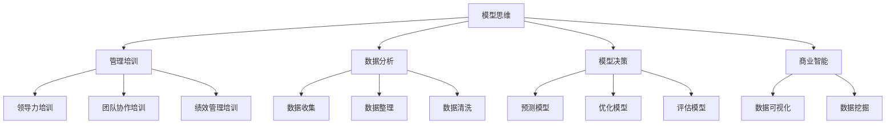

                 

# 模型思维在管理培训中的运用

> 关键词：模型思维,管理培训,数据分析,模型决策,策略制定,商业智能

## 1. 背景介绍

### 1.1 问题由来
在当今快速变化的市场环境中，企业需要不断调整策略以适应新的挑战和机遇。因此，有效的管理培训成为了提升员工能力和企业竞争力的关键手段。传统的管理培训模式往往依赖于经验丰富的讲师和专家，以案例分析和理论讲解为主，缺乏科学的数据支撑和分析方法。而模型思维的应用，为管理培训提供了一种科学、系统、实用的新范式。

### 1.2 问题核心关键点
模型思维在管理培训中的运用，主要是通过构建和管理各类模型来辅助决策和策略制定。这些模型可以是统计模型、机器学习模型、优化模型等，可以应用于需求预测、资源配置、风险评估、市场分析等管理决策场景。模型的选择和使用，需要根据具体的业务问题和数据特征进行合理设计。

## 2. 核心概念与联系

### 2.1 核心概念概述

为更好地理解模型思维在管理培训中的运用，本节将介绍几个密切相关的核心概念：

- **模型思维(Model Thinking)**：指利用数学模型、统计模型、机器学习模型等科学工具来辅助决策和预测，提升决策的准确性和效率。
- **管理培训(Management Training)**：旨在提升管理人员在战略规划、组织管理、运营优化等方面的能力和素质，包括但不限于领导力、团队协作、绩效管理等。
- **数据分析(Data Analysis)**：通过收集、整理和分析数据，揭示数据背后的规律和趋势，为管理决策提供科学依据。
- **模型决策(Model-based Decision Making)**：利用模型进行预测、优化和评估，辅助管理人员进行数据驱动的决策。
- **商业智能(Business Intelligence, BI)**：利用数据分析、数据挖掘、数据可视化等技术，辅助企业实现数据驱动的决策和管理。

这些核心概念之间的逻辑关系可以通过以下Mermaid流程图来展示：



这个流程图展示模型思维与各个管理培训环节的连接：

1. 模型思维通过数据分析，构建出模型，辅助管理培训的各个环节。
2. 管理培训包括了领导力、团队协作、绩效管理等具体培训内容，每个环节都可以通过模型思维来辅助决策。
3. 数据分析、模型决策和商业智能提供了具体的工具和技术手段，使模型思维在管理培训中得以实现。

## 3. 核心算法原理 & 具体操作步骤
### 3.1 算法原理概述

模型思维在管理培训中的运用，本质上是将管理决策和分析过程科学化、数据化的过程。其核心思想是：构建和管理各类模型，辅助决策和预测，提升决策的准确性和效率。

形式化地，假设我们需要预测市场未来的需求$D$，模型$\mathcal{M}$作为决策的工具，其输入为影响需求的若干因素$X$，输出为需求预测值$\hat{D}$。那么，模型训练和使用的过程可以表示为：

$$
\hat{D} = \mathcal{M}(X)
$$

其中，$\mathcal{M}$为训练得到的模型，$X$为输入的特征数据。模型训练的目标是最大化模型的预测准确度，即：

$$
\max_{\mathcal{M}} \mathcal{L}(\mathcal{M}, D)
$$

其中，$\mathcal{L}$为损失函数，$D$为真实需求数据。通过不断优化模型，使得预测结果$\hat{D}$尽可能接近真实需求$D$。

### 3.2 算法步骤详解

基于模型思维的管理培训一般包括以下几个关键步骤：

**Step 1: 需求分析与问题定义**
- 明确管理培训的具体需求和目标，如需求预测、资源配置、风险评估等。
- 确定预测目标和影响因素，如销售量、成本、市场份额等。

**Step 2: 数据收集与整理**
- 收集与预测目标相关的历史数据和预测因子数据，如历史销售数据、市场调研数据、客户反馈数据等。
- 对数据进行清洗、筛选、归一化等预处理，确保数据的准确性和一致性。

**Step 3: 模型选择与构建**
- 根据数据特征和业务需求，选择合适的模型，如线性回归、决策树、随机森林、神经网络等。
- 对模型进行训练和验证，选择合适的模型参数和超参数，确保模型的泛化能力和预测精度。

**Step 4: 模型评估与优化**
- 在验证集上评估模型的预测效果，计算误差和损失指标，如均方误差、平均绝对误差等。
- 根据评估结果，调整模型结构和参数，提高模型性能。

**Step 5: 模型应用与决策支持**
- 在实际业务场景中使用模型进行预测和评估，辅助管理决策。
- 定期更新模型，保证模型的时效性和预测准确度。

### 3.3 算法优缺点

模型思维在管理培训中的运用具有以下优点：
1. 科学性高。模型辅助决策具有较高的客观性和准确性，避免决策过程中的人为偏见和主观臆断。
2. 可重复性高。模型构建和应用过程可以重复执行，确保决策的稳定性和一致性。
3. 透明度高。模型的构建和应用过程可以透明展示，便于理解和解释。
4. 效率高。模型可以快速进行预测和评估，辅助决策，提高决策效率。

同时，该方法也存在一定的局限性：
1. 对数据质量要求高。模型的预测结果依赖于数据的质量和完整性，低质量的数据可能导致预测不准确。
2. 模型选择和调参复杂。不同的模型适用于不同的数据特征和业务需求，模型选择和调参需要一定的专业知识和经验。
3. 过拟合风险。模型训练过程中容易出现过拟合现象，需要一定的正则化和交叉验证技术。
4. 动态环境适应性差。在动态变化的环境下，模型可能难以适应新的数据特征和业务需求。

尽管存在这些局限性，但就目前而言，模型思维在管理培训中的应用正逐步普及，成为提升管理决策科学性和效率的重要手段。

### 3.4 算法应用领域

模型思维在管理培训中的应用领域非常广泛，涵盖了以下几个方面：

- **需求预测**：利用历史数据和市场调研数据，预测未来的销售量、市场份额等。
- **资源配置**：优化资源分配，如生产计划、物流调度和库存管理等。
- **风险评估**：评估市场风险、财务风险、运营风险等，辅助风险管理。
- **市场分析**：分析市场趋势、竞争对手动向、客户需求等，辅助市场策略制定。
- **绩效管理**：利用数据和模型评估员工绩效，进行奖惩和激励，提升团队绩效。

除了上述这些常见应用外，模型思维还可以应用于战略规划、供应链管理、人力资源管理等更多场景中，为管理决策提供强大的数据分析和模型支持。

## 4. 数学模型和公式 & 详细讲解  
### 4.1 数学模型构建

本节将使用数学语言对基于模型思维的管理培训过程进行更加严格的刻画。

假设我们需要预测某地区的销售量$D$，影响因素包括广告投入$A$、竞争对手策略$C$、季节性因素$S$等，则构建的模型可以表示为：

$$
D = \mathcal{M}(A, C, S)
$$

其中，$\mathcal{M}$为预测模型，$A, C, S$为影响因素。

在实际应用中，我们通常采用线性回归模型、决策树模型、随机森林模型等进行预测。以线性回归模型为例，预测模型的数学表达式为：

$$
D = \beta_0 + \beta_1A + \beta_2C + \beta_3S + \epsilon
$$

其中，$\beta_0, \beta_1, \beta_2, \beta_3$为模型参数，$\epsilon$为误差项。

### 4.2 公式推导过程

以下我们以线性回归模型为例，推导模型的训练和评估公式。

假设模型在样本$(i)$上的预测值为$\hat{D}_i$，真实值为$D_i$，则模型的平方误差损失函数为：

$$
L = \frac{1}{N} \sum_{i=1}^N (D_i - \hat{D}_i)^2
$$

其中，$N$为样本数量。

模型的最小二乘估计量为：

$$
\beta = (X^TX)^{-1}X^TD
$$

其中，$X$为特征矩阵，$D$为真实值向量。

在实际应用中，我们通常采用梯度下降等优化算法求解模型参数。具体地，模型的梯度下降更新公式为：

$$
\beta \leftarrow \beta - \eta \frac{\partial L}{\partial \beta}
$$

其中，$\eta$为学习率。

通过迭代优化，模型参数$\beta$逐渐逼近最优值，最终得到训练好的预测模型。

### 4.3 案例分析与讲解

假设某公司想要预测下个季度的销售量，已知历史数据如表所示：

| 季度 | 广告投入 | 竞争对手策略 | 实际销售量 |
|------|----------|--------------|------------|
| Q1   | 500万    | 温和        | 1000万     |
| Q2   | 600万    | 激进        | 1200万     |
| Q3   | 700万    | 温和        | 1300万     |
| Q4   | 800万    | 激进        | 1500万     |

我们可以构建如下线性回归模型：

$$
D = \beta_0 + \beta_1A + \beta_2C + \beta_3S + \epsilon
$$

将数据代入模型中，得到：

$$
\begin{aligned}
1000 &= \beta_0 + 500 \beta_1 + 1 \beta_2 + 1 \beta_3 + \epsilon \\
1200 &= \beta_0 + 600 \beta_1 + 0 \beta_2 + 1 \beta_3 + \epsilon \\
1300 &= \beta_0 + 700 \beta_1 + 1 \beta_2 + 1 \beta_3 + \epsilon \\
1500 &= \beta_0 + 800 \beta_1 + 0 \beta_2 + 1 \beta_3 + \epsilon
\end{aligned}
$$

构建矩阵$X$和向量$D$，并求解最小二乘估计量：

$$
X = \begin{bmatrix}
1 & 500 & 1 & 1 \\
1 & 600 & 0 & 1 \\
1 & 700 & 1 & 1 \\
1 & 800 & 0 & 1
\end{bmatrix}, D = \begin{bmatrix}
1000 \\
1200 \\
1300 \\
1500
\end{bmatrix}
$$

$$
\beta = (X^TX)^{-1}X^TD = \begin{bmatrix}
-600 \\
0.2 \\
1 \\
0.2
\end{bmatrix}
$$

最终得到模型为：

$$
\hat{D} = -600 + 0.2A + 1C + 0.2S
$$

当广告投入为800万、竞争对手策略为温和、季节性因素为1时，预测下个季度销售量为：

$$
\hat{D} = -600 + 0.2 \times 800 + 1 \times 0 + 0.2 \times 1 = 540
$$

即预测下个季度销售量为540万。

## 5. 项目实践：代码实例和详细解释说明
### 5.1 开发环境搭建

在进行模型思维实践前，我们需要准备好开发环境。以下是使用Python进行Scikit-Learn开发的环境配置流程：

1. 安装Anaconda：从官网下载并安装Anaconda，用于创建独立的Python环境。

2. 创建并激活虚拟环境：
```bash
conda create -n sklearn-env python=3.8 
conda activate sklearn-env
```

3. 安装Scikit-Learn：从官网获取对应的安装命令。例如：
```bash
conda install scikit-learn scikit-optimize cython
```

4. 安装各类工具包：
```bash
pip install numpy pandas matplotlib seaborn statsmodels
```

完成上述步骤后，即可在`sklearn-env`环境中开始模型思维实践。

### 5.2 源代码详细实现

这里我们以销售量预测为例，给出使用Scikit-Learn进行线性回归的Python代码实现。

首先，定义数据处理函数：

```python
import pandas as pd
import numpy as np
from sklearn.model_selection import train_test_split
from sklearn.linear_model import LinearRegression
from sklearn.metrics import mean_squared_error

def load_data(path):
    df = pd.read_csv(path)
    features = ['广告投入', '竞争对手策略', '季节性因素']
    X = df[features]
    y = df['实际销售量']
    return X, y

def preprocess_data(X, y):
    X = np.array(X)
    y = np.array(y)
    X_train, X_test, y_train, y_test = train_test_split(X, y, test_size=0.2, random_state=42)
    return X_train, X_test, y_train, y_test
```

然后，定义模型和评估函数：

```python
from sklearn.linear_model import LinearRegression
from sklearn.metrics import mean_squared_error

def train_model(X_train, y_train):
    model = LinearRegression()
    model.fit(X_train, y_train)
    return model

def evaluate_model(model, X_test, y_test):
    y_pred = model.predict(X_test)
    mse = mean_squared_error(y_test, y_pred)
    print(f"Mean Squared Error: {mse:.2f}")
```

最后，启动模型训练和评估流程：

```python
data_path = 'sales_data.csv'
X, y = load_data(data_path)
X_train, X_test, y_train, y_test = preprocess_data(X, y)
model = train_model(X_train, y_train)
evaluate_model(model, X_test, y_test)
```

以上就是使用Scikit-Learn进行线性回归模型的完整代码实现。可以看到，利用Scikit-Learn的封装功能，模型构建和评估变得简洁高效。

### 5.3 代码解读与分析

让我们再详细解读一下关键代码的实现细节：

**load_data函数**：
- 从指定路径读取数据文件，将其转换为Pandas DataFrame格式。
- 定义特征列和目标列，提取相应的数据。

**preprocess_data函数**：
- 将特征数据和目标数据转换为Numpy数组格式。
- 对数据进行分割，生成训练集和测试集。

**train_model函数**：
- 创建线性回归模型，使用训练数据进行拟合。

**evaluate_model函数**：
- 使用测试数据进行模型评估，计算均方误差(MSE)。

**模型训练和评估流程**：
- 定义数据路径，加载数据。
- 对数据进行预处理和分割。
- 训练模型并评估性能。

可以看到，Scikit-Learn提供了简单易用的接口，大大简化了模型思维的应用流程。开发者可以专注于模型的构建和评估，而不必过多关注底层实现细节。

## 6. 实际应用场景
### 6.1 智能客服系统

在智能客服系统中，模型思维可以用于需求预测和资源配置。智能客服系统需要实时预测客户咨询量，根据预测结果进行资源调配，确保系统能够快速响应客户需求。

具体而言，可以通过收集历史客户咨询数据，预测未来一定时间段内的客户咨询量。根据预测结果，调整客服人员数量和排班计划，优化客服资源配置，提升客户满意度和服务效率。同时，模型思维还可以用于客户行为分析，识别出潜在的高价值客户，进行精准营销和客户管理。

### 6.2 金融风险管理

在金融领域，模型思维可以用于风险评估和投资决策。金融机构需要对客户的信用风险、市场风险、流动性风险等进行全面评估，制定相应的风险管理策略。

具体而言，可以通过收集客户的历史交易数据、财务报表、市场数据等信息，构建风险评估模型。模型可以对客户的信用风险进行量化评估，辅助风险决策。同时，模型还可以预测市场的波动性和趋势，辅助投资决策。通过模型思维，金融机构可以更科学、准确地进行风险管理，提高风险控制能力。

### 6.3 电子商务运营

在电子商务平台中，模型思维可以用于销售预测和库存管理。电商平台需要预测未来的销售量，以便进行合理的库存管理和供应链优化。

具体而言，可以通过收集历史销售数据、市场数据、促销活动信息等，构建销售预测模型。模型可以预测未来的销售量，辅助库存管理和采购计划。同时，模型还可以分析客户购买行为，制定个性化的促销策略，提升销售转化率。通过模型思维，电商平台可以更高效、精准地进行运营管理，提高经营效率。

### 6.4 未来应用展望

随着数据科学和机器学习技术的不断进步，模型思维在管理培训中的应用前景将更加广阔。未来，模型思维将与大数据、人工智能、区块链等技术深度融合，为企业管理提供更加科学、智能、灵活的决策支持。

在智慧城市管理中，模型思维可以用于城市规划、交通管理、公共服务等领域。通过构建交通流量预测模型、公共服务需求预测模型等，辅助城市决策，提升城市管理和运营效率。

在供应链管理中，模型思维可以用于需求预测、库存管理、物流优化等领域。通过构建供应链预测模型、库存优化模型等，辅助企业进行资源调配和决策，提升供应链效率和响应速度。

在人力资源管理中，模型思维可以用于员工绩效评估、人才招聘、培训管理等领域。通过构建员工绩效评估模型、人才招聘模型等，辅助企业进行人力资源管理，提升员工绩效和公司竞争力。

## 7. 工具和资源推荐
### 7.1 学习资源推荐

为了帮助开发者系统掌握模型思维在管理培训中的应用，这里推荐一些优质的学习资源：

1. 《数据科学与统计学习基础》课程：由斯坦福大学开设的入门级课程，涵盖数据处理、统计学习、机器学习等内容，适合初学者入门。

2. 《Python数据科学手册》书籍：详细介绍了Python在数据科学和机器学习中的应用，适合有一定基础的读者深入学习。

3. 《深度学习入门》书籍：讲解了深度学习的基本概念和模型构建方法，适合对深度学习感兴趣的读者。

4. 《机器学习实战》书籍：介绍了各种机器学习算法和应用案例，适合有一定编程基础的读者。

5. 《商业智能与数据科学》课程：由Coursera提供的在线课程，涵盖商业智能、数据科学、机器学习等内容，适合商务人士和技术人员学习。

通过这些资源的学习实践，相信你一定能够快速掌握模型思维在管理培训中的应用技巧，并用于解决实际的业务问题。

### 7.2 开发工具推荐

高效的开发离不开优秀的工具支持。以下是几款用于模型思维开发常用的工具：

1. Jupyter Notebook：免费的Python开发环境，支持代码编写、数据可视化、结果展示等功能，适合进行数据分析和模型构建。

2. PyCharm：由JetBrains开发的Python IDE，功能强大，支持自动补全、调试、测试等功能，适合进行模型训练和评估。

3. Scikit-Learn：Python科学计算库，提供各种机器学习算法和工具，适合进行模型训练和评估。

4. TensorFlow：由Google开发的深度学习框架，支持各种深度学习模型和工具，适合进行模型训练和部署。

5. R语言：广泛用于数据分析和统计学计算，提供各种统计分析和机器学习算法，适合进行数据分析和模型构建。

合理利用这些工具，可以显著提升模型思维的应用效率，加快创新迭代的步伐。

### 7.3 相关论文推荐

模型思维的应用源于学界的持续研究。以下是几篇奠基性的相关论文，推荐阅读：

1. 《Linear Regression: The Analysis and Interpretation of Data》书籍：讲解了线性回归模型的基本概念和应用方法，适合初学者入门。

2. 《The Elements of Statistical Learning》书籍：详细介绍了统计学习的基本概念和算法，适合对统计学习感兴趣的读者。

3. 《Pattern Recognition and Machine Learning》书籍：讲解了机器学习的基本概念和算法，适合对机器学习感兴趣的读者。

4. 《Advances in Neural Information Processing Systems》会议论文集：收录了深度学习领域的最新研究成果，适合对深度学习感兴趣的读者。

5. 《Artificial Intelligence: A Modern Approach》书籍：讲解了人工智能的基本概念和算法，适合对人工智能感兴趣的读者。

这些论文代表了大数据、机器学习、人工智能等领域的研究进展，通过学习这些前沿成果，可以帮助研究者把握学科前进方向，激发更多的创新灵感。

## 8. 总结：未来发展趋势与挑战
### 8.1 研究成果总结

本文对基于模型思维的管理培训方法进行了全面系统的介绍。首先阐述了模型思维在管理培训中的重要性和应用背景，明确了模型思维在决策辅助、数据驱动管理等方面的独特价值。其次，从原理到实践，详细讲解了模型构建、数据处理、模型评估等关键步骤，给出了模型思维任务开发的完整代码实例。同时，本文还广泛探讨了模型思维在智能客服、金融风险、电子商务等多个行业领域的应用前景，展示了模型思维的巨大潜力。

通过本文的系统梳理，可以看到，模型思维在管理培训中的应用正逐步普及，成为提升决策科学性和效率的重要手段。模型思维的应用不仅提高了决策的准确性和透明度，还增强了管理的灵活性和动态适应性，为管理培训注入了科学的数据驱动理念。

### 8.2 未来发展趋势

展望未来，模型思维在管理培训中的应用将呈现以下几个发展趋势：

1. 智能化水平提升。随着人工智能和机器学习技术的不断进步，模型思维将更加智能化和自适应，能够更高效、准确地进行决策和预测。

2. 跨领域融合深入。模型思维将与其他技术如区块链、物联网、大数据等进行深度融合，形成更加全面、智能的管理解决方案。

3. 个性化需求满足。模型思维将更加注重个性化需求，根据不同业务场景和用户特征，构建个性化的预测模型，提供定制化的决策支持。

4. 多模态数据整合。模型思维将利用多种数据源，如文本、图像、视频、音频等，进行多模态数据分析和建模，提升决策的全面性和准确性。

5. 实时动态调整。模型思维将具备实时动态调整能力，能够根据业务需求和数据变化，快速调整模型参数和结构，保持模型的时效性和适应性。

以上趋势凸显了模型思维在管理培训中的广阔前景。这些方向的探索发展，必将进一步提升管理决策的科学性和效率，推动管理培训向智能化、自适应、个性化的方向迈进。

### 8.3 面临的挑战

尽管模型思维在管理培训中的应用前景广阔，但在实践过程中仍面临一些挑战：

1. 数据质量问题。模型的预测结果依赖于数据的质量和完整性，数据偏差和噪声可能导致模型预测不准确。

2. 模型复杂度问题。模型构建和训练需要消耗大量的计算资源和时间，模型的复杂度会增加决策的延迟和成本。

3. 模型解释问题。模型思维的预测过程复杂，模型的输出结果难以解释，难以满足管理者的决策需求。

4. 模型安全性问题。模型可能受到恶意攻击和数据泄露，模型的安全性需要得到保障。

5. 模型可扩展性问题。模型需要具备良好的可扩展性，能够适应业务需求的变化和数据规模的增加。

这些挑战需要研究者在数据处理、模型设计、系统架构等方面进行深入研究，才能实现模型思维在管理培训中的广泛应用。

### 8.4 研究展望

面对模型思维在管理培训中所面临的挑战，未来的研究需要在以下几个方面寻求新的突破：

1. 提升数据质量。采用数据清洗、数据增强、数据预处理等技术，提升数据质量和完整性，降低数据偏差和噪声。

2. 降低模型复杂度。采用模型压缩、模型剪枝、参数共享等技术，降低模型的复杂度，提升模型的可扩展性和实时性。

3. 增强模型解释性。采用模型可视化、模型摘要、可解释性算法等技术，增强模型的解释性和透明度，满足管理者的决策需求。

4. 保障模型安全性。采用数据加密、模型保护、安全审计等技术，保障模型的安全性和隐私性，防止模型泄露和攻击。

5. 支持模型可扩展性。采用微服务架构、分布式计算等技术，支持模型在业务需求变化和数据规模增加下的可扩展性和动态调整。

这些研究方向的探索，必将引领模型思维在管理培训中的应用迈向更高的台阶，为管理培训提供更加科学、智能、高效的数据驱动决策支持。

## 9. 附录：常见问题与解答

**Q1：模型思维在管理培训中是否适用于所有管理场景？**

A: 模型思维在管理培训中的应用非常广泛，但对于一些需要高度人工介入和管理决策的场景，如战略制定、企业文化建设等，模型思维可能难以完全替代人工管理。因此，需要结合实际情况，合理选择模型思维的应用范围。

**Q2：模型思维是否需要大量的数据支持？**

A: 模型思维对数据的质量和数量要求较高，尤其是在模型的训练和评估阶段。对于数据量较小的管理场景，模型思维可能难以取得理想的效果。因此，在应用模型思维时，需要充分考虑数据的质量和数量，确保模型的泛化能力和预测精度。

**Q3：模型思维是否能够应对动态变化的管理环境？**

A: 模型思维在应对动态变化的管理环境中具有较好的适应性，通过定期更新模型和数据，可以适应环境变化。但需要根据具体情况，合理设置模型的更新频率和参数调整策略，确保模型的时效性和稳定性。

**Q4：模型思维是否需要专业的技术人员支持？**

A: 模型思维在管理培训中的应用需要专业的技术人员进行模型构建、数据处理和评估等工作。因此，企业需要投入一定的技术资源，培养专业的数据科学家和模型工程师，确保模型思维的有效应用。

**Q5：模型思维是否适用于新兴的管理技术？**

A: 模型思维可以应用于各种管理技术和方法中，如大数据分析、人工智能、区块链等。模型思维提供了一种科学、系统的决策支持方法，可以与各种新兴管理技术深度融合，提升其应用效果。

这些问题的回答，希望能为你提供全面的参考，帮助你在实践中更好地应用模型思维，提升管理决策的科学性和效率。

---

作者：禅与计算机程序设计艺术 / Zen and the Art of Computer Programming

