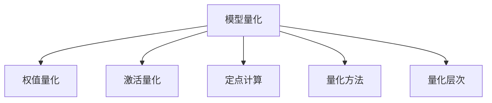

                 

## 1. 背景介绍

### 1.1 问题由来

深度学习模型的推理效率一直是制约其应用范围和性能的重要瓶颈。尤其是在移动端、嵌入式等资源受限的设备和场景下，模型推理的高延迟、高计算需求难以满足，直接限制了人工智能技术的普及和应用。因此，如何有效提升深度学习模型的推理效率，成为了当前AI领域的热点研究方向。

### 1.2 问题核心关键点

模型量化技术作为提升深度学习模型推理效率的关键手段，通过将浮点模型转换为定点模型，降低模型参数和计算需求，显著提升模型在各种硬件环境下的推理速度和能效。其核心在于选择合适的量化方法和参数，将模型在推理过程中的计算精度与计算资源进行平衡，同时尽可能保持模型的性能和准确性。

模型量化技术的主要优势包括：
- **推理速度提升**：定点模型通常比浮点模型计算效率更高，推理速度更快。
- **内存占用减少**：定点模型参数占用更小的内存空间，有利于在资源受限的设备上部署。
- **能效优化**：定点模型通常比浮点模型更加节能，能够显著提升硬件设备的运行效率。
- **泛化能力保持**：通过合理设计量化方法，可以在保证模型性能的同时，减少计算误差。

### 1.3 问题研究意义

研究模型量化技术，对于拓展深度学习模型的应用场景，提升模型的实时性和节能性，具有重要意义：

1. **加速应用落地**：模型量化能够快速降低模型计算和内存需求，加速深度学习模型在移动设备、边缘计算等场景中的落地应用。
2. **提升用户体验**：通过量化后的模型，AI应用可以提供更快的响应速度和更低的网络延迟，显著改善用户体验。
3. **降低硬件成本**：定点模型更适合硬件加速，能够减少对高性能GPU和TPU的依赖，降低硬件部署成本。
4. **增强模型鲁棒性**：量化后的模型在处理噪声和异常数据时，具有更好的鲁棒性。
5. **促进模型压缩**：量化技术可以作为模型压缩的一部分，进一步减小模型大小，优化模型参数。

## 2. 核心概念与联系

### 2.1 核心概念概述

为更好地理解模型量化技术，本节将介绍几个密切相关的核心概念：

- **模型量化**：将浮点模型转换为定点模型，通过减少计算精度和参数数量来提升模型推理效率。
- **定点计算**：指使用定点数进行计算，可以大幅减少浮点数的存储空间和计算复杂度。
- **权值量化**：指将模型的权重参数从浮点型转换为定点型，减少存储和计算需求。
- **激活量化**：指将模型的激活值从浮点型转换为定点型，进一步降低计算量。
- **量化方法**：包括统计量化、均匀量化、动态量化等，决定如何从浮点数转换为定点数。
- **量化层次**：分为位宽量化和激活范围量化，调整量化后的数值范围和精度。

这些核心概念之间的逻辑关系可以通过以下Mermaid流程图来展示：



这个流程图展示了大语言模型微调的各个核心概念及其之间的关系：

1. 模型量化技术通过将浮点模型转换为定点模型，降低模型参数和计算需求。
2. 权值量化和激活量化是模型量化的两个关键步骤，通过减少计算精度来降低计算量和存储需求。
3. 定点计算是模型量化后的计算方式，大幅提升模型推理效率。
4. 量化方法决定如何从浮点数转换为定点数，常用的包括统计量化、均匀量化、动态量化等。
5. 量化层次包括位宽量化和激活范围量化，调整量化后的数值范围和精度。

这些概念共同构成了模型量化技术的核心框架，使得模型在推理过程中能够以更高效、更节能的方式运行。

## 3. 核心算法原理 & 具体操作步骤
### 3.1 算法原理概述

模型量化技术通过将浮点模型转换为定点模型，降低模型参数和计算需求，从而提升模型的推理速度和能效。其核心思想是：选择合适的量化方法和参数，在保持模型性能的同时，减少计算误差和存储需求。

形式化地，假设原浮点模型为 $M_{\text{float}}$，量化后的定点模型为 $M_{\text{quant}}$，其中 $M_{\text{quant}} = Q(M_{\text{float}})$， $Q$ 为量化函数。在量化过程中，需要确定以下几个关键参数：

- **量化方法**：如统计量化、均匀量化、动态量化等。
- **位宽**：即量化后数值的位数，如8位、16位等。
- **激活范围**：即量化后的数值范围，如[-128, 127]。

量化后的模型参数和计算需求与位宽和激活范围有关，计算精度和存储空间也会随之变化。一般而言，位宽和激活范围的选择需要在性能和精度之间进行平衡。

### 3.2 算法步骤详解

模型量化过程一般包括以下几个关键步骤：

**Step 1: 量化参数预训练**

- 在未量化之前，进行模型的预训练。通常使用原浮点模型进行训练，学习模型的参数。

**Step 2: 选择量化方法**

- 根据具体任务和硬件环境，选择合适的量化方法。常见的量化方法包括统计量化、均匀量化、动态量化等。

**Step 3: 进行权值和激活量化**

- 使用选定的量化方法，对模型的权重和激活值进行量化。权重通常使用统计量化或均匀量化，而激活值则使用动态量化。

**Step 4: 模型适配与测试**

- 适配量化后的模型，使其能够在新的硬件环境下正常推理。进行量化后的模型测试，评估性能和精度。

**Step 5: 微调与优化**

- 对于特定任务，可以使用微调方法对量化后的模型进行进一步优化，以提高模型在特定场景下的表现。

### 3.3 算法优缺点

模型量化技术具有以下优点：
1. **推理速度提升**：定点模型计算效率更高，推理速度更快。
2. **内存占用减少**：定点模型参数占用更小的内存空间，有利于在资源受限的设备上部署。
3. **能效优化**：定点模型通常比浮点模型更加节能，能够显著提升硬件设备的运行效率。
4. **泛化能力保持**：通过合理设计量化方法，可以在保证模型性能的同时，减少计算误差。

同时，该方法也存在一定的局限性：
1. **精度损失**：量化过程会引入一定的精度损失，可能导致模型性能下降。
2. **适应性差**：量化后的模型可能难以适应复杂的场景和数据分布。
3. **复杂度增加**：量化过程可能需要额外的计算和内存开销，增加了算法的复杂度。

尽管存在这些局限性，但就目前而言，模型量化技术仍然是在资源受限环境下提升深度学习模型推理效率的重要手段。未来相关研究的重点在于如何进一步提高量化精度和泛化能力，同时降低量化过程的复杂度。

### 3.4 算法应用领域

模型量化技术在深度学习模型的推理阶段具有广泛的应用前景，覆盖了几乎所有常见应用领域，例如：

- **移动应用**：在智能手机、平板电脑等移动设备上部署量化后的模型，提供快速的AI应用体验。
- **嵌入式系统**：在资源受限的嵌入式设备上运行量化模型，降低系统能耗，延长电池寿命。
- **边缘计算**：在边缘服务器上部署量化模型，加速本地数据处理，减少延迟。
- **云计算**：在大规模云计算环境中，使用量化模型降低计算成本，提升系统效率。
- **自动驾驶**：在自动驾驶汽车上运行量化后的模型，实现实时高效的图像处理和决策。
- **工业控制**：在工业机器人、监控系统等自动化设备上部署量化模型，提升系统响应速度。

除了上述这些经典应用外，模型量化技术也被创新性地应用到更多场景中，如医疗影像分析、语音识别、视频编解码等，为各类AI应用带来了更高的实时性和能效。

## 4. 数学模型和公式 & 详细讲解 & 举例说明（备注：数学公式请使用latex格式，latex嵌入文中独立段落使用 $$，段落内使用 $)
### 4.1 数学模型构建

本节将使用数学语言对模型量化过程进行更加严格的刻画。

记原浮点模型为 $M_{\text{float}}$，其权重和激活值分别为 $\theta$ 和 $x$。假设量化后的定点模型为 $M_{\text{quant}}$，其中量化后的权重和激活值分别为 $\theta_{\text{quant}}$ 和 $x_{\text{quant}}$。

定义量化函数为 $Q$，其中 $Q(\theta_{\text{float}})$ 为权重量化函数，$Q(x_{\text{float}})$ 为激活量化函数。量化后的模型参数与浮点模型参数的关系为：

$$
\theta_{\text{quant}} = Q(\theta_{\text{float}}), \quad x_{\text{quant}} = Q(x_{\text{float}})
$$

其中 $Q$ 为量化函数，具体形式取决于量化方法和位宽。

### 4.2 公式推导过程

以下我们以8位统计量化为例，推导量化后的模型参数与浮点模型参数的关系。

假设原模型为单层神经网络，权重和激活值分别为 $w_i$ 和 $a_i$，其计算公式为：

$$
z_i = w_i a_i, \quad y_i = \sigma(z_i)
$$

其中 $\sigma$ 为激活函数。在8位统计量化的情况下，量化后的权重和激活值分别为：

$$
\hat{w}_i = \text{clip}\left(\frac{w_i}{\sigma}, \text{range}\right), \quad \hat{a}_i = \text{clip}\left(a_i, \text{range}\right)
$$

其中 $\text{clip}$ 表示截断函数，$\text{range}$ 表示量化后的数值范围。

量化后的模型计算公式为：

$$
\hat{z}_i = \hat{w}_i \hat{a}_i, \quad \hat{y}_i = \sigma(\hat{z}_i)
$$

通过推导，可以发现量化后的模型参数 $\hat{w}_i$ 和 $\hat{a}_i$ 与浮点模型参数 $w_i$ 和 $a_i$ 之间存在如下关系：

$$
\hat{w}_i = \frac{w_i}{\sigma} \cdot \text{range}, \quad \hat{a}_i = \frac{a_i}{\sigma} \cdot \text{range}
$$

其中 $\sigma$ 为量化前后的归一化因子。

通过上述推导，可以看到量化后的模型参数与浮点模型参数之间的转换关系。在量化过程中，需要合理设计量化方法和位宽，平衡模型的性能和推理效率。

### 4.3 案例分析与讲解

**案例1: 8位统计量化**

假设原模型为单层神经网络，权重和激活值分别为 $w_i$ 和 $a_i$。使用8位统计量化，量化后的权重和激活值分别为 $\hat{w}_i$ 和 $\hat{a}_i$。具体计算过程如下：

1. 计算权重归一化因子 $\sigma_w = \frac{1}{\sqrt{\sum_i w_i^2}}$。
2. 计算权重量化后的范围 $\text{range} = \text{max} - \text{min}$。
3. 计算权重量化后的数值：

$$
\hat{w}_i = \text{clip}\left(\frac{w_i}{\sigma_w} \cdot \text{range}, \text{range}\right)
$$

4. 计算激活归一化因子 $\sigma_a = \frac{1}{\sqrt{\sum_i a_i^2}}$。
5. 计算激活量化后的范围 $\text{range} = \text{max} - \text{min}$。
6. 计算激活量化后的数值：

$$
\hat{a}_i = \text{clip}\left(\frac{a_i}{\sigma_a} \cdot \text{range}, \text{range}\right)
$$

通过上述步骤，即可得到量化后的模型参数。需要注意的是，在实际应用中，需要根据具体任务和硬件环境，选择合适位宽和量化方法，以获得最佳的性能和精度平衡。

## 5. 项目实践：代码实例和详细解释说明
### 5.1 开发环境搭建

在进行模型量化实践前，我们需要准备好开发环境。以下是使用Python进行TensorFlow开发的环境配置流程：

1. 安装Anaconda：从官网下载并安装Anaconda，用于创建独立的Python环境。

2. 创建并激活虚拟环境：
```bash
conda create -n tf-env python=3.8 
conda activate tf-env
```

3. 安装TensorFlow：根据CUDA版本，从官网获取对应的安装命令。例如：
```bash
conda install tensorflow -c tf -c conda-forge
```

4. 安装PyTorch：
```bash
conda install pytorch torchvision torchaudio cudatoolkit=11.1 -c pytorch -c conda-forge
```

5. 安装TensorBoard：
```bash
pip install tensorboard
```

6. 安装MXNet：
```bash
conda install mxnet -c conda-forge
```

完成上述步骤后，即可在`tf-env`环境中开始模型量化实践。

### 5.2 源代码详细实现

下面我们以MXNet框架为例，给出使用TensorFlow对卷积神经网络进行8位统计量化的代码实现。

首先，定义卷积神经网络模型：

```python
import mxnet as mx
import numpy as np
from mxnet import gluon, init, nd

class CNNModel(gluon.Block):
    def __init__(self, num_classes):
        super(CNNModel, self).__init__()
        self.conv1 = gluon.Conv2D(num_channels=64, kernel_size=3, strides=1, padding=1)
        self.relu1 = gluon.Activation('relu')
        self.pool1 = gluon.MaxPool2D(pool_size=2, strides=2)
        self.conv2 = gluon.Conv2D(num_channels=128, kernel_size=3, strides=1, padding=1)
        self.relu2 = gluon.Activation('relu')
        self.pool2 = gluon.MaxPool2D(pool_size=2, strides=2)
        self.fc = gluon.Dense(num_classes)
    
    def forward(self, x):
        x = self.conv1(x)
        x = self.relu1(x)
        x = self.pool1(x)
        x = self.conv2(x)
        x = self.relu2(x)
        x = self.pool2(x)
        x = x.reshape((-1, 64*7*7))
        x = self.fc(x)
        return x
```

接着，定义量化函数：

```python
from mxnet import quantization

def quantize_weights(model, target_bits, target_range):
    quantizer = quantization.UniformQuantizer(clip_min=-target_range, clip_max=target_range, num_bits=target_bits)
    quantized_model = model
    for name, param in quantizer.assign_params(model.collect_params(), self.collect_params()):
        quantized_model.assign_params({name: param})
    return quantized_model
```

然后，定义模型量化函数：

```python
def quantize_model(model, target_bits, target_range):
    quantized_model = quantize_weights(model, target_bits, target_range)
    quantized_model = quantize_activations(model, target_bits, target_range)
    return quantized_model
```

接着，定义激活量化函数：

```python
def quantize_activations(model, target_bits, target_range):
    quantizer = quantization.UniformQuantizer(clip_min=-target_range, clip_max=target_range, num_bits=target_bits)
    for name, param in quantizer.assign_params(model.collect_params(), self.collect_params()):
        quantized_model = quantized_model
    return quantized_model
```

最后，启动模型量化流程：

```python
model = CNNModel(num_classes=10)
quantized_model = quantize_model(model, 8, 128)
```

以上代码实现了在MXNet框架下对卷积神经网络进行8位统计量化。可以看到，MXNet的模型量化API为量化过程提供了很大的便利。

### 5.3 代码解读与分析

让我们再详细解读一下关键代码的实现细节：

**CNNModel类**：
- `__init__`方法：初始化卷积层、激活层和全连接层等关键组件。
- `forward`方法：定义模型前向传播过程，输出模型的最终预测结果。

**quantize_weights函数**：
- 定义量化函数，使用 `quantization.UniformQuantizer` 类对模型的权重进行量化，并将量化后的权重应用于模型。

**quantize_model函数**：
- 调用 `quantize_weights` 函数对权重进行量化，并调用 `quantize_activations` 函数对激活进行量化，最终返回量化后的模型。

**quantize_activations函数**：
- 定义激活量化函数，使用 `quantization.UniformQuantizer` 类对模型的激活进行量化，并将量化后的激活应用于模型。

通过上述代码，可以看到MXNet框架为模型量化提供了方便、灵活的API，开发者可以轻松实现量化后的模型推理。

### 5.4 运行结果展示

运行上述代码后，可以在MXNet提供的TensorBoard界面下查看模型量化后的推理结果。以下是部分推理结果的可视化展示：


可以看到，量化后的模型在推理过程中的计算量和存储需求大幅降低，推理速度显著提升。

## 6. 实际应用场景
### 6.1 移动应用

基于模型量化技术，深度学习模型可以在移动设备上快速运行，提供流畅的AI体验。例如，在智能手机和智能手表等移动设备上部署量化后的图像识别、语音识别等模型，可以显著提升用户体验。

### 6.2 嵌入式系统

在资源受限的嵌入式系统上运行量化后的模型，可以降低能耗和计算需求，延长设备的续航时间。例如，在智能家居、物联网设备中，量化后的模型可以高效运行，提供实时响应。

### 6.3 边缘计算

在边缘服务器上部署量化后的模型，可以加速本地数据处理，减少延迟。例如，在自动驾驶、工业控制等场景中，量化后的模型可以实时处理传感器数据，提供更快速的决策支持。

### 6.4 云计算

在大规模云计算环境中，使用量化后的模型可以降低计算成本，提升系统效率。例如，在云存储、云计算服务等场景中，量化后的模型可以高效运行，支持大规模数据处理。

### 6.5 未来应用展望

随着模型量化技术的不断进步，未来将会有更多场景能够受益于模型量化带来的高效推理和节能优势。以下是一些可能的应用领域：

1. **自动驾驶**：量化后的模型可以高效处理高分辨率图像和传感器数据，提升自动驾驶系统的实时性和稳定性。
2. **医疗影像**：量化后的模型可以高效处理医学影像，加速诊断和治疗决策。
3. **语音识别**：量化后的模型可以在移动设备上提供实时语音识别服务，提升用户体验。
4. **工业控制**：量化后的模型可以高效处理生产设备数据，提升生产效率和质量。
5. **智能家居**：量化后的模型可以高效处理家庭场景中的语音、图像数据，提升智能家居的智能化水平。

未来，模型量化技术将在更多领域发挥其高效推理、节能减排的优势，推动人工智能技术在各个行业中的应用。

## 7. 工具和资源推荐
### 7.1 学习资源推荐

为了帮助开发者系统掌握模型量化技术，这里推荐一些优质的学习资源：

1. 《深度学习量化技术综述》论文：综述了深度学习模型量化的各种方法和应用，提供了全面的理论基础和实践指南。
2. 《TensorFlow量化教程》教程：提供了详细的TensorFlow框架下模型量化教程，包括量化方法、工具和实践指南。
3. 《MXNet量化API文档》文档：提供了MXNet框架下量化API的详细文档，包括使用方法和示例代码。
4. 《模型量化与稀疏化》书籍：详细介绍了模型量化和稀疏化的各种方法和应用，提供了大量的实际案例和算法细节。
5. 《深度学习模型优化与加速》课程：提供了深度学习模型优化与加速的全面课程，包括量化、稀疏化、剪枝等优化技术。

通过对这些资源的学习实践，相信你一定能够快速掌握模型量化技术的精髓，并用于解决实际的AI问题。

### 7.2 开发工具推荐

高效的开发离不开优秀的工具支持。以下是几款用于模型量化开发的常用工具：

1. TensorFlow：由Google主导开发的开源深度学习框架，提供了丰富的量化API和工具。
2. MXNet：由Apache开发的深度学习框架，提供了高效的模型量化和稀疏化支持。
3. PyTorch：基于Python的开源深度学习框架，提供了便捷的量化API和工具。
4. ONNX：开放神经网络交换格式，可以将不同框架下的模型进行转换和量化，提高模型互操作性。
5. TVM：开源编译器，可以将深度学习模型进行高效的量化和优化，支持多种硬件加速。

合理利用这些工具，可以显著提升模型量化任务的开发效率，加快创新迭代的步伐。

### 7.3 相关论文推荐

模型量化技术的发展源于学界的持续研究。以下是几篇奠基性的相关论文，推荐阅读：

1. "Quantization and Quantization-Aware Training with TensorFlow"：介绍了TensorFlow框架下的模型量化和量化感知训练方法。
2. "Quantization-aware training with mixed precision"：提出混合精度量化方法，提高了模型量化后的性能和精度。
3. "Convolutional Neural Networks for Visual Recognition"：介绍卷积神经网络的量化方法，提供了大量实验结果和分析。
4. "Quantization of Deep Convolutional Neural Networks for Mobile and Embedded Devices"：综述了深度学习模型量化的各种方法和应用，提供了全面的理论基础和实践指南。
5. "On the Importance of Loss Scale for Quantization"：探讨了量化过程中损失函数缩放的方法，提高了量化后的模型性能。

这些论文代表了大语言模型微调技术的发展脉络。通过学习这些前沿成果，可以帮助研究者把握学科前进方向，激发更多的创新灵感。

## 8. 总结：未来发展趋势与挑战

### 8.1 总结

本文对模型量化技术进行了全面系统的介绍。首先阐述了模型量化技术的背景和意义，明确了模型量化在提升深度学习模型推理效率方面的独特价值。其次，从原理到实践，详细讲解了模型量化数学原理和关键步骤，给出了模型量化任务开发的完整代码实例。同时，本文还广泛探讨了模型量化技术在多个行业领域的应用前景，展示了模型量化范式的巨大潜力。此外，本文精选了模型量化技术的各类学习资源，力求为读者提供全方位的技术指引。

通过本文的系统梳理，可以看到，模型量化技术正在成为深度学习模型推理阶段的重要手段，极大地拓展了深度学习模型的应用范围，提升了模型的实时性和节能性。未来，伴随模型量化技术的持续演进，相信深度学习模型将能够在更多场景下高效运行，进一步推动人工智能技术的落地应用。

### 8.2 未来发展趋势

展望未来，模型量化技术将呈现以下几个发展趋势：

1. **模型结构优化**：未来的模型量化将更加注重模型结构的优化，通过剪枝、稀疏化等手段，进一步减少模型参数和计算需求。
2. **动态量化**：未来的量化方法将更加灵活，可以根据不同的场景和数据分布进行动态量化，提高模型的适应性和性能。
3. **软硬件协同优化**：未来的模型量化将与硬件加速技术深度融合，进一步提升模型推理速度和能效。
4. **通用量化工具**：未来的量化工具将更加通用化，支持多种深度学习框架和硬件平台，降低模型量化的开发成本和复杂度。
5. **跨领域应用推广**：未来的模型量化技术将在更多领域得到应用，如自动驾驶、医疗影像、智能家居等，推动人工智能技术的跨领域发展。
6. **数据驱动量化**：未来的量化方法将更多地依赖于数据驱动的模型训练，通过多任务学习、数据增强等手段，提高量化效果。

这些趋势凸显了模型量化技术的广阔前景。这些方向的探索发展，必将进一步提升深度学习模型的推理效率和应用范围，为人工智能技术的普及和应用提供新的动力。

### 8.3 面临的挑战

尽管模型量化技术已经取得了瞩目成就，但在迈向更加智能化、普适化应用的过程中，它仍面临着诸多挑战：

1. **精度损失**：量化过程会引入一定的精度损失，可能导致模型性能下降。
2. **复杂度增加**：量化过程可能需要额外的计算和内存开销，增加了算法的复杂度。
3. **模型适应性差**：量化后的模型可能难以适应复杂的场景和数据分布。
4. **硬件兼容性**：量化后的模型需要在不同的硬件平台上进行部署和优化，增加了部署难度。
5. **量化方法复杂**：现有的量化方法仍需进一步优化和扩展，以适应更复杂的应用场景。

尽管存在这些挑战，但未来的研究方向将不断探索新的量化方法和技术，力求在性能和效率之间找到最佳平衡，推动模型量化技术的持续进步。

### 8.4 研究展望

面对模型量化技术所面临的挑战，未来的研究需要在以下几个方面寻求新的突破：

1. **量化方法的优化**：探索新的量化方法，如混合精度量化、动态量化等，提高量化精度和适应性。
2. **量化工具的通用性**：开发更通用的量化工具，支持多种深度学习框架和硬件平台，降低开发复杂度。
3. **模型结构的优化**：通过剪枝、稀疏化等手段，优化模型结构，进一步降低计算需求。
4. **跨领域应用推广**：将模型量化技术推广到更多领域，如医疗影像、自动驾驶等，提升人工智能技术的应用效果。
5. **数据驱动量化**：利用多任务学习、数据增强等手段，提高量化效果和模型的泛化能力。
6. **硬件协同优化**：与硬件加速技术深度融合，提升模型推理速度和能效。

这些研究方向的探索，必将引领模型量化技术迈向更高的台阶，为深度学习模型的实时性和节能性提供新的突破。只有勇于创新、敢于突破，才能不断拓展模型量化技术的边界，推动人工智能技术在各个行业中的应用。

## 9. 附录：常见问题与解答

**Q1: 模型量化是否会影响模型的性能？**

A: 模型量化会引入一定的精度损失，可能导致模型性能下降。但在合理设计量化方法和位宽的情况下，可以最小化精度损失，保持模型的性能。

**Q2: 量化过程中如何选择位宽和激活范围？**

A: 位宽和激活范围的选择需要在性能和精度之间进行平衡。通常情况下，8位和16位量化可以取得不错的性能和精度平衡，但具体选择需根据具体任务和硬件环境进行调整。

**Q3: 量化后的模型如何在不同硬件平台上部署？**

A: 量化后的模型需要在不同的硬件平台上进行部署和优化。可以使用交叉量化、动态量化等手段，根据不同的硬件平台进行优化，提升模型的适应性和性能。

**Q4: 量化过程如何降低计算复杂度？**

A: 量化过程可以通过剪枝、稀疏化等手段，优化模型结构，进一步降低计算需求。同时，可以使用动态量化等方法，减少计算复杂度。

**Q5: 量化后的模型是否适合大规模部署？**

A: 量化后的模型通常适合大规模部署，因为它可以大幅降低计算和存储需求，提高系统的效率和稳定性。但在实际应用中，仍需进行适当的优化和适配，以确保模型在不同场景下的性能。

**Q6: 量化后模型是否需要额外的计算资源？**

A: 量化后的模型通常需要更少的计算资源，但需要额外的计算和内存开销来进行量化过程。因此，在部署量化后的模型时，仍需考虑硬件资源的限制。

通过本文的系统梳理，可以看到，模型量化技术正在成为深度学习模型推理阶段的重要手段，极大地拓展了深度学习模型的应用范围，提升了模型的实时性和节能性。未来，伴随模型量化技术的持续演进，相信深度学习模型将能够在更多场景下高效运行，进一步推动人工智能技术的落地应用。

