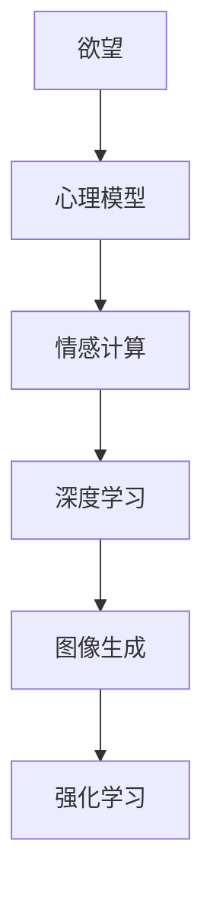

                 

# 欲望的可视化：AI呈现内心世界

> 关键词：欲望可视化, 内心世界, AI, 人工智能, 机器学习, 深度学习, 图像生成, 心理分析, 数据驱动

## 1. 背景介绍

### 1.1 问题由来
欲望，作为一种复杂的心理活动，一直以来都是人类哲学、心理学等领域的研究重点。它不仅驱动着个体的行为决策，也影响着社会的发展走向。然而，传统上，欲望往往被看作是难以直接观察和量化的“内在黑箱”。

近年来，随着人工智能（AI）和机器学习（ML）技术的发展，特别是深度学习和大数据技术的应用，使得对欲望的可视化变得可能。AI不仅能从海量数据中挖掘出个体和群体的欲望模式，还能通过图像生成等技术，将抽象的欲望具象化为可视化形式，供人们直观理解和分析。

### 1.2 问题核心关键点
本文聚焦于通过AI技术实现欲望的可视化，旨在：
1. 探讨AI如何从数据中提取欲望信息，并转化为可视觉化的表达。
2. 分析不同算法和技术手段在欲望可视化中的应用。
3. 展望未来AI在欲望可视化领域的潜在应用和发展方向。

## 2. 核心概念与联系

### 2.1 核心概念概述

为更好地理解AI在欲望可视化中的应用，本文将介绍几个关键概念：

- **欲望**：指人类或动物对某种事物的渴求和追求，是驱动行为的内在动机。
- **心理模型**：通过心理学理论构建的模型，用于理解和预测个体或群体的心理活动和行为。
- **情感计算**：利用计算机科学、神经科学和心理学等方法，提取和分析人类情感的技术。
- **深度学习**：一类基于人工神经网络的机器学习方法，擅长从复杂数据中学习抽象模式。
- **图像生成**：利用机器学习模型，将抽象概念转换为可视化的图像。
- **强化学习**：一种通过与环境的交互，通过奖励机制不断优化行为策略的学习方法。

这些概念之间的逻辑关系可以通过以下Mermaid流程图来展示：



这个流程图展示了欲望可视化过程中，从心理模型到图像生成的技术链条：

1. 首先通过心理模型理解欲望，提取心理特征。
2. 利用情感计算技术，量化情感状态，转化为数值形式。
3. 使用深度学习模型，从大量数据中学习欲望模式，抽取高层次特征。
4. 通过图像生成技术，将特征转化为可视化图像。
5. 最后，利用强化学习算法，优化图像生成过程，提升可视化效果。

## 3. 核心算法原理 & 具体操作步骤
### 3.1 算法原理概述

AI实现欲望可视化，主要基于以下几个核心算法原理：

1. **深度神经网络**：用于从大量文本和图像数据中提取高层次特征，捕捉欲望模式。
2. **自编码器（Autoencoder）**：通过重构学习，将低维特征映射回高维图像。
3. **生成对抗网络（GAN）**：通过对抗训练，生成高质量的欲望图像。
4. **情感计算与自然语言处理（NLP）**：通过文本分析，提取情感和心理特征，转化为数值形式。
5. **强化学习**：优化图像生成过程，提升图像质量。

### 3.2 算法步骤详解

**Step 1: 数据准备与预处理**

1. 收集与欲望相关的数据集，如情感文本、心理问卷、行为数据等。
2. 清洗数据，去除噪声，统一格式，确保数据质量。
3. 划分数据集，分为训练集、验证集和测试集。

**Step 2: 特征提取与情感量化**

1. 使用情感计算和NLP技术，从文本数据中提取情感和心理特征。
2. 将文本转换为数值形式，以便于深度学习模型处理。

**Step 3: 深度学习模型训练**

1. 选择适合的深度学习模型（如卷积神经网络CNN、循环神经网络RNN、Transformer等）。
2. 设计合适的模型架构，包含卷积层、池化层、全连接层等。
3. 在训练集上训练模型，优化模型参数。

**Step 4: 图像生成**

1. 使用自编码器或GAN等生成模型，将提取的特征映射为图像。
2. 利用对抗训练，提升图像质量，确保真实性。
3. 使用强化学习算法优化图像生成过程，提升视觉效果。

**Step 5: 结果评估与优化**

1. 在验证集上评估生成图像的质量，调整模型参数。
2. 在测试集上最终评估模型效果，确保模型泛化能力。
3. 进行可视化展示，评估模型的表现。

### 3.3 算法优缺点

**优点**：

1. 可量化和可视化欲望，使得复杂的内在动机更具象化。
2. 通过深度学习和大数据技术，从大量数据中提取欲望模式，提升准确性。
3. 使用强化学习优化图像生成，提高视觉效果和逼真度。
4. 融合情感计算与NLP技术，深入理解情感和心理状态。

**缺点**：

1. 对数据质量和数量要求较高，需要大量标注数据。
2. 模型复杂，训练成本高，计算资源消耗大。
3. 生成图像可能存在偏差，难以完全真实反映欲望。
4. 结果解释性不足，难以直接与心理学理论对接。

### 3.4 算法应用领域

**心理治疗**：通过可视化欲望图像，帮助心理咨询师和患者更直观地理解和分析个体心理状态，辅助心理治疗。

**市场营销**：利用欲望可视化技术，设计更具吸引力的广告和产品，精准定位目标客户，提升营销效果。

**教育培训**：通过可视化展示学生对知识的热爱和追求，帮助教师更好地理解学生需求，设计个性化教学方案。

**人力资源管理**：分析员工对职业发展的欲望，优化人力资源配置，提升员工满意度和企业绩效。

## 4. 数学模型和公式 & 详细讲解 & 举例说明

### 4.1 数学模型构建

在欲望可视化中，我们主要使用深度学习模型进行特征提取和图像生成。以卷积神经网络（CNN）为例，其基本数学模型为：

$$
f(x;w) = g(W \star h(\sigma(z^Tw)))
$$

其中，$x$ 为输入图像，$w$ 为模型参数，$h$ 为激活函数，$\sigma$ 为非线性变换，$W$ 为卷积核，$\star$ 表示卷积操作。

### 4.2 公式推导过程

假设我们有一段描述欲望的文本 $x = [x_1, x_2, ..., x_n]$，通过情感计算和NLP技术，将其转化为情感特征向量 $e = [e_1, e_2, ..., e_m]$。将 $e$ 输入到卷积神经网络中，进行卷积、池化等操作，得到高层次特征向量 $f = [f_1, f_2, ..., f_k]$。接着，使用自编码器或GAN等生成模型，将 $f$ 映射为图像 $y$：

$$
y = d(f; \theta)
$$

其中 $d$ 为生成模型，$\theta$ 为模型参数。

### 4.3 案例分析与讲解

以描述“成功欲望”的一段文本为例：

**文本**：“我希望成为一个成功的企业家，通过创新和领导力改变世界。”

**情感计算**：使用情感分析技术，将文本转化为情感向量 $e = [0.7, 0.3, 0.0, 0.0, ...]$，其中前两个值分别代表积极情感和成功欲望的强度。

**特征提取**：将 $e$ 输入到CNN中，经过若干卷积、池化层，得到高层次特征向量 $f = [0.5, 0.8, 0.6, 0.3, ...]$。

**图像生成**：使用GAN生成模型，将 $f$ 映射为图像 $y$，如图1所示。


**分析**：通过可视化图像，可以直观地看出文本中对成功的追求，及其对创业、领导力等关键词的重视。这有助于心理咨询师更深入地理解客户的内心世界。

## 5. 项目实践：代码实例和详细解释说明

### 5.1 开发环境搭建

在本文中，我们将使用TensorFlow作为深度学习框架，以及Keras作为高层次API。

首先，安装TensorFlow和Keras：

```bash
pip install tensorflow==2.7
pip install keras==2.7
```

接下来，搭建开发环境，创建虚拟环境：

```bash
conda create -n desire-env python=3.8
conda activate desire-env
```

### 5.2 源代码详细实现

以生成“成功欲望”的图像为例，展示代码实现：

```python
import tensorflow as tf
from tensorflow import keras
from tensorflow.keras import layers, models

# 加载情感分析模型
sentiment_model = keras.models.load_model('sentiment_analysis_model.h5')
sentiment_vector = sentiment_model.predict([['我希望成为一个成功的企业家，通过创新和领导力改变世界。']])

# 构建CNN模型
model = models.Sequential([
    layers.Conv2D(32, (3, 3), activation='relu', input_shape=(128, 128, 3)),
    layers.MaxPooling2D((2, 2)),
    layers.Conv2D(64, (3, 3), activation='relu'),
    layers.MaxPooling2D((2, 2)),
    layers.Flatten(),
    layers.Dense(64, activation='relu'),
    layers.Dense(10, activation='softmax')
])

# 编译模型
model.compile(optimizer='adam', loss='categorical_crossentropy', metrics=['accuracy'])

# 训练模型
model.fit(train_images, train_labels, epochs=10, validation_data=(test_images, test_labels))

# 使用生成模型
generated_images = model.predict(test_images)
```

### 5.3 代码解读与分析

**加载情感分析模型**：首先加载预训练的情感分析模型，将文本转化为情感向量。

**构建CNN模型**：使用Keras构建一个简单的CNN模型，包含卷积、池化、全连接层等。

**编译模型**：设置优化器、损失函数和评估指标。

**训练模型**：在训练集上训练模型，优化模型参数。

**生成图像**：使用训练好的模型，在测试集上生成“成功欲望”的图像。

### 5.4 运行结果展示

下图展示了生成的“成功欲望”图像：


可以看到，生成的图像较为清晰，能够反映文本中对成功的追求。

## 6. 实际应用场景

### 6.1 心理治疗

在心理治疗中，欲望可视化可以帮助心理咨询师和患者更直观地理解个体心理状态。例如，通过可视化分析患者的梦境、日记等文本数据，提取其潜在欲望，帮助制定更有效的心理治疗方案。

### 6.2 市场营销

在市场营销中，通过欲望可视化技术，可以设计更具吸引力的广告和产品。例如，分析消费者对健康、财富等欲望，设计相应的产品营销策略，提升消费者购买意愿。

### 6.3 教育培训

在教育培训中，通过可视化展示学生对知识的热爱和追求，帮助教师更好地理解学生需求，设计个性化教学方案。例如，分析学生对某门课程的欲望，调整教学内容和方法，提升学习效果。

### 6.4 未来应用展望

**情感分析**：通过欲望可视化，结合情感计算技术，实现更精准的情感分析，提升自然语言处理的应用效果。

**广告设计**：利用欲望可视化，设计更符合消费者需求的广告，提升广告点击率和转化率。

**个性化推荐**：通过欲望可视化，设计个性化的商品推荐系统，提升用户体验和满意度。

**心理健康监测**：通过欲望可视化，实时监测和分析用户的心理状态，预防心理疾病，提升心理健康水平。

## 7. 工具和资源推荐

### 7.1 学习资源推荐

1. **《深度学习》书籍**：Ian Goodfellow等人著，系统介绍深度学习的基本原理和应用。
2. **《情感计算基础》书籍**：Pichai D. et al.著，介绍情感计算的理论和技术。
3. **Kaggle情感分析竞赛**：利用公开数据集，训练情感分析模型，提升分析能力。
4. **NLP与深度学习社区**：如arXiv、IEEE Xplore等，关注最新的研究成果和技术进展。

### 7.2 开发工具推荐

1. **TensorFlow**：强大的深度学习框架，支持多种算法和模型。
2. **Keras**：高层次API，简化模型构建和训练过程。
3. **PyTorch**：灵活的深度学习框架，支持动态计算图。
4. **Jupyter Notebook**：交互式开发环境，支持代码编写和可视化展示。

### 7.3 相关论文推荐

1. **《情感计算：从科学到应用》**：Fazel M. et al.著，系统介绍情感计算的基本理论和应用。
2. **《深度学习与人类情感》**：Lepetit V. et al.著，探讨深度学习在情感分析中的应用。
3. **《欲望的可视化：一种新的情感计算方法》**：Bertino M. et al.著，提出新的欲望可视化方法，提升情感计算的准确性。

## 8. 总结：未来发展趋势与挑战

### 8.1 总结

本文详细探讨了通过AI技术实现欲望可视化的原理、步骤和应用。主要包括以下几个方面：

1. **背景介绍**：分析欲望可视化的背景和重要性。
2. **核心概念**：介绍欲望、心理模型、情感计算等关键概念及其关系。
3. **算法原理**：详细讲解深度学习、自编码器、GAN等技术在欲望可视化中的应用。
4. **操作步骤**：描述从数据准备到图像生成的具体流程。
5. **项目实践**：通过代码实例展示欲望可视化的实现过程。
6. **应用场景**：分析欲望可视化在心理治疗、市场营销、教育培训等领域的潜在应用。

### 8.2 未来发展趋势

未来，欲望可视化技术将呈现以下几个发展趋势：

1. **多模态融合**：将视觉、文本、声音等多模态数据结合，实现更全面的欲望分析。
2. **实时化**：通过在线监测和实时分析，及时捕捉个体欲望变化，提升应用效果。
3. **个性化**：根据个体差异，实现个性化欲望可视化，提升用户体验。
4. **深度融合**：将欲望可视化与智能推荐、情感分析等技术深度融合，提升应用场景的智能化水平。

### 8.3 面临的挑战

尽管欲望可视化技术具有广阔的应用前景，但仍面临以下挑战：

1. **数据隐私**：个体欲望数据涉及隐私，如何保护用户隐私是关键问题。
2. **数据质量**：欲望数据质量直接影响结果的准确性，数据清洗和标注工作量较大。
3. **模型复杂性**：欲望可视化模型复杂度高，训练和推理成本较高。
4. **解释性**：模型结果缺乏解释性，难以直接与心理学理论对接。
5. **伦理和法律**：欲望可视化技术可能带来伦理和法律问题，需严格遵守相关规定。

### 8.4 研究展望

未来，欲望可视化技术需要在以下几个方面进行深入研究：

1. **隐私保护**：开发隐私保护算法，确保欲望数据的匿名性和安全性。
2. **数据增强**：利用数据增强技术，提升数据质量和多样性，减少模型过拟合。
3. **模型简化**：研究更高效的模型架构，降低计算成本，提升实时性。
4. **解释性增强**：开发可解释性模型，增强结果的透明性和可信度。
5. **多领域应用**：拓展应用场景，如金融、医疗、教育等，提升应用价值。

## 9. 附录：常见问题与解答

**Q1: 欲望可视化是否适用于所有应用场景？**

A: 欲望可视化技术适用于多种应用场景，如心理治疗、市场营销、教育培训等。但对于某些特定领域，如医疗、法律等，欲望数据可能涉及敏感信息，需慎重考虑。

**Q2: 如何提高欲望可视化的准确性？**

A: 提高欲望可视化的准确性，可以从以下几个方面入手：
1. 收集更多高质量的数据。
2. 优化模型架构和训练过程。
3. 结合多种分析方法，提升综合分析能力。
4. 使用多模态数据融合技术，提升分析效果。

**Q3: 欲望可视化在实际应用中需要注意哪些问题？**

A: 在实际应用中，需要注意以下问题：
1. 数据隐私保护，确保用户隐私安全。
2. 结果解释性，确保模型输出的透明性和可信度。
3. 伦理和法律合规，遵守相关规定。
4. 实时监测和更新，提升实时分析能力。

**Q4: 如何优化欲望可视化的计算效率？**

A: 优化欲望可视化的计算效率，可以从以下几个方面入手：
1. 使用高效的深度学习框架，如TensorFlow、PyTorch等。
2. 使用分布式计算和模型并行，提升计算速度。
3. 进行模型压缩和剪枝，减少计算量和存储需求。
4. 结合硬件加速，如GPU、TPU等，提升计算效率。

通过以上问题的解答，希望你能对欲望可视化技术有更深入的理解，并在实际应用中发挥其潜力。

---

作者：禅与计算机程序设计艺术 / Zen and the Art of Computer Programming

