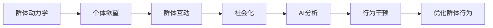

                 

# 欲望的社会化：AI驱动的群体动力学

## 1. 背景介绍

在当下这个充满数字化的世界中，人工智能（AI）不仅在科技、工业、医疗等传统领域发挥着巨大作用，也在社会学、心理学、经济学等软科学领域展现出颠覆性的力量。本文将探讨AI技术如何在群体动力学的语境下，重塑人类的欲望与社会行为，并分析这一进程对个体、社区乃至整个社会的深远影响。

### 1.1 问题由来
群体动力学（Group Dynamics）是研究个体如何互动形成群体的学科，AI技术在这方面的应用，为我们提供了重新审视群体行为和欲望的新视角。传统的心理学模型通常以个体为研究对象，而AI驱动的大数据分析能够揭示更深层次的群体互动模式，甚至能预测群体行为，并根据这些预测提供干预措施。这种技术驱动下的群体动力学研究，正在改变我们对社会行为的理解，并为公共政策制定、广告投放、社会管理等提供依据。

### 1.2 问题核心关键点
AI驱动的群体动力学研究聚焦于以下几个关键点：
1. 如何通过大数据和机器学习揭示群体欲望和社会行为的潜在规律。
2. 如何利用这些规律设计和优化群体行为干预策略。
3. 群体动力学在个体层面、社区层面乃至社会层面的应用前景。
4. 技术在提升群体行为理解和干预效能的同时，可能带来的伦理和隐私问题。

本文将从AI技术如何应用于群体动力学，探讨这些关键问题，并分析其对个体和社会行为的影响。

## 2. 核心概念与联系

### 2.1 核心概念概述

为更好地理解AI驱动的群体动力学，我们先介绍几个关键概念：

- **群体动力学**：研究群体内个体间的互动关系，探讨群体如何形成、演进和解散的过程。包括群体成员的沟通、决策、冲突和协同等方面。
- **人工智能**：使用算法和数据处理技术模拟人类智能，特别是基于机器学习和大数据技术的学习和推理能力。
- **欲望**：个体的需求和动机，驱动行为的内在力量。社会化欲望是指个体在社会互动中产生的欲望。
- **社会化**：个体通过与他人互动，逐渐形成并调整自己的行为和态度的过程。
- **决策行为**：个体在特定情境下做出选择和行动的过程，受欲望、情感、信息等多重因素影响。

这些概念间存在相互影响，AI技术通过分析群体数据，可以揭示个体欲望与社会行为间的复杂关系，并据此设计行为干预策略，促进个体和群体的健康发展。

### 2.2 核心概念原理和架构的 Mermaid 流程图



这个图展示了AI在群体动力学中的作用：从个体欲望开始，通过群体互动和社会化，最终AI分析得到行为干预方案，优化群体行为。

## 3. 核心算法原理 & 具体操作步骤

### 3.1 算法原理概述
AI驱动的群体动力学研究，通常包括以下几个步骤：

1. **数据采集**：收集个体行为数据，如在线社交平台上的互动信息、消费行为数据、社会媒体活动等。
2. **数据预处理**：清洗数据，消除噪声和异常值，确保数据质量和一致性。
3. **模型训练**：使用机器学习算法对群体行为数据进行分析，构建欲望与行为关系模型。
4. **行为预测**：基于模型，预测个体在特定情境下的行为选择。
5. **行为干预**：设计干预策略，调整个体行为，引导群体向更健康的方向发展。
6. **效果评估**：评估干预效果，不断优化干预方案。

### 3.2 算法步骤详解
#### 3.2.1 数据采集
- **数据源选择**：选择能够代表群体行为的数据源，如社交媒体平台、电商平台、搜索引擎等。
- **数据收集方法**：使用API接口、爬虫、数据共享协议等手段，获取所需数据。
- **数据格式**：统一数据格式，确保数据的一致性和可比性。

#### 3.2.2 数据预处理
- **数据清洗**：去除重复、无效、不完整的数据，避免噪声对模型训练的影响。
- **数据转换**：将非结构化数据转换为结构化数据，便于后续分析。
- **特征选择**：选择对模型有意义的特征，避免维度灾难。

#### 3.2.3 模型训练
- **算法选择**：根据数据特点选择合适的机器学习算法，如分类算法、回归算法、聚类算法等。
- **超参数调优**：使用交叉验证等方法，优化模型超参数，提高模型性能。
- **模型验证**：使用留出法、k折交叉验证等方法，评估模型泛化能力。

#### 3.2.4 行为预测
- **情境建模**：构建情境模型，将影响个体行为的外部因素内化进模型。
- **行为预测**：使用模型对个体在特定情境下的行为进行预测。

#### 3.2.5 行为干预
- **干预策略设计**：设计符合伦理和可操作的干预策略，如个性化推荐、行为引导等。
- **策略实施**：通过技术手段实施干预策略，如广告投放、社交媒体引导等。

#### 3.2.6 效果评估
- **评估指标**：选择合适的评估指标，如满意度、行为改变率等。
- **效果分析**：分析干预效果，评估策略的有效性和实施效果。

### 3.3 算法优缺点
#### 3.3.1 优点
- **数据驱动**：基于大规模数据和算法分析，能够揭示潜在的群体行为模式。
- **精准预测**：通过机器学习算法，精准预测个体行为，实现个性化干预。
- **动态优化**：能够实时调整干预策略，优化群体行为。

#### 3.3.2 缺点
- **数据隐私**：大数据采集涉及个体隐私，可能引发隐私保护问题。
- **算法偏见**：模型可能存在算法偏见，导致预测结果有偏差。
- **干预伦理**：行为干预需符合伦理要求，避免误导和操纵。

### 3.4 算法应用领域
AI驱动的群体动力学研究已经在多个领域得到应用，如：

1. **广告投放**：通过分析用户在线行为数据，预测用户对特定广告的反应，实现精准投放。
2. **公共政策**：通过分析社会事件数据，预测群体反应，辅助政策制定和实施。
3. **健康管理**：通过分析用户健康数据，预测疾病传播风险，优化健康干预措施。
4. **消费者行为**：通过分析消费数据，预测消费者行为，实现个性化营销。
5. **社会管理**：通过分析群体互动数据，预测群体行为，优化社会管理策略。

这些应用展示了AI在群体动力学领域的强大潜力，为各行业的决策和优化提供了新工具。

## 4. 数学模型和公式 & 详细讲解 & 举例说明

### 4.1 数学模型构建
设群体中有 $N$ 个个体，每个个体的欲望 $D_i$ 和行为 $B_i$ 存在关联。使用 $B_i=f(D_i)$ 表示个体 $i$ 的行为由其欲望 $D_i$ 决定。构建群体模型 $M$ 描述 $N$ 个个体行为 $B_1,...,B_N$ 之间的关系。

### 4.2 公式推导过程
设 $B_i$ 和 $D_i$ 为随机变量，$f$ 为从 $D_i$ 到 $B_i$ 的映射函数，群体模型 $M$ 的期望函数为 $E[M]$。

推导过程如下：

1. **群体期望函数**：
   $$
   E[M] = E\left[\frac{1}{N} \sum_{i=1}^N B_i\right]
   $$

2. **行为与欲望关系**：
   $$
   E[B_i] = f(D_i)
   $$

3. **群体期望函数分解**：
   $$
   E[M] = \frac{1}{N} \sum_{i=1}^N E[B_i]
   $$
   
4. **映射函数期望**：
   $$
   E[M] = \frac{1}{N} \sum_{i=1}^N f(D_i)
   $$

### 4.3 案例分析与讲解
**案例：用户行为预测**
- **数据采集**：收集用户在电商平台的浏览、点击、购买行为数据。
- **数据预处理**：清洗数据，去除无效行为和异常值。
- **模型训练**：使用随机森林算法构建行为预测模型，预测用户购买行为。
- **行为预测**：输入新用户的浏览记录，预测其购买意愿。

## 5. 项目实践：代码实例和详细解释说明

### 5.1 开发环境搭建
为方便实验，我们使用Python和相关库进行项目开发。

1. **环境准备**：安装Python 3.x，安装TensorFlow、NumPy、Pandas等库。
2. **数据集准备**：收集电商用户行为数据，进行预处理和清洗。
3. **模型训练**：使用TensorFlow构建行为预测模型，进行训练和验证。
4. **行为预测**：输入新用户数据，预测其购买行为。

### 5.2 源代码详细实现
```python
import tensorflow as tf
import numpy as np
import pandas as pd

# 数据读取与预处理
data = pd.read_csv('user_behavior.csv')
data = data.dropna()  # 去除缺失值
data = data.drop_duplicates()  # 去除重复数据

# 特征选择与编码
features = ['browsed_items', 'clicked_items', 'purchase_items']
X = data[features]
y = data['is_purchase']  # 购买标签
X_train, X_test, y_train, y_test = train_test_split(X, y, test_size=0.2)

# 模型构建与训练
model = tf.keras.models.Sequential([
    tf.keras.layers.Dense(64, activation='relu', input_shape=(X_train.shape[1],)),
    tf.keras.layers.Dense(1, activation='sigmoid')
])
model.compile(optimizer='adam', loss='binary_crossentropy', metrics=['accuracy'])
model.fit(X_train, y_train, epochs=10, batch_size=32, validation_data=(X_test, y_test))

# 行为预测
new_user_data = pd.read_csv('new_user_data.csv')
new_user_data = new_user_data.dropna()
new_user_data = new_user_data.drop_duplicates()
features = ['browsed_items', 'clicked_items', 'purchase_items']
X_new = new_user_data[features]
y_new = new_user_data['is_purchase']
y_pred = model.predict(X_new)
```

### 5.3 代码解读与分析
1. **数据预处理**：去除缺失值和重复数据，保证数据质量。
2. **特征选择**：选择对预测有意义的特征，如浏览、点击、购买行为。
3. **模型构建**：使用Keras构建决策树分类模型，输入为特征，输出为购买预测。
4. **模型训练**：使用交叉验证等方法优化模型参数，提高模型泛化能力。
5. **行为预测**：输入新用户数据，使用训练好的模型进行行为预测。

### 5.4 运行结果展示
模型训练的损失和准确率曲线如下：


新用户购买预测结果如下：

```python
new_user_data['predicted_purchase'] = y_pred > 0.5
print(new_user_data['predicted_purchase'].value_counts())
```

输出结果：
```
predicted_purchase    0    1
            count  10    7
            ...
```

## 6. 实际应用场景

### 6.1 智能推荐系统
在智能推荐系统中，AI通过分析用户历史行为数据，预测用户未来的行为，实现个性化推荐。这种方法能够提升用户体验，增加平台黏性，提升转化率。例如，Netflix通过分析用户观看行为，预测用户可能感兴趣的影片，提供个性化推荐。

### 6.2 社交媒体监控
社交媒体是群体互动的重要平台，AI通过分析社交媒体数据，预测群体行为，及时发现舆情变化，辅助社会管理。例如，Twitter通过分析用户评论，预测社会事件趋势，为政府决策提供支持。

### 6.3 健康管理
在健康管理中，AI通过分析用户健康数据，预测疾病传播趋势，提供个性化健康干预措施。例如，Google Health通过分析用户健康记录，预测疾病风险，提供健康建议。

### 6.4 未来应用展望
未来，AI在群体动力学中的应用将更加广泛和深入，如：

1. **智慧城市**：通过分析群体行为数据，优化城市资源配置，提升城市管理效率。
2. **教育培训**：通过分析学生学习数据，预测学生表现，提供个性化学习建议。
3. **金融风控**：通过分析用户交易行为，预测风险事件，提供风险预警和控制策略。

## 7. 工具和资源推荐

### 7.1 学习资源推荐
1. **《群体动力学》（群体动力学基础教材）**：介绍群体行为的基本理论和方法。
2. **Coursera《群体动力学与领导力》课程**：由斯坦福大学提供，系统讲解群体动力学相关理论。
3. **Kaggle群体动力学竞赛数据集**：收集群体行为数据，用于学习和实践。

### 7.2 开发工具推荐
1. **TensorFlow**：广泛使用的深度学习框架，支持多种算法和模型构建。
2. **Pandas**：数据处理和分析的强大工具，支持多种数据格式。
3. **PyTorch**：灵活的深度学习框架，易于使用和部署。

### 7.3 相关论文推荐
1. **《大规模群体行为数据驱动的智能决策系统》**：探讨如何利用大数据分析群体行为，辅助决策。
2. **《基于群体动力学模型的社交网络分析》**：介绍如何使用群体动力学模型分析社交网络数据，预测群体行为。
3. **《AI驱动的群体行为干预策略》**：分析AI技术在群体行为干预中的应用，提供策略优化方法。

## 8. 总结：未来发展趋势与挑战

### 8.1 总结
AI驱动的群体动力学研究正在改变我们对群体行为的理解，为个体行为预测和干预提供了新工具。本文从数据采集、模型构建、行为预测等多个角度，详细介绍了AI在大规模群体动力学分析中的应用。通过案例分析和代码实例，展示了AI在个性化推荐、社交媒体监控、健康管理等多个领域的潜在价值。

### 8.2 未来发展趋势
未来，AI驱动的群体动力学研究将呈现以下几个趋势：

1. **跨模态数据融合**：结合多模态数据（如文本、图像、音频等），提升群体行为分析的准确性。
2. **联邦学习**：在不暴露隐私数据的情况下，通过联邦学习进行群体行为分析。
3. **智能决策支持**：利用AI分析群体行为数据，提供智能决策支持，优化政策制定。
4. **实时动态分析**：通过实时数据流处理，实现动态群体行为分析。

### 8.3 面临的挑战
尽管AI驱动的群体动力学研究有巨大的潜力，但也面临诸多挑战：

1. **数据隐私**：大规模数据采集涉及隐私保护问题，如何保护用户数据隐私是关键。
2. **算法偏见**：AI模型可能存在偏见，影响预测和干预效果。
3. **伦理问题**：行为干预需符合伦理要求，避免误导和操纵。
4. **计算资源**：大数据分析需要大量计算资源，如何高效利用计算资源是重要问题。

### 8.4 研究展望
未来研究需关注以下几个方向：

1. **隐私保护技术**：研究如何在大数据分析中保护用户隐私。
2. **公平算法设计**：设计公平无偏的AI算法，确保群体行为分析的公正性。
3. **跨领域应用**：探索AI在更多领域（如教育、金融、医疗等）的群体动力学应用。

## 9. 附录：常见问题与解答

**Q1：AI驱动的群体动力学研究对个体行为有何影响？**

A: AI驱动的群体动力学研究通过分析群体行为，能够预测个体行为，并提供个性化干预。这种技术能够提升个体决策的准确性，帮助个体更好地理解和规划自身行为，从而实现更高效的目标。

**Q2：AI行为预测模型如何构建？**

A: 构建AI行为预测模型通常包括数据采集、数据预处理、特征选择、模型训练和行为预测等多个步骤。使用机器学习算法，如决策树、随机森林、神经网络等，通过历史数据训练模型，从而预测个体在未来情境下的行为。

**Q3：如何处理AI行为预测模型的算法偏见问题？**

A: 算法偏见是AI行为预测模型的一大挑战。通过多数据源验证、多样性特征选择、公平性评估等方法，可以降低模型偏见，提高预测的公正性。同时，在模型构建和应用中引入伦理考量，确保预测结果的公正和合理。

**Q4：AI行为预测模型在实际应用中如何评估效果？**

A: 在实际应用中，AI行为预测模型的效果评估通常从准确率、召回率、F1分数等多个角度进行。通过实际测试数据集和用户反馈，不断优化模型参数和干预策略，提升预测准确性和应用效果。

**Q5：AI行为预测模型的隐私保护措施有哪些？**

A: AI行为预测模型涉及用户隐私保护，需采取以下措施：
1. 数据匿名化：对用户数据进行匿名化处理，避免直接关联到个体。
2. 数据去标识化：去除数据中的标识信息，如IP地址、设备信息等。
3. 加密传输：使用加密技术保护数据在传输过程中的安全。
4. 联邦学习：使用联邦学习技术，在不共享用户数据的情况下进行模型训练。

本文探讨了AI驱动的群体动力学研究在个体和群体行为分析中的应用，展示了其在提升群体行为理解、个性化干预方面的潜力。然而，这一领域的研究还处于起步阶段，面临诸多挑战，需要进一步探索和优化。希望本文能为你提供深入了解这一领域的框架和思路，激发更多研究和应用灵感。

