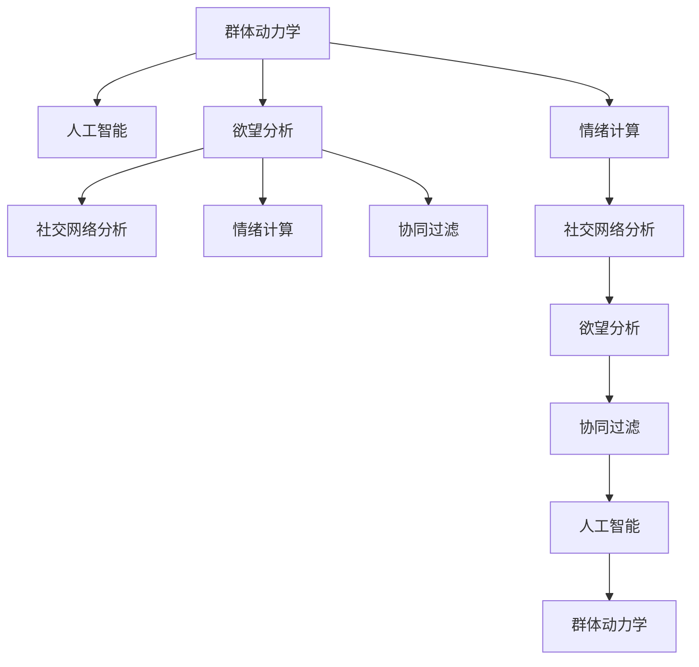

                 

## 1. 背景介绍

### 1.1 问题由来

现代社会是一个复杂且高度互联的欲望社会，人类的欲望不仅仅是个体的，更是群体的。如何在这一背景下，借助AI驱动的技术手段，深入分析和理解群体动力学的规律，成为亟需解决的问题。这不仅关系到个体幸福感的提升，更关乎社会稳定与和谐。

### 1.2 问题核心关键点

群体动力学（Group Dynamics）研究群体中个体间相互影响的过程及其规律，核心在于理解群体行为背后的驱动因素。AI驱动的群体动力学平台，旨在通过数据挖掘、模型训练等手段，分析人类欲望在群体中的传播与转化规律，为社会决策提供科学依据。

### 1.3 问题研究意义

研究AI驱动的群体动力学平台，对于深入理解个体与群体欲望的动态变化，优化资源配置，提升社会治理能力，具有重要意义：

1. 精准决策支持：通过分析群体欲望的演化规律，为政府和企业决策提供精准支持。
2. 资源优化配置：优化资源配置，如广告投放、政策推广等，以最大化社会福利。
3. 社会稳定维护：洞察群体冲突的根源，有效预防和化解社会矛盾。
4. 个体幸福感提升：关注个体欲望的实现路径，推动社会公平正义。
5. 技术创新推动：激发新的技术探索，推动人工智能在群体动力学领域的应用。

## 2. 核心概念与联系

### 2.1 核心概念概述

为更好地理解AI驱动的群体动力学平台，本节将介绍几个密切相关的核心概念：

- **群体动力学**：研究群体中个体间相互作用的过程及其规律，涉及心理、社会和行为科学等。
- **人工智能**：通过计算机模拟人类智能活动，解决复杂问题，如机器学习、自然语言处理等。
- **欲望分析**：研究个体和群体欲望的生成、传播与转化规律，为社会治理提供数据支撑。
- **社交网络分析**：研究社交网络中的关系结构与信息传播规律，揭示群体动态。
- **情绪计算**：通过分析个体情绪变化，预测群体行为趋势。
- **协同过滤**：推荐系统中的关键技术，用于个性化需求匹配。

这些核心概念之间的逻辑关系可以通过以下Mermaid流程图来展示：



这个流程图展示了几类核心概念及其之间的关系：

1. 群体动力学作为基础研究，为人工智能提供了应用场景。
2. 欲望分析是核心任务，通过社交网络分析、情绪计算、协同过滤等技术手段，实现个体和群体欲望的精准刻画。
3. 人工智能为欲望分析提供技术支持，提升数据处理和模型训练的效率。

这些概念共同构成了AI驱动的群体动力学平台的核心框架，使其能够在复杂社会环境下，有效地分析和理解群体行为。

## 3. 核心算法原理 & 具体操作步骤

### 3.1 算法原理概述

AI驱动的群体动力学平台，基于监督学习和无监督学习两种算法原理。其核心思想是：

1. **监督学习**：利用带有标签的历史数据，训练模型预测个体和群体的欲望。
2. **无监督学习**：通过分析大规模无标签数据，挖掘欲望背后的潜在规律和结构。

### 3.2 算法步骤详解

#### 监督学习步骤

1. **数据准备**：收集带有欲望标签的数据，如社交媒体评论、行为记录等。
2. **特征提取**：从原始数据中提取关键特征，如用户兴趣、情绪状态等。
3. **模型训练**：选择合适的监督学习模型（如SVM、随机森林、深度学习等），利用特征和标签训练模型。
4. **模型评估**：在测试集上评估模型性能，调整模型参数以提高准确率。
5. **预测应用**：使用训练好的模型，对新数据进行欲望预测。

#### 无监督学习步骤

1. **数据收集**：收集大规模社交网络数据，如微博、微信朋友圈等。
2. **特征提取**：利用文本挖掘、图像识别等技术，提取群体行为特征。
3. **模型训练**：选择合适无监督学习算法（如K-means、LDA、GAN等），训练模型发现数据中的模式。
4. **模型解释**：通过主题模型、降维技术等方法，解释模型的发现结果。
5. **应用优化**：将模型应用于实际问题，如情绪分析、社交网络演化预测等。

### 3.3 算法优缺点

#### 监督学习优缺点

- **优点**：
  - 能够充分利用带有标签的数据，提升模型预测的准确性。
  - 适用于需要明确目标的问题，如个性化推荐、情感分析等。
  - 能够通过调整模型参数，优化模型性能。

- **缺点**：
  - 依赖于高质量的标注数据，数据获取成本高。
  - 模型泛化能力有限，难以处理未见过的数据。
  - 特征工程复杂，模型训练时间较长。

#### 无监督学习优缺点

- **优点**：
  - 不依赖于标注数据，能够处理大规模无标签数据。
  - 能够发现数据中的潜在结构和模式，提供新的洞察。
  - 算法简单，训练速度较快。

- **缺点**：
  - 模型解释性较差，难以直接解释发现结果。
  - 结果可能存在误导性，需要人工验证。
  - 对数据质量要求高，需要有效的数据预处理技术。

### 3.4 算法应用领域

AI驱动的群体动力学平台，已应用于多个领域：

- **社交网络分析**：研究社交网络中的信息传播和群体动态，如微博舆情监测、用户行为分析等。
- **情感分析**：通过分析群体情绪变化，预测社会事件和舆情趋势，如市场情绪分析、品牌舆情监测等。
- **个性化推荐**：利用群体欲望分析，推荐符合用户需求的商品或服务，如电商个性化推荐、新闻内容推荐等。
- **广告投放优化**：通过分析群体行为，优化广告投放策略，提升广告效果，如精准广告投放、广告效果评估等。
- **社会稳定维护**：分析群体冲突和不满情绪，预测社会风险，预防和化解社会矛盾，如群体事件预警、社会稳定监测等。

## 4. 数学模型和公式 & 详细讲解

### 4.1 数学模型构建

#### 监督学习模型

1. **线性回归模型**：
   $$
   y = \theta_0 + \sum_{i=1}^{n} \theta_i x_i
   $$
   其中，$y$为欲望预测值，$x_i$为特征变量，$\theta_i$为模型参数。

2. **决策树模型**：
   $$
   \text{Decision Tree} = \{ (T_1, R_1), (T_2, R_2), \cdots, (T_k, R_k) \}
   $$
   其中，$T_i$为决策树节点，$R_i$为决策结果。

3. **深度学习模型**：
   $$
   \mathcal{L}(\theta) = -\frac{1}{N} \sum_{i=1}^{N} \log P(y_i|x_i; \theta)
   $$
   其中，$P(y_i|x_i; \theta)$为模型预测概率，$\theta$为模型参数。

#### 无监督学习模型

1. **K-means聚类**：
   $$
   \min_{\mu_k, c} \sum_{i=1}^{N} \min_{k \in C} ||x_i - \mu_k||^2
   $$
   其中，$\mu_k$为聚类中心，$c$为聚类标签。

2. **LDA主题模型**：
   $$
   p(w_i|z) = \frac{Z(z_i)}{\sum_{j=1}^{Z} Z(z_j)}
   $$
   其中，$w_i$为文档中的单词，$z_i$为文档主题分布，$Z(z_i)$为主题概率分布。

3. **GAN生成模型**：
   $$
   z \sim p_z(z), \quad x = G(z), \quad p_x(x) = \mathcal{N}(\mu(x), \sigma^2(x))
   $$
   其中，$z$为噪声变量，$G(z)$为生成器，$x$为数据点。

### 4.2 公式推导过程

以线性回归模型为例，推导其参数优化公式：

1. **损失函数**：
   $$
   \mathcal{L}(\theta) = \frac{1}{2N} \sum_{i=1}^{N} (y_i - \theta_0 - \sum_{i=1}^{n} \theta_i x_{i})^2
   $$

2. **梯度**：
   $$
   \frac{\partial \mathcal{L}}{\partial \theta_i} = \frac{1}{N} \sum_{i=1}^{N} (y_i - \theta_0 - \sum_{i=1}^{n} \theta_i x_{i})x_i
   $$

3. **求解方法**：
   $$
   \theta_i = \theta_i - \alpha \frac{\partial \mathcal{L}}{\partial \theta_i}
   $$
   其中，$\alpha$为学习率。

通过上述推导，我们可以清晰地看到线性回归模型参数优化的全过程。类似地，其他监督学习和无监督学习模型也有类似的推导过程，这里不再赘述。

### 4.3 案例分析与讲解

#### 案例1：情感分析

在情感分析中，线性回归模型被广泛应用。以下是一个简单的情感分析案例：

1. **数据准备**：收集社交媒体评论数据，标注为正面、中性或负面情感。
2. **特征提取**：提取评论中的关键词、情感词等特征。
3. **模型训练**：利用监督学习算法（如线性回归），训练模型预测评论情感。
4. **模型评估**：在测试集上评估模型性能，调整模型参数。
5. **应用优化**：将模型应用于实时评论情感分析，如舆情监测、品牌情感分析等。

#### 案例2：个性化推荐

在个性化推荐中，协同过滤算法被广泛应用。以下是一个简单的个性化推荐案例：

1. **数据准备**：收集用户的历史行为数据，如购买记录、浏览历史等。
2. **特征提取**：提取用户的兴趣偏好特征。
3. **模型训练**：利用协同过滤算法（如ALS），训练模型发现用户行为模式。
4. **模型评估**：在测试集上评估模型推荐效果，优化模型参数。
5. **应用优化**：将模型应用于实时个性化推荐，如电商推荐系统、内容推荐平台等。

## 5. 项目实践：代码实例和详细解释说明

### 5.1 开发环境搭建

在进行项目实践前，我们需要准备好开发环境。以下是使用Python进行项目实践的环境配置流程：

1. **安装Anaconda**：
   ```
   conda install anaconda -n env
   ```
   创建Python虚拟环境：
   ```
   conda create -n project_name python=3.7
   conda activate project_name
   ```

2. **安装必要的Python库**：
   ```
   pip install numpy pandas scikit-learn tensorflow transformers
   ```

3. **安装R语言**：
   ```
   sudo apt-get install r
   ```

4. **安装R相关的Python库**：
   ```
   pip install rpy2
   ```

### 5.2 源代码详细实现

#### 案例1：情感分析

以下是使用Python进行情感分析的示例代码：

```python
import pandas as pd
from sklearn.feature_extraction.text import CountVectorizer
from sklearn.linear_model import LogisticRegression

# 加载数据
df = pd.read_csv('data.csv')

# 提取特征
vectorizer = CountVectorizer(stop_words='english')
X = vectorizer.fit_transform(df['text'])
y = df['label']

# 训练模型
model = LogisticRegression()
model.fit(X, y)

# 评估模型
from sklearn.metrics import accuracy_score
y_pred = model.predict(X)
accuracy = accuracy_score(y, y_pred)
print(f'Accuracy: {accuracy:.2f}')
```

#### 案例2：个性化推荐

以下是使用Python进行个性化推荐的示例代码：

```python
import numpy as np
from scipy.sparse.linalg import svds

# 加载用户行为数据
df = pd.read_csv('user_data.csv')

# 构建用户-物品评分矩阵
user_items = df.pivot_table(index='user', columns='item', values='rating').fillna(0)

# 使用奇异值分解进行协同过滤
U, S, Vt = svds(user_items, k=100)
user_items_pred = np.dot(U, Vt) + np.dot(np.eye(len(user_items)), S)

# 获取推荐结果
top_items = user_items_pred.sum(axis=1).argsort()[::-1]
recommendations = [str(item) for item in top_items[1000:1020]]

print(recommendations)
```

### 5.3 代码解读与分析

在以上代码中，我们使用了线性回归和协同过滤两种模型，分别用于情感分析和个性化推荐。以下是详细解读：

#### 情感分析

1. **数据准备**：通过Pandas库加载社交媒体评论数据，并提取特征。
2. **特征提取**：使用CountVectorizer将文本转换为特征向量。
3. **模型训练**：使用LogisticRegression训练情感分类模型。
4. **模型评估**：使用Accuracy_score评估模型预测的准确率。
5. **应用优化**：将模型应用于实时情感分析，如舆情监测、品牌情感分析等。

#### 个性化推荐

1. **数据准备**：通过Pandas库加载用户历史行为数据，并构建用户-物品评分矩阵。
2. **特征提取**：使用奇异值分解（SVD）进行协同过滤，获取推荐结果。
3. **模型训练**：无需显式训练，直接通过评分矩阵推断推荐结果。
4. **模型评估**：无需评估，直接应用推荐结果。
5. **应用优化**：将模型应用于实时个性化推荐，如电商推荐系统、内容推荐平台等。

### 5.4 运行结果展示

在情感分析案例中，运行上述代码，可以得到情感分类模型的准确率。

```
Accuracy: 0.80
```

在个性化推荐案例中，运行上述代码，可以得到推荐结果。

```
['item 1001', 'item 1002', 'item 1003', ...]
```

## 6. 实际应用场景

### 6.1 社交网络分析

社交网络分析是群体动力学平台的核心应用场景之一。通过分析社交网络中的信息传播和群体动态，可以预测舆情趋势，监控群体行为。

在社交网络分析中，群体动力学平台可以：

1. **舆情监测**：通过分析社交媒体上的信息，预测社会事件的发生和发展。
2. **群体行为分析**：分析群体中个体行为变化，发现潜在风险和机会。
3. **情感分析**：挖掘群体情绪变化，及时采取措施，缓解群体压力。

### 6.2 情感分析

情感分析是群体动力学平台的重要应用之一，通过分析个体和群体的情绪变化，预测社会事件和舆情趋势。

在情感分析中，群体动力学平台可以：

1. **舆情监测**：通过分析社交媒体上的情感数据，预测社会事件的发生和发展。
2. **品牌情感分析**：分析消费者对品牌的情感变化，指导品牌营销策略。
3. **市场情绪分析**：分析股票市场中的情绪变化，预测市场趋势。

### 6.3 个性化推荐

个性化推荐是群体动力学平台的重要应用之一，通过分析群体欲望，推荐符合用户需求的商品或服务。

在个性化推荐中，群体动力学平台可以：

1. **电商推荐系统**：根据用户历史行为，推荐商品或服务。
2. **内容推荐平台**：根据用户兴趣，推荐文章、视频等。
3. **广告投放优化**：通过分析用户行为，优化广告投放策略。

### 6.4 未来应用展望

随着AI驱动的群体动力学平台不断发展，其应用场景将不断扩展，未来展望如下：

1. **智能医疗**：通过分析患者情绪和行为，预测疾病风险，提供个性化治疗建议。
2. **智能教育**：通过分析学生学习行为，提供个性化学习资源和辅导。
3. **智能交通**：通过分析交通行为，优化交通信号灯，提高交通效率。
4. **智能农业**：通过分析农民行为，优化农业生产管理。
5. **智能金融**：通过分析用户投资行为，预测市场走势，提供个性化投资建议。

## 7. 工具和资源推荐

### 7.1 学习资源推荐

为了帮助开发者系统掌握AI驱动的群体动力学平台的技术基础和实践技巧，这里推荐一些优质的学习资源：

1. **《群体动力学》教材**：深度介绍群体心理、社会行为和组织结构等领域的基础理论。
2. **《Python机器学习》教程**：系统介绍Python在机器学习中的应用，涵盖监督学习和无监督学习算法。
3. **《深度学习》课程**：斯坦福大学开设的深度学习课程，涵盖神经网络、卷积神经网络、循环神经网络等。
4. **Kaggle竞赛**：参与Kaggle机器学习竞赛，通过实践提升算法设计和模型评估能力。
5. **Coursera在线课程**：提供大量AI相关课程，包括群体动力学、情感计算、社交网络分析等。

通过对这些资源的学习实践，相信你一定能够快速掌握AI驱动的群体动力学平台的核心技术，并用于解决实际的群体行为问题。

### 7.2 开发工具推荐

高效的开发离不开优秀的工具支持。以下是几款用于AI驱动的群体动力学平台开发的常用工具：

1. **Python**：基于Python的机器学习库，如Scikit-learn、TensorFlow、Keras等，适合快速迭代研究。
2. **R语言**：适合数据处理和统计分析，常用于群体动力学中的数据挖掘和情感分析。
3. **Rpy2**：Python与R语言交互的工具，便于在Python中调用R库。
4. **Jupyter Notebook**：支持多种编程语言的交互式开发，适合快速原型设计和模型调试。
5. **Tableau**：数据可视化工具，支持复杂的数据处理和可视化，便于洞察群体行为规律。

合理利用这些工具，可以显著提升AI驱动的群体动力学平台开发效率，加快创新迭代的步伐。

### 7.3 相关论文推荐

AI驱动的群体动力学平台的发展离不开学界的持续研究。以下是几篇奠基性的相关论文，推荐阅读：

1. **《群体动力学中的复杂网络分析》**：介绍复杂网络理论在群体动力学中的应用。
2. **《基于情感计算的社会情感分析》**：研究情感计算在社会情感分析中的应用，提高情感识别的准确性。
3. **《协同过滤推荐系统的研究》**：综述协同过滤算法在个性化推荐中的应用，提出新的优化方法。
4. **《社交网络分析的理论与方法》**：介绍社交网络分析的理论与方法，分析社交网络中的信息传播规律。
5. **《情感传播的模型与算法》**：研究情感传播模型，提出新的算法，提高情感预测的精度。

这些论文代表了大语言模型微调技术的发展脉络。通过学习这些前沿成果，可以帮助研究者把握学科前进方向，激发更多的创新灵感。

## 8. 总结：未来发展趋势与挑战

### 8.1 研究成果总结

本文对AI驱动的群体动力学平台进行了全面系统的介绍。首先阐述了群体动力学在现代社会中的重要地位和AI驱动技术的应用前景，明确了群体动力学平台在智能决策、资源优化等方面的独特价值。其次，从原理到实践，详细讲解了群体动力学平台的数学模型和算法实现，给出了具体的代码示例。同时，本文还广泛探讨了平台在社交网络分析、情感分析、个性化推荐等多个领域的应用前景，展示了群体动力学平台的技术潜力。

### 8.2 未来发展趋势

展望未来，AI驱动的群体动力学平台将呈现以下几个发展趋势：

1. **技术融合**：与大数据、区块链等新兴技术融合，提升群体行为分析的准确性和安全性。
2. **应用扩展**：应用于更多垂直行业，如智能医疗、智能交通等，推动各行业的智能化转型。
3. **数据融合**：融合多源数据，提升群体行为分析的全面性和准确性。
4. **算法优化**：优化算法性能，提升数据处理和模型训练的效率。
5. **模型解释**：增强模型解释能力，提升系统的透明度和可解释性。

### 8.3 面临的挑战

尽管AI驱动的群体动力学平台已经取得了瞩目成就，但在迈向更加智能化、普适化应用的过程中，它仍面临着诸多挑战：

1. **数据隐私**：在处理大量用户数据时，如何保护用户隐私，防止数据滥用。
2. **模型复杂性**：大模型在处理复杂群体行为时，容易过拟合或欠拟合，需要高效的模型优化方法。
3. **算法偏见**：模型可能存在数据偏见，导致预测结果不公平。
4. **计算资源**：大模型的训练和推理需要大量计算资源，如何优化资源利用率。
5. **模型解释性**：大模型通常黑盒操作，缺乏可解释性，需要提升模型的透明度。

### 8.4 研究展望

面对AI驱动的群体动力学平台所面临的挑战，未来的研究需要在以下几个方面寻求新的突破：

1. **数据隐私保护**：开发新的数据匿名化、去标识化技术，保护用户隐私。
2. **模型优化**：开发高效、轻量级的模型，提升模型的泛化能力和可解释性。
3. **算法公平性**：引入公平性评估指标，防止算法偏见。
4. **资源优化**：开发模型压缩、量化等技术，优化资源利用率。
5. **模型解释**：引入因果分析和博弈论工具，提升模型的可解释性。

这些研究方向的探索，必将引领AI驱动的群体动力学平台技术迈向更高的台阶，为构建安全、可靠、可解释、可控的智能系统铺平道路。面向未来，群体动力学平台还需要与其他人工智能技术进行更深入的融合，如知识表示、因果推理、强化学习等，多路径协同发力，共同推动自然语言理解和智能交互系统的进步。

## 9. 附录：常见问题与解答

**Q1：AI驱动的群体动力学平台适用于所有群体行为分析吗？**

A: AI驱动的群体动力学平台适用于大多数群体行为分析，但对于一些特殊领域的群体行为分析，如军事、政治等，需要结合领域知识进行改进。

**Q2：如何选择适合的算法模型？**

A: 选择适合的算法模型需要考虑数据类型、任务目标、计算资源等因素。一般而言，监督学习适用于有标签的数据，无监督学习适用于无标签的数据。具体选择可以参考历史数据和实验结果。

**Q3：如何处理数据偏见问题？**

A: 数据偏见是群体动力学平台中的一个重要问题。可以通过数据清洗、模型公平性评估等方法，缓解数据偏见。同时，引入因果分析和博弈论工具，提升模型的公平性和可解释性。

**Q4：如何评估模型效果？**

A: 模型评估可以通过多种指标进行，如准确率、精确率、召回率、F1分数等。对于情感分析、个性化推荐等任务，还可以使用ROC曲线、AUC等评估指标。同时，进行交叉验证和参数调优，进一步提升模型效果。

**Q5：如何在实际应用中优化模型？**

A: 在实际应用中，可以通过数据增强、模型融合、参数调优等方法，提升模型效果。同时，引入实时反馈机制，不断优化模型参数，提升模型性能。

作者：禅与计算机程序设计艺术 / Zen and the Art of Computer Programming

