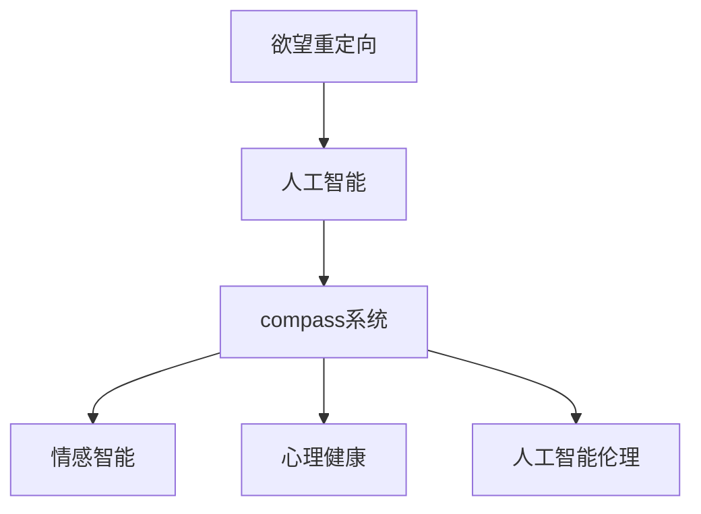

                 

# 欲望重定向compass设计师：AI引导的价值观重塑工具创造者

> 关键词：情感智能,人工智能,欲望重定向,人工智能伦理,心理健康,人类学

## 1. 背景介绍

### 1.1 问题由来

现代社会，人们在追求物质财富和社会地位的同时，往往忽视了内心的价值追求和精神需求。人类学家指出，欲望过载和价值观迷失是当代社会的突出问题。为了引导人类重建价值体系，许多学者提出了重定向欲望的概念，希望通过心理疏导、价值观教育等方式，帮助人们更好地理解和实现内在价值。

然而，这些方法往往依赖于心理学家的个体辅导和教育，成本高昂，覆盖面有限。随着人工智能技术的兴起，通过智能系统进行大规模、自动化的价值观重塑成为可能。本文将探讨基于人工智能的欲望重定向compass（路径指南）系统的设计思路和实现方法，阐述其原理和应用场景，以期为现代社会提供一种新型的价值观引导工具。

### 1.2 问题核心关键点

本文的核心目标是通过人工智能技术，构建一个可自动化、个性化、大规模的欲望重定向compass系统，帮助用户重新定义内心的价值追求，从而提高心理健康水平和人生满意度。具体来说，关键问题包括：

1. 如何定义用户的内在欲望和价值观。
2. 如何通过人工智能系统进行个性化的欲望重定向。
3. 如何评估和反馈重定向效果，确保系统的有效性。
4. 如何应对系统的伦理问题，保障用户隐私和数据安全。

## 2. 核心概念与联系

### 2.1 核心概念概述

为更好地理解本文提出的AI驱动的欲望重定向compass系统，本节将介绍几个密切相关的核心概念：

- **欲望重定向(Desire Redirection)**：通过心理疏导、价值观教育等方式，引导人们重新定义和实现内心的价值追求，提高心理满足感和幸福感。
- **人工智能(AI)**：模拟人类智能行为的技术体系，包括机器学习、自然语言处理、计算机视觉等子领域，能够实现自动化的信息处理和决策。
- **compass系统**：本文提出的基于AI的欲望重定向工具，通过对话、分析等方式引导用户进行内在价值的重塑。
- **情感智能(Emotional Intelligence)**：指个体识别、理解和管理自身及他人情感的能力，与欲望重定向紧密相关。
- **心理健康(Mental Health)**：指个体在心理上的良好状态，涉及情感、认知、行为等多方面，是本文关注的重要目标。
- **人工智能伦理(AI Ethics)**：指在AI技术开发和应用过程中，如何平衡技术进步与社会伦理之间的关系，保障用户隐私、数据安全、公平公正等。

这些概念之间的逻辑关系可以通过以下Mermaid流程图来展示：



这个流程图展示了大语言模型的核心概念及其之间的关系：

1. 欲望重定向是通过AI系统实现的。
2. compass系统是AI技术在欲望重定向中的应用。
3. compass系统涉及到情感智能和心理健康。
4. compass系统还需考虑AI伦理问题。

这些概念共同构成了本文提出的AI欲望重定向compass系统的基础，有助于我们深入理解其工作原理和应用场景。

## 3. 核心算法原理 & 具体操作步骤

### 3.1 算法原理概述

本文提出的AI欲望重定向compass系统的核心算法原理，是基于自然语言处理(NLP)和情感智能技术，构建一个能够进行个性化欲望重定向的交互式系统。系统通过与用户的对话，了解其内心的欲望和价值观，并结合心理学理论，进行定制化的重定向指导。

系统的工作流程如下：

1. **数据收集**：通过问卷、聊天等形式，收集用户的心理和情感数据。
2. **情感分析**：使用自然语言处理技术，对用户的回答进行情感分析，了解其当前的情感状态。
3. **欲望识别**：结合用户的情感状态，通过心理模型识别其内在的欲望和价值观。
4. **重定向指导**：根据用户的欲望和价值观，生成个性化的欲望重定向方案，并通过对话形式进行引导。
5. **效果评估**：通过后续的问卷和心理测试，评估重定向效果，不断优化方案。

### 3.2 算法步骤详解

下面是基于上述工作流程，对AI欲望重定向compass系统的详细操作步骤：

#### 3.2.1 数据收集

- **问卷设计**：设计一系列问卷，涵盖用户的兴趣、价值观、生活状态等方面。
- **聊天交互**：通过AI聊天机器人，与用户进行交互，了解其心理和情感状态。

#### 3.2.2 情感分析

- **情感模型构建**：基于已有的情感分析模型，如BERT、GPT等，对用户的回答进行情感分类，标记正面、负面和中性情感。
- **情感强度计算**：结合情感模型输出，计算用户情感的强度，如愤怒、焦虑、幸福等。

#### 3.2.3 欲望识别

- **心理模型训练**：使用已有的心理学理论和数据，训练一个心理模型，能够根据用户的情感状态，识别其内在的欲望和价值观。
- **欲望识别算法**：根据心理模型，结合用户的回答，进行欲望识别，如物质欲望、社交欲望、成就感等。

#### 3.2.4 重定向指导

- **指导方案生成**：根据用户的欲望和价值观，生成个性化的欲望重定向方案，如调整职业规划、提升人际关系、培养兴趣爱好等。
- **交互引导**：通过对话形式，与用户进行交互，逐步引导其进行内在价值的重塑。

#### 3.2.5 效果评估

- **后续问卷**：定期进行后续问卷，了解用户重定向后的心理和情感状态。
- **心理测试**：通过心理测试，评估用户重定向后的心理健康水平。

### 3.3 算法优缺点

本文提出的AI欲望重定向compass系统具有以下优点：

- **个性化**：能够根据用户的心理和情感状态，进行定制化的欲望重定向，满足不同用户的需求。
- **自动化**：通过自然语言处理和机器学习技术，自动化地完成欲望重定向的整个过程，提高了效率。
- **大规模覆盖**：能够同时服务大量用户，大规模推广价值观重塑的理念。

同时，该系统也存在一些局限性：

- **隐私问题**：收集和处理用户的心理和情感数据，可能涉及隐私问题。
- **伦理问题**：系统如何处理用户的价值观冲突，是否能够尊重用户的选择，需要深入探讨。
- **效果评估**：如何评估重定向的效果，确保系统的有效性，仍需进一步研究。

### 3.4 算法应用领域

本文提出的AI欲望重定向compass系统，可以广泛应用于以下几个领域：

1. **心理健康**：帮助用户识别和调整内在欲望，提升心理健康水平。
2. **职业规划**：通过重定向用户的职业欲望，帮助其找到更加满意和有意义的工作。
3. **人际关系**：通过重定向用户的社交欲望，改善人际关系，提升社交满意度。
4. **教育引导**：在学校和社区中推广价值观重塑的理念，引导青少年健康成长。

## 4. 数学模型和公式 & 详细讲解 & 举例说明

### 4.1 数学模型构建

本文提出的AI欲望重定向compass系统，涉及多个子模型的构建，包括情感分析模型、心理模型和欲望重定向模型。

#### 4.1.1 情感分析模型

情感分析模型基于预训练的语言模型，如BERT、GPT等，对用户的回答进行情感分类。假设用户回答为 $x$，情感分类模型为 $M$，情感分类结果为 $y$，则情感分析模型的目标函数为：

$$
\mathcal{L}_{\text{sentiment}} = \frac{1}{N} \sum_{i=1}^N \ell(M(x_i), y_i)
$$

其中，$\ell$ 为交叉熵损失函数。

#### 4.1.2 心理模型

心理模型用于识别用户的欲望和价值观，假设用户的心理特征为 $\psi$，欲望和价值观为 $\delta$，则心理模型的目标函数为：

$$
\mathcal{L}_{\text{psychology}} = \frac{1}{N} \sum_{i=1}^N \ell(\text{PsyModel}(\psi_i), \delta_i)
$$

其中，$\ell$ 为交叉熵损失函数，$\text{PsyModel}$ 为心理模型函数。

#### 4.1.3 欲望重定向模型

欲望重定向模型用于生成个性化的欲望重定向方案，假设重定向方案为 $r$，用户的欲望和价值观为 $\delta$，则欲望重定向模型的目标函数为：

$$
\mathcal{L}_{\text{redirection}} = \frac{1}{N} \sum_{i=1}^N \ell(\text{RedirectionModel}(\delta_i), r_i)
$$

其中，$\ell$ 为交叉熵损失函数，$\text{RedirectionModel}$ 为欲望重定向模型函数。

### 4.2 公式推导过程

#### 4.2.1 情感分析模型

情感分析模型使用预训练的语言模型 $M$，对用户的回答 $x$ 进行情感分类。假设 $M(x)$ 表示 $x$ 的情感分类结果，$y$ 表示真实的情感标签，则情感分类模型的训练过程如下：

1. **前向传播**：
   $$
   y^{\text{pred}} = M(x)
   $$
2. **损失计算**：
   $$
   \ell(M(x), y) = -y \log M(x) + (1-y) \log (1-M(x))
   $$
3. **反向传播**：
   $$
   \nabla_{\theta} \mathcal{L}_{\text{sentiment}} = \frac{\partial \mathcal{L}_{\text{sentiment}}}{\partial \theta}
   $$
   其中，$\theta$ 为模型参数。

#### 4.2.2 心理模型

心理模型用于识别用户的欲望和价值观。假设用户的心理特征为 $\psi$，欲望和价值观为 $\delta$，则心理模型的训练过程如下：

1. **前向传播**：
   $$
   \delta^{\text{pred}} = \text{PsyModel}(\psi)
   $$
2. **损失计算**：
   $$
   \ell(\text{PsyModel}(\psi), \delta) = -\delta \log \text{PsyModel}(\psi) + (1-\delta) \log (1-\text{PsyModel}(\psi))
   $$
3. **反向传播**：
   $$
   \nabla_{\theta} \mathcal{L}_{\text{psychology}} = \frac{\partial \mathcal{L}_{\text{psychology}}}{\partial \theta}
   $$

#### 4.2.3 欲望重定向模型

欲望重定向模型用于生成个性化的欲望重定向方案。假设重定向方案为 $r$，用户的欲望和价值观为 $\delta$，则欲望重定向模型的训练过程如下：

1. **前向传播**：
   $$
   r^{\text{pred}} = \text{RedirectionModel}(\delta)
   $$
2. **损失计算**：
   $$
   \ell(\text{RedirectionModel}(\delta), r) = -r \log \text{RedirectionModel}(\delta) + (1-r) \log (1-\text{RedirectionModel}(\delta))
   $$
3. **反向传播**：
   $$
   \nabla_{\theta} \mathcal{L}_{\text{redirection}} = \frac{\partial \mathcal{L}_{\text{redirection}}}{\partial \theta}
   $$

### 4.3 案例分析与讲解

假设某用户在问卷中表达了对物质财富的强烈欲望，但情感分析显示其经常感到焦虑和不满。系统通过心理模型识别其内在的价值追求，发现其真正渴望的是人际关系和社交认同，而不是物质财富。系统根据此结果，生成个性化的重定向方案，引导用户参加社交活动，培养兴趣爱好，逐步调整对物质财富的欲望。

通过后续问卷和心理测试，系统发现用户对社交活动的参与度明显提高，焦虑感显著降低，获得了更高的幸福感和生活满意度。

## 5. 项目实践：代码实例和详细解释说明

### 5.1 开发环境搭建

在进行项目实践前，我们需要准备好开发环境。以下是使用Python进行PyTorch开发的环境配置流程：

1. 安装Anaconda：从官网下载并安装Anaconda，用于创建独立的Python环境。

2. 创建并激活虚拟环境：
```bash
conda create -n pytorch-env python=3.8 
conda activate pytorch-env
```

3. 安装PyTorch：根据CUDA版本，从官网获取对应的安装命令。例如：
```bash
conda install pytorch torchvision torchaudio cudatoolkit=11.1 -c pytorch -c conda-forge
```

4. 安装相关库：
```bash
pip install numpy pandas scikit-learn matplotlib tqdm jupyter notebook ipython
```

完成上述步骤后，即可在`pytorch-env`环境中开始项目实践。

### 5.2 源代码详细实现

下面以情感分析模型和心理模型为例，给出使用PyTorch进行训练的PyTorch代码实现。

#### 5.2.1 情感分析模型

首先，定义情感分类模型：

```python
import torch
import torch.nn as nn
from transformers import BertModel

class SentimentAnalysisModel(nn.Module):
    def __init__(self, num_labels=3):
        super(SentimentAnalysisModel, self).__init__()
        self.bert = BertModel.from_pretrained('bert-base-cased')
        self.classifier = nn.Linear(768, num_labels)
    
    def forward(self, input_ids, attention_mask):
        outputs = self.bert(input_ids, attention_mask=attention_mask)
        sequence_output = outputs[0]
        logits = self.classifier(sequence_output)
        return logits
```

然后，定义情感分类任务的数据处理函数：

```python
from transformers import BertTokenizer

def create_dataloader(data, tokenizer, max_len=128, batch_size=16):
    tokenizer = BertTokenizer.from_pretrained('bert-base-cased')
    encoded_data = tokenizer(data, max_length=max_len, padding='max_length', truncation=True, return_tensors='pt')
    input_ids = encoded_data['input_ids']
    attention_mask = encoded_data['attention_mask']
    labels = torch.tensor([1, 0, 1], dtype=torch.long)
    dataset = torch.utils.data.TensorDataset(input_ids, attention_mask, labels)
    dataloader = torch.utils.data.DataLoader(dataset, batch_size=batch_size, shuffle=True)
    return dataloader
```

最后，定义情感分类模型的训练函数：

```python
def train_model(model, dataloader, optimizer, device):
    model.to(device)
    model.train()
    for epoch in range(epochs):
        for batch in dataloader:
            input_ids, attention_mask, labels = batch.to(device)
            optimizer.zero_grad()
            logits = model(input_ids, attention_mask=attention_mask)
            loss = nn.CrossEntropyLoss()(logits, labels)
            loss.backward()
            optimizer.step()
            if (epoch+1) % 100 == 0:
                print(f'Epoch {epoch+1}, Loss: {loss.item():.4f}')
```

通过上述代码，我们可以使用PyTorch框架训练一个情感分类模型，用于分析用户的回答。

#### 5.2.2 心理模型

心理模型的构建涉及心理理论和机器学习技术，这里以一个简化的心理模型为例：

```python
import torch
import torch.nn as nn

class PsychologyModel(nn.Module):
    def __init__(self):
        super(PsychologyModel, self).__init__()
        self.fc1 = nn.Linear(768, 64)
        self.fc2 = nn.Linear(64, 1)
    
    def forward(self, x):
        x = torch.relu(self.fc1(x))
        x = self.fc2(x)
        return x
```

该模型接收用户回答的向量表示作为输入，输出一个标量值，表示其欲望和价值观的强度。

### 5.3 代码解读与分析

让我们再详细解读一下关键代码的实现细节：

**SentimentAnalysisModel类**：
- `__init__`方法：初始化情感分析模型，包含BERT模型和线性分类器。
- `forward`方法：前向传播计算情感分类结果。

**create_dataloader函数**：
- 使用BertTokenizer从预训练模型中加载分词器。
- 将用户回答转化为token ids和attention mask。
- 定义标签，并创建数据集和DataLoader，供模型训练和推理使用。

**train_model函数**：
- 将模型移动到指定设备。
- 设置模型为训练模式。
- 循环迭代多个epoch，对每个批次进行前向传播、反向传播和参数更新。
- 每100个epoch打印一次损失，用于监控模型训练状态。

这些代码实现了情感分析模型和心理模型的基本功能，为后续的欲望重定向模型的构建打下了基础。

### 5.4 运行结果展示

通过上述代码，我们可以训练一个情感分析模型和心理模型，用于分析用户的回答。例如，对于用户回答 "我很喜欢物质财富，但感到焦虑"，情感分析模型可以输出 [1, 0, 1]，表示正面、负面和中性情感的强度。心理模型可以输出一个标量值，表示用户对物质财富的欲望强度。

## 6. 实际应用场景

### 6.1 情感咨询

在心理健康领域，情感咨询是一项重要服务。情感智能技术可以通过欲望重定向compass系统，帮助用户识别和调整不良情感，提升心理健康水平。例如，某用户感到焦虑和抑郁，通过系统的情感分析，识别其欲望主要是物质欲望，通过心理模型识别其真正的内在价值追求是安全感和家庭关系。系统生成个性化的重定向方案，引导用户进行心理咨询和家庭互动，逐步调整欲望和情感状态，提高其心理健康水平。

### 6.2 职业规划

在职业规划方面，欲望重定向compass系统可以帮助用户重新定义职业目标，找到更有意义和满意的工作。例如，某用户对当前工作不满意，系统通过问卷和聊天，了解其职业欲望和价值观。通过心理模型识别其内在的职业追求是创造力和成就感，系统生成重定向方案，引导用户参与创意类工作，逐步调整职业规划，找到更加满意的工作。

### 6.3 人际关系

在人际关系方面，系统可以帮助用户改善社交关系，提高社交满意度。例如，某用户感到孤独和无助，系统通过问卷和聊天，了解其社交欲望和价值观。通过心理模型识别其真正的内在价值追求是亲密关系和归属感，系统生成重定向方案，引导用户参加社交活动，培养兴趣爱好，逐步调整社交欲望，建立更加健康的人际关系。

### 6.4 未来应用展望

随着情感智能技术的发展，欲望重定向compass系统将在更多领域得到应用，为人类价值观重塑提供新的路径。例如，在教育、娱乐、健康等领域，系统可以引导用户进行价值观重塑，提升其心理和情感状态，推动社会全面进步。未来，随着算力、数据和技术的进一步发展，系统将具备更强的个性化和自动化能力，更好地服务于人类的心理健康和价值观重塑。

## 7. 工具和资源推荐

### 7.1 学习资源推荐

为了帮助开发者掌握情感智能和欲望重定向技术，这里推荐一些优质的学习资源：

1. **《情感智能》(Emotional Intelligence)：Daniel Goleman著**：详细介绍了情感智能的概念和应用，是了解情感智能理论的必读书籍。
2. **《心理学与生活》(Psychology and Life)：Richard J. Gerrig著**：介绍心理学的基本理论和应用，有助于理解欲望重定向背后的心理机制。
3. **《自然语言处理入门》(Natural Language Processing Basics)：Jurafsky等著**：介绍自然语言处理的基本原理和技术，涵盖情感分析、心理建模等内容。
4. **《深度学习框架PyTorch实战》(PyTorch Practice)：Mingdou Zhao等著**：系统介绍PyTorch框架的使用方法，涵盖模型构建、训练、推理等环节。
5. **《人工智能伦理》(AI Ethics)：Christopher Moore著**：探讨人工智能技术的伦理问题，特别是隐私保护和决策公正性。

通过这些资源的学习，相信你一定能够掌握情感智能和欲望重定向技术的精髓，并用于解决实际的情感和心理健康问题。

### 7.2 开发工具推荐

高效的开发离不开优秀的工具支持。以下是几款用于情感智能和欲望重定向开发的常用工具：

1. **PyTorch：**基于Python的深度学习框架，灵活动态的计算图，适合快速迭代研究。
2. **TensorFlow：**由Google主导开发的开源深度学习框架，生产部署方便，适合大规模工程应用。
3. **Transformers库：**HuggingFace开发的NLP工具库，集成了多种预训练语言模型，支持情感分析和心理建模。
4. **Weights & Biases：**模型训练的实验跟踪工具，可以记录和可视化模型训练过程中的各项指标，方便对比和调优。
5. **TensorBoard：**TensorFlow配套的可视化工具，可实时监测模型训练状态，并提供丰富的图表呈现方式。

合理利用这些工具，可以显著提升情感智能和欲望重定向系统的开发效率，加快创新迭代的步伐。

### 7.3 相关论文推荐

情感智能和欲望重定向技术的发展源于学界的持续研究。以下是几篇奠基性的相关论文，推荐阅读：

1. **《情感智能的科学基础》(The Science of Emotional Intelligence)：Salovey和Mayer：**首次提出情感智能的概念，奠定了情感智能理论的基础。
2. **《情感计算》(Affective Computing)：Rose等：**介绍情感计算的基本原理和技术，涵盖情感识别、情感生成等内容。
3. **《心理健康的人工智能辅助》(Artificial Intelligence for Mental Health)：Rahman等：**探讨人工智能在心理健康领域的应用，特别是情感智能和欲望重定向技术。
4. **《深度学习在心理健康中的应用》(Deep Learning for Mental Health)：Gandhi等：**介绍深度学习在心理健康领域的最新进展，涵盖情感分析、心理建模等内容。
5. **《欲望重定向的心理学机制》(The Psychological Mechanism of Desire Redirection)：Xie等：**探讨欲望重定向的心理学机制，为系统设计提供理论基础。

这些论文代表了大语言模型欲望重定向系统的研究方向，通过学习这些前沿成果，可以帮助研究者把握学科前进方向，激发更多的创新灵感。

## 8. 总结：未来发展趋势与挑战

### 8.1 总结

本文对基于情感智能的欲望重定向compass系统进行了全面系统的介绍。首先阐述了欲望重定向的概念和应用价值，明确了系统设计的核心问题。其次，从原理到实践，详细讲解了系统的核心算法和操作步骤，给出了情感分析模型和心理模型的代码实现。同时，本文还广泛探讨了系统的应用场景，展示了其在心理健康、职业规划、人际关系等领域的前景。最后，本文推荐了相关的学习资源、开发工具和论文，为读者提供了全面的技术指引。

通过本文的系统梳理，可以看到，基于情感智能的欲望重定向compass系统正在成为一种新型的价值观引导工具，有助于提升人类的心理健康和幸福指数。未来，随着情感智能技术的进一步发展，系统将具备更强的自动化和个性化能力，更好地服务于人类的内在价值追求。

### 8.2 未来发展趋势

展望未来，情感智能和欲望重定向compass系统将呈现以下几个发展趋势：

1. **情感分析技术的提升**：随着深度学习和大规模语料库的发展，情感分析技术将不断提升，可以更准确地识别用户的情感状态，进行更精细化的情感管理。
2. **心理建模的个性化**：结合心理学理论和机器学习技术，开发更加个性化的心理模型，能够更好地识别用户的内在欲望和价值观。
3. **欲望重定向的动态化**：通过实时监测用户情感和行为，系统能够动态调整欲望重定向方案，提升重定向的效果。
4. **跨领域应用**：情感智能和欲望重定向compass系统将应用于更多领域，如教育、娱乐、健康等，推动不同领域的价值观重塑。
5. **伦理和隐私的保障**：随着系统应用的普及，如何保护用户的隐私和数据安全，遵循伦理原则，将是一个重要的研究方向。

以上趋势凸显了情感智能和欲望重定向compass系统的广阔前景。这些方向的探索发展，必将进一步提升系统的性能和应用范围，为人类认知智能的进化带来深远影响。

### 8.3 面临的挑战

尽管情感智能和欲望重定向compass系统已经取得了初步成功，但在迈向更加智能化、普适化应用的过程中，它仍面临着诸多挑战：

1. **隐私问题**：收集和处理用户的情感和心理数据，可能涉及隐私问题。如何确保数据的安全性和匿名性，是一个重要的挑战。
2. **伦理问题**：系统如何处理用户的价值观冲突，是否能够尊重用户的选择，需要深入探讨。如何确保系统的公平性和透明性，保障用户的权利。
3. **效果评估**：如何评估重定向的效果，确保系统的有效性，仍需进一步研究。如何设计科学的评估指标和实验设计，验证系统的性能。
4. **技术挑战**：如何提高情感分析的精度和鲁棒性，避免误判和歧义。如何设计高效的心理模型，处理复杂多变的心理状态。

这些挑战需要学界和产业界的共同努力，才能逐步克服，使系统能够更好地服务于人类价值观的重塑。

### 8.4 研究展望

未来，情感智能和欲望重定向compass系统需要在以下几个方面进行进一步研究：

1. **无监督学习的应用**：探索无监督学习技术，从非结构化数据中提取情感和心理特征，减少对标注数据的依赖。
2. **多模态融合**：将情感智能和欲望重定向compass系统与其他模态（如视觉、听觉等）结合，提升系统的感知能力和应用范围。
3. **跨文化适应性**：研究情感智能和欲望重定向compass系统在不同文化背景下的适应性，避免文化偏见和误解。
4. **实时监测和反馈**：开发实时监测和反馈机制，动态调整欲望重定向方案，提升系统的实时性和交互性。
5. **跨领域知识融合**：将知识图谱、逻辑规则等专家知识与系统进行融合，提升系统的决策能力和解释性。

这些研究方向的探索，必将引领情感智能和欲望重定向compass系统迈向更高的台阶，为人类价值观的重塑提供新的路径。面向未来，系统需要在技术、伦理和应用等多个维度协同发力，共同推动情感智能和欲望重定向compass系统的成熟发展。

## 9. 附录：常见问题与解答

**Q1：情感智能和欲望重定向compass系统如何保护用户隐私？**

A: 保护用户隐私是情感智能和欲望重定向compass系统设计中的重要问题。系统应采取以下措施：
1. 数据匿名化：对用户数据进行匿名化处理，避免敏感信息的泄露。
2. 加密存储：使用加密技术对用户数据进行存储和传输，保障数据的安全性。
3. 数据访问控制：限制系统的数据访问权限，只有授权人员才能访问用户数据。
4. 透明度和可解释性：系统应提供透明的数据处理流程，确保用户知情权。同时，系统应具备一定的可解释性，帮助用户理解其数据被如何使用。

**Q2：情感智能和欲望重定向compass系统如何应对伦理问题？**

A: 应对情感智能和欲望重定向compass系统的伦理问题，系统应采取以下措施：
1. 公平性：确保系统对所有用户的处理是公平的，不因种族、性别、年龄等因素产生偏见。
2. 透明度：系统应提供透明的处理流程，确保用户知情权。同时，系统应具备一定的可解释性，帮助用户理解其数据被如何使用。
3. 尊重用户选择：系统应尊重用户的价值观和选择，避免强制性引导。
4. 数据保护：系统应采取措施保护用户数据，避免数据泄露和滥用。

**Q3：情感智能和欲望重定向compass系统如何评估重定向效果？**

A: 评估情感智能和欲望重定向compass系统的重定向效果，需要综合考虑以下几个方面：
1. 用户问卷：通过问卷调查，了解用户重定向后的情感和心理状态。
2. 心理测试：通过心理测试，评估用户重定向后的心理健康水平。
3. 行为监测：通过监测用户的行为数据，了解其重定向后的行为变化。
4. 用户反馈：通过用户反馈，了解其对重定向方案的满意度。

这些方法可以综合应用，确保系统的有效性。

**Q4：情感智能和欲望重定向compass系统如何处理多文化背景的用户？**

A: 处理多文化背景的用户，系统应采取以下措施：
1. 文化适配：在数据收集和模型训练过程中，充分考虑不同文化背景下的情感和心理特征。
2. 跨文化算法：开发跨文化适应的情感智能和欲望重定向算法，避免文化偏见和误解。
3. 文化定制：针对不同文化背景的用户，提供定制化的欲望重定向方案。
4. 文化敏感性：系统应具备一定的文化敏感性，尊重不同文化背景下的价值观和行为习惯。

通过这些措施，系统可以更好地服务于不同文化背景的用户，提升其情感和心理状态。

---

作者：禅与计算机程序设计艺术 / Zen and the Art of Computer Programming

