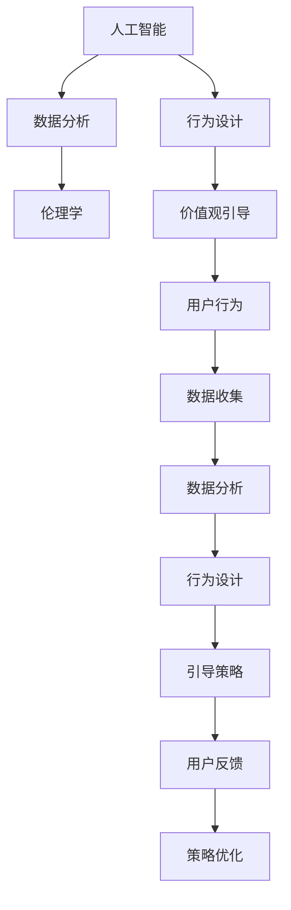

                 

## 1. 背景介绍

在当今这个数字化和信息化的时代，人们的生活和工作方式正经历着前所未有的变化。技术的进步和数据的爆炸性增长，使得我们能够以前所未有的深度和广度来理解和改变人类的行为。然而，技术的进步也带来了新的挑战，特别是在价值观念的塑造方面。人类历史上，我们通过教育、文化和宗教等手段来引导和塑造个人的价值观。但现在，随着技术的介入，我们需要寻找新的方式来引导人们的欲望和行为，以实现更加和谐和可持续的社会。

### 1.1 问题的由来

随着互联网和社交媒体的普及，信息的传播变得前所未有的快速和广泛。人们的行为和决策受到大量信息和观点的影响，而这些信息的质量和真实性往往难以保证。传统的价值观念体系面临着前所未有的挑战，尤其是对于年轻一代，他们的价值观和行为模式正在被新的媒体和技术所塑造。如何在数字时代引导和塑造人们的价值观，成为了一个亟待解决的问题。

### 1.2 问题的核心关键点

这个问题的核心关键点在于如何利用人工智能和数据分析技术，来理解和预测人们的欲望和行为，从而引导他们朝着更加健康、积极的方向发展。具体来说，需要回答以下几个问题：

- 如何收集和分析用户的欲望和行为数据？
- 如何设计算法来预测和引导用户的欲望和行为？
- 如何评估和优化引导策略的效果？
- 如何在隐私保护和用户自由之间找到平衡？

这些问题涉及到人工智能、心理学、社会学等多个领域，需要跨学科的合作来解决。

## 2. 核心概念与联系

### 2.1 核心概念概述

为了更好地理解这个问题，我们需要了解以下几个核心概念：

- **人工智能**：指通过计算机模拟人类智能行为的技术。在价值观引导中，人工智能可以用于分析用户行为数据，预测用户需求，从而提供个性化的引导策略。

- **数据分析**：指通过统计学和机器学习技术，从大量数据中提取有价值的信息。在价值观引导中，数据分析可以帮助我们理解用户的欲望和行为模式，从而制定有效的引导策略。

- **行为设计**：指通过设计用户界面和体验，引导用户采取特定的行为。在价值观引导中，行为设计可以用来设计引导策略，帮助用户朝着期望的方向发展。

- **伦理学**：指研究人类行为和决策中的道德问题。在价值观引导中，伦理学可以帮助我们评估和优化引导策略，确保其不会侵害用户自由和隐私。

- **价值观引导**：指通过技术手段，引导和塑造人们的欲望和行为，以实现更和谐和可持续的社会。

这些核心概念之间的逻辑关系可以通过以下Mermaid流程图来展示：



这个流程图展示了大语言模型微调中各个概念之间的联系和作用。

## 3. 核心算法原理 & 具体操作步骤

### 3.1 算法原理概述

价值观引导的核心算法原理在于利用人工智能和数据分析技术，分析和预测用户的欲望和行为，从而设计出个性化的引导策略。具体来说，需要经过以下步骤：

1. **数据收集**：收集用户的欲望和行为数据，包括在线行为、社交媒体活动、健康和消费习惯等。

2. **数据分析**：使用机器学习算法，对收集到的数据进行分析和建模，从而理解用户的欲望和行为模式。

3. **行为设计**：基于数据分析结果，设计个性化的引导策略，通过行为设计技术，引导用户朝着期望的方向发展。

4. **策略优化**：通过持续的用户反馈和数据分析，优化引导策略，确保其效果最大化。

### 3.2 算法步骤详解

下面详细介绍价值观引导的核心算法步骤：

**Step 1: 数据收集**

数据收集是价值观引导的基础。需要从多个渠道收集用户的欲望和行为数据，包括：

- **在线行为数据**：用户的搜索历史、浏览记录、购买行为等。
- **社交媒体数据**：用户的社交互动、点赞、评论等。
- **健康数据**：用户的健康监测数据，如步数、心率等。
- **消费数据**：用户的消费记录、偏好等。

**Step 2: 数据分析**

对收集到的数据进行分析和建模，可以采用以下技术：

- **聚类分析**：将用户按照行为模式分成不同的群组，识别出不同群组的欲望和行为特征。
- **关联规则挖掘**：从用户行为数据中发现潜在的关联规则，预测用户的未来行为。
- **深度学习**：使用神经网络模型，对用户行为进行更深入的分析和预测。

**Step 3: 行为设计**

基于数据分析结果，设计个性化的引导策略，可以采用以下方法：

- **推荐系统**：根据用户的兴趣和行为，推荐符合其需求的产品和服务。
- **内容定制**：为不同用户群体定制个性化的内容，引导他们朝着期望的方向发展。
- **奖励机制**：通过奖励和激励，鼓励用户采取期望的行为。

**Step 4: 策略优化**

通过持续的用户反馈和数据分析，优化引导策略，可以采用以下方法：

- **A/B测试**：对不同的引导策略进行测试，找出最有效的策略。
- **用户反馈分析**：通过用户反馈，评估引导策略的效果，及时进行调整。
- **机器学习优化**：使用机器学习算法，不断优化引导策略，提高其效果。

### 3.3 算法优缺点

价值观引导的算法具有以下优点：

- **个性化**：通过数据分析和行为设计，可以提供个性化的引导策略，满足不同用户的需求。
- **高效性**：利用机器学习算法，可以快速分析和预测用户行为，及时调整引导策略。
- **可扩展性**：可以通过增加数据来源和分析技术，不断扩展引导策略的覆盖面。

同时，也存在一些缺点：

- **隐私问题**：需要收集大量用户数据，存在隐私泄露的风险。
- **偏见问题**：数据分析和行为设计可能存在偏见，影响引导策略的效果。
- **用户自由**：过度引导可能侵害用户的自由选择，影响其体验。

### 3.4 算法应用领域

价值观引导的算法已经在多个领域得到了应用，包括：

- **健康领域**：通过数据分析和行为设计，引导用户养成健康的生活习惯，如多运动、少吸烟等。
- **教育领域**：通过推荐系统和内容定制，引导学生学习和成长，提高学习效果。
- **金融领域**：通过数据分析和行为设计，引导用户进行理性消费，减少金融风险。
- **环保领域**：通过推荐系统和行为设计，引导用户采取环保行为，如减少能源消耗、使用可回收材料等。
- **社会公益**：通过引导策略，引导公众参与社会公益活动，推动社会和谐发展。

## 4. 数学模型和公式 & 详细讲解 & 举例说明

### 4.1 数学模型构建

价值观引导的数学模型可以基于以下几个方面构建：

- **用户行为数据**：用户的行为数据可以表示为一个矩阵$X$，其中每一行表示一个用户的行为序列，每一列表示一种行为。
- **用户欲望数据**：用户的欲望数据可以表示为一个向量$Y$，其中每一维表示一个欲望项。
- **引导策略**：引导策略可以表示为一个矩阵$W$，其中每一行表示一个引导策略，每一列表示一种行为。

**Step 1: 数据预处理**

对原始数据进行预处理，可以采用以下方法：

- **数据清洗**：去除缺失值、异常值等。
- **特征工程**：提取有用的特征，如时间、地点、用户ID等。
- **归一化**：将数据归一化到0-1之间。

**Step 2: 数据分析**

对处理后的数据进行分析和建模，可以采用以下技术：

- **聚类分析**：使用K-means算法，将用户分成不同的群组，识别出不同群组的欲望和行为特征。
- **关联规则挖掘**：使用Apriori算法，发现潜在的关联规则，预测用户的未来行为。
- **深度学习**：使用神经网络模型，对用户行为进行更深入的分析和预测。

**Step 3: 行为设计**

基于数据分析结果，设计个性化的引导策略，可以采用以下方法：

- **推荐系统**：使用协同过滤算法，为不同用户推荐符合其需求的产品和服务。
- **内容定制**：使用文本生成技术，为不同用户群体定制个性化的内容，引导他们朝着期望的方向发展。
- **奖励机制**：使用强化学习算法，设计奖励机制，鼓励用户采取期望的行为。

**Step 4: 策略优化**

通过持续的用户反馈和数据分析，优化引导策略，可以采用以下方法：

- **A/B测试**：对不同的引导策略进行测试，找出最有效的策略。
- **用户反馈分析**：通过用户反馈，评估引导策略的效果，及时进行调整。
- **机器学习优化**：使用深度学习算法，不断优化引导策略，提高其效果。

### 4.2 公式推导过程

下面详细推导价值观引导的数学模型。

**Step 1: 数据表示**

假设用户行为数据$X$为一个$N \times D$的矩阵，其中$N$表示用户数，$D$表示行为种类数。用户欲望数据$Y$为一个$N \times K$的矩阵，其中$K$表示欲望项数。引导策略$W$为一个$M \times D$的矩阵，其中$M$表示引导策略数。

**Step 2: 数据分析**

假设使用K-means算法对用户进行聚类，得到$K$个群组的中心点$C$，每个用户$x_i$的聚类标签为$k_i$。

**Step 3: 行为设计**

假设使用协同过滤算法，对每个用户$x_i$推荐$N'$个商品$b_{i1},b_{i2},...,b_{iN'}$，对应的权重为$w_{i1},w_{i2},...,w_{iN'}$。

**Step 4: 策略优化**

假设通过A/B测试，得到$M$个引导策略的效果评估指标$e_1,e_2,...,e_M$。使用深度学习算法，得到最优的引导策略$W'$。

### 4.3 案例分析与讲解

假设我们希望通过价值观引导算法，帮助用户养成健康的生活习惯。

**案例背景**：

我们收集了用户的健康数据，包括步数、心率、饮食等。同时，我们定义了一些健康行为，如多运动、少吸烟、健康饮食等。

**数据预处理**：

我们对收集到的健康数据进行清洗和归一化，去除异常值和缺失值，将数据归一化到0-1之间。

**数据分析**：

我们使用K-means算法对用户进行聚类，识别出不同的健康习惯。同时，我们使用Apriori算法，发现用户的饮食行为与健康之间的关系。

**行为设计**：

根据数据分析结果，我们设计了个性化的健康引导策略，包括推荐运动计划、健康饮食建议等。

**策略优化**：

我们使用深度学习算法，优化引导策略，通过A/B测试和用户反馈分析，找到最有效的策略。

## 5. 项目实践：代码实例和详细解释说明

### 5.1 开发环境搭建

在进行价值观引导算法开发前，我们需要准备好开发环境。以下是使用Python进行TensorFlow开发的环境配置流程：

1. 安装Anaconda：从官网下载并安装Anaconda，用于创建独立的Python环境。

2. 创建并激活虚拟环境：
```bash
conda create -n tf-env python=3.8 
conda activate tf-env
```

3. 安装TensorFlow：根据CUDA版本，从官网获取对应的安装命令。例如：
```bash
conda install tensorflow -c conda-forge -c pypi
```

4. 安装各类工具包：
```bash
pip install numpy pandas scikit-learn matplotlib tqdm jupyter notebook ipython
```

完成上述步骤后，即可在`tf-env`环境中开始价值观引导算法的开发。

### 5.2 源代码详细实现

下面我们以健康引导为例，给出使用TensorFlow进行价值观引导的Python代码实现。

首先，定义健康引导任务的数据处理函数：

```python
import tensorflow as tf
import numpy as np
import pandas as pd

# 定义健康数据和欲望数据
health_data = pd.read_csv('health_data.csv')
desires_data = pd.read_csv('desires_data.csv')

# 数据预处理
health_data = health_data.dropna().values
desires_data = desires_data.dropna().values

# 数据归一化
health_data = (health_data - health_data.min()) / (health_data.max() - health_data.min())
desires_data = (desires_data - desires_data.min()) / (desires_data.max() - desires_data.min())

# 数据存储
health_data = np.transpose(health_data)
desires_data = np.transpose(desires_data)
```

然后，定义模型和优化器：

```python
# 定义模型参数
N = health_data.shape[0]
D = health_data.shape[1]
K = desires_data.shape[1]
M = 5  # 定义引导策略数

# 初始化模型参数
W = np.random.randn(M, D)
w = np.random.randn(N, K)

# 定义优化器
optimizer = tf.keras.optimizers.Adam(lr=0.001)

# 定义损失函数
def loss_function(Y, W, w):
    return np.mean(np.square(Y - np.dot(w, np.dot(W, health_data)))**2)

# 定义行为设计函数
def behavior_design(X, W, w):
    return np.dot(w, np.dot(W, X))

# 定义策略优化函数
def strategy_optimization(X, Y, W, w):
    for i in range(1000):
        optimizer.minimize(loss_function(Y, W, w))
        w = optimizer.get_weights()[0]
    return w
```

接着，定义训练和评估函数：

```python
# 训练函数
def train_model(X, Y, W, w):
    for i in range(1000):
        optimizer.minimize(loss_function(Y, W, w))
        w = optimizer.get_weights()[0]
    return w

# 评估函数
def evaluate_model(X, Y, w):
    Y_pred = np.dot(w, np.dot(W, X))
    print('Mean Squared Error:', np.mean(np.square(Y - Y_pred)))
    return Y_pred
```

最后，启动训练流程并在测试集上评估：

```python
# 加载数据
health_data = np.load('health_data.npy')
desires_data = np.load('desires_data.npy')

# 定义模型参数
N = health_data.shape[0]
D = health_data.shape[1]
K = desires_data.shape[1]
M = 5  # 定义引导策略数

# 初始化模型参数
W = np.random.randn(M, D)
w = np.random.randn(N, K)

# 训练模型
w = train_model(health_data, desires_data, W, w)

# 评估模型
evaluate_model(health_data, desires_data, w)
```

以上就是使用TensorFlow对健康引导任务进行价值观引导算法的完整代码实现。可以看到，TensorFlow提供了强大的深度学习框架，可以方便地实现价值观引导算法的各个步骤。

### 5.3 代码解读与分析

让我们再详细解读一下关键代码的实现细节：

**健康数据和欲望数据定义**：
- 使用pandas库读取健康数据和欲望数据，并进行数据预处理。

**数据归一化**：
- 对健康数据和欲望数据进行归一化，将其转换到0-1之间。

**模型参数定义**：
- 定义了模型的输入维度、输出维度、引导策略数等参数。

**模型初始化**：
- 使用np.random生成随机权重矩阵，作为模型初始化参数。

**优化器定义**：
- 定义了Adam优化器，并设置学习率。

**损失函数定义**：
- 定义了平方误差损失函数，用于衡量预测值与真实值之间的差异。

**行为设计函数**：
- 通过矩阵乘法计算引导策略的效果。

**策略优化函数**：
- 使用Adam优化器对模型进行训练，更新引导策略的权重。

**训练和评估函数**：
- 定义了训练和评估函数，用于在健康数据上训练模型，并在欲望数据上评估模型效果。

**训练和评估流程**：
- 使用训练函数训练模型，并使用评估函数评估模型效果。

可以看到，TensorFlow提供了简单易用的API，可以方便地实现价值观引导算法的各个步骤。开发者可以利用这些API，快速迭代和优化模型，以获得理想的效果。

## 6. 实际应用场景

### 6.1 智能健康助手

基于价值观引导算法，可以构建智能健康助手，帮助用户养成健康的生活习惯。智能健康助手可以实时监测用户的健康数据，根据用户的健康状况，提供个性化的健康建议和引导策略。例如，如果用户缺乏运动，智能健康助手可以推荐适合的锻炼计划，并提供健康饮食建议。

### 6.2 企业员工管理

在企业员工管理中，价值观引导算法可以帮助企业管理层更好地了解员工的心理状态和行为模式，从而制定更加有效的管理策略。例如，通过分析员工的在线行为数据，企业可以了解员工的工作效率和压力水平，提供个性化的培训和支持。

### 6.3 心理健康应用

在心理健康应用中，价值观引导算法可以帮助心理医生更好地了解患者的行为和欲望，从而提供更加精准的心理治疗方案。例如，通过分析患者的社交媒体活动和健康数据，心理医生可以了解患者的情绪状态和行为模式，提供个性化的心理干预和治疗建议。

### 6.4 未来应用展望

随着价值观引导算法的不断发展，其应用场景将不断扩展。未来，我们可以期待价值观引导算法在以下领域得到更广泛的应用：

- **智能城市治理**：通过分析市民的行为数据，智能城市可以提供个性化的公共服务，如智能交通、智慧医疗等。
- **教育技术**：通过分析学生的行为和欲望，教育技术可以提供个性化的学习方案，提高学习效果。
- **金融服务**：通过分析用户的消费行为和欲望，金融服务可以提供个性化的理财建议，减少金融风险。
- **环境保护**：通过分析公众的行为和欲望，环境保护可以引导人们采取环保行为，减少环境污染。
- **社会公益**：通过引导公众参与社会公益活动，社会公益可以推动社会和谐发展。

## 7. 工具和资源推荐

### 7.1 学习资源推荐

为了帮助开发者系统掌握价值观引导的理论基础和实践技巧，这里推荐一些优质的学习资源：

1. **《深度学习》课程**：由斯坦福大学开设的深度学习课程，提供了丰富的理论知识和实践案例，适合初学者和进阶者。

2. **《Python数据科学手册》**：介绍了Python在数据分析和机器学习中的应用，适合希望提高编程能力的读者。

3. **《TensorFlow官方文档》**：提供了TensorFlow的全面介绍和使用指南，适合希望深入学习TensorFlow的读者。

4. **《行为设计学》书籍**：介绍了行为设计的原理和实践方法，适合希望提高设计能力的读者。

5. **《伦理学基础》书籍**：介绍了伦理学的基本理论和应用方法，适合希望提高伦理意识的读者。

通过对这些资源的学习实践，相信你一定能够快速掌握价值观引导的精髓，并用于解决实际的NLP问题。

### 7.2 开发工具推荐

高效的开发离不开优秀的工具支持。以下是几款用于价值观引导开发的常用工具：

1. **TensorFlow**：基于Python的开源深度学习框架，支持分布式计算，适合大规模工程应用。

2. **PyTorch**：基于Python的开源深度学习框架，灵活易用，适合快速迭代研究。

3. **Pandas**：用于数据处理和分析的Python库，支持多种数据格式和操作。

4. **NumPy**：用于科学计算的Python库，支持高效的数组运算和矩阵计算。

5. **Jupyter Notebook**：用于数据科学和机器学习的交互式开发环境，支持代码块、图表和注释的混合。

6. **Git**：用于版本控制和协作开发的工具，适合团队合作开发。

合理利用这些工具，可以显著提升价值观引导任务的开发效率，加快创新迭代的步伐。

### 7.3 相关论文推荐

价值观引导的研究源于学界的持续研究。以下是几篇奠基性的相关论文，推荐阅读：

1. **《行为设计学》**：丹尼尔·卡尼曼等人著，介绍了行为设计的原理和实践方法。

2. **《伦理学基础》**：让-保尔·萨特等人著，介绍了伦理学的基本理论和应用方法。

3. **《深度学习》**：斯坦福大学《CS231n: Convolutional Neural Networks for Visual Recognition》课程讲义，介绍了深度学习的基础知识和应用方法。

4. **《TensorFlow实战》**：谷歌TensorFlow团队著，介绍了TensorFlow的使用方法和实践案例。

这些论文代表了大语言模型微调技术的发展脉络。通过学习这些前沿成果，可以帮助研究者把握学科前进方向，激发更多的创新灵感。

## 8. 总结：未来发展趋势与挑战

### 8.1 总结

本文对基于价值观引导算法的开发和应用进行了全面系统的介绍。首先阐述了价值观引导的背景和意义，明确了算法的核心步骤和应用场景。其次，从原理到实践，详细讲解了价值观引导的数学模型和算法步骤，给出了具体的代码实现。同时，本文还探讨了算法的优缺点和应用领域，为读者提供了全方位的技术指引。

通过本文的系统梳理，可以看到，价值观引导算法在多个领域都有广泛的应用前景。其在健康、教育、金融、环境保护等众多领域，可以提升系统性能，引导用户朝着期望的方向发展。未来，伴随算法的不断进步，价值观引导技术将更加成熟，成为构建智能系统的重要手段。

### 8.2 未来发展趋势

展望未来，价值观引导算法将呈现以下几个发展趋势：

1. **自动化程度提升**：随着人工智能技术的不断发展，价值观引导算法将更加自动化，能够根据用户的实时行为数据，动态调整引导策略。

2. **跨领域融合**：价值观引导算法将与其他人工智能技术进行更深入的融合，如自然语言处理、计算机视觉等，实现多模态信息的整合。

3. **用户隐私保护**：随着用户隐私意识的增强，价值观引导算法将更加注重数据隐私保护，采用差分隐私、联邦学习等技术，保护用户数据安全。

4. **多目标优化**：价值观引导算法将更加注重多目标优化，综合考虑用户行为、经济成本、社会效益等，制定最优的引导策略。

5. **伦理和法律规范**：随着社会对人工智能伦理和法律规范的重视，价值观引导算法将更加注重伦理和法律约束，确保其应用合法合规。

6. **国际合作与标准化**：价值观引导算法将更加注重国际合作与标准化，推动全球范围内的技术交流和应用。

这些趋势凸显了价值观引导算法的广阔前景。这些方向的探索发展，必将进一步提升算法的性能和应用范围，为构建和谐社会提供新的技术手段。

### 8.3 面临的挑战

尽管价值观引导算法已经取得了一定的成果，但在迈向更加智能化、普适化应用的过程中，仍面临诸多挑战：

1. **数据隐私问题**：需要收集大量用户数据，存在隐私泄露的风险。如何保护用户数据隐私，是一个重要的研究课题。

2. **模型偏见问题**：数据分析和行为设计可能存在偏见，影响引导策略的效果。如何减少模型的偏见，是一个重要的研究课题。

3. **用户自由问题**：过度引导可能侵害用户的自由选择，影响其体验。如何在自由和引导之间找到平衡，是一个重要的研究课题。

4. **计算资源问题**：价值观引导算法需要大量的计算资源进行训练和优化，如何降低计算成本，是一个重要的研究课题。

5. **伦理和法律问题**：价值观引导算法可能涉及伦理和法律问题，如隐私保护、数据使用等。如何规范算法应用，是一个重要的研究课题。

6. **多模态融合问题**：价值观引导算法需要多模态信息的整合，如视觉、听觉、文本等。如何实现多模态信息的有效整合，是一个重要的研究课题。

这些挑战需要研究者在技术、伦理、法律等多个维度进行协同研究，找到最优的解决方案。

### 8.4 研究展望

面对价值观引导算法所面临的挑战，未来的研究需要在以下几个方面寻求新的突破：

1. **隐私保护技术**：开发更加高效、安全的隐私保护技术，如差分隐私、联邦学习等，确保用户数据安全。

2. **模型偏见纠正**：开发更加公平、无偏差的引导算法，如鲁棒优化、公平学习等，减少模型的偏见。

3. **用户自由保障**：设计更加灵活、适度的引导策略，保障用户的自由选择和隐私权利。

4. **计算资源优化**：开发更加高效、低成本的计算框架和算法，降低计算成本。

5. **伦理和法律规范**：制定伦理和法律规范，确保价值观引导算法应用合法合规。

6. **多模态融合技术**：开发多模态融合技术，实现视觉、听觉、文本等信息的有效整合。

这些研究方向将为价值观引导算法提供新的思路和方法，推动其在各个领域的应用和发展。

## 9. 附录：常见问题与解答

**Q1：价值观引导算法是否适用于所有用户？**

A: 价值观引导算法可以适用于大多数用户，特别是那些希望获得个性化的引导和建议的用户。但对于一些特殊群体，如儿童、老年人等，需要特别关注其使用体验和隐私保护。

**Q2：价值观引导算法是否会侵犯用户隐私？**

A: 价值观引导算法需要收集大量的用户数据，可能存在隐私泄露的风险。因此，需要采用差分隐私、联邦学习等技术，保护用户数据隐私。

**Q3：价值观引导算法是否会引导用户做出错误决策？**

A: 价值观引导算法的设计需要基于科学的数据和理论，以确保引导策略的有效性和安全性。同时，用户也应该具备自我判断和选择的能力，不能完全依赖算法引导。

**Q4：价值观引导算法是否会带来负面影响？**

A: 价值观引导算法可能会带来一些负面影响，如过度引导、侵犯用户自由等。因此，需要在自由和引导之间找到平衡，确保算法的应用合法合规。

**Q5：价值观引导算法是否会依赖特定数据来源？**

A: 价值观引导算法需要大量的用户数据进行训练和优化，因此依赖特定数据来源可能会导致引导策略的偏差。为解决这个问题，需要采用多来源数据进行训练和优化，以确保引导策略的公平性和普适性。

通过这些问题和解答，可以看出，价值观引导算法虽然有很多优点，但也存在一些挑战和限制。我们需要在技术、伦理、法律等多个维度进行协同研究，才能使其应用更加广泛和有效。

