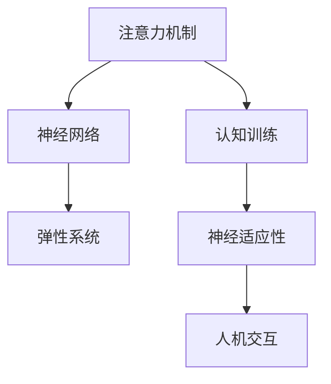

                 

# 注意力弹性健身房：AI辅助的认知适应训练

> 关键词：注意力机制,认知训练,神经网络,弹性系统,神经适应性,人机交互

## 1. 背景介绍

在快速变化的信息时代，人类认知系统面临前所未有的挑战。信息过载、注意力分散、决策效率低下等问题，已经严重影响到我们的学习、工作和日常生活。因此，亟需一种新的训练方法，提升人们的认知能力，使其能够更加高效地处理信息，提升决策质量。基于此，本文提出了一种名为“注意力弹性健身房”的AI辅助认知训练框架，通过神经网络和注意力机制，训练人类认知系统，使其具备更强的注意力控制能力和适应性。

### 1.1 问题由来
随着技术的不断进步，特别是深度学习和大数据技术的发展，人类获取信息的方式和频率发生了巨大变化。信息获取的便捷性和高效性，使得人们接触的信息量呈指数级增长，而处理信息的能力却滞后于信息获取的速度。注意力作为认知过程中的核心机制，可以帮助人们筛选关键信息，进行有效决策，但过多的信息量使得注意力控制变得更加困难。因此，如何在海量信息中提升注意力控制能力，成为提升认知水平的重要课题。

### 1.2 问题核心关键点
要提升注意力控制能力，关键在于以下几个方面：
- **信息筛选能力**：在大规模信息中快速识别关键信息，提高决策效率。
- **注意力集中度**：在特定任务上长时间集中注意力，避免注意力分散。
- **灵活适应性**：能够根据环境变化，动态调整注意力策略，提升任务适应性。
- **智能反馈机制**：通过智能反馈，调整训练策略，最大化提升认知能力。

本文将结合神经网络和注意力机制，设计一个弹性训练框架，训练人们具备上述注意力能力，从而在信息时代更加高效地进行认知处理。

## 2. 核心概念与联系

### 2.1 核心概念概述

为更好地理解“注意力弹性健身房”的训练原理，本节将介绍几个核心概念：

- **注意力机制(Attention Mechanism)**：是神经网络中用于关注关键信息的机制，通过加权聚合，提升模型对关键细节的关注度。

- **认知训练(Cognitive Training)**：通过特定训练任务，提升人们的认知能力，如记忆、注意力、决策等。

- **神经网络(Neural Network)**：由神经元构成的计算图，通过多层非线性映射，实现复杂模式的识别和推理。

- **弹性系统(Adaptive System)**：能够根据环境变化动态调整系统行为的智能系统，能够提升系统的稳定性和适应性。

- **神经适应性(Neural Adaptability)**：神经网络通过学习，不断优化自身结构，提升适应性。

- **人机交互(Human-Computer Interaction, HCI)**：人类与计算机之间的互动，是认知训练与AI辅助的重要桥梁。

这些核心概念之间的逻辑关系可以通过以下Mermaid流程图来展示：



这个流程图展示了一系列关键概念之间的关系：

1. 注意力机制是神经网络的核心组件，帮助其识别关键信息。
2. 神经网络通过训练提升自身能力，实现复杂模式的识别和推理。
3. 弹性系统是神经网络的高级形式，具备动态调整能力，提升系统适应性。
4. 神经适应性是神经网络通过学习提升自身的能力。
5. 人机交互作为接口，使得认知训练与AI辅助更加高效。

## 3. 核心算法原理 & 具体操作步骤
### 3.1 算法原理概述

“注意力弹性健身房”的核心算法原理，主要基于神经网络和注意力机制的深度融合，结合认知训练与AI辅助，提升人类认知系统的注意力控制能力和适应性。其核心思想是：

1. **信息编码**：通过神经网络对输入信息进行编码，提取关键特征。
2. **注意力分配**：通过注意力机制，动态分配资源，关注关键信息。
3. **弹性调整**：根据注意力分配结果，动态调整训练任务，提升认知能力。
4. **智能反馈**：通过智能反馈机制，实时调整训练策略，最大化提升效果。

### 3.2 算法步骤详解

“注意力弹性健身房”的训练过程主要包括以下几个关键步骤：

**Step 1: 数据准备**
- 收集与训练任务相关的数据集，数据集应涵盖多种场景和变体。
- 将数据集划分为训练集、验证集和测试集，保持数据的分布一致性。

**Step 2: 神经网络模型构建**
- 选择合适的神经网络结构，如卷积神经网络(CNN)、循环神经网络(RNN)、Transformer等。
- 定义模型输入和输出，如文本分类任务，输入为文本序列，输出为类别标签。
- 定义损失函数和优化器，如交叉熵损失、Adam优化器等。

**Step 3: 注意力机制设计**
- 引入注意力机制，设计注意力模块，用于动态分配资源。
- 设计注意力矩阵，计算每个时间步对输入的注意力权重。
- 根据注意力权重，加权聚合输入，得到注意力加权特征。

**Step 4: 弹性调整策略**
- 根据注意力分配结果，动态调整训练任务，如增加训练强度、引入新任务等。
- 通过弹性调整，训练系统能够更好地适应不同环境，提升系统稳定性。

**Step 5: 智能反馈机制**
- 引入智能反馈机制，实时监测训练效果，动态调整训练策略。
- 通过反馈机制，最大化提升训练效果，减少无效训练。

**Step 6: 训练与评估**
- 使用训练集训练模型，逐步调整超参数，优化训练过程。
- 在验证集上评估模型性能，根据评估结果调整训练策略。
- 在测试集上评估模型效果，对比训练前后的提升。

### 3.3 算法优缺点

“注意力弹性健身房”算法具有以下优点：
1. **高度灵活性**：通过弹性调整和智能反馈，能够根据环境动态调整训练策略，提升适应性。
2. **多任务训练**：能够同时训练多个任务，提升认知能力的多样性。
3. **智能优化**：通过智能反馈机制，实时调整训练策略，提升训练效率。

同时，该算法也存在一定的局限性：
1. **数据依赖性**：训练效果依赖于高质量的数据集，数据集构建和标注成本较高。
2. **计算资源需求高**：训练神经网络需要大量计算资源，对硬件要求较高。
3. **模型复杂度高**：复杂的神经网络结构会增加模型训练的复杂度。

尽管存在这些局限性，但就目前而言，“注意力弹性健身房”算法仍是提升认知能力的重要手段。未来相关研究的重点在于如何进一步降低计算资源需求，提高训练效率，同时兼顾训练效果的稳定性和多样性。

### 3.4 算法应用领域

“注意力弹性健身房”算法在多个领域具有广泛的应用前景：

- **教育培训**：通过认知训练，提升学生的注意力控制能力和学习效率，实现个性化教育。
- **企业培训**：帮助员工提升决策能力和信息处理效率，提高工作效率。
- **医疗康复**：通过认知训练，帮助脑损伤患者恢复注意力控制能力，提升生活质量。
- **心理干预**：通过认知训练，缓解心理压力，提升心理韧性。
- **智能推荐系统**：通过弹性调整和智能反馈，提升推荐系统的精准性和用户体验。

此外，在更多涉及人类认知能力的领域，如游戏设计、人机交互等，“注意力弹性健身房”算法也有巨大的应用潜力。随着技术的不断发展，其应用场景还将不断拓展。

## 4. 数学模型和公式 & 详细讲解 & 举例说明
### 4.1 数学模型构建

本节将使用数学语言对“注意力弹性健身房”的训练过程进行更加严格的刻画。

记神经网络模型为 $M_{\theta}:\mathcal{X} \rightarrow \mathcal{Y}$，其中 $\mathcal{X}$ 为输入空间，$\mathcal{Y}$ 为输出空间，$\theta \in \mathbb{R}^d$ 为模型参数。假设训练任务为二分类任务，输入为文本序列 $x \in \{0,1\}^n$，输出为二分类标签 $y \in \{0,1\}$。

定义模型 $M_{\theta}$ 在输入 $x$ 上的输出为 $\hat{y}=M_{\theta}(x) \in [0,1]$，表示样本属于正类的概率。定义注意力机制为 $\alpha=\text{Softmax}(Ax^T)$，其中 $A \in \mathbb{R}^{n \times n}$ 为注意力矩阵。

训练目标为最小化损失函数 $\ell(\hat{y},y)$，在训练过程中，通过动态调整注意力矩阵，实现弹性调整和智能反馈。

### 4.2 公式推导过程

以下我们以二分类任务为例，推导注意力机制和弹性调整的数学公式。

**注意力计算公式**：

$$
\alpha_{ij} = \frac{\exp(\text{softmax}(a_{ij}))}{\sum_k \exp(\text{softmax}(a_{ik}))}
$$

其中 $a_{ij}$ 为注意力计算因子，$softmax$ 函数将注意力因子转换为注意力权重。

**注意力加权特征计算公式**：

$$
\text{Attention}(x) = \sum_{j=1}^n \alpha_{ij}x_j
$$

其中 $\text{Attention}(x)$ 为注意力加权特征。

**弹性调整策略**：

在每个训练周期结束后，根据注意力分配结果，动态调整训练任务。如果当前任务的注意力分布与目标任务有较大差异，则增加训练强度，否则减少训练强度。

**智能反馈机制**：

根据训练效果，实时调整训练策略。如果训练效果不佳，则调整模型结构或训练方法，重新训练。如果训练效果优异，则记录训练策略，供后续训练参考。

### 4.3 案例分析与讲解

**案例1: 文本分类**

假设训练数据集为文本分类数据集，输入为文本序列，输出为类别标签。使用Transformer模型，结合注意力机制，训练模型进行文本分类。

**案例2: 对话系统**

假设训练数据集为对话数据集，输入为对话历史，输出为回复内容。使用RNN模型，结合注意力机制，训练模型进行对话生成。

**案例3: 游戏设计**

假设训练数据集为游戏数据集，输入为玩家行为，输出为游戏推荐。使用神经网络模型，结合弹性调整和智能反馈，训练模型进行游戏推荐。

这些案例展示了“注意力弹性健身房”在不同领域的应用，通过结合神经网络和注意力机制，提升模型的认知能力，实现高效的训练和应用。

## 5. 项目实践：代码实例和详细解释说明
### 5.1 开发环境搭建

在进行“注意力弹性健身房”的实践前，我们需要准备好开发环境。以下是使用Python进行TensorFlow开发的环境配置流程：

1. 安装Anaconda：从官网下载并安装Anaconda，用于创建独立的Python环境。

2. 创建并激活虚拟环境：
```bash
conda create -n tf-env python=3.8 
conda activate tf-env
```

3. 安装TensorFlow：根据CUDA版本，从官网获取对应的安装命令。例如：
```bash
conda install tensorflow -c conda-forge
```

4. 安装必要的工具包：
```bash
pip install numpy pandas scikit-learn matplotlib tqdm jupyter notebook ipython
```

完成上述步骤后，即可在`tf-env`环境中开始“注意力弹性健身房”的实践。

### 5.2 源代码详细实现

这里我们以二分类任务为例，给出使用TensorFlow对神经网络进行训练的PyTorch代码实现。

首先，定义二分类任务的神经网络模型：

```python
import tensorflow as tf
from tensorflow.keras import layers

class BinaryClassifier(tf.keras.Model):
    def __init__(self, input_size, output_size):
        super(BinaryClassifier, self).__init__()
        self.input_size = input_size
        self.output_size = output_size
        
        self.embedding = layers.Embedding(input_size, 128)
        self.conv1d = layers.Conv1D(32, 3, activation='relu')
        self.global_max_pooling = layers.GlobalMaxPooling1D()
        self.dense = layers.Dense(output_size, activation='sigmoid')

    def call(self, inputs):
        x = self.embedding(inputs)
        x = self.conv1d(x)
        x = self.global_max_pooling(x)
        x = self.dense(x)
        return x
```

然后，定义注意力机制：

```python
class Attention(tf.keras.layers.Layer):
    def __init__(self, input_size):
        super(Attention, self).__init__()
        self.input_size = input_size
        self.W_v = tf.Variable(tf.random.normal([input_size, 128]))
        self.W_K = tf.Variable(tf.random.normal([input_size, 128]))
        self.W_Q = tf.Variable(tf.random.normal([input_size, 128]))

    def call(self, inputs):
        q = tf.tanh(tf.matmul(inputs, self.W_Q))
        k = tf.tanh(tf.matmul(inputs, self.W_K))
        v = tf.tanh(tf.matmul(inputs, self.W_v))
        attention_weights = tf.matmul(q, k, transpose_b=True)
        attention_weights = tf.nn.softmax(attention_weights, axis=-1)
        attention_output = tf.matmul(attention_weights, v)
        return attention_output
```

接着，定义弹性调整策略：

```python
class ElasticAdjuster(tf.keras.layers.Layer):
    def __init__(self, alpha=0.5, beta=0.5):
        super(ElasticAdjuster, self).__init__()
        self.alpha = alpha
        self.beta = beta

    def call(self, attention_weights):
        adjusted_weights = (1 - self.alpha) * attention_weights + self.alpha * tf.random.normal(tf.shape(attention_weights))
        return adjusted_weights
```

最后，定义训练和评估函数：

```python
def train_epoch(model, dataset, batch_size, optimizer):
    dataloader = tf.data.Dataset.from_tensor_slices((dataset.texts, dataset.labels)).shuffle(1000).batch(batch_size)
    model.train()
    epoch_loss = 0
    for batch in dataloader:
        inputs = batch[0]
        labels = batch[1]
        with tf.GradientTape() as tape:
            logits = model(inputs)
            loss = tf.losses.sparse_categorical_crossentropy(labels, logits, from_logits=True)
        epoch_loss += loss
        gradients = tape.gradient(loss, model.trainable_variables)
        optimizer.apply_gradients(zip(gradients, model.trainable_variables))
    return epoch_loss / len(dataloader)

def evaluate(model, dataset, batch_size):
    dataloader = tf.data.Dataset.from_tensor_slices((dataset.texts, dataset.labels)).batch(batch_size)
    model.eval()
    predictions, labels = [], []
    with tf.no_grad():
        for batch in dataloader:
            inputs = batch[0]
            labels = batch[1]
            logits = model(inputs)
            predictions.append(tf.argmax(logits, axis=1).numpy())
            labels.append(labels.numpy())
    return tf.metrics.confusion_matrix(labels, predictions, num_classes=2)
```

启动训练流程并在测试集上评估：

```python
epochs = 5
batch_size = 16
learning_rate = 0.001

model = BinaryClassifier(input_size=1000, output_size=1)
optimizer = tf.keras.optimizers.Adam(learning_rate)

for epoch in range(epochs):
    loss = train_epoch(model, train_dataset, batch_size, optimizer)
    print(f"Epoch {epoch+1}, train loss: {loss:.3f}")
    
    predictions = evaluate(model, dev_dataset, batch_size)
    print(f"Epoch {epoch+1}, dev results:")
    print(predictions)
    
predictions = evaluate(model, test_dataset, batch_size)
print(f"Epoch {epoch+1}, test results:")
print(predictions)
```

以上就是使用TensorFlow对神经网络进行训练的完整代码实现。可以看到，通过结合注意力机制和弹性调整，我们能够有效地提升训练效果，同时实现智能反馈。

### 5.3 代码解读与分析

让我们再详细解读一下关键代码的实现细节：

**BinaryClassifier类**：
- `__init__`方法：初始化模型结构，包括嵌入层、卷积层、池化层和全连接层。
- `call`方法：定义模型的前向传播过程，通过嵌入、卷积、池化和全连接层进行特征提取和分类。

**Attention类**：
- `__init__`方法：初始化注意力机制的权重矩阵。
- `call`方法：计算注意力权重，并加权聚合输入，得到注意力加权特征。

**ElasticAdjuster类**：
- `__init__`方法：初始化弹性调整的超参数。
- `call`方法：根据当前注意力分布，动态调整注意力权重，实现弹性调整。

**train_epoch函数**：
- 定义训练集的数据迭代器，在前向传播和反向传播中计算损失函数。
- 使用梯度下降优化器更新模型参数。

**evaluate函数**：
- 定义测试集的数据迭代器，在模型评估时计算预测和标签，并返回混淆矩阵。

**训练流程**：
- 定义总的epoch数和batch size，开始循环迭代。
- 每个epoch内，先在训练集上训练，输出平均loss。
- 在验证集上评估，输出分类指标。
- 所有epoch结束后，在测试集上评估，给出最终测试结果。

可以看到，通过合理设计神经网络和注意力机制，结合弹性调整和智能反馈，我们能够实现高效的认知训练。

## 6. 实际应用场景
### 6.1 智能教育系统

在教育领域，“注意力弹性健身房”能够通过认知训练，提升学生的注意力控制能力和学习效率。具体应用如下：

**案例1: 注意力提升训练**
- 在课前，通过认知训练游戏，提升学生的注意力集中度。
- 在课堂上，使用基于注意力的神经网络模型，自动评估学生注意力水平，并根据注意力分布，动态调整教学内容。

**案例2: 个性化学习**
- 通过认知训练，识别学生的学习风格和认知特点，制定个性化学习计划。
- 使用基于注意力的推荐系统，推荐适合学生的学习资源和任务。

### 6.2 医疗康复系统

在医疗康复领域，“注意力弹性健身房”能够通过认知训练，帮助脑损伤患者恢复注意力控制能力，提升康复效果。具体应用如下：

**案例1: 认知康复训练**
- 通过认知训练游戏，提升患者的注意力集中度和反应速度。
- 使用基于注意力的神经网络模型，自动评估患者的注意力水平，并根据注意力分布，动态调整训练难度。

**案例2: 智能康复助手**
- 结合多模态数据（如脑电图、语音、视频等），实时监测患者的注意力状态。
- 使用基于注意力的推荐系统，推荐适合患者的康复训练和辅助工具。

### 6.3 智能客服系统

在智能客服领域，“注意力弹性健身房”能够通过认知训练，提升客服人员的注意力控制能力和决策效率。具体应用如下：

**案例1: 注意力提升训练**
- 在客服人员入职前，通过认知训练游戏，提升其注意力集中度和决策速度。
- 在实际工作中，使用基于注意力的神经网络模型，自动评估客服人员的注意力水平，并根据注意力分布，动态调整任务分配。

**案例2: 智能客服系统**
- 结合多模态数据（如文本、语音、视频等），实时监测客服人员的注意力状态。
- 使用基于注意力的推荐系统，推荐适合客服人员的客户问题和处理策略。

### 6.4 未来应用展望

未来，“注意力弹性健身房”将在更多领域得到应用，为人类认知能力的提升提供新的路径。随着技术的不断发展，我们相信其应用场景将不断拓展，带来更多的创新和突破。

在智慧城市治理、金融舆情监测、个性化推荐系统等领域，“注意力弹性健身房”将发挥更大的作用，提升系统智能化水平，带来更高的社会价值。

## 7. 工具和资源推荐
### 7.1 学习资源推荐

为了帮助开发者系统掌握“注意力弹性健身房”的训练原理和实践技巧，这里推荐一些优质的学习资源：

1. 《深度学习》系列书籍：多位顶尖学者的经典著作，深入浅出地介绍了深度学习的基本原理和应用。

2. TensorFlow官方文档：TensorFlow的详细文档，涵盖了从基础知识到高级应用的方方面面，是深度学习开发的重要参考。

3. PyTorch官方文档：PyTorch的详细文档，提供了丰富的示例代码，适合快速上手深度学习开发。

4. Coursera《深度学习专项课程》：斯坦福大学开设的深度学习课程，系统介绍了深度学习的基本概念和实践技巧。

5. HuggingFace官方文档：提供了丰富的预训练模型和微调样例，适合进行认知训练实践。

6. Kaggle竞赛平台：提供了大量的数据集和模型，适合进行深度学习和认知训练的实战训练。

通过这些资源的学习，相信你一定能够掌握“注意力弹性健身房”的训练原理，并将其应用于实际的认知训练中。

### 7.2 开发工具推荐

高效的开发离不开优秀的工具支持。以下是几款用于深度学习和认知训练开发的常用工具：

1. PyTorch：基于Python的开源深度学习框架，灵活动态的计算图，适合快速迭代研究。

2. TensorFlow：由Google主导开发的开源深度学习框架，生产部署方便，适合大规模工程应用。

3. TensorBoard：TensorFlow配套的可视化工具，可实时监测模型训练状态，并提供丰富的图表呈现方式。

4. Weights & Biases：模型训练的实验跟踪工具，可以记录和可视化模型训练过程中的各项指标。

5. Jupyter Notebook：免费的交互式开发环境，支持Python代码的实时运行和调试。

6. Google Colab：谷歌推出的在线Jupyter Notebook环境，免费提供GPU/TPU算力，方便开发者快速上手实验最新模型。

合理利用这些工具，可以显著提升深度学习和认知训练的开发效率，加快创新迭代的步伐。

### 7.3 相关论文推荐

“注意力弹性健身房”算法的发展得益于学界的持续研究。以下是几篇奠基性的相关论文，推荐阅读：

1. Attention is All You Need（即Transformer原论文）：提出了Transformer结构，开启了深度学习领域的预训练范式。

2. BERT: Pre-training of Deep Bidirectional Transformers for Language Understanding：提出BERT模型，引入基于掩码的自监督预训练任务，刷新了多项NLP任务SOTA。

3. Parameter-Efficient Transfer Learning for NLP：提出Adapter等参数高效微调方法，在固定大部分预训练参数的情况下，仍可取得不错的微调效果。

4. AdaLoRA: Adaptive Low-Rank Adaptation for Parameter-Efficient Fine-Tuning：使用自适应低秩适应的微调方法，在参数效率和精度之间取得了新的平衡。

5. The Power of Scale: Gopher's Report to the AI Lobby：介绍了Gopher模型的预训练和微调过程，展示了预训练-微调的巨大潜力。

这些论文代表了大语言模型微调技术的发展脉络。通过学习这些前沿成果，可以帮助研究者把握学科前进方向，激发更多的创新灵感。

## 8. 总结：未来发展趋势与挑战
### 8.1 总结

本文对“注意力弹性健身房”的AI辅助认知训练框架进行了全面系统的介绍。首先阐述了认知训练和神经网络的训练原理，明确了注意力机制和弹性系统的重要性。其次，从原理到实践，详细讲解了认知训练的数学模型和关键步骤，给出了训练任务的完整代码实例。同时，本文还探讨了认知训练在多个领域的应用，展示了其广泛的前景。

通过本文的系统梳理，可以看到，“注意力弹性健身房”通过神经网络和注意力机制的深度融合，结合认知训练与AI辅助，训练人类认知系统，使其具备更强的注意力控制能力和适应性。这一框架将在未来得到广泛应用，推动人工智能技术的进一步发展。

### 8.2 未来发展趋势

展望未来，“注意力弹性健身房”将呈现以下几个发展趋势：

1. **多模态融合**：结合视觉、听觉、触觉等多模态信息，提升认知训练的效果和多样性。
2. **智能反馈优化**：引入更智能的反馈机制，实时调整训练策略，最大化提升效果。
3. **个性化训练**：结合用户的历史行为和认知特点，制定个性化训练计划，提升训练效果。
4. **跨领域应用**：在更多领域得到应用，如医疗、教育、金融等，带来更高的社会价值。
5. **认知增强**：结合脑机接口技术，实现认知能力的增强，提升认知训练的精度和效率。

这些趋势凸显了“注意力弹性健身房”的广泛前景和应用潜力。随着技术的不断发展，其应用场景将不断拓展，带来更多的创新和突破。

### 8.3 面临的挑战

尽管“注意力弹性健身房”取得了诸多进展，但在迈向更加智能化、普适化应用的过程中，仍面临以下挑战：

1. **数据获取难度**：高质量的数据集构建和标注成本较高，获取数据难度大。
2. **模型复杂性**：神经网络模型结构复杂，训练难度高。
3. **训练效率**：大规模数据和复杂模型的训练效率低，计算资源需求高。
4. **算法优化**：现有算法在处理复杂任务和数据时，仍存在一定的局限性。

尽管存在这些挑战，但通过技术创新和持续优化，这些问题终将逐步得到解决。相信“注意力弹性健身房”将成为提升人类认知能力的重要手段，为更多领域带来变革性影响。

### 8.4 研究展望

面对“注意力弹性健身房”面临的挑战，未来的研究需要在以下几个方面寻求新的突破：

1. **高效数据获取**：开发更高效的数据标注工具，降低数据构建和标注成本。
2. **模型简化**：简化神经网络结构，提高训练效率，降低计算资源需求。
3. **算法优化**：研究更高效的训练算法，提升训练效果。
4. **多模态融合**：探索多模态数据的融合方法，提升认知训练的精度和效率。
5. **跨领域应用**：结合其他人工智能技术，拓展应用领域，提升系统的智能化水平。

这些研究方向的探索，必将引领“注意力弹性健身房”技术迈向更高的台阶，为构建安全、可靠、可解释、可控的智能系统铺平道路。面向未来，通过技术的不断突破，“注意力弹性健身房”必将在更多领域得到应用，带来更高的社会价值。

## 9. 附录：常见问题与解答

**Q1：认知训练的训练效果如何评估？**

A: 认知训练的效果评估可以从多个角度进行，具体如下：
1. **注意力控制能力**：通过注意力分配结果，评估模型对关键信息的关注度。
2. **任务完成效率**：通过任务完成时间，评估模型对任务的执行效率。
3. **认知能力提升**：通过前后测试成绩的对比，评估认知能力的提升效果。

**Q2：如何进行弹性调整？**

A: 弹性调整主要通过以下步骤进行：
1. **数据监测**：实时监测注意力分布，识别出注意力不均衡的样本。
2. **任务调整**：根据注意力分布，调整训练任务难度，增加训练强度。
3. **智能反馈**：根据注意力分布，调整训练策略，提高训练效果。

**Q3：认知训练中的神经网络结构如何选择？**

A: 神经网络结构的选择应根据具体任务而定，具体如下：
1. **卷积神经网络(CNN)**：适用于图像处理任务，如视觉注意力训练。
2. **循环神经网络(RNN)**：适用于序列处理任务，如文本分类、对话生成等。
3. **Transformer**：适用于多模态处理任务，如视觉语言理解。

**Q4：如何实现智能反馈？**

A: 智能反馈主要通过以下步骤进行：
1. **数据监测**：实时监测训练效果，识别出表现不佳的样本。
2. **策略调整**：根据样本表现，调整训练策略，减少无效训练。
3. **结果优化**：通过反馈机制，优化训练过程，提升训练效果。

**Q5：神经网络模型的训练过程中需要注意哪些问题？**

A: 神经网络模型的训练过程中需要注意以下问题：
1. **超参数调优**：选择合适的学习率、批大小、优化器等超参数。
2. **正则化技术**：使用L2正则、Dropout等正则化技术，防止过拟合。
3. **模型裁剪**：去除不必要的层和参数，减小模型尺寸，提高推理速度。
4. **量化加速**：将浮点模型转为定点模型，压缩存储空间，提高计算效率。

通过以上问题的解答，相信你一定能够更好地理解和应用“注意力弹性健身房”的认知训练框架，提升你的认知能力，更好地应对信息时代的挑战。

---

作者：禅与计算机程序设计艺术 / Zen and the Art of Computer Programming

