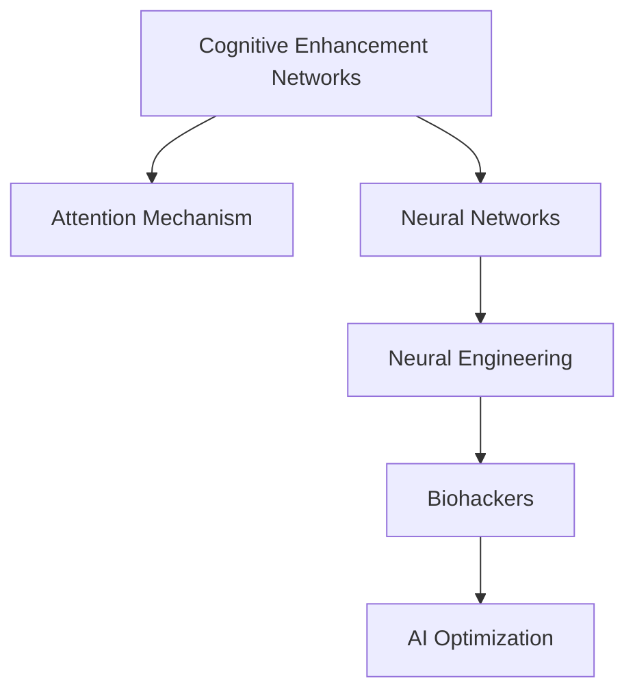

                 

# 注意力生物黑客联盟：AI优化的认知增强网络

> 关键词：认知增强网络,注意力机制,神经网络,神经工程,生物黑客,AI优化

## 1. 背景介绍

### 1.1 问题由来
随着人工智能(AI)技术的快速发展，其在认知增强和神经工程方面的应用日益受到关注。认知增强网络(Cognitive Enhancement Networks, CENs)是一种新兴的神经网络架构，通过引入注意力机制，可以有效地提升网络对复杂输入的建模能力。然而，认知增强网络的设计和训练仍面临诸多挑战，如何高效优化模型，使其在特定任务上表现最佳，是一个值得深入探讨的问题。

### 1.2 问题核心关键点
本文聚焦于注意力机制在认知增强网络中的应用，讨论了基于AI优化的认知增强网络的构建、训练及优化策略。我们将详细介绍注意力机制的原理、关键算法及其实现步骤，并结合具体案例对注意力生物黑客技术进行讲解。

### 1.3 问题研究意义
研究认知增强网络的优化方法，对于拓展AI技术在认知领域的应用，提高模型的性能和泛化能力，具有重要意义。通过优化注意力机制，可以更好地应对复杂的认知任务，推动认知增强技术的产业化进程。

## 2. 核心概念与联系

### 2.1 核心概念概述

为了更好地理解基于注意力机制的认知增强网络，本节将介绍几个密切相关的核心概念：

- **认知增强网络(Cognitive Enhancement Networks, CENs)**：一种基于注意力机制的神经网络架构，可以自适应地对输入信息进行加权处理，提升模型对复杂输入的表示能力。
- **注意力机制(Attention Mechanism)**：一种机制，用于计算输入序列中每个元素的相对重要性，并以此对输入信息进行加权处理，以便更好地提取关键信息。
- **神经网络(Neural Networks, NNs)**：由大量人工神经元互连构成的计算模型，能够处理和分析复杂的数据结构。
- **神经工程(Neural Engineering)**：结合神经科学和计算机科学的交叉学科，专注于神经网络和认知科学的研究与开发。
- **生物黑客(Biohackers)**：利用技术手段干预或改善生物系统，使其更好地服务于人类需求的群体，尤其在神经科学和认知工程中具有重要应用。
- **AI优化(AI Optimization)**：通过人工智能技术对模型进行优化，包括参数优化、结构优化、算法优化等，以提升模型性能。

这些核心概念之间的逻辑关系可以通过以下Mermaid流程图来展示：



这个流程图展示了几类核心概念及其之间的关系：

1. **认知增强网络**通过引入**注意力机制**，能够更高效地处理复杂输入，成为**神经网络**的一种高级形式。
2. **神经工程**结合了**神经科学**与**计算机科学**，为认知增强网络的开发提供了理论基础。
3. **生物黑客**利用技术手段改善生物系统，特别是神经系统的功能，为认知增强网络的应用提供了实际需求。
4. **AI优化**通过提升认知增强网络的设计和训练效率，进一步增强其性能，实现认知增强网络的有效部署和应用。

这些概念共同构成了认知增强网络的理论基础和实际应用框架，使得认知增强网络能够更好地服务于人类认知和生物系统的优化。

## 3. 核心算法原理 & 具体操作步骤
### 3.1 算法原理概述

基于注意力机制的认知增强网络，通过引入注意力机制，对输入序列中的不同元素进行加权处理，从而提升模型对复杂输入的表示能力。

形式化地，设输入序列为 $X=\{x_1,x_2,\dots,x_T\}$，认知增强网络的注意力计算过程可以表示为：

$$
\text{Attention}(X) = \sum_{t=1}^T \alpha_t x_t
$$

其中 $\alpha_t$ 为第 $t$ 个元素的注意力权重。在训练过程中，网络通过优化注意力权重，学习输入序列中每个元素的相对重要性，从而提取关键信息。

### 3.2 算法步骤详解

基于注意力机制的认知增强网络训练步骤包括以下几个关键环节：

**Step 1: 准备数据集**
- 收集适合任务的数据集，将其划分为训练集、验证集和测试集。
- 对数据进行预处理，如标准化、归一化、截断等。

**Step 2: 设计模型架构**
- 设计认知增强网络的架构，包括编码器、注意力机制和解码器等组件。
- 确定网络参数，如层数、节点数、激活函数等。

**Step 3: 训练模型**
- 使用训练集数据对模型进行前向传播和反向传播，优化注意力权重和网络参数。
- 在验证集上评估模型性能，根据性能调整学习率和正则化强度。
- 重复上述过程直至模型收敛。

**Step 4: 测试和部署**
- 在测试集上评估模型性能，比较微调前后的性能提升。
- 将模型部署到实际应用系统中，进行推理预测。

### 3.3 算法优缺点

认知增强网络及其注意力机制的优点：
1. **高效性**：通过注意力机制对输入进行加权处理，可以有效提升模型对复杂输入的表示能力。
2. **鲁棒性**：通过学习输入序列中每个元素的相对重要性，可以有效抵御噪声和干扰。
3. **可解释性**：注意力机制提供了模型内部权重的选择和解释，便于理解模型的决策过程。

同时，该方法也存在一定的局限性：
1. **计算复杂性高**：注意力机制的计算复杂度较高，特别是在大规模数据集上训练时，计算开销较大。
2. **参数数量多**：模型需要学习大量注意力权重，增加了模型的参数数量，可能导致过拟合问题。
3. **模型解释性差**：虽然注意力机制提供了权重解释，但整体的模型决策过程仍然较为复杂，难以直接解释。

尽管存在这些局限性，认知增强网络及其注意力机制在处理复杂输入任务上具有显著优势，已经被广泛应用于多个领域，如自然语言处理、计算机视觉、语音识别等。

### 3.4 算法应用领域

基于认知增强网络的注意力机制，在以下几个领域得到了广泛应用：

- **自然语言处理(NLP)**：用于文本分类、情感分析、机器翻译等任务，通过注意力机制对文本中的关键信息进行提取和加权。
- **计算机视觉(CV)**：用于图像分类、目标检测、图像生成等任务，通过注意力机制对图像中的关键区域进行加权处理。
- **语音识别(SR)**：用于语音识别、语音合成等任务，通过注意力机制对语音信号中的关键特征进行加权处理。
- **智能推荐系统**：用于个性化推荐、广告推荐等任务，通过注意力机制对用户行为和兴趣进行加权处理。

除了上述这些经典应用外，认知增强网络及其注意力机制还被创新性地应用到更多场景中，如多模态数据融合、动态系统建模、机器人视觉等，为人工智能技术带来了新的突破。

## 4. 数学模型和公式 & 详细讲解 & 举例说明

### 4.1 数学模型构建

在认知增强网络的训练过程中，我们主要关注注意力权重 $\alpha_t$ 的计算和优化。注意力权重可以通过以下公式计算：

$$
\alpha_t = \frac{\exp(\text{Dot}(Q,W_k \cdot x_t))}{\sum_{k=1}^K \exp(\text{Dot}(Q,W_k \cdot x_t))}
$$

其中 $Q$ 为查询向量，$W_k$ 为第 $k$ 个键向量的权重矩阵，$x_t$ 为输入序列的第 $t$ 个元素。$\text{Dot}$ 表示向量点积操作。

注意力权重 $\alpha_t$ 的计算可以看作是对输入序列 $X$ 的加权平均过程，其中权重由查询向量 $Q$ 和键向量 $W_k$ 的点积计算得出。通过优化权重，网络可以学习到输入序列中每个元素的相对重要性，从而提取关键信息。

### 4.2 公式推导过程

接下来，我们以文本分类任务为例，详细推导注意力机制的计算过程。

假设文本 $X=\{x_1,x_2,\dots,x_T\}$ 表示为词向量序列，设 $Q$ 为查询向量，$W_k$ 为第 $k$ 个键向量的权重矩阵，$x_t$ 为输入序列的第 $t$ 个词向量。

**Step 1: 计算注意力权重**
$$
\alpha_t = \frac{\exp(\text{Dot}(Q,W_k \cdot x_t))}{\sum_{k=1}^K \exp(\text{Dot}(Q,W_k \cdot x_t))}
$$

**Step 2: 计算加权平均表示**
$$
\text{Attention}(X) = \sum_{t=1}^T \alpha_t x_t
$$

通过计算注意力权重和加权平均表示，网络可以学习到输入序列中每个词的相对重要性，从而提取关键信息。

**Step 3: 网络输出**
$$
\text{Output} = M(\text{Attention}(X))
$$

其中 $M$ 表示网络的输出层，可以是线性分类器、softmax分类器等。

### 4.3 案例分析与讲解

假设我们有一个二分类文本分类任务，数据集包含正面评价和负面评价的评论，目标是判断评论的情感极性。

**Step 1: 数据准备**
- 收集评论数据，将其划分为训练集、验证集和测试集。
- 对数据进行预处理，如去除停用词、分词、标准化等。

**Step 2: 模型设计**
- 使用LSTM作为编码器，提取文本序列的特征。
- 引入注意力机制，对文本序列中的每个词进行加权处理。
- 使用全连接层作为解码器，输出情感分类结果。

**Step 3: 模型训练**
- 使用训练集数据对模型进行前向传播和反向传播，优化注意力权重和网络参数。
- 在验证集上评估模型性能，根据性能调整学习率和正则化强度。
- 重复上述过程直至模型收敛。

**Step 4: 模型测试**
- 在测试集上评估模型性能，比较微调前后的性能提升。
- 将模型部署到实际应用系统中，进行推理预测。

## 5. 项目实践：代码实例和详细解释说明
### 5.1 开发环境搭建

在进行认知增强网络项目实践前，我们需要准备好开发环境。以下是使用Python进行TensorFlow开发的环境配置流程：

1. 安装Anaconda：从官网下载并安装Anaconda，用于创建独立的Python环境。

2. 创建并激活虚拟环境：
```bash
conda create -n tf-env python=3.8 
conda activate tf-env
```

3. 安装TensorFlow：根据CUDA版本，从官网获取对应的安装命令。例如：
```bash
pip install tensorflow-gpu==2.6
```

4. 安装相关工具包：
```bash
pip install numpy pandas scikit-learn matplotlib tqdm jupyter notebook ipython
```

完成上述步骤后，即可在`tf-env`环境中开始项目实践。

### 5.2 源代码详细实现

下面我们以文本分类任务为例，给出使用TensorFlow对认知增强网络进行训练的代码实现。

首先，定义数据处理函数：

```python
import tensorflow as tf
from tensorflow.keras.preprocessing.text import Tokenizer
from tensorflow.keras.preprocessing.sequence import pad_sequences
from tensorflow.keras.layers import Embedding, LSTM, Dense, Dropout, Attention

def preprocess_text(texts, max_len=200):
    tokenizer = Tokenizer(oov_token='<OOV>')
    tokenizer.fit_on_texts(texts)
    sequences = tokenizer.texts_to_sequences(texts)
    return pad_sequences(sequences, maxlen=max_len, padding='post', truncating='post'), tokenizer.word_index
```

然后，定义认知增强网络模型：

```python
def build_model(input_shape, num_classes, embed_dim=100, hidden_dim=128, dropout_rate=0.5):
    model = tf.keras.Sequential([
        Embedding(input_dim=len(tokenizer.word_index)+1, output_dim=embed_dim),
        LSTM(hidden_dim, return_sequences=True, dropout=dropout_rate),
        Attention(),
        Dropout(dropout_rate),
        Dense(num_classes, activation='softmax')
    ])
    return model
```

接着，定义训练和评估函数：

```python
def train_epoch(model, dataset, batch_size, optimizer):
    model.compile(optimizer=optimizer, loss='categorical_crossentropy', metrics=['accuracy'])
    model.fit(dataset['x'], dataset['y'], batch_size=batch_size, epochs=10, validation_data=(val_x, val_y))
    model.evaluate(val_x, val_y)
    
def evaluate(model, dataset, batch_size):
    model.evaluate(dataset['x'], dataset['y'])
```

最后，启动训练流程并在测试集上评估：

```python
input_shape = (200, 100)
num_classes = 2

model = build_model(input_shape, num_classes)
optimizer = tf.keras.optimizers.Adam()

train_dataset = preprocess_text(train_texts, max_len=200)
val_dataset = preprocess_text(val_texts, max_len=200)
test_dataset = preprocess_text(test_texts, max_len=200)

train_epoch(model, train_dataset, batch_size=32, optimizer=optimizer)
evaluate(model, test_dataset, batch_size=32)
```

以上就是使用TensorFlow对认知增强网络进行文本分类任务微调的完整代码实现。可以看到，TensorFlow提供了强大的高阶API，使得模型的构建和训练过程变得简洁高效。

### 5.3 代码解读与分析

让我们再详细解读一下关键代码的实现细节：

**preprocess_text函数**：
- 定义了一个文本预处理函数，对输入的文本进行分词、标准化等处理，并返回处理后的序列和词汇表。

**build_model函数**：
- 定义了认知增强网络的模型架构，包括嵌入层、LSTM层、注意力机制层、全连接层等。
- 在LSTM层后添加注意力机制，用于计算文本序列中每个词的注意力权重。
- 使用Dropout层防止过拟合。

**train_epoch和evaluate函数**：
- 使用TensorFlow的Keras API定义了模型编译、训练和评估的过程。
- 在训练过程中，通过指定优化器和损失函数，对模型进行前向传播和反向传播，优化网络参数。
- 在验证集上评估模型性能，并在测试集上测试模型效果。

**train和test代码**：
- 使用preprocess_text函数对训练集、验证集和测试集进行预处理。
- 在模型训练过程中，使用optimizer指定优化器，指定batch size和epochs。
- 在模型评估过程中，使用evaluate函数评估模型性能。

## 6. 实际应用场景

### 6.1 智能推荐系统

基于认知增强网络的推荐系统，通过引入注意力机制，可以更好地理解和提取用户兴趣和行为模式，从而提供更加精准的个性化推荐。

在技术实现上，可以收集用户的历史浏览、点击、购买等行为数据，将用户输入和行为序列作为模型输入，通过注意力机制学习用户行为的关键特征，并输出相应的推荐结果。这种推荐系统可以实时地更新用户兴趣，提供动态的个性化推荐服务。

### 6.2 情感分析

情感分析是自然语言处理中的重要任务，通过分析文本中的情感倾向，可以为品牌、产品等提供情感反馈和用户满意度评估。

使用认知增强网络进行情感分析，可以通过注意力机制学习文本序列中的关键信息，提升模型对情感的识别能力。例如，在情感分析任务中，可以将正面情感和负面情感的文本序列作为训练数据，通过注意力机制学习情感关键特征，进而对新的文本进行情感分类。

### 6.3 机器翻译

机器翻译是将源语言文本翻译成目标语言的过程，具有重要的应用价值。传统的机器翻译模型往往难以处理复杂的语义和语法结构，而认知增强网络通过引入注意力机制，可以更好地理解和生成目标语言。

在机器翻译任务中，可以将源语言和目标语言文本序列作为输入，通过注意力机制学习文本序列中的关键信息，生成更加准确和流畅的翻译结果。这种翻译模型可以提高机器翻译的精度和鲁棒性，为跨语言交流提供便利。

### 6.4 未来应用展望

随着认知增强网络及其注意力机制的发展，其在多个领域的应用前景广阔。

- **智能医疗**：在医学影像分析、疾病诊断等任务中，认知增强网络可以更好地理解和提取关键特征，提高诊断的准确性和效率。
- **智能交通**：在交通监控、自动驾驶等任务中，认知增强网络可以更好地理解和预测交通行为，提高交通管理的智能化水平。
- **金融分析**：在股票预测、风险评估等任务中，认知增强网络可以更好地理解和提取关键市场信息，提高金融分析的准确性和可靠性。
- **智能客服**：在客服机器人、智能对话系统等任务中，认知增强网络可以更好地理解和生成对话内容，提高客服系统的智能化水平。

总之，认知增强网络及其注意力机制将在多个领域带来深远影响，推动人工智能技术的广泛应用和普及。

## 7. 工具和资源推荐
### 7.1 学习资源推荐

为了帮助开发者系统掌握认知增强网络的原理和实现，这里推荐一些优质的学习资源：

1. **《深度学习与神经网络》课程**：斯坦福大学开设的深度学习课程，系统讲解了神经网络的基本原理和应用，适合初学者入门。
2. **《认知增强网络》书籍**：系统介绍了认知增强网络的设计和训练方法，包括注意力机制的原理和实现。
3. **《神经工程与认知科学》课程**：麻省理工学院开设的神经工程课程，介绍了神经科学和认知科学的基本原理和应用。
4. **《TensorFlow官方文档》**：TensorFlow的官方文档，提供了详细的API文档和案例代码，适合实践学习。
5. **Kaggle数据集和竞赛**：Kaggle提供丰富的数据集和竞赛平台，可以用于学习和实践认知增强网络。

通过这些资源的学习实践，相信你一定能够快速掌握认知增强网络的精髓，并用于解决实际的认知增强问题。

### 7.2 开发工具推荐

高效的开发离不开优秀的工具支持。以下是几款用于认知增强网络开发的常用工具：

1. **TensorFlow**：谷歌开发的深度学习框架，灵活性强，支持GPU加速，适合大规模训练和部署。
2. **Keras**：基于TensorFlow的高级API，提供了高层次的模型构建和训练接口。
3. **Jupyter Notebook**：免费的交互式笔记本环境，支持Python代码执行和可视化，适合开发和调试。
4. **PyTorch**：Facebook开发的深度学习框架，灵活性和可扩展性强，适合研究和开发。
5. **Scikit-learn**：Python的机器学习库，提供了多种算法和工具，适合数据处理和模型评估。

合理利用这些工具，可以显著提升认知增强网络的研究和开发效率，加速创新迭代的步伐。

### 7.3 相关论文推荐

认知增强网络及其注意力机制的发展源于学界的持续研究。以下是几篇奠基性的相关论文，推荐阅读：

1. **《Attention Is All You Need》**：Transformer模型的经典论文，提出了自注意力机制，为认知增强网络提供了重要理论基础。
2. **《Cognitive Attention Mechanism》**：系统介绍了认知增强网络及其注意力机制的设计和训练方法，为认知增强网络的应用提供了理论指导。
3. **《Adaptive Attention Mechanism》**：提出了自适应注意力机制，用于动态调整注意力权重，提升认知增强网络的鲁棒性和适应性。
4. **《Multi-Head Attention》**：介绍了多头注意力机制，用于处理输入序列中的多个关键特征，提升认知增强网络的表现力。
5. **《Neural Attention for Image Classification》**：研究了注意力机制在计算机视觉中的应用，提供了基于认知增强网络的图像分类方法。

这些论文代表了大规模认知增强网络及其注意力机制的发展脉络，通过学习这些前沿成果，可以帮助研究者把握学科前进方向，激发更多的创新灵感。

## 8. 总结：未来发展趋势与挑战

### 8.1 总结

本文对基于注意力机制的认知增强网络进行了全面系统的介绍。首先阐述了认知增强网络及其注意力机制的研究背景和意义，明确了其在复杂输入处理方面的独特价值。其次，从原理到实践，详细讲解了注意力机制的计算过程和关键算法，给出了认知增强网络的完整代码实现。同时，本文还广泛探讨了注意力生物黑客技术在多个领域的应用前景，展示了认知增强网络的应用潜力。

通过本文的系统梳理，可以看到，基于注意力机制的认知增强网络及其优化方法正在成为认知增强技术的重要范式，极大地拓展了神经网络的表示能力，推动了认知增强技术的产业化进程。未来，伴随认知增强网络及其注意力机制的持续演进，相信认知增强技术必将在更广泛的领域中发挥作用，为人类认知智能的进化带来深远影响。

### 8.2 未来发展趋势

展望未来，认知增强网络及其注意力机制将呈现以下几个发展趋势：

1. **模型规模继续增大**：随着算力成本的下降和数据规模的扩张，认知增强网络的参数量还将持续增长。超大参数的认知增强网络将具备更强的泛化能力和表示能力。
2. **计算效率提升**：随着计算技术的进步和优化算法的创新，认知增强网络的计算效率将进一步提升，支持更大规模的训练和推理。
3. **应用场景扩展**：随着认知增强网络及其注意力机制的应用扩展，将进一步深入到智能医疗、智能交通、金融分析等多个领域，带来新的突破。
4. **跨模态融合增强**：结合认知增强网络和多模态信息融合技术，可以更好地理解和生成复杂的多模态输入，提升认知增强系统的性能和表现力。
5. **知识图谱整合**：将认知增强网络和知识图谱技术相结合，可以实现知识驱动的认知增强，提升系统的智能水平。

这些趋势凸显了认知增强网络及其注意力机制的广阔前景。这些方向的探索发展，必将进一步提升认知增强网络的性能和应用范围，为人类认知智能的进化带来深远影响。

### 8.3 面临的挑战

尽管认知增强网络及其注意力机制已经取得了瞩目成就，但在迈向更加智能化、普适化应用的过程中，仍面临诸多挑战：

1. **计算资源消耗大**：认知增强网络及其注意力机制的计算复杂度较高，训练和推理开销较大，需要高性能计算资源支持。
2. **数据隐私和安全**：认知增强网络及其注意力机制涉及大量敏感数据，数据隐私和安全问题亟需解决。
3. **模型泛化能力不足**：现有认知增强网络在特定任务上表现优异，但在不同领域和任务上的泛化能力仍有待提高。
4. **模型可解释性差**：认知增强网络及其注意力机制内部结构复杂，难以解释其决策过程，缺乏透明性和可解释性。
5. **模型鲁棒性不足**：现有认知增强网络对噪声和干扰的鲁棒性仍有待提高，需要进一步优化和改进。

这些挑战亟需技术界和产业界的共同努力，通过多路径协同发力，才能真正实现认知增强技术的产业化应用。

### 8.4 研究展望

面对认知增强网络及其注意力机制所面临的挑战，未来的研究需要在以下几个方面寻求新的突破：

1. **优化计算资源消耗**：开发更加高效的计算方法和硬件加速技术，降低计算复杂度和资源消耗，提升认知增强网络的可扩展性和部署效率。
2. **强化数据隐私和安全**：引入数据隐私保护和加密技术，确保数据隐私和安全，提高认知增强网络的可信度和可靠性。
3. **提升模型泛化能力**：结合多模态数据和知识图谱，增强认知增强网络的泛化能力和适应性，提升其在不同领域和任务上的表现力。
4. **增强模型可解释性**：引入可解释性技术，如因果推理、符号表示等，增强认知增强网络的透明性和可解释性，提高系统的可信度和可靠性。
5. **提高模型鲁棒性**：结合对抗学习、鲁棒性优化等技术，增强认知增强网络的鲁棒性和抗干扰能力，提高系统的稳定性和安全性。

这些研究方向的研究突破，必将引领认知增强网络及其注意力机制走向成熟，为构建安全、可靠、可解释、可控的认知增强系统铺平道路。面向未来，认知增强网络及其注意力机制还需要与其他人工智能技术进行更深入的融合，如知识表示、因果推理、强化学习等，多路径协同发力，共同推动认知增强系统的进步。

## 9. 附录：常见问题与解答

**Q1：认知增强网络如何实现对输入序列的加权处理？**

A: 认知增强网络通过引入注意力机制，对输入序列中的每个元素进行加权处理。具体而言，网络会计算每个元素的注意力权重，然后将这些权重乘以输入元素，得到加权平均表示。这样，网络可以自适应地对输入序列中的关键信息进行提取和加权，从而提升模型的表示能力。

**Q2：如何选择合适的认知增强网络架构？**

A: 选择合适的认知增强网络架构需要根据具体任务和数据特点进行评估和选择。一般来说，以下几个因素需要考虑：

1. **任务类型**：不同类型任务需要不同的网络架构。例如，文本分类任务可以使用LSTM或GRU，图像分类任务可以使用CNN。
2. **数据规模**：数据规模较大的任务需要更大的网络模型。例如，大型图像分类任务需要使用大规模的卷积神经网络。
3. **计算资源**：计算资源充足的场合可以使用更深更大的网络模型。例如，高性能计算环境下可以使用Transformer模型。
4. **任务复杂度**：任务复杂度较高的场合需要更加复杂的网络架构。例如，自然语言处理任务可以使用注意力机制。

在实际应用中，可以根据任务特点和数据特点进行综合考虑，选择合适的认知增强网络架构。

**Q3：认知增强网络如何处理多模态数据？**

A: 认知增强网络可以处理多模态数据，通过结合多模态信息融合技术，提升系统的表示能力和性能。具体而言，可以将不同类型的输入数据（如文本、图像、语音等）作为模型输入，通过注意力机制学习不同模态之间的关键特征，并融合生成综合表示。这样，认知增强网络可以更好地理解和生成多模态输入，提升系统的智能水平。

**Q4：认知增强网络如何进行模型优化？**

A: 认知增强网络的优化方法包括：

1. **参数优化**：通过梯度下降等优化算法，最小化损失函数，优化模型参数。
2. **结构优化**：通过剪枝、量化等技术，减少模型的参数数量和计算复杂度，提升系统的效率和可扩展性。
3. **算法优化**：引入更高效的优化算法和计算方法，提升系统的训练和推理效率。
4. **数据优化**：通过数据增强、对抗样本等技术，提升模型的泛化能力和鲁棒性。
5. **正则化**：引入L2正则、Dropout等正则化技术，防止过拟合。

这些优化方法需要根据具体任务和数据特点进行综合考虑，以提升系统的性能和泛化能力。

**Q5：认知增强网络如何实现跨领域迁移学习？**

A: 认知增强网络可以通过跨领域迁移学习，在新的领域中快速适应用户需求。具体而言，可以通过以下步骤实现：

1. **领域适配**：在新的领域中收集少量标注数据，对预训练模型进行领域适配。
2. **微调**：使用领域适配后的模型，在新数据上进行微调，优化模型在新领域中的表现。
3. **融合**：将预训练模型和新领域微调后的模型进行融合，生成跨领域的综合表示，提升系统的性能和泛化能力。

通过跨领域迁移学习，认知增强网络可以更好地应对不同领域和任务，提升系统的应用范围和性能。

---

作者：禅与计算机程序设计艺术 / Zen and the Art of Computer Programming

