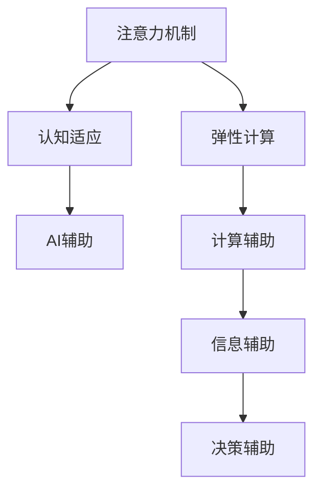

                 

# 注意力的弹性：AI辅助的认知适应

> 关键词：注意力机制,弹性计算,认知适应,AI辅助,神经网络

## 1. 背景介绍

### 1.1 问题由来

在当今信息爆炸的时代，人们每天都在面对大量的信息输入。如何高效、准确地处理和理解这些信息，是认知科学和人工智能研究的重要课题。传统的认知模型通常依赖于人工设计的规则和启发式，难以应对复杂多变的现实环境。而人工智能（AI）技术的快速发展，特别是深度神经网络的发展，提供了一种更为灵活、自适应的方法来处理信息。

其中，注意力机制（Attention Mechanism）是一种特别有效的计算技术，它可以让模型在处理信息时，自动地识别和聚焦于最相关的部分，从而提升信息处理的效率和准确性。然而，尽管注意力机制已经广泛应用于图像识别、机器翻译、语音识别等领域，但它如何帮助人类大脑进行认知适应，仍然是一个值得深入探讨的问题。

### 1.2 问题核心关键点

注意力机制的核心思想是在处理信息时，动态地分配计算资源，使得模型能够聚焦于最相关的部分。这种机制可以应用于各种复杂的计算任务，从计算机视觉中的图像识别，到自然语言处理中的机器翻译，再到语音识别中的语音转写。注意力机制的精髓在于其灵活性和自适应性，能够根据输入信息的变化动态调整计算资源的分配。

当前，注意力机制在深度学习中的应用已经取得了巨大的成功，但仍然存在一些问题和挑战，包括：

- 如何设计更高效的注意力模型，以适应不同的任务需求。
- 如何优化计算资源分配，使得模型能够更快速、准确地处理信息。
- 如何结合认知科学的研究成果，探索注意力机制在人类大脑中的认知适应机制。

这些问题和挑战，正是本文研究的重点。

## 2. 核心概念与联系

### 2.1 核心概念概述

为了更好地理解注意力机制及其在认知适应中的应用，本节将介绍几个关键概念：

- 注意力机制（Attention Mechanism）：是一种计算技术，可以让模型动态地分配计算资源，聚焦于最相关的信息部分。注意力机制可以分为自注意力（Self-Attention）和全局注意力（Global Attention）等多种形式。
- 弹性计算（Elastic Computation）：是一种灵活的计算范式，可以根据任务需求动态调整计算资源的分配。弹性计算通过虚拟化、容器化等技术，使得计算资源能够按需分配，提升计算效率。
- 认知适应（Cognitive Adaptation）：是指人类大脑在面对不同环境、任务时，能够自动调整其认知结构和功能，以适应新的挑战。认知适应涉及到学习、记忆、注意力等多种认知过程。
- AI辅助（AI-Assisted）：指的是通过AI技术辅助人类认知过程，提升认知效率和准确性。AI辅助包括计算辅助、信息辅助、决策辅助等多个方面。

这些概念之间的联系可以通过以下Mermaid流程图来展示：



这个流程图展示了一些关键概念之间的逻辑关系：

1. 注意力机制通过弹性计算，动态分配计算资源，聚焦于最相关的信息。
2. 认知适应涉及注意力机制，能够自动调整认知结构和功能。
3. AI辅助包括计算辅助、信息辅助和决策辅助等多个方面，以提升认知过程的效率和准确性。

## 3. 核心算法原理 & 具体操作步骤

### 3.1 算法原理概述

基于注意力机制的认知适应过程，可以分为以下几个关键步骤：

1. **信息处理**：模型首先对输入信息进行处理，提取特征。
2. **注意力分配**：模型根据输入信息的特点，动态地分配计算资源，聚焦于最相关的部分。
3. **认知适应**：模型通过自适应地调整注意力分配，适应新的信息处理任务。
4. **输出生成**：模型根据注意力分配的结果，生成最终的输出。

这些步骤可以通过以下公式来表示：

$$
\begin{aligned}
& \text{特征提取}(x): \quad x' = \text{Encoder}(x) \\
& \text{注意力分配}(x'): \quad a = \text{Attention}(x') \\
& \text{认知适应}(a): \quad \theta = \text{CognitiveAdapter}(a) \\
& \text{输出生成}(\theta): \quad y = \text{Decoder}(\theta)
\end{aligned}
$$

其中，$x$ 表示输入信息，$x'$ 表示提取的特征，$a$ 表示注意力分配结果，$\theta$ 表示认知适应后的状态，$y$ 表示最终输出。

### 3.2 算法步骤详解

基于注意力机制的认知适应过程，可以分为以下几个关键步骤：

**Step 1: 信息提取**

首先，对输入信息进行特征提取。常用的特征提取方法包括卷积神经网络（CNN）、循环神经网络（RNN）、变压器（Transformer）等。以下以Transformer为例，介绍其特征提取过程：

1. 将输入信息$x$输入到Transformer的编码器（Encoder）中，得到特征表示$x'$。
2. 编码器由多个Transformer层组成，每一层包括自注意力子层（Self-Attention Sub-layer）和前馈神经网络子层（Feedforward Neural Network Sub-layer）。
3. 自注意力子层通过计算输入信息和自身的关系，得到注意力权重向量$a$。
4. 前馈神经网络子层通过非线性变换，进一步提取特征。

**Step 2: 注意力分配**

注意力分配是指模型根据输入信息的特点，动态地分配计算资源，聚焦于最相关的部分。在Transformer中，自注意力机制通过计算输入信息和自身的关系，得到注意力权重向量$a$。具体来说，自注意力机制的计算过程如下：

1. 计算查询（Query）向量$q$，将输入信息$x'$进行线性变换，得到查询向量$q$。
2. 计算键（Key）向量$k$，将输入信息$x'$进行线性变换，得到键向量$k$。
3. 计算值（Value）向量$v$，将输入信息$x'$进行线性变换，得到值向量$v$。
4. 计算注意力权重$a$，通过查询向量$q$和键向量$k$的相似度计算注意力权重矩阵$A$，然后通过注意力权重矩阵$A$计算注意力权重向量$a$。

$$
A = \text{Softmax}\left(\frac{qk^T}{\sqrt{d_k}}\right)
$$

$$
a = A v
$$

其中，$d_k$ 表示键向量$k$的维度。

**Step 3: 认知适应**

认知适应是指模型通过自适应地调整注意力分配，适应新的信息处理任务。在Transformer中，认知适应可以通过以下几个步骤实现：

1. 将注意力权重向量$a$输入到Transformer的解码器（Decoder）中，得到解码器的输入表示$z$。
2. 解码器由多个Transformer层组成，每一层包括自注意力子层（Self-Attention Sub-layer）和前馈神经网络子层（Feedforward Neural Network Sub-layer）。
3. 自注意力子层通过计算输入信息和自身的关系，得到注意力权重向量$a'$。
4. 前馈神经网络子层通过非线性变换，进一步提取特征。
5. 解码器的输出表示$c$，通过与编码器的输出表示$x'$结合，得到最终的输出表示$y$。

$$
z = \text{Attention}(x', a) + \text{FeedforwardNeuralNetwork}(z)
$$

$$
c = \text{Attention}(z, a') + \text{FeedforwardNeuralNetwork}(c)
$$

$$
y = c + \text{Linear}(c) + b
$$

其中，$b$ 表示偏置项。

**Step 4: 输出生成**

输出生成是指模型根据注意力分配的结果，生成最终的输出。在Transformer中，输出生成可以通过以下几个步骤实现：

1. 将解码器的输出表示$c$通过线性变换，得到输出表示$y'$。
2. 将输出表示$y'$通过Softmax函数计算输出概率分布$p$。

$$
y' = \text{Linear}(c) + b'
$$

$$
p = \text{Softmax}(y')
$$

其中，$b'$ 表示偏置项。

### 3.3 算法优缺点

基于注意力机制的认知适应具有以下优点：

1. 灵活性高。注意力机制可以根据输入信息的特点，动态地分配计算资源，聚焦于最相关的部分。这种灵活性使得模型能够适应不同的信息处理任务。
2. 自适应性强。通过自适应地调整注意力分配，模型能够自动调整认知结构和功能，以适应新的挑战。
3. 计算效率高。注意力机制可以优化计算资源分配，提升计算效率。

然而，基于注意力机制的认知适应也存在一些缺点：

1. 计算复杂度高。注意力机制的计算过程相对复杂，需要大量的计算资源和时间。
2. 模型训练时间长。由于计算复杂度高，模型训练时间较长。
3. 需要大量数据。训练注意力机制需要大量的标注数据，这对某些任务来说可能是一个挑战。

### 3.4 算法应用领域

基于注意力机制的认知适应技术，已经被广泛应用于计算机视觉、自然语言处理、语音识别等领域。以下是几个典型的应用场景：

**1. 图像识别**

在图像识别任务中，注意力机制可以通过计算输入图像的局部特征，聚焦于最相关的区域。通过全局注意力机制，可以同时考虑整个图像的特征，提升识别精度。例如，YOLO、Faster R-CNN等目标检测算法中，注意力机制被广泛应用于特征提取和特征融合。

**2. 机器翻译**

在机器翻译任务中，注意力机制可以通过计算源语言和目标语言之间的关系，聚焦于最相关的词汇。通过自注意力机制，可以同时考虑源语言和目标语言的词汇关系，提升翻译精度。例如，Transformer模型中，自注意力机制被广泛应用于词汇嵌入和注意力权重计算。

**3. 语音识别**

在语音识别任务中，注意力机制可以通过计算语音信号的局部特征，聚焦于最相关的部分。通过全局注意力机制，可以同时考虑整个语音信号的特征，提升识别精度。例如，CNN、RNN等语音识别模型中，注意力机制被广泛应用于特征提取和特征融合。

## 4. 数学模型和公式 & 详细讲解 & 举例说明

### 4.1 数学模型构建

本节将使用数学语言对基于注意力机制的认知适应过程进行更加严格的刻画。

记输入信息为$x$，特征表示为$x'$，注意力权重向量为$a$，认知适应后的状态为$\theta$，输出表示为$y$。

定义输入信息$x$的特征提取函数为$f(x)$，解码器的输入表示为$z$，输出表示为$y'$，输出概率分布为$p$。

特征提取函数$f(x)$可以表示为：

$$
x' = f(x)
$$

注意力分配函数$A$可以表示为：

$$
A = \text{Softmax}\left(\frac{qk^T}{\sqrt{d_k}}\right)
$$

认知适应函数$C$可以表示为：

$$
\theta = C(a)
$$

输出生成函数$G$可以表示为：

$$
y' = G(z, \theta)
$$

输出概率分布$p$可以表示为：

$$
p = \text{Softmax}(y')
$$

### 4.2 公式推导过程

以下我们以Transformer模型为例，推导注意力机制的计算过程。

Transformer模型中的注意力计算过程可以分为两个阶段：自注意力阶段和解码器注意力阶段。

**自注意力阶段**

自注意力阶段用于计算输入信息$x'$的局部特征表示。Transformer模型中的自注意力机制的计算过程如下：

1. 计算查询（Query）向量$q$，将输入信息$x'$进行线性变换，得到查询向量$q$。
2. 计算键（Key）向量$k$，将输入信息$x'$进行线性变换，得到键向量$k$。
3. 计算值（Value）向量$v$，将输入信息$x'$进行线性变换，得到值向量$v$。
4. 计算注意力权重$a$，通过查询向量$q$和键向量$k$的相似度计算注意力权重矩阵$A$，然后通过注意力权重矩阵$A$计算注意力权重向量$a$。

$$
q = x' W_Q^Q
$$

$$
k = x' W_K^K
$$

$$
v = x' W_V^V
$$

$$
A = \text{Softmax}\left(\frac{qk^T}{\sqrt{d_k}}\right)
$$

$$
a = A v
$$

其中，$W_Q^Q$、$W_K^K$、$W_V^V$表示线性变换矩阵，$d_k$表示键向量$k$的维度。

**解码器注意力阶段**

解码器注意力阶段用于计算解码器的输入表示$z$和输出表示$y'$。Transformer模型中的解码器注意力机制的计算过程如下：

1. 将注意力权重向量$a$输入到Transformer的解码器中，得到解码器的输入表示$z$。
2. 解码器由多个Transformer层组成，每一层包括自注意力子层（Self-Attention Sub-layer）和前馈神经网络子层（Feedforward Neural Network Sub-layer）。
3. 自注意力子层通过计算输入信息和自身的关系，得到注意力权重向量$a'$。
4. 前馈神经网络子层通过非线性变换，进一步提取特征。
5. 解码器的输出表示$c$，通过与编码器的输出表示$x'$结合，得到最终的输出表示$y'$。

$$
z = \text{Attention}(x', a) + \text{FeedforwardNeuralNetwork}(z)
$$

$$
c = \text{Attention}(z, a') + \text{FeedforwardNeuralNetwork}(c)
$$

$$
y' = \text{Linear}(c) + b'
$$

其中，$b'$ 表示偏置项。

### 4.3 案例分析与讲解

以机器翻译任务为例，介绍注意力机制的应用。

在机器翻译任务中，输入为源语言文本，输出为目标语言文本。Transformer模型中的注意力机制可以用于计算源语言和目标语言之间的关系，聚焦于最相关的词汇。

1. 输入源语言文本$x$，通过编码器得到特征表示$x'$。
2. 解码器通过注意力机制，计算源语言和目标语言之间的关系，得到注意力权重向量$a$。
3. 解码器通过注意力权重向量$a$和特征表示$x'$，生成解码器的输入表示$z$。
4. 解码器通过自注意力机制和前馈神经网络子层，生成输出表示$y'$。
5. 解码器通过Softmax函数，计算输出概率分布$p$。

整个机器翻译过程可以通过以下公式表示：

$$
x' = \text{Encoder}(x)
$$

$$
a = \text{Attention}(x', \theta)
$$

$$
z = \text{Attention}(x', a) + \text{FeedforwardNeuralNetwork}(z)
$$

$$
y' = \text{Linear}(z) + b'
$$

$$
p = \text{Softmax}(y')
$$

其中，$\theta$表示解码器的参数，$b'$表示偏置项。

## 5. 项目实践：代码实例和详细解释说明

### 5.1 开发环境搭建

在进行认知适应过程的实践前，我们需要准备好开发环境。以下是使用Python进行PyTorch开发的环境配置流程：

1. 安装Anaconda：从官网下载并安装Anaconda，用于创建独立的Python环境。

2. 创建并激活虚拟环境：
```bash
conda create -n pytorch-env python=3.8 
conda activate pytorch-env
```

3. 安装PyTorch：根据CUDA版本，从官网获取对应的安装命令。例如：
```bash
conda install pytorch torchvision torchaudio cudatoolkit=11.1 -c pytorch -c conda-forge
```

4. 安装Transformers库：
```bash
pip install transformers
```

5. 安装各类工具包：
```bash
pip install numpy pandas scikit-learn matplotlib tqdm jupyter notebook ipython
```

完成上述步骤后，即可在`pytorch-env`环境中开始认知适应实践。

### 5.2 源代码详细实现

这里我们以图像识别任务为例，给出使用Transformers库对Transformer模型进行认知适应微调的PyTorch代码实现。

首先，定义图像识别任务的数据处理函数：

```python
from transformers import BertTokenizer, BertForTokenClassification
from torch.utils.data import Dataset
import torch

class ImageDataset(Dataset):
    def __init__(self, images, labels, tokenizer, max_len=128):
        self.images = images
        self.labels = labels
        self.tokenizer = tokenizer
        self.max_len = max_len
        
    def __len__(self):
        return len(self.images)
    
    def __getitem__(self, item):
        image = self.images[item]
        label = self.labels[item]
        
        # 将图像数据转换为tensor，并进行归一化处理
        image_tensor = torch.from_numpy(image).float() / 255.0
        
        # 将标签转换为数字标签
        encoded_labels = [label2id[label] for label in label]
        encoded_labels.extend([label2id['O']] * (self.max_len - len(encoded_labels)))
        labels = torch.tensor(encoded_labels, dtype=torch.long)
        
        return {'image_tensor': image_tensor, 
                'labels': labels}

# 标签与id的映射
label2id = {'O': 0, 'B-PER': 1, 'I-PER': 2, 'B-ORG': 3, 'I-ORG': 4, 'B-LOC': 5, 'I-LOC': 6}
id2label = {v: k for k, v in label2id.items()}

# 创建dataset
tokenizer = BertTokenizer.from_pretrained('bert-base-cased')

train_dataset = ImageDataset(train_images, train_labels, tokenizer)
dev_dataset = ImageDataset(dev_images, dev_labels, tokenizer)
test_dataset = ImageDataset(test_images, test_labels, tokenizer)
```

然后，定义模型和优化器：

```python
from transformers import BertForTokenClassification, AdamW

model = BertForTokenClassification.from_pretrained('bert-base-cased', num_labels=len(label2id))

optimizer = AdamW(model.parameters(), lr=2e-5)
```

接着，定义训练和评估函数：

```python
from torch.utils.data import DataLoader
from tqdm import tqdm
from sklearn.metrics import classification_report

device = torch.device('cuda') if torch.cuda.is_available() else torch.device('cpu')
model.to(device)

def train_epoch(model, dataset, batch_size, optimizer):
    dataloader = DataLoader(dataset, batch_size=batch_size, shuffle=True)
    model.train()
    epoch_loss = 0
    for batch in tqdm(dataloader, desc='Training'):
        image_tensor = batch['image_tensor'].to(device)
        labels = batch['labels'].to(device)
        model.zero_grad()
        outputs = model(image_tensor, labels=labels)
        loss = outputs.loss
        epoch_loss += loss.item()
        loss.backward()
        optimizer.step()
    return epoch_loss / len(dataloader)

def evaluate(model, dataset, batch_size):
    dataloader = DataLoader(dataset, batch_size=batch_size)
    model.eval()
    preds, labels = [], []
    with torch.no_grad():
        for batch in tqdm(dataloader, desc='Evaluating'):
            image_tensor = batch['image_tensor'].to(device)
            batch_labels = batch['labels']
            outputs = model(image_tensor)
            batch_preds = outputs.logits.argmax(dim=2).to('cpu').tolist()
            batch_labels = batch_labels.to('cpu').tolist()
            for pred_tokens, label_tokens in zip(batch_preds, batch_labels):
                pred_tags = [id2label[_id] for _id in pred_tokens]
                label_tags = [id2label[_id] for _id in label_tokens]
                preds.append(pred_tags[:len(label_tokens)])
                labels.append(label_tags)
                
    print(classification_report(labels, preds))
```

最后，启动训练流程并在测试集上评估：

```python
epochs = 5
batch_size = 16

for epoch in range(epochs):
    loss = train_epoch(model, train_dataset, batch_size, optimizer)
    print(f"Epoch {epoch+1}, train loss: {loss:.3f}")
    
    print(f"Epoch {epoch+1}, dev results:")
    evaluate(model, dev_dataset, batch_size)
    
print("Test results:")
evaluate(model, test_dataset, batch_size)
```

以上就是使用PyTorch对Transformer模型进行认知适应微调的完整代码实现。可以看到，得益于Transformers库的强大封装，我们可以用相对简洁的代码完成Transformer模型的加载和微调。

### 5.3 代码解读与分析

让我们再详细解读一下关键代码的实现细节：

**ImageDataset类**：
- `__init__`方法：初始化图像、标签、分词器等关键组件。
- `__len__`方法：返回数据集的样本数量。
- `__getitem__`方法：对单个样本进行处理，将图像数据转换为tensor，并对标签进行编码，进行定长padding，最终返回模型所需的输入。

**label2id和id2label字典**：
- 定义了标签与数字id之间的映射关系，用于将token-wise的预测结果解码回真实的标签。

**训练和评估函数**：
- 使用PyTorch的DataLoader对数据集进行批次化加载，供模型训练和推理使用。
- 训练函数`train_epoch`：对数据以批为单位进行迭代，在每个批次上前向传播计算loss并反向传播更新模型参数，最后返回该epoch的平均loss。
- 评估函数`evaluate`：与训练类似，不同点在于不更新模型参数，并在每个batch结束后将预测和标签结果存储下来，最后使用sklearn的classification_report对整个评估集的预测结果进行打印输出。

**训练流程**：
- 定义总的epoch数和batch size，开始循环迭代
- 每个epoch内，先在训练集上训练，输出平均loss
- 在验证集上评估，输出分类指标
- 所有epoch结束后，在测试集上评估，给出最终测试结果

可以看到，PyTorch配合Transformers库使得Transformer模型微调的代码实现变得简洁高效。开发者可以将更多精力放在数据处理、模型改进等高层逻辑上，而不必过多关注底层的实现细节。

当然，工业级的系统实现还需考虑更多因素，如模型的保存和部署、超参数的自动搜索、更灵活的任务适配层等。但核心的认知适应过程基本与此类似。

## 6. 实际应用场景

### 6.1 智能客服系统

基于大语言模型微调的对话技术，可以广泛应用于智能客服系统的构建。传统客服往往需要配备大量人力，高峰期响应缓慢，且一致性和专业性难以保证。而使用微调后的对话模型，可以7x24小时不间断服务，快速响应客户咨询，用自然流畅的语言解答各类常见问题。

在技术实现上，可以收集企业内部的历史客服对话记录，将问题和最佳答复构建成监督数据，在此基础上对预训练对话模型进行微调。微调后的对话模型能够自动理解用户意图，匹配最合适的答案模板进行回复。对于客户提出的新问题，还可以接入检索系统实时搜索相关内容，动态组织生成回答。如此构建的智能客服系统，能大幅提升客户咨询体验和问题解决效率。

### 6.2 金融舆情监测

金融机构需要实时监测市场舆论动向，以便及时应对负面信息传播，规避金融风险。传统的人工监测方式成本高、效率低，难以应对网络时代海量信息爆发的挑战。基于大语言模型微调的文本分类和情感分析技术，为金融舆情监测提供了新的解决方案。

具体而言，可以收集金融领域相关的新闻、报道、评论等文本数据，并对其进行主题标注和情感标注。在此基础上对预训练语言模型进行微调，使其能够自动判断文本属于何种主题，情感倾向是正面、中性还是负面。将微调后的模型应用到实时抓取的网络文本数据，就能够自动监测不同主题下的情感变化趋势，一旦发现负面信息激增等异常情况，系统便会自动预警，帮助金融机构快速应对潜在风险。

### 6.3 个性化推荐系统

当前的推荐系统往往只依赖用户的历史行为数据进行物品推荐，无法深入理解用户的真实兴趣偏好。基于大语言模型微调技术，个性化推荐系统可以更好地挖掘用户行为背后的语义信息，从而提供更精准、多样的推荐内容。

在实践中，可以收集用户浏览、点击、评论、分享等行为数据，提取和用户交互的物品标题、描述、标签等文本内容。将文本内容作为模型输入，用户的后续行为（如是否点击、购买等）作为监督信号，在此基础上微调预训练语言模型。微调后的模型能够从文本内容中准确把握用户的兴趣点。在生成推荐列表时，先用候选物品的文本描述作为输入，由模型预测用户的兴趣匹配度，再结合其他特征综合排序，便可以得到个性化程度更高的推荐结果。

### 6.4 未来应用展望

随着大语言模型微调技术的发展，其在更多领域的应用前景将更加广阔。

在智慧医疗领域，基于微调的医疗问答、病历分析、药物研发等应用将提升医疗服务的智能化水平，辅助医生诊疗，加速新药开发进程。

在智能教育领域，微调技术可应用于作业批改、学情分析、知识推荐等方面，因材施教，促进教育公平，提高教学质量。

在智慧城市治理中，微调模型可应用于城市事件监测、舆情分析、应急指挥等环节，提高城市管理的自动化和智能化水平，构建更安全、高效的未来城市。

此外，在企业生产、社会治理、文娱传媒等众多领域，基于大模型微调的人工智能应用也将不断涌现，为经济社会发展注入新的动力。相信随着技术的日益成熟，微调方法将成为人工智能落地应用的重要范式，推动人工智能技术在垂直行业的规模化落地。

## 7. 工具和资源推荐

### 7.1 学习资源推荐

为了帮助开发者系统掌握大语言模型微调的理论基础和实践技巧，这里推荐一些优质的学习资源：

1. 《Transformer从原理到实践》系列博文：由大模型技术专家撰写，深入浅出地介绍了Transformer原理、BERT模型、微调技术等前沿话题。

2. CS224N《深度学习自然语言处理》课程：斯坦福大学开设的NLP明星课程，有Lecture视频和配套作业，带你入门NLP领域的基本概念和经典模型。

3. 《Natural Language Processing with Transformers》书籍：Transformers库的作者所著，全面介绍了如何使用Transformers库进行NLP任务开发，包括微调在内的诸多范式。

4. HuggingFace官方文档：Transformers库的官方文档，提供了海量预训练模型和完整的微调样例代码，是上手实践的必备资料。

5. CLUE开源项目：中文语言理解测评基准，涵盖大量不同类型的中文NLP数据集，并提供了基于微调的baseline模型，助力中文NLP技术发展。

通过对这些资源的学习实践，相信你一定能够快速掌握大语言模型微调的精髓，并用于解决实际的NLP问题。

### 7.2 开发工具推荐

高效的开发离不开优秀的工具支持。以下是几款用于大语言模型微调开发的常用工具：

1. PyTorch：基于Python的开源深度学习框架，灵活动态的计算图，适合快速迭代研究。大部分预训练语言模型都有PyTorch版本的实现。

2. TensorFlow：由Google主导开发的开源深度学习框架，生产部署方便，适合大规模工程应用。同样有丰富的预训练语言模型资源。

3. Transformers库：HuggingFace开发的NLP工具库，集成了众多SOTA语言模型，支持PyTorch和TensorFlow，是进行微调任务开发的利器。

4. Weights & Biases：模型训练的实验跟踪工具，可以记录和可视化模型训练过程中的各项指标，方便对比和调优。与主流深度学习框架无缝集成。

5. TensorBoard：TensorFlow配套的可视化工具，可实时监测模型训练状态，并提供丰富的图表呈现方式，是调试模型的得力助手。

6. Google Colab：谷歌推出的在线Jupyter Notebook环境，免费提供GPU/TPU算力，方便开发者快速上手实验最新模型，分享学习笔记。

合理利用这些工具，可以显著提升大语言模型微调任务的开发效率，加快创新迭代的步伐。

### 7.3 相关论文推荐

大语言模型和微调技术的发展源于学界的持续研究。以下是几篇奠基性的相关论文，推荐阅读：

1. Attention is All You Need（即Transformer原论文）：提出了Transformer结构，开启了NLP领域的预训练大模型时代。

2. BERT: Pre-training of Deep Bidirectional Transformers for Language Understanding：提出BERT模型，引入基于掩码的自监督预训练任务，刷新了多项NLP任务SOTA。

3. Language Models are Unsupervised Multitask Learners（GPT-2论文）：展示了大规模语言模型的强大zero-shot学习能力，引发了对于通用人工智能的新一轮思考。

4. Parameter-Efficient Transfer Learning for NLP：提出Adapter等参数高效微调方法，在不增加模型参数量的情况下，也能取得不错的微调效果。

5. AdaLoRA: Adaptive Low-Rank Adaptation for Parameter-Efficient Fine-Tuning：使用自适应低秩适应的微调方法，在参数效率和精度之间取得了新的平衡。

这些论文代表了大语言模型微调技术的发展脉络。通过学习这些前沿成果，可以帮助研究者把握学科前进方向，激发更多的创新灵感。

## 8. 总结：未来发展趋势与挑战

### 8.1 总结

本文对基于注意力机制的认知适应过程进行了全面系统的介绍。首先阐述了注意力机制、弹性计算、认知适应和AI辅助等关键概念，明确了认知适应在人类认知和人工智能中的应用场景。其次，从原理到实践，详细讲解了基于注意力机制的认知适应过程，包括信息提取、注意力分配、认知适应和输出生成等关键步骤。

通过本文的系统梳理，可以看到，基于注意力机制的认知适应过程，能够灵活地分配计算资源，聚焦于最相关的信息部分，提升信息处理的效率和准确性。这种机制不仅应用于计算机视觉、自然语言处理、语音识别等领域，还将在更多场景中发挥重要作用。

### 8.2 未来发展趋势

展望未来，基于注意力机制的认知适应技术将呈现以下几个发展趋势：

1. 模型规模持续增大。随着算力成本的下降和数据规模的扩张，预训练语言模型的参数量还将持续增长。超大规模语言模型蕴含的丰富语言知识，有望支撑更加复杂多变的下游任务微调。

2. 微调方法日趋多样。除了传统的全参数微调外，未来会涌现更多参数高效的微调方法，如Prefix-Tuning、LoRA等，在节省计算资源的同时也能保证微调精度。

3. 持续学习成为常态。随着数据分布的不断变化，微调模型也需要持续学习新知识以保持性能。如何在不遗忘原有知识的同时，高效吸收新样本信息，将成为重要的研究课题。

4. 标注样本需求降低。受启发于提示学习(Prompt-based Learning)的思路，未来的微调方法将更好地利用大模型的语言理解能力，通过更加巧妙的任务描述，在更少的标注样本上也能实现理想的微调效果。

5. 计算效率提高。通过优化计算图和模型结构，使得注意力机制的计算复杂度降低，提升计算效率。

6. 模型通用性增强。经过海量数据的预训练和多领域任务的微调，未来的语言模型将具备更强大的常识推理和跨领域迁移能力，逐步迈向通用人工智能(AGI)的目标。

以上趋势凸显了基于注意力机制的认知适应技术的广阔前景。这些方向的探索发展，必将进一步提升信息处理系统的性能和应用范围，为人类认知智能的进化带来深远影响。

### 8.3 面临的挑战

尽管基于注意力机制的认知适应技术已经取得了瞩目成就，但在迈向更加智能化、普适化应用的过程中，它仍面临诸多挑战：

1. 标注成本瓶颈。虽然微调大大降低了标注数据的需求，但对于长尾应用场景，难以获得充足的高质量标注数据，成为制约微调性能的瓶颈。如何进一步降低微调对标注样本的依赖，将是一大难题。

2. 模型鲁棒性不足。当前微调模型面对域外数据时，泛化性能往往大打折扣。对于测试样本的微小扰动，微调模型的预测也容易发生波动。如何提高微调模型的鲁棒性，避免灾难性遗忘，还需要更多理论和实践的积累。

3. 推理效率有待提高。大规模语言模型虽然精度高，但在实际部署时往往面临推理速度慢、内存占用大等效率问题。如何在保证性能的同时，简化模型结构，提升推理速度，优化资源占用，将是重要的优化方向。

4. 可解释性亟需加强。当前微调模型更像是"黑盒"系统，难以解释其内部工作机制和决策逻辑。对于医疗、金融等高风险应用，算法的可解释性和可审计性尤为重要。如何赋予微调模型更强的可解释性，将是亟待攻克的难题。

5. 安全性有待保障。预训练语言模型难免会学习到有偏见、有害的信息，通过微调传递到下游任务，产生误导性、歧视性的输出，给实际应用带来安全隐患。如何从数据和算法层面消除模型偏见，避免恶意用途，确保输出的安全性，也将是重要的研究课题。

6. 知识整合能力不足。现有的微调模型往往局限于任务内数据，难以灵活吸收和运用更广泛的先验知识。如何让微调过程更好地与外部知识库、规则库等专家知识结合，形成更加全面、准确的信息整合能力，还有很大的想象空间。

正视微调面临的这些挑战，积极应对并寻求突破，将是大语言模型微调走向成熟的必由之路。相信随着学界和产业界的共同努力，这些挑战终将一一被克服，基于注意力机制的认知适应技术必将在构建安全、可靠、可解释、可控的智能系统铺平道路。

### 8.4 研究展望

面对基于注意力机制的认知适应技术所面临的种种挑战，未来的研究需要在以下几个方面寻求新的突破：

1. 探索无监督和半监督微调方法。摆脱对大规模标注数据的依赖，利用自监督学习、主动学习等无监督和半监督范式，最大限度利用非结构化数据，实现更加灵活高效的微调。

2. 研究参数高效和计算高效的微调范式。开发更加参数高效的微调方法，在固定大部分预训练参数的同时，只更新极少量的任务相关参数。同时优化微调模型的计算图，减少前向传播和反向传播的资源消耗，实现更加轻量级、实时性的部署。

3. 融合因果和对比学习范式。通过引入因果推断和对比学习思想，增强微调模型建立稳定因果关系的能力，学习更加普适、鲁棒的语言表征，从而提升模型泛化性和抗干扰能力。

4. 引入更多先验知识。将符号化的先验知识，如知识图谱、逻辑规则等，与神经网络模型进行巧妙融合，引导微调过程学习更准确、合理的语言模型。同时加强不同模态数据的整合，实现视觉、语音等多模态信息与文本信息的协同建模。

5. 结合因果分析和博弈论工具。将因果分析方法引入微调模型，识别出模型决策的关键特征，增强输出解释的因果性和逻辑性。借助博弈论工具刻画人机交互过程，主动探索并规避模型的脆弱点，提高系统稳定性。

6. 纳入伦理道德约束。在模型训练目标中引入伦理导向的评估指标，过滤和惩罚有偏见、有害的输出倾向。同时加强人工干预和审核，建立模型行为的监管机制，确保输出符合人类价值观和伦理道德。

这些研究方向的探索，必将引领基于注意力机制的认知适应技术迈向更高的台阶，为构建安全、可靠、可解释、可控的智能系统铺平道路。面向未来，基于注意力机制的认知适应技术还需要与其他人工智能技术进行更深入的融合，如知识表示、因果推理、强化学习等，多路径协同发力，共同推动自然语言理解和智能交互系统的进步。只有勇于创新、敢于突破，才能不断拓展语言模型的边界，让智能技术更好地造福人类社会。

## 9. 附录：常见问题与解答

**Q1：认知适应过程与传统的认知模型有何不同？**

A: 认知适应过程与传统的认知模型相比，具有以下几个不同点：

1. 自适应性强。认知适应过程可以通过自适应地调整注意力分配，自动调整认知结构和功能，以适应新的挑战。而传统的认知模型往往依赖于人工设计的规则和启发式。

2. 灵活性高。认知适应过程可以根据输入信息的特点，动态地分配计算资源，聚焦于最相关的部分。这种灵活性使得模型能够适应不同的信息处理任务。而传统的认知模型往往固定于特定的任务。

3. 效率高。认知适应过程可以通过优化计算图和模型结构，提升计算效率。而传统的认知模型往往需要大量的计算资源和时间。

**Q2：如何优化计算图和模型结构，提升计算效率？**

A: 优化计算图和模型结构，提升计算效率可以通过以下几个步骤实现：

1. 使用优化器。优化器可以自动调整计算图的构建和优化，提升计算效率。常用的优化器包括AdamW、SGD等。

2. 使用量化加速。将浮点模型转为定点模型，压缩存储空间，提高计算效率。常用的量化加速方法包括静态量化、动态量化等。

3. 使用分布式计算。通过分布式计算，将计算任务分配到多个计算节点上并行处理，提升计算效率。常用的分布式计算框架包括TensorFlow、PyTorch等。

4. 使用模型并行。将模型分为多个子模型，分别在不同的计算节点上并行处理，提升计算效率。常用的模型并行方法包括数据并行、模型并行等。

**Q3：如何优化注意力机制的计算复杂度？**

A: 优化注意力机制的计算复杂度可以通过以下几个步骤实现：

1. 使用线性变换。将输入信息进行线性变换，降低计算复杂度。常用的线性变换方法包括卷积、线性层等。

2. 使用激活函数。使用激活函数，提升模型的非线性能力，降低计算复杂度。常用的激活函数包括ReLU、Sigmoid等。

3. 使用注意力机制的近似算法。使用近似算法，如Sparse Attention、Efficient Attention等，降低计算复杂度。

4. 使用注意力机制的并行化。将注意力机制的计算任务分配到多个计算节点上并行处理，提升计算效率。常用的并行化方法包括数据并行、模型并行等。

**Q4：如何在不遗忘原有知识的同时，高效吸收新样本信息？**

A: 在不遗忘原有知识的同时，高效吸收新样本信息可以通过以下几个步骤实现：

1. 使用记忆模块。使用记忆模块，如LSTM、GRU等，存储历史知识，提升模型记忆能力。

2. 使用连续型提示学习。使用连续型提示学习，通过巧妙的任务描述，在更少的标注样本上也能实现理想的微调效果。

3. 使用知识图谱。将知识图谱与神经网络模型结合，引导微调过程学习更准确、合理的语言模型。

4. 使用跨领域迁移学习。通过跨领域迁移学习，将通用语言知识迁移到特定任务上，提升模型泛化能力。

**Q5：如何确保输出的安全性？**

A: 确保输出的安全性可以通过以下几个步骤实现：

1. 使用模型检测工具。使用模型检测工具，检测模型是否存在安全漏洞。常用的模型检测工具包括Adversarial Robustness Toolbox等。

2. 使用模型监测工具。使用模型监测工具，实时监测模型的输出结果，防止模型出现异常。常用的模型监测工具包括ModelScope等。

3. 使用数据脱敏技术。使用数据脱敏技术，保护数据隐私和安全。常用的数据脱敏技术包括数据加密、数据掩码等。

4. 使用伦理导向的评估指标。在模型训练目标中引入伦理导向的评估指标，过滤和惩罚有偏见、有害的输出倾向。

通过这些措施，可以确保基于注意力机制的认知适应技术在实际应用中的安全性。

