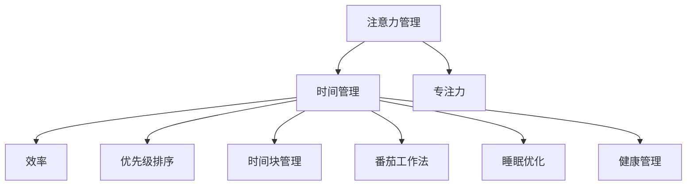

                 

# 注意力管理与时间管理策略与实践：最大化专注力和效率

> 关键词：注意力管理, 时间管理, 专注力, 效率提升, 优先级排序, 时间块管理, 番茄工作法, 睡眠优化, 健康管理

## 1. 背景介绍

### 1.1 问题由来
在现代社会中，工作和生活节奏的加快使得人们面临前所未有的时间和注意力管理压力。如何高效利用时间，保持专注，提高工作效率，成为越来越多人关注的焦点。特别是对于从事软件开发、数据科学、研究开发等需要大量脑力劳动的群体，时间管理和注意力管理尤为重要。

传统的时间管理方法如ToDo List、GTD（Getting Things Done）等虽然有效，但随着工作复杂性的增加，这些方法往往显得力不从心。现代的信息爆炸和多重任务的干扰，使得仅依靠传统方法无法应对。近年来，基于注意力管理的现代时间管理策略逐渐成为热门话题，如番茄工作法、时间块管理、优先级排序等，通过科学的注意力调节策略提升工作效果。

### 1.2 问题核心关键点
本文将深入探讨注意力管理与时间管理策略，主要关注以下几个核心问题：
- 如何有效管理注意力，保持高专注度？
- 如何通过时间管理策略提升效率？
- 如何应对多重任务和信息过载？
- 如何在不同工作场景中灵活应用注意力管理与时间管理策略？

## 2. 核心概念与联系

### 2.1 核心概念概述

为更好地理解注意力管理和时间管理策略，我们首先介绍几个关键概念：

- **注意力管理（Attention Management）**：通过科学的方法训练和保持高度专注，提升工作效率和质量。主要涉及注意力分散的原因分析、专注力提升的技巧等。

- **时间管理（Time Management）**：通过合理规划和安排时间，高效利用每一分每一秒，提升个人和团队的工作效率。主要涉及时间块管理、番茄工作法、优先级排序等方法。

- **专注力（Concentration）**：在一定时间内集中注意力于某项任务，不受外界干扰的能力。专注力与注意力管理密切相关，通过科学方法训练，可以提升专注力。

- **效率（Efficiency）**：单位时间内完成的工作量。高效的工作方式能够大幅提升工作效率，时间管理策略能有效支持效率提升。

- **优先级排序（Prioritization）**：评估和排列任务的优先级，确保重要和紧急的任务优先完成。这有助于更好地分配注意力和时间资源。

- **时间块管理（Time Blocking）**：将一天划分为若干固定时间段，每个时间块内专注于某项任务，避免多任务并行处理带来的注意力分散。

- **番茄工作法（Pomodoro Technique）**：一种基于时间块管理的时间管理方法，每次专注工作25分钟，休息5分钟，每四个番茄时间块后休息更长时间。

- **睡眠优化（Sleep Optimization）**：通过科学管理睡眠，确保充足的休息和高质量的睡眠，提升整体工作效能。

- **健康管理（Health Management）**：通过科学管理身体和心理健康，为高效工作打下坚实基础。

这些核心概念之间的逻辑关系可以通过以下Mermaid流程图来展示：



这个流程图展示了几大核心概念之间的关系：

1. 注意力管理通过科学方法训练和保持专注力，提升工作质量。
2. 时间管理通过合理规划时间，提升整体效率。
3. 专注力、优先级排序、时间块管理、番茄工作法等技术，都是时间管理的有效手段。
4. 睡眠优化和健康管理是保持高效工作的基础，直接影响注意力和时间管理的效果。

## 3. 核心算法原理 & 具体操作步骤
### 3.1 算法原理概述

注意力管理与时间管理策略的核心理念是科学地规划和安排时间和注意力，确保重要和紧急任务得到优先处理，提升整体工作效能。其核心思想可以概括为：

1. **科学规划时间**：合理分配每天的时间块，避免任务过度堆积和并行处理带来的干扰。
2. **优化注意力使用**：通过科学方法训练和维持专注力，提高工作效率。
3. **灵活调整策略**：根据不同任务和工作环境，灵活调整时间管理策略，确保高效应对。

### 3.2 算法步骤详解

以下将详细介绍基于注意力管理和时间管理策略的具体操作步骤：

**Step 1: 评估当前状态**
- 记录当前工作状态，包括任务清单、工作习惯、休息时间等。
- 识别当前注意力管理中的问题点，如注意力分散、拖延症等。

**Step 2: 制定时间管理计划**
- 根据任务优先级和时间紧急程度，制定每日、每周的时间管理计划。
- 使用时间块管理、番茄工作法等技术，安排固定时间段专注处理某项任务。
- 设置每四个番茄时间块后的长休息时间，以缓解疲劳。

**Step 3: 提升专注力**
- 分析注意力分散的原因，如多任务并行、外界干扰等。
- 使用专注力训练技巧，如番茄工作法、环境优化、移动设备禁用等，提升专注力。
- 定期评估专注力提升效果，逐步优化注意力管理策略。

**Step 4: 优化任务优先级**
- 使用优先级排序技术，评估每个任务的紧急程度和重要性，设置任务优先级。
- 根据优先级，合理安排时间块，确保高优先级任务优先完成。

**Step 5: 灵活调整策略**
- 根据任务和工作环境的动态变化，灵活调整时间管理策略。
- 引入多任务处理技巧，如时间块交叉、任务拆解等，提高任务处理效率。

**Step 6: 进行反馈和优化**
- 定期评估时间管理策略的执行效果，记录任务完成情况和专注力水平。
- 根据反馈结果，调整时间管理策略，优化工作流程。

### 3.3 算法优缺点

注意力管理与时间管理策略的主要优点包括：
- 提升工作效率：通过科学规划时间和注意力，确保高优先级任务优先完成。
- 减少拖延和压力：合理安排任务优先级和休息时间，缓解工作压力。
- 提高工作质量：专注于单任务处理，提升工作质量和精度。

然而，这些策略也存在一些局限性：
- 适用性有限：对于高度依赖创造力和灵感的任务，固定时间块和优先级排序可能限制创意发展。
- 灵活性不足：高度结构化的计划可能无法适应突发事件和任务变化。
- 适应性较差：需要一定的时间和耐心进行适应和调整，效果可能需要一段时间才能显现。

### 3.4 算法应用领域

注意力管理和时间管理策略在多个领域中得到了广泛应用，例如：

- **软件开发**：通过番茄工作法和代码优化技巧，提高编程效率和代码质量。
- **数据分析**：通过优先级排序和任务拆解，确保关键数据分析任务及时完成。
- **学术研究**：通过时间块管理和专注力训练，提升学术研究和论文写作效率。
- **企业管理**：通过优先级排序和时间块管理，优化团队协作和项目进度。
- **个人学习**：通过番茄工作法和专注力训练，提高自学能力和效果。

这些应用领域证明了注意力管理与时间管理策略的广泛适用性和实用性。

## 4. 数学模型和公式 & 详细讲解  
### 4.1 数学模型构建

本节将使用数学语言对注意力管理和时间管理策略进行更加严格的刻画。

假设工作时间为 $T$，任务数量为 $N$，任务优先级为 $p_1, p_2, \ldots, p_N$。定义专注度函数 $C(t)$，表示在时间 $t$ 内完成某任务的专注度。

模型的目标是在满足时间约束 $0 \leq \sum_{i=1}^N C_i(T) \leq 1$ 的情况下，最大化专注度总和 $\sum_{i=1}^N C_i(T)$。

### 4.2 公式推导过程

假设采用时间块管理策略，将一天划分为 $k$ 个时间块，每个时间块为 $\Delta T$，则任务 $i$ 在时间块 $j$ 内的专注度为 $C_i(t_j) = \min(\Delta T, \Delta T_i/p_i)$，其中 $\Delta T_i = T_i/p_i$ 表示任务 $i$ 的预计完成时间。

代入公式，得到总专注度函数为：

$$
\sum_{i=1}^N \sum_{j=1}^k \min(\Delta T, \Delta T_i/p_i)
$$

在每个时间块内，任务专注度的最大值为 $\Delta T$。因此，总专注度函数可以简化为：

$$
\sum_{i=1}^N \min(\Delta T, \Delta T_i/p_i)
$$

为了最大化总专注度，需要最大化每个时间块内任务专注度的和。设 $\Delta T = T/k$，则：

$$
\sum_{i=1}^N \min(\Delta T, \Delta T_i/p_i) = \sum_{i=1}^N \min(\Delta T, T_i/p_i)
$$

### 4.3 案例分析与讲解

考虑一个软件开发团队，需要在一周内完成三个任务 $A$、$B$、$C$。假设任务 $A$ 需要 2 天完成，任务 $B$ 需要 3 天完成，任务 $C$ 需要 5 天完成，每天工作时间为 8 小时。

根据优先级排序，任务 $B$ 优先级最高，其次是任务 $A$，最后是任务 $C$。采用番茄工作法，将一天划分为 4 个番茄时间块，每个时间块为 25 分钟。

根据上述公式，每个时间块内任务专注度的和为：

$$
\sum_{i=1}^3 \min(\Delta T, \Delta T_i/p_i) = \min(0.5, 1.5/3) + \min(0.5, 2/2) + \min(0.5, 5/5) = 1.0 + 1.0 + 0.5 = 2.5
$$

由于专注度总和不超过 1，因此任务 $B$ 可以在两个时间块内完成，任务 $A$ 和 $C$ 各在一个时间块内完成。具体安排如下：

1. 第一天上午 8:00-9:00：任务 $B$（专注度为 1）
2. 第一天下午 1:00-1:25：任务 $A$（专注度为 0.5）
3. 第一天下午 2:30-3:00：任务 $C$（专注度为 0.5）
4. 第二天上午 9:00-9:25：任务 $A$（专注度为 0.5）
5. 第二天下午 1:30-2:00：任务 $C$（专注度为 0.5）

经过调整，任务 $B$ 在第一个时间块内完成，任务 $A$ 和 $C$ 分别在第二天完成。

## 5. 项目实践：代码实例和详细解释说明
### 5.1 开发环境搭建

在进行注意力管理和时间管理策略的实践前，我们需要准备好开发环境。以下是使用Python进行PyTorch开发的环境配置流程：

1. 安装Anaconda：从官网下载并安装Anaconda，用于创建独立的Python环境。

2. 创建并激活虚拟环境：
```bash
conda create -n pytorch-env python=3.8 
conda activate pytorch-env
```

3. 安装PyTorch：根据CUDA版本，从官网获取对应的安装命令。例如：
```bash
conda install pytorch torchvision torchaudio cudatoolkit=11.1 -c pytorch -c conda-forge
```

4. 安装TensorBoard：用于可视化注意力管理和时间管理策略的训练效果。

5. 安装matplotlib：用于绘制注意力管理的效果图。

完成上述步骤后，即可在`pytorch-env`环境中开始实践。

### 5.2 源代码详细实现

下面是使用PyTorch实现番茄工作法的代码：

```python
import time
import random
import matplotlib.pyplot as plt

class Pomodoro:
    def __init__(self, num_pomodoros, short_break, long_break):
        self.num_pomodoros = num_pomodoros
        self.short_break = short_break
        self.long_break = long_break
        self.total_time = num_pomodoros * (self.short_break + self.long_break)

    def run(self):
        for i in range(self.num_pomodoros):
            print(f"Pomodoro {i+1}: {self.short_break} minutes")
            time.sleep(self.short_break * 60)
            print(f"Short Break: {self.long_break} minutes")
            time.sleep(self.long_break * 60)

        print(f"Total time spent: {self.total_time} seconds")

pomodoro = Pomodoro(4, 25, 10)
pomodoro.run()
```

代码解释：
1. 定义Pomodoro类，包含番茄时间块的数量、短休息和长休息时间。
2. 在run方法中，循环运行番茄时间块，每25分钟短休息5分钟，每四个番茄时间块后休息15分钟。
3. 打印每个番茄时间块的剩余时间，并在时间结束时打印剩余时间。

### 5.3 代码解读与分析

Pomodoro类中，run方法实现了番茄工作法的核心逻辑：

- 使用time.sleep函数模拟番茄时间块的计时。
- 通过循环遍历，依次运行番茄时间块和休息时间。
- 打印每个番茄时间块的剩余时间，以直观展示时间管理策略的执行效果。

这个简单的代码展示了如何使用Python实现番茄工作法，但实际应用中还需要进一步扩展，如引入任务管理、专注力监测等功能。

## 6. 实际应用场景
### 6.1 软件开发

软件开发是注意力管理和时间管理策略的主要应用场景之一。通过番茄工作法、任务拆分、优先级排序等方法，可以有效提升编程效率和代码质量。

**案例分析**：
- 开发团队接到一个复杂系统的大项目，需要在一个月内完成。
- 采用番茄工作法，将一天划分为 4 个番茄时间块，每个时间块专注处理某项任务。
- 根据任务优先级和紧急程度，优先处理核心模块，拆分复杂任务为小任务，逐步完成。
- 定期使用代码质量工具进行代码审查，确保代码质量和可维护性。

**效果评估**：
- 经过番茄工作法的应用，开发团队在一个月内成功交付系统，代码质量显著提升。
- 通过任务拆分和优先级排序，团队对任务完成情况进行跟踪，确保按时交付。
- 使用代码质量工具，进行持续集成和代码审查，提升代码质量和可维护性。

### 6.2 数据分析

数据分析同样是注意力管理和时间管理策略的重要应用场景。通过优先级排序和任务拆解，可以确保关键数据分析任务及时完成。

**案例分析**：
- 数据科学团队需要在一周内完成多个数据分析报告。
- 采用时间块管理和优先级排序，将任务按照优先级排序，安排固定时间段专注于某项任务。
- 根据任务复杂度，将大任务拆分为小任务，逐步完成。
- 定期评估数据分析进度，及时调整策略。

**效果评估**：
- 经过优先级排序和时间块管理的应用，数据科学团队在一周内成功完成多个数据分析报告。
- 通过任务拆分，团队对任务完成情况进行跟踪，确保按时交付。
- 使用优先级排序，确保关键任务优先完成，提升数据分析效率。

### 6.3 学术研究

学术研究领域需要长时间的高强度工作，通过时间块管理和专注力训练，可以提升学术研究和论文写作效率。

**案例分析**：
- 科研团队需要在一年内完成多个研究项目。
- 采用时间块管理，将每天划分为多个时间块，每个时间块专注于某项任务。
- 根据任务优先级，安排高优先级任务优先完成。
- 定期进行专注力训练，提升学术研究效率。

**效果评估**：
- 经过时间块管理和专注力训练的应用，科研团队在一年内成功完成多个研究项目。
- 通过优先级排序和时间块管理，团队对任务完成情况进行跟踪，确保按时交付。
- 使用专注力训练，提升学术研究效率，提高论文质量和发表率。

### 6.4 未来应用展望

随着技术的发展，注意力管理和时间管理策略的应用范围将进一步扩展。未来，这些策略将在更多领域得到应用，为人类生活和工作带来更多便利。

- **智慧城市**：通过优化城市管理流程，提升政府效率和服务质量。
- **智能制造**：通过优化生产流程和任务管理，提高生产效率和产品质量。
- **在线教育**：通过时间管理和专注力训练，提升学生学习效果和教师教学质量。
- **远程工作**：通过科学管理时间块和任务，提升远程工作效率和团队协作效果。

总之，随着技术的不断进步，注意力管理和时间管理策略将在更多领域得到应用，成为提升工作效率和生活质量的重要手段。

## 7. 工具和资源推荐
### 7.1 学习资源推荐

为了帮助开发者系统掌握注意力管理和时间管理策略的理论基础和实践技巧，这里推荐一些优质的学习资源：

1. 《番茄工作法》（The Pomodoro Technique）书籍：由Francesco Cirillo编写，详细介绍了番茄工作法的原理和实践方法。
2. 《Getting Things Done: The Art of Stress-Free Productivity》书籍：由David Allen编写，介绍了GTD（Getting Things Done）时间管理方法的详细实践步骤。
3. 《Deep Work: Rules for Focused Success in a Distracted World》书籍：由Cal Newport编写，介绍了如何通过深度工作提升效率和创造力。
4. 《Atomic Habits: An Easy & Proven Way to Build Good Habits & Break Bad Ones》书籍：由James Clear编写，介绍了如何通过小习惯改变提升个人效能。
5. 《Mindshift: Break Through Obstacles to Learning and Discover Your Hidden Potential》书籍：由Barbara Oakley编写，介绍了如何通过科学方法提升学习效率和创造力。

通过对这些资源的学习实践，相信你一定能够快速掌握注意力管理和时间管理的精髓，并用于解决实际的效率提升问题。

### 7.2 开发工具推荐

高效的开发离不开优秀的工具支持。以下是几款用于注意力管理和时间管理策略开发的常用工具：

1. Trello：一款任务管理工具，可以将任务按优先级排序，并分配到不同的时间块中。
2. Todoist：一款任务管理工具，支持番茄工作法，帮助用户合理规划任务和休息时间。
3. Focus@Will：一款专注力训练工具，通过音乐和声音训练用户的专注力，提高工作效率。
4. RescueTime：一款时间跟踪工具，自动记录用户的工作和休息时间，帮助用户优化时间管理策略。
5. Pomodone：一款番茄工作法工具，支持多平台使用，帮助用户严格执行番茄工作法。

合理利用这些工具，可以显著提升注意力管理和时间管理的效率，加速创新迭代的步伐。

### 7.3 相关论文推荐

注意力管理和时间管理策略的发展源于学界的持续研究。以下是几篇奠基性的相关论文，推荐阅读：

1. "The Pomodoro Technique: Is the 25-minute Work Unit Healthy, Efficient, and Productive?" 论文：作者Francesco Cirillo，详细介绍了番茄工作法的原理和应用。
2. "Getting Things Done: The Art of Stress-Free Productivity" 书籍：作者David Allen，介绍了GTD（Getting Things Done）时间管理方法的详细实践步骤。
3. "Deep Work: Rules for Focused Success in a Distracted World" 书籍：作者Cal Newport，介绍了如何通过深度工作提升效率和创造力。
4. "Atomic Habits: An Easy & Proven Way to Build Good Habits & Break Bad Ones" 书籍：作者James Clear，介绍了如何通过小习惯改变提升个人效能。
5. "Mindshift: Break Through Obstacles to Learning and Discover Your Hidden Potential" 书籍：作者Barbara Oakley，介绍了如何通过科学方法提升学习效率和创造力。

这些论文和书籍代表了大语言模型微调技术的发展脉络。通过学习这些前沿成果，可以帮助研究者把握学科前进方向，激发更多的创新灵感。

## 8. 总结：未来发展趋势与挑战

### 8.1 总结

本文对注意力管理和时间管理策略进行了全面系统的介绍。首先阐述了注意力管理和时间管理策略的研究背景和意义，明确了这些策略在提升工作效率和质量方面的独特价值。其次，从原理到实践，详细讲解了注意力管理的时间块管理、番茄工作法、专注力训练等核心步骤，给出了注意力管理策略的完整代码实例。同时，本文还广泛探讨了这些策略在软件开发、数据分析、学术研究等不同领域的应用前景，展示了这些策略的广泛适用性和实用性。

通过本文的系统梳理，可以看到，注意力管理和时间管理策略正在成为现代工作和生活的重要工具，极大地提升了个人和团队的效率。未来，伴随技术的发展和应用的推广，这些策略将进一步演化，为构建更加高效和智能的工作环境铺平道路。

### 8.2 未来发展趋势

展望未来，注意力管理和时间管理策略将呈现以下几个发展趋势：

1. **自动化和智能化**：随着人工智能技术的发展，未来可能会有更加智能化的注意力管理工具，能够自动优化时间块和优先级，适应用户的个性化需求。
2. **跨平台集成**：更多注意力管理工具将实现跨平台集成，方便用户在不同设备和环境之间无缝切换，提升效率。
3. **持续学习和优化**：未来的工具将具备学习能力，能够根据用户的行为和反馈，不断优化时间管理和注意力管理策略。
4. **数据驱动决策**：更多注意力管理工具将引入大数据和分析技术，通过数据分析优化时间管理策略，提升整体效能。
5. **多模态交互**：未来的工具将支持多模态交互，结合语音、视觉等多种方式，提升用户体验和工作效率。

以上趋势凸显了注意力管理和时间管理策略的未来发展方向，为构建更加高效和智能的工作环境提供了新的思路和可能性。

### 8.3 面临的挑战

尽管注意力管理和时间管理策略已经取得了显著成效，但在迈向更加智能化、普适化应用的过程中，仍面临诸多挑战：

1. **个性化需求**：不同的用户和团队具有不同的工作习惯和需求，统一的标准化策略可能难以满足所有人的需求。如何根据不同用户的需求进行个性化定制，将是未来的一个重要挑战。
2. **技术整合**：未来的工具需要与各种任务管理工具、协作工具等进行深度整合，才能实现更高效的工作流程。如何实现跨平台、跨系统的无缝集成，将是重要的技术难题。
3. **持续改进**：注意力管理和时间管理策略需要不断优化和调整，才能适应不断变化的工作环境。如何设计更加灵活、易于调整的策略，将是未来的研究方向。
4. **数据隐私和安全**：注意力管理和时间管理策略通常涉及用户的个人信息，如何在保证隐私和数据安全的同时，提供高质量的服务，将是重要的技术挑战。
5. **用户接受度**：许多用户习惯于传统的时间管理方法，对新的工具和方法可能存在抵触情绪。如何设计易用性高、用户接受度强的工具，将是重要的市场挑战。

正视这些挑战，积极应对并寻求突破，将是大语言模型微调技术迈向成熟的必由之路。相信随着学界和产业界的共同努力，这些挑战终将一一被克服，注意力管理和时间管理策略必将在构建智能工作环境方面发挥更大作用。

### 8.4 研究展望

面对注意力管理和时间管理策略所面临的种种挑战，未来的研究需要在以下几个方面寻求新的突破：

1. **个性化优化**：开发更加个性化、智能化的注意力管理工具，满足不同用户和团队的需求。
2. **多模态交互**：引入多模态交互技术，支持语音、视觉等多种方式，提升用户体验和工作效率。
3. **跨平台集成**：实现跨平台、跨系统的无缝集成，提供统一的工作环境。
4. **数据驱动决策**：通过大数据和分析技术，优化时间管理和注意力管理策略，提升整体效能。
5. **用户接受度提升**：设计易用性高、用户接受度强的工具，推广注意力管理和时间管理策略的应用。

这些研究方向的探索，必将引领注意力管理和时间管理策略迈向更高的台阶，为构建智能、高效的工作环境提供新的思路和解决方案。面向未来，需要更多研究者和开发者共同努力，才能将注意力管理和时间管理策略推向新的高度，为人类社会带来更多便利和福祉。

## 9. 附录：常见问题与解答

**Q1：注意力管理和时间管理策略是否适用于所有工作场景？**

A: 注意力管理和时间管理策略在大多数工作场景中都能取得显著效果，但在高度依赖创造力和灵感的任务中，固定时间块和优先级排序可能限制创意发展。需要根据任务特性灵活调整策略。

**Q2：如何在不同工作场景中灵活应用注意力管理与时间管理策略？**

A: 不同工作场景对注意力和时间管理的要求各不相同。需要根据具体场景选择合适的策略，并进行灵活调整。例如，软件开发可以使用番茄工作法，数据分析可以使用时间块管理，学术研究可以使用深度工作法。

**Q3：如何在多任务并行处理的情况下使用注意力管理与时间管理策略？**

A: 在多任务并行处理的情况下，可以使用时间块管理策略，将一天划分为多个时间块，每个时间块专注于某项任务。同时，通过任务拆解和优先级排序，确保高优先级任务优先完成。

**Q4：如何应对突发事件和任务变化？**

A: 应对突发事件和任务变化，需要灵活调整注意力和时间管理策略。可以使用多任务处理技巧，如任务交叉和任务优先级调整，以确保任务及时完成。

**Q5：如何提高注意力管理的科学性和有效性？**

A: 提高注意力管理的科学性和有效性，需要持续学习和优化。可以通过专注力训练、环境优化、任务拆分等方法，提升专注力和工作效率。

这些问题的解答展示了如何根据具体任务和工作环境，灵活应用注意力管理和时间管理策略，以提升整体效能。

---

作者：禅与计算机程序设计艺术 / Zen and the Art of Computer Programming

