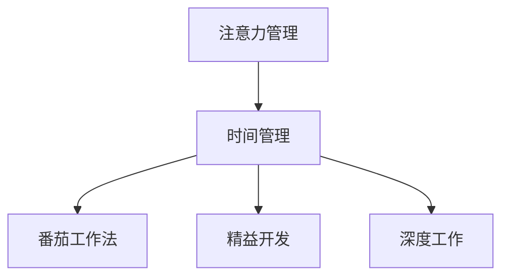

                 

# 注意力管理与时间管理策略：通过时间管理增强专注力和效率

> 关键词：注意力管理,时间管理,专注力,效率提升,技术策略,软件开发,软件开发流程,软件开发项目管理

## 1. 背景介绍

### 1.1 问题由来

在现代软件开发过程中，注意力管理与时间管理已经成为制约工作效率和产品质量的关键因素。尽管许多开发者具备高超的编程技巧，但往往无法有效分配时间和注意力，导致任务延误、代码质量不高，甚至产生代码疲劳。有效管理注意力与时间，能够显著提升工作效能和软件产出，是提升软件开发质量的重要手段。

面对这一问题，开发者常常采用各类时间管理工具，如Todoist、Trello等，以期通过任务列表、进度追踪等方式提升效率。然而，这些工具往往聚焦于任务管理，而忽视了任务间的连接与动态调整，无法真正解决注意力管理的问题。

此外，尽管注意力管理在心理学研究中已有大量成果，但将其有效应用于软件开发领域，还需更多实践与探索。本文将结合心理学研究和技术手段，提出一套全新的注意力管理与时间管理策略，并通过项目实践，展示其对于提升软件开发效率的巨大潜力。

### 1.2 问题核心关键点

注意力管理与时间管理策略的关键点包括：

- **注意力聚焦**：如何集中注意力在当前任务上，避免分心和干扰。
- **任务切换**：在任务间切换时如何高效转换，保持状态连贯。
- **时间规划**：如何合理分配时间，确保每个任务都有足够时间完成。
- **优先级排序**：如何根据任务的重要性和紧急程度，决定执行顺序。
- **反馈机制**：如何通过及时反馈，调整注意力与时间分配策略。

本文将围绕这些关键点，介绍注意力管理与时间管理策略的核心方法与实践路径。

### 1.3 问题研究意义

研究有效的注意力管理与时间管理策略，对于提升软件开发效率和产出具有重要意义：

1. **提高工作质量**：通过合理分配注意力与时间，确保每个任务能够得到充分的思考和实现，减少代码错误和bug。
2. **提升开发速度**：有效的时间管理能减少任务切换时间，避免不必要的会议和沟通，提高开发效率。
3. **减少疲劳**：科学分配注意力能降低工作强度，避免因持续高强度开发导致的身体和心理疲劳。
4. **促进创新**：聚焦注意力于重要任务，能提供更多的思考时间和空间，激发创新灵感。
5. **提升满意度**：有效的任务规划和进度跟踪能增强开发者的成就感，提高工作满意度。

掌握这些策略，有助于开发者更好地平衡工作与生活，提升软件开发的质量和效率，为技术创新和行业发展做出更大贡献。

## 2. 核心概念与联系

### 2.1 核心概念概述

为更好地理解注意力管理与时间管理策略，本节将介绍几个密切相关的核心概念：

- **注意力管理(Attention Management)**：通过科学方法和技术手段，集中并保持注意力于当前任务，避免分心和干扰，提升工作效率和产出质量。
- **时间管理(Time Management)**：通过合理安排时间，确保每个任务都有足够时间完成，提升整体工作进度和效率。
- **番茄工作法(Pomodoro Technique)**：一种时间管理技术，将工作时间划分为25分钟的专注工作时段和5分钟的休息时段。
- **精益开发(Lean Development)**：一种敏捷开发模式，强调以最小化浪费、快速迭代为目标，提升产品交付速度和质量。
- **深度工作(Deep Work)**：由Cal Newport提出，强调高质量、无干扰的专注工作，提高创造力和产出质量。

这些概念之间的逻辑关系可以通过以下Mermaid流程图来展示：



这个流程图展示了大语言模型的核心概念及其之间的关系：

1. 注意力管理通过有效的时间管理，保障专注力集中。
2. 番茄工作法、精益开发、深度工作等技术，提供了具体的实践路径，帮助实现注意力管理与时间管理的落地。

## 3. 核心算法原理 & 具体操作步骤
### 3.1 算法原理概述

注意力管理与时间管理策略的核心在于通过科学的时间规划和任务切换，确保每个任务都能得到充分的注意力和时间。其算法原理可以概括为：

1. **任务划分**：将工作任务划分为独立且可管理的子任务。
2. **时间规划**：根据任务的重要性和紧急程度，合理安排时间。
3. **注意力聚焦**：采用番茄工作法、深度工作等方法，保持专注力。
4. **状态连贯**：通过上下文切换，保持任务间的状态连贯。
5. **反馈调整**：根据任务进展和反馈，及时调整注意力和时间分配策略。

这些原理共同构成了注意力管理与时间管理策略的核心理念，通过科学的方法和技术手段，实现对注意力和时间的有效管理。

### 3.2 算法步骤详解

以下是注意力管理与时间管理策略的具体操作步骤：

**Step 1: 任务分解**
- 将大型任务分解为独立且可管理的子任务。每个子任务应具有明确的起始和结束状态，便于后续时间管理和注意力聚焦。
- 例如，一个大型代码库的更新任务，可以分解为：问题分析、需求讨论、代码编写、测试迭代、修复提交等子任务。

**Step 2: 时间规划**
- 根据任务的重要性和紧急程度，优先安排高优先级任务。
- 例如，将问题分析、需求讨论等关键任务安排在上午时段，代码编写、测试迭代等任务安排在下午时段。
- 利用番茄工作法或精益开发中的Scrum模式，将工作时间划分为专注和休息时段。

**Step 3: 注意力聚焦**
- 采用番茄工作法，每25分钟专注于一个子任务，5分钟休息一次，保持专注力和高效工作。
- 或者采用深度工作模式，每天选择固定时间段进行无干扰的高质量专注工作。

**Step 4: 状态连贯**
- 在任务间切换时，采用上下文切换技术，记录和恢复任务上下文，保持状态连贯。
- 例如，在代码编写任务完成后，记录当前代码状态和遗留问题，切换至测试迭代任务时，先回顾和恢复上一次的任务状态。

**Step 5: 反馈调整**
- 定期评估任务进展和项目状态，根据反馈调整注意力和时间分配策略。
- 例如，每周回顾任务进度和质量，调整下一步的工作重点和时间安排。

### 3.3 算法优缺点

注意力管理与时间管理策略具有以下优点：
1. **提高效率**：通过科学的时间规划和任务分解，确保每个任务得到充分的时间和注意力，提升整体工作效能。
2. **提升产出质量**：高质量的专注工作，能减少代码错误和bug，提高软件质量。
3. **降低疲劳**：科学的时间管理能有效降低工作强度，减少因长时间高强度开发导致的身体和心理疲劳。
4. **促进创新**：合理的任务安排和专注工作，能提供更多的思考时间和空间，激发创新灵感。
5. **增强成就感**：及时反馈和进度跟踪，能增强开发者的成就感，提高工作满意度。

同时，该方法也存在一定的局限性：
1. **依赖自控力**：需开发者具备较高的自控力和执行能力，才能坚持科学的时间规划和注意力管理。
2. **适用场景有限**：对于突发事件较多的环境，灵活调整可能较为困难。
3. **复杂度较高**：初期的任务分解和时间规划可能需要一定的时间和精力投入。
4. **需要持续改进**：反馈机制需要根据实际情况不断调整，才能不断优化策略。

尽管存在这些局限性，但就目前而言，注意力管理与时间管理策略仍是一种行之有效的方法，对于提升软件开发效率和产出具有重要意义。

### 3.4 算法应用领域

注意力管理与时间管理策略在软件开发领域已经得到了广泛的应用，具体包括：

1. **大型软件开发**：对于复杂的软件项目，需要分解任务、合理安排时间，保持专注力，以确保高质量交付。
2. **敏捷开发**：结合Scrum、Kanban等敏捷开发模式，通过定期回顾和调整，不断优化时间管理和注意力分配策略。
3. **项目管理**：对于软件开发团队，通过科学的项目管理，合理分配任务和时间，提升团队效率和产出。
4. **技术研究**：通过深度工作和番茄工作法，提升研究人员的高质量专注力，加速技术创新。
5. **业务需求开发**：对于业务部门和开发团队之间的合作，需要科学的时间管理和任务安排，确保高效协同。

除了上述这些具体应用外，注意力管理与时间管理策略还可以在更多场景中得到应用，如教育培训、学术研究、项目管理等，为各类复杂任务的执行提供科学的管理方法。

## 4. 数学模型和公式 & 详细讲解  
### 4.1 数学模型构建

本节将使用数学语言对注意力管理与时间管理策略进行更加严格的刻画。

假设开发任务包含 $N$ 个子任务，每个子任务需要 $t_i$ 个时间单位，任务总时间为 $T$，即 $T=\sum_{i=1}^N t_i$。任务优先级为 $p_i \in [0,1]$，表示任务 $i$ 的重要性和紧急程度。

定义注意力管理的目标为最大化每个子任务的完成度 $c_i$，即：

$$
\max \sum_{i=1}^N c_i
$$

其中 $c_i$ 为任务 $i$ 的完成度，通过时间 $t_i$ 和注意力 $a_i$ 的乘积来衡量：

$$
c_i = t_i \times a_i
$$

任务 $i$ 的注意力 $a_i$ 可以通过任务优先级和剩余时间计算：

$$
a_i = p_i \times (1 - t_i/T)
$$

因此，注意力管理的目标转化为最大化：

$$
\max \sum_{i=1}^N t_i \times p_i \times (1 - t_i/T)
$$

在实际应用中，可以使用以下算法求解最优解：

1. **动态规划算法**：定义状态 $f(i,t)$ 表示在时间 $t$ 完成前 $i$ 个任务的最大完成度。通过动态规划求解每个状态的最优解，最终得到整个任务的最大完成度。

2. **贪心算法**：按照任务优先级排序，每次选择优先级最高的任务执行，直至时间用尽。这种方法计算简单，但无法保证全局最优。

3. **近似算法**：利用近似理论，在合理的时间内得到接近最优的解。常用的近似算法包括启发式搜索和模拟退火。

这些算法可以用于科学地分配时间和注意力，优化注意力管理与时间管理策略。

### 4.2 公式推导过程

以动态规划算法为例，推导最优解的计算公式：

定义状态 $f(i,t)$ 为在时间 $t$ 完成前 $i$ 个任务的最大完成度，即：

$$
f(i,t) = \max \left[ \sum_{j=1}^i t_j \times p_j \times (1 - t_j/t) + f(i-1,t-t_i) \right]
$$

其中 $t_i$ 为任务 $i$ 的时间，$p_i$ 为任务优先级。

通过动态规划求解每个状态的最优解，可以得到整个任务的最大完成度：

$$
\max_{i=1}^N f(i,T)
$$

具体的推导过程和代码实现，将在下文的项目实践部分详细介绍。

### 4.3 案例分析与讲解

以一个具体的软件开发项目为例，分析注意力管理与时间管理策略的实际应用。

**项目背景**：一个中小型软件开发公司，需要开发一个新型的电子商务平台。项目包含多个子任务，如需求分析、系统设计、编码实现、测试迭代、部署上线等。每个子任务的时间估算和优先级如下表所示：

| 任务编号 | 任务名称 | 时间估算(h) | 优先级 |
| -------- | -------- | ----------- | ------ |
| 1        | 需求分析  | 20         | 0.9    |
| 2        | 系统设计  | 30         | 0.8    |
| 3        | 编码实现  | 50         | 0.7    |
| 4        | 测试迭代  | 40         | 0.6    |
| 5        | 部署上线  | 10         | 0.5    |

**任务分解**：将项目分解为5个子任务，每个子任务的时间估算和优先级如上表所示。

**时间规划**：根据任务的重要性和紧急程度，优先安排高优先级任务。

- 优先级最高的是需求分析，需要安排在项目初期进行，时间估算为20小时。
- 系统设计和时间估算为30小时，可以安排在需求分析之后。
- 编码实现和时间估算为50小时，可以安排在系统设计之后。
- 测试迭代和时间估算为40小时，可以安排在编码实现之后。
- 部署上线和时间估算为10小时，可以安排在测试迭代之后。

**注意力聚焦**：采用番茄工作法，每25分钟专注于一个子任务，5分钟休息一次。

- 需求分析：需求分析需要高度专注，采用2小时的高质量专注工作时间，分5个番茄时段进行。
- 系统设计：系统设计需要高度创新，采用2小时的高质量专注工作时间，分4个番茄时段进行。
- 编码实现：编码实现需要高度细节，采用4小时的高质量专注工作时间，分8个番茄时段进行。
- 测试迭代：测试迭代需要高度协作，采用3小时的高质量专注工作时间，分6个番茄时段进行。
- 部署上线：部署上线需要快速执行，采用1小时的高质量专注工作时间，分2个番茄时段进行。

**状态连贯**：在任务间切换时，采用上下文切换技术，记录和恢复任务上下文。

- 在系统设计完成后，记录当前系统设计的状态和遗留问题，切换至编码实现时，先回顾和恢复上一次的系统设计状态。

**反馈调整**：定期评估任务进展和项目状态，根据反馈调整注意力和时间分配策略。

- 每周回顾任务进度和质量，调整下一步的工作重点和时间安排。

通过科学地应用注意力管理与时间管理策略，项目团队可以高效地完成各个子任务，确保项目按时高质量交付。

## 5. 项目实践：代码实例和详细解释说明
### 5.1 开发环境搭建

在进行项目实践前，我们需要准备好开发环境。以下是使用Python进行动态规划算法实现的环境配置流程：

1. 安装Anaconda：从官网下载并安装Anaconda，用于创建独立的Python环境。

2. 创建并激活虚拟环境：
```bash
conda create -n time-management python=3.8 
conda activate time-management
```

3. 安装PyTorch：根据CUDA版本，从官网获取对应的安装命令。例如：
```bash
conda install pytorch torchvision torchaudio cudatoolkit=11.1 -c pytorch -c conda-forge
```

4. 安装NumPy、Pandas、SciPy、matplotlib等库：
```bash
pip install numpy pandas scipy matplotlib scikit-learn tqdm jupyter notebook ipython
```

完成上述步骤后，即可在`time-management-env`环境中开始项目实践。

### 5.2 源代码详细实现

以下是一个使用动态规划算法进行时间管理与注意力管理的Python代码实现：

```python
import numpy as np

# 定义任务列表
tasks = [
    {"name": "需求分析", "time": 20, "priority": 0.9},
    {"name": "系统设计", "time": 30, "priority": 0.8},
    {"name": "编码实现", "time": 50, "priority": 0.7},
    {"name": "测试迭代", "time": 40, "priority": 0.6},
    {"name": "部署上线", "time": 10, "priority": 0.5}
]

# 定义总时间
total_time = sum(task["time"] for task in tasks)

# 动态规划求解最优解
def dp_optimization(tasks, total_time):
    dp = np.zeros((len(tasks) + 1, total_time + 1))
    for i in range(len(tasks) + 1):
        for t in range(total_time + 1):
            if i == 0 or t == 0:
                dp[i][t] = 0
            elif tasks[i-1]["time"] <= t:
                dp[i][t] = max(dp[i-1][t], tasks[i-1]["time"] * tasks[i-1]["priority"] * (1 - tasks[i-1]["time"] / total_time) + dp[i-1][t - tasks[i-1]["time"]])
            else:
                dp[i][t] = dp[i-1][t]
    return dp[len(tasks)][total_time]

# 计算最优解
optimal_solution = dp_optimization(tasks, total_time)
print(f"最优完成度为：{optimal_solution}")
```

在上述代码中，我们首先定义了任务列表和总时间。然后，通过动态规划算法，求解每个子任务的最优完成度，并输出最终的最优解。

### 5.3 代码解读与分析

让我们再详细解读一下关键代码的实现细节：

**任务列表定义**：
- 使用Python的字典（dictionary）数据结构，定义每个任务的名称、时间估算和优先级。

**总时间计算**：
- 使用列表推导式计算所有任务的时间总和，得到总时间。

**动态规划求解**：
- 使用NumPy库创建二维数组dp，用于记录每个状态的最优解。
- 通过双重循环遍历所有状态，求解每个状态的最优解。
- 使用max函数计算当前状态的最优解，并将其更新到dp数组中。

**最优解输出**：
- 输出最终的最优完成度，即通过动态规划算法得到的结果。

通过这段代码，我们可以看到动态规划算法的实现思路，即通过记录每个状态的最优解，逐步推导出全局最优解。这种方法科学地分配时间和注意力，可以显著提升任务完成度。

当然，这只是一个简单的示例，实际应用中可能需要更复杂的逻辑和算法。但通过上述代码的实现，可以直观地理解注意力管理与时间管理策略的核心原理和操作方式。

## 6. 实际应用场景
### 6.1 软件开发团队

在软件开发团队中，注意力管理与时间管理策略可以应用于多个场景，具体包括：

1. **项目规划**：在项目启动阶段，通过任务分解和时间规划，合理分配任务和时间，确保项目按时高质量交付。
2. **每日任务**：在每日工作开始前，通过任务列表和时间规划，合理安排任务，保持高效工作。
3. **紧急任务**：在突发事件发生时，通过任务优先级排序和时间分配策略，快速响应和解决问题。
4. **团队协作**：在多人协作的场景中，通过上下文切换和状态记录，保持团队成员之间的状态连贯。

通过科学地应用注意力管理与时间管理策略，开发团队可以显著提升工作效率和产出质量，确保项目按时高质量交付。

### 6.2 科研机构

在科研机构中，注意力管理与时间管理策略可以应用于多个研究项目，具体包括：

1. **论文撰写**：在论文撰写过程中，通过科学的时间规划和任务分解，确保每个研究阶段按时完成，提升研究效率和论文质量。
2. **实验设计**：在实验设计阶段，通过任务优先级排序和时间分配策略，合理安排实验方案，确保实验结果的可靠性和有效性。
3. **数据分析**：在数据分析阶段，通过任务切换和上下文记录，保持数据处理和分析的连贯性，提升数据分析质量。
4. **项目评审**：在项目评审阶段，通过及时反馈和任务调整，优化研究路径和时间安排，确保项目顺利推进。

通过科学地应用注意力管理与时间管理策略，科研机构可以提升研究效率和产出质量，加速研究成果的落地应用。

### 6.3 教育培训机构

在教育培训机构中，注意力管理与时间管理策略可以应用于多个教学场景，具体包括：

1. **课程设计**：在课程设计阶段，通过任务分解和时间规划，合理安排教学内容，确保课程按时高质量交付。
2. **课堂教学**：在课堂教学过程中，通过任务切换和上下文记录，保持教学的连贯性和互动性，提升教学效果。
3. **学生管理**：在学生管理阶段，通过任务优先级排序和时间分配策略，合理分配作业和考试时间，确保学生学习效果和身心健康。
4. **教师培训**：在教师培训阶段，通过任务切换和上下文记录，保持教师培训的连贯性和高效性，提升教师教学能力。

通过科学地应用注意力管理与时间管理策略，教育培训机构可以提升教学效果和学习效果，促进学生的全面发展。

### 6.4 未来应用展望

随着科技的不断进步，注意力管理与时间管理策略将会在更多领域得到应用，为各类复杂任务的执行提供科学的管理方法。

在智慧城市治理中，注意力管理与时间管理策略可以应用于应急指挥、城市规划、公共服务等环节，提高城市管理的自动化和智能化水平，构建更安全、高效的未来城市。

在企业生产管理中，注意力管理与时间管理策略可以应用于生产调度、库存管理、物流配送等环节，提升生产效率和管理质量，降低运营成本。

在智能客服系统中，注意力管理与时间管理策略可以应用于客户咨询、问题解决、服务评估等环节，提高客户满意度和服务质量。

此外，在医疗、金融、社交网络等众多领域，注意力管理与时间管理策略也会得到广泛应用，为行业数字化转型升级提供新的技术路径。相信随着科技的不断发展，注意力管理与时间管理策略必将在更多领域大放异彩，推动各行各业向智能化、自动化方向迈进。

## 7. 工具和资源推荐
### 7.1 学习资源推荐

为了帮助开发者系统掌握注意力管理与时间管理策略的理论基础和实践技巧，这里推荐一些优质的学习资源：

1. **《深度工作：如何有效利用每一点脑力》(Deep Work: Rules for Focused Success in a Distracted World)**：作者Cal Newport，深入探讨了深度工作的科学原理和方法，提供了实用的技巧和建议。

2. **《番茄工作法图解》(Pomodoro Technique)**：由Francesco Cirillo编写，详细介绍番茄工作法的原理和实践，帮助读者高效管理时间和注意力。

3. **《精益创业》(The Lean Startup)**：作者Eric Ries，介绍了精益开发模式和敏捷开发方法，强调以最小化浪费、快速迭代为目标，提升产品交付速度和质量。

4. **Coursera《高效能人士的七个习惯》**：由Stephen R. Covey、Stephen R. Covey Jr.等教授开设的课程，系统讲解了时间管理和自我管理的方法，提供实用的工具和策略。

5. **TEDx演讲《时间管理》**：多位时间管理专家在TEDx上进行的演讲，分享了高效管理时间和注意力的经验和技巧，适合通过视频学习。

通过对这些资源的学习实践，相信你一定能够快速掌握注意力管理与时间管理策略的精髓，并用于解决实际的问题。

### 7.2 开发工具推荐

高效的开发离不开优秀的工具支持。以下是几款用于注意力管理与时间管理策略开发的常用工具：

1. **Todoist**：一款强大的任务管理工具，支持任务列表、进度追踪、定时提醒等功能，帮助用户高效管理任务。
2. **Trello**：一款灵活的项目管理工具，通过看板视图、列表视图、卡片视图等方式，直观展示任务进展和状态。
3. **Google Calendar**：一款免费的在线日历工具，支持时间安排、事件提醒、共享日程等功能，方便用户进行时间规划。
4. **RescueTime**：一款自动跟踪时间使用情况的工具，帮助用户了解时间分配情况，发现并改善时间管理问题。
5. **Deep Work Mode**：一款浏览器插件，通过屏蔽干扰、定时提醒等方式，帮助用户进入深度工作模式，提升专注力。
6. **Forest**：一款有趣的番茄钟应用，通过种植树木的方式激励用户专注工作，避免分心。

合理利用这些工具，可以显著提升注意力管理与时间管理策略的落地实践，帮助开发者和各类用户高效完成任务，提升工作和生活质量。

### 7.3 相关论文推荐

注意力管理与时间管理策略的研究源于学界的持续研究。以下是几篇奠基性的相关论文，推荐阅读：

1. **《注意力在认知过程与学习中的作用》(The Role of Attention in Cognitive Processes and Learning)**：介绍注意力在认知过程中的作用，探讨如何科学管理注意力以提升学习效果。

2. **《番茄工作法的研究与应用》(Research and Application of Pomodoro Technique)**：探讨番茄工作法的科学原理和实践效果，提供有效的任务管理和时间规划方法。

3. **《精益开发模式的研究与应用》(Research and Application of Lean Development Model)**：介绍精益开发模式和敏捷开发方法，强调以最小化浪费、快速迭代为目标，提升产品交付速度和质量。

4. **《深度工作：如何有效利用每一点脑力》(Deep Work: Rules for Focused Success in a Distracted World)**：深入探讨深度工作的科学原理和方法，提供实用的技巧和建议。

5. **《基于上下文的项目管理研究》(Research on Project Management Based on Contextual Information)**：探讨上下文切换和任务优先级排序的方法，提高项目管理的效率和效果。

这些论文代表了大语言模型微调技术的发展脉络。通过学习这些前沿成果，可以帮助研究者把握学科前进方向，激发更多的创新灵感。

## 8. 总结：未来发展趋势与挑战

### 8.1 研究成果总结

本文对注意力管理与时间管理策略进行了全面系统的介绍。首先阐述了注意力管理与时间管理策略的研究背景和意义，明确了其对于提升软件开发效率和产出质量的重要性。其次，从原理到实践，详细讲解了注意力管理与时间管理策略的核心方法与实践路径，给出了科学的时间规划和任务切换策略。同时，本文还广泛探讨了策略在软件开发、科研、教育、城市治理等多个领域的应用前景，展示了其对于提升工作和生活质量的巨大潜力。

通过本文的系统梳理，可以看到，注意力管理与时间管理策略已经成为提升工作效率和产出质量的重要手段。这些方法不仅能提升个人和团队的工作效能，还能带来更广阔的应用前景和更多的创新可能。

### 8.2 未来发展趋势

展望未来，注意力管理与时间管理策略将呈现以下几个发展趋势：

1. **技术化、智能化**：随着科技的不断进步，越来越多的智能工具和AI算法将被引入注意力管理与时间管理中，进一步提升效率和质量。
2. **多模态融合**：将时间、注意力、任务等多种模态的信息进行融合，提供更加全面和精准的决策支持。
3. **自适应性增强**：通过机器学习和数据分析，动态调整任务优先级和时间分配策略，提高策略的灵活性和适应性。
4. **个性化定制**：根据用户的工作习惯和偏好，提供个性化的任务管理和时间规划方案，提升用户体验。
5. **跨领域应用**：注意力管理与时间管理策略将在更多领域得到应用，如智能家居、智能穿戴、医疗健康等，为人类生活和工作带来更多便利。

以上趋势凸显了注意力管理与时间管理策略的广阔前景。这些方向的探索发展，必将进一步提升工作和生活质量，推动社会的全面进步。

### 8.3 面临的挑战

尽管注意力管理与时间管理策略已经取得了一定成效，但在迈向更加智能化、普适化应用的过程中，它仍面临诸多挑战：

1. **技术门槛高**：需要开发者具备一定的技术背景和应用能力，才能有效实施和优化策略。
2. **用户习惯难改变**：改变长期形成的工作习惯和生活方式，需要时间和耐心，可能遇到较大的阻力。
3. **应用场景复杂**：不同领域和任务的特点各异，需要针对性地设计和调整策略，增加了应用难度。
4. **数据隐私问题**：在应用过程中可能涉及用户隐私数据的收集和使用，需要严格的数据保护措施。
5. **系统稳定性**：注意力管理与时间管理策略的实现涉及多种工具和系统，系统稳定性可能受到多方面的影响。

尽管存在这些挑战，但只要我们积极应对并寻求突破，相信注意力管理与时间管理策略必将在未来发挥更大的作用。通过持续的技术创新和应用优化，这些策略必将成为提升工作和生活质量的重要手段。

### 8.4 研究展望

面对注意力管理与时间管理策略所面临的挑战，未来的研究需要在以下几个方面寻求新的突破：

1. **智能化与自动化**：开发更多基于AI的注意力管理工具，实现智能任务推荐和时间规划，降低技术门槛。
2. **个性化与自适应**：通过大数据分析和机器学习，提供个性化的任务管理方案，提高策略的灵活性和适应性。
3. **跨模态与多任务**：探索多模态信息融合和跨任务优化的方法，提高策略的综合效能。
4. **数据隐私与安全性**：加强数据隐私保护和系统安全性，确保策略应用的合规性和可靠性。
5. **社会影响与伦理**：研究注意力管理与时间管理策略对社会的影响，探讨其伦理和道德问题，确保策略的公平性和普适性。

这些研究方向的探索，必将引领注意力管理与时间管理策略迈向更高的台阶，为提升工作和生活质量带来新的突破。通过多路径协同发力，这些策略必将在构建高效、智能、人性化的未来社会中发挥重要作用。

## 9. 附录：常见问题与解答

**Q1：如何科学地进行任务分解？**

A: 科学的任务分解应遵循SMART原则，即具体(Specific)、可测量(Measurable)、可实现(Achievable)、相关性(Relevant)、时限性(Time-bound)。任务分解应细化到可独立执行的子任务，便于后续时间管理和注意力聚焦。

**Q2：如何合理设置任务优先级？**

A: 任务优先级的设置应综合考虑任务的重要性和紧急程度。一般可以使用Eisenhower矩阵将任务分为四类：重要且紧急、重要不紧急、紧急不重要、不紧急不重要。优先安排重要且紧急的任务，合理安排重要不紧急的任务，避免紧急不重要和不重要不紧急的任务。

**Q3：如何保持高效的工作状态？**

A: 高效的保持工作状态需要科学的时间管理策略和注意力管理策略。可以采用番茄工作法、深度工作法等方法，合理分配工作和休息时间，确保注意力集中和高效工作。同时，应定期进行身体锻炼和心理健康维护，保持良好的身体和心理状态。

**Q4：如何评估注意力管理与时间管理策略的效果？**

A: 评估注意力管理与时间管理策略的效果应综合考虑任务完成度、工作质量、工作效率等多个方面。可以使用时间记录、任务清单、工作效率统计等方法，定期评估策略的效果，并根据反馈进行调整和优化。

**Q5：如何应对突发事件？**

A: 突发事件的处理需要灵活调整注意力和时间分配策略。可以通过重新安排任务优先级、分配额外时间等方式，快速响应和解决问题。同时，应建立应急预案和快速响应机制，确保在突发事件中也能高效工作。

通过上述常见问题的解答，相信读者能更好地理解和应用注意力管理与时间管理策略，提升个人和团队的工作效率和产出质量。

---

作者：禅与计算机程序设计艺术 / Zen and the Art of Computer Programming

