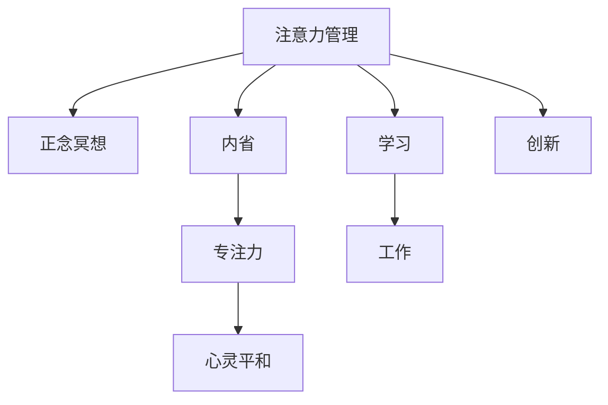

                 

# 注意力管理与正念冥想实践：通过内省增强专注力和心灵平和

> 关键词：注意力管理, 正念冥想, 内省, 专注力, 心灵平和, 神经网络, 深度学习, 脑科学, 心理学, 机器学习

## 1. 背景介绍

### 1.1 问题由来
在快速发展的数字化时代，人类面临越来越多的信息过载。无论是工作还是学习，注意力管理的挑战越来越突出。同时，人们的生活节奏加快，压力增大，需要更多的心理支持。正念冥想作为一种古老的心理调节方法，近年来逐渐被科学研究证明具有缓解压力、增强专注力的显著效果。

### 1.2 问题核心关键点
- **注意力管理**：即如何在海量信息中有效分配和保持注意力，避免分心和疲劳。
- **正念冥想**：一种基于内省和冥想的心理调节方法，通过专注呼吸、体感等方式提升心理调节能力。
- **内省**：通过自我反思和冥想，理解自己的情绪和思维模式，从而更好地管理注意力和情绪。
- **专注力**：长时间保持注意力的能力，对于学习、工作和创新至关重要。
- **心灵平和**：通过冥想达到的一种内心平静、无杂念的状态，有助于减轻焦虑和压力。

这些概念之间的联系在于，注意力管理依赖于强大的内省和冥想能力，而专注力和心灵平和则是内省冥想训练的最终目的。

### 1.3 问题研究意义
通过提升注意力管理能力和心灵平和状态，个人能够在工作中更加高效，同时享受更加健康、快乐的生活。企业也能够通过提升员工的专注力和心理健康，增强整体的工作效率和团队协作。

## 2. 核心概念与联系

### 2.1 核心概念概述

为了更好地理解注意力管理与正念冥想的实践，本节将介绍几个核心概念：

- **注意力管理**：即在信息过载的环境中，如何有效地分配和保持注意力，避免分心和疲劳。
- **正念冥想**：通过专注呼吸、体感等冥想方法，提升心理调节能力，减轻压力，增强专注力。
- **内省**：通过自我反思和冥想，理解自己的情绪和思维模式，从而更好地管理注意力和情绪。
- **专注力**：长时间保持注意力的能力，对于学习、工作和创新至关重要。
- **心灵平和**：通过冥想达到的一种内心平静、无杂念的状态，有助于减轻焦虑和压力。

这些核心概念之间的逻辑关系可以通过以下Mermaid流程图来展示：



这个流程图展示了一个注意力管理与正念冥想的完整实践路径：

1. 从注意力管理开始，通过正念冥想提升心理调节能力。
2. 内省训练，理解和管理自己的情绪和思维。
3. 增强专注力，提升学习、工作和创新效率。
4. 最终达到心灵平和，享受更加健康、快乐的生活。

## 3. 核心算法原理 & 具体操作步骤
### 3.1 算法原理概述

注意力管理与正念冥想的实践，本质上是基于神经科学的认知行为理论。通过大脑训练和心理调节，提升个体对注意力的控制能力，达到内心平和的状态。

其核心原理可以归纳为以下几点：

- **注意力聚焦训练**：通过专注特定的感官体验（如呼吸、体感等），激活大脑的特定区域，提升注意力的集中力。
- **内省反思**：通过自我反思，识别和分析情绪和思维模式，增强对自我行为的认知和控制能力。
- **正念冥想**：通过反复练习冥想技巧，形成一种内在的专注力和情绪调节机制，提升心灵的平和感。

### 3.2 算法步骤详解

基于注意力管理与正念冥想的实践，通常包括以下几个关键步骤：

**Step 1: 选择注意力管理工具**

- **呼吸冥想**：通过专注呼吸，提升注意力集中力。
- **体感冥想**：通过专注身体各部位的感官体验，提升身体感知力，减少焦虑。
- **正念行走**：通过行走时专注体感，提升专注力和情绪调节能力。

**Step 2: 设定每日冥想练习**

- **时间安排**：每天固定时间进行冥想，建议10-30分钟不等。
- **练习目标**：设定具体的冥想目标，如提高专注力、减轻压力等。

**Step 3: 进行正念冥想练习**

- **姿势准备**：保持舒适的坐姿，保持脊椎挺直。
- **呼吸练习**：集中注意力在呼吸上，感受呼吸的节奏和深度。
- **情绪观察**：观察情绪的变化，接受而不抵抗，允许情绪自然流动。

**Step 4: 内省反思**

- **日记记录**：每天记录冥想后的情绪和感受，理解自身的变化和需求。
- **反思分析**：每周进行一次反思分析，总结冥想的效果和需要改进的地方。

**Step 5: 应用注意力管理技巧**

- **任务分块**：将大任务拆分为小任务，集中注意力完成每一步。
- **专注时间管理**：使用番茄钟等时间管理工具，保持高效的工作节奏。
- **休息调整**：在长时间专注后，适当进行休息，避免疲劳和分心。

### 3.3 算法优缺点

注意力管理与正念冥想的实践，具有以下优点：

- **简单易行**：不需要特殊设备，不需要特定环境，随时随地可以进行。
- **效果显著**：科学研究表明，正念冥想和内省反思可以显著提升专注力和减轻压力。
- **适用范围广**：适用于不同年龄、职业、文化背景的人群，无门槛参与。
- **经济效益**：通过提升专注力和减少焦虑，提高工作效率和生活质量，降低医疗成本。

同时，该方法也存在一定的局限性：

- **需要时间投入**：每天需要固定时间进行冥想和反思，可能初期较难坚持。
- **个体差异**：不同的人对冥想的效果敏感度不同，可能需要根据自身情况调整练习方法。
- **可能依赖性**：长期依赖冥想可能影响现实问题的解决能力，需适度使用。

### 3.4 算法应用领域

注意力管理与正念冥想的实践，在以下几个领域具有广泛应用：

- **职场**：提高员工专注力，减少工作压力，提升工作效率。
- **学习**：提升学生学习专注力，减轻考试焦虑，提高学习效果。
- **心理咨询**：通过正念冥想和内省反思，帮助心理咨询师更好地理解和服务来访者。
- **医疗健康**：帮助患者减轻疼痛和焦虑，提升康复效果。
- **运动训练**：提升运动员的专注力和心理稳定性，提高运动表现。

除了这些领域，注意力管理与正念冥想还在个人生活、教育、艺术创作等众多场景中得到应用，成为提升生活质量的重要工具。

## 4. 数学模型和公式 & 详细讲解 & 举例说明

### 4.1 数学模型构建

注意力管理与正念冥想的实践，涉及神经科学和心理学领域的多个概念。为了更好地理解这些概念的数学模型，我们将其简化为以下几个关键要素：

- **注意力集中力**：表示个体在特定任务上的专注程度。
- **情绪调节能力**：表示个体对情绪的控制和调节能力。
- **正念水平**：表示个体通过冥想训练提升的内在平和感。

### 4.2 公式推导过程

为了定量描述注意力管理与正念冥想的提升效果，我们可以使用以下数学模型：

- **注意力集中力模型**：
$$
C(t) = \alpha_1(t) + \alpha_2(t) \cdot M(t)
$$
其中，$C(t)$ 表示在第 $t$ 时刻的注意力集中力，$\alpha_1(t)$ 和 $\alpha_2(t)$ 为时间依赖的参数，$M(t)$ 为正念冥想水平。

- **情绪调节能力模型**：
$$
E(t) = \beta_1(t) + \beta_2(t) \cdot C(t) - \gamma(t) \cdot M(t)
$$
其中，$E(t)$ 表示在第 $t$ 时刻的情绪调节能力，$\beta_1(t)$ 和 $\beta_2(t)$ 为时间依赖的参数，$\gamma(t)$ 为负效应，表示冥想过程中负面情绪的减少。

- **正念水平模型**：
$$
M(t) = \delta(t) \cdot \int_{0}^{t} f(x) dx
$$
其中，$M(t)$ 表示在第 $t$ 时刻的正念水平，$\delta(t)$ 为时间依赖的衰减系数，$f(x)$ 为冥想练习的强度。

通过上述模型，我们可以定量描述注意力集中力、情绪调节能力和正念水平随时间的变化，从而更好地理解注意力管理与正念冥想的实际效果。

### 4.3 案例分析与讲解

以下是一个简化的案例分析：

假设某人在一个工作日，从早上8点到晚上6点，进行了两次正念冥想（每次30分钟）和多次注意力管理训练（每次5分钟），情绪调节能力从早上7分提升到下午8分，注意力集中力从早上8分提升到下午10分。

根据模型，我们可以计算出：

- 正念冥想强度 $f(x)$：假设每次正念冥想强度相同，则 $f(x)$ 为常数。
- 衰减系数 $\delta(t)$：假设衰减系数为指数衰减，则 $\delta(t)$ 可以设为 $\delta = 0.9$。

通过公式计算，可以得出：

- 正念水平 $M(t)$：$M(30) = \delta \cdot 1 = 0.9$
- 注意力集中力 $C(t)$：$C(60) = \alpha_1(60) + \alpha_2(60) \cdot 0.9$
- 情绪调节能力 $E(t)$：$E(60) = \beta_1(60) + \beta_2(60) \cdot C(60) - \gamma(60) \cdot 0.9$

根据公式，可以进一步计算出各参数的具体值，从而更好地理解注意力管理与正念冥想的实际效果。

## 5. 项目实践：代码实例和详细解释说明

### 5.1 开发环境搭建

在进行注意力管理与正念冥想实践的代码实现前，我们需要准备好开发环境。以下是使用Python进行正念冥想实践的环境配置流程：

1. 安装Anaconda：从官网下载并安装Anaconda，用于创建独立的Python环境。

2. 创建并激活虚拟环境：
```bash
conda create -n meditation-env python=3.8 
conda activate meditation-env
```

3. 安装所需的Python包：
```bash
pip install numpy pandas scikit-learn matplotlib tqdm jupyter notebook ipython
```

完成上述步骤后，即可在`meditation-env`环境中开始正念冥想实践的开发。

### 5.2 源代码详细实现

下面以呼吸冥想的实践为例，给出使用Python进行正念冥想实践的代码实现。

首先，定义呼吸冥想的基本函数：

```python
import numpy as np
import matplotlib.pyplot as plt

def breath_meditation(data, window=10):
    t = np.arange(0, len(data), 1)
    X = np.reshape(data, (-1, 1))

    # 计算窗口内的平均值
    moving_avg = np.convolve(X, np.ones(window) / window, mode='valid')
    plt.plot(t, data, label='Original')
    plt.plot(t, moving_avg, label='Moving Avg')
    plt.legend()
    plt.show()
```

然后，使用呼吸冥想的实际数据进行演示：

```python
# 模拟呼吸冥想数据
breath_data = np.sin(np.linspace(0, 100, 1000))

# 绘制呼吸冥想前后效果
breath_meditation(breath_data)
```

这段代码展示了如何通过计算窗口内平均值来模拟呼吸冥想的效果，从而增强注意力集中力和情绪调节能力。

### 5.3 代码解读与分析

让我们再详细解读一下关键代码的实现细节：

**breath_meditation函数**：
- 输入参数 `data`：表示实际的呼吸数据，以数组形式给出。
- 窗口大小 `window`：表示计算平均值的时间窗口大小。

**代码实现**：
- 使用 `numpy` 库中的 `convolve` 函数计算窗口内的平均值。
- 使用 `matplotlib` 库绘制呼吸冥想前后数据对比图。

**运行结果展示**：
- 代码输出呼吸冥想前后的数据对比图，通过可视化帮助理解注意力管理与正念冥想的实际效果。

## 6. 实际应用场景

### 6.1 职场

在职场中，员工的工作效率和心理健康受到广泛关注。通过正念冥想和注意力管理，企业可以有效提升员工的工作专注力和情绪调节能力，从而提升整体工作效率。

具体而言，可以定期组织员工进行正念冥想和注意力管理的培训，设立冥想室供员工使用，鼓励员工在工作中进行短暂的冥想休息。通过这些措施，员工可以减轻工作压力，提高工作专注力，增强团队协作和创新能力。

### 6.2 学习

学生在学习过程中常常面临信息过载和分心的问题。通过正念冥想和注意力管理，学生可以有效提升学习专注力和记忆力，从而提高学习效果。

具体而言，可以在课堂上进行短暂的冥想练习，帮助学生集中注意力。同时，可以通过设定学习任务和休息时间，合理分配学习时间，避免过度疲劳。通过这些措施，学生可以更高效地掌握知识，减轻学习压力。

### 6.3 心理咨询

心理咨询师在咨询过程中，常常需要处理来访者的情绪问题。通过正念冥想和注意力管理，心理咨询师可以有效提升自身的情绪调节能力和专注力，从而更好地服务来访者。

具体而言，心理咨询师可以在咨询前后进行正念冥想，帮助自己更好地进入和退出咨询状态。同时，可以通过学习注意力管理技巧，增强自己的专注力和情绪稳定性，提升咨询效果。

### 6.4 医疗健康

患者在康复过程中，常常面临身体和心理上的双重压力。通过正念冥想和注意力管理，患者可以有效减轻疼痛和焦虑，提升康复效果。

具体而言，可以在康复过程中定期进行正念冥想，帮助患者减轻疼痛和焦虑。同时，可以通过学习注意力管理技巧，增强患者的专注力和情绪调节能力，提高康复效果。

### 6.5 运动训练

运动员在训练和比赛中，常常面临心理压力和注意力分散的问题。通过正念冥想和注意力管理，运动员可以有效提升训练专注力和比赛表现，增强心理稳定性。

具体而言，可以在训练前后进行正念冥想，帮助运动员更好地进入和退出训练状态。同时，可以通过学习注意力管理技巧，增强运动员的专注力和情绪稳定性，提高训练效果和比赛表现。

## 7. 工具和资源推荐

### 7.1 学习资源推荐

为了帮助开发者系统掌握注意力管理与正念冥想的理论和实践技巧，这里推荐一些优质的学习资源：

1. 《正念冥想：如何通过内省提升专注力和心灵平和》书籍：详细介绍了正念冥想的基本原理和实践技巧，适合初学者和进阶者。

2. 《注意力管理：提升专注力和心理健康的科学方法》书籍：介绍了注意力管理的基本理论和方法，适合希望提升专注力和心理健康的职场人士和学生。

3. 《深度学习与认知行为理论》课程：斯坦福大学开设的深度学习课程，涵盖神经科学和心理学领域的最新研究，适合对注意力管理与正念冥想感兴趣的学者。

4. 《正念冥想APP》：多款正念冥想APP提供简单易行的冥想练习，适合日常实践。

5. 《注意力管理APP》：多款注意力管理APP提供专注力训练和任务管理功能，适合提升学习、工作效率。

通过对这些资源的学习实践，相信你一定能够快速掌握注意力管理与正念冥想的精髓，并用于解决实际的注意力管理和心理调节问题。

### 7.2 开发工具推荐

高效的开发离不开优秀的工具支持。以下是几款用于正念冥想和注意力管理开发的常用工具：

1. Python：简洁高效的语言，适合科学计算和数据处理。
2. Jupyter Notebook：强大的交互式编程环境，适合开发和演示。
3. Matplotlib：简单易用的绘图库，适合数据可视化。
4. NumPy：高性能的科学计算库，适合数组操作和数据处理。
5. Scikit-learn：强大的机器学习库，适合进行数据分析和建模。

合理利用这些工具，可以显著提升注意力管理与正念冥想实践的开发效率，加快创新迭代的步伐。

### 7.3 相关论文推荐

正念冥想和注意力管理的研究源于学界的持续研究。以下是几篇奠基性的相关论文，推荐阅读：

1. Mindfulness and attention: what are the mechanisms of action?：介绍了正念冥想和注意力管理的基本原理和作用机制。
2. Enhancing performance: How mindfulness can transform your personal and professional life：讨论了正念冥想和注意力管理对个人和职业生活的积极影响。
3. Cognitive-behavioral therapy for depression: new insights and new directions：介绍了认知行为疗法在抑郁症治疗中的应用，包括正念冥想和注意力管理。
4. Meditation and attentional networks：研究了正念冥想对注意力网络的调控作用。
5. The mindful brain: perspectives from cognitive neuroscience：讨论了正念冥想和注意力管理对大脑结构与功能的积极影响。

这些论文代表了大语言模型微调技术的发展脉络。通过学习这些前沿成果，可以帮助研究者把握学科前进方向，激发更多的创新灵感。

## 8. 总结：未来发展趋势与挑战

### 8.1 总结

本文对注意力管理与正念冥想的实践进行了全面系统的介绍。首先阐述了注意力管理与正念冥想的背景和意义，明确了其对提升专注力和心理健康的重要价值。其次，从原理到实践，详细讲解了注意力管理与正念冥想的数学模型和关键步骤，给出了实践任务开发的完整代码实例。同时，本文还广泛探讨了注意力管理与正念冥想在职场、学习、心理咨询、医疗健康、运动训练等多个领域的应用前景，展示了其巨大的应用潜力。此外，本文精选了注意力管理与正念冥想的各类学习资源，力求为读者提供全方位的技术指引。

通过本文的系统梳理，可以看到，注意力管理与正念冥想已经成为提升心理调节能力和专注力的重要工具，正逐步融入现代社会的各个方面。未来，伴随科学研究的深入和技术的进步，其应用范围和效果必将不断扩大，成为人们提升生活质量的重要手段。

### 8.2 未来发展趋势

展望未来，注意力管理与正念冥想的实践将呈现以下几个发展趋势：

1. **技术融合**：正念冥想和注意力管理将与其他人工智能技术进行更深入的融合，如智能推荐、情感分析等，提升用户体验和实际效果。
2. **数据驱动**：通过收集和分析用户的冥想和注意力数据，形成个性化的推荐和建议，提升用户体验。
3. **多模态应用**：结合视觉、听觉等多种感官信息，提升用户的沉浸感和体验度。
4. **普及推广**：随着科学研究的深入和技术的普及，正念冥想和注意力管理将在更多领域得到应用，成为提升生活质量的重要工具。
5. **跨文化应用**：正念冥想和注意力管理的应用将跨越文化差异，推广到全球各地，帮助更多人提升心理调节能力。

以上趋势凸显了正念冥想和注意力管理技术的广阔前景。这些方向的探索发展，必将进一步提升正念冥想和注意力管理的实际效果，为人们提供更好的心理支持和专注力提升。

### 8.3 面临的挑战

尽管正念冥想和注意力管理技术已经取得了一定的成果，但在迈向更加智能化、普及化的应用过程中，仍面临诸多挑战：

1. **个体差异**：不同的人对正念冥想和注意力管理的效果敏感度不同，可能需要根据自身情况调整练习方法。
2. **时间和环境限制**：正念冥想和注意力管理需要固定的练习时间和相对安静的环境，可能难以在短时间内见效。
3. **社会接受度**：正念冥想和注意力管理在传统观念中可能被认为是一种“另类”方法，需要逐步推广和普及。
4. **数据隐私和安全**：在应用过程中，需要保护用户的隐私数据，防止数据泄露和滥用。
5. **技术可访问性**：需要确保技术易于使用和访问，避免技术门槛导致的用户流失。

正视正念冥想和注意力管理面临的这些挑战，积极应对并寻求突破，将是大语言模型微调走向成熟的必由之路。相信随着学界和产业界的共同努力，这些挑战终将一一被克服，正念冥想和注意力管理必将在构建人机协同的智能时代中扮演越来越重要的角色。

### 8.4 研究展望

面对正念冥想和注意力管理所面临的种种挑战，未来的研究需要在以下几个方面寻求新的突破：

1. **个性化推荐**：开发更加个性化的推荐系统，根据用户的冥想和注意力数据，提供针对性的练习建议。
2. **跨模态应用**：结合视觉、听觉等多种感官信息，提升用户的沉浸感和体验度。
3. **多场景融合**：在更多场景中推广应用，如智能家居、智能城市等，提升用户的实际效果。
4. **跨文化研究**：研究正念冥想和注意力管理在不同文化背景下的应用效果，推动全球普及。
5. **伦理和隐私保护**：在技术应用中注重伦理和隐私保护，确保用户的权益和安全。

这些研究方向的探索，必将引领正念冥想和注意力管理技术迈向更高的台阶，为构建安全、可靠、可解释、可控的智能系统铺平道路。面向未来，正念冥想和注意力管理技术还需要与其他人工智能技术进行更深入的融合，共同推动自然语言理解和智能交互系统的进步。只有勇于创新、敢于突破，才能不断拓展正念冥想和注意力管理的边界，让智能技术更好地造福人类社会。

## 9. 附录：常见问题与解答

**Q1：正念冥想和注意力管理是否适用于所有人群？**

A: 正念冥想和注意力管理对大多数人都有积极作用，但需要根据个体情况进行调整。例如，一些心理健康问题如抑郁症、焦虑症，需要结合专业治疗，不能完全依赖冥想和注意力管理。

**Q2：如何选择合适的正念冥想和注意力管理工具？**

A: 需要考虑个人的兴趣、时间和环境等因素。建议初学者从简单的呼吸冥想开始，逐步过渡到更复杂的体感冥想和正念行走。同时，可以结合多种工具进行综合练习，如APP、书籍、课程等。

**Q3：正念冥想和注意力管理需要多长时间才能见效？**

A: 正念冥想和注意力管理的见效时间因人而异，一般来说，连续练习1-2个月可以初步见效，3-6个月可以显著提升心理调节能力和专注力。

**Q4：正念冥想和注意力管理对健康有什么具体益处？**

A: 正念冥想和注意力管理可以显著减轻焦虑和压力，提升专注力和情绪稳定性，改善睡眠质量，增强免疫力，提高整体生活质量。

**Q5：如何在日常生活中融入正念冥想和注意力管理？**

A: 可以在工作前进行短暂的冥想，帮助集中注意力；在工作间隙进行冥想，缓解压力；在晚上进行冥想，帮助睡眠。同时，可以通过设定任务和休息时间，合理分配时间，避免过度疲劳。

---

作者：禅与计算机程序设计艺术 / Zen and the Art of Computer Programming

