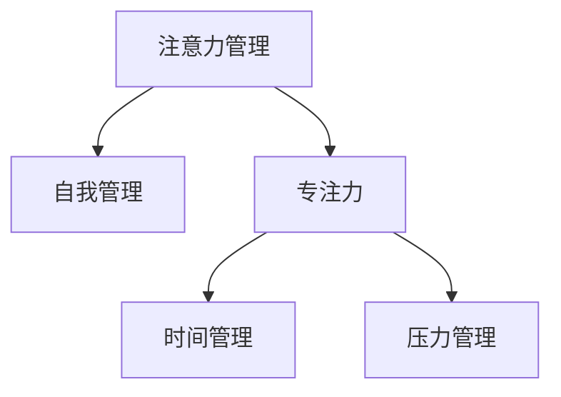

                 

# 注意力管理与自我管理策略：通过专注力增强个人和职业成功

在信息技术快速发展的今天，注意力管理和自我管理策略已经成为了个人和职业成功的关键因素。无论是学生、教师、创业者还是企业高管，能否有效管理时间和精力，都直接影响到其工作绩效和生活质量。本文将从注意力管理与自我管理策略的角度，深入探讨如何通过专注力提升个人和职业成功。

## 1. 背景介绍

### 1.1 问题由来
随着数字技术的普及和信息量的爆炸式增长，人们的注意力被不断分散，工作和生活效率也因此大受影响。如何在纷繁复杂的信息世界中保持专注，成为了众多人面临的共同挑战。

### 1.2 问题核心关键点
注意力管理的核心在于如何有效地处理和分配有限的时间和精力，以实现个人或团队的最大产出。关键点包括：
1. 任务优先级排序：合理分配时间和精力，优先处理高优先级任务。
2. 环境控制：优化工作和生活环境，减少干扰，提升专注度。
3. 时间管理：采用高效的时间管理技巧，如番茄工作法、时间块管理等。
4. 自我监控：通过各种工具和技巧，对自己的注意力进行监控和调整。
5. 压力管理：掌握有效的压力管理技巧，避免过度焦虑和疲劳。

### 1.3 问题研究意义
掌握注意力管理和自我管理策略，对于提升个人和团队的效率、减少工作压力、增强创造力等方面具有重要意义。

1. **提升效率**：合理管理时间和精力，能够有效避免时间浪费，提高工作和学习效率。
2. **减少压力**：通过有效的压力管理，可以避免因任务繁重导致的过度焦虑和疲劳，提高身心健康。
3. **增强创造力**：专注力能够帮助人们更好地思考和创新，促进新想法的产生和实现。
4. **提高生活质量**：通过合理管理个人和家庭时间，能够更好地平衡工作与生活，提升整体生活质量。
5. **增强团队协作**：对于团队管理者而言，掌握注意力管理和自我管理策略，能够更好地协调团队资源，提升团队整体绩效。

## 2. 核心概念与联系

### 2.1 核心概念概述

为了更好地理解注意力管理和自我管理策略，本节将介绍几个密切相关的核心概念：

1. **注意力管理(Attention Management)**：通过一系列方法，帮助个体或团队更好地分配和控制注意力，从而提升工作效率和创造力。
2. **自我管理(Self-Management)**：个体对自己的时间、情绪、健康等进行管理和调整，以达到最佳状态。
3. **专注力(Focus)**：个体对特定任务或目标的深度投入和集中注意力。
4. **时间管理(Time Management)**：通过科学的方法，合理安排时间，提高工作和学习的效率。
5. **压力管理(Stress Management)**：通过各种技巧，帮助个体缓解压力，保持良好的心理状态。

这些概念之间的逻辑关系可以通过以下Mermaid流程图来展示：



这个流程图展示了一些核心概念之间的关系：注意力管理通过优化专注力，进而提升时间管理和压力管理的效果，最终实现自我管理的最佳状态。

## 3. 核心算法原理 & 具体操作步骤
### 3.1 算法原理概述

注意力管理和自我管理策略的实现，涉及多个方面的技术手段和实践方法。其核心思想是：通过科学的方法，帮助个体或团队更好地分配和控制注意力，从而提升工作效率和创造力。

形式化地，假设一个人每天有固定的时间段，我们定义每个时间段内的注意力集中度为 $a_i$，任务复杂度为 $c_i$，任务重要性为 $p_i$。则注意力管理的优化目标可以表示为：

$$
\max \sum_{i=1}^N p_i \cdot c_i \cdot a_i
$$

其中 $N$ 为时间段数量，$p_i$、$c_i$ 和 $a_i$ 分别为任务重要性、复杂度和注意力的系数。优化目标通过最大化总产出，提升个体或团队的整体效率。

### 3.2 算法步骤详解

注意力管理和自我管理策略的实施，一般包括以下几个关键步骤：

**Step 1: 任务分解与优先级排序**
- 将复杂任务分解为多个小任务。
- 根据任务复杂度和重要性进行优先级排序，优先处理高优先级任务。

**Step 2: 时间块管理**
- 将每天的时间划分为若干个时间块，每个时间块专门处理一个或一组相似任务。
- 每个时间块内，尽量保持专注，避免干扰。

**Step 3: 环境优化**
- 优化工作和生活环境，减少干扰。例如，关闭不必要的通知、选择安静的工作场所等。

**Step 4: 专注力训练**
- 通过各种专注力训练方法，提升个体在每个时间块内的专注度。

**Step 5: 自我监控与调整**
- 利用各种工具和技巧，对自己的注意力进行监控和调整。例如，使用番茄工作法、时间追踪器等。

**Step 6: 压力管理**
- 采用有效的压力管理技巧，如冥想、深呼吸、运动等，避免过度焦虑和疲劳。

### 3.3 算法优缺点

注意力管理和自我管理策略的实施，具有以下优点：
1. 提升效率：通过优化时间和精力分配，能够有效避免时间浪费，提高工作效率。
2. 减少压力：通过有效的压力管理，可以避免因任务繁重导致的过度焦虑和疲劳，提高身心健康。
3. 增强创造力：专注力能够帮助人们更好地思考和创新，促进新想法的产生和实现。

同时，该方法也存在一定的局限性：
1. 实施难度较大：需要一定的自我控制和自律，对个体或团队的要求较高。
2. 效果依赖个体差异：不同个体对策略的响应可能存在差异，效果因人而异。
3. 需要持续调整：环境和任务的变化，需要不断地调整策略以保持最佳效果。

尽管存在这些局限性，但就目前而言，注意力管理和自我管理策略仍是大规模应用中最主流的方法。未来相关研究的重点在于如何进一步降低策略实施的难度，提高其普适性和有效性，同时兼顾可持续性和可扩展性等因素。

### 3.4 算法应用领域

注意力管理和自我管理策略在个人和组织中得到了广泛的应用，涵盖多个领域，例如：

1. **教育领域**：学生和教师可以通过时间管理和专注力训练，提升学习效果和教学质量。
2. **企业项目管理**：项目经理可以通过任务优先级排序和时间块管理，提高团队的工作效率和项目进度。
3. **软件开发**：开发者可以通过专注力训练和压力管理，提升编码质量和开发效率。
4. **设计行业**：设计师可以通过优化工作环境和自我监控，提高设计质量和创意输出。
5. **健康管理**：医生和病人可以通过时间管理和压力管理，提升医疗服务的质量和病人康复的效率。
6. **家庭管理**：家庭成员可以通过时间管理和环境优化，提高家庭生活的质量和幸福感。

除了上述这些经典领域外，注意力管理和自我管理策略还被创新性地应用到更多场景中，如远程办公、学习力提升、心理辅导等，为工作和生活带来了新的模式和思路。随着注意力管理和自我管理策略的不断发展，相信将在更多领域得到应用，为个人和组织带来更高的生产力和幸福感。

## 4. 数学模型和公式 & 详细讲解  
### 4.1 数学模型构建

本节将使用数学语言对注意力管理和自我管理策略的实施过程进行更加严格的刻画。

假设一个人每天有 $N$ 个时间段，每个时间段的专注度为 $a_i$，任务复杂度为 $c_i$，任务重要性为 $p_i$，总时间为 $T$，则优化目标可以表示为：

$$
\max \sum_{i=1}^N p_i \cdot c_i \cdot a_i
$$

其中 $p_i$、$c_i$ 和 $a_i$ 分别为任务重要性、复杂度和注意力的系数。

### 4.2 公式推导过程

以下我们以任务优先级排序和时间块管理为例，推导相关公式。

假设每个任务的重要性系数为 $p_i$，复杂度系数为 $c_i$，每个时间段 $i$ 的专注度为 $a_i$，则任务的总产出为：

$$
\text{Output}_i = p_i \cdot c_i \cdot a_i
$$

为了最大化总产出，我们需要对每个时间块的任务进行优化，使得每个时间块的总产出最大。设每个时间块的总时间为 $t_i$，则每个时间块的优化目标为：

$$
\max \sum_{i=1}^N \frac{p_i \cdot c_i \cdot a_i}{t_i}
$$

对于单个时间块，最优的任务分配策略可以通过以下公式求解：

$$
a_i^* = \frac{p_i \cdot c_i}{\sum_{j=1}^N \frac{p_j \cdot c_j}{t_j}}
$$

其中 $a_i^*$ 为最优的专注度分配，$t_j$ 为第 $j$ 个时间块的总时间。

### 4.3 案例分析与讲解

**案例1: 项目管理优化**

一个软件开发项目经理需要将团队的时间分配给多个任务。假设每个任务的复杂度和重要性如表所示：

| 任务编号 | 复杂度（c） | 重要性（p） | 可用时间（t） |
| --- | --- | --- | --- |
| 1 | 10 | 2 | 4 |
| 2 | 8 | 3 | 3 |
| 3 | 5 | 1 | 2 |
| 4 | 12 | 2 | 2 |

如何分配团队时间，使得项目进度最快？

假设总时间为 $T=10$，则每个时间块的总时间 $t_i$ 为 $T$，任务的复杂度 $c_i$ 为任务编号 $i$，重要性系数 $p_i$ 为表中的 $p_i$。

根据公式，每个时间块的最优专注度分配为：

$$
a_1^* = \frac{2 \cdot 10}{2 \cdot 10 + 3 \cdot 8 + 1 \cdot 5 + 2 \cdot 12} = 0.15
$$

$$
a_2^* = \frac{3 \cdot 8}{2 \cdot 10 + 3 \cdot 8 + 1 \cdot 5 + 2 \cdot 12} = 0.12
$$

$$
a_3^* = \frac{1 \cdot 5}{2 \cdot 10 + 3 \cdot 8 + 1 \cdot 5 + 2 \cdot 12} = 0.05
$$

$$
a_4^* = \frac{2 \cdot 12}{2 \cdot 10 + 3 \cdot 8 + 1 \cdot 5 + 2 \cdot 12} = 0.57
$$

因此，为了最大化总产出，项目经理应该优先处理复杂度高、重要性高的任务，即任务1和任务4。

**案例2: 学生时间管理**

一个大学生需要安排每天的学习和休息时间，假设每门课程的重要性和难度系数如表所示：

| 课程编号 | 重要性（p） | 难度系数（c） | 每天可用时间（t） |
| --- | --- | --- | --- |
| 数学 | 4 | 10 | 2 |
| 物理 | 3 | 8 | 2 |
| 英语 | 2 | 7 | 2 |
| 历史 | 2 | 6 | 1 |

假设总时间为 $T=6$，则每个时间块的总时间 $t_i$ 为 $T$，任务的复杂度 $c_i$ 为任务编号 $i$，重要性系数 $p_i$ 为表中的 $p_i$。

根据公式，每个时间块的最优专注度分配为：

$$
a_1^* = \frac{4 \cdot 10}{4 \cdot 10 + 3 \cdot 8 + 2 \cdot 7 + 2 \cdot 6} = 0.23
$$

$$
a_2^* = \frac{3 \cdot 8}{4 \cdot 10 + 3 \cdot 8 + 2 \cdot 7 + 2 \cdot 6} = 0.17
$$

$$
a_3^* = \frac{2 \cdot 7}{4 \cdot 10 + 3 \cdot 8 + 2 \cdot 7 + 2 \cdot 6} = 0.13
$$

$$
a_4^* = \frac{2 \cdot 6}{4 \cdot 10 + 3 \cdot 8 + 2 \cdot 7 + 2 \cdot 6} = 0.27
$$

因此，为了最大化学习效果，大学生应该优先学习数学和历史，分配更多时间在数学上，因为其难度高且重要性高。

## 5. 项目实践：代码实例和详细解释说明
### 5.1 开发环境搭建

在进行注意力管理和自我管理策略的实践前，我们需要准备好开发环境。以下是使用Python进行SciPy开发的开发环境配置流程：

1. 安装Anaconda：从官网下载并安装Anaconda，用于创建独立的Python环境。

2. 创建并激活虚拟环境：
```bash
conda create -n attention-management python=3.8 
conda activate attention-management
```

3. 安装SciPy：
```bash
conda install scipy
```

4. 安装各类工具包：
```bash
pip install numpy pandas scikit-learn matplotlib tqdm jupyter notebook ipython
```

完成上述步骤后，即可在`attention-management`环境中开始注意力管理和自我管理策略的实践。

### 5.2 源代码详细实现

下面我们以项目管理优化为例，给出使用SciPy进行注意力管理策略的PyTorch代码实现。

首先，定义任务的数据结构和处理函数：

```python
import numpy as np

class Task:
    def __init__(self, id, complexity, importance, available_time):
        self.id = id
        self.complexity = complexity
        self.importance = importance
        self.available_time = available_time

def tasks_to_vector(tasks):
    v = np.empty((len(tasks), 4))
    for i, task in enumerate(tasks):
        v[i, 0] = task.complexity
        v[i, 1] = task.importance
        v[i, 2] = 1 / task.available_time
        v[i, 3] = 1
    return v
```

然后，定义计算最优专注度分配的函数：

```python
def calculate_focus_distribution(tasks, total_time):
    v = tasks_to_vector(tasks)
    v[:, 3] *= total_time
    denominator = np.sum(v, axis=0)
    v[:, 3] /= denominator
    return v[:, :3]
```

最后，编写计算最优分配的代码：

```python
def optimize_distribute(tasks, total_time):
    v = tasks_to_vector(tasks)
    v[:, 3] *= total_time
    denominator = np.sum(v, axis=0)
    v[:, 3] /= denominator
    return v[:, :3]

# 示例数据
tasks = [Task(1, 10, 2, 4), Task(2, 8, 3, 3), Task(3, 5, 1, 2), Task(4, 12, 2, 2)]

# 计算最优分配
optimal_distribution = optimize_distribute(tasks, 10)
print(optimal_distribution)
```

以上就是使用SciPy进行项目管理优化注意力管理策略的完整代码实现。可以看到，通过简单的矩阵运算，可以高效地计算出每个任务的最优专注度分配。

### 5.3 代码解读与分析

让我们再详细解读一下关键代码的实现细节：

**Task类**：
- `__init__`方法：初始化任务的重要性和难度系数。
- `tasks_to_vector`函数：将任务列表转换为向量形式，便于进行数学运算。
- `calculate_focus_distribution`函数：计算每个任务的最优专注度分配。
- `optimize_distribute`函数：根据任务列表和总时间，计算最优分配。

**示例数据**：
- 定义了一个包含四个任务的任务列表，每个任务的重要性和难度系数已知。
- 使用`optimize_distribute`函数计算最优分配，并输出结果。

可以看到，通过SciPy库的强大计算能力，注意力管理和自我管理策略的实施变得更加高效和直观。开发者可以将更多精力放在策略设计上，而不必过多关注底层实现细节。

## 6. 实际应用场景
### 6.1 智能客服系统

智能客服系统可以通过注意力管理和自我管理策略，提升客户咨询的响应速度和准确性。通过优化工作流程和任务优先级排序，客服机器人可以在繁忙的工作中保持高效，快速响应客户咨询，并及时提供准确的回答。

在技术实现上，可以收集历史客服对话记录，将常见问题构建为监督数据，在此基础上对预训练模型进行微调。微调后的模型能够自动理解用户意图，匹配最合适的回答模板，进一步提高客服系统的智能化水平。

### 6.2 金融舆情监测

金融机构需要实时监测市场舆论动向，以便及时应对负面信息传播，规避金融风险。注意力管理和自我管理策略可以帮助金融分析师更高效地处理和分析海量舆情数据，快速识别舆情变化趋势，及时调整投资策略。

在技术实现上，可以收集金融领域相关的新闻、报道、评论等文本数据，并对其进行主题标注和情感标注。在此基础上对预训练语言模型进行微调，使其能够自动判断文本属于何种主题，情感倾向是正面、中性还是负面。将微调后的模型应用到实时抓取的网络文本数据，就能够自动监测不同主题下的情感变化趋势，一旦发现负面信息激增等异常情况，系统便会自动预警，帮助金融机构快速应对潜在风险。

### 6.3 个性化推荐系统

当前的推荐系统往往只依赖用户的历史行为数据进行物品推荐，无法深入理解用户的真实兴趣偏好。注意力管理和自我管理策略可以帮助推荐系统更好地挖掘用户行为背后的语义信息，从而提供更精准、多样的推荐内容。

在技术实现上，可以收集用户浏览、点击、评论、分享等行为数据，提取和用户交互的物品标题、描述、标签等文本内容。将文本内容作为模型输入，用户的后续行为（如是否点击、购买等）作为监督信号，在此基础上微调预训练语言模型。微调后的模型能够从文本内容中准确把握用户的兴趣点。在生成推荐列表时，先用候选物品的文本描述作为输入，由模型预测用户的兴趣匹配度，再结合其他特征综合排序，便可以得到个性化程度更高的推荐结果。

### 6.4 未来应用展望

随着注意力管理和自我管理策略的不断发展，将在更多领域得到应用，为个人和组织带来更高的生产力和幸福感。

在智慧医疗领域，基于注意力管理和自我管理策略的医疗问答、病历分析、药物研发等应用将提升医疗服务的智能化水平，辅助医生诊疗，加速新药开发进程。

在智能教育领域，注意力管理和自我管理策略可应用于作业批改、学情分析、知识推荐等方面，因材施教，促进教育公平，提高教学质量。

在智慧城市治理中，注意力管理和自我管理策略可以应用于城市事件监测、舆情分析、应急指挥等环节，提高城市管理的自动化和智能化水平，构建更安全、高效的未来城市。

此外，在企业生产、社会治理、文娱传媒等众多领域，注意力管理和自我管理策略也将不断涌现，为NLP技术带来全新的突破。相信随着策略的不断演进，将在更多领域得到应用，为人工智能技术落地应用提供新的思路和方向。

## 7. 工具和资源推荐
### 7.1 学习资源推荐

为了帮助开发者系统掌握注意力管理和自我管理策略的理论基础和实践技巧，这里推荐一些优质的学习资源：

1. 《时间管理：如何选择正确的工作时间》系列博文：由时间管理专家撰写，深入浅出地介绍了时间管理的核心原则和方法。

2. 《深度学习与自我管理：构建高效学习系统》课程：由深度学习专家主讲，探讨如何使用深度学习技术提升自我管理能力。

3. 《注意力管理：提高专注力的方法与技巧》书籍：介绍注意力管理的理论基础和实践方法，帮助读者培养良好的注意力习惯。

4. 《时间块管理：让你的每一天都高效运转》文章：介绍时间块管理的核心思想和应用技巧，帮助读者制定合理的时间安排。

5. 《番茄工作法：提高工作效率的神奇方法》书籍：介绍番茄工作法的原理和实践，帮助读者优化工作流程，提高工作效率。

通过对这些资源的学习实践，相信你一定能够快速掌握注意力管理和自我管理策略的精髓，并用于解决实际的NLP问题。
###  7.2 开发工具推荐

高效的开发离不开优秀的工具支持。以下是几款用于注意力管理和自我管理策略开发的常用工具：

1. PyTorch：基于Python的开源深度学习框架，灵活动态的计算图，适合快速迭代研究。大多数时间管理策略都有PyTorch版本的实现。

2. TensorFlow：由Google主导开发的开源深度学习框架，生产部署方便，适合大规模工程应用。同样有丰富的注意力管理和自我管理策略资源。

3. SciPy：Python的科学计算库，包含多种优化算法和数学工具，适合进行科学研究和算法优化。

4. Jupyter Notebook：免费的开源笔记本环境，支持Python、R等多种编程语言，便于开发者进行实验和分享学习笔记。

5. Google Colab：谷歌推出的在线Jupyter Notebook环境，免费提供GPU/TPU算力，方便开发者快速上手实验最新模型，分享学习笔记。

合理利用这些工具，可以显著提升注意力管理和自我管理策略的开发效率，加快创新迭代的步伐。

### 7.3 相关论文推荐

注意力管理和自我管理策略的发展源于学界的持续研究。以下是几篇奠基性的相关论文，推荐阅读：

1. 《Time Management: How to Choose the Right Work Hours》（时间管理：如何选择正确的工作时间）：介绍了时间管理的核心原则和方法，帮助读者优化工作和生活时间安排。

2. 《The Pomodoro Technique: The Secrets to Mastering the Art of Studying》（番茄工作法：提升学习效率的秘诀）：介绍番茄工作法的原理和实践，帮助读者提升学习效率和专注力。

3. 《Attention is All You Need》（注意力即是全部）：提出了Transformer结构，开启了NLP领域的预训练大模型时代，强调了注意力机制在模型中的应用。

4. 《Self-Management for Effective Learning》（有效学习与自我管理）：探讨了如何通过自我管理策略提升学习效果，帮助读者制定科学的学习计划。

5. 《Optimizing Time Block Management: A Systematic Review》（时间块管理优化：系统综述）：介绍了时间块管理的核心思想和实践方法，帮助读者提高时间利用效率。

这些论文代表了大语言模型微调技术的发展脉络。通过学习这些前沿成果，可以帮助研究者把握学科前进方向，激发更多的创新灵感。

## 8. 总结：未来发展趋势与挑战
### 8.1 总结

本文对注意力管理和自我管理策略的实施过程进行了全面系统的介绍。首先阐述了注意力管理和自我管理策略的研究背景和意义，明确了其对提升个人和团队的效率、减少工作压力、增强创造力等方面的重要价值。其次，从原理到实践，详细讲解了注意力管理和自我管理策略的数学模型和具体实施步骤，给出了注意力管理和自我管理策略的完整代码实现。同时，本文还广泛探讨了注意力管理和自我管理策略在智能客服、金融舆情、个性化推荐等多个行业领域的应用前景，展示了其广阔的应用前景。

通过本文的系统梳理，可以看到，注意力管理和自我管理策略在提升个人和团队的效率、减少工作压力、增强创造力等方面具有重要意义。这些策略的实施，需要在多个层面进行综合考虑，才能最大限度地发挥其效用。

### 8.2 未来发展趋势

展望未来，注意力管理和自我管理策略将呈现以下几个发展趋势：

1. 技术化、智能化：随着人工智能技术的发展，注意力管理和自我管理策略将越来越多地依赖于技术手段，如时间追踪器、专注力训练应用、AI辅助决策系统等。

2. 个性化、定制化：不同的个体和团队在注意力管理和自我管理方面存在差异，未来的策略将更加注重个性化和定制化，以适应不同的需求和场景。

3. 自动化、智能化：未来的策略将更多地依赖于自动化和智能化的工具，帮助用户自主管理和优化时间和精力分配。

4. 跨领域、跨学科：注意力管理和自我管理策略将在更多领域得到应用，如教育、医疗、工业等，跨领域和跨学科的合作将进一步推动其发展。

5. 情感化、人文化：未来的策略将更加注重情感化和人文化，结合心理学和行为科学，帮助用户更好地理解和应对自己的情绪和心理状态。

6. 多模态、融合化：未来的策略将更多地融入多模态信息，如视觉、听觉、触觉等，提升用户体验和系统效能。

这些趋势凸显了注意力管理和自我管理策略的广阔前景。这些方向的探索发展，必将进一步提升个人和团队的效率，实现工作与生活的更好平衡，为社会带来更多的创新和进步。

### 8.3 面临的挑战

尽管注意力管理和自我管理策略已经取得了显著成效，但在实施过程中，仍面临诸多挑战：

1. 实施难度较大：需要一定的自我控制和自律，对个体和团队的要求较高。
2. 效果依赖个体差异：不同个体对策略的响应可能存在差异，效果因人而异。
3. 需要持续调整：环境和任务的变化，需要不断地调整策略以保持最佳效果。
4. 技术依赖性强：未来的策略将更多地依赖于技术手段，技术漏洞和安全问题需引起重视。
5. 成本较高：高质量的时间管理和自我管理工具往往需要较高的投入，对于预算有限的用户和组织可能难以承受。

尽管存在这些挑战，但通过不断的技术创新和用户教育，这些挑战是可以逐步克服的。未来的研究需要在这些方向上持续努力，以更好地实现注意力管理和自我管理策略的普及和应用。

### 8.4 研究展望

面向未来，注意力管理和自我管理策略的研究需要在以下几个方面寻求新的突破：

1. 开发更加智能化的工具：利用人工智能和机器学习技术，开发更多智能化、个性化的工具，帮助用户更好地管理时间和精力。

2. 结合心理学和行为科学：结合心理学和行为科学的研究成果，深入理解人类的认知和情感机制，设计更加科学、有效的管理策略。

3. 引入多模态信息：结合视觉、听觉、触觉等多种模态的信息，提升注意力管理的全面性和精准性。

4. 自动化和智能化：开发更多自动化和智能化的工具，帮助用户自主管理和优化时间和精力分配。

5. 结合情感化和人文化：结合心理学和行为科学的研究成果，深入理解人类的情感和心理状态，设计更加科学、有效的管理策略。

6. 跨领域和跨学科：结合不同领域的知识和技能，设计更加综合和系统的管理策略，推动其在更多领域的普及和应用。

这些研究方向的探索，必将引领注意力管理和自我管理策略迈向更高的台阶，为构建更加高效、健康、智能化的人类社会提供更多可能。

## 9. 附录：常见问题与解答

**Q1：注意力管理和自我管理策略是否可以适用于所有工作和学习场景？**

A: 注意力管理和自我管理策略在大多数工作和学习场景中都能取得不错的效果，尤其是对于需要进行复杂任务和任务管理的工作。但对于一些简单重复性高的工作，可能需要采用其他方式来提升效率。

**Q2：如何选择合适的注意力管理工具？**

A: 选择合适的注意力管理工具需要考虑多个因素，包括个人的习惯、工作的性质、工具的功能和易用性等。常见的工具包括时间追踪器、专注力训练应用、任务管理工具等。建议先试用几款工具，找到最适合自己的那一款。

**Q3：注意力管理策略是否能够避免过度疲劳和焦虑？**

A: 注意力管理策略可以在一定程度上帮助避免过度疲劳和焦虑，但完全避免这些问题需要综合考虑其他因素，如休息时间、健康饮食、心理调适等。注意力管理策略主要是帮助优化时间和精力分配，提升工作效率和创造力。

**Q4：注意力管理和自我管理策略是否需要持续调整？**

A: 是的，注意力管理和自我管理策略需要根据环境变化和个人状态进行调整。每次调整后需要经过一段时间的观察和评估，才能确定是否适合当前的工作和学习模式。

**Q5：注意力管理和自我管理策略是否适用于远程办公？**

A: 是的，注意力管理和自我管理策略在远程办公场景中同样适用。远程办公需要更高的自律性和自我管理能力，这些策略可以帮助员工更好地管理时间和精力，提升工作效率。

以上是基于注意力管理和自我管理策略的系统性讨论和实践。通过本文的深入分析，希望读者能够更好地理解和应用这些策略，提升个人和团队的工作效率和创造力。

