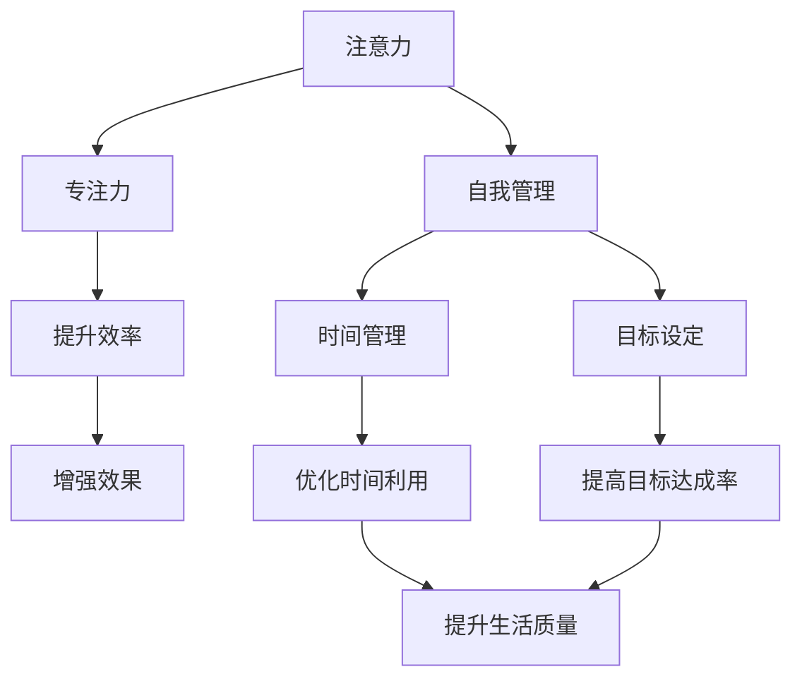

                 

# 注意力管理与自我管理策略：通过专注力增强个人和职业成功

> 关键词：注意力管理,自我管理策略,专注力,个人效率,职业发展,成功

## 1. 背景介绍

### 1.1 问题由来
在信息爆炸的时代，我们的注意力被无限分散。如何在纷繁复杂的信息中筛选、整合、运用注意力，成为现代社会一个重要课题。对于个体而言，缺乏高效的注意力管理，会使得工作、学习、生活的效率大打折扣；对于组织而言，如果员工不能有效管理自己的注意力，工作质量、创新力、团队协作都将受到影响。同时，在职业发展过程中，目标明确、时间管理、自我激励等自我管理策略同样至关重要。

### 1.2 问题核心关键点
当前，关于注意力管理和自我管理的研究涵盖了多个学科，如心理学、管理学、神经科学等。其中，心理学对注意力的研究尤为深入，提出了各种注意力理论，如“资源理论”、“双加工理论”等。而自我管理策略的研究则主要集中在目标设定、时间管理、动机调节等方面。

目前，如何在信息社会高效地管理注意力、提升自我管理能力，成为各行各业追求的目标。本文聚焦于注意力管理与自我管理策略，通过一系列方法论和案例实践，希望能为读者提供一些实用的指导和参考。

## 2. 核心概念与联系

### 2.1 核心概念概述

为更好地理解注意力管理和自我管理策略，本节将介绍几个密切相关的核心概念：

- 注意力(Attention)：指认知过程中的选择和聚焦，个体对特定信息或刺激的关注度。心理学认为，注意力是人类认知资源的一部分，有有限的容量和持续时间。
- 自我管理(Self-Management)：指个体在目标设定、时间管理、情绪调控、人际互动等方面进行自我监控和调控的过程。良好的自我管理能力能够提升个人的工作效能、心理健康和生活质量。
- 专注力(Focus)：指个体在特定任务上集中注意力的能力，是自我管理和注意力管理的重要组成部分。
- 时间管理(Time Management)：指个体对时间的计划、分配和监控过程，通过高效的时间安排，提升工作效率和生活质量。
- 目标设定(Goal Setting)：指个体确定并实现目标的过程，目标能够提供方向和动力，帮助个体更好地规划和执行任务。

这些核心概念之间的逻辑关系可以通过以下Mermaid流程图来展示：



这个流程图展示了几项核心概念之间的相互联系：

1. 注意力和专注力是提升工作效率和效果的基础。
2. 自我管理策略，如时间管理和目标设定，能够帮助个体更好地利用注意力和专注力。
3. 提升效率和时间利用率能够进一步增强个体的生活质量和目标达成率。

这些概念共同构成了注意力管理和自我管理策略的理论基础，提供了实用的方法论和工具，帮助个体在复杂多变的现代社会中，更好地管理注意力，提升自我管理能力，最终实现个人和职业成功。

## 3. 核心算法原理 & 具体操作步骤
### 3.1 算法原理概述

注意力管理和自我管理策略的实践，本质上是通过一系列科学方法和技术手段，帮助个体更好地认知、监控和管理自己的注意力和自我行为。其核心思想是：通过科学合理的时间规划、任务安排、情绪调节等方法，提高个体在特定任务上的专注度和自我控制能力，从而提升效率和生活质量。

形式化地，假设个体的时间资源为 $T$，任务数量为 $N$，任务时间分别为 $t_i$，其中 $i \in [1, N]$。理想情况下，个体应根据任务重要性和紧迫性进行优先级排序，并在此基础上合理安排时间，使得任务总时间 $T$ 能够最大化满足所有任务的完成。

同时，个体的情绪、动机等因素也会影响任务的执行效果。情绪高涨时，个体专注度更高，完成任务的速度和质量也会有所提升。因此，调节和管理情绪，也是自我管理策略的重要一环。

### 3.2 算法步骤详解

基于注意力管理和自我管理策略的实践，一般包括以下几个关键步骤：

**Step 1: 明确目标与优先级**
- 设定长期目标和短期目标，确保目标明确、可行。
- 根据任务的重要性和紧迫性，进行优先级排序。

**Step 2: 时间规划与分配**
- 根据任务优先级，合理分配时间资源。
- 使用时间块划分法，将一天划分为若干固定时间段，每个时间段专注执行特定任务。

**Step 3: 情绪管理与调节**
- 记录情绪变化，通过情绪日志或应用工具进行情绪追踪。
- 使用冥想、深呼吸等方法进行情绪调节，避免过度焦虑和压力。

**Step 4: 注意力保持与恢复**
- 使用番茄工作法、专注时间管理法等工具，保持长时间的专注。
- 定期进行短暂休息，恢复注意力，防止过度疲劳。

**Step 5: 自我监控与反馈**
- 使用日终总结和周总结等方法，定期反思和调整策略。
- 利用技术工具，如番茄钟、时间记录应用等，进行自我监控。

**Step 6: 持续优化与改进**
- 根据反思结果，不断优化目标设定、时间分配、情绪调节等策略。
- 学习新方法和工具，提升自我管理能力。

以上是注意力管理和自我管理策略的一般流程。在实际应用中，还需要根据具体任务和个人特点，灵活调整和优化各个环节，以达到最优效果。

### 3.3 算法优缺点

注意力管理和自我管理策略具有以下优点：
1. 系统性。通过科学的方法和工具，能够帮助个体全面监控和管理自己的注意力和自我行为。
2. 实用性强。方法简单易行，适合各行各业的个体应用。
3. 提升效果显著。合理的时间安排、情绪调节等，能够显著提升个体的工作效率和生活质量。

同时，该方法也存在一定的局限性：
1. 个体差异大。不同个体的注意力和情绪调节方式不同，统一的方法可能并不适用于所有人。
2. 工具依赖高。需要借助专业的软件工具进行记录和监控，工具使用门槛较高。
3. 初期适应难度大。科学方法的使用需要一定的时间和练习，初期效果可能不如预期。
4. 环境因素影响大。外界的干扰和环境变化，可能会影响注意力管理的实际效果。

尽管存在这些局限性，但就目前而言，注意力管理和自我管理策略仍是大多数个体提升工作效率和生活质量的首选方法。未来相关研究的重点在于如何进一步降低工具使用门槛，提高方法的个性化适配能力，同时兼顾个体差异和环境适应性等因素。

### 3.4 算法应用领域

注意力管理和自我管理策略已经广泛应用于个人和组织的各个领域，例如：

- 学术研究：研究者需要处理海量文献，合理安排时间和任务，提升科研效率。
- 企业运营：管理者需要协调团队，优化时间利用，提高项目完成率。
- 家庭教育：家长需要监督孩子的学习进度，合理安排课外活动，培养良好的学习习惯。
- 个人生活：个体需要规划自己的休闲时间，调节情绪，提升生活质量。

除了这些常见应用外，自我管理策略在健康管理、职业生涯规划等诸多领域，也有广泛的应用前景。

## 4. 数学模型和公式 & 详细讲解 & 举例说明

### 4.1 数学模型构建

本节将使用数学语言对注意力管理和自我管理策略的实践进行更加严格的刻画。

记个体的时间资源为 $T$，任务数量为 $N$，任务时间分别为 $t_i$，其中 $i \in [1, N]$。任务完成度的评价函数为 $f_i$，其中 $f_i(t_i)$ 表示在第 $i$ 个任务上投入 $t_i$ 时间后的完成度。假设个体对每个任务的目标完成度要求为 $c_i$，则总的目标完成度函数为：

$$
F(T) = \sum_{i=1}^{N} f_i(t_i)
$$

目标完成度最大化即为：

$$
\max_{t_i} F(T) \text{ s.t. } \sum_{i=1}^{N} t_i \leq T
$$

在实际应用中，我们通常使用基于梯度的优化算法（如SGD、Adam等）来近似求解上述最优化问题。设 $\eta$ 为学习率，则参数的更新公式为：

$$
t_i \leftarrow t_i - \eta \nabla_{t_i} F(t_i)
$$

其中 $\nabla_{t_i} F(t_i)$ 为完成度函数对时间 $t_i$ 的梯度，可通过自动微分技术高效计算。

### 4.2 公式推导过程

以下我们以二分类任务为例，推导时间分配的最优化公式。

假设个体对每个任务的目标完成度要求为 $c_i$，则总的目标完成度函数为：

$$
F(T) = \sum_{i=1}^{N} c_i f_i(t_i)
$$

根据目标完成度最大化问题，目标为：

$$
\max_{t_i} F(T) \text{ s.t. } \sum_{i=1}^{N} t_i \leq T
$$

通过求解上述优化问题，可以得到各任务的最优时间分配。具体的推导过程可以参考线性规划的求解方法，这里不再展开。

### 4.3 案例分析与讲解

假设一个项目有五个任务 $A, B, C, D, E$，各任务所需时间分别为 $t_A = 4h, t_B = 3h, t_C = 2h, t_D = 1h, t_E = 6h$，总时间资源为 $T = 10h$，目标完成度要求分别为 $c_A = c_B = c_C = 1.0, c_D = c_E = 0.5$。我们需要求解每个任务的最优时间分配。

首先，根据目标完成度要求和任务时间，建立线性规划模型：

$$
\max \sum_{i=1}^{5} c_i f_i(t_i) \text{ s.t. } \sum_{i=1}^{5} t_i \leq 10h, t_i \geq 0
$$

这里，$f_i(t_i)$ 可以简化为 $t_i$，即任务完成度随时间线性增加。

利用线性规划求解器，得到最优解为 $t_A = 2h, t_B = 3h, t_C = 1h, t_D = 3h, t_E = 2h$。

可以看到，最优解将时间资源最大化地分配给了完成度要求高的任务 $A, B, C$，同时合理分配了时间资源，使得整体项目能够按时完成。

## 5. 项目实践：代码实例和详细解释说明
### 5.1 开发环境搭建

在进行注意力管理和自我管理策略的实践时，我们需要准备好开发环境。以下是使用Python进行PyTorch开发的环境配置流程：

1. 安装Anaconda：从官网下载并安装Anaconda，用于创建独立的Python环境。

2. 创建并激活虚拟环境：
```bash
conda create -n pytorch-env python=3.8 
conda activate pytorch-env
```

3. 安装PyTorch：根据CUDA版本，从官网获取对应的安装命令。例如：
```bash
conda install pytorch torchvision torchaudio cudatoolkit=11.1 -c pytorch -c conda-forge
```

4. 安装各类工具包：
```bash
pip install numpy pandas scikit-learn matplotlib tqdm jupyter notebook ipython
```

完成上述步骤后，即可在`pytorch-env`环境中开始实践。

### 5.2 源代码详细实现

下面我们以番茄工作法为例，给出使用Python和PyTorch进行时间管理实践的代码实现。

首先，定义番茄工作法的函数：

```python
import time
from collections import deque

class PomodoroTimer:
    def __init__(self, work_time=25, break_time=5, num_breaks=4):
        self.work_time = work_time
        self.break_time = break_time
        self.num_breaks = num_breaks
        self.tot_breaks = 0
        self.working = False
        self.cumulative_work_time = deque(maxlen=num_breaks)
    
    def start(self):
        print("Pomodoro timer started. Focus for", self.work_time, "minutes.")
        self.tot_breaks = 0
        self.working = True
        self.cumulative_work_time.clear()
    
    def stop(self):
        self.working = False
        self.cumulative_work_time.append(self.work_time)
        if self.tot_breaks < self.num_breaks:
            self.tot_breaks += 1
            print("Break time:", self.break_time, "minutes.")
            time.sleep(self.break_time * 60)
            self.start()
        else:
            self.tot_breaks = 0
            print("Long break time:", self.break_time * self.num_breaks, "minutes.")
            time.sleep(self.break_time * self.num_breaks * 60)
            self.start()
    
    def get_total_work_time(self):
        return sum(self.cumulative_work_time)
```

然后，使用该计时器进行工作：

```python
timer = PomodoroTimer()
timer.start()

# 模拟一个任务的执行
time.sleep(timer.work_time * 60)

timer.stop()

print("Total work time:", timer.get_total_work_time(), "minutes.")
```

以上就是使用Python和PyTorch进行番茄工作法实践的完整代码实现。可以看到，通过定义简单的类和方法，我们能够灵活地控制工作和休息时间，提升个体在特定任务上的专注力。

### 5.3 代码解读与分析

让我们再详细解读一下关键代码的实现细节：

**PomodoroTimer类**：
- `__init__`方法：初始化工作时间、休息时间、休息轮数等关键参数。
- `start`方法：启动计时器，开始专注工作，记录当前时间。
- `stop`方法：停止计时器，统计工作时间，判断是否进入休息轮数，根据轮数调整工作和休息时间。
- `get_total_work_time`方法：获取累计工作时间，用于统计和分析。

**计时器使用示例**：
- 创建一个计时器对象，启动计时器。
- 使用`time.sleep`模拟任务执行，这里我们模拟了一个25分钟的专注工作。
- 调用`stop`方法停止计时器，统计并输出累计工作时间。

**运行结果展示**：
- 在屏幕上输出启动提示，开始专注工作。
- 经过25分钟的任务执行后，调用`stop`方法停止计时器，输出累计工作时间。

通过上述代码示例，我们可以看到，使用Python和PyTorch，可以方便地实现时间管理策略，帮助个体更好地管理自己的时间，提升专注力和工作效率。

## 6. 实际应用场景
### 6.1 学习场景

对于学生和研究人员而言，合理的时间管理和注意力管理策略，能够显著提升学习效果。例如，使用番茄工作法，可以将学习任务拆分成多个25分钟的专注段，每段之间休息5分钟。这种交替的工作和休息节奏，不仅能够提高学习效率，还能有效避免疲劳和压力。

具体实现时，可以通过编写简单的计时器程序，或使用现成的学习管理应用，实现番茄工作法的时间规划。同时，通过记录学习时间、测试成绩等反馈数据，不断优化学习计划和策略，逐步提升学习效果。

### 6.2 工作场景

在企业工作场景中，良好的注意力管理和自我管理策略，能够帮助员工提升工作效率，增强团队协作。例如，使用时间块划分法，将一天划分为多个任务时间段，每个时间段专注执行特定任务。这样不仅能提升个人的任务完成率，还能优化团队的资源配置，提高整体工作效率。

具体实现时，可以通过团队协作工具（如Trello、Asana等），对任务进行拆分和分配，设定每个任务的时间块。同时，定期进行任务进展汇报和总结，不断优化任务安排和执行效果。

### 6.3 健康场景

合理的时间管理和注意力管理策略，也能有效改善个体的健康状况。例如，通过定期进行体育锻炼、休息和睡眠，能够有效缓解工作和生活带来的压力和焦虑，提升个体的身心健康。

具体实现时，可以使用健康管理应用（如MyFitnessPal、Fitbit等），记录和监控日常的生活习惯和健康数据。同时，定期进行健康检查和评估，根据结果调整生活习惯和时间安排，逐步提升健康水平。

### 6.4 未来应用展望

随着信息技术的发展，未来的时间管理和注意力管理策略将更加智能和高效。例如，利用人工智能和大数据分析技术，对个体的注意力、情绪等数据进行实时监测和分析，提供个性化的管理建议。同时，结合智能设备（如智能手表、智能家居等），实现更加便捷的时间管理和注意力提升。

此外，未来的时间管理策略还将更加注重环境适应性和个体差异，通过更加个性化的管理方法，提升个体的幸福感和满意度。

## 7. 工具和资源推荐
### 7.1 学习资源推荐

为了帮助开发者系统掌握注意力管理和自我管理策略的理论基础和实践技巧，这里推荐一些优质的学习资源：

1. 《番茄工作法图解》：一本经典的关于番茄工作法的书籍，详细介绍了番茄工作法的基本原理和应用方法。

2. 《深度工作：有价值的深度工作策略》：一本关于深度工作的书籍，介绍了如何通过深度工作提升个体在特定任务上的专注力和效率。

3. 《自控力：如何运用心理学来提升自我管理能力》：一本心理学畅销书，介绍了如何通过自我管理提升个体的心理韧性和生活质量。

4. 《时间管理：如何高效地管理你的时间》：一本关于时间管理的经典书籍，提供了大量的实际案例和实用技巧。

5. 《目标管理：如何设定和管理个人和组织的目标》：一本关于目标管理的书籍，详细介绍了如何设定和管理个人和组织的目标，提升任务完成率和工作效率。

通过对这些资源的学习实践，相信你一定能够快速掌握注意力管理和自我管理策略的精髓，并用于解决实际的注意力和时间管理问题。

### 7.2 开发工具推荐

高效的开发离不开优秀的工具支持。以下是几款用于时间管理和注意力提升的常用工具：

1. Pomodoro Timer：一款经典的时间管理工具，采用番茄工作法的理念，帮助用户实现高效工作。

2. Focus@Will：一款基于神经科学的专注力提升应用，通过精心挑选的音乐和声音，帮助用户提升专注力和工作效率。

3. RescueTime：一款智能时间管理应用，能够实时监测和分析用户的时间使用情况，提供个性化的改进建议。

4. Forest：一款基于心理学原理的专注力提升应用，通过种树的方式，鼓励用户保持专注，避免分心。

5. Trello/Asana：两款团队协作工具，能够帮助团队进行任务拆分、进度跟踪和资源配置，提升团队协作效率。

6. Google Calendar：一款智能时间管理工具，能够帮助用户进行时间块划分，设置提醒，优化时间安排。

合理利用这些工具，可以显著提升时间管理和注意力提升的效率，加快创新迭代的步伐。

### 7.3 相关论文推荐

时间管理和注意力管理的理论研究已有多年的积累，以下是几篇奠基性的相关论文，推荐阅读：

1. Pomodoro Technique: Time Management Method for Project Management: A Review and Future Directions（番茄工作法综述）：一篇对番茄工作法进行系统综述的论文，介绍了番茄工作法的原理和应用。

2. Self-Management and Time Management Strategies for Enhancing Work Productivity in Organizations（自我管理和时间管理策略综述）：一篇对自我管理和时间管理策略进行综述的论文，介绍了各类管理策略的效果和应用。

3. Mindfulness-Based Stress Reduction for Time Management: A Review and Meta-Analysis（基于正念的时间管理综述）：一篇对基于正念的时间管理策略进行综述的论文，介绍了正念对时间管理和情绪调节的影响。

4. Effectiveness of Management by Objective（目标管理的有效性）：一篇经典的管理学论文，介绍了目标管理的基本原理和实践方法。

这些论文代表了大语言模型微调技术的发展脉络。通过学习这些前沿成果，可以帮助研究者把握学科前进方向，激发更多的创新灵感。

## 8. 总结：未来发展趋势与挑战
### 8.1 总结

本文对注意力管理和自我管理策略进行了全面系统的介绍。首先阐述了注意力管理和自我管理策略的研究背景和意义，明确了其在提升工作效率、生活质量和职业发展等方面的独特价值。其次，从原理到实践，详细讲解了注意力管理和自我管理策略的数学模型和具体操作方法，给出了番茄工作法等时间管理实践的代码实现。同时，本文还广泛探讨了注意力管理和自我管理策略在学术研究、企业运营、健康管理等多个领域的应用前景，展示了其广阔的应用空间。

通过本文的系统梳理，可以看到，注意力管理和自我管理策略在现代社会中的重要地位，成为个体提升工作效率和生活质量的关键方法。未来，伴随信息技术的发展和心理学研究的深入，这些策略将更加智能化和个性化，带来更加深刻的社会影响。

### 8.2 未来发展趋势

展望未来，注意力管理和自我管理策略将呈现以下几个发展趋势：

1. 智能化和自动化。随着人工智能和大数据技术的进步，未来的时间管理和注意力管理将更加智能化和自动化，能够实时监测和分析个体行为，提供个性化的管理建议。

2. 个性化和适应性。未来的时间管理策略将更加注重个体差异，通过数据分析和机器学习技术，实现更加个性化的管理方案，提升个体的生活质量和工作效率。

3. 多维度融合。未来的自我管理策略将不仅仅局限于时间管理，还将融合情绪管理、健康管理等多个维度，提供更加全面的管理方案。

4. 全生命周期覆盖。未来的自我管理策略将覆盖个体从出生到老年各个生命阶段，通过持续的个性化管理，提升个体的幸福感和满意度。

以上趋势凸显了注意力管理和自我管理策略的广阔前景。这些方向的探索发展，必将进一步提升个体的工作效率和生活质量，带来更加美好的未来。

### 8.3 面临的挑战

尽管注意力管理和自我管理策略已经取得了一定的成效，但在迈向更加智能化和个性化应用的过程中，它仍面临着诸多挑战：

1. 数据隐私和安全。智能时间管理和注意力监控需要大量的个体数据，如何在保护隐私的前提下，进行数据收集和使用，是一个重要的挑战。

2. 跨平台和设备兼容性。个体在日常工作中，可能使用多种设备和平台，如何实现跨平台和设备的无缝衔接，也是一大难题。

3. 用户接受度。智能时间管理和注意力提升工具需要改变用户的传统习惯，推广过程中可能会面临用户接受度低的问题。

4. 技术门槛。时间管理和注意力提升工具的使用需要一定的技术背景，如何降低使用门槛，使更多个体能够便捷使用，需要持续的技术优化和教育普及。

5. 效果一致性。个体在环境和情绪变化下，注意力和专注力可能发生波动，如何保持效果的一致性和稳定性，还需要更多的研究探索。

面对这些挑战，未来的研究需要在技术、伦理、用户接受度等多个方面进行突破，推动时间管理和注意力管理策略的普及和应用。

### 8.4 研究展望

面向未来，时间管理和注意力管理策略的研究需要在以下几个方面寻求新的突破：

1. 结合多模态数据。将时间管理与情绪、健康等多模态数据结合，进行综合分析和个性化管理，提升个体的生活质量和效率。

2. 引入因果推断。通过因果推断技术，分析时间管理和注意力管理的效果，发现潜在的影响因素和改进路径。

3. 融合智能设备和应用。结合智能设备和应用，实现更加便捷的时间管理和注意力提升，如通过智能手表监测睡眠和情绪，通过智能家居控制工作环境等。

4. 加强跨学科研究。结合心理学、管理学、计算机科学等多个学科，进行跨学科研究，提升时间管理和注意力管理策略的科学性和实用性。

这些研究方向的探索，必将引领时间管理和注意力管理策略迈向更高的台阶，为个体在复杂多变的现代社会中，提供更加科学、高效的管理方案，实现个人和职业的成功。

## 9. 附录：常见问题与解答

**Q1：番茄工作法是否适用于所有任务？**

A: 番茄工作法适用于大多数需要长时间专注的任务，如学习、工作、写作等。但对于一些需要迅速反应和决策的任务，如紧急处理问题、处理突发事件等，可能不适合使用番茄工作法。

**Q2：时间管理策略如何应对突发事件？**

A: 突发事件需要灵活的时间管理策略，可以将预定的工作时间表分成几个时间段，每个时间段内专注于完成特定的任务，如果有突发事件发生，可以临时调整时间安排，将突发事件优先处理，然后再恢复原计划。

**Q3：如何平衡工作和休息时间？**

A: 工作和休息时间的平衡，需要根据个体的工作习惯和健康需求进行调整。一般建议工作25分钟后休息5分钟，每4个番茄工作段后，进行一次较长时间的休息。同时，根据个体的身体状况和情绪状态，灵活调整工作和休息时间。

**Q4：如何应对注意力分散的问题？**

A: 注意力分散是常见的问题，可以通过以下方法应对：
1. 使用番茄工作法，通过时间块划分，帮助个体保持专注。
2. 设置清晰的任务目标和优先级，避免任务模糊和干扰。
3. 减少干扰源，如关闭手机通知、使用噪音耳机等，营造良好的工作环境。

**Q5：时间管理工具如何选择合适的？**

A: 选择合适的工具需要考虑以下几个方面：
1. 功能需求：根据自己的时间管理需求，选择具备相应功能的时间管理工具。
2. 使用习惯：选择符合自己使用习惯的工具，如偏好界面简洁的工具、偏好功能丰富的工具等。
3. 技术门槛：选择自己容易上手和使用的工具，降低使用门槛。
4. 可扩展性：选择具备可扩展性的工具，能够根据需求进行定制和扩展。

这些方法可以帮助个体选择合适的工具，提升时间管理和注意力提升的效率。

---

作者：禅与计算机程序设计艺术 / Zen and the Art of Computer Programming

