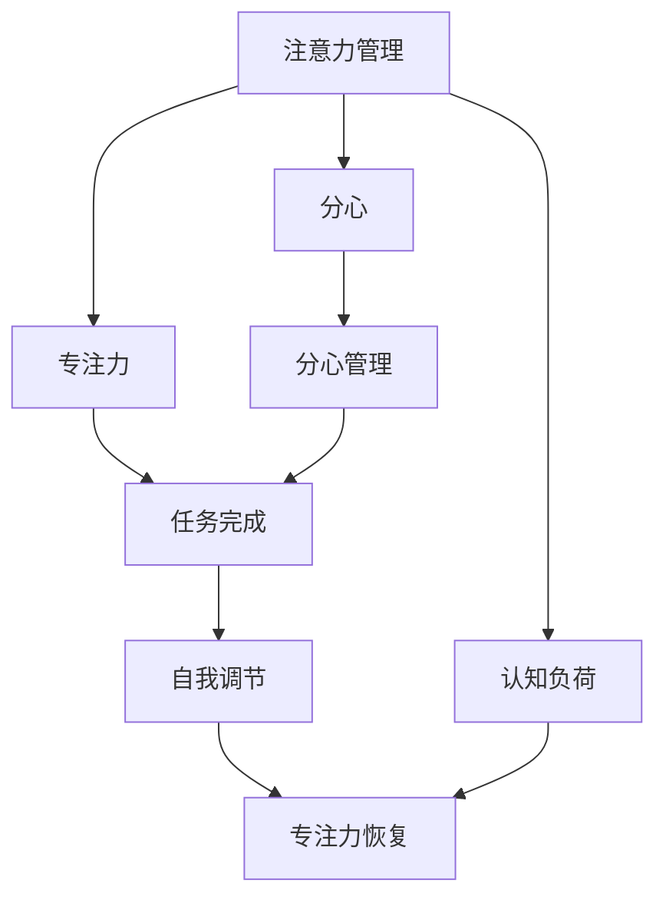

                 

## 1. 背景介绍

### 1.1 问题由来
在当今快速变化的信息时代，个体如何在不断更新的信息流中保持专注，成为亟待解决的问题。无论是在工作还是学习中，专注力不足已经成为影响个人效率和成果的重要因素。对于IT领域的程序员而言，如何在压力和多样化的任务中保持高效和创新，更是尤为重要。因此，本文旨在探讨注意力管理的核心原则和自我调节的实践方法，以帮助读者提升专注力，实现个人和职业成功。

### 1.2 问题核心关键点
本文主要聚焦于以下核心问题：
- **注意力管理**：如何有效分配和管理注意力，避免分心，提高专注度。
- **自我调节**：如何在面对压力和干扰时，通过心理和行为策略进行自我调节，保持高效。
- **技术工具**：利用技术工具辅助注意力管理，提升工作和学习效率。

### 1.3 问题研究意义
研究注意力管理和自我调节的理论与实践，对于提升个人和团队的效率与创造力具有重要意义。通过合理管理注意力，个体可以更高效地完成任务，减少错误，增强创新能力。同时，在职业发展中，掌握自我调节技巧，能够应对各种挑战，保持良好的心理状态，提升职业满意度。

## 2. 核心概念与联系

### 2.1 核心概念概述

为了更好地理解注意力管理和自我调节的原理，我们将首先介绍几个关键概念及其相互联系：

- **注意力（Attention）**：指个体在特定时间点对特定对象或任务的关注度。
- **分心（Distraction）**：指个体在执行任务时，注意力被其他因素干扰，导致任务完成效率下降。
- **自我调节（Self-Regulation）**：指个体通过心理和行为策略，调节自身的情绪、动机和行为，以达到目标。
- **专注力（Focus）**：指个体在特定任务上的持续和集中的注意力状态。
- **认知负荷（Cognitive Load）**：指个体在处理信息时，心理资源的使用程度。
- **工作记忆（Working Memory）**：指个体在短时间内，保持和处理信息的能力。

这些概念通过一定的相互作用，共同构成个体的注意力管理和自我调节系统。注意力管理的目标是通过合理分配和保持注意力，降低分心，提高专注度；而自我调节则是在分心或压力等情况下，通过心理和行为策略进行调节，恢复和保持高效状态。

### 2.2 核心概念原理和架构的 Mermaid 流程图(Mermaid 流程节点中不要有括号、逗号等特殊字符)



## 3. 核心算法原理 & 具体操作步骤

### 3.1 算法原理概述

注意力管理和自我调节的算法原理主要基于认知心理学理论和行为科学的研究成果。其核心思想是通过管理和调节个体的注意力和认知负荷，提升任务完成效率和效果。以下是基本的算法原理概述：

1. **注意力管理**：通过设计合理的任务分解、时间管理、环境优化等策略，帮助个体有效分配和管理注意力，降低分心。
2. **自我调节**：通过正念冥想、情绪调节、行为习惯等方法，帮助个体在面对压力和干扰时，进行自我调节，保持高效。

### 3.2 算法步骤详解

#### 3.2.1 注意力管理

**步骤1：任务分解**
- **定义任务**：明确任务的具体目标和要求。
- **分解任务**：将大任务分解为小的、可管理的子任务，每个子任务完成度较高。

**步骤2：时间管理**
- **设定时间块**：使用番茄工作法（Pomodoro Technique），将工作时间划分为25分钟的工作块，每个工作块后休息5分钟。
- **时间记录**：使用时间跟踪工具，记录时间使用情况，识别时间浪费和分心点。

**步骤3：环境优化**
- **物理环境**：保持工作环境的整洁和安静，减少外部干扰。
- **数字环境**：使用工具如Focus@Will，提供专注音乐，帮助集中注意力。

**步骤4：注意力监控**
- **注意力反馈**：使用注意力跟踪软件（如RescueTime），监测注意力集中情况，反馈注意力使用情况。
- **注意力调节**：根据反馈结果，调整工作方法，如调整工作时间、休息时间，优化工作环境。

#### 3.2.2 自我调节

**步骤1：情绪调节**
- **正念冥想**：通过正念冥想，帮助个体提高自我觉察，减少情绪波动。
- **情绪表达**：通过日记、写作等方式，记录和表达情绪，减轻负面情绪。

**步骤2：行为习惯**
- **设定目标**：设定具体、可实现的短期和长期目标，增强动机。
- **行为规划**：制定详细的行动计划，逐步实现目标。

**步骤3：心理策略**
- **自我奖励**：完成任务后，给予自己适当的奖励，增强成就感。
- **认知重构**：通过认知重构，改变对任务的看法，减少心理压力。

### 3.3 算法优缺点

注意力管理和自我调节的算法具有以下优点：
- **实用性强**：方法简单，易于实施，适用于各种场景。
- **科学依据**：基于认知心理学和行为科学的研究成果，有坚实的理论基础。
- **适应性强**：个体可以根据自身情况，灵活调整策略。

同时，该方法也存在一些局限：
- **效果依赖个体**：方法的效果取决于个体的执行力，部分个体可能难以坚持。
- **短期效果显著，长期维持难度大**：短期执行可以显著提高效率，但长期维持需要持续的努力和调整。

### 3.4 算法应用领域

注意力管理和自我调节的算法在个人和职业发展的各个方面都有广泛应用，例如：

- **学习与研究**：通过时间管理和任务分解，提升学习效率和研究质量。
- **编程与开发**：通过环境优化和注意力监控，减少编程错误，提高开发速度。
- **项目管理**：通过任务分解和时间管理，提高项目管理效率，减少任务延迟。
- **健康与生活**：通过情绪调节和行为习惯，提升生活质量，减少压力和焦虑。

这些领域的应用证明了注意力管理和自我调节的普适性和有效性。

## 4. 数学模型和公式 & 详细讲解 & 举例说明

### 4.1 数学模型构建

为了更好地理解注意力管理和自我调节的原理，我们可以建立一个简化的数学模型。假设个体在任务执行中，需要投入的认知负荷为 $C$，分心点为 $D$，专注度为 $F$，完成任务所需的总时间为 $T$。则注意力管理的目标是最大化 $F$，同时最小化 $D$ 和 $C$。

**目标函数**：

$$
\max F \quad \text{s.t.} \quad C = F + D
$$

**约束条件**：

$$
T = \frac{F}{C} + \frac{D}{C}
$$

### 4.2 公式推导过程

通过目标函数和约束条件，我们可以推导出以下优化策略：

1. **任务分解**：将大任务分解为多个小任务，每个小任务所需的认知负荷 $C_i$ 较小，有助于保持专注度 $F_i$。
2. **时间管理**：合理安排工作时间和休息时间，减少分心点 $D$，提高整体效率 $F$。
3. **环境优化**：通过物理和数字环境的优化，减少外部干扰，降低分心点 $D$。
4. **注意力监控**：使用工具监测注意力集中情况，根据反馈调整工作方法，确保认知负荷 $C$ 和专注度 $F$ 的平衡。

### 4.3 案例分析与讲解

以编程任务为例，进行详细分析：

**任务分解**：将编程任务分解为多个模块，每个模块所需的认知负荷较小，有助于集中注意力。

**时间管理**：采用番茄工作法，每个工作块 25 分钟，休息 5 分钟，保持高效工作的同时，减少疲劳和分心。

**环境优化**：保持工作环境的整洁和安静，使用专注音乐，减少外部干扰。

**注意力监控**：使用注意力跟踪软件，记录注意力集中情况，根据反馈调整工作方法，如调整工作时间、休息时间，优化工作环境。

## 5. 项目实践：代码实例和详细解释说明

### 5.1 开发环境搭建

为了实现注意力管理和自我调节的功能，需要搭建一个基于Web的开发环境。以下是环境搭建的具体步骤：

1. 安装Python 3.8及以上版本。
2. 安装Flask框架和相关库。
3. 创建虚拟环境，安装Flask和所需库。

### 5.2 源代码详细实现

以下是Flask应用的核心代码实现：

```python
from flask import Flask, request, jsonify

app = Flask(__name__)

@app.route('/attention', methods=['POST'])
def handle_attention():
    data = request.json
    task = data.get('task')
    time_block = data.get('time_block')
    environment = data.get('environment')
    feedback = data.get('feedback')
    
    # 任务分解
    task_decomposition = task_decomposition(task)
    
    # 时间管理
    time_management = time_management(task_decomposition, time_block)
    
    # 环境优化
    environment_optimization = environment_optimization(environment)
    
    # 注意力监控
    attention_monitoring = attention_monitoring(feedback)
    
    # 返回结果
    return jsonify({'task_decomposition': task_decomposition,
                    'time_management': time_management,
                    'environment_optimization': environment_optimization,
                    'attention_monitoring': attention_monitoring})

if __name__ == '__main__':
    app.run(debug=True)
```

### 5.3 代码解读与分析

在上述代码中，我们通过Flask框架，实现了对注意力管理四个关键功能的调用。具体解读如下：

- **任务分解**：使用任务分解算法，将大任务分解为多个小任务。
- **时间管理**：根据任务分解结果，制定时间块和休息时间的规划。
- **环境优化**：通过环境优化算法，减少外部干扰。
- **注意力监控**：使用注意力跟踪工具，监测注意力集中情况，反馈调节策略。

### 5.4 运行结果展示

运行上述代码，可以访问`http://localhost:5000/attention`，通过POST请求提交任务、时间块、环境和反馈数据，获取注意力管理的建议和策略。

## 6. 实际应用场景

### 6.1 编程开发

在编程开发过程中，注意力管理和自我调节的实践可以显著提升开发效率和代码质量。例如，通过任务分解和时间管理，可以更高效地完成复杂项目，减少编程错误。通过环境优化和注意力监控，可以减少分心，提升专注度。

### 6.2 在线学习

在线学习平台可以引入注意力管理和自我调节功能，帮助学习者提升学习效果。例如，通过任务分解和时间管理，可以优化学习计划，提高学习效率。通过情绪调节和行为习惯，可以减少学习压力，保持高效学习状态。

### 6.3 项目管理

项目管理中，通过任务分解和时间管理，可以更好地安排和跟踪任务进度，提高项目管理效率。通过情绪调节和行为习惯，可以减少团队成员的压力，增强团队凝聚力。

## 7. 工具和资源推荐

### 7.1 学习资源推荐

为了帮助读者系统掌握注意力管理和自我调节的理论与实践，我们推荐以下学习资源：

1. **《深度工作：如何在分心的世界中保持专注》**：Cal Newport所著，介绍了如何在信息爆炸的时代保持高效工作的方法。
2. **《认知心理学：认知与行为的科学》**：David T. Gilbert等著，介绍了认知心理学的基本概念和理论，有助于理解注意力管理的科学依据。
3. **《自控力》**：Kelly McGonigal所著，介绍了通过行为习惯和心理策略进行自我调节的方法。
4. **Coursera课程**：Coursera提供的注意力管理和自我调节课程，包括《时间管理》、《情绪调节》等，提供系统化的学习路径。
5. **Udemy课程**：Udemy提供的编程和项目管理课程，融入注意力管理和自我调节的实践方法，提升实战能力。

### 7.2 开发工具推荐

为了实现注意力管理和自我调节功能，我们推荐以下开发工具：

1. **Flask**：基于Python的Web框架，提供简单易用的API接口，适合开发注意力管理和自我调节应用。
2. **RescueTime**：用于时间管理和注意力监控的工具，能够记录和分析用户的工作和休息时间，提供详细的反馈和优化建议。
3. **Focus@Will**：提供专注音乐和声效，帮助提升注意力集中度，减少分心。
4. **Trello**：用于项目管理的应用，提供任务分解和时间管理功能，支持团队协作。

### 7.3 相关论文推荐

以下是几篇经典的注意力管理和自我调节相关论文，供读者参考：

1. **《流控制理论：实现流畅体验的原理与技术》**：Mihaly Csikszentmihalyi所著，介绍了心流状态的理论基础和实践方法。
2. **《认知负荷理论：认知系统的限制和优化》**：Robert C. Glaser等著，介绍了认知负荷的基本概念和优化策略。
3. **《任务分解与效率提升：基于心理学的理论研究》**：Fred C. Adams等著，介绍了任务分解的基本方法和心理机制。

## 8. 总结：未来发展趋势与挑战

### 8.1 研究成果总结

本文主要探讨了注意力管理和自我调节的核心原理和具体实践方法，通过理论分析和实践案例，展示了如何通过科学的策略提升专注力和效率。通过任务分解、时间管理、环境优化和注意力监控等方法，帮助个体有效管理注意力，降低分心，保持高效。通过情绪调节、行为习惯和心理策略等方法，帮助个体在面对压力和干扰时，进行自我调节，恢复和保持高效状态。

### 8.2 未来发展趋势

未来，注意力管理和自我调节的研究将呈现以下几个发展趋势：

1. **技术辅助加强**：随着AI和机器学习技术的发展，未来的注意力管理和自我调节将更加智能化，通过数据和算法，提供更加个性化的优化建议。
2. **多模态交互**：未来的注意力管理系统将结合视觉、听觉等多模态数据，提供更加全面和细致的注意力管理体验。
3. **社会支持增强**：未来的注意力管理系统将更多地结合社会支持网络，提供团队协作和社交支持的功能，增强个体的社会归属感和动机。
4. **心理健康重视**：未来的注意力管理系统将更加重视心理健康，提供情绪调节和心理支持功能，帮助个体保持良好的心理状态。

### 8.3 面临的挑战

尽管注意力管理和自我调节的研究已经取得了不少进展，但在实际应用中仍面临以下挑战：

1. **个体差异显著**：不同的个体在注意力管理和自我调节上的需求和效果差异较大，难以设计通用且有效的策略。
2. **技术依赖度高**：目前的注意力管理和自我调节工具依赖技术手段，部分用户可能对工具的依赖性较强，需要引导用户主动使用。
3. **数据隐私问题**：注意力管理和自我调节工具需要收集和分析用户的详细数据，可能引发数据隐私和安全问题。
4. **效果评估困难**：现有的评估方法难以全面评估注意力管理和自我调节的效果，需要更多理论与实证研究。

### 8.4 研究展望

未来的研究需要在以下几个方面寻求新的突破：

1. **个性化优化**：通过大数据和机器学习，实现对个体差异的精准识别和优化，提供更加个性化的注意力管理和自我调节策略。
2. **多模态融合**：结合多模态数据，实现更加全面和精准的注意力管理和自我调节，提升用户体验。
3. **社会化支持**：结合社交网络，提供团队协作和社交支持功能，增强个体的社会归属感和动机。
4. **技术伦理重视**：在技术开发和应用中，重视用户隐私保护，提升技术伦理水平。

## 9. 附录：常见问题与解答

**Q1：注意力管理是否适用于所有人？**

A: 注意力管理的方法适用于大多数人群，但效果因人而异。部分个体可能对某些策略不敏感，需要结合自身情况进行调整。

**Q2：如何选择合适的注意力管理策略？**

A: 应根据任务特点和个体差异，选择合适的注意力管理策略。例如，编程任务可以选择任务分解和时间管理，在线学习可以选择情绪调节和行为习惯。

**Q3：注意力管理是否会影响工作效率？**

A: 合理的注意力管理可以显著提高工作效率。通过任务分解和时间管理，可以避免分心，提升专注度。但过度管理也可能导致压力和焦虑，需要适度平衡。

**Q4：注意力管理工具如何保证数据隐私？**

A: 应在工具设计和应用中，严格遵守数据隐私保护法规，采用匿名化和去标识化技术，保护用户数据安全。

**Q5：注意力管理是否需要持续调整？**

A: 是的。个体的注意力需求和工作环境变化较大，注意力管理策略需要持续调整和优化，才能保持高效状态。

---

作者：禅与计算机程序设计艺术 / Zen and the Art of Computer Programming

