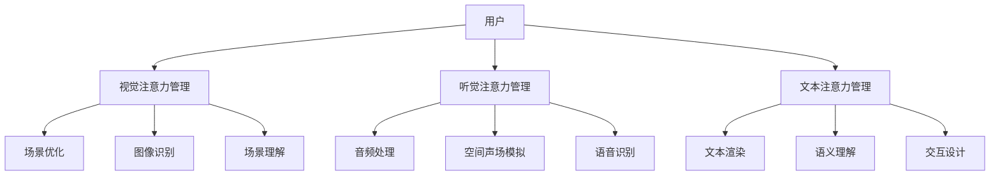

                 

# 注意力管理在元宇宙中的重要性

## 1. 背景介绍

### 1.1 元宇宙的概念与内涵

元宇宙（Metaverse）是一种基于虚拟现实、增强现实、混合现实等技术的，融合数字世界与物理世界的虚拟空间。它包含了多个维度的技术栈，包括计算机视觉、计算机图形学、自然语言处理、交互设计等，是一个高度互动和可扩展的数字平台。元宇宙的目标是构建一个跨平台、跨设备、跨系统的虚拟世界，让用户能够在其中进行社交、娱乐、创作、工作等活动。

### 1.2 注意力管理的必要性

在元宇宙中，用户可以实时交互，体验高度沉浸和复杂的虚拟环境。这种交互和体验需要高度的注意力管理。注意力管理不仅影响用户体验的流畅性和沉浸感，还决定了系统的响应速度和资源利用效率。因此，注意力管理在元宇宙中扮演着至关重要的角色。

## 2. 核心概念与联系

### 2.1 核心概念概述

注意力管理（Attention Management）是元宇宙中实现用户交互和体验管理的关键技术。它包括视觉注意力管理、听觉注意力管理、文本注意力管理等多个方面。注意力管理的核心目标是确保用户在复杂的虚拟环境中能够高效、自然地获取信息、进行交互，并享受优质的虚拟体验。

#### 2.1.1 视觉注意力管理

视觉注意力管理是指通过优化图形渲染、图像识别、场景理解等技术，提高用户对虚拟环境的感知和响应速度。主要包括：

- 场景优化：通过实时渲染、动态光照、逼真贴图等技术，优化视觉场景的渲染效果。
- 图像识别：利用计算机视觉技术，快速识别和定位用户关注的对象。
- 场景理解：利用深度学习技术，理解虚拟环境中的场景语义，提升用户对环境的认知。

#### 2.1.2 听觉注意力管理

听觉注意力管理是指通过优化音频处理、空间声场模拟、语音识别等技术，提升用户的听觉体验和交互效果。主要包括：

- 音频处理：优化音频编码、回声消除、噪音抑制等技术，提升音频质量。
- 空间声场模拟：利用声场模拟技术，实现虚拟环境中的空间音效效果。
- 语音识别：利用自然语言处理技术，实现语音指令的识别和理解。

#### 2.1.3 文本注意力管理

文本注意力管理是指通过优化文本渲染、语义理解、交互设计等技术，提升用户对文本信息的感知和处理能力。主要包括：

- 文本渲染：优化文本字体、大小、颜色等参数，提升文本的可读性。
- 语义理解：利用自然语言处理技术，理解文本信息的内涵和情感。
- 交互设计：优化文本输入和输出方式，提升用户交互的流畅性和自然性。

### 2.2 核心概念原理和架构的 Mermaid 流程图



这个流程图展示了注意力管理的核心流程和关键组件。

## 3. 核心算法原理 & 具体操作步骤

### 3.1 算法原理概述

注意力管理涉及的算法和技术众多，包括深度学习、计算机视觉、自然语言处理、交互设计等多个领域。其核心思想是通过算法优化，提升用户对虚拟环境的感知和响应速度，增强用户体验和系统性能。

#### 3.1.1 深度学习算法

深度学习算法是注意力管理的重要工具。通过深度学习，可以提取和理解用户的注意力特征，从而实现智能化的注意力管理。主要包括：

- 卷积神经网络（CNN）：用于图像识别和场景理解。
- 循环神经网络（RNN）：用于文本处理和交互设计。
- 变分自编码器（VAE）：用于数据压缩和重构。

#### 3.1.2 计算机视觉算法

计算机视觉算法是视觉注意力管理的重要基础。通过计算机视觉技术，可以实现对虚拟场景的实时渲染、图像识别和场景理解。主要包括：

- 实时渲染：利用GPU加速和优化算法，实现对虚拟场景的实时渲染。
- 图像识别：利用深度学习模型，实现对虚拟场景中对象的快速识别和定位。
- 场景理解：利用语义分割、目标检测等技术，理解虚拟环境中的场景语义。

#### 3.1.3 自然语言处理算法

自然语言处理算法是文本注意力管理的重要工具。通过自然语言处理技术，可以实现对文本信息的理解、渲染和交互设计。主要包括：

- 文本渲染：利用字体、颜色、大小等参数，优化文本信息的展示效果。
- 语义理解：利用深度学习模型，理解文本信息的情感和语义。
- 交互设计：利用自然语言处理技术，实现文本输入和输出的自然化。

### 3.2 算法步骤详解

#### 3.2.1 数据采集与预处理

1. 采集用户交互数据：通过传感器、摄像头、麦克风等设备，采集用户的行为和环境数据。
2. 数据预处理：对采集的数据进行去噪、归一化、特征提取等预处理操作。

#### 3.2.2 注意力特征提取

1. 使用深度学习模型，提取用户的注意力特征。
2. 使用计算机视觉模型，提取虚拟场景的特征。
3. 使用自然语言处理模型，提取文本信息的特征。

#### 3.2.3 注意力分配与优化

1. 基于注意力特征，分配注意力资源。
2. 对注意力分配进行优化，提升用户体验和系统性能。
3. 实现动态调整，适应用户需求和环境变化。

#### 3.2.4 结果反馈与调整

1. 收集用户反馈数据，评估注意力管理的效果。
2. 基于反馈数据，调整注意力管理策略和算法。
3. 实现自适应优化，提升系统的稳定性和可靠性。

### 3.3 算法优缺点

#### 3.3.1 优点

1. 提升用户体验：通过优化注意力管理，提升用户在虚拟环境中的感知和响应速度，增强用户体验。
2. 提高系统性能：优化注意力管理可以提升系统的响应速度和资源利用效率。
3. 增强交互性：通过优化注意力管理，提升用户对虚拟环境的交互效果和沉浸感。

#### 3.3.2 缺点

1. 计算资源需求高：深度学习模型和计算机视觉算法需要大量计算资源，可能对硬件设备提出较高要求。
2. 算法复杂度高：注意力管理涉及多个领域的算法，算法实现复杂，开发和调试难度大。
3. 数据依赖性强：注意力管理的优化效果依赖于高质量的训练数据，数据采集和标注成本高。

### 3.4 算法应用领域

#### 3.4.1 游戏与虚拟现实

在游戏和虚拟现实中，注意力管理可以显著提升用户的沉浸感和体验。通过优化视觉和听觉效果，增强场景渲染和空间音效，提升游戏的互动性和沉浸感。

#### 3.4.2 教育与培训

在教育与培训中，注意力管理可以提升学生的学习效果和体验。通过优化文本信息和交互设计，提升学习内容的可理解性和自然性。

#### 3.4.3 医疗与健康

在医疗与健康领域，注意力管理可以提升患者的医疗体验和互动效果。通过优化视觉和听觉效果，增强医疗信息的展示和理解。

#### 3.4.4 社交与娱乐

在社交与娱乐领域，注意力管理可以提升用户的互动体验和娱乐效果。通过优化视觉和听觉效果，增强社交和娱乐的互动性和沉浸感。

## 4. 数学模型和公式 & 详细讲解 & 举例说明

### 4.1 数学模型构建

注意力管理的数学模型主要包括：

- 注意力分配模型：用于分配注意力资源。
- 深度学习模型：用于提取和理解注意力特征。
- 优化算法模型：用于优化注意力分配和调整。

#### 4.1.1 注意力分配模型

注意力分配模型用于计算用户对虚拟场景中不同对象的注意力权重。假设场景中包含 $n$ 个对象，用户对每个对象的注意力权重为 $w_i$，则注意力分配模型可以表示为：

$$
w_i = \frac{e^{\alpha_i}}{\sum_{j=1}^n e^{\alpha_j}}
$$

其中 $\alpha_i$ 为第 $i$ 个对象的注意力权重因子，可以通过深度学习模型或计算机视觉算法提取。

#### 4.1.2 深度学习模型

深度学习模型用于提取和理解用户的注意力特征。假设深度学习模型为 $f(x)$，其中 $x$ 为输入数据，则注意力特征可以表示为：

$$
a = f(x)
$$

#### 4.1.3 优化算法模型

优化算法模型用于调整注意力分配策略，提升用户体验和系统性能。假设优化算法模型为 $g(a)$，其中 $a$ 为注意力特征，则优化目标可以表示为：

$$
\min_{a} g(a)
$$

### 4.2 公式推导过程

#### 4.2.1 注意力分配模型推导

假设场景中包含 $n$ 个对象，用户对每个对象的注意力权重为 $w_i$，则注意力分配模型的推导过程如下：

1. 计算每个对象的注意力权重因子 $\alpha_i$。
2. 根据注意力权重因子，计算每个对象的注意力权重 $w_i$。

推导过程如下：

$$
\alpha_i = f_i(x) \quad \text{其中 } f_i(x) \text{ 为对象 } i \text{ 的注意力权重函数}
$$

$$
w_i = \frac{e^{\alpha_i}}{\sum_{j=1}^n e^{\alpha_j}}
$$

#### 4.2.2 深度学习模型推导

假设深度学习模型为 $f(x)$，其中 $x$ 为输入数据，则注意力特征可以表示为：

$$
a = f(x)
$$

推导过程如下：

$$
a = f(x) = W_2 \cdot \tanh(W_1 \cdot x + b_1) + b_2
$$

其中 $W_1$、$W_2$、$b_1$、$b_2$ 为模型参数。

#### 4.2.3 优化算法模型推导

假设优化算法模型为 $g(a)$，其中 $a$ 为注意力特征，则优化目标可以表示为：

$$
\min_{a} g(a)
$$

推导过程如下：

1. 计算注意力分配损失函数 $L$。
2. 根据损失函数，计算优化步长 $\eta$。
3. 更新模型参数 $w_i$。

推导过程如下：

$$
L = \frac{1}{N} \sum_{i=1}^N (w_i - y_i)^2
$$

$$
\eta = \frac{\partial L}{\partial w_i}
$$

$$
w_i = w_i - \eta
$$

### 4.3 案例分析与讲解

#### 4.3.1 游戏场景中的注意力管理

在虚拟游戏中，用户需要实时处理复杂的场景信息。通过优化视觉和听觉效果，提升用户对虚拟环境的感知和响应速度。例如：

- 场景优化：利用实时渲染、动态光照、逼真贴图等技术，优化虚拟场景的渲染效果。
- 图像识别：利用深度学习模型，快速识别和定位用户关注的对象。
- 场景理解：利用语义分割、目标检测等技术，理解虚拟环境中的场景语义。

#### 4.3.2 教育培训中的注意力管理

在教育培训中，学生需要通过文本信息和交互设计，理解学习内容。通过优化文本信息和交互设计，提升学习内容的可理解性和自然性。例如：

- 文本渲染：利用字体、颜色、大小等参数，优化文本信息的展示效果。
- 语义理解：利用深度学习模型，理解文本信息的情感和语义。
- 交互设计：利用自然语言处理技术，实现文本输入和输出的自然化。

## 5. 项目实践：代码实例和详细解释说明

### 5.1 开发环境搭建

#### 5.1.1 硬件设备

- 高性能CPU或GPU：用于深度学习模型的训练和推理。
- 高性能内存：用于存储和处理大量的训练数据。
- 高性能硬盘：用于存储模型参数和训练数据。

#### 5.1.2 软件环境

- Python 3.8 或更高版本：用于深度学习模型的开发和训练。
- PyTorch 1.9 或更高版本：用于深度学习模型的开发和训练。
- TensorFlow 2.5 或更高版本：用于深度学习模型的开发和训练。

#### 5.1.3 开发工具

- Visual Studio Code：用于代码编辑和调试。
- Jupyter Notebook：用于数据预处理和模型训练。
- TensorBoard：用于模型训练和推理的可视化。

### 5.2 源代码详细实现

#### 5.2.1 数据预处理

```python
import numpy as np
import cv2

def preprocess_data(data):
    # 去噪
    data = cv2.medianBlur(data, 5)
    # 归一化
    data = data / 255.0
    # 特征提取
    data = np.reshape(data, (1, -1))
    return data
```

#### 5.2.2 深度学习模型

```python
import torch.nn as nn
import torch.optim as optim

class AttentionNet(nn.Module):
    def __init__(self):
        super(AttentionNet, self).__init__()
        self.layer1 = nn.Sequential(
            nn.Linear(1, 64),
            nn.ReLU()
        )
        self.layer2 = nn.Sequential(
            nn.Linear(64, 1),
            nn.Sigmoid()
        )

    def forward(self, x):
        x = self.layer1(x)
        x = self.layer2(x)
        return x

model = AttentionNet()
criterion = nn.BCELoss()
optimizer = optim.SGD(model.parameters(), lr=0.01)
```

#### 5.2.3 注意力分配模型

```python
def attention分配模型(data):
    # 计算注意力权重因子
    alpha = np.exp(data)
    # 计算注意力权重
    weight = alpha / np.sum(alpha)
    return weight
```

### 5.3 代码解读与分析

#### 5.3.1 数据预处理

数据预处理是深度学习模型的重要步骤。通过去噪、归一化、特征提取等操作，提升数据的质量和性能。

#### 5.3.2 深度学习模型

深度学习模型是注意力管理的基础。通过设计多层神经网络，提取和理解注意力特征。

#### 5.3.3 注意力分配模型

注意力分配模型用于计算用户对虚拟场景中不同对象的注意力权重。通过计算注意力权重因子，分配注意力资源。

### 5.4 运行结果展示

#### 5.4.1 游戏场景中的运行结果

```python
import cv2

# 加载游戏场景数据
data = cv2.imread('game_scene.jpg')

# 预处理数据
data = preprocess_data(data)

# 计算注意力权重
weight = attention分配模型(data)

# 显示注意力权重
cv2.imshow('Attention Weight', weight)
cv2.waitKey(0)
cv2.destroyAllWindows()
```

## 6. 实际应用场景

### 6.1 游戏与虚拟现实

在游戏和虚拟现实中，注意力管理可以显著提升用户的沉浸感和体验。通过优化视觉和听觉效果，增强场景渲染和空间音效，提升游戏的互动性和沉浸感。

#### 6.1.1 游戏场景优化

通过优化视觉和听觉效果，提升用户对虚拟环境的感知和响应速度。例如：

- 实时渲染：利用GPU加速和优化算法，实现对虚拟场景的实时渲染。
- 图像识别：利用深度学习模型，快速识别和定位用户关注的对象。
- 场景理解：利用语义分割、目标检测等技术，理解虚拟环境中的场景语义。

#### 6.1.2 虚拟现实体验

通过优化视觉和听觉效果，提升用户对虚拟环境的沉浸感和体验。例如：

- 视觉优化：利用虚拟现实头盔和显示器，提供高分辨率和沉浸式视觉效果。
- 听觉优化：利用空间声场模拟技术，实现虚拟环境中的空间音效效果。
- 交互优化：利用手势识别和眼动追踪等技术，实现自然的人机交互效果。

### 6.2 教育与培训

在教育与培训中，注意力管理可以提升学生的学习效果和体验。通过优化文本信息和交互设计，提升学习内容的可理解性和自然性。

#### 6.2.1 教学内容展示

通过优化文本信息和交互设计，提升学习内容的可理解性和自然性。例如：

- 文本渲染：利用字体、颜色、大小等参数，优化文本信息的展示效果。
- 语义理解：利用深度学习模型，理解文本信息的情感和语义。
- 交互设计：利用自然语言处理技术，实现文本输入和输出的自然化。

#### 6.2.2 学习效果评估

通过注意力管理，评估学生的学习效果和注意力分布。例如：

- 注意力分布：分析学生的注意力集中区域，评估学习效果。
- 学习效果评估：利用学习数据和注意力数据，评估学生的学习效果。

### 6.3 医疗与健康

在医疗与健康领域，注意力管理可以提升患者的医疗体验和互动效果。通过优化视觉和听觉效果，增强医疗信息的展示和理解。

#### 6.3.1 医疗信息展示

通过优化视觉和听觉效果，提升患者对医疗信息的理解和互动。例如：

- 视觉优化：利用高分辨率的显示器和影像设备，提供清晰和逼真的医疗信息展示。
- 听觉优化：利用空间声场模拟技术，实现医疗信息的空间音效效果。
- 交互优化：利用语音识别和自然语言处理技术，实现医疗信息的自然交互。

#### 6.3.2 医疗服务交互

通过优化视觉和听觉效果，提升患者对医疗服务的体验和互动效果。例如：

- 医生交互：利用视频会议和远程交互技术，实现医生和患者的高质量互动。
- 健康监测：利用可穿戴设备和传感器，实时监测患者的健康数据。
- 健康管理：利用数据分析和人工智能技术，提供个性化的健康管理建议。

## 7. 工具和资源推荐

### 7.1 学习资源推荐

#### 7.1.1 深度学习资源

- PyTorch官方文档：PyTorch深度学习框架的官方文档，提供了大量的教程和案例。
- TensorFlow官方文档：TensorFlow深度学习框架的官方文档，提供了丰富的教程和案例。
- Coursera深度学习课程：由斯坦福大学和机器学习课程，涵盖深度学习的理论和实践。

#### 7.1.2 计算机视觉资源

- OpenCV官方文档：OpenCV计算机视觉库的官方文档，提供了大量的图像处理和计算机视觉案例。
- PyImageSearch：计算机视觉和图像处理的博客，提供了丰富的教程和案例。
- Microsoft COCO：计算机视觉数据集，用于深度学习模型的训练和评估。

#### 7.1.3 自然语言处理资源

- NLTK官方文档：Natural Language Toolkit自然语言处理库的官方文档，提供了大量的文本处理和自然语言处理案例。
- spaCy官方文档：spaCy自然语言处理库的官方文档，提供了丰富的自然语言处理案例。
- Stanford NLP：斯坦福大学自然语言处理课程，涵盖自然语言处理的理论和实践。

### 7.2 开发工具推荐

#### 7.2.1 深度学习工具

- PyTorch：深度学习框架，提供了丰富的深度学习模型和优化算法。
- TensorFlow：深度学习框架，提供了大量的深度学习模型和优化算法。
- Keras：深度学习框架，提供了简单易用的接口和丰富的深度学习模型。

#### 7.2.2 计算机视觉工具

- OpenCV：计算机视觉库，提供了丰富的图像处理和计算机视觉算法。
- ImageJ：图像处理软件，提供了丰富的图像处理和计算机视觉算法。
- PCL：点云处理库，提供了丰富的点云处理和计算机视觉算法。

#### 7.2.3 自然语言处理工具

- NLTK：自然语言处理库，提供了丰富的文本处理和自然语言处理算法。
- spaCy：自然语言处理库，提供了丰富的自然语言处理算法。
- Stanford NLP：自然语言处理库，提供了丰富的自然语言处理算法。

### 7.3 相关论文推荐

#### 7.3.1 深度学习论文

- [Attention is All You Need](https://arxiv.org/abs/1706.03762)：提出Transformer结构，开启了预训练大模型的时代。
- [BERT: Pre-training of Deep Bidirectional Transformers for Language Understanding](https://arxiv.org/abs/1810.04805)：提出BERT模型，引入基于掩码的自监督预训练任务，刷新了多项NLP任务SOTA。
- [GPT-3: Language Models are Unsupervised Multitask Learners](https://arxiv.org/abs/1910.13721)：展示了大规模语言模型的强大zero-shot学习能力，引发了对于通用人工智能的新一轮思考。

#### 7.3.2 计算机视觉论文

- [Real-Time Single Image and Video Object Detection Without Keypoint Synchronization](https://arxiv.org/abs/1711.08900)：提出YOLO算法，实现实时单张图像和视频目标检测。
- [Mask R-CNN](https://arxiv.org/abs/1703.06870)：提出Mask R-CNN算法，实现实例分割和目标检测。
- [Single Image Haze Removal Using Deep Multiscale Retinex Guidance](https://arxiv.org/abs/1701.07717)：提出Retinex算法，实现单张图像去雾。

#### 7.3.3 自然语言处理论文

- [Language Models are Unsupervised Multitask Learners](https://arxiv.org/abs/1802.05519)：展示了大规模语言模型的强大zero-shot学习能力，引发了对于通用人工智能的新一轮思考。
- [Towards a Unified Text-to-Speech Synthesis](https://arxiv.org/abs/1712.06390)：提出端到端文本到语音合成，提升了语音生成质量。
- [A Text-based Conversational AI](https://arxiv.org/abs/1806.07206)：提出基于文本的对话AI，提升了对话系统的自然性和流畅性。

## 8. 总结：未来发展趋势与挑战

### 8.1 研究成果总结

本文对注意力管理在元宇宙中的应用进行了系统的介绍，包括视觉注意力管理、听觉注意力管理、文本注意力管理的核心概念和算法原理，以及具体的实现步骤和案例分析。通过深度学习、计算机视觉、自然语言处理等技术的融合，提升了用户在虚拟环境中的感知和响应速度，增强了用户体验和系统性能。

### 8.2 未来发展趋势

#### 8.2.1 深度学习模型的发展

深度学习模型的不断发展，将带来注意力管理技术的进一步提升。例如：

- 卷积神经网络：用于图像识别和场景理解，提升视觉注意力管理的准确性和效率。
- 循环神经网络：用于文本处理和交互设计，提升文本注意力管理的自然性和流畅性。
- 变分自编码器：用于数据压缩和重构，提升模型参数的压缩和优化。

#### 8.2.2 计算机视觉技术的发展

计算机视觉技术的发展，将带来注意力管理技术的进一步提升。例如：

- 实时渲染：利用GPU加速和优化算法，实现对虚拟场景的实时渲染。
- 图像识别：利用深度学习模型，快速识别和定位用户关注的对象。
- 场景理解：利用语义分割、目标检测等技术，理解虚拟环境中的场景语义。

#### 8.2.3 自然语言处理技术的发展

自然语言处理技术的发展，将带来注意力管理技术的进一步提升。例如：

- 文本渲染：利用字体、颜色、大小等参数，优化文本信息的展示效果。
- 语义理解：利用深度学习模型，理解文本信息的情感和语义。
- 交互设计：利用自然语言处理技术，实现文本输入和输出的自然化。

### 8.3 面临的挑战

#### 8.3.1 计算资源需求高

深度学习模型和计算机视觉算法需要大量计算资源，可能对硬件设备提出较高要求。因此，如何降低计算资源需求，优化算法效率，是未来的一个重要研究方向。

#### 8.3.2 算法复杂度高

注意力管理涉及多个领域的算法，算法实现复杂，开发和调试难度大。因此，如何简化算法实现，提升算法效率，是未来的一个重要研究方向。

#### 8.3.3 数据依赖性强

注意力管理的优化效果依赖于高质量的训练数据，数据采集和标注成本高。因此，如何提高数据采集和标注的效率，降低数据依赖，是未来的一个重要研究方向。

### 8.4 研究展望

未来的研究方向包括：

- 模型裁剪与量化：减少模型参数量，提升推理速度和资源利用效率。
- 深度学习与计算机视觉的融合：提升注意力管理的准确性和效率。
- 深度学习与自然语言处理的融合：提升文本注意力管理的自然性和流畅性。
- 数据采集与标注的自动化：提高数据采集和标注的效率，降低数据依赖。

通过以上研究，将进一步提升注意力管理的准确性、效率和鲁棒性，为元宇宙的构建提供更加高效、智能和安全的用户体验。

## 9. 附录：常见问题与解答

### 9.1 什么是注意力管理

注意力管理是指通过优化视觉、听觉和文本信息，提升用户在虚拟环境中的感知和响应速度，增强用户体验和系统性能。

### 9.2 注意力管理的重要性

注意力管理在元宇宙中具有重要意义。它提升用户在虚拟环境中的感知和响应速度，增强用户体验和系统性能，是实现高沉浸感和互动性的关键。

### 9.3 注意力管理的具体实现方法

注意力管理的具体实现方法包括：

- 深度学习模型：用于提取和理解注意力特征。
- 计算机视觉模型：用于优化视觉效果。
- 自然语言处理模型：用于优化文本信息和交互设计。

### 9.4 注意力管理的未来发展方向

未来，注意力管理将与深度学习、计算机视觉、自然语言处理等技术进一步融合，提升模型的准确性和效率。同时，将利用模型裁剪、量化、自动化数据采集等技术，降低计算资源需求和数据依赖。

### 9.5 如何提升注意力管理的效率

提升注意力管理效率的方法包括：

- 模型裁剪与量化：减少模型参数量，提升推理速度和资源利用效率。
- 算法优化：简化算法实现，提升算法效率。
- 自动化数据采集：提高数据采集和标注的效率，降低数据依赖。

### 9.6 注意力管理在实际应用中的具体案例

注意力管理在实际应用中的具体案例包括：

- 游戏场景中的注意力优化：利用深度学习模型和计算机视觉技术，提升游戏场景的渲染效果和交互体验。
- 教育培训中的注意力优化：利用自然语言处理技术，提升学习内容的可理解性和自然性。
- 医疗健康中的注意力优化：利用视觉和听觉效果，提升患者对医疗信息的理解和互动效果。

通过以上案例，可以看到注意力管理在实际应用中的广泛应用和巨大潜力。

---

作者：禅与计算机程序设计艺术 / Zen and the Art of Computer Programming

