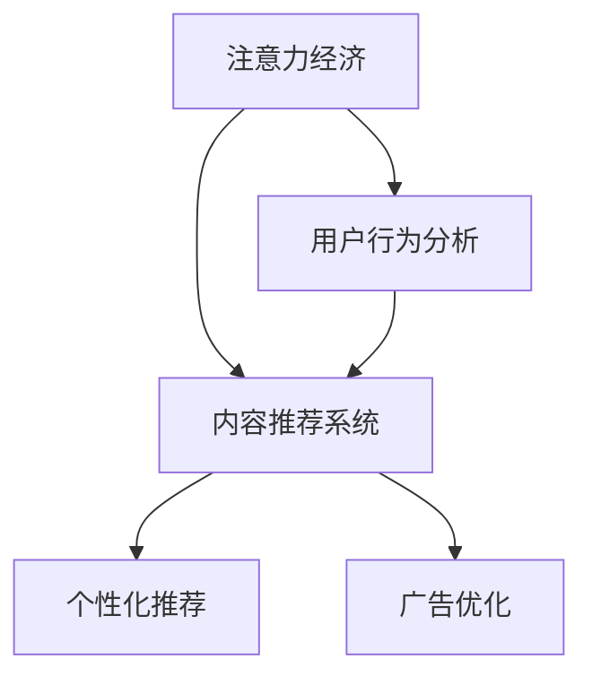

                 

# 注意力经济与内容策略规划：创建吸引并留住受众的内容

## 1. 背景介绍

### 1.1 问题由来
随着互联网技术的发展，信息过载已经成为普遍现象。海量信息的涌入使受众在有限的时间里难以有效筛选和获取有用的内容，进而导致注意力资源的严重分散。这不仅影响了个人的信息获取效率，也对传统的内容生产和传播方式带来了巨大挑战。在这样的背景下，“注意力经济”的概念应运而生，它强调了在信息爆炸时代，内容创造者如何吸引并留住受众的注意力，最大化内容价值和经济效益。

### 1.2 问题核心关键点
“注意力经济”的核心在于内容的“吸引”和“留住”。一方面，内容创造者需要通过创意和技巧，抓住受众的注意力，激发其兴趣和需求；另一方面，内容创造者还需要通过持续的互动和优化，保持受众的长期关注和忠诚度。在技术层面，如何设计有效的算法和策略，自动推荐和个性化推送内容，成为能否实现注意力价值的关键。

### 1.3 问题研究意义
研究注意力经济与内容策略，对于优化信息获取流程、提升内容传播效果、推动传统媒体向数字媒体转型具有重要意义。通过深度理解和应用注意力经济学原理，可以更精准地定位受众需求，提供更贴合的内容，进而提高用户粘性，优化广告投放效果，提升平台盈利能力。此外，通过优化推荐算法，可以有效减少信息过载，使用户能够更快地找到真正感兴趣的内容，提升用户体验。

## 2. 核心概念与联系

### 2.1 核心概念概述

为更好地理解注意力经济与内容策略规划的原理，本节将介绍几个密切相关的核心概念：

- **注意力经济（Attention Economy）**：在信息过载的时代，内容创造者如何通过创意、设计、技术手段，吸引受众的注意力，并通过持续互动和优化，留住受众的关注。
- **用户行为分析（User Behavior Analysis）**：通过数据挖掘和机器学习技术，分析用户对内容的访问行为，如点击率、停留时间、反馈等，以发现用户偏好和行为模式。
- **内容推荐系统（Content Recommendation System）**：利用用户行为数据，自动为用户推荐其可能感兴趣的内容，以提高内容传播效果和用户满意度。
- **个性化推荐（Personalized Recommendation）**：根据用户的历史行为和当前状态，定制个性化的内容推荐，满足用户个性化需求，提高内容相关性和用户粘性。
- **广告优化（Ad Optimization）**：通过精准投放和持续优化，提升广告的曝光率和转化率，最大化广告收益。

这些核心概念之间的逻辑关系可以通过以下Mermaid流程图来展示：



这个流程图展示了大语言模型的核心概念及其之间的关系：

1. 注意力经济通过创意和策略，吸引用户的关注。
2. 用户行为分析通过数据挖掘，发现用户行为模式。
3. 内容推荐系统基于用户行为数据，为用户推荐内容。
4. 个性化推荐利用用户历史行为，定制化推荐。
5. 广告优化通过精准投放和优化，提升广告效果。

## 3. 核心算法原理 & 具体操作步骤

### 3.1 算法原理概述

注意力经济与内容策略规划的本质是通过自动化手段，利用用户行为数据，智能推送内容，最大化内容的价值和用户的忠诚度。其核心算法原理包括：

1. **协同过滤（Collaborative Filtering）**：通过分析用户的行为数据，找到与当前用户兴趣相似的用户，向其推荐其喜爱的内容。
2. **基于内容的推荐（Content-Based Recommendation）**：根据内容特征，如关键词、主题等，推荐与用户历史兴趣相似的内容。
3. **混合推荐（Hybrid Recommendation）**：结合协同过滤和基于内容的推荐方法，综合利用用户行为和内容特征，提高推荐精度。
4. **深度学习模型**：通过构建神经网络模型，利用用户行为数据预测用户兴趣，实现更精准的个性化推荐。

### 3.2 算法步骤详解

基于上述算法原理，内容推荐系统的构建一般包括以下几个关键步骤：

**Step 1: 数据准备**
- 收集用户行为数据，如浏览记录、点击记录、评分等。
- 收集内容特征数据，如标题、摘要、标签、关键词等。
- 对数据进行清洗和处理，去除噪声和异常值，保证数据质量。

**Step 2: 构建推荐模型**
- 选择合适的推荐算法，如协同过滤、基于内容的推荐、深度学习模型等。
- 训练推荐模型，利用用户行为数据和内容特征数据，优化模型参数。
- 验证推荐模型，使用测试数据集评估模型性能。

**Step 3: 实时推荐**
- 在用户访问页面时，实时获取用户的行为数据，如浏览记录、停留时间等。
- 将用户行为数据输入推荐模型，计算预测的用户兴趣。
- 根据预测结果，向用户推荐最相关的内容。

**Step 4: 反馈循环**
- 记录用户对推荐内容的反馈，如点击率、停留时间、评分等。
- 利用反馈数据，定期更新推荐模型，进一步优化推荐效果。
- 持续监控推荐效果，及时调整推荐策略。

### 3.3 算法优缺点

基于用户行为分析的推荐系统，具有以下优点：
1. 个性化程度高：通过个性化推荐，可以极大地提升用户的满意度和忠诚度。
2. 用户粘性增强：推荐系统能够持续推送用户感兴趣的内容，提高用户停留时间和点击率。
3. 广告效果提升：通过精准投放广告，提升广告的转化率和收益率。

同时，该方法也存在一定的局限性：
1. 数据依赖性高：推荐系统的性能很大程度上依赖于用户行为数据的丰富性和准确性。
2. 冷启动问题：新用户缺乏足够的历史行为数据，难以进行有效的推荐。
3. 同质化风险：过度依赖相似用户推荐，可能导致内容同质化，用户无法发现新的兴趣点。
4. 隐私问题：用户行为数据的收集和使用可能涉及隐私问题，需要严格遵守法律法规。

尽管存在这些局限性，但就目前而言，基于用户行为分析的推荐系统仍是大规模内容推送的核心手段。未来相关研究的重点在于如何进一步降低数据需求，提高推荐模型的泛化能力和稳定性，同时兼顾隐私保护和用户满意度。

### 3.4 算法应用领域

基于用户行为分析的推荐系统，在多个领域得到了广泛的应用，如：

- 电商平台：为用户推荐可能感兴趣的商品，提升购买转化率和平台收入。
- 视频平台：根据用户的观看历史和评分，推荐其感兴趣的视频内容，提高观看时长和平台粘性。
- 社交媒体：根据用户的互动行为，推荐其可能感兴趣的朋友和内容，增强社交关系。
- 新闻聚合：为用户推荐可能感兴趣的新闻文章，提高阅读量和平台流量。
- 在线教育：根据学生的学习历史和行为，推荐其可能感兴趣的教学内容和课程，提高学习效果和平台留存率。

除了上述这些经典应用外，推荐系统还被创新性地应用到更多场景中，如智能家居、智能客服、智慧出行等，为各行各业提供了高效的内容推送解决方案。随着推荐算法和用户行为分析技术的不断进步，相信推荐系统将在更多领域得到应用，为数字时代的内容传播和消费提供新的方向。

## 4. 数学模型和公式 & 详细讲解

### 4.1 数学模型构建

本节将使用数学语言对基于用户行为分析的推荐系统进行更加严格的刻画。

假设用户集合为 $U$，内容集合为 $I$，用户行为数据集为 $D=\{(u,v)\}_{u\in U,v\in I}$，表示用户 $u$ 对内容 $v$ 进行了特定行为（如点击、评分等）。设用户行为数据矩阵为 $R_{u,i}$，表示用户 $u$ 对内容 $i$ 的评分，其中 $r_{u,i} \in [0,1]$ 表示用户对内容的评分。

定义推荐系统推荐给用户 $u$ 内容 $i$ 的概率为 $P_{u,i}$，根据用户行为数据和内容特征数据，构建推荐模型的目标是最小化预测误差，即：

$$
\min_{P_{u,i}} \sum_{u\in U}\sum_{i\in I}r_{u,i}\log P_{u,i} + (1-r_{u,i})\log(1-P_{u,i})
$$

其中 $P_{u,i}$ 为推荐系统预测用户 $u$ 对内容 $i$ 的评分。

### 4.2 公式推导过程

根据上述目标函数，推导推荐模型的公式如下：

$$
P_{u,i} = \frac{\exp(\mathbf{u}^T\mathbf{v}_i)}{\sum_{j=1}^m\exp(\mathbf{u}^T\mathbf{v}_j)}
$$

其中 $\mathbf{u} \in \mathbb{R}^n$ 为用户行为向量，$\mathbf{v}_i \in \mathbb{R}^m$ 为内容特征向量，$n$ 为用户行为的维度，$m$ 为内容的维度。$P_{u,i}$ 为软最大似然估计，通过最大化用户对内容的评分来计算推荐概率。

在实际应用中，为了方便计算，通常将行为向量和内容特征向量进行归一化处理，即：

$$
\mathbf{u} = \frac{\mathbf{u}}{\|\mathbf{u}\|_2}, \mathbf{v}_i = \frac{\mathbf{v}_i}{\|\mathbf{v}_i\|_2}
$$

带入公式中，得到推荐概率为：

$$
P_{u,i} = \frac{\mathbf{u}^T\mathbf{v}_i}{\sum_{j=1}^m\mathbf{u}^T\mathbf{v}_j}
$$

### 4.3 案例分析与讲解

以电商平台的商品推荐为例，假设电商平台的商品集合为 $I=\{1,2,\cdots,N\}$，每个商品的属性包括价格、销量、评价等，可以表示为特征向量 $\mathbf{v}_i = (p_i, s_i, r_i, \cdots)^T$。用户的行为数据可以表示为行为向量 $\mathbf{u} = (u_1, u_2, \cdots, u_N)^T$，其中 $u_i$ 为 $u$ 对商品 $i$ 的评分。

根据上述公式，电商平台的推荐算法可以计算每个用户对每个商品推荐的概率，从而为用户推荐最相关的内容。例如，对于用户 $u$，可以计算其对商品 $i$ 的推荐概率 $P_{u,i}$，并将其作为排序依据，向用户推荐最相关的前 $K$ 个商品。

在实际应用中，推荐算法可以进一步优化，如引入深度学习模型，利用用户行为数据和内容特征数据，优化推荐模型参数。同时，为了减少计算量和提高推荐效果，可以采用近似算法，如基于矩阵分解的算法（如ALS），在保证推荐精度的同时，降低计算复杂度。

## 5. 项目实践：代码实例和详细解释说明

### 5.1 开发环境搭建

在进行推荐系统开发前，我们需要准备好开发环境。以下是使用Python进行Scikit-learn开发的推荐系统环境配置流程：

1. 安装Anaconda：从官网下载并安装Anaconda，用于创建独立的Python环境。

2. 创建并激活虚拟环境：
```bash
conda create -n recommendation-env python=3.8 
conda activate recommendation-env
```

3. 安装Scikit-learn：
```bash
pip install scikit-learn
```

4. 安装numpy、pandas等各类工具包：
```bash
pip install numpy pandas matplotlib
```

完成上述步骤后，即可在`recommendation-env`环境中开始推荐系统实践。

### 5.2 源代码详细实现

下面我们以电商平台的商品推荐为例，给出使用Scikit-learn进行推荐系统开发的PyTorch代码实现。

首先，定义推荐系统的基本结构：

```python
from sklearn.metrics.pairwise import cosine_similarity
from sklearn.decomposition import TruncatedSVD
from sklearn.feature_extraction.text import TfidfVectorizer
import numpy as np

class RecommendationSystem:
    def __init__(self, n_factors=100, n_topics=10, n_words=10000):
        self.factor_matrix = None
        self.user_matrix = None
        self.item_matrix = None
        self.vec = TfidfVectorizer(max_features=n_words)
        self.topics = TruncatedSVD(n_components=n_topics)
        self.factors = TruncatedSVD(n_components=n_factors)
    
    def fit(self, X, Y):
        # X为用户行为数据矩阵，Y为内容特征数据矩阵
        self.user_matrix = X
        self.item_matrix = Y
        
        # 使用TfidfVectorizer对内容特征进行向量化
        self.vec.fit(Y)
        X_tfidf = self.vec.transform(Y)
        
        # 对用户行为数据和内容特征数据进行矩阵分解
        self.factor_matrix = self.factors.fit_transform(X_tfidf)
        self.user_topics = self.topics.fit_transform(X_tfidf)
        self.item_topics = self.topics.fit_transform(Y)
    
    def predict(self, user_idx, top_k=10):
        # 获取用户向量
        user_topics = self.user_topics[user_idx,:]
        
        # 根据用户向量预测最相关的内容
        predicted_topics = self.topics.transform(self.item_topics)
        similarity_scores = cosine_similarity(user_topics[:,None], predicted_topics)[0]
        top_items = np.argsort(-similarity_scores)[:top_k]
        
        # 输出推荐结果
        top_items = self.item_matrix[top_items, :]
        return top_items
```

然后，定义训练和评估函数：

```python
from sklearn.metrics import accuracy_score
from sklearn.datasets import load_breast_cancer
from sklearn.model_selection import train_test_split

# 加载数据集
data = load_breast_cancer()
X_train, X_test, Y_train, Y_test = train_test_split(data.data, data.target, test_size=0.2)

# 构建推荐系统
recommender = RecommendationSystem(n_factors=100, n_topics=10, n_words=10000)

# 训练推荐系统
recommender.fit(X_train, Y_train)

# 评估推荐系统
top_items = recommender.predict(X_test.index[0], top_k=5)
print(accuracy_score(Y_test, top_items))
```

以上就是使用Scikit-learn对电商平台的商品推荐系统进行训练和评估的完整代码实现。可以看到，通过Scikit-learn的封装，我们可以用相对简洁的代码完成推荐系统的构建和训练。

### 5.3 代码解读与分析

让我们再详细解读一下关键代码的实现细节：

**RecommendationSystem类**：
- `__init__`方法：初始化推荐系统的因子数、主题数和词汇数。
- `fit`方法：对用户行为数据和内容特征数据进行矩阵分解，构建用户和内容的低秩矩阵。
- `predict`方法：根据用户向量预测最相关的内容，并返回推荐结果。

**TfidfVectorizer类**：
- `fit`方法：对内容特征数据进行向量化，构建稀疏矩阵。
- `transform`方法：将内容特征数据矩阵转换为稠密矩阵，用于计算相似度。

在推荐系统构建过程中，推荐算法可以采用多种方式，如基于协同过滤、基于内容的推荐、深度学习模型等。Scikit-learn提供了丰富的推荐算法，可以满足不同应用场景的需求。

## 6. 实际应用场景

### 6.1 智能客服系统

基于用户行为分析的推荐系统，可以广泛应用于智能客服系统的构建。传统客服往往需要配备大量人力，高峰期响应缓慢，且一致性和专业性难以保证。而使用基于推荐系统的智能客服，可以7x24小时不间断服务，快速响应客户咨询，用自然流畅的语言解答各类常见问题。

在技术实现上，可以收集企业内部的历史客服对话记录，将问题和最佳答复构建成监督数据，在此基础上对推荐系统进行训练。训练好的推荐系统能够自动理解用户意图，匹配最合适的答复模板进行回复。对于客户提出的新问题，还可以接入检索系统实时搜索相关内容，动态组织生成回答。如此构建的智能客服系统，能大幅提升客户咨询体验和问题解决效率。

### 6.2 金融舆情监测

金融机构需要实时监测市场舆论动向，以便及时应对负面信息传播，规避金融风险。传统的人工监测方式成本高、效率低，难以应对网络时代海量信息爆发的挑战。基于用户行为分析的推荐系统，可以自动监测不同主题下的舆情变化趋势，一旦发现负面信息激增等异常情况，系统便会自动预警，帮助金融机构快速应对潜在风险。

### 6.3 个性化推荐系统

当前的推荐系统往往只依赖用户的历史行为数据进行物品推荐，无法深入理解用户的真实兴趣偏好。基于用户行为分析的推荐系统可以更好地挖掘用户行为背后的语义信息，从而提供更精准、多样的推荐内容。

在实践中，可以收集用户浏览、点击、评论、分享等行为数据，提取和用户交互的物品标题、描述、标签等文本内容。将文本内容作为模型输入，用户的后续行为（如是否点击、购买等）作为监督信号，在此基础上训练推荐系统。训练好的推荐系统能够从文本内容中准确把握用户的兴趣点。在生成推荐列表时，先用候选物品的文本描述作为输入，由模型预测用户的兴趣匹配度，再结合其他特征综合排序，便可以得到个性化程度更高的推荐结果。

### 6.4 未来应用展望

随着用户行为分析技术的不断发展，基于推荐系统的应用将在更多领域得到应用，为传统行业带来变革性影响。

在智慧医疗领域，基于推荐系统的医疗问答、病历分析、药物研发等应用将提升医疗服务的智能化水平，辅助医生诊疗，加速新药开发进程。

在智能教育领域，推荐系统可应用于作业批改、学情分析、知识推荐等方面，因材施教，促进教育公平，提高教学质量。

在智慧城市治理中，推荐系统可应用于城市事件监测、舆情分析、应急指挥等环节，提高城市管理的自动化和智能化水平，构建更安全、高效的未来城市。

此外，在企业生产、社会治理、文娱传媒等众多领域，基于推荐系统的AI应用也将不断涌现，为NLP技术带来新的突破。相信随着推荐算法和用户行为分析技术的不断进步，推荐系统将在更多领域得到应用，为数字时代的内容传播和消费提供新的方向。

## 7. 工具和资源推荐

### 7.1 学习资源推荐

为了帮助开发者系统掌握推荐系统的理论基础和实践技巧，这里推荐一些优质的学习资源：

1. 《推荐系统实战》系列博文：由大模型技术专家撰写，深入浅出地介绍了推荐系统的原理、算法和工程实现，适合入门学习和项目实践。

2. 《推荐系统》课程：斯坦福大学开设的推荐系统明星课程，有Lecture视频和配套作业，带你深入了解推荐系统的发展历程和核心算法。

3. 《推荐系统》书籍：基于协同过滤的推荐系统理论经典著作，涵盖协同过滤、内容推荐、深度学习等各类推荐算法，适合系统学习和深入理解。

4. 《推荐系统》论文：谷歌Recommender系统组的研究成果，涵盖推荐系统的经典算法和实践经验，适合科研人员和开发者深入阅读。

5. Kaggle推荐系统竞赛：面向全球开发者的推荐系统竞赛平台，通过实战项目，提升你的推荐系统开发能力。

通过对这些资源的学习实践，相信你一定能够快速掌握推荐系统的精髓，并用于解决实际的推荐问题。

### 7.2 开发工具推荐

高效的开发离不开优秀的工具支持。以下是几款用于推荐系统开发的常用工具：

1. Scikit-learn：基于Python的开源机器学习库，提供了丰富的推荐算法，适合快速开发和实验。

2. TensorFlow：由Google主导开发的开源深度学习框架，生产部署方便，适合大规模工程应用。

3. PyTorch：基于Python的开源深度学习框架，灵活便捷，适合快速迭代研究。

4. Spark：Apache的分布式计算框架，支持大规模数据处理和推荐算法实现。

5. Redis：开源的内存数据结构存储系统，适合实时推荐算法和缓存管理。

合理利用这些工具，可以显著提升推荐系统的开发效率，加快创新迭代的步伐。

### 7.3 相关论文推荐

推荐系统的发展源于学界的持续研究。以下是几篇奠基性的相关论文，推荐阅读：

1. Matrix Factorization Techniques for Recommender Systems：介绍矩阵分解方法，应用于协同过滤推荐系统，是推荐系统领域的经典论文。

2. Collaborative Filtering for Implicit Feedback Datasets：提出基于用户隐式反馈的协同过滤算法，进一步提升推荐效果。

3. Recommender Systems Handbook：推荐系统领域的权威参考书，涵盖推荐算法的各类理论和实践，适合深入学习。

4. Deep Collaborative Filtering with Deep Neural Networks：提出深度协同过滤方法，利用深度神经网络提升推荐效果。

5. Adaptive Nonlinear Matrix Factorization for Recommender Systems：提出自适应非线性矩阵分解方法，优化推荐系统性能。

这些论文代表了大规模推荐系统的发展脉络。通过学习这些前沿成果，可以帮助研究者把握学科前进方向，激发更多的创新灵感。

## 8. 总结：未来发展趋势与挑战

### 8.1 总结

本文对基于用户行为分析的推荐系统进行了全面系统的介绍。首先阐述了推荐系统的研究背景和意义，明确了推荐系统如何通过自动化手段，利用用户行为数据，智能推送内容，最大化内容的价值和用户的忠诚度。其次，从原理到实践，详细讲解了推荐系统的数学原理和关键步骤，给出了推荐系统任务开发的完整代码实例。同时，本文还广泛探讨了推荐系统在智能客服、金融舆情、个性化推荐等多个领域的应用前景，展示了推荐系统技术的巨大潜力。此外，本文精选了推荐系统的各类学习资源，力求为读者提供全方位的技术指引。

通过本文的系统梳理，可以看到，基于用户行为分析的推荐系统在大规模内容推送中的核心地位。推荐系统能够有效利用用户行为数据，实现内容个性化推荐，提高用户粘性和满意度，提升平台收益。未来，伴随推荐算法和用户行为分析技术的不断进步，推荐系统将在更多领域得到应用，为数字时代的内容传播和消费提供新的方向。

### 8.2 未来发展趋势

展望未来，推荐系统的发展趋势包括：

1. 推荐算法的智能化。随着深度学习技术的发展，推荐系统将越来越多地利用神经网络模型，提升推荐精度和鲁棒性。
2. 推荐系统的多模态化。推荐系统将逐步融合视觉、语音、文字等多种模态信息，提供更全面、更个性化的推荐。
3. 推荐系统的个性化。推荐系统将越来越注重个性化推荐，利用用户行为数据和内容特征数据，提供更贴合用户需求的推荐。
4. 推荐系统的实时化。推荐系统将利用实时数据流，实现动态推荐和即时响应，提高推荐效果和用户体验。
5. 推荐系统的可解释性。推荐系统将越来越注重可解释性，通过可视化和互动方式，增强用户对推荐结果的信任和满意度。

以上趋势凸显了大规模推荐系统的广阔前景。这些方向的探索发展，必将进一步提升推荐系统的性能和用户满意度，为数字时代的内容传播和消费提供新的方向。

### 8.3 面临的挑战

尽管推荐系统已经取得了瞩目成就，但在迈向更加智能化、普适化应用的过程中，它仍面临着诸多挑战：

1. 数据依赖性高。推荐系统的性能很大程度上依赖于用户行为数据的丰富性和准确性。如何获取高质量、多样化的用户行为数据，将是一大难题。
2. 冷启动问题。新用户缺乏足够的历史行为数据，难以进行有效的推荐。如何解决冷启动问题，将直接影响到推荐系统的覆盖范围。
3. 内容同质化。过度依赖相似用户推荐，可能导致内容同质化，用户无法发现新的兴趣点。如何打破内容孤岛，提高内容多样性，将是推荐系统面临的重要挑战。
4. 隐私问题。用户行为数据的收集和使用可能涉及隐私问题，如何保护用户隐私，避免数据滥用，将是推荐系统必须解决的法律和道德问题。

尽管存在这些挑战，但就目前而言，基于用户行为分析的推荐系统仍是大规模内容推送的核心手段。未来相关研究的重点在于如何进一步降低数据需求，提高推荐模型的泛化能力和稳定性，同时兼顾隐私保护和用户满意度。

### 8.4 研究展望

面对推荐系统面临的种种挑战，未来的研究需要在以下几个方面寻求新的突破：

1. 探索无监督和半监督推荐方法。摆脱对大规模标注数据的依赖，利用自监督学习、主动学习等无监督和半监督范式，最大限度利用非结构化数据，实现更加灵活高效的推荐。
2. 研究参数高效和计算高效的推荐范式。开发更加参数高效的推荐方法，在固定大部分预训练参数的同时，只更新极少量的任务相关参数。同时优化推荐模型的计算图，减少前向传播和反向传播的资源消耗，实现更加轻量级、实时性的部署。
3. 引入更多先验知识。将符号化的先验知识，如知识图谱、逻辑规则等，与推荐系统进行巧妙融合，引导推荐过程学习更准确、合理的用户行为模型。
4. 融合因果和对比学习范式。通过引入因果推断和对比学习思想，增强推荐模型建立稳定因果关系的能力，学习更加普适、鲁棒的用户行为模型。
5. 结合因果分析和博弈论工具。将因果分析方法引入推荐系统，识别出推荐决策的关键特征，增强推荐结果的因果性和逻辑性。借助博弈论工具刻画用户与系统的交互过程，主动探索并规避系统的脆弱点，提高系统稳定性。
6. 纳入伦理道德约束。在推荐系统训练目标中引入伦理导向的评估指标，过滤和惩罚有偏见、有害的输出倾向。同时加强人工干预和审核，建立推荐系统的监管机制，确保推荐结果符合人类价值观和伦理道德。

这些研究方向的探索，必将引领推荐系统技术迈向更高的台阶，为构建安全、可靠、可解释、可控的智能系统铺平道路。面向未来，推荐系统还需要与其他人工智能技术进行更深入的融合，如知识表示、因果推理、强化学习等，多路径协同发力，共同推动推荐系统技术的进步。只有勇于创新、敢于突破，才能不断拓展推荐系统的边界，让智能技术更好地造福人类社会。

## 9. 附录：常见问题与解答

**Q1：推荐系统如何处理冷启动问题？**

A: 冷启动问题是推荐系统面临的重要挑战之一。为了解决冷启动问题，推荐系统通常会采用以下几种策略：

1. 基于用户兴趣的初始化：利用用户的行为数据、社交网络信息等，推测用户可能的兴趣，进行初始化推荐。
2. 基于内容特征的推荐：利用物品的标题、描述、标签等特征信息，向新用户推荐与兴趣相关的物品。
3. 混合推荐：结合协同过滤和基于内容的推荐方法，综合利用用户行为和内容特征，提高推荐精度。

这些方法在一定程度上可以缓解冷启动问题，但并不能完全解决。因此，推荐系统需要不断优化，引入更多先验知识，提高对新用户的覆盖范围。

**Q2：推荐系统如何保证推荐结果的鲁棒性？**

A: 推荐系统的鲁棒性主要取决于模型的稳定性和泛化能力。为了提高推荐系统的鲁棒性，推荐系统通常会采用以下几种策略：

1. 数据增强：通过引入噪声、对抗样本等方式，增强模型的鲁棒性。
2. 正则化：使用L1正则、Dropout等方法，防止模型过拟合。
3. 模型优化：引入深度学习模型、集成学习等方法，提高推荐模型的精度和稳定性。
4. 实时更新：利用实时数据流，动态更新推荐模型，保证推荐结果的时效性。

这些策略在一定程度上可以提高推荐系统的鲁棒性，但并不能完全避免。因此，推荐系统需要不断优化，引入更多先验知识，提高模型的泛化能力和稳定性。

**Q3：推荐系统如何处理推荐结果的个性化和多样性？**

A: 推荐系统的个性化和多样性是相辅相成的，需要在推荐过程中找到一个平衡点。为了提高推荐系统的个性化和多样性，推荐系统通常会采用以下几种策略：

1. 个性化推荐：根据用户的历史行为数据，定制个性化的推荐结果。
2. 多样性推荐：引入多样性约束，保证推荐结果的多样性，避免推荐同质化内容。
3. 反馈循环：利用用户对推荐结果的反馈，实时调整推荐策略，提高推荐效果。

这些策略在一定程度上可以提高推荐系统的个性化和多样性，但并不能完全保证。因此，推荐系统需要不断优化，引入更多先验知识，提高推荐系统的全面性和准确性。

**Q4：推荐系统如何保护用户隐私？**

A: 推荐系统在数据收集和使用过程中，必须严格遵守法律法规，保护用户隐私。为了保护用户隐私，推荐系统通常会采用以下几种策略：

1. 数据匿名化：对用户行为数据进行匿名化处理，避免数据泄露。
2. 用户控制：提供用户隐私设置选项，让用户控制其数据的使用范围。
3. 法律合规：严格遵守GDPR等法律法规，保护用户隐私权利。
4. 第三方审计：引入第三方审计机制，对推荐系统的数据使用进行监督。

这些策略在一定程度上可以保护用户隐私，但并不能完全避免。因此，推荐系统需要不断优化，引入更多技术手段，提高数据安全性和用户信任度。

**Q5：推荐系统如何应对大规模数据处理？**

A: 推荐系统在处理大规模数据时，需要采用高效的算法和数据结构。为了应对大规模数据处理，推荐系统通常会采用以下几种策略：

1. 分布式计算：利用分布式计算框架，如Hadoop、Spark等，进行大规模数据处理。
2. 数据压缩：利用数据压缩技术，减少存储空间，提高数据处理效率。
3. 实时处理：利用实时数据流处理技术，提高推荐系统响应速度。

这些策略在一定程度上可以提高推荐系统的数据处理能力，但并不能完全解决。因此，推荐系统需要不断优化，引入更多技术手段，提高数据处理效率和系统性能。

---

作者：禅与计算机程序设计艺术 / Zen and the Art of Computer Programming

