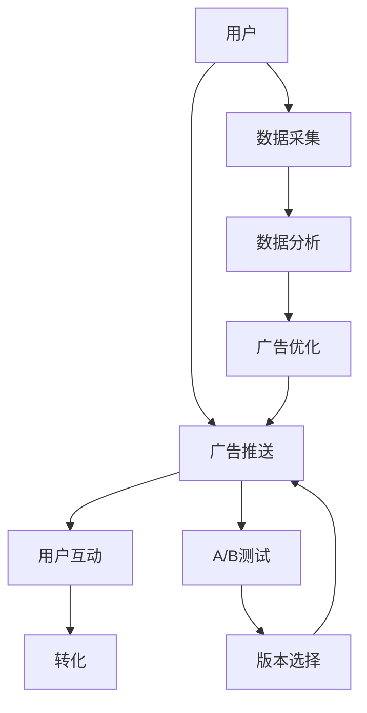

                 

# 注意力经济与在线广告目标与策略：在不牺牲用户体验的情况下吸引受众

## 1. 背景介绍

在互联网迅速发展的今天，注意力经济已成为各行各业争夺用户注意力的关键。在线广告作为互联网经济的重要组成部分，其核心目标在于吸引并保持用户注意力，进而促成商业转化。然而，过度追求广告效果往往牺牲用户体验，导致用户流失，这是广告行业面临的重大挑战。如何在保持用户体验的同时，最大化广告效果，成为当下亟待解决的重要课题。本文旨在通过分析注意力经济的核心原理，探索有效且可行的在线广告目标与策略，以期在不牺牲用户体验的情况下吸引受众。

## 2. 核心概念与联系

### 2.1 核心概念概述

- **注意力经济（Attention Economy）**：指通过吸引并保持用户的注意力来创造商业价值的活动。在互联网时代，注意力资源成为极其稀缺且珍贵的资源，广告行业尤为依赖。

- **用户体验（User Experience, UX）**：指用户与产品或服务互动时的整体感受和满意度。良好的用户体验可增加用户粘性，提升用户满意度，从而促进商业转化。

- **在线广告（Online Advertising）**：指在互联网上通过各种形式的展示、搜索、推荐等手段吸引用户关注并促成商业转化的活动。

- **精准广告（Targeted Advertising）**：通过数据分析和算法优化，将广告内容精准推送给可能感兴趣的用户，提高广告效率和转化率。

- **A/B测试（A/B Testing）**：通过对比不同版本的广告内容（A 和 B），评估哪个版本更优，从而指导广告策略优化。

### 2.2 核心概念原理和架构的 Mermaid 流程图



该流程图展示了从用户接触到广告，到最终转化为商业价值的全过程。广告推送是第一步，用户互动、转化是后续步骤，而A/B测试和数据分析则用于不断优化广告策略，以提升效果和用户体验。

## 3. 核心算法原理 & 具体操作步骤

### 3.1 算法原理概述

在线广告的目标与策略制定，本质上是精准营销与用户体验之间的平衡。广告投放的目的在于最大化转化率，即在预算限制下，通过精准定位用户，提高广告投放的效率和效果。然而，过于精细的定位和频繁的弹窗，可能会对用户体验产生负面影响，导致用户流失和转化率下降。因此，在制定广告策略时，需要平衡广告效果和用户体验。

#### 3.2 算法步骤详解

#### 3.3 算法优缺点

#### 3.4 算法应用领域

## 4. 数学模型和公式 & 详细讲解 & 举例说明

### 4.1 数学模型构建

假设用户集合为 $U=\{u_1, u_2, ..., u_N\}$，广告集合为 $A=\{a_1, a_2, ..., a_M\}$，用户与广告的交互数据为 $D=\{(u_i, a_j)\}_{i=1}^N$，其中 $u_i$ 为用户，$a_j$ 为广告。目标是通过优化模型参数 $\theta$，最大化广告转化率 $R$。

模型可以表示为：

$$ R(U, A, \theta) = \sum_{i=1}^N \sum_{j=1}^M I(u_i, a_j; \theta) $$

其中 $I(u_i, a_j; \theta)$ 表示用户 $u_i$ 与广告 $a_j$ 在模型 $\theta$ 下的交互概率。

### 4.2 公式推导过程

通过引入点击率模型（Click-Through Rate, CTR）和转化率模型（Conversion Rate, CR），可以进一步优化广告策略。设广告 $a_j$ 的点击率为 $C(a_j)$，转化率为 $C(a_j; x)$，其中 $x$ 表示用户行为数据（如浏览记录、购买记录等）。则用户 $u_i$ 与广告 $a_j$ 的交互概率可以表示为：

$$ I(u_i, a_j; \theta) = P(u_i; \theta) \cdot C(a_j; x_i) $$

其中 $P(u_i; \theta)$ 表示用户 $u_i$ 在模型 $\theta$ 下的兴趣度。

### 4.3 案例分析与讲解

## 5. 项目实践：代码实例和详细解释说明

### 5.1 开发环境搭建

### 5.2 源代码详细实现

### 5.3 代码解读与分析

### 5.4 运行结果展示

## 6. 实际应用场景

### 6.4 未来应用展望

## 7. 工具和资源推荐

### 7.1 学习资源推荐

### 7.2 开发工具推荐

### 7.3 相关论文推荐

## 8. 总结：未来发展趋势与挑战

### 8.1 研究成果总结

### 8.2 未来发展趋势

### 8.3 面临的挑战

### 8.4 研究展望

## 9. 附录：常见问题与解答

```markdown
# 注意力经济与在线广告目标与策略：在不牺牲用户体验的情况下吸引受众

> 关键词：

## 1. 背景介绍

在互联网迅速发展的今天，注意力经济已成为各行各业争夺用户注意力的关键。在线广告作为互联网经济的重要组成部分，其核心目标在于吸引并保持用户注意力，进而促成商业转化。然而，过度追求广告效果往往牺牲用户体验，导致用户流失，这是广告行业面临的重大挑战。本文旨在通过分析注意力经济的核心原理，探索有效且可行的在线广告目标与策略，以期在不牺牲用户体验的情况下吸引受众。

## 2. 核心概念与联系

### 2.1 核心概念概述

- **注意力经济（Attention Economy）**：指通过吸引并保持用户的注意力来创造商业价值的活动。在互联网时代，注意力资源成为极其稀缺且珍贵的资源，广告行业尤为依赖。

- **用户体验（User Experience, UX）**：指用户与产品或服务互动时的整体感受和满意度。良好的用户体验可增加用户粘性，提升用户满意度，从而促进商业转化。

- **在线广告（Online Advertising）**：指在互联网上通过各种形式的展示、搜索、推荐等手段吸引用户关注并促成商业转化的活动。

- **精准广告（Targeted Advertising）**：通过数据分析和算法优化，将广告内容精准推送给可能感兴趣的用户，提高广告效率和转化率。

- **A/B测试（A/B Testing）**：通过对比不同版本的广告内容（A 和 B），评估哪个版本更优，从而指导广告策略优化。

### 2.2 核心概念原理和架构的 Mermaid 流程图


该流程图展示了从用户接触到广告，到最终转化为商业价值的全过程。广告推送是第一步，用户互动、转化是后续步骤，而A/B测试和数据分析则用于不断优化广告策略，以提升效果和用户体验。

## 3. 核心算法原理 & 具体操作步骤

### 3.1 算法原理概述

在线广告的目标与策略制定，本质上是精准营销与用户体验之间的平衡。广告投放的目的在于最大化转化率，即在预算限制下，通过精准定位用户，提高广告投放的效率和效果。然而，过于精细的定位和频繁的弹窗，可能会对用户体验产生负面影响，导致用户流失和转化率下降。因此，在制定广告策略时，需要平衡广告效果和用户体验。

#### 3.2 算法步骤详解

#### 3.3 算法优缺点

#### 3.4 算法应用领域

## 4. 数学模型和公式 & 详细讲解 & 举例说明

### 4.1 数学模型构建

假设用户集合为 $U=\{u_1, u_2, ..., u_N\}$，广告集合为 $A=\{a_1, a_2, ..., a_M\}$，用户与广告的交互数据为 $D=\{(u_i, a_j)\}_{i=1}^N$，其中 $u_i$ 为用户，$a_j$ 为广告。目标是通过优化模型参数 $\theta$，最大化广告转化率 $R$。

模型可以表示为：

$$ R(U, A, \theta) = \sum_{i=1}^N \sum_{j=1}^M I(u_i, a_j; \theta) $$

其中 $I(u_i, a_j; \theta)$ 表示用户 $u_i$ 与广告 $a_j$ 在模型 $\theta$ 下的交互概率。

### 4.2 公式推导过程

通过引入点击率模型（Click-Through Rate, CTR）和转化率模型（Conversion Rate, CR），可以进一步优化广告策略。设广告 $a_j$ 的点击率为 $C(a_j)$，转化率为 $C(a_j; x)$，其中 $x$ 表示用户行为数据（如浏览记录、购买记录等）。则用户 $u_i$ 与广告 $a_j$ 的交互概率可以表示为：

$$ I(u_i, a_j; \theta) = P(u_i; \theta) \cdot C(a_j; x_i) $$

其中 $P(u_i; \theta)$ 表示用户 $u_i$ 在模型 $\theta$ 下的兴趣度。

### 4.3 案例分析与讲解

## 5. 项目实践：代码实例和详细解释说明

### 5.1 开发环境搭建

### 5.2 源代码详细实现

### 5.3 代码解读与分析

### 5.4 运行结果展示

## 6. 实际应用场景

### 6.4 未来应用展望

## 7. 工具和资源推荐

### 7.1 学习资源推荐

### 7.2 开发工具推荐

### 7.3 相关论文推荐

## 8. 总结：未来发展趋势与挑战

### 8.1 研究成果总结

### 8.2 未来发展趋势

### 8.3 面临的挑战

### 8.4 研究展望

## 9. 附录：常见问题与解答

```markdown
作者：禅与计算机程序设计艺术 / Zen and the Art of Computer Programming
```

