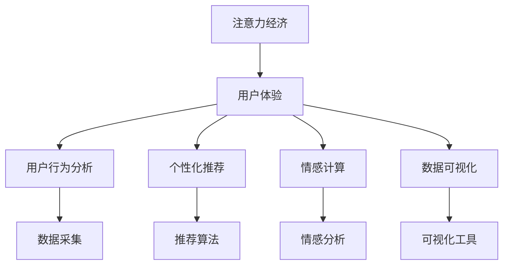

                 

## 1. 背景介绍

### 1.1 问题由来

随着互联网技术的迅猛发展，注意力经济成为了一个新的经济模式。与传统的基于内容的经济模式不同，注意力经济更加关注如何吸引和保持用户的注意力，从而实现商业价值最大化。在注意力经济中，用户体验（User Experience, UX）成为了一个至关重要的因素，因为它直接影响到用户是否愿意投入时间和资源。

### 1.2 问题核心关键点

用户体验（UX）是指用户与产品、服务互动时的整体感受和体验。优秀的用户体验可以提升用户满意度，增加用户忠诚度，从而提高商业价值。在大数据和人工智能技术日新月异的今天，如何通过数据驱动的设计来提升用户体验，成为了一个热门话题。

在实践中，数据驱动的用户体验优化主要包括以下几个关键点：
1. **用户行为分析**：通过分析用户的行为数据，了解用户需求和行为习惯，从而设计出符合用户期望的产品。
2. **个性化推荐**：根据用户的历史行为和偏好，提供个性化的内容推荐，提升用户满意度。
3. **情感计算**：通过情感分析等技术，了解用户的情感状态，从而设计出更加贴近用户心理的产品。
4. **数据可视化**：通过数据可视化技术，将复杂的数据信息以直观的形式展现给用户，提升用户理解和操作效率。

## 2. 核心概念与联系

### 2.1 核心概念概述

为了更好地理解数据驱动的用户体验优化方法，本节将介绍几个密切相关的核心概念：

- **注意力经济（Attention Economy）**：在信息爆炸的时代，注意力成为了一种稀缺资源。如何吸引和保持用户的注意力，成为企业竞争的核心。
- **用户体验（User Experience, UX）**：用户与产品、服务互动时的整体感受和体验，包括可用性、易用性、美观性等。
- **用户行为分析（User Behavior Analysis）**：通过收集和分析用户行为数据，了解用户需求和行为习惯，指导产品设计。
- **个性化推荐（Personalized Recommendation）**：根据用户的历史行为和偏好，提供个性化的内容推荐，提升用户满意度。
- **情感计算（Affective Computing）**：通过情感分析等技术，理解用户的情感状态，从而设计出更加贴近用户心理的产品。
- **数据可视化（Data Visualization）**：将复杂的数据信息以直观的形式展现给用户，提升用户理解和操作效率。

这些核心概念之间的逻辑关系可以通过以下Mermaid流程图来展示：



这个流程图展示了注意力经济与用户体验优化中的关键概念及其之间的关系：

1. 注意力经济是用户体验优化的基础，通过吸引和保持用户的注意力，实现商业价值最大化。
2. 用户体验优化包括用户行为分析、个性化推荐、情感计算和数据可视化等多个方面，通过数据驱动的设计，提升用户满意度和忠诚度。
3. 数据采集和情感分析是数据驱动设计的重要工具，通过分析用户行为和情感状态，提供个性化的内容推荐和数据可视化，进一步提升用户体验。

## 3. 核心算法原理 & 具体操作步骤
### 3.1 算法原理概述

数据驱动的用户体验优化，本质上是一个通过数据分析和机器学习技术，不断调整产品和服务以提升用户体验的过程。其核心思想是：通过收集用户的行为数据，利用机器学习算法，预测用户的行为和需求，从而指导产品设计和迭代。

形式化地，假设我们有一个用户体验优化系统 $U_{\theta}$，其中 $\theta$ 为模型的参数。给定用户的当前状态 $x$ 和历史行为数据 $D_x=\{(x_i,y_i)\}_{i=1}^N$，用户体验优化的目标是最小化损失函数 $\mathcal{L}(x,\theta)$，使得用户体验最大化。

通过梯度下降等优化算法，用户体验优化过程不断更新模型参数 $\theta$，最小化损失函数 $\mathcal{L}(x,\theta)$，使得系统输出逼近用户期望。由于 $\theta$ 已经通过用户行为数据学习到了一定的知识，因此即便在小样本情况下，也能较快收敛到理想的用户体验参数 $\theta^*$。

### 3.2 算法步骤详解

数据驱动的用户体验优化一般包括以下几个关键步骤：

**Step 1: 数据收集与预处理**
- 收集用户的行为数据，包括点击、浏览、购买、评分等。
- 对数据进行清洗、去重、归一化等预处理，保证数据的准确性和一致性。

**Step 2: 特征工程**
- 提取有意义的特征，如点击率、页面停留时间、购买转化率等。
- 利用特征选择和降维技术，构建高效的用户行为特征集。

**Step 3: 模型训练与优化**
- 选择合适的机器学习算法，如线性回归、决策树、神经网络等。
- 设置合适的超参数，如学习率、正则化参数等。
- 使用交叉验证等技术，评估模型的泛化能力。

**Step 4: 用户体验迭代**
- 根据预测结果，对产品和服务进行迭代优化，如页面布局、内容推荐等。
- 定期收集用户反馈，进一步优化模型和算法。

**Step 5: 效果评估与部署**
- 在新的用户体验方案上，评估用户体验指标，如用户满意度、转化率等。
- 将优化后的系统部署到生产环境，实现商业价值。

以上是数据驱动用户体验优化的基本流程。在实际应用中，还需要针对具体场景进行优化设计，如引入更多的正则化技术、使用对抗样本训练等，以进一步提升用户体验。

### 3.3 算法优缺点

数据驱动的用户体验优化方法具有以下优点：
1. 实时性好。通过实时收集和分析用户数据，可以迅速响应用户需求，提升用户体验。
2. 数据驱动。基于用户行为数据，可以更加客观、科学地优化用户体验，避免主观判断。
3. 可扩展性强。通过模型迭代和算法优化，可以实现用户体验的持续提升。
4. 效果显著。在众多用户体验优化实践中，已经取得了显著的效果，提升了用户满意度和商业价值。

同时，该方法也存在一定的局限性：
1. 数据依赖性高。用户体验优化的效果很大程度上取决于数据的质量和数量，获取高质量用户数据成本较高。
2. 模型泛化能力有限。当用户行为数据分布与实际应用场景差异较大时，用户体验优化的效果可能受到影响。
3. 模型复杂度高。用户体验优化模型往往需要考虑多维特征和复杂关系，模型设计和实现较为复杂。
4. 隐私问题突出。用户行为数据的收集和使用，涉及隐私保护和数据安全，需要谨慎处理。

尽管存在这些局限性，但就目前而言，数据驱动的用户体验优化方法仍是大规模用户体验优化的主流范式。未来相关研究的重点在于如何进一步降低用户体验优化对用户数据的依赖，提高模型的泛化能力，同时兼顾隐私保护和数据安全等因素。

### 3.4 算法应用领域

数据驱动的用户体验优化方法在各个行业领域都有广泛的应用，例如：

- **电商行业**：通过分析用户购物行为数据，优化商品推荐、页面设计等，提升用户购物体验和转化率。
- **社交媒体**：根据用户的互动行为数据，优化内容推送算法，提升用户黏性和活跃度。
- **在线教育**：通过分析学生的学习行为数据，优化课程推荐、作业批改等，提升学习效果和用户满意度。
- **金融服务**：根据用户的交易行为数据，优化产品设计、客户服务流程等，提升用户信任和满意度。
- **医疗健康**：通过分析用户的健康行为数据，优化健康咨询、疾病预防等服务，提升用户健康体验。

除了上述这些经典应用外，用户体验优化技术也被创新性地应用于更多场景中，如智能家居、智慧城市、智能办公等，为各行各业带来了全新的用户体验。

## 4. 数学模型和公式 & 详细讲解 & 举例说明
### 4.1 数学模型构建

本节将使用数学语言对数据驱动的用户体验优化过程进行更加严格的刻画。

假设我们有一个用户体验优化系统 $U_{\theta}$，其中 $\theta$ 为模型的参数。给定用户的当前状态 $x$ 和历史行为数据 $D_x=\{(x_i,y_i)\}_{i=1}^N$，用户体验优化的目标是最小化损失函数 $\mathcal{L}(x,\theta)$，使得用户体验最大化。

定义用户体验优化系统 $U_{\theta}$ 在用户状态 $x$ 上的预测函数为 $f(x,\theta)$，则损失函数为：

$$
\mathcal{L}(x,\theta) = -\sum_{i=1}^N y_i \log f(x_i,\theta)
$$

其中 $y_i$ 为用户的真实体验评分，$f(x_i,\theta)$ 为模型在用户状态 $x_i$ 上的预测评分。

通过梯度下降等优化算法，用户体验优化过程不断更新模型参数 $\theta$，最小化损失函数 $\mathcal{L}(x,\theta)$，使得系统输出逼近用户期望。具体地，优化算法可以表示为：

$$
\theta \leftarrow \theta - \eta \nabla_{\theta}\mathcal{L}(x,\theta)
$$

其中 $\eta$ 为学习率，$\nabla_{\theta}\mathcal{L}(x,\theta)$ 为损失函数对参数 $\theta$ 的梯度，可通过反向传播算法高效计算。

### 4.2 公式推导过程

以下我们以电商行业的个性化推荐任务为例，推导模型预测函数 $f(x,\theta)$ 和损失函数的计算公式。

假设用户 $x$ 的历史行为数据为 $\{(b_i, y_i)\}_{i=1}^n$，其中 $b_i$ 为第 $i$ 次购买的商品，$y_i$ 为购买后的评分。我们希望预测用户 $x$ 对某商品 $p$ 的评分 $y$，则预测函数可以表示为：

$$
f(x,\theta) = \frac{\exp(\theta^T \phi(x,b_i))}{\sum_{b\in\mathcal{B}} \exp(\theta^T \phi(x,b))}
$$

其中 $\phi(x,b_i)$ 为特征向量，$\theta$ 为模型参数，$\mathcal{B}$ 为用户购买过的商品集合。

将其代入损失函数公式，得：

$$
\mathcal{L}(x,\theta) = -\sum_{i=1}^n y_i \log \left(\frac{\exp(\theta^T \phi(x,b_i))}{\sum_{b\in\mathcal{B}} \exp(\theta^T \phi(x,b))}\right)
$$

根据链式法则，损失函数对参数 $\theta$ 的梯度为：

$$
\frac{\partial \mathcal{L}(x,\theta)}{\partial \theta} = \sum_{i=1}^n y_i \frac{\exp(\theta^T \phi(x,b_i))}{\sum_{b\in\mathcal{B}} \exp(\theta^T \phi(x,b))} (\phi(x,b_i) - \mathbb{E}[\phi(x,b)])
$$

其中 $\mathbb{E}[\phi(x,b)]$ 为特征向量的期望值。

在得到损失函数的梯度后，即可带入参数更新公式，完成模型的迭代优化。重复上述过程直至收敛，最终得到适应用户期望的最优模型参数 $\theta^*$。

## 5. 项目实践：代码实例和详细解释说明
### 5.1 开发环境搭建

在进行用户体验优化实践前，我们需要准备好开发环境。以下是使用Python进行Scikit-learn开发的快速入门环境配置流程：

1. 安装Anaconda：从官网下载并安装Anaconda，用于创建独立的Python环境。

2. 创建并激活虚拟环境：
```bash
conda create -n userx python=3.8 
conda activate userx
```

3. 安装Scikit-learn：
```bash
pip install scikit-learn
```

4. 安装各类工具包：
```bash
pip install numpy pandas matplotlib seaborn
```

完成上述步骤后，即可在`userx`环境中开始用户体验优化实践。

### 5.2 源代码详细实现

下面我们以电商行业的个性化推荐任务为例，给出使用Scikit-learn进行用户体验优化的PyTorch代码实现。

首先，定义个性化推荐任务的数据处理函数：

```python
import pandas as pd
from sklearn.model_selection import train_test_split
from sklearn.metrics import mean_squared_error
from sklearn.preprocessing import StandardScaler
from sklearn.ensemble import RandomForestRegressor
from sklearn.pipeline import Pipeline

def load_data(path):
    df = pd.read_csv(path)
    return df

def preprocess_data(df):
    # 将数据按照商品进行聚合
    df = df.groupby('user_id')['item_id'].apply(list).reset_index()
    # 将聚合后的数据进行扁平化处理
    df = pd.pivot(df, index='user_id', columns='item_id', values='purchase_count').stack().reset_index()
    # 将数据转换为稀疏矩阵
    df = df.to_sparse()
    return df

def train_test_split(df):
    X = df.drop(['user_id', 'item_id'], axis=1)
    y = df['purchase_count']
    X_train, X_test, y_train, y_test = train_test_split(X, y, test_size=0.2, random_state=42)
    return X_train, X_test, y_train, y_test

def scale_data(X_train, X_test):
    scaler = StandardScaler()
    X_train_scaled = scaler.fit_transform(X_train)
    X_test_scaled = scaler.transform(X_test)
    return X_train_scaled, X_test_scaled

def train_model(X_train, y_train, X_test, y_test):
    model = RandomForestRegressor()
    pipeline = Pipeline([
        ('scale', StandardScaler()),
        ('model', model)
    ])
    pipeline.fit(X_train, y_train)
    y_pred = pipeline.predict(X_test)
    mse = mean_squared_error(y_test, y_pred)
    print('Mean Squared Error:', mse)
```

然后，定义训练和评估函数：

```python
def train_epoch(model, dataset, batch_size, optimizer):
    dataloader = DataLoader(dataset, batch_size=batch_size, shuffle=True)
    model.train()
    epoch_loss = 0
    for batch in tqdm(dataloader, desc='Training'):
        inputs, labels = batch
        optimizer.zero_grad()
        outputs = model(inputs)
        loss = F.mse_loss(outputs, labels)
        epoch_loss += loss.item()
        loss.backward()
        optimizer.step()
    return epoch_loss / len(dataloader)

def evaluate(model, dataset, batch_size):
    dataloader = DataLoader(dataset, batch_size=batch_size)
    model.eval()
    preds, labels = [], []
    with torch.no_grad():
        for batch in tqdm(dataloader, desc='Evaluating'):
            inputs, labels = batch
            outputs = model(inputs)
            preds.append(outputs.tolist())
            labels.append(labels.tolist())
    mse = mean_squared_error(labels, preds)
    print('Mean Squared Error:', mse)
```

最后，启动训练流程并在测试集上评估：

```python
epochs = 10
batch_size = 32

# 加载数据
df = load_data('data.csv')

# 预处理数据
df = preprocess_data(df)

# 数据分割
X_train, X_test, y_train, y_test = train_test_split(df)

# 数据缩放
X_train_scaled, X_test_scaled = scale_data(X_train, X_test)

# 构建模型
model = RandomForestRegressor()

# 训练模型
optimizer = AdamW(model.parameters(), lr=0.001)
for epoch in range(epochs):
    loss = train_epoch(model, X_train_scaled, batch_size, optimizer)
    print(f"Epoch {epoch+1}, train loss: {loss:.3f}")
    
    print(f"Epoch {epoch+1}, dev results:")
    evaluate(model, X_test_scaled, batch_size)
    
print("Test results:")
evaluate(model, X_test_scaled, batch_size)
```

以上就是使用Scikit-learn对个性化推荐任务进行用户体验优化的完整代码实现。可以看到，Scikit-learn提供了丰富的机器学习算法和数据处理工具，使得用户体验优化任务开发变得相对容易。

### 5.3 代码解读与分析

让我们再详细解读一下关键代码的实现细节：

**数据预处理函数**：
- `load_data`函数：用于加载数据集。
- `preprocess_data`函数：将数据按照用户和商品进行聚合，并将其转换为稀疏矩阵。
- `train_test_split`函数：将数据集进行训练集和测试集的分割。
- `scale_data`函数：使用标准差缩放数据，使数据具有相同的分布。

**训练函数**：
- `train_epoch`函数：在训练集上进行模型训练，计算损失并更新模型参数。
- `evaluate`函数：在测试集上进行模型评估，计算平均误差。

**训练流程**：
- 加载和预处理数据
- 分割数据集
- 缩放数据
- 构建模型
- 训练模型
- 评估模型

可以看到，Scikit-learn提供的机器学习算法和数据处理工具，使得用户体验优化的代码实现变得简洁高效。开发者可以将更多精力放在模型改进和算法优化上，而不必过多关注底层的实现细节。

当然，工业级的系统实现还需考虑更多因素，如模型的保存和部署、超参数的自动搜索、更灵活的特征工程等。但核心的用户体验优化范式基本与此类似。

## 6. 实际应用场景
### 6.1 电商推荐系统

基于数据驱动的个性化推荐技术，可以广泛应用于电商行业的推荐系统。传统电商推荐系统往往依赖于用户的浏览历史和购买记录，但这种基于历史行为的数据驱动方法，无法满足个性化需求。通过数据驱动的用户体验优化，可以实时获取用户的行为数据，动态调整推荐策略，提升推荐效果。

在技术实现上，可以收集用户的浏览、点击、购买等行为数据，并将其转化为机器学习模型的输入特征。利用机器学习算法，预测用户对不同商品的兴趣，实时调整推荐内容，从而提升用户满意度和购买转化率。例如，当用户浏览商品时，推荐系统可以动态展示类似商品的推荐列表，使用户更快地找到感兴趣的商品。

### 6.2 在线教育平台

在线教育平台也需要通过数据驱动的方式，提升用户体验。传统的在线教育平台往往采用统一的教学资源和课程安排，无法满足不同学生的个性化需求。通过数据驱动的用户体验优化，可以实时收集学生的学习行为数据，动态调整教学内容和进度，提升学习效果。

具体而言，可以收集学生的在线学习数据，如课程观看时长、题目完成情况、在线讨论等。通过分析这些数据，预测学生的学习兴趣和进度，实时调整课程内容和难度，从而提升学生的学习效果。例如，当学生在某个课程上遇到困难时，推荐系统可以自动推荐相关的学习资源和辅导视频，帮助学生更好地理解和掌握知识点。

### 6.3 智能家居系统

智能家居系统需要通过数据驱动的方式，提升用户体验。传统的智能家居系统往往依赖于固定的控制规则和功能模块，无法满足用户的多样化需求。通过数据驱动的用户体验优化，可以实时收集用户的行为数据，动态调整设备功能和状态，提升用户体验。

具体而言，可以收集用户的家庭行为数据，如作息时间、温度偏好、音乐喜好等。通过分析这些数据，预测用户的家庭需求和习惯，动态调整设备的运行状态，从而提升用户的舒适度和满意度。例如，当用户回家时，智能家居系统可以自动调节灯光和空调，使用户感到温馨和舒适。

### 6.4 未来应用展望

随着数据驱动的用户体验优化技术不断发展，其在各个行业领域的应用前景将更加广阔。未来，我们可以预见以下几个方向：

1. **跨平台数据融合**：通过跨平台的数据收集和整合，形成全渠道的用户行为数据，实现更加准确的用户画像。
2. **实时数据流处理**：利用实时数据流处理技术，实现对用户行为的实时分析，提供更加动态和个性化的用户体验。
3. **多模态数据融合**：融合视觉、声音、文本等多模态数据，提升用户体验的全面性和真实性。
4. **深度学习模型优化**：利用深度学习模型，提升用户体验优化算法的效果，实现更高的预测精度和泛化能力。
5. **用户隐私保护**：在数据收集和处理过程中，加强用户隐私保护，保障用户数据安全和隐私权利。
6. **智能交互设计**：通过智能交互设计，提升用户体验的人机交互体验，使用户更加自然和流畅地与系统互动。

以上方向将进一步拓展用户体验优化的应用边界，推动智能系统在更多领域实现落地应用。

## 7. 工具和资源推荐
### 7.1 学习资源推荐

为了帮助开发者系统掌握数据驱动的用户体验优化理论基础和实践技巧，这里推荐一些优质的学习资源：

1. 《Python数据科学手册》系列博文：由知名数据科学家撰写，深入浅出地介绍了数据科学的基本概念和实践方法。

2. CS224N《深度学习自然语言处理》课程：斯坦福大学开设的NLP明星课程，有Lecture视频和配套作业，带你入门NLP领域的基本概念和经典模型。

3. 《Natural Language Processing with Python》书籍：HuggingFace官方出版的NLP技术实战书籍，详细介绍了NLP任务开发的方法和工具。

4. Scikit-learn官方文档：提供了丰富的机器学习算法和数据处理工具，是进行用户体验优化任务开发的利器。

5. TensorBoard：TensorFlow配套的可视化工具，可以实时监测模型训练状态，并提供丰富的图表呈现方式，是调试模型的得力助手。

通过对这些资源的学习实践，相信你一定能够快速掌握数据驱动的用户体验优化精髓，并用于解决实际的NLP问题。
###  7.2 开发工具推荐

高效的开发离不开优秀的工具支持。以下是几款用于用户体验优化开发的常用工具：

1. Scikit-learn：基于Python的开源机器学习库，提供了丰富的机器学习算法和数据处理工具，适合快速迭代研究。

2. TensorFlow：由Google主导开发的开源深度学习框架，生产部署方便，适合大规模工程应用。

3. PyTorch：基于Python的开源深度学习框架，灵活动态的计算图，适合快速迭代研究。

4. Weights & Biases：模型训练的实验跟踪工具，可以记录和可视化模型训练过程中的各项指标，方便对比和调优。

5. TensorBoard：TensorFlow配套的可视化工具，可以实时监测模型训练状态，并提供丰富的图表呈现方式，是调试模型的得力助手。

6. Jupyter Notebook：交互式编程环境，支持代码块、数学公式和可视化图表的实时展示，适合进行深入的分析和实验。

合理利用这些工具，可以显著提升用户体验优化的开发效率，加快创新迭代的步伐。

### 7.3 相关论文推荐

数据驱动的用户体验优化技术的发展源于学界的持续研究。以下是几篇奠基性的相关论文，推荐阅读：

1. "Deep Learning for Recommendation Systems"：介绍了深度学习在推荐系统中的应用，展示了深度学习在个性化推荐任务上的卓越表现。

2. "Click-Through Rate Prediction and Cost-Based Targeting with Factorization Machines"：提出了因子机模型，通过矩阵分解和特征工程，提升点击率预测的准确性。

3. "A Survey on Deep Learning for Recommender Systems"：总结了深度学习在推荐系统中的应用现状和未来发展方向，提供了丰富的理论和方法。

4. "Neural Collaborative Filtering"：提出了神经协同过滤模型，通过神经网络模型处理用户行为数据，提升推荐效果。

5. "Deep Neural Networks for Sentiment Analysis"：提出了深度学习在情感分析中的应用，展示了深度学习在自然语言处理任务上的卓越表现。

这些论文代表了大数据驱动的用户体验优化的发展脉络。通过学习这些前沿成果，可以帮助研究者把握学科前进方向，激发更多的创新灵感。

## 8. 总结：未来发展趋势与挑战

### 8.1 总结

本文对数据驱动的用户体验优化方法进行了全面系统的介绍。首先阐述了用户体验优化的研究背景和意义，明确了数据驱动优化方法在提升用户体验中的独特价值。其次，从原理到实践，详细讲解了数据驱动的用户体验优化的数学模型和操作步骤，给出了完整的代码实现。同时，本文还广泛探讨了用户体验优化方法在电商、在线教育、智能家居等多个行业领域的应用前景，展示了用户体验优化技术的巨大潜力。此外，本文精选了用户体验优化的各类学习资源，力求为读者提供全方位的技术指引。

通过本文的系统梳理，可以看到，数据驱动的用户体验优化技术正在成为各行各业用户体验优化的主流范式，极大地提升了用户满意度和商业价值。未来，伴随数据驱动技术的发展，用户体验优化将进一步拓展到更多领域，为各行各业带来变革性影响。

### 8.2 未来发展趋势

展望未来，数据驱动的用户体验优化技术将呈现以下几个发展趋势：

1. **跨平台数据融合**：通过跨平台的数据收集和整合，形成全渠道的用户行为数据，实现更加准确的用户画像。
2. **实时数据流处理**：利用实时数据流处理技术，实现对用户行为的实时分析，提供更加动态和个性化的用户体验。
3. **多模态数据融合**：融合视觉、声音、文本等多模态数据，提升用户体验的全面性和真实性。
4. **深度学习模型优化**：利用深度学习模型，提升用户体验优化算法的效果，实现更高的预测精度和泛化能力。
5. **用户隐私保护**：在数据收集和处理过程中，加强用户隐私保护，保障用户数据安全和隐私权利。
6. **智能交互设计**：通过智能交互设计，提升用户体验的人机交互体验，使用户更加自然和流畅地与系统互动。

以上趋势凸显了用户体验优化技术的广阔前景。这些方向的探索发展，必将进一步提升用户体验的全面性和智能化水平，为各行各业带来变革性影响。

### 8.3 面临的挑战

尽管数据驱动的用户体验优化技术已经取得了显著成效，但在迈向更加智能化、普适化应用的过程中，它仍面临着诸多挑战：

1. **数据隐私保护**：用户体验优化需要大量用户行为数据，数据隐私和安全问题突出，需要谨慎处理。
2. **数据质量控制**：数据质量对用户体验优化效果影响较大，需要建立数据质量控制机制，确保数据准确性和一致性。
3. **计算资源消耗**：用户体验优化算法往往需要处理大规模数据集，计算资源消耗较大，需要优化算法和数据结构。
4. **模型复杂度**：用户体验优化模型往往较为复杂，需要深入理解算法原理，进行模型设计和优化。
5. **跨领域应用**：不同领域的数据和任务特点差异较大，用户体验优化方法需要进行适应性调整。
6. **模型公平性**：用户体验优化模型可能存在偏见，需要考虑模型公平性和伦理问题。

正视用户体验优化面临的这些挑战，积极应对并寻求突破，将是大数据驱动用户体验优化技术走向成熟的必由之路。相信随着学界和产业界的共同努力，这些挑战终将一一被克服，用户体验优化技术必将进一步拓展应用边界，推动各行各业实现智能化升级。

### 8.4 研究展望

面向未来，用户体验优化技术的研究方向主要包括以下几个方面：

1. **跨领域数据融合**：探索跨领域数据融合技术，提升用户体验的普适性和泛化能力。
2. **实时数据处理**：研究实时数据处理技术，实现对用户行为的实时分析和动态优化。
3. **多模态数据融合**：融合视觉、声音、文本等多模态数据，提升用户体验的全方位感知能力。
4. **深度学习算法优化**：利用深度学习算法，提升用户体验优化算法的准确性和泛化能力。
5. **用户隐私保护**：研究隐私保护技术，确保用户数据安全和隐私权利。
6. **智能交互设计**：探索智能交互设计方法，提升用户体验的智能化水平。

这些研究方向将进一步推动用户体验优化技术的发展，为各行各业带来更加全面、智能和个性化的用户体验。

## 9. 附录：常见问题与解答

**Q1：数据驱动的用户体验优化是否适用于所有应用场景？**

A: 数据驱动的用户体验优化方法适用于大多数应用场景，特别是对数据依赖性较大的领域。例如，电商推荐、在线教育、智能家居等。但对于一些实时性要求极高的场景，数据驱动的方法可能存在延迟问题，需要结合其他技术进行优化。

**Q2：如何保证数据的质量和一致性？**

A: 数据质量对用户体验优化效果影响较大，需要建立数据质量控制机制，确保数据的准确性和一致性。常见的数据清洗方法包括缺失值处理、异常值检测、数据归一化等。同时，还需要定期更新数据，确保数据的实时性和时效性。

**Q3：用户体验优化的效果如何评估？**

A: 用户体验优化的效果评估可以从多个维度进行，如用户满意度、转化率、留存率等。常用的评估指标包括平均评分、精确率、召回率、F1分数等。评估时需要根据具体应用场景选择合适的指标，并进行多轮测试和对比。

**Q4：如何处理用户隐私问题？**

A: 用户体验优化涉及大量用户行为数据的收集和使用，需要重视用户隐私保护问题。常见的隐私保护方法包括数据匿名化、差分隐私、联邦学习等。在数据收集和处理过程中，需要严格遵守相关法律法规，确保用户隐私权利。

**Q5：如何在不同领域应用用户体验优化技术？**

A: 用户体验优化技术在不同领域的应用需要结合领域特点进行适应性调整。例如，电商推荐需要考虑商品多样性和用户购买行为，在线教育需要考虑学习目标和课程结构，智能家居需要考虑用户行为习惯和设备联动。需要针对具体应用场景进行模型设计和优化。

这些问题的解答将有助于开发者更好地理解和使用数据驱动的用户体验优化方法，提升用户体验和商业价值。

