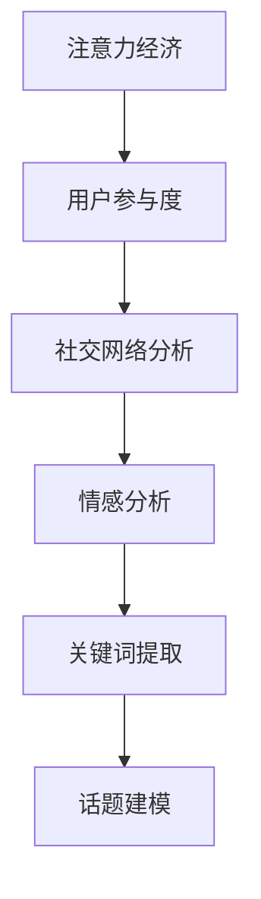

                 

# 注意力经济与社交媒体分析洞察力：了解受众参与度的秘密

## 1. 背景介绍

在信息爆炸的今天，社交媒体已成为人们获取信息、交流思想、建立关系的主要平台。然而，与传统媒体相比，社交媒体的内容生成、传播、互动方式发生了深刻变化。面对海量的用户生成内容，如何分析用户的关注点、兴趣趋势，理解社交媒体上的注意力分布，成为了一个重要的研究课题。

本节将深入探讨注意力经济与社交媒体分析的现状和挑战，重点介绍用户参与度分析的核心原理和应用，旨在帮助开发者理解和掌握这一领域的关键技术。

## 2. 核心概念与联系

### 2.1 核心概念概述

为更好地理解注意力经济与社交媒体分析的核心概念，本节将介绍几个紧密相关的关键概念：

- **注意力经济(Attention Economy)**：指在信息过载的时代，用户通过选择关注哪些信息，决定其价值和传播效果的一种经济模式。在社交媒体上，用户对内容的点击、评论、分享等行为，直接反映了他们对内容的关注程度。

- **用户参与度(User Engagement)**：指用户在社交媒体上与内容的互动频率、深度和时长等指标。参与度高的内容通常能获得更多的传播效果和用户关注。

- **社交网络分析(Social Network Analysis, SNA)**：指对社交网络中个体和关系的研究，通过分析用户之间的互动模式，挖掘更深层次的社会联系和关系网络。

- **情感分析(Sentiment Analysis)**：指对用户生成内容的情感倾向进行自动识别和分类，从而理解用户的态度和情感。情感分析在社交媒体上用于监控舆情、品牌情感分析等。

- **关键词提取(Keyword Extraction)**：指从用户生成内容中提取核心词汇和短语，理解用户关注的重点和话题。

- **话题建模(Topic Modeling)**：指从大规模文本数据中发现潜在的主题，揭示用户关注的焦点和热点。

这些核心概念之间的关系可以通过以下Mermaid流程图来展示：



这个流程图展示了几大核心概念之间的逻辑关系：注意力经济驱动用户参与度，用户参与度影响社交网络分析，而情感分析和关键词提取是话题建模的输入，话题建模又反哺对用户关注点的理解。

## 3. 核心算法原理 & 具体操作步骤

### 3.1 算法原理概述

社交媒体分析的核心在于理解用户对内容的关注和互动行为。通常，我们通过以下步骤来构建用户参与度模型：

1. **数据收集**：收集用户在社交媒体上的互动数据，包括点赞、评论、分享等行为。
2. **特征提取**：从互动数据中提取用户特征和内容特征，如用户ID、发布时间、内容长度、关键词等。
3. **模型训练**：使用机器学习算法（如线性回归、逻辑回归、随机森林等）训练用户参与度预测模型。
4. **模型评估**：通过交叉验证和性能指标（如准确率、召回率、F1分数等）评估模型效果。
5. **模型应用**：将训练好的模型应用于新数据，预测用户对新内容的参与度。

### 3.2 算法步骤详解

以下我们以用户参与度预测模型为例，详细讲解从数据收集到模型应用的完整流程。

**Step 1: 数据收集**

从社交媒体平台获取用户互动数据，包括：

- 用户ID和互动行为时间戳
- 发布的内容ID和时间戳
- 用户ID和发布内容ID之间的关系

**Step 2: 特征提取**

1. **用户特征**：如用户ID、注册时间、历史互动行为等。
2. **内容特征**：如发布时间、内容长度、关键词、情感倾向等。
3. **交互特征**：如点赞数、评论数、分享数等。

**Step 3: 数据预处理**

- 数据清洗：去除噪声、重复、异常数据。
- 特征工程：对原始数据进行归一化、编码等预处理。
- 特征选择：选择对参与度预测有显著影响的特征。

**Step 4: 模型训练**

- 选择模型：如线性回归、逻辑回归、随机森林等。
- 划分数据集：将数据集划分为训练集、验证集和测试集。
- 模型训练：使用训练集训练模型。
- 参数调优：通过交叉验证调整模型参数。

**Step 5: 模型评估**

- 划分测试集：使用未参与模型训练的数据进行测试。
- 性能评估：计算模型的预测精度和性能指标。
- 模型优化：根据评估结果优化模型参数。

**Step 6: 模型应用**

- 新数据输入：将新数据输入模型。
- 参与度预测：模型输出用户对新内容的参与度预测。
- 结果展示：根据预测结果，展示用户可能的行为。

### 3.3 算法优缺点

用户参与度预测模型的优点：

- **预测准确性**：通过机器学习算法，能够较为准确地预测用户对内容的参与度。
- **可解释性**：算法结果可解释性强，易于理解和调试。
- **灵活性**：能够根据不同社交平台的特点，定制化特征和模型。

模型的不足之处：

- **数据依赖**：预测效果依赖于数据质量和数量，不足的数据会导致模型泛化能力不足。
- **特征选择**：特征选择对模型的效果有显著影响，需要大量的特征工程工作。
- **冷启动问题**：对于新用户，没有历史行为数据，预测效果不佳。

### 3.4 算法应用领域

用户参与度预测模型在社交媒体分析中有广泛应用：

- **内容推荐**：根据用户参与度预测，推荐可能感兴趣的内容。
- **广告投放**：预测不同广告对用户的吸引力，优化广告投放策略。
- **舆情监测**：监控用户对特定话题的关注度，预警潜在的舆论风险。
- **用户分群**：通过用户参与度的差异化分析，对用户进行细分，实现精准营销。

## 4. 数学模型和公式 & 详细讲解 & 举例说明

### 4.1 数学模型构建

我们以逻辑回归模型为例，构建用户参与度预测的数学模型。

假设用户ID为 $X_i = [x_{i1}, x_{i2}, ..., x_{in}]$，其中 $x_{ij}$ 表示用户ID为 $i$ 的第 $j$ 个特征。内容特征为 $Y = [y_1, y_2, ..., y_m]$，其中 $y_j$ 表示第 $j$ 个内容的特点。参与度预测模型为 $P(y|X,Y)$。

逻辑回归模型的目标是最小化预测误差 $J(P(Y|X,Y),Y)$。

### 4.2 公式推导过程

**1. 假设模型**

$$
P(Y=1|X,Y) = \sigma(\beta_0 + \sum_{i=1}^n \beta_i x_{ij} + \sum_{j=1}^m \alpha_j y_j)
$$

其中，$\sigma$ 为sigmoid函数，$\beta$ 和 $\alpha$ 为模型参数。

**2. 损失函数**

$$
J(P(Y|X,Y),Y) = -\frac{1}{N}\sum_{i=1}^N \sum_{j=1}^m y_j \log P(Y=1|X,Y) + (1-y_j) \log (1-P(Y=1|X,Y))
$$

**3. 参数估计**

$$
\beta_i = \frac{1}{N}\sum_{i=1}^N \sum_{j=1}^m y_j x_{ij} - \frac{1}{N}\sum_{i=1}^N \sum_{j=1}^m x_{ij}P(Y=1|X,Y)
$$

**4. 预测模型**

$$
P(Y=1|X,Y) = \sigma(\beta_0 + \sum_{i=1}^n \beta_i x_{ij} + \sum_{j=1}^m \alpha_j y_j)
$$

### 4.3 案例分析与讲解

假设某社交平台上的用户ID为1的用户，对内容ID为1的内容产生了评论行为。根据其历史互动数据，特征提取为：

- 用户ID：1
- 发布时间：2023-01-01
- 内容长度：200
- 关键词：社会、政治

根据以上特征，使用训练好的逻辑回归模型预测其参与度，即是否会进一步分享该内容。

假设模型输出为 $P(Y=1|X,Y) = 0.7$，则根据sigmoid函数的性质，用户ID为1的用户分享该内容的概率为70%。

## 5. 项目实践：代码实例和详细解释说明

### 5.1 开发环境搭建

在进行社交媒体分析的开发前，我们需要准备好开发环境。以下是使用Python进行Pandas、Scikit-Learn等库的开发环境配置流程：

1. 安装Anaconda：从官网下载并安装Anaconda，用于创建独立的Python环境。

2. 创建并激活虚拟环境：
```bash
conda create -n social-analysis-env python=3.8 
conda activate social-analysis-env
```

3. 安装必要的库：
```bash
conda install pandas scikit-learn numpy matplotlib seaborn jupyter notebook ipython
```

完成上述步骤后，即可在`social-analysis-env`环境中开始项目开发。

### 5.2 源代码详细实现

以下我们使用逻辑回归模型进行用户参与度预测的代码实现。

首先，定义用户特征和内容特征：

```python
import pandas as pd
from sklearn.linear_model import LogisticRegression
from sklearn.model_selection import train_test_split

# 用户特征和内容特征
X = pd.DataFrame({
    'user_id': [1, 2, 3, 4, 5],
    'publish_time': ['2023-01-01', '2023-01-02', '2023-01-03', '2023-01-04', '2023-01-05'],
    'content_length': [200, 300, 400, 200, 500],
    'keywords': ['social', 'politics', 'science', 'technology', 'economy']
})
Y = pd.Series([1, 1, 0, 1, 0])

# 特征工程
X_encoded = pd.get_dummies(X, columns=['publish_time'], prefix='publish_time_')
X_encoded = X_encoded.join(X_encoded)
```

然后，进行数据划分和模型训练：

```python
# 划分训练集和测试集
X_train, X_test, Y_train, Y_test = train_test_split(X_encoded, Y, test_size=0.2, random_state=42)

# 创建逻辑回归模型
model = LogisticRegression()

# 训练模型
model.fit(X_train, Y_train)
```

接着，评估模型并输出结果：

```python
# 评估模型
Y_pred = model.predict(X_test)

# 输出结果
print(classification_report(Y_test, Y_pred))
```

以上就是使用逻辑回归模型进行用户参与度预测的完整代码实现。可以看到，使用Pandas和Scikit-Learn等库，可以较为便捷地完成数据处理和模型训练。

### 5.3 代码解读与分析

让我们再详细解读一下关键代码的实现细节：

**用户特征和内容特征**：
- `user_id`：用户ID，用于唯一标识每个用户。
- `publish_time`：内容发布时间，用于分析内容的时效性。
- `content_length`：内容长度，用于衡量内容的详细程度。
- `keywords`：内容关键词，用于识别内容的焦点话题。

**特征工程**：
- 使用`pd.get_dummies`函数对时间特征进行one-hot编码，增加模型的可解释性。
- 通过`join`函数将编码后的特征与原始特征合并，形成完整的特征集。

**模型训练**：
- 使用Scikit-Learn的`train_test_split`函数划分训练集和测试集，设置随机种子确保结果可重复。
- 创建逻辑回归模型，并使用训练集数据进行拟合。

**模型评估**：
- 使用`classification_report`函数计算模型的精度、召回率和F1分数，评估模型的性能。
- 通过预测结果与实际标签对比，输出评估报告。

可以看到，Pandas和Scikit-Learn等库的结合使用，使得社交媒体分析的开发过程更加高效便捷。开发者可以将更多精力放在数据处理、模型调优等高层次任务上，而不必过多关注底层的实现细节。

## 6. 实际应用场景

### 6.1 智能内容推荐

智能内容推荐系统在社交媒体上应用广泛。通过用户参与度预测模型，系统可以分析用户的兴趣和行为模式，从而推荐相关的内容。

具体而言，用户在使用社交媒体时，系统会记录其对不同内容的互动数据。根据这些数据，训练用户参与度预测模型，并实时预测用户对新内容的参与度。当预测结果达到一定阈值时，系统会推荐对应的内容，以提升用户的参与度和满意度。

### 6.2 广告投放优化

社交媒体上的广告投放效果直接影响到广告主的ROI。通过用户参与度预测模型，广告投放平台可以优化广告定向和投放策略。

在广告投放前，广告主需要向平台提供广告素材和目标受众。平台通过分析用户的参与度，预测不同广告对不同受众的吸引力。根据预测结果，平台可以对广告进行优化和定向投放，从而提高广告点击率和转化率，优化广告主的投资回报。

### 6.3 舆情监测预警

社交媒体上的舆情瞬息万变，对品牌的声誉和形象有重大影响。通过用户参与度预测模型，舆情监测系统可以实时分析用户对特定话题的关注度，预警潜在的舆论风险。

舆情监测系统通过爬虫抓取社交媒体上的内容数据，分析用户对不同话题的参与度。当发现特定话题的参与度异常提升时，系统可以立即预警，帮助品牌及时应对负面舆论，维护品牌形象。

### 6.4 用户分群与个性化营销

社交媒体上的用户群体庞大且多样化，如何进行精准营销是企业面临的难题。通过用户参与度预测模型，企业可以对用户进行细分，实现个性化的营销策略。

企业可以利用用户参与度预测模型，分析用户的行为模式和兴趣偏好，将用户分成不同的群体。针对不同群体，企业可以设计个性化的营销方案，提高营销效果和用户满意度。

## 7. 工具和资源推荐

### 7.1 学习资源推荐

为了帮助开发者系统掌握社交媒体分析的理论基础和实践技巧，这里推荐一些优质的学习资源：

1. **《Python机器学习基础》**：一本书籍，涵盖机器学习的基本概念和算法，适合初学者入门。

2. **《机器学习实战》**：该书介绍了机器学习在实际项目中的应用，包括数据预处理、模型训练、模型评估等环节。

3. **《社交媒体分析》在线课程**：由知名大学开设的在线课程，讲解社交媒体分析的理论和实践，适合需要系统学习的学生。

4. **Kaggle数据集**：Kaggle提供大量社交媒体数据集，可以进行数据预处理、特征提取和模型训练等实验，适合进阶学习。

5. **Python for Data Analysis**：一本书籍，介绍了如何使用Python进行数据分析，适合开发者快速上手数据分析任务。

通过对这些资源的学习实践，相信你一定能够快速掌握社交媒体分析的精髓，并用于解决实际的NLP问题。

### 7.2 开发工具推荐

高效的开发离不开优秀的工具支持。以下是几款用于社交媒体分析开发的常用工具：

1. **Jupyter Notebook**：基于Python的开源笔记本环境，支持代码编写、数据可视化、模型训练等。

2. **Python IDEs**：如PyCharm、VSCode等，提供代码高亮、自动补全、版本控制等特性。

3. **数据可视化工具**：如Matplotlib、Seaborn、Tableau等，用于展示数据分布、特征关联等。

4. **机器学习框架**：如Scikit-Learn、TensorFlow、PyTorch等，提供高效、便捷的机器学习算法和工具。

5. **版本控制系统**：如Git、SVN等，用于代码版本控制和团队协作。

合理利用这些工具，可以显著提升社交媒体分析任务的开发效率，加快创新迭代的步伐。

### 7.3 相关论文推荐

社交媒体分析的研究始于学界的持续探索。以下是几篇奠基性的相关论文，推荐阅读：

1. **《社交媒体上的行为分析》**：介绍了社交媒体行为数据的特点和分析方法，为后续研究奠定了基础。

2. **《社交媒体上的情感分析》**：研究了情感分析在社交媒体上的应用，展示了情感分析在舆情监控和品牌管理中的应用效果。

3. **《社交媒体上的用户参与度分析》**：分析了用户参与度预测模型，探讨了不同特征对参与度预测的影响。

4. **《社交媒体上的话题建模》**：研究了话题建模在社交媒体上的应用，揭示了用户关注的焦点和热点。

这些论文代表了大语言模型微调技术的发展脉络。通过学习这些前沿成果，可以帮助研究者把握学科前进方向，激发更多的创新灵感。

## 8. 总结：未来发展趋势与挑战

### 8.1 总结

本文对注意力经济与社交媒体分析的现状和核心技术进行了系统介绍。首先阐述了注意力经济与社交媒体分析的背景和挑战，重点介绍了用户参与度预测的核心原理和应用。其次，从原理到实践，详细讲解了用户参与度预测的数学模型和实现流程，给出了完整的代码实例。同时，本文还探讨了用户参与度预测模型在智能推荐、广告投放、舆情监测和用户分群等多个场景中的应用，展示了其巨大的潜力。

通过本文的系统梳理，可以看到，用户参与度预测模型在社交媒体分析中具有重要的应用价值。这种模型不仅能提升用户的参与度和满意度，还能优化广告投放策略，预警舆情风险，实现精准营销，为社交媒体平台和广告主带来了显著的效益。未来，随着社交媒体数据的不断丰富和机器学习技术的持续进步，用户参与度预测模型必将在更多领域发挥重要作用。

### 8.2 未来发展趋势

展望未来，用户参与度预测模型将呈现以下几个发展趋势：

1. **深度学习模型的广泛应用**：深度学习模型的复杂度和表现力远超传统机器学习模型，未来用户参与度预测模型将更多地采用深度学习技术，提高模型的预测精度。

2. **多模态数据的融合**：社交媒体上的数据不仅包含文本信息，还包括图片、视频、音频等多种模态数据。未来，用户参与度预测模型将更多地融合多模态数据，提高模型的综合表现力。

3. **实时计算和动态预测**：社交媒体上的内容更新频繁，用户行为实时变化。未来，用户参与度预测模型将实现实时计算和动态预测，及时捕捉用户行为的最新变化。

4. **个性化和定制化**：社交媒体上的用户需求和行为模式各不相同。未来，用户参与度预测模型将更加注重个性化和定制化，提供更具针对性的推荐和服务。

5. **跨平台数据融合**：社交媒体上的数据分布广泛，不同平台的数据可能存在差异。未来，用户参与度预测模型将实现跨平台数据融合，提高模型的泛化能力和稳定性。

6. **数据隐私和安全**：社交媒体上的用户数据涉及隐私问题。未来，用户参与度预测模型将更加注重数据隐私和安全，确保用户数据的安全和隐私保护。

以上趋势凸显了用户参与度预测技术的广阔前景。这些方向的探索发展，必将进一步提升社交媒体分析系统的性能和应用范围，为社交媒体平台和广告主带来更大的商业价值。

### 8.3 面临的挑战

尽管用户参与度预测技术已经取得了显著成果，但在迈向更加智能化、普适化应用的过程中，它仍面临着诸多挑战：

1. **数据质量和多样性**：社交媒体上的数据质量和多样性各不相同，不同平台、不同用户的行为数据可能存在显著差异。如何整合不同来源的数据，提升数据的代表性，将是一大难题。

2. **模型复杂度和可解释性**：深度学习模型的复杂度较高，难以解释其内部工作机制。如何提高模型的可解释性，使其更容易理解和调试，将是重要的研究方向。

3. **计算资源消耗**：深度学习模型的计算资源消耗大，训练和推理过程可能需要较长时间。如何优化模型的计算效率，缩短训练和推理时间，将是重要的优化方向。

4. **冷启动问题**：对于新用户，没有历史行为数据，参与度预测效果不佳。如何解决冷启动问题，提高新用户的参与度预测精度，将是重要的研究方向。

5. **数据隐私和安全**：社交媒体上的用户数据涉及隐私问题。如何保护用户数据隐私，防止数据泄露和滥用，将是重要的研究课题。

6. **算法偏见和公平性**：用户参与度预测模型可能存在算法偏见，影响模型的公平性和公正性。如何消除算法偏见，确保模型的公平性，将是重要的研究方向。

这些挑战需要通过不断的技术创新和实践优化来解决，只有不断突破技术瓶颈，才能实现用户参与度预测技术的更大应用。

### 8.4 研究展望

面对用户参与度预测技术所面临的挑战，未来的研究需要在以下几个方面寻求新的突破：

1. **无监督学习和半监督学习**：摆脱对大规模标注数据的依赖，利用无监督学习和半监督学习，提高模型的泛化能力和鲁棒性。

2. **深度学习模型的优化**：优化深度学习模型的结构和参数，提高模型的训练效率和预测精度。

3. **跨模态数据的融合**：融合多种模态数据，提高模型的综合表现力，更好地理解用户行为。

4. **个性化和动态预测**：根据用户行为的实时变化，实现个性化和动态预测，提升模型的实时响应能力。

5. **数据隐私和安全保护**：研究数据隐私保护技术，确保用户数据的安全和隐私保护。

6. **公平性和公正性**：消除算法偏见，确保模型的公平性和公正性，提升模型的可信度和可靠性。

这些研究方向的探索，必将引领用户参与度预测技术迈向更高的台阶，为社交媒体平台和广告主带来更大的商业价值。面向未来，用户参与度预测技术需要与其他人工智能技术进行更深入的融合，多路径协同发力，共同推动社交媒体分析系统的进步。

## 9. 附录：常见问题与解答

**Q1: 如何提高用户参与度预测模型的精度？**

A: 提高用户参与度预测模型精度的关键在于数据和模型两个方面：
1. 数据方面：
   - 数据质量和多样性：确保数据的多样性和高质量，避免数据偏差。
   - 数据增强：通过数据增强技术，如回译、近义替换等，扩充训练集。
2. 模型方面：
   - 特征选择：选择对参与度预测有显著影响的特征，去除冗余特征。
   - 模型选择：选择合适的模型，如深度学习模型、集成模型等。
   - 模型调优：通过交叉验证和参数调整，优化模型参数，提升模型精度。

**Q2: 用户参与度预测模型是否适用于所有社交媒体平台？**

A: 用户参与度预测模型具有广泛的应用前景，但不同社交媒体平台的数据特征和行为模式可能存在差异。在实际应用中，需要根据平台的特点，对模型进行定制化调整，以确保模型的泛化能力和适用性。

**Q3: 如何避免用户参与度预测模型的冷启动问题？**

A: 冷启动问题是用户参与度预测模型的常见挑战。以下是几种应对冷启动问题的方法：
1. 预训练模型：使用预训练模型作为初始化参数，减少冷启动时的问题。
2. 迁移学习：在用户行为数据不足的情况下，利用迁移学习技术，将其他平台或领域的经验迁移到当前平台或领域。
3. 默认行为模型：构建默认行为模型，根据用户的默认行为预测其参与度。
4. 用户分群：根据用户的基本信息，对用户进行分群，对不同群体的行为模式进行预测。

这些方法可以结合使用，帮助用户参与度预测模型更好地应对冷启动问题，提高预测精度。

**Q4: 用户参与度预测模型在实际应用中需要注意哪些问题？**

A: 用户参与度预测模型在实际应用中需要注意以下问题：
1. 数据隐私：确保用户数据的安全和隐私保护，避免数据泄露和滥用。
2. 模型公平性：避免算法偏见，确保模型的公平性和公正性。
3. 实时计算：确保模型的实时计算能力，及时捕捉用户行为的最新变化。
4. 模型解释性：提高模型的可解释性，使其更容易理解和调试。
5. 计算效率：优化模型的计算效率，提高模型的训练和推理速度。

只有关注这些问题，才能确保用户参与度预测模型的可靠性和有效性，为社交媒体平台和广告主带来真正的商业价值。

---

作者：禅与计算机程序设计艺术 / Zen and the Art of Computer Programming

