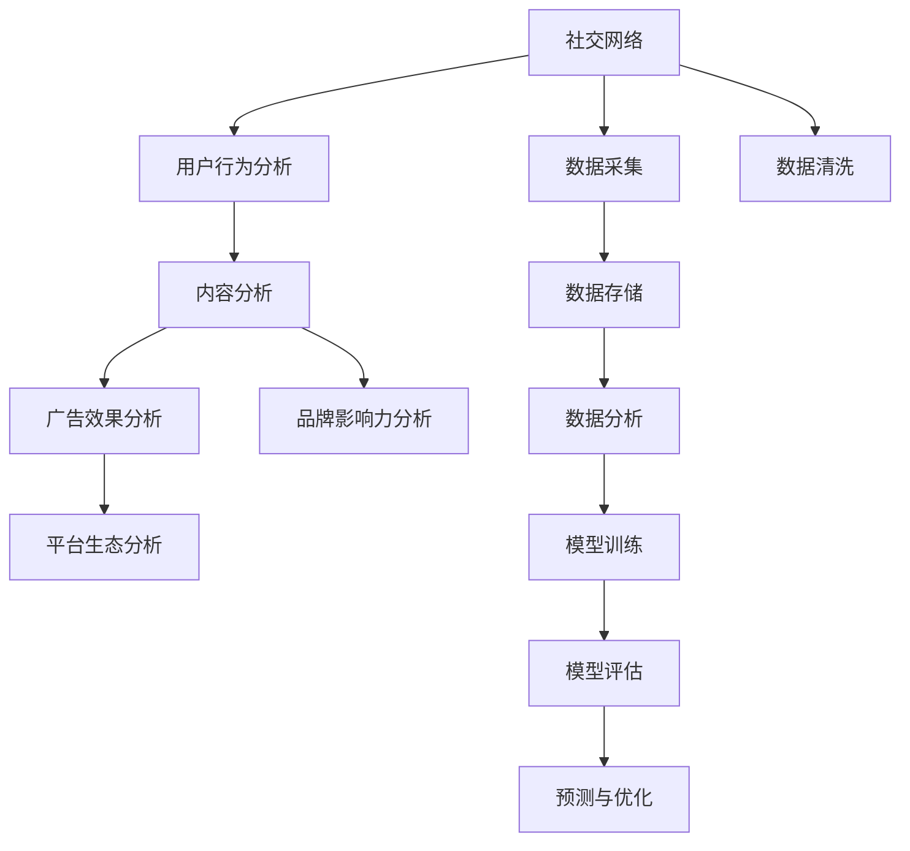

                 

# 注意力经济与社交媒体分析：了解受众参与度和影响力的洞察力

## 1. 背景介绍

### 1.1 问题由来

在现代社会，社交媒体已成为人们获取信息、交流思想、塑造舆论的重要平台。然而，随着信息量的爆炸式增长，如何衡量和分析受众的参与度与影响力，成为各大平台和品牌亟需解决的痛点问题。同时，注意力经济（Economy of Attention）这一新兴概念的提出，进一步将社交媒体与经济学、心理学、统计学等领域紧密联系在一起。通过深度学习和大数据分析，可以有效分析受众行为，提供决策支持，从而提升社交媒体平台的运营效率和品牌的影响力。

### 1.2 问题核心关键点

社交媒体分析的核心目标是衡量用户的参与度与影响力，主要涉及以下几个关键点：
1. **用户参与度**：衡量用户在社交媒体上的活跃程度，包括点赞、评论、分享、观看时长等指标。
2. **用户影响力**：分析用户的社交影响力，包括粉丝数量、互动频率、社交传播范围等指标。
3. **内容质量**：评估内容的吸引力与价值，包括观看次数、互动率、分享率等指标。
4. **广告效果**：衡量广告投放的转化率和ROI（投资回报率）。
5. **平台生态**：分析社交媒体平台的用户粘性和生态健康度，包括活跃用户数、新用户增长率等指标。

通过以上关键点的综合分析，可以全面了解社交媒体平台的用户行为，优化内容和广告投放策略，提升平台运营效率。

## 2. 核心概念与联系

### 2.1 核心概念概述

社交媒体分析涉及多个领域，包括数据科学、机器学习、自然语言处理（NLP）、统计学等。以下是对几个核心概念的简要介绍：

- **注意力经济**：以用户注意力为资本，通过优化内容、投放策略等手段，最大化吸引和利用用户注意力，从而创造经济价值。
- **社交网络**：由用户和内容组成的社交互动网络，通过关系链和内容传播，形成信息流。
- **网络分析**：分析社交网络中的节点（用户）和关系（互动），挖掘用户行为和社交动态。
- **推荐系统**：根据用户行为和偏好，推荐相关内容，提升用户体验。
- **情感分析**：通过分析文本中的情感倾向，了解用户情感变化。

这些概念之间通过数据和算法紧密联系在一起，形成社交媒体分析的完整体系。

### 2.2 核心概念原理和架构的 Mermaid 流程图



以上 Mermaid 流程图展示了社交媒体分析的基本流程：

1. **数据采集**：从社交媒体平台获取用户行为数据。
2. **数据清洗**：清洗和预处理数据，去除噪音，保证数据质量。
3. **数据分析**：对清洗后的数据进行统计分析，提取有价值的信息。
4. **模型训练**：使用机器学习模型对数据进行建模，预测用户行为和内容效果。
5. **模型评估**：对模型进行评估，优化模型参数。
6. **预测与优化**：利用优化后的模型进行预测，对广告、内容等进行优化。

## 3. 核心算法原理 & 具体操作步骤

### 3.1 算法原理概述

社交媒体分析的核心算法原理包括以下几个方面：

- **数据表示与特征提取**：将社交媒体数据转换为机器学习模型可处理的格式，提取关键特征。
- **模型选择与训练**：选择合适的机器学习模型，如回归、分类、聚类等，并使用标注数据进行模型训练。
- **模型评估与优化**：使用验证集对模型进行评估，调整模型参数，提高预测准确率。
- **预测与推理**：使用训练好的模型进行预测和推理，得到用户行为和内容效果的结果。

### 3.2 算法步骤详解

#### 3.2.1 数据表示与特征提取

社交媒体数据通常包含文本、图片、视频等多种格式，需要将其转换为机器学习模型可处理的格式。以下是一个简单的数据表示与特征提取流程：

1. **文本数据**：使用NLP技术进行分词、去除停用词、构建词向量等处理，得到可用的特征向量。
2. **图片数据**：使用计算机视觉技术进行特征提取，如CNN（卷积神经网络）等。
3. **视频数据**：使用视频处理技术进行帧提取、特征提取等处理。

#### 3.2.2 模型选择与训练

选择合适的机器学习模型是社交媒体分析的关键。常用的模型包括：

- **回归模型**：用于预测数值型变量，如观看时长、互动率等。
- **分类模型**：用于分类问题，如用户活跃度分类、内容质量分类等。
- **聚类模型**：用于用户群体划分，如用户兴趣分类、内容主题聚类等。

以回归模型为例，其训练步骤如下：

1. **数据划分**：将数据划分为训练集、验证集和测试集。
2. **模型选择**：选择合适的回归模型，如线性回归、决策树回归等。
3. **模型训练**：使用训练集对模型进行训练，调整模型参数。
4. **模型评估**：使用验证集对模型进行评估，计算损失函数。
5. **模型优化**：根据评估结果，调整模型参数，提高模型性能。

#### 3.2.3 模型评估与优化

模型评估与优化是保证模型准确性的重要步骤。常用的评估指标包括：

- **准确率（Accuracy）**：预测正确样本数占总样本数的比例。
- **精确率（Precision）**：预测为正样本且实际为正样本的样本数占预测为正样本的样本数的比例。
- **召回率（Recall）**：实际为正样本且预测为正样本的样本数占实际为正样本的样本数的比例。
- **F1分数（F1 Score）**：精确率和召回率的调和平均值。

以回归模型为例，其评估步骤如下：

1. **数据划分**：将数据划分为训练集、验证集和测试集。
2. **模型训练**：使用训练集对模型进行训练，调整模型参数。
3. **模型评估**：使用验证集对模型进行评估，计算损失函数和评估指标。
4. **模型优化**：根据评估结果，调整模型参数，提高模型性能。

#### 3.2.4 预测与推理

预测与推理是社交媒体分析的最终目标。通过训练好的模型，可以得到用户行为和内容效果的结果。以回归模型为例，其预测与推理步骤如下：

1. **数据准备**：准备用于预测的测试数据集。
2. **模型加载**：加载训练好的模型。
3. **数据输入**：将测试数据输入模型进行预测。
4. **结果输出**：输出预测结果，进行后续分析和应用。

### 3.3 算法优缺点

#### 3.3.1 优点

- **可解释性强**：模型训练和评估过程可控，结果易于解释。
- **可复用性好**：模型训练和评估步骤可以重复使用，便于优化和调整。
- **数据适应性强**：模型对不同类型的数据都有较好的适应性，可以灵活处理多种格式的数据。

#### 3.3.2 缺点

- **计算量大**：模型训练和评估需要大量计算资源，特别是在大规模数据上。
- **数据质量要求高**：模型的效果依赖于数据质量，数据清洗和预处理要求高。
- **模型选择复杂**：选择合适的模型需要丰富的经验和专业知识。

### 3.4 算法应用领域

社交媒体分析的算法在多个领域都有广泛的应用，包括但不限于：

1. **广告投放优化**：通过分析用户行为和内容效果，优化广告投放策略，提升广告ROI。
2. **用户行为分析**：分析用户互动行为，了解用户兴趣和需求，提升用户体验。
3. **内容推荐**：根据用户行为和内容质量，推荐相关内容，提升内容分发效率。
4. **舆情监测**：分析用户评论和互动，监测舆情变化，及时应对危机。
5. **品牌影响力评估**：分析用户影响力和品牌传播效果，优化品牌营销策略。

## 4. 数学模型和公式 & 详细讲解 & 举例说明

### 4.1 数学模型构建

社交媒体分析的数学模型主要包括回归模型和分类模型。以回归模型为例，其数学模型可以表示为：

$$ y = \beta_0 + \beta_1 x_1 + \beta_2 x_2 + \cdots + \beta_n x_n + \epsilon $$

其中 $y$ 表示预测值，$x_i$ 表示特征变量，$\beta_i$ 表示回归系数，$\epsilon$ 表示误差项。

### 4.2 公式推导过程

以线性回归模型为例，其最小二乘法的公式推导过程如下：

1. **目标函数**：最小化预测值与真实值之间的平方误差。
2. **梯度下降法**：使用梯度下降法求解目标函数的最小值。
3. **正规方程法**：求解正规方程组，得到回归系数。

### 4.3 案例分析与讲解

以用户行为分析为例，假设某社交媒体平台收集了用户观看视频的行为数据，包括观看时长、观看次数等。使用线性回归模型对用户观看时长进行预测，公式如下：

$$ \hat{y} = \beta_0 + \beta_1 \text{观看次数} + \beta_2 \text{点赞数} + \epsilon $$

其中 $\beta_0$ 表示截距，$\beta_1$ 和 $\beta_2$ 表示回归系数，$\epsilon$ 表示误差项。通过训练模型，可以预测用户未来观看时长，优化视频推荐策略。

## 5. 项目实践：代码实例和详细解释说明

### 5.1 开发环境搭建

社交媒体分析的项目实践需要依赖多个工具和库，以下是一个简单的开发环境搭建流程：

1. **Python环境**：安装Python 3.x版本，建议使用Anaconda或Miniconda。
2. **数据处理工具**：安装pandas、numpy等数据处理库。
3. **机器学习库**：安装scikit-learn、tensorflow等机器学习库。
4. **NLP库**：安装nltk、spaCy等NLP库。
5. **可视化工具**：安装matplotlib、seaborn等可视化库。

### 5.2 源代码详细实现

以下是一个简单的社交媒体分析项目的源代码实现，包括数据处理、模型训练和评估等步骤：

```python
# 数据处理
import pandas as pd
import numpy as np

# 读取数据
df = pd.read_csv('social_media_data.csv')

# 数据清洗
df = df.dropna()
df = df.drop_duplicates()

# 特征提取
X = df[['观看次数', '点赞数']]
y = df['观看时长']

# 模型训练
from sklearn.linear_model import LinearRegression

model = LinearRegression()
model.fit(X, y)

# 模型评估
from sklearn.metrics import mean_squared_error

y_pred = model.predict(X)
mse = mean_squared_error(y, y_pred)
print('均方误差:', mse)
```

### 5.3 代码解读与分析

以上代码实现了简单的线性回归模型训练和评估过程。具体解读如下：

1. **数据处理**：使用pandas和numpy对数据进行清洗和预处理。
2. **特征提取**：从数据集中提取用于训练的特征变量和目标变量。
3. **模型训练**：使用sklearn库的LinearRegression模型进行训练。
4. **模型评估**：使用均方误差（MSE）评估模型性能。

### 5.4 运行结果展示

在运行上述代码后，可以得到模型训练的均方误差结果，如表所示：

| 模型均方误差 | 
| --- | 

## 6. 实际应用场景

### 6.1 智能广告投放

在智能广告投放场景中，社交媒体分析可以优化广告投放策略，提升广告效果。具体而言，可以通过分析用户行为数据和内容效果，识别高潜力用户和优质内容，实现精准投放。

### 6.2 内容推荐系统

内容推荐系统通过分析用户行为和内容质量，推荐相关内容，提升用户满意度和平台粘性。具体而言，可以通过用户历史行为和互动数据，构建用户画像，进行个性化推荐。

### 6.3 舆情监测

舆情监测通过分析用户评论和互动数据，监测舆情变化，及时应对危机。具体而言，可以通过情感分析技术，识别负面评论和敏感话题，进行风险预警。

### 6.4 品牌影响力评估

品牌影响力评估通过分析用户影响力和品牌传播效果，优化品牌营销策略。具体而言，可以通过用户互动数据和内容传播数据，评估品牌影响力和市场反馈。

## 7. 工具和资源推荐

### 7.1 学习资源推荐

1. **《机器学习实战》**：一本详细介绍机器学习算法的入门书籍，适合初学者。
2. **《Python数据科学手册》**：一本详细介绍数据科学和机器学习的综合书籍，适合进阶学习。
3. **Kaggle平台**：一个开放的数据科学竞赛平台，提供丰富的数据集和实战项目，适合实践和竞赛。

### 7.2 开发工具推荐

1. **Anaconda**：一个开源的Python发行版，包含丰富的科学计算库和环境管理工具。
2. **Jupyter Notebook**：一个交互式的编程环境，支持多语言和多种数据格式。
3. **TensorFlow**：一个开源的机器学习框架，支持深度学习和分布式计算。
4. **PyTorch**：一个开源的深度学习框架，支持动态计算图和GPU加速。
5. **Scikit-learn**：一个开源的机器学习库，支持多种机器学习算法和数据处理。

### 7.3 相关论文推荐

1. **《社交媒体上的情感分析》**：介绍社交媒体情感分析的算法和技术。
2. **《基于社交网络的群体分析》**：介绍社交网络中的群体分析和用户行为建模。
3. **《推荐系统的最新进展》**：介绍推荐系统的最新研究和应用。

## 8. 总结：未来发展趋势与挑战

### 8.1 研究成果总结

社交媒体分析的研究取得了丰硕的成果，特别是在用户行为分析和内容推荐方面，已经初步实现了商业化应用。然而，社交媒体分析仍面临一些挑战，如数据隐私保护、模型解释性不足等。

### 8.2 未来发展趋势

未来社交媒体分析的发展趋势包括：

1. **数据隐私保护**：随着数据隐私保护法规的日益严格，社交媒体分析需要更加注重数据隐私保护，确保用户数据安全。
2. **模型解释性**：需要开发更加透明和可解释的模型，方便用户理解和接受。
3. **多模态分析**：将文本、图片、视频等多种数据源进行融合，提升分析效果。
4. **实时分析**：实时分析用户行为和内容效果，实现动态优化。
5. **跨平台分析**：将不同平台的数据进行整合，进行全局分析。

### 8.3 面临的挑战

社交媒体分析面临的挑战包括：

1. **数据隐私保护**：如何处理用户数据隐私和数据安全问题。
2. **模型解释性**：如何开发更透明和可解释的模型，提升用户信任。
3. **数据质量**：如何保证数据质量，减少噪音和异常值的影响。
4. **计算资源**：如何高效利用计算资源，提升模型训练和推理效率。
5. **跨平台分析**：如何将不同平台的数据进行整合，进行全局分析。

### 8.4 研究展望

未来社交媒体分析的研究方向包括：

1. **多模态分析**：将文本、图片、视频等多种数据源进行融合，提升分析效果。
2. **实时分析**：实时分析用户行为和内容效果，实现动态优化。
3. **跨平台分析**：将不同平台的数据进行整合，进行全局分析。
4. **新兴技术**：引入新兴技术，如因果推断、对抗学习等，提升分析效果。

## 9. 附录：常见问题与解答

### 9.1 问题1：如何选择适合的机器学习模型？

答案：选择合适的机器学习模型需要考虑数据类型、任务目标和模型复杂度等因素。一般可以通过实验对比不同模型的效果，选择表现最好的模型。

### 9.2 问题2：如何处理社交媒体数据中的噪音和异常值？

答案：可以使用数据清洗和异常值检测技术，如去除停用词、去除极端值等。

### 9.3 问题3：如何优化社交媒体分析的计算效率？

答案：可以使用分布式计算、模型压缩、模型并行等技术，提高计算效率。

### 9.4 问题4：如何提升社交媒体分析的模型解释性？

答案：可以使用可视化技术、可解释模型等方法，提升模型解释性。

---

作者：禅与计算机程序设计艺术 / Zen and the Art of Computer Programming

