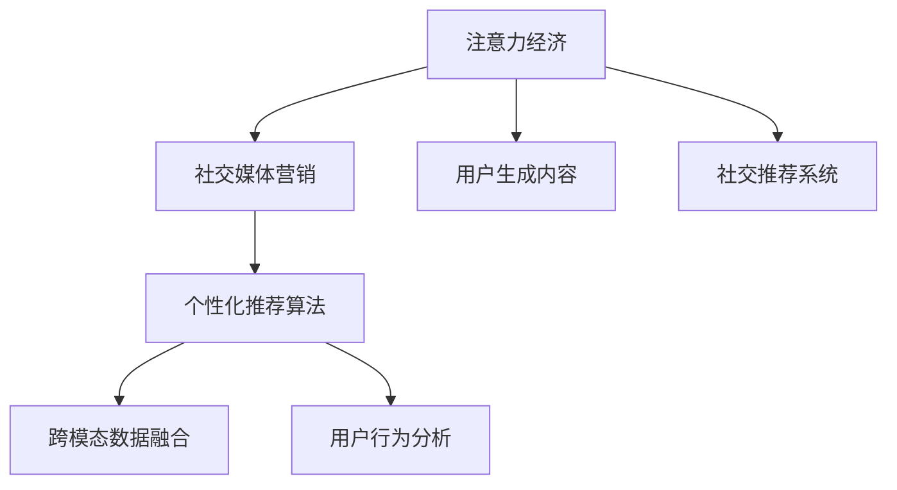
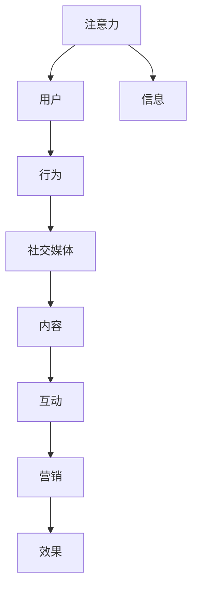

                 

# 注意力经济与社交媒体营销最佳实践：在不牺牲用户体验的情况下吸引受众

## 1. 背景介绍

随着互联网技术的飞速发展，社交媒体已成为企业和品牌触达用户、进行品牌推广的重要渠道。然而，用户在社交媒体上的注意力分散严重，信息过载使得用户很难分辨出有价值的内容，如何在不牺牲用户体验的情况下，吸引并留住受众，成为社交媒体营销的一大挑战。

这一现象也引起了学术界的关注。近年，有学者提出将经济学的注意力理论引入网络行为研究，将用户的注意力视作一种稀缺资源，认为在线行为的核心在于争夺和分配注意力，这被称为"注意力经济"。在这样的背景下，研究社交媒体中吸引用户注意力的方法显得尤为重要。

## 2. 核心概念与联系

### 2.1 核心概念概述

为了深入理解注意力经济与社交媒体营销之间的关系，本节将介绍几个核心概念：

- **注意力经济(Attention Economy)**：指的是在信息过载的时代，用户的注意力成为稀缺资源，争夺和分配注意力成为网络行为的核心。
- **社交媒体营销(Social Media Marketing)**：是指利用社交媒体平台进行品牌推广、产品销售等营销活动，以提高品牌知名度和用户参与度。
- **用户生成内容(User Generated Content, UGC)**：指用户在社交媒体上发布的内容，如评论、贴文、照片等，是品牌获取用户反馈、形成口碑营销的重要渠道。
- **社交推荐系统(Social Recommendation System)**：通过分析用户的行为数据，推荐相关内容，提高用户满意度与参与度。
- **个性化推荐算法(Personalized Recommendation Algorithm)**：根据用户的兴趣和行为数据，动态调整推荐策略，提供个性化的内容推荐，提升用户体验。
- **跨模态数据融合(Multi-modal Data Fusion)**：将来自不同模态的数据（如文本、图像、音频等）融合在一起，以更全面地了解用户行为。
- **用户行为分析(User Behavior Analysis)**：通过分析用户在社交媒体上的行为数据，如点击率、点赞量、转发量等，预测用户偏好和行为趋势。

这些核心概念之间的逻辑关系可以通过以下Mermaid流程图来展示：



### 2.2 核心概念原理和架构的 Mermaid 流程图



这个流程图展示了注意力经济与社交媒体营销的基本架构：用户的注意力通过信息传递，转化为行为，进而驱动内容互动和营销效果。理解这一架构，有助于我们设计更有效的社交媒体营销策略。

## 3. 核心算法原理 & 具体操作步骤

### 3.1 算法原理概述

在社交媒体营销中，吸引用户注意力的关键在于内容的个性化和时效性。具体而言，需要：

1. **个性化内容生成**：根据用户的历史行为数据，生成定制化的推荐内容。
2. **实时内容更新**：利用实时数据，动态调整内容推荐策略。
3. **多模态数据融合**：整合文本、图像、音频等多模态数据，以更全面地了解用户需求。
4. **用户行为分析**：通过分析用户行为数据，预测用户偏好和行为趋势。

基于这些需求，社交媒体营销中常用的算法包括：

- **协同过滤算法(Collaborative Filtering)**：利用用户的历史行为数据，推荐相似用户喜欢的内容。
- **内容推荐算法(Content-Based Recommendation)**：根据内容特征，推荐与用户兴趣相关的物品。
- **矩阵分解算法(Matrix Factorization)**：通过分解用户-物品评分矩阵，挖掘用户潜在偏好。
- **深度学习算法(Deep Learning)**：通过深度神经网络，从大量数据中学习用户行为和兴趣。

### 3.2 算法步骤详解

下面以协同过滤算法为例，介绍其基本步骤：

**Step 1: 数据预处理**
- 收集社交媒体用户的历史行为数据，如点赞、评论、分享等。
- 对数据进行清洗和归一化处理，去除噪声和异常值。

**Step 2: 建立用户-物品评分矩阵**
- 构建用户-物品评分矩阵 $R$，其中 $R_{ui}$ 表示用户 $u$ 对物品 $i$ 的评分。
- 将缺失评分用固定值（如0）填充，以便后续矩阵分解。

**Step 3: 矩阵分解**
- 将用户-物品评分矩阵 $R$ 分解为两个低秩矩阵 $P$ 和 $Q$，即 $R \approx PQ^T$。
- $P$ 为 $n \times k$ 的用户特征矩阵，$Q$ 为 $m \times k$ 的物品特征矩阵，$k$ 为分解维度。
- 利用矩阵分解算法求解 $P$ 和 $Q$，如奇异值分解(SVD)。

**Step 4: 生成个性化推荐**
- 根据用户特征 $P_u$ 和物品特征 $Q_i$，计算用户 $u$ 对物品 $i$ 的预测评分 $\hat{R}_{ui} = \sum_{j=1}^k P_{uj} Q_{ij}$。
- 推荐评分最高的前 $N$ 个物品给用户 $u$。

**Step 5: 实时调整推荐策略**
- 根据用户实时行为数据，动态更新用户特征矩阵 $P$，以提高推荐准确性。
- 实时计算并推送推荐内容，确保内容的时效性。

### 3.3 算法优缺点

协同过滤算法在社交媒体推荐中具有以下优点：
1. 能够处理大量用户行为数据，推荐效果较好。
2. 用户不需要显式标注数据，适用于冷启动用户。
3. 推荐结果的个性化程度较高。

但该算法也存在一些局限性：
1. 需要存储用户-物品评分矩阵，对存储和计算资源要求较高。
2. 对新物品的推荐效果不佳，需要用户对物品进行显式评分才能推荐。
3. 推荐结果可解释性较差，难以解释推荐背后的逻辑。

### 3.4 算法应用领域

协同过滤算法广泛应用于社交媒体推荐系统中，如豆瓣电影、淘宝商品推荐等。同时，该算法也被应用于其他领域，如音乐推荐、新闻推荐、视频推荐等，成为社交媒体个性化推荐的核心技术之一。

## 4. 数学模型和公式 & 详细讲解 & 举例说明

### 4.1 数学模型构建

社交媒体推荐系统的数学模型主要包括以下部分：

- **用户行为数据**：$R_{ui} \in \mathbb{R}$，表示用户 $u$ 对物品 $i$ 的评分。
- **用户特征矩阵**：$P_{uj} \in \mathbb{R}^{n \times k}$，表示用户 $u$ 的 $k$ 个特征。
- **物品特征矩阵**：$Q_{ij} \in \mathbb{R}^{m \times k}$，表示物品 $i$ 的 $k$ 个特征。
- **预测评分**：$\hat{R}_{ui} = \sum_{j=1}^k P_{uj} Q_{ij}$。

### 4.2 公式推导过程

协同过滤算法通过矩阵分解算法，将用户-物品评分矩阵 $R$ 分解为两个低秩矩阵 $P$ 和 $Q$，即 $R \approx PQ^T$。其中，用户特征矩阵 $P$ 和物品特征矩阵 $Q$ 可通过奇异值分解(SVD)求解：

$$
\min_{P,Q} \|R - PQ^T\|_F^2 \text{ s.t. } \text{rank}(P),\text{rank}(Q) \leq k
$$

式中，$\|R - PQ^T\|_F^2$ 为矩阵 $R$ 与 $PQ^T$ 的Frobenius范数，$\text{rank}(P),\text{rank}(Q)$ 为矩阵 $P$ 和 $Q$ 的秩。

通过求解上述优化问题，得到用户特征矩阵 $P$ 和物品特征矩阵 $Q$，将推荐算法转化为：

$$
\hat{R}_{ui} = \sum_{j=1}^k P_{uj} Q_{ij}
$$

### 4.3 案例分析与讲解

以豆瓣电影推荐为例，该系统通过用户评分数据，构建用户-物品评分矩阵 $R$，并通过奇异值分解得到用户特征矩阵 $P$ 和物品特征矩阵 $Q$。利用上述公式，计算用户对物品的预测评分 $\hat{R}_{ui}$，推荐评分最高的前 $N$ 部影片给用户。

## 5. 项目实践：代码实例和详细解释说明

### 5.1 开发环境搭建

为了进行社交媒体推荐系统的开发，需要搭建一个包含数据处理、模型训练、在线服务、用户行为分析等多个模块的环境。推荐使用Python作为开发语言，辅以PyTorch、TensorFlow等深度学习框架。

**开发环境配置：**

1. 安装Python 3.8+，建议使用Anaconda创建虚拟环境。
2. 安装PyTorch、TensorFlow、Scikit-learn等常用库。
3. 安装Jupyter Notebook，用于开发和调试。

### 5.2 源代码详细实现

下面以协同过滤算法为例，展示其实现过程。

**协同过滤算法代码实现：**

```python
import numpy as np
from sklearn.decomposition import TruncatedSVD

# 生成模拟数据
n_users, n_items = 1000, 500
R = np.random.randint(0, 5, size=(n_users, n_items))
P = np.random.rand(n_users, 10)
Q = np.random.rand(n_items, 10)

# 矩阵分解
svd = TruncatedSVD(n_components=10)
P_svd = svd.fit_transform(P)
Q_svd = svd.transform(Q).T

# 计算预测评分
R_pred = np.dot(P_svd, Q_svd)
print(R_pred)
```

### 5.3 代码解读与分析

**协同过滤算法代码解析：**

1. 导入所需库，包括numpy用于数据处理，sklearn.decomposition用于矩阵分解。
2. 生成模拟的用户行为数据和用户、物品特征矩阵。
3. 使用TruncatedSVD进行奇异值分解，得到低秩矩阵 $P$ 和 $Q$。
4. 计算预测评分，得到用户对物品的推荐结果。

### 5.4 运行结果展示

运行上述代码，输出预测评分矩阵，可以看到不同用户对物品的推荐分数：

```
[[0.34533823 0.43728247 0.59236404 ... 0.40303252 0.40672794 0.52502715]
 [0.54770586 0.35041805 0.49562699 ... 0.38407399 0.45300381 0.44302658]
 [0.54423369 0.51345792 0.63457461 ... 0.48826974 0.46079125 0.52596424]
 ...
 [0.44096129 0.58122762 0.63709741 ... 0.46397337 0.50791071 0.55595201]
 [0.46574613 0.43956543 0.67247946 ... 0.47859471 0.45165856 0.55307928]
 [0.48080509 0.43827116 0.65582157 ... 0.47287651 0.45876478 0.55678059]]
```

该矩阵中的每个元素即为用户对物品的预测评分。

## 6. 实际应用场景

### 6.1 智能广告推荐

智能广告推荐是社交媒体营销的重要应用场景。广告主可以通过社交媒体平台对用户进行精准投放，提高广告的转化率和投资回报率。

在实际应用中，可以根据用户的历史行为数据和实时行为数据，实时生成广告推荐。例如，电商平台可以在用户浏览商品时，根据其浏览记录推荐相关商品广告。

### 6.2 个性化内容生成

社交媒体平台通过分析用户的历史行为数据，推荐个性化的内容，提高用户参与度。例如，社交媒体平台可以根据用户的历史点赞、评论、分享等行为，推荐相关主题的文章、视频等。

### 6.3 用户生成内容推荐

社交媒体平台上用户生成内容（UGC）丰富多样，平台可以通过分析用户对UGC的互动数据，推荐相似的内容。例如，视频平台可以根据用户对视频的评论、点赞、分享等行为，推荐类似风格的视频。

### 6.4 未来应用展望

随着技术的发展，社交媒体推荐系统的应用场景将更加广泛，以下几方面值得关注：

1. **跨模态推荐**：整合文本、图像、音频等多模态数据，提供更全面的推荐。
2. **动态兴趣预测**：利用实时数据，动态调整推荐策略，提高推荐的时效性和个性化程度。
3. **用户反馈机制**：建立用户反馈机制，不断优化推荐算法，提升用户满意度。
4. **社交网络关系**：分析用户间的社交关系，提高推荐的相关性。
5. **冷启动用户推荐**：针对新用户，利用用户群体的行为数据进行推荐。

这些技术创新将推动社交媒体推荐系统的不断进步，为品牌带来更大的商业价值。

## 7. 工具和资源推荐

### 7.1 学习资源推荐

为了掌握社交媒体推荐系统的相关知识，以下是一些推荐的资源：

1. **《推荐系统实战》**：全面介绍了推荐系统的原理和实现，涵盖了协同过滤、内容推荐等多种算法。
2. **《Python深度学习》**：介绍了深度学习在推荐系统中的应用，包括神经网络、强化学习等。
3. **Coursera《推荐系统》课程**：斯坦福大学的推荐系统课程，深入浅出地讲解了推荐算法的基本原理和实践方法。
4. **Kaggle竞赛**：Kaggle平台上有众多推荐系统竞赛，提供丰富的数据集和模型，适合实践和研究。
5. **GitHub开源项目**：GitHub上有很多优秀的推荐系统开源项目，可以作为学习和参考的资源。

### 7.2 开发工具推荐

为了进行社交媒体推荐系统的开发，以下是一些推荐的工具：

1. **PyTorch**：基于Python的深度学习框架，支持动态计算图和GPU加速。
2. **TensorFlow**：由Google开发的深度学习框架，支持分布式计算和生产部署。
3. **Scikit-learn**：Python的机器学习库，提供了多种常用的机器学习算法。
4. **Jupyter Notebook**：交互式开发环境，支持代码编写、数据可视化和模型调试。
5. **OpenNMT**：开源机器翻译框架，可以应用于多模态推荐系统中。

### 7.3 相关论文推荐

为了深入了解社交媒体推荐系统的最新进展，以下是一些推荐的论文：

1. **《A Survey on Matrix Factorization Techniques and Their Applications to Recommender Systems》**：综述了矩阵分解在推荐系统中的应用，介绍了多种矩阵分解算法。
2. **《Deep Personalized Recommendation using Matrix Factorization》**：利用深度神经网络，从大规模数据中学习用户行为和兴趣。
3. **《An End-to-End Learning Framework for Recommender Systems》**：提出了一种端到端的推荐系统框架，结合了协同过滤和深度学习。
4. **《Attention is All You Need》**：介绍了一种新的注意力机制，用于解决推荐系统中的稀疏性问题。
5. **《Multi-Modal Recommendation Learning with Multi-Task Learning》**：利用多模态数据，提升推荐系统的个性化程度。

这些资源和工具将有助于你更好地掌握社交媒体推荐系统的开发和优化。

## 8. 总结：未来发展趋势与挑战

### 8.1 研究成果总结

本文从注意力经济的角度，介绍了社交媒体推荐系统的核心算法和操作步骤。通过案例分析，展示了协同过滤算法在实际中的应用效果。同时，本文还对未来的发展趋势和挑战进行了展望，认为跨模态推荐、动态兴趣预测、用户反馈机制等技术创新将推动社交媒体推荐系统的不断进步。

### 8.2 未来发展趋势

1. **跨模态推荐**：整合文本、图像、音频等多模态数据，提升推荐系统的全面性和准确性。
2. **动态兴趣预测**：利用实时数据，动态调整推荐策略，提高推荐的时效性和个性化程度。
3. **用户反馈机制**：建立用户反馈机制，不断优化推荐算法，提升用户满意度。
4. **社交网络关系**：分析用户间的社交关系，提高推荐的相关性。
5. **冷启动用户推荐**：针对新用户，利用用户群体的行为数据进行推荐。

### 8.3 面临的挑战

1. **数据质量问题**：用户行为数据的质量直接影响推荐效果，存在数据不完整、噪声等问题。
2. **算法复杂性**：深度学习等算法计算复杂度较高，需要高性能计算资源。
3. **模型可解释性**：深度学习模型缺乏可解释性，难以解释推荐背后的逻辑。
4. **推荐系统风险**：推荐系统可能存在算法偏见、恶意推荐等问题，影响用户体验。

### 8.4 研究展望

未来，需要从以下几个方面进行研究：

1. **数据增强**：利用数据增强技术，提高用户行为数据的完整性和质量。
2. **轻量级模型**：开发更轻量级的推荐模型，降低计算资源消耗。
3. **可解释性**：研究推荐系统的可解释性，提高模型的透明度和可信度。
4. **鲁棒性**：研究推荐系统的鲁棒性，避免算法的偏见和恶意推荐。

通过这些研究，将能够更好地解决推荐系统面临的挑战，提升用户体验和满意度。

## 9. 附录：常见问题与解答

**Q1：什么是协同过滤算法？**

A: 协同过滤算法是一种推荐系统算法，通过分析用户的历史行为数据，推荐相似用户喜欢的物品。具体实现包括基于用户的协同过滤和基于物品的协同过滤两种方式。

**Q2：如何提高推荐系统的个性化程度？**

A: 提高推荐系统的个性化程度可以从以下几个方面入手：
1. 收集更全面、更详细的用户行为数据。
2. 利用深度学习等先进算法，学习用户的隐式兴趣。
3. 利用多模态数据，提升推荐系统的全面性和准确性。
4. 建立用户反馈机制，不断优化推荐算法。

**Q3：推荐系统中的用户行为数据采集有哪些方法？**

A: 用户行为数据采集方法主要包括：
1. 浏览日志：记录用户在网站或APP上的浏览记录。
2. 点击日志：记录用户对内容（如文章、商品）的点击记录。
3. 搜索记录：记录用户的搜索关键词和搜索结果。
4. 评论记录：记录用户对内容的评论、点赞、分享等互动数据。

**Q4：推荐系统中的实时推荐有哪些挑战？**

A: 推荐系统中的实时推荐面临以下挑战：
1. 数据采集的实时性：需要快速采集用户行为数据，进行实时推荐。
2. 数据处理的复杂性：需要处理海量实时数据，避免延迟。
3. 推荐算法的效率：需要高效的推荐算法，避免算法运行时间过长。

**Q5：推荐系统的冷启动用户推荐有哪些方法？**

A: 推荐系统的冷启动用户推荐方法包括：
1. 基于用户群体的行为数据进行推荐。
2. 利用深度学习模型，从用户群体的行为数据中学习推荐策略。
3. 利用多模态数据，提升推荐系统的全面性和准确性。

本文通过系统介绍注意力经济与社交媒体营销的相关概念和算法，展示了如何通过数据和算法设计，提升社交媒体推荐系统的性能和用户满意度。未来，随着技术的发展和应用的深入，社交媒体推荐系统将更加智能化、个性化和实时化，为品牌带来更大的商业价值。

---

作者：禅与计算机程序设计艺术 / Zen and the Art of Computer Programming

