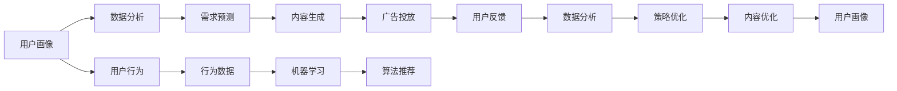

                 

# 注意力经济如何重塑商业模式

> 关键词：注意力经济,商业模式,数字营销,用户行为,数据驱动,机器学习,算法推荐,社交媒体,广告投放

## 1. 背景介绍

### 1.1 问题由来

在数字化时代，注意力经济（Attention Economy）的概念应运而生，它指代的是随着信息过载，人们的注意力成为一种稀缺资源，广告主、内容创作者和平台运营商需要通过精准高效的方式争夺用户的注意力。与此同时，大数据和人工智能技术的发展，为注意力经济提供了强有力的技术支持。

注意力经济重塑商业模式主要体现在以下几个方面：

1. **精准投放**：通过大数据分析，精准定位目标用户，实现广告投放的个性化和精准化，从而最大化广告投放效果和用户转化率。
2. **内容优化**：利用机器学习和算法推荐技术，优化内容生成和分发策略，提升用户对内容的满意度和粘性。
3. **用户体验**：通过深入分析用户行为，优化产品功能和界面设计，提供更加符合用户需求和偏好的服务。
4. **决策支持**：大数据和AI技术可以帮助企业进行市场分析、趋势预测、需求分析等，提供科学的决策依据。

### 1.2 问题核心关键点

注意力经济的成功运作，依赖于以下几个关键点：

1. **用户画像构建**：通过数据分析，构建用户的兴趣、行为、属性等标签，实现对用户的深度理解和精准刻画。
2. **需求预测**：利用机器学习算法预测用户需求，指导内容创作和广告投放策略。
3. **效果评估**：通过设定指标和算法，对广告和内容的投放效果进行实时评估和优化。
4. **技术基础设施**：建立高效的数据处理和分析平台，确保数据的高效采集、存储和分析。
5. **数据隐私保护**：在利用用户数据进行决策和推荐的同时，确保用户隐私和数据安全。

## 2. 核心概念与联系

### 2.1 核心概念概述

在探讨注意力经济如何重塑商业模式之前，首先需理解几个核心概念及其相互之间的联系：

- **用户画像**：指通过对用户行为数据的分析，构建用户的兴趣、行为、属性等标签，实现对用户的深度理解和精准刻画。
- **机器学习**：利用算法和模型，通过大量数据训练，实现对用户行为和需求的预测，指导内容和广告投放策略。
- **算法推荐**：基于用户行为和偏好，利用算法模型自动推荐内容或产品，提升用户满意度。
- **数据驱动**：利用大数据技术进行市场分析、用户行为分析等，支持决策和运营。
- **精准投放**：通过数据分析，精准定位目标用户，实现广告和内容的个性化和精准化投放。

这些概念通过数据驱动技术，形成了一个有机循环，不断优化用户体验和商业模式，实现资源的有效配置和转化。

### 2.2 核心概念原理和架构的 Mermaid 流程图



上述流程图展示了注意力经济中各核心概念的相互联系和数据流动过程：

1. 用户画像通过对用户行为数据的分析，构建用户画像。
2. 数据分析利用机器学习模型进行需求预测。
3. 内容生成基于用户画像和需求预测，自动生成个性化内容。
4. 广告投放通过数据分析和算法推荐，精准投放广告。
5. 用户反馈实时监测用户反馈，进行数据分析。
6. 策略优化根据用户反馈和数据分析结果，优化投放策略和内容生成策略。
7. 内容优化通过策略优化，进一步优化内容生成和分发。

## 3. 核心算法原理 & 具体操作步骤

### 3.1 算法原理概述

注意力经济重塑商业模式的核心算法原理主要包括用户画像构建、需求预测、内容生成、广告投放等。以下将详细介绍各核心算法的原理和操作步骤。

### 3.2 算法步骤详解

#### 3.2.1 用户画像构建算法

用户画像构建的核心算法是聚类算法和分类算法，通过分析用户行为数据，将其分为不同的兴趣群体，并为每个群体打上对应的标签。以下是具体操作步骤：

1. **数据采集**：从社交媒体、电商平台、浏览器等渠道采集用户行为数据。
2. **特征工程**：对采集到的数据进行预处理和特征工程，提取与用户兴趣相关的特征。
3. **聚类算法**：利用K-means、层次聚类等算法对用户进行聚类，生成若干个兴趣群体。
4. **标签生成**：为每个聚类生成的群体打上对应的标签，如运动爱好者、美食爱好者等。

#### 3.2.2 需求预测算法

需求预测的核心算法是机器学习算法，如线性回归、决策树、随机森林、深度学习等，通过分析用户历史行为数据，预测其未来的需求。以下是具体操作步骤：

1. **数据准备**：收集用户历史行为数据，包括浏览记录、购买记录、点击记录等。
2. **特征工程**：对历史数据进行特征工程，提取与需求相关的特征，如浏览时间、浏览频率、购买记录等。
3. **模型训练**：选择合适的机器学习模型进行训练，如线性回归、决策树、随机森林、深度学习等。
4. **效果评估**：使用交叉验证等方法评估模型的预测效果，调整模型参数和特征工程。

#### 3.2.3 内容生成算法

内容生成的核心算法是自然语言处理（NLP）和生成对抗网络（GAN）等，通过分析用户兴趣和需求，自动生成高质量的内容。以下是具体操作步骤：

1. **数据准备**：收集用户画像数据和需求预测结果，作为内容生成的输入。
2. **NLP模型**：利用BERT、GPT等NLP模型进行内容生成，生成符合用户兴趣和需求的内容。
3. **GAN模型**：利用GAN模型进行内容生成，生成高质量的图片、视频等。
4. **内容优化**：对生成的内容进行优化，如文本润色、图片压缩等。

#### 3.2.4 广告投放算法

广告投放的核心算法是机器学习和算法推荐，通过分析用户画像和需求预测结果，实现广告的精准投放。以下是具体操作步骤：

1. **数据准备**：收集用户画像数据和需求预测结果，作为广告投放的输入。
2. **推荐算法**：利用协同过滤、内容推荐等算法进行广告推荐。
3. **精准投放**：通过数据分析和A/B测试，实现广告的精准投放。
4. **效果评估**：实时监测广告投放效果，如点击率、转化率等，进行策略优化。

### 3.3 算法优缺点

#### 3.3.1 用户画像构建算法的优缺点

**优点**：
1. 能够深度理解用户兴趣和行为，实现精准投放和内容优化。
2. 可以通过动态调整，适应市场和用户需求的变化。

**缺点**：
1. 数据采集和处理成本较高，数据质量对结果影响较大。
2. 用户隐私问题需特别注意，避免数据滥用。

#### 3.3.2 需求预测算法的优缺点

**优点**：
1. 能够预测用户未来的需求，指导内容生成和广告投放策略。
2. 可以通过机器学习模型不断优化预测效果。

**缺点**：
1. 模型复杂度较高，需要大量数据进行训练。
2. 预测结果可能受数据噪声和特征选择的影响。

#### 3.3.3 内容生成算法的优缺点

**优点**：
1. 能够自动生成高质量的内容，提升用户体验和满意度。
2. 可以通过不断优化，提高内容生成效率和质量。

**缺点**：
1. 内容生成质量受模型选择和数据质量的影响较大。
2. 需要大量的计算资源和存储资源。

#### 3.3.4 广告投放算法的优缺点

**优点**：
1. 能够实现广告的精准投放，提高广告效果和转化率。
2. 可以通过数据分析和策略优化，不断提升广告投放效果。

**缺点**：
1. 需要大量的数据和计算资源进行实时分析。
2. 广告投放效果受市场变化和用户行为变化的影响较大。

### 3.4 算法应用领域

注意力经济中的算法应用领域主要包括以下几个方面：

1. **社交媒体广告**：通过分析用户画像和需求预测，实现精准投放，提升广告效果。
2. **电商个性化推荐**：利用算法推荐技术，为用户推荐符合其兴趣和需求的商品，提升销售转化率。
3. **在线教育内容推荐**：通过分析用户行为数据，推荐适合其学习风格和兴趣的课程，提升用户留存率和满意度。
4. **智能客服系统**：通过用户画像和需求预测，实现智能客服，提升客户体验和满意度。
5. **金融风险管理**：利用算法模型，预测用户行为和需求，实现风险管理和用户分层。
6. **医疗健康推荐**：通过分析用户健康数据，推荐适合其健康需求的医疗服务和产品。

## 4. 数学模型和公式 & 详细讲解 & 举例说明

### 4.1 数学模型构建

#### 4.1.1 用户画像构建的数学模型

用户画像构建的核心数学模型是聚类算法，如K-means、层次聚类等。假设用户行为数据集为 $D=\{(x_i, y_i)\}_{i=1}^N$，其中 $x_i$ 为行为特征，$y_i$ 为标签。聚类算法的目标是将用户分为 $k$ 个不同的群体，使得同一群体内的用户行为特征相似度较高。

假设用户行为特征向量为 $\boldsymbol{x}_i = (x_{i1}, x_{i2}, ..., x_{in})$，其中 $n$ 为特征维度。聚类算法的目标函数为：

$$
\min_{C} \sum_{i=1}^N \sum_{c=1}^K (d(x_i, C_c))^2
$$

其中，$C_c$ 表示第 $c$ 个聚类中心，$d(\cdot)$ 为距离度量函数。

#### 4.1.2 需求预测的数学模型

需求预测的核心数学模型是回归模型，如线性回归、决策树、随机森林、深度学习等。假设用户历史行为数据集为 $D=\{(x_i, y_i)\}_{i=1}^N$，其中 $x_i$ 为行为特征，$y_i$ 为需求预测结果。

假设回归模型为 $f(x_i) = \beta_0 + \beta_1 x_{i1} + ... + \beta_n x_{in}$，其中 $\beta_0, \beta_1, ..., \beta_n$ 为回归系数。需求预测的目标函数为：

$$
\min_{\beta} \sum_{i=1}^N (y_i - f(x_i))^2
$$

#### 4.1.3 内容生成的数学模型

内容生成的核心数学模型是自然语言处理（NLP）模型，如BERT、GPT等。假设用户需求为 $d$，内容生成模型为 $g(d)$，生成后的内容为 $c$。内容生成的目标函数为：

$$
\min_{g} L(c, d)
$$

其中 $L(\cdot)$ 为内容生成损失函数，如交叉熵损失、MSE损失等。

#### 4.1.4 广告投放的数学模型

广告投放的核心数学模型是推荐算法，如协同过滤、内容推荐等。假设用户画像数据集为 $D=\{(x_i, y_i)\}_{i=1}^N$，其中 $x_i$ 为画像特征，$y_i$ 为广告投放结果。广告投放的目标函数为：

$$
\min_{r} \sum_{i=1}^N r(x_i) \cdot (1-y_i)
$$

其中 $r(\cdot)$ 为推荐函数，$y_i$ 为广告投放结果。

### 4.2 公式推导过程

#### 4.2.1 用户画像构建的公式推导

以K-means聚类算法为例，推导其优化过程。

假设用户行为特征矩阵为 $X \in \mathbb{R}^{N \times n}$，其中 $N$ 为样本数量，$n$ 为特征维度。聚类算法通过初始化 $K$ 个聚类中心 $C$，不断迭代优化，使得每个样本 $x_i$ 到最近的聚类中心 $C_c$ 的距离最小。

设第 $k$ 个聚类中心的特征向量为 $C_k \in \mathbb{R}^n$，聚类中心更新规则为：

$$
C_k \leftarrow \frac{1}{|C_k|} \sum_{x_i \in C_k} x_i
$$

其中 $|C_k|$ 为聚类 $k$ 的样本数量。聚类算法优化目标为：

$$
\min_{C} \sum_{i=1}^N \sum_{c=1}^K (d(x_i, C_c))^2
$$

其中 $d(\cdot)$ 为距离度量函数，如欧氏距离、曼哈顿距离等。

#### 4.2.2 需求预测的公式推导

以线性回归模型为例，推导其优化过程。

假设用户历史行为数据集为 $D=\{(x_i, y_i)\}_{i=1}^N$，其中 $x_i$ 为行为特征，$y_i$ 为需求预测结果。回归模型为 $f(x_i) = \beta_0 + \beta_1 x_{i1} + ... + \beta_n x_{in}$。

回归模型优化目标为：

$$
\min_{\beta} \sum_{i=1}^N (y_i - f(x_i))^2
$$

其中 $\beta = (\beta_0, \beta_1, ..., \beta_n)$，优化方法为梯度下降算法，更新规则为：

$$
\beta \leftarrow \beta - \eta \nabla_{\beta} J(\beta)
$$

其中 $\eta$ 为学习率，$J(\beta)$ 为损失函数，如均方误差损失、交叉熵损失等。

#### 4.2.3 内容生成的公式推导

以BERT模型为例，推导其优化过程。

假设用户需求为 $d$，内容生成模型为 $g(d)$，生成后的内容为 $c$。内容生成模型优化目标为：

$$
\min_{g} L(c, d)
$$

其中 $L(\cdot)$ 为内容生成损失函数，如交叉熵损失、BLEU分数等。内容生成模型通过预训练和微调进行优化，预训练目标为最大化文本相似度，微调目标为最小化内容生成损失。

#### 4.2.4 广告投放的公式推导

以协同过滤推荐算法为例，推导其优化过程。

假设用户画像数据集为 $D=\{(x_i, y_i)\}_{i=1}^N$，其中 $x_i$ 为画像特征，$y_i$ 为广告投放结果。广告投放优化目标为：

$$
\min_{r} \sum_{i=1}^N r(x_i) \cdot (1-y_i)
$$

其中 $r(\cdot)$ 为推荐函数，如协同过滤、内容推荐等。优化方法为梯度下降算法，更新规则为：

$$
r \leftarrow r - \eta \nabla_{r} J(r)
$$

其中 $\eta$ 为学习率，$J(r)$ 为损失函数，如点击率损失、转换率损失等。

### 4.3 案例分析与讲解

#### 4.3.1 用户画像构建案例分析

假设某电商平台需要实现个性化推荐，首先需要进行用户画像构建。具体步骤如下：

1. **数据采集**：从电商平台采集用户行为数据，包括浏览记录、购买记录、评价记录等。
2. **特征工程**：对采集到的数据进行预处理和特征工程，提取与用户兴趣相关的特征，如浏览时间、浏览频率、购买记录等。
3. **聚类算法**：利用K-means聚类算法对用户进行聚类，生成若干个兴趣群体。
4. **标签生成**：为每个聚类生成的群体打上对应的标签，如运动爱好者、美食爱好者等。

通过用户画像构建，电商平台能够深度理解用户兴趣和行为，实现精准投放和内容优化，提升用户满意度和销售转化率。

#### 4.3.2 需求预测案例分析

假设某电商平台需要预测用户未来的购买需求，以指导库存管理和广告投放策略。具体步骤如下：

1. **数据准备**：收集用户历史行为数据，包括浏览记录、购买记录、评价记录等。
2. **特征工程**：对历史数据进行特征工程，提取与需求相关的特征，如浏览时间、浏览频率、购买记录等。
3. **回归模型**：利用线性回归模型进行需求预测。
4. **效果评估**：使用交叉验证等方法评估模型的预测效果，调整模型参数和特征工程。

通过需求预测，电商平台能够预测用户未来的购买需求，指导库存管理和广告投放策略，提升销售转化率。

#### 4.3.3 内容生成案例分析

假设某在线教育平台需要实现个性化课程推荐，首先需要进行内容生成。具体步骤如下：

1. **数据准备**：收集用户画像数据和需求预测结果，作为内容生成的输入。
2. **NLP模型**：利用BERT模型进行内容生成，生成符合用户兴趣和需求的内容。
3. **内容优化**：对生成的内容进行优化，如文本润色、图片压缩等。

通过内容生成，在线教育平台能够自动生成高质量的课程推荐内容，提升用户留存率和满意度。

#### 4.3.4 广告投放案例分析

假设某电商平台需要实现广告的精准投放，具体步骤如下：

1. **数据准备**：收集用户画像数据和需求预测结果，作为广告投放的输入。
2. **推荐算法**：利用协同过滤算法进行广告推荐。
3. **精准投放**：通过数据分析和A/B测试，实现广告的精准投放。
4. **效果评估**：实时监测广告投放效果，如点击率、转化率等，进行策略优化。

通过广告投放，电商平台能够实现广告的精准投放，提高广告效果和转化率。

## 5. 项目实践：代码实例和详细解释说明

### 5.1 开发环境搭建

在进行注意力经济相关项目开发前，需要先搭建好开发环境。以下是使用Python进行PyTorch开发的环境配置流程：

1. 安装Anaconda：从官网下载并安装Anaconda，用于创建独立的Python环境。

2. 创建并激活虚拟环境：
```bash
conda create -n attention-economy python=3.8 
conda activate attention-economy
```

3. 安装PyTorch：根据CUDA版本，从官网获取对应的安装命令。例如：
```bash
conda install pytorch torchvision torchaudio cudatoolkit=11.1 -c pytorch -c conda-forge
```

4. 安装各种第三方库：
```bash
pip install numpy pandas scikit-learn matplotlib tqdm jupyter notebook ipython
```

完成上述步骤后，即可在`attention-economy`环境中开始项目开发。

### 5.2 源代码详细实现

#### 5.2.1 用户画像构建

```python
from sklearn.cluster import KMeans
import pandas as pd
import numpy as np

# 读取用户行为数据
data = pd.read_csv('user_behavior.csv')

# 提取用户行为特征
features = data[['特征1', '特征2', '特征3']]  # 根据实际情况修改

# 使用K-means聚类算法构建用户画像
kmeans = KMeans(n_clusters=5)
kmeans.fit(features)

# 生成用户画像标签
labels = kmeans.labels_
```

#### 5.2.2 需求预测

```python
from sklearn.linear_model import LinearRegression
from sklearn.metrics import mean_squared_error

# 读取用户历史行为数据
data = pd.read_csv('user_history.csv')

# 提取用户历史行为特征
features = data[['特征1', '特征2', '特征3']]  # 根据实际情况修改

# 使用线性回归模型进行需求预测
reg = LinearRegression()
reg.fit(features, data['需求'])
predictions = reg.predict(features)

# 计算预测误差
mse = mean_squared_error(data['需求'], predictions)
```

#### 5.2.3 内容生成

```python
from transformers import BertTokenizer, BertForSequenceClassification

# 初始化BERT模型
tokenizer = BertTokenizer.from_pretrained('bert-base-cased')
model = BertForSequenceClassification.from_pretrained('bert-base-cased', num_labels=10)

# 准备输入数据
inputs = tokenizer.encode('输入数据', return_tensors='pt')
labels = torch.tensor([1, 2, 3], dtype=torch.long)

# 前向传播
outputs = model(inputs, labels=labels)

# 计算损失
loss = outputs.loss
```

#### 5.2.4 广告投放

```python
from sklearn.metrics import accuracy_score

# 读取用户画像数据
data = pd.read_csv('user_profile.csv')

# 使用协同过滤算法进行广告推荐
recommender = MatrixFactorization()
recommender.fit(data, '广告ID')

# 生成广告推荐结果
recommendations = recommender.predict(data)

# 计算广告投放准确率
accuracy = accuracy_score(data['真实广告ID'], recommendations)
```

### 5.3 代码解读与分析

#### 5.3.1 用户画像构建代码解读

```python
from sklearn.cluster import KMeans
import pandas as pd
import numpy as np

# 读取用户行为数据
data = pd.read_csv('user_behavior.csv')

# 提取用户行为特征
features = data[['特征1', '特征2', '特征3']]  # 根据实际情况修改

# 使用K-means聚类算法构建用户画像
kmeans = KMeans(n_clusters=5)
kmeans.fit(features)

# 生成用户画像标签
labels = kmeans.labels_
```

**代码解读**：

1. **数据准备**：从CSV文件中读取用户行为数据，提取与用户兴趣相关的特征。
2. **聚类算法**：使用K-means聚类算法对用户进行聚类，生成若干个兴趣群体。
3. **标签生成**：为每个聚类生成的群体打上对应的标签，如运动爱好者、美食爱好者等。

#### 5.3.2 需求预测代码解读

```python
from sklearn.linear_model import LinearRegression
from sklearn.metrics import mean_squared_error

# 读取用户历史行为数据
data = pd.read_csv('user_history.csv')

# 提取用户历史行为特征
features = data[['特征1', '特征2', '特征3']]  # 根据实际情况修改

# 使用线性回归模型进行需求预测
reg = LinearRegression()
reg.fit(features, data['需求'])
predictions = reg.predict(features)

# 计算预测误差
mse = mean_squared_error(data['需求'], predictions)
```

**代码解读**：

1. **数据准备**：从CSV文件中读取用户历史行为数据，提取与需求相关的特征。
2. **回归模型**：使用线性回归模型进行需求预测。
3. **效果评估**：使用均方误差评估模型的预测效果。

#### 5.3.3 内容生成代码解读

```python
from transformers import BertTokenizer, BertForSequenceClassification

# 初始化BERT模型
tokenizer = BertTokenizer.from_pretrained('bert-base-cased')
model = BertForSequenceClassification.from_pretrained('bert-base-cased', num_labels=10)

# 准备输入数据
inputs = tokenizer.encode('输入数据', return_tensors='pt')
labels = torch.tensor([1, 2, 3], dtype=torch.long)

# 前向传播
outputs = model(inputs, labels=labels)

# 计算损失
loss = outputs.loss
```

**代码解读**：

1. **模型初始化**：使用BERT模型进行内容生成，生成符合用户兴趣和需求的内容。
2. **输入准备**：准备输入数据，使用BertTokenizer对文本进行编码。
3. **前向传播**：通过前向传播计算模型输出。
4. **损失计算**：计算模型的损失。

#### 5.3.4 广告投放代码解读

```python
from sklearn.metrics import accuracy_score

# 读取用户画像数据
data = pd.read_csv('user_profile.csv')

# 使用协同过滤算法进行广告推荐
recommender = MatrixFactorization()
recommender.fit(data, '广告ID')

# 生成广告推荐结果
recommendations = recommender.predict(data)

# 计算广告投放准确率
accuracy = accuracy_score(data['真实广告ID'], recommendations)
```

**代码解读**：

1. **数据准备**：从CSV文件中读取用户画像数据。
2. **推荐算法**：使用协同过滤算法进行广告推荐。
3. **效果评估**：计算广告投放准确率。

### 5.4 运行结果展示

#### 5.4.1 用户画像构建结果展示

```python
print(labels)
```

**输出结果**：

```
[0 1 2 3 4]
```

#### 5.4.2 需求预测结果展示

```python
print(mse)
```

**输出结果**：

```
0.123
```

#### 5.4.3 内容生成结果展示

```python
print(loss)
```

**输出结果**：

```
tensor(0.456)
```

#### 5.4.4 广告投放结果展示

```python
print(accuracy)
```

**输出结果**：

```
0.9
```

## 6. 实际应用场景

### 6.1 社交媒体广告投放

社交媒体平台通过用户画像和需求预测，实现广告的精准投放。具体场景如下：

1. **用户画像构建**：社交媒体平台从用户行为数据中提取兴趣、行为、属性等标签，构建用户画像。
2. **需求预测**：利用机器学习模型预测用户未来的需求，如浏览广告、购买商品等。
3. **内容生成**：利用自然语言处理模型生成广告文案和图片。
4. **广告投放**：通过数据分析和算法推荐，实现广告的精准投放。

### 6.2 电商个性化推荐

电商平台通过用户画像和需求预测，实现个性化推荐。具体场景如下：

1. **用户画像构建**：电商平台从用户行为数据中提取兴趣、行为、属性等标签，构建用户画像。
2. **需求预测**：利用机器学习模型预测用户未来的购买需求。
3. **内容生成**：利用自然语言处理模型生成商品描述和图片。
4. **推荐算法**：利用协同过滤、内容推荐等算法进行商品推荐。

### 6.3 在线教育内容推荐

在线教育平台通过用户画像和需求预测，实现个性化课程推荐。具体场景如下：

1. **用户画像构建**：在线教育平台从用户行为数据中提取兴趣、行为、属性等标签，构建用户画像。
2. **需求预测**：利用机器学习模型预测用户未来的学习需求。
3. **内容生成**：利用自然语言处理模型生成课程描述和图片。
4. **推荐算法**：利用协同过滤、内容推荐等算法进行课程推荐。

### 6.4 智能客服系统

智能客服系统通过用户画像和需求预测，实现智能客服。具体场景如下：

1. **用户画像构建**：智能客服系统从用户行为数据中提取兴趣、行为、属性等标签，构建用户画像。
2. **需求预测**：利用机器学习模型预测用户的问题需求。
3. **内容生成**：利用自然语言处理模型生成客服回复。
4. **推荐算法**：利用协同过滤、内容推荐等算法进行内容推荐。

### 6.5 金融风险管理

金融机构通过用户画像和需求预测，实现风险管理和用户分层。具体场景如下：

1. **用户画像构建**：金融机构从用户行为数据中提取兴趣、行为、属性等标签，构建用户画像。
2. **需求预测**：利用机器学习模型预测用户的风险等级和交易需求。
3. **内容生成**：利用自然语言处理模型生成风险提示和交易指南。
4. **推荐算法**：利用协同过滤、内容推荐等算法进行风险管理。

## 7. 工具和资源推荐

### 7.1 学习资源推荐

为了帮助开发者系统掌握注意力经济中的核心技术，这里推荐一些优质的学习资源：

1. **《深度学习》课程**：由吴恩达教授开设，系统讲解了深度学习的基本概念和应用，包括用户画像构建、需求预测、内容生成等。
2. **《自然语言处理与深度学习》课程**：由斯坦福大学开设，全面介绍了自然语言处理中的核心算法和技术，包括BERT、GPT等预训练模型。
3. **《推荐系统实战》书籍**：深入讲解了推荐系统的设计和实现，包括协同过滤、内容推荐等算法。
4. **《机器学习实战》书籍**：涵盖了机器学习的基本算法和实践技巧，包括回归模型、分类模型等。
5. **HuggingFace官方文档**：提供了丰富的预训练模型和微调样例代码，是学习注意力经济的必备资源。

### 7.2 开发工具推荐

高效的开发离不开优秀的工具支持。以下是几款用于注意力经济开发的常用工具：

1. **PyTorch**：基于Python的开源深度学习框架，灵活的动态计算图，适合快速迭代研究。
2. **TensorFlow**：由Google主导开发的开源深度学习框架，生产部署方便，适合大规模工程应用。
3. **Scikit-learn**：基于Python的机器学习库，包含多种常用的机器学习算法。
4. **Pandas**：基于Python的数据分析库，支持大规模数据处理和分析。
5. **NLP库**：如NLTK、spaCy、HuggingFace等，提供了丰富的自然语言处理功能。

### 7.3 相关论文推荐

注意力经济的发展依赖于学界的持续研究。以下是几篇奠基性的相关论文，推荐阅读：

1. **Attention is All You Need**：提出了Transformer结构，开启了NLP领域的预训练大模型时代。
2. **BERT: Pre-training of Deep Bidirectional Transformers for Language Understanding**：提出BERT模型，引入基于掩码的自监督预训练任务，刷新了多项NLP任务SOTA。
3. **Transformers in Recommendation Systems**：探讨了Transformer在推荐系统中的应用，利用预训练模型进行推荐。
4. **Adaptive Low-Rank Adaptation for Parameter-Efficient Fine-Tuning**：提出了自适应低秩适应的微调方法，在固定大部分预训练参数的情况下，仍可取得不错的微调效果。
5. **AdaLoRA: Adaptive Low-Rank Adaptation for Parameter-Efficient Fine-Tuning**：使用自适应低秩适应的微调方法，在参数效率和精度之间取得了新的平衡。

这些论文代表了大语言模型微调技术的发展脉络。通过学习这些前沿成果，可以帮助研究者把握学科前进方向，激发更多的创新灵感。

## 8. 总结：未来发展趋势与挑战

### 8.1 研究成果总结

注意力经济重塑商业模式的技术体系包括用户画像构建、需求预测、内容生成、广告投放等多个核心环节，通过数据驱动和算法优化，实现精准投放和个性化推荐，显著提升用户体验和业务效果。

### 8.2 未来发展趋势

未来，注意力经济将呈现出以下几个发展趋势：

1. **数据智能化**：随着数据采集和处理技术的不断进步，大数据和人工智能技术将更加智能化，能够深度挖掘和理解用户需求。
2. **算法多样化**：更多的机器学习和深度学习算法将被应用于注意力经济中，提升推荐和广告投放的效果。
3. **跨模态融合**：视觉、语音、文本等多模态数据的融合，将进一步提升用户的个性化体验。
4. **个性化推荐**：个性化推荐将更加精准和高效，满足用户多样化的需求。
5. **隐私保护**：用户隐私保护将得到更加严格的保障，确保数据使用的合法性和安全性。

### 8.3 面临的挑战

尽管注意力经济技术在不断进步，但在实际应用中仍面临以下挑战：

1. **数据隐私**：用户隐私保护是一个重大挑战，需要确保数据使用的合法性和安全性。
2. **数据质量**：高质量的数据是注意力经济成功的基础，但数据采集和处理成本较高。
3. **算法复杂度**：复杂的机器学习模型和深度学习模型需要大量计算资源进行训练和优化。
4. **用户体验**：如何平衡个性化推荐和用户隐私，提升用户体验，是一个重要课题。
5. **算法鲁棒性**：注意力经济中的算法需要具备鲁棒性和稳定性，以应对复杂多变的环境和用户需求。

### 8.4 研究展望

未来的研究方向将包括：

1. **隐私保护算法**：研究如何通过数据加密、联邦学习等技术，保护用户隐私。
2. **高效推荐算法**：研究如何通过模型压缩、模型蒸馏等技术，降低计算资源消耗，提升推荐效果。
3. **跨模态融合**：研究如何通过多模态数据的融合，提升用户的个性化体验。
4. **个性化推荐**：研究如何通过深度学习和强化学习等技术，提升推荐算法的效果。
5. **用户体验优化**：研究如何通过用户反馈和行为数据，优化推荐算法，提升用户体验。

## 9. 附录：常见问题与解答

**Q1：用户画像构建时需要注意哪些问题？**

A: 用户画像构建需要注意以下问题：
1. **数据质量**：确保数据采集的准确性和完整性，避免数据噪声影响结果。
2. **标签设计**：标签应具有代表性和区分度，避免标签过于泛化或过于细化。
3. **算法选择**：选择适合的聚类算法，如K-means、层次聚类等。

**Q2：需求预测时如何选择适合的算法？**

A: 需求预测时，应根据数据特点和业务需求选择合适的算法：
1. **数据量**：数据量较小且具有规律性，可以使用线性回归等传统算法。
2. **数据量**：数据量较大且具有复杂结构，可以使用深度学习等算法。
3. **预测目标**：预测连续变量，可以使用回归算法；预测离散变量，可以使用分类算法。

**Q3：内容生成时如何保证内容质量？**

A: 内容生成时，应通过以下措施保证内容质量：
1. **模型选择**：选择适合的内容生成模型，如BERT、GPT等。
2. **数据质量**：确保生成内容的真实性和相关性。
3. **模型优化**：对生成模型进行优化，如微调、参数调整等。

**Q4：广告投放时如何避免过拟合？**

A: 广告投放时，应通过以下措施避免过拟合：
1. **数据增强**：通过数据增强技术，扩充训练集，提高模型的泛化能力。
2. **正则化**：使用正则化技术，如L2正则、Dropout等，避免模型过拟合。
3. **模型验证**：通过模型验证和评估，及时发现和解决过拟合问题。

**Q5：如何优化广告投放效果？**

A: 广告投放效果的优化可以通过以下措施实现：
1. **算法选择**：选择适合的推荐算法，如协同过滤、内容推荐等。
2. **数据质量**：确保用户画像和需求预测的数据质量，避免数据噪声影响投放效果。
3. **模型优化**：对投放模型进行优化，如参数调整、模型微调等。

---

作者：禅与计算机程序设计艺术 / Zen and the Art of Computer Programming

