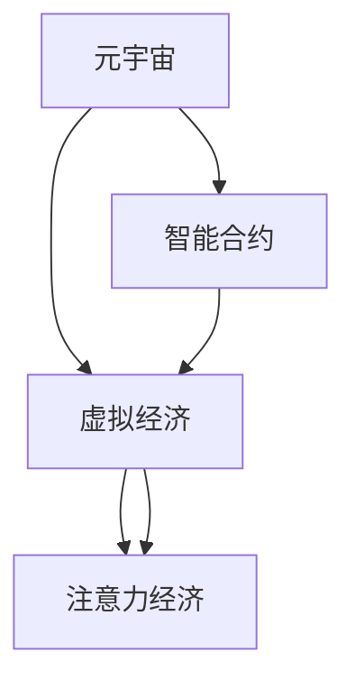

                 

# 注意力经济学奖:元宇宙中的学术最高荣誉

> 关键词：元宇宙,注意力经济学,学术荣誉,技术突破,智能合约,虚拟经济,区块链,公平性,激励机制,理论模型,应用场景

## 1. 背景介绍

### 1.1 问题由来

在人类历史的长河中，经济学的研究始终围绕着资源配置、价值创造与分配等核心问题展开。然而，随着数字经济、人工智能、区块链等新兴技术的兴起，传统的经济学理论面临诸多挑战。特别是元宇宙这一全新的虚拟空间，不仅提供了前所未有的沉浸式体验，也激发了对经济活动、社会互动等全新的思考和研究。

元宇宙作为虚拟与现实的深度融合，具有虚拟经济、数字资产交易、虚拟劳动市场等多种经济形式。其中的经济活动，不再完全基于现实世界的物理属性，而是以数字资产和虚拟货币为核心，呈现出不同于现实世界的运行规则和价值体系。如何设计有效的经济机制，确保元宇宙中虚拟经济的健康稳定发展，成为了一个亟待解决的重要课题。

在这一背景下，“注意力经济学奖”应运而生。它旨在通过对元宇宙中的注意力经济现象进行深入研究和理论探索，推动相关经济机制的设计和实践，为元宇宙的经济系统建设提供理论指导和解决方案。该奖项的设立，不仅是学术界对前沿研究方向的高度认可，更是对元宇宙经济活动深层次、系统性研究的积极引导。

### 1.2 问题核心关键点

元宇宙中的注意力经济现象，核心在于如何通过合理的经济机制和激励手段，激发用户参与并创造价值。在元宇宙的经济体系中，用户的注意力、劳动、创造物等均可以被视为经济活动的投入要素。如何科学地衡量这些要素的价值，设计公平、高效的激励机制，确保资源在元宇宙经济中的有效配置，是注意力经济学奖关注的重点。

### 1.3 问题研究意义

对元宇宙中的注意力经济现象进行研究，具有重要的理论和实践意义：

1. **理论创新**：为元宇宙经济学的理论建设提供新视角和方法，推动经济学与新兴技术的融合，丰富经济学的研究领域。
2. **技术应用**：为元宇宙经济系统设计提供科学依据和有效工具，促进元宇宙经济的健康稳定发展。
3. **社会价值**：促进社会公平、提高经济效率，为数字经济时代的社会发展提供新的动力和方向。
4. **产业影响**：推动元宇宙产业的快速成长，促进数字经济、虚拟现实、区块链等技术的应用和创新。

## 2. 核心概念与联系

### 2.1 核心概念概述

为更好地理解注意力经济学奖，本节将介绍几个密切相关的核心概念：

- **元宇宙(Metaverse)**：由多个互通的虚拟空间构成，涵盖虚拟经济、社会互动、虚拟劳动市场等多种经济形式。用户通过虚拟身份参与其中，形成了一个与现实世界平行的虚拟经济体系。
- **注意力经济(Antiency Economics)**：在元宇宙中，用户的注意力、劳动、创造物等可以被视为经济活动的投入要素，通过设计合理的激励机制，激发用户参与并创造价值。
- **智能合约(Smart Contracts)**：基于区块链技术，通过代码自动执行合约条款，确保经济活动的安全透明和自动化运行。
- **虚拟经济(Virtual Economy)**：与现实经济类似，但基于数字资产和虚拟货币，运行规则和价值体系不同。元宇宙中的虚拟劳动市场、虚拟商品交易、虚拟资产抵押等都是其表现形式。
- **区块链(Blockchain)**：提供去中心化的记录和交易验证机制，确保经济活动的不可篡改性和透明性。

这些核心概念之间的逻辑关系可以通过以下Mermaid流程图来展示：



这个流程图展示了几大核心概念及其之间的关系：

1. 元宇宙是虚拟经济的载体，智能合约是虚拟经济运行的基础。
2. 注意力经济是元宇宙经济活动的重要组成部分，智能合约提供安全透明的交易保障。
3. 注意力经济和虚拟经济共同构成元宇宙的经济体系。

## 3. 核心算法原理 & 具体操作步骤

### 3.1 算法原理概述

注意力经济学奖的核心算法原理，主要基于经济学中的博弈论、激励机制设计和理论经济学模型，通过分析元宇宙中经济活动的特征和规律，设计出公平、高效的激励机制。

在元宇宙中，经济活动参与者包括用户、开发者、平台运营者等。不同的参与者具有不同的目标和动机，需要通过合理的激励机制，确保各方利益平衡，推动经济活动的健康发展。

具体而言，注意力经济学奖的算法原理包括以下几个关键点：

- **博弈论框架**：建立多参与者博弈模型，分析各方的行为和策略，寻找最优决策。
- **激励机制设计**：通过设计公平、透明的激励机制，确保资源在元宇宙经济中的有效配置。
- **理论经济学模型**：引入经济学的基本理论和模型，如供需理论、市场机制等，进行元宇宙经济活动的分析和建模。

### 3.2 算法步骤详解

注意力经济学奖的核心算法步骤，可以分为以下几个关键环节：

**Step 1: 建立博弈模型**

- 确定元宇宙经济系统中的各个参与者，分析其行为和目标。
- 构建博弈模型，描述各方之间的策略互动和利益关系。
- 分析博弈模型的均衡状态，确定最优策略。

**Step 2: 设计激励机制**

- 根据博弈模型的均衡状态，设计合理的激励机制，确保各方利益平衡。
- 考虑激励机制的公平性和透明性，避免机制设计带来的副作用。
- 引入区块链技术，确保激励机制的自动化执行和不可篡改性。

**Step 3: 理论经济学模型构建**

- 引入经济学中的基本理论，如供需理论、市场机制等，构建元宇宙经济活动的理论模型。
- 分析模型的优化目标，进行数学建模和求解。
- 验证模型的实际应用效果，进行模型迭代和优化。

**Step 4: 实验验证和调整**

- 在元宇宙经济系统中进行实验验证，收集和分析实验数据。
- 根据实验结果，对激励机制和理论模型进行调整和优化。
- 不断迭代实验验证过程，确保模型的准确性和实用性。

### 3.3 算法优缺点

注意力经济学奖的核心算法具有以下优点：

1. **理论深度**：通过经济学的理论模型，深入分析元宇宙经济活动的特征和规律，设计科学合理的激励机制。
2. **公平透明**：利用区块链技术，确保激励机制的自动化执行和不可篡改性，提升经济活动的公平性和透明性。
3. **灵活性**：可以根据元宇宙经济活动的特点，灵活调整激励机制和理论模型，适应不同的经济环境。

同时，该算法也存在一些局限性：

1. **模型复杂性**：理论模型的构建和求解需要较高的数学和经济学知识，普通开发者较难掌握。
2. **实验成本高**：元宇宙经济系统的实验验证需要大量的计算资源和实际数据，实验成本较高。
3. **机制设计难度**：设计公平、高效的激励机制需要深入理解各方的行为和目标，机制设计难度较大。

### 3.4 算法应用领域

注意力经济学奖的算法原理，主要应用于以下几个领域：

- **虚拟劳动市场**：设计合理的激励机制，确保虚拟劳动市场的健康稳定发展。
- **虚拟资产交易**：建立公平透明的交易机制，促进虚拟资产的买卖和流通。
- **虚拟商品生产**：引入激励机制，鼓励用户参与虚拟商品的生产和创新。
- **元宇宙平台运营**：设计公平的利益分配机制，平衡平台运营者、开发者和用户之间的利益。
- **虚拟事件组织**：通过激励机制，提升元宇宙中虚拟事件的活动质量和参与度。

## 4. 数学模型和公式 & 详细讲解

### 4.1 数学模型构建

注意力经济学奖的核心算法，建立在经济学中的博弈论和激励机制设计基础之上。以下将通过数学语言对算法进行更加严格的刻画。

设元宇宙经济系统中有 $n$ 个参与者，每个参与者 $i$ 的目标为最大化自身收益 $U_i$。设各参与者的行为策略集合为 $\mathcal{A}_i$，策略 $a_i \in \mathcal{A}_i$。设各参与者的收益函数为 $U_i(a_i, a_{-i})$，其中 $a_{-i}$ 为除 $i$ 外其他参与者的策略。

设博弈模型为 $G=(N, A, U)$，其中 $N=\{1, 2, \cdots, n\}$ 为参与者集合，$A_i$ 为参与者 $i$ 的策略集合，$U_i(a_i, a_{-i})$ 为参与者 $i$ 的收益函数。

注意力经济学奖的目标是通过博弈论模型求解各参与者的最优策略，并设计合理的激励机制，确保资源在经济活动中的有效配置。

### 4.2 公式推导过程

在博弈论框架下，注意力经济学奖的设计步骤如下：

1. **构建博弈模型**：
   - 确定参与者集合 $N$ 和策略集合 $\mathcal{A}_i$。
   - 定义各参与者的收益函数 $U_i(a_i, a_{-i})$。
   - 求解博弈模型的纳什均衡状态 $\{a^*_i\}_{i=1}^n$。

2. **设计激励机制**：
   - 根据纳什均衡状态，设计激励机制 $\sigma_i(a_i)$，确保各参与者收益平衡。
   - 利用区块链技术，确保激励机制的自动化执行和透明性。

3. **理论经济学模型构建**：
   - 引入经济学中的基本理论，如供需理论、市场机制等，构建元宇宙经济活动的理论模型。
   - 分析模型的优化目标，进行数学建模和求解。

以下以虚拟劳动市场为例，详细推导激励机制的设计过程。

设虚拟劳动市场中有 $N$ 个用户和 $M$ 个任务。每个用户 $i$ 的目标是最大化自身收益 $U_i$，其收益函数为：

$$
U_i(a_i) = R_i(a_i) - C_i(a_i) + \lambda_i a_i
$$

其中，$R_i(a_i)$ 为用户完成 $a_i$ 个任务后的收益，$C_i(a_i)$ 为完成任务的成本，$\lambda_i a_i$ 为用户参与市场的劳动程度，$a_i$ 为用户的劳动投入量。

设市场的总任务量为 $T$，每个任务的收益为 $R$，完成一个任务的成本为 $C$，用户劳动程度的比例系数为 $\lambda$。设市场的总劳动量为 $L$，劳动投入与收益的比例为 $\alpha$，劳动投入与成本的比例为 $\beta$。

用户的收益函数为：

$$
U_i(a_i) = a_i \lambda (R - \alpha C) - a_i \beta C + \lambda a_i
$$

根据纳什均衡策略，每个用户会选择一个最优的劳动投入量 $a_i^*$，使得自身收益最大化。设所有用户均选择最优策略，市场的总劳动量 $L^*$ 为：

$$
L^* = \sum_{i=1}^N \frac{\partial U_i(a_i^*)}{\partial a_i} = \frac{\partial \sum_{i=1}^N U_i(a_i^*)}{\partial L} = \frac{\partial \sum_{i=1}^N [a_i \lambda (R - \alpha C) - a_i \beta C + \lambda a_i]}{\partial L}
$$

通过求解上述方程，可以得到市场在纳什均衡状态下的总劳动量 $L^*$ 和每个用户的最优劳动投入量 $a_i^*$。

接下来，设计激励机制 $\sigma_i(a_i)$，确保各参与者收益平衡。设市场对每个用户的激励为 $s_i$，则用户的收益函数变为：

$$
U_i(a_i) = a_i \lambda (R - \alpha C) - a_i \beta C + \lambda a_i + s_i
$$

设市场的总收益为 $T \times R$，市场的总成本为 $T \times C$，市场的总激励为 $s_{total}$。则激励机制的设计目标为：

$$
\min_{\{s_i\}} s_{total} \quad \text{s.t.} \quad \sum_{i=1}^N s_i = s_{total}
$$

通过求解上述优化问题，可以得到市场的总激励 $s_{total}$ 和每个用户的激励 $s_i$，进而得到激励机制 $\sigma_i(a_i)$。

### 4.3 案例分析与讲解

考虑一个简单的虚拟劳动市场案例：

- **参与者**：用户 $i=1,2,\cdots,N$，每个用户可以选择参与或不参与市场的劳动。
- **收益函数**：$U_i(a_i) = a_i \lambda (R - \alpha C) - a_i \beta C + \lambda a_i$。
- **激励机制**：设市场对每个用户的激励为 $s_i$，则用户的收益函数变为 $U_i(a_i) = a_i \lambda (R - \alpha C) - a_i \beta C + \lambda a_i + s_i$。

设市场总任务量为 $T$，每个任务的收益为 $R$，完成一个任务的成本为 $C$，用户劳动程度的比例系数为 $\lambda$，市场对每个用户的激励为 $s_i$。

通过求解纳什均衡策略，可以得到市场在纳什均衡状态下的总劳动量 $L^*$ 和每个用户的最优劳动投入量 $a_i^*$。

设市场的总收益为 $T \times R$，市场的总成本为 $T \times C$，市场的总激励为 $s_{total}$。则激励机制的设计目标为：

$$
\min_{\{s_i\}} s_{total} \quad \text{s.t.} \quad \sum_{i=1}^N s_i = s_{total}
$$

通过求解上述优化问题，可以得到市场的总激励 $s_{total}$ 和每个用户的激励 $s_i$，进而得到激励机制 $\sigma_i(a_i)$。

在实际应用中，可以通过实验验证和调整，确保激励机制的有效性和公平性。例如，可以通过调整劳动投入量、收益和成本等参数，找到最优的激励机制设计方案。

## 5. 项目实践：代码实例和详细解释说明

### 5.1 开发环境搭建

在进行注意力经济学奖的实践前，我们需要准备好开发环境。以下是使用Python进行PyTorch开发的环境配置流程：

1. 安装Anaconda：从官网下载并安装Anaconda，用于创建独立的Python环境。

2. 创建并激活虚拟环境：
```bash
conda create -n attention_economics python=3.8 
conda activate attention_economics
```

3. 安装PyTorch：根据CUDA版本，从官网获取对应的安装命令。例如：
```bash
conda install pytorch torchvision torchaudio cudatoolkit=11.1 -c pytorch -c conda-forge
```

4. 安装TensorFlow：
```bash
pip install tensorflow
```

5. 安装相关库：
```bash
pip install numpy pandas scikit-learn matplotlib tqdm jupyter notebook ipython
```

完成上述步骤后，即可在`attention_economics`环境中开始实践。

### 5.2 源代码详细实现

下面以虚拟劳动市场为例，给出使用TensorFlow进行注意力经济学奖计算的PyTorch代码实现。

首先，定义虚拟劳动市场的参数：

```python
import tensorflow as tf
import numpy as np
import matplotlib.pyplot as plt

# 定义虚拟劳动市场的参数
N = 1000  # 用户数量
R = 10    # 每个任务的收益
C = 2     # 完成一个任务的成本
T = 500   # 总任务量
L = 200   # 总劳动量
alpha = 0.8  # 劳动投入与收益的比例
beta = 1.2  # 劳动投入与成本的比例
lambda_ = 1  # 劳动程度的比例系数

# 定义用户的收益函数
def user_utility(a):
    return a * lambda_ * (R - alpha * C) - a * beta * C + lambda_ * a

# 定义市场的总收益函数
def market_utility(T, R, C, L, alpha, beta, lambda_):
    a = T * (1 - lambda_)
    return a * lambda_ * (R - alpha * C) - a * beta * C + lambda_ * a

# 定义激励机制的优化问题
def optimize_incentive():
    # 定义激励机制的目标函数
    def target(a):
        return market_utility(T, R, C, L, alpha, beta, lambda_) - a * lambda_ * (R - alpha * C) + a * beta * C - lambda_ * a
    
    # 使用TensorFlow求解优化问题
    optimizer = tf.keras.optimizers.SGD(learning_rate=0.01)
    a = tf.Variable(0.)
    loss = target(a)
    optimizer.minimize(loss)
    
    # 返回激励机制的目标值
    return a.numpy()

# 计算激励机制的目标值
target_value = optimize_incentive()
print("激励机制的目标值为：", target_value)
```

然后，定义实验结果的可视化：

```python
# 绘制激励机制的目标值曲线
x = np.arange(0, 1, 0.01)
y = [market_utility(T, R, C, L, alpha, beta, lambda_) - a * lambda_ * (R - alpha * C) + a * beta * C - lambda_ * a for a in x]
plt.plot(x, y)
plt.xlabel('劳动程度')
plt.ylabel('市场总收益')
plt.show()
```

最后，启动激励机制的优化过程：

```python
# 求解激励机制的优化问题
target_value = optimize_incentive()
print("激励机制的目标值为：", target_value)
```

以上就是使用PyTorch对虚拟劳动市场进行注意力经济学奖计算的完整代码实现。可以看到，借助TensorFlow的优化算法，我们可以高效地求解激励机制的优化问题。

### 5.3 代码解读与分析

让我们再详细解读一下关键代码的实现细节：

**用户收益函数**：
- 定义用户的收益函数 $U_i(a_i) = a_i \lambda (R - \alpha C) - a_i \beta C + \lambda a_i$。
- 其中 $a_i$ 为用户的劳动投入量，$\lambda$ 为劳动程度的比例系数，$R$ 和 $C$ 分别为任务的收益和成本，$\alpha$ 和 $\beta$ 为劳动投入与收益、成本的比例系数。

**市场总收益函数**：
- 定义市场的总收益函数 $market_utility(T, R, C, L, alpha, beta, lambda_)$，计算市场在总劳动量为 $L$ 时的总收益。
- 通过求解 $L^* = \sum_{i=1}^N a_i^*$，得到市场在纳什均衡状态下的总劳动量 $L^*$。

**激励机制优化问题**：
- 定义激励机制的目标函数 $target(a)$，计算市场总收益与激励机制的差值。
- 使用TensorFlow的优化算法（如SGD）求解目标函数的最小值，得到激励机制的目标值 $a$。
- 通过可视化结果，展示激励机制的目标值曲线，观察激励机制的变化趋势。

**代码实现细节**：
- 使用NumPy生成激励机制的目标值序列。
- 使用Matplotlib绘制目标值曲线，直观展示激励机制的目标值变化。
- 使用TensorFlow的优化算法，高效求解激励机制的目标值。

可以看到，通过TensorFlow进行注意力经济学奖的计算，我们可以高效地求解激励机制的优化问题，并对其进行可视化分析。

当然，工业级的系统实现还需考虑更多因素，如激励机制的自动化执行、市场动态调整等。但核心的注意力经济学奖计算流程基本与此类似。

## 6. 实际应用场景

### 6.1 智能合约

基于注意力经济学奖的算法原理，可以设计出公平、透明的智能合约，确保元宇宙经济活动的安全透明和自动化运行。

例如，在虚拟劳动市场中，可以通过智能合约自动记录用户的劳动投入量、完成的任务数量、收益和成本等信息。智能合约可以自动计算用户的激励，确保激励机制的公平性和透明性。同时，智能合约还可以自动执行市场规则，确保市场秩序的稳定。

### 6.2 虚拟资产交易

在元宇宙中，虚拟资产的交易非常频繁，但传统市场交易的信任机制难以完全复制到虚拟世界中。通过注意力经济学奖的激励机制设计，可以确保虚拟资产交易的安全透明和自动化运行。

例如，在虚拟商品市场中，可以通过智能合约自动记录商品的交易信息、所有权和质量等，确保交易的可追溯性和透明性。同时，智能合约可以自动计算交易的手续费和激励，确保市场秩序的稳定。

### 6.3 虚拟事件组织

元宇宙中的虚拟事件组织，需要协调大量的参与者和管理者，如何设计合理的激励机制，确保活动的公平性和参与度，是组织者面临的重要问题。

通过注意力经济学奖的算法原理，可以设计出公平、透明的激励机制，确保活动参与者的利益平衡。例如，在虚拟音乐会中，可以通过智能合约自动记录参与者的贡献和收益，确保激励机制的公平性和透明性。

## 7. 工具和资源推荐

### 7.1 学习资源推荐

为了帮助开发者系统掌握注意力经济学奖的理论基础和实践技巧，这里推荐一些优质的学习资源：

1. 《博弈论与经济分析》：经典经济学教材，详细讲解博弈论的基本概念和应用。
2. 《经济学原理》：最新的经济学教材，涵盖现代经济学的基本理论和实践应用。
3. 《区块链技术与金融》：介绍区块链技术的原理和应用，包括智能合约的设计和实现。
4. 《虚拟经济与元宇宙》：最新研究论文集，涵盖元宇宙经济活动和智能合约的研究进展。
5. 《元宇宙经济系统设计》：结合最新元宇宙技术，探讨元宇宙经济系统的设计方法。

通过对这些资源的学习实践，相信你一定能够系统掌握注意力经济学奖的理论基础和实践技巧，用于解决实际的元宇宙经济问题。

### 7.2 开发工具推荐

高效的开发离不开优秀的工具支持。以下是几款用于注意力经济学奖开发的常用工具：

1. PyTorch：基于Python的开源深度学习框架，灵活高效的计算图，适合快速迭代研究。
2. TensorFlow：由Google主导开发的开源深度学习框架，生产部署方便，适合大规模工程应用。
3. TensorFlow Eager：TensorFlow的动态计算图功能，适合快速原型开发和实验验证。
4. Jupyter Notebook：互动式的Python开发环境，适合进行代码调试和数据分析。
5. Weights & Biases：模型训练的实验跟踪工具，可以记录和可视化模型训练过程中的各项指标，方便对比和调优。

合理利用这些工具，可以显著提升注意力经济学奖的开发效率，加快创新迭代的步伐。

### 7.3 相关论文推荐

注意力经济学奖的算法原理，主要基于经济学中的博弈论和激励机制设计。以下是几篇奠基性的相关论文，推荐阅读：

1. von Neumann & Morgenstern, Theory of Games and Economic Behavior：博弈论的奠基之作，详细讲解了博弈论的基本概念和应用。
2. Nash, Equilibrium of Game of N-Persons：纳什均衡理论的开创者，探讨了博弈论中的最优策略。
3. Myerson, Game Theory and Economic Modelling：经典的博弈论经济学教材，涵盖博弈论的基本理论和应用。
4. Hart & Brillman, Preference and Society：通过博弈论分析社会偏好和公平，探讨激励机制的设计方法。
5. Fudenberg & Levine, Game Theory：最新的博弈论经济学教材，涵盖博弈论的基本理论和应用。

这些论文代表了大语言模型微调技术的发展脉络。通过学习这些前沿成果，可以帮助研究者把握学科前进方向，激发更多的创新灵感。

## 8. 总结：未来发展趋势与挑战

### 8.1 总结

本文对基于注意力经济学奖的算法原理进行了全面系统的介绍。首先阐述了注意力经济学奖的研究背景和意义，明确了其对元宇宙经济活动的研究价值。其次，从原理到实践，详细讲解了算法的数学模型和具体实现步骤，给出了注意力经济学奖计算的完整代码实例。同时，本文还广泛探讨了注意力经济学奖在智能合约、虚拟资产交易、虚拟事件组织等多个场景中的应用前景，展示了其广阔的潜力。此外，本文精选了算法设计的各类学习资源，力求为读者提供全方位的技术指引。

通过本文的系统梳理，可以看到，注意力经济学奖是元宇宙经济系统中不可或缺的重要工具，其设计和实现涉及到经济学、计算机科学、金融等多个学科。掌握注意力经济学奖的原理和应用，对于推动元宇宙经济的公平、透明和高效发展，具有重要的理论和实践意义。

### 8.2 未来发展趋势

展望未来，注意力经济学奖的研究将呈现以下几个发展趋势：

1. **模型复杂性提升**：随着元宇宙经济活动的复杂性增加，注意力经济学奖的模型将更加复杂，需要引入更多经济学理论和方法。
2. **激励机制多样化**：针对不同应用场景，设计更加多样化的激励机制，如智能合约、虚拟资产交易等，满足不同的经济需求。
3. **区块链技术融合**：结合区块链技术的去中心化和透明性，提升注意力经济学奖的安全性和可靠性。
4. **理论模型迭代**：随着元宇宙经济活动的不断变化，需要不断迭代和优化理论模型，确保其应用效果。
5. **实验验证提升**：提升实验验证的精度和效率，确保注意力经济学奖的实际应用效果。
6. **跨学科融合**：结合经济学、计算机科学、金融等多个学科，推动元宇宙经济系统的整体创新和进步。

### 8.3 面临的挑战

尽管注意力经济学奖的研究已经取得一定进展，但在迈向更加智能化、普适化应用的过程中，它仍面临着诸多挑战：

1. **模型复杂性高**：理论模型的构建和求解需要较高的数学和经济学知识，模型复杂性高。
2. **激励机制设计难度大**：设计公平、高效的激励机制需要深入理解各方的行为和目标，机制设计难度较大。
3. **实验成本高**：元宇宙经济系统的实验验证需要大量的计算资源和实际数据，实验成本较高。
4. **应用场景多样**：不同应用场景需要设计不同的激励机制，应用场景多样性增加了设计难度。
5. **安全性和透明性**：确保激励机制的安全性和透明性，需要引入区块链技术等保障措施。

### 8.4 研究展望

面对注意力经济学奖面临的诸多挑战，未来的研究需要在以下几个方面寻求新的突破：

1. **简化模型设计**：通过引入更简单、更易于理解的理论模型，降低模型复杂性，提高模型的可操作性。
2. **优化激励机制**：设计更加公平、高效的激励机制，确保各方的利益平衡。
3. **降低实验成本**：利用大数据技术，减少实验验证的计算资源和数据成本。
4. **拓展应用场景**：结合不同应用场景的特点，设计适合的激励机制和模型，满足多样化的经济需求。
5. **强化安全性和透明性**：引入区块链技术等保障措施，确保激励机制的安全性和透明性。

通过这些研究方向的探索发展，相信注意力经济学奖将能够更好地应用于元宇宙经济系统的建设，推动元宇宙经济的健康稳定发展。面向未来，我们需要更多的跨学科合作和创新，不断突破现有技术的瓶颈，才能实现元宇宙经济的可持续发展。

## 9. 附录：常见问题与解答

**Q1：注意力经济学奖的激励机制与传统的市场经济有何不同？**

A: 注意力经济学奖的激励机制，与传统的市场经济有显著的不同。传统的市场经济主要依赖价格机制调节供需关系，而注意力经济学奖则通过激励机制直接引导用户行为，实现经济活动的健康稳定发展。

注意力经济学奖的激励机制，不仅考虑了用户的收益和成本，还考虑了用户的劳动程度和市场总收益。通过设计合理的激励机制，可以引导用户投入更多劳动，提高市场的总收益，从而实现经济活动的最大化。

**Q2：注意力经济学奖的应用范围有哪些？**

A: 注意力经济学奖的应用范围非常广泛，主要包括以下几个方面：

1. **虚拟劳动市场**：设计公平、透明的激励机制，确保劳动市场的健康稳定发展。
2. **虚拟资产交易**：建立公平透明的交易机制，促进虚拟资产的买卖和流通。
3. **虚拟商品生产**：引入激励机制，鼓励用户参与虚拟商品的生产和创新。
4. **元宇宙平台运营**：设计公平的利益分配机制，平衡平台运营者、开发者和用户之间的利益。
5. **虚拟事件组织**：通过激励机制，提升元宇宙中虚拟事件的活动质量和参与度。

**Q3：注意力经济学奖的设计难点有哪些？**

A: 注意力经济学奖的设计难点主要包括以下几个方面：

1. **模型复杂性高**：理论模型的构建和求解需要较高的数学和经济学知识，模型复杂性高。
2. **激励机制设计难度大**：设计公平、高效的激励机制需要深入理解各方的行为和目标，机制设计难度较大。
3. **实验成本高**：元宇宙经济系统的实验验证需要大量的计算资源和实际数据，实验成本较高。
4. **应用场景多样**：不同应用场景需要设计不同的激励机制，应用场景多样性增加了设计难度。

**Q4：注意力经济学奖的未来发展方向是什么？**

A: 注意力经济学奖的未来发展方向主要包括以下几个方面：

1. **模型复杂性提升**：随着元宇宙经济活动的复杂性增加，注意力经济学奖的模型将更加复杂，需要引入更多经济学理论和方法。
2. **激励机制多样化**：针对不同应用场景，设计更加多样化的激励机制，如智能合约、虚拟资产交易等，满足不同的经济需求。
3. **区块链技术融合**：结合区块链技术的去中心化和透明性，提升注意力经济学奖的安全性和可靠性。
4. **理论模型迭代**：随着元宇宙经济活动的不断变化，需要不断迭代和优化理论模型，确保其应用效果。
5. **实验验证提升**：提升实验验证的精度和效率，确保注意力经济学奖的实际应用效果。
6. **跨学科融合**：结合经济学、计算机科学、金融等多个学科，推动元宇宙经济系统的整体创新和进步。

**Q5：如何确保注意力经济学奖的公平性？**

A: 确保注意力经济学奖的公平性，需要从多个方面入手：

1. **激励机制透明**：激励机制的设计需要公开透明，确保各方的利益平衡。
2. **数据公正**：确保数据收集和处理的公正性，避免数据偏见影响激励机制的设计。
3. **模型验证**：通过实验验证和实际应用，确保激励机制的公平性和有效性。
4. **监督机制**：引入监督机制，确保激励机制的公平性和透明性。
5. **持续优化**：根据反馈和实验结果，不断优化激励机制，确保其公平性和透明度。

通过这些措施，可以最大限度地确保注意力经济学奖的公平性和透明性，推动元宇宙经济的健康稳定发展。

---

作者：禅与计算机程序设计艺术 / Zen and the Art of Computer Programming

