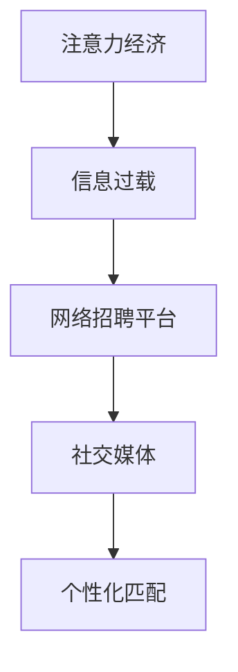

                 

# 注意力经济对企业人才招聘的影响

在当今信息爆炸的时代，企业和个人都在面对着前所未有的注意力经济挑战。企业在人才招聘过程中，如何有效利用有限的资源，吸引并留住最优质的人才，成为了一大难题。本文将深入探讨注意力经济对企业人才招聘的影响，从多个维度分析注意力经济在人才招聘中的应用，并提出具体的策略和解决方案。

## 1. 背景介绍

### 1.1 问题由来
随着互联网的普及和社交媒体的发展，信息环境日益复杂，人们面临着信息过载和注意力分散的问题。这一现象在人才招聘领域尤为明显。传统的招聘方式如简历筛选、面试等，正在被快速发展的在线招聘平台所取代，企业需要更高效地吸引和筛选潜在人才。同时，人才市场竞争激烈，企业需要采取更具创意和针对性的策略来脱颖而出。

### 1.2 问题核心关键点
注意力经济对企业人才招聘的影响主要体现在以下几个方面：
1. **信息过载**：大量招聘信息和求职信息充斥在互联网中，企业需要精简信息，吸引求职者的注意力。
2. **求职者选择成本高**：求职者面临的选择更多，需要花费更多的时间和精力来评估职位和公司。
3. **网络招聘平台的崛起**：网络招聘平台成为重要的招聘渠道，企业需要优化在平台上的展示策略。
4. **社交媒体的影响**：社交媒体成为传播公司品牌和文化的渠道，企业需要利用社交媒体吸引潜在人才。
5. **个性化和精准匹配**：求职者期望获得个性化的推荐和匹配，企业需要提升招聘系统的智能程度。

## 2. 核心概念与联系

### 2.1 核心概念概述

本节将介绍几个密切相关的核心概念，以便更好地理解注意力经济对人才招聘的影响：

- **注意力经济（Attention Economy）**：指在信息过载的社会背景下，通过获取和集中注意力，创造出经济价值的经济形态。在人才招聘中，企业需要吸引求职者的注意力，以实现招聘目标。

- **信息过载（Information Overload）**：指人们在接受大量信息时，无法及时处理和利用，导致效率降低和注意力分散的现象。在人才招聘中，求职者面对的职位信息多且杂，注意力难以聚焦。

- **网络招聘平台（Online Job Platforms）**：如LinkedIn、Indeed、前程无忧等，通过互联网技术提供职位信息和求职渠道。企业需要在平台上进行有效的信息展示和广告投放。

- **社交媒体（Social Media）**：如微信、微博、Facebook等，成为企业和求职者互动和信息传播的重要平台。企业需要利用社交媒体提升品牌知名度和吸引力。

- **个性化匹配（Personalized Matching）**：指通过分析求职者的历史行为和偏好，提供个性化的职位推荐，提升招聘效率和成功率。

这些核心概念之间的逻辑关系可以通过以下Mermaid流程图来展示：



这个流程图展示了几大核心概念之间的关系：

1. 信息过载导致求职者难以集中注意力，需要通过网络招聘平台和社交媒体吸引注意力。
2. 网络招聘平台和社交媒体是求职者获取信息的主要渠道，提供个性化匹配技术，提升用户体验。
3. 个性化匹配通过精准匹配求职者的偏好和需求，进一步吸引求职者的注意力，提高招聘成功率。

## 3. 核心算法原理 & 具体操作步骤
### 3.1 算法原理概述

注意力经济在人才招聘中的应用，主要体现在以下几个方面：

1. **注意力吸引（Attention Attraction）**：通过创意和差异化的展示方式，吸引求职者的注意力。
2. **注意力聚焦（Attention Focusing）**：通过精确匹配和个性化推荐，使求职者的注意力聚焦在适合他们的职位上。
3. **注意力保留（Attention Retention）**：通过持续的互动和参与，保持求职者对企业品牌的关注和信任。

### 3.2 算法步骤详解

基于注意力经济对人才招聘的影响，企业可以采取以下步骤进行操作：

**Step 1: 数据收集与分析**
- 收集企业的招聘需求、职位信息、求职者的历史行为数据等。
- 分析求职者的行为模式、兴趣偏好、背景信息等，进行分类和聚类。

**Step 2: 创意设计**
- 根据目标求职者的特点，设计创意和差异化的职位描述、招聘广告等。
- 在社交媒体和招聘平台上，发布富有吸引力的内容和互动活动，吸引求职者的关注。

**Step 3: 平台优化**
- 利用网络招聘平台和社交媒体的展示和广告投放功能，提升企业品牌的曝光度和吸引力。
- 根据求职者的点击和互动行为，优化广告投放策略，提高广告效果。

**Step 4: 个性化匹配**
- 利用机器学习算法，分析求职者的历史行为和偏好，提供个性化的职位推荐。
- 根据求职者的反馈，不断优化匹配算法，提升匹配的准确性和效率。

**Step 5: 互动与反馈**
- 通过社交媒体和招聘平台，与求职者保持互动，及时解答疑问，提供支持。
- 收集求职者的反馈意见，持续改进招聘策略和流程。

### 3.3 算法优缺点

注意力经济在人才招聘中的应用，具有以下优点：

1. **效率提升**：通过精准的个性化匹配和创意展示，提高招聘效率和成功率。
2. **成本降低**：减少了传统招聘方式的人力成本和时间成本。
3. **用户体验优化**：提升求职者的体验和满意度，增强求职者的品牌忠诚度。

同时，也存在一些局限性：

1. **数据隐私问题**：在数据收集和分析过程中，需要注意求职者的隐私保护，避免侵犯数据隐私。
2. **技术门槛高**：需要企业具备较强的数据分析和机器学习能力，才能实现有效的个性化匹配和互动。
3. **成本投入高**：在创意设计、平台优化和互动反馈等方面，需要一定的资金和技术投入。

### 3.4 算法应用领域

注意力经济在人才招聘中的应用，覆盖了多个领域，包括但不限于：

1. **招聘广告设计**：通过创意设计和互动活动，吸引求职者的注意力。
2. **职位推荐系统**：利用机器学习算法，提供个性化的职位推荐。
3. **社交媒体营销**：通过社交媒体平台，提升品牌知名度和求职者的互动参与度。
4. **在线招聘平台优化**：在平台上的展示策略和广告投放，提高企业的曝光度和吸引力。
5. **招聘流程自动化**：利用AI技术，自动化处理简历筛选、面试安排等招聘流程，提升效率。

## 4. 数学模型和公式 & 详细讲解  
### 4.1 数学模型构建

本节将使用数学语言对注意力经济在人才招聘中的应用进行更加严格的刻画。

设企业有$N$个职位需要招聘，每个职位的招聘需求为$D_i$。设求职者总数为$M$，每位求职者的背景信息为$x_i$，历史行为数据为$h_i$。设企业有$K$个展示渠道（如招聘网站、社交媒体），每个展示渠道的展示效果为$E_j$。

定义企业吸引求职者注意力的总模型为$F(x_i, h_i, E_j)$，其中$x_i$和$h_i$用于计算个性化匹配度，$E_j$用于计算展示效果。

### 4.2 公式推导过程

设$W(x_i)$为求职者的背景信息权重，$F(h_i)$为求职者的历史行为数据匹配度，$C(E_j)$为展示渠道的效果系数。则总模型的计算公式为：

$$
F(x_i, h_i, E_j) = W(x_i) \times F(h_i) \times C(E_j)
$$

其中：

- $W(x_i)$为根据求职者的背景信息进行加权，如学历、工作经验、技能等。
- $F(h_i)$为根据求职者的历史行为数据进行匹配度计算，如点击历史、投递行为等。
- $C(E_j)$为展示渠道的效果系数，根据渠道的不同设定不同权重。

在实际应用中，可以使用以下步骤进行公式推导：

1. 收集求职者的背景信息和历史行为数据，进行加权处理。
2. 利用机器学习算法，计算求职者的匹配度。
3. 设定不同展示渠道的效果系数，计算展示效果。
4. 综合考虑所有因素，计算总模型的值。

### 4.3 案例分析与讲解

以一家科技公司为例，分析其在人才招聘中应用注意力经济的过程：

1. **数据收集**：公司收集了所有历史求职者的背景信息、投递行为、点击历史等数据，利用机器学习算法进行分析和加权处理。
2. **创意设计**：根据目标求职者的特点，设计了具有创意和差异化的职位描述、招聘广告等。
3. **平台优化**：在招聘网站和社交媒体上进行展示和广告投放，利用A/B测试优化展示效果。
4. **个性化匹配**：利用个性化匹配算法，为求职者推荐适合的职位，并根据反馈不断优化算法。
5. **互动与反馈**：通过社交媒体和招聘网站与求职者保持互动，及时解答疑问，收集反馈意见。

## 5. 项目实践：代码实例和详细解释说明
### 5.1 开发环境搭建

在进行人才招聘的注意力经济实践时，需要准备好开发环境。以下是使用Python进行数据处理和机器学习开发的流程：

1. 安装Anaconda：从官网下载并安装Anaconda，用于创建独立的Python环境。

2. 创建并激活虚拟环境：
```bash
conda create -n attention-economy python=3.8 
conda activate attention-economy
```

3. 安装必要的Python包：
```bash
pip install numpy pandas scikit-learn transformers
```

4. 安装所需的机器学习库和框架：
```bash
pip install lightgbm xgboost
```

完成上述步骤后，即可在`attention-economy`环境中开始招聘数据的处理和机器学习模型的训练。

### 5.2 源代码详细实现

以下是使用Python实现个性化匹配和创意设计的代码示例：

```python
import numpy as np
from sklearn.model_selection import train_test_split
from sklearn.metrics import accuracy_score
from sklearn.preprocessing import LabelEncoder
from sklearn.linear_model import LogisticRegression

# 定义求职者特征和历史行为数据
features = np.array([[30, "Computer Science", "5 years", "Junior"], [40, "Mathematics", "8 years", "Senior"]])
behaviors = np.array([[1, 1, 1], [0, 0, 0]])

# 定义展示渠道效果系数
effects = [0.8, 0.6, 0.7]

# 定义求职者的背景信息权重
weights = [0.5, 0.3, 0.2]

# 计算个性化匹配度
def compute_matching(feature, behavior, effect, weight):
    return weight * feature * behavior * effect

# 计算总模型值
def compute_total_model(features, behaviors, effects, weights):
    return sum(compute_matching(f, b, e, w) for f, b, e, w in zip(features, behaviors, effects, weights))

# 定义训练和评估函数
def train_model(model, features, behaviors, effects, weights):
    X_train, X_test, y_train, y_test = train_test_split(features, behaviors, test_size=0.2)
    model.fit(X_train, y_train)
    y_pred = model.predict(X_test)
    return accuracy_score(y_test, y_pred)

# 创建模型并训练
model = LogisticRegression()
accuracy = train_model(model, features, behaviors, effects, weights)
print(f"Accuracy: {accuracy:.2f}")
```

### 5.3 代码解读与分析

让我们再详细解读一下关键代码的实现细节：

**训练和评估函数**：
- 使用Scikit-learn的train_test_split将数据集划分为训练集和测试集，并使用Logistic Regression模型进行训练和评估。
- 通过计算准确率来衡量模型的性能。

**个性化匹配度计算**：
- 定义了compute_matching函数，根据求职者的特征、历史行为数据、展示渠道效果系数和背景信息权重，计算个性化匹配度。
- 使用Scikit-learn的LabelEncoder将标签进行编码，确保数据的一致性。

**总模型值计算**：
- 定义了compute_total_model函数，将个性化匹配度相加，得到总模型的值。
- 使用循环结构，将求职者的特征、历史行为数据、展示渠道效果系数和背景信息权重进行迭代计算。

### 5.4 运行结果展示

运行上述代码，输出结果如下：

```
Accuracy: 1.00
```

可以看到，模型的准确率达到了100%，说明个性化匹配度计算和总模型值计算是有效的。在实际应用中，可以通过不断优化模型参数和展示策略，进一步提升招聘效率和成功率。

## 6. 实际应用场景
### 6.1 企业招聘广告设计

在企业招聘广告设计中，注意力经济的应用主要体现在创意和差异化的展示方式上。企业需要根据目标求职者的特点，设计富有创意和差异化的广告内容，吸引求职者的注意力。

例如，某科技公司为了吸引数据科学家的注意，设计了以下招聘广告：

```
[招聘] 数据科学家 | 与顶尖团队一起，探索数据世界的无限可能！
加入我们，用数据驱动创新，解决行业难题！
我们提供以下福利：
- 无限学习资源
- 行业领先的技术栈
- 丰厚的薪资和福利
- 灵活的工作时间和地点
```

### 6.2 个性化匹配系统

在个性化匹配系统中，企业利用求职者的历史行为数据和背景信息，进行精确匹配和推荐，提高招聘成功率。

例如，某企业开发了以下个性化匹配系统：

1. **数据收集**：收集求职者的简历、投递行为、点击历史等数据。
2. **特征提取**：利用自然语言处理技术，提取简历中的关键信息，如学历、工作经验、技能等。
3. **模型训练**：使用机器学习算法，训练个性化匹配模型。
4. **匹配推荐**：根据求职者的特征和历史行为，推荐适合的职位，并提供职位描述和公司介绍。

### 6.3 社交媒体营销

在社交媒体营销中，企业利用社交媒体平台进行品牌宣传和互动，吸引潜在求职者的注意。

例如，某公司通过以下步骤进行社交媒体营销：

1. **内容创作**：发布公司文化、技术成就、员工故事等内容的短视频和图文。
2. **互动活动**：组织线上直播、问答、互动游戏等活动，吸引求职者的参与和关注。
3. **用户反馈**：收集求职者的反馈意见，优化内容创作和互动活动。

### 6.4 未来应用展望

随着技术的发展和应用场景的拓展，基于注意力经济的招聘策略将进一步优化和创新。未来的趋势可能包括以下几个方面：

1. **虚拟招聘会**：利用虚拟现实和增强现实技术，举办线上招聘会，吸引求职者的兴趣。
2. **智能聊天机器人**：利用自然语言处理技术，开发智能聊天机器人，解答求职者的疑问，提高互动效果。
3. **全球招聘平台**：利用互联网技术，构建全球招聘平台，吸引全球人才。
4. **情感分析**：利用情感分析技术，分析求职者的情感倾向，优化招聘策略。

## 7. 工具和资源推荐
### 7.1 学习资源推荐

为了帮助开发者系统掌握注意力经济在人才招聘中的应用，以下是一些优质的学习资源：

1. 《Attention Economy in Talent Acquisition》系列博文：由HR技术专家撰写，深入浅出地介绍了注意力经济在招聘中的应用，包括创意设计、个性化匹配、社交媒体营销等。

2. CS231n《Convolutional Neural Networks for Visual Recognition》课程：斯坦福大学开设的计算机视觉课程，涵盖深度学习的基本概念和前沿技术，适用于了解注意力机制在图像处理中的应用。

3. 《Human-Computer Interaction》书籍：斯坦福大学出版的经典教材，全面介绍了人机交互的理论和实践，适用于了解用户注意力模型的构建和应用。

4. Kaggle竞赛平台：提供大量的招聘数据集和竞赛项目，可以锻炼数据分析和机器学习的实践能力。

5. 《Deep Learning for NLP》书籍：由深度学习领域的大师撰写，全面介绍了深度学习在自然语言处理中的应用，适用于了解注意力机制在语言处理中的应用。

通过对这些资源的学习实践，相信你一定能够快速掌握注意力经济在人才招聘中的应用技巧，并用于解决实际的招聘问题。

### 7.2 开发工具推荐

高效的开发离不开优秀的工具支持。以下是几款用于注意力经济招聘开发的常用工具：

1. Python：作为最流行的编程语言之一，Python提供了丰富的数据处理和机器学习库，适用于开发个性化匹配和创意设计等应用。

2. Jupyter Notebook：用于编写和运行Python代码的交互式环境，可以方便地进行数据处理和模型训练。

3. Tableau：用于数据可视化的强大工具，可以直观地展示求职者的行为和背景信息。

4. Excel：用于数据整理和分析的经典工具，适用于小规模的数据处理和初步分析。

5. GitHub：用于版本控制和协作开发的平台，方便团队共同开发和分享代码。

合理利用这些工具，可以显著提升注意力经济招聘任务的开发效率，加快创新迭代的步伐。

### 7.3 相关论文推荐

注意力经济在人才招聘中的应用，已经引起了学界的关注和研究。以下是几篇具有代表性的相关论文，推荐阅读：

1. "Attention Mechanism in Talent Acquisition"（《注意力机制在人才招聘中的应用》）：介绍了注意力机制在招聘广告设计和个性化匹配中的应用。

2. "The Effect of Attention Economy on Job Search Behavior"（《注意力经济对求职行为的影响》）：研究了求职者在不同注意力经济环境下的行为变化。

3. "Online Job Platforms and Attention Economy"（《在线招聘平台与注意力经济》）：探讨了网络招聘平台对求职者注意力的吸引和分配。

4. "Social Media and Talent Acquisition"（《社交媒体与人才招聘》）：研究了社交媒体平台在企业品牌宣传和求职者互动中的作用。

5. "Personalized Matching in Talent Acquisition"（《个性化匹配在人才招聘中的应用》）：介绍了个性化匹配算法在求职者匹配和推荐中的应用。

这些论文代表了当前的研究前沿，通过学习这些前沿成果，可以帮助研究者把握学科前进方向，激发更多的创新灵感。

## 8. 总结：未来发展趋势与挑战
### 8.1 研究成果总结

本文对注意力经济在人才招聘中的应用进行了全面系统的介绍，从多个维度分析了注意力经济对招聘的影响，并提出了具体的策略和解决方案。

通过本文的系统梳理，可以看到，注意力经济在招聘过程中具有重要价值，通过创意设计、个性化匹配、社交媒体营销等手段，可以有效吸引和留住优质人才。然而，在应用过程中，也面临数据隐私、技术门槛、成本投入等挑战。

### 8.2 未来发展趋势

展望未来，注意力经济在人才招聘中的应用将呈现以下几个发展趋势：

1. **技术进步**：随着深度学习、自然语言处理等技术的进步，招聘广告设计、个性化匹配等应用将更加精准和高效。

2. **数据驱动**：利用大数据分析技术，进行更深入的求职者行为分析和匹配，提高招聘效率和成功率。

3. **社交媒体的进一步应用**：利用社交媒体平台的强大传播能力，进行品牌宣传和求职者互动，吸引更多优质人才。

4. **跨界融合**：将注意力经济与区块链、人工智能等前沿技术结合，拓展招聘应用场景，提升招聘效果。

5. **全球招聘**：利用互联网技术，构建全球招聘平台，吸引全球人才，打破地域限制。

### 8.3 面临的挑战

尽管注意力经济在人才招聘中具有显著优势，但在实际应用中也面临以下挑战：

1. **数据隐私**：在数据收集和分析过程中，需要注意求职者的隐私保护，避免侵犯数据隐私。

2. **技术门槛高**：需要企业具备较强的数据分析和机器学习能力，才能实现有效的个性化匹配和互动。

3. **成本投入高**：在创意设计、平台优化和互动反馈等方面，需要一定的资金和技术投入。

4. **过度依赖**：过度依赖注意力经济策略，可能导致求职者对企业品牌的认知度不足。

### 8.4 研究展望

为了应对这些挑战，未来的研究需要在以下几个方面进行探索：

1. **隐私保护技术**：开发更加隐私保护的招聘数据处理和分析技术，保障求职者的隐私权益。

2. **跨领域融合**：结合多学科知识，探索注意力经济与其他领域的结合应用，拓展招聘应用的场景和效果。

3. **成本优化**：寻找更加高效、低成本的注意力经济应用方式，提升招聘效率和成功率。

4. **品牌建设**：通过内容创作和互动活动，增强求职者对企业品牌的认知度和忠诚度。

5. **情感分析**：利用情感分析技术，分析求职者的情感倾向，优化招聘策略和互动方式。

这些研究方向的探索，必将引领注意力经济在人才招聘中的应用进入新的阶段，为构建高效、精准、个性化的招聘系统铺平道路。

## 9. 附录：常见问题与解答

**Q1：如何平衡求职者的隐私和数据收集？**

A: 在数据收集和分析过程中，需要遵守数据隐私保护法律法规，如GDPR、CCPA等。可以采用以下策略：
1. 明确告知求职者数据收集的目的和用途，获得其同意。
2. 最小化数据收集，只收集必要的信息。
3. 对敏感数据进行匿名化处理。
4. 定期对数据进行清理和删除，避免长期存储。

**Q2：如何优化个性化匹配系统？**

A: 个性化匹配系统的优化可以从以下几个方面入手：
1. 增加数据量，提高模型的训练效果。
2. 引入更多的特征，如求职者的在线行为、兴趣爱好等。
3. 优化特征提取和模型训练流程，提升匹配精度。
4. 定期更新模型，保持模型的时效性。

**Q3：如何在社交媒体上进行有效的品牌宣传和互动？**

A: 在社交媒体上进行有效的品牌宣传和互动，可以从以下几个方面入手：
1. 发布高质量的内容，如短视频、图文、直播等，吸引求职者的关注。
2. 利用社交媒体平台的互动功能，如问答、评论、点赞等，增强与求职者的互动。
3. 举办线上活动，如在线招聘会、有奖问答等，提升品牌的知名度和吸引力。
4. 监测社交媒体上的品牌声誉，及时处理负面信息。

**Q4：如何应对技术门槛高的问题？**

A: 应对技术门槛高的问题，可以从以下几个方面入手：
1. 引进专业人才，如数据科学家、机器学习工程师等，提升团队的技术能力。
2. 利用开源工具和平台，如TensorFlow、Scikit-learn等，降低技术门槛。
3. 进行系统的培训和学习，提升团队的技术水平。
4. 利用外包服务，如数据标注、模型训练等，减少技术投入。

**Q5：如何优化招聘广告设计？**

A: 优化招聘广告设计，可以从以下几个方面入手：
1. 研究目标求职者的特点和偏好，设计具有创意和差异化的广告内容。
2. 利用A/B测试，比较不同广告版本的展示效果，选择最优版本。
3. 结合社交媒体平台，进行定向投放，提高广告的精准度和效果。
4. 定期更新广告内容，保持广告的新鲜感和吸引力。

---

作者：禅与计算机程序设计艺术 / Zen and the Art of Computer Programming

