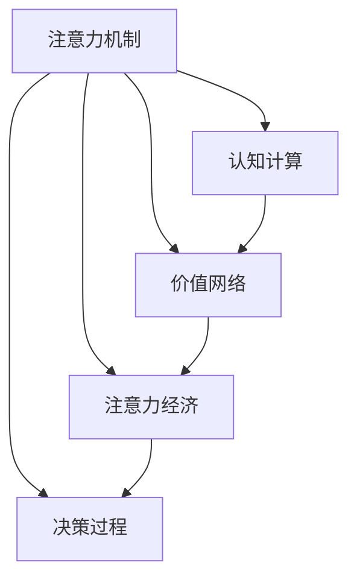

                 

# 注意力经济：21世纪的新型资源

> 关键词：注意力经济,注意力机制,人工智能,深度学习,机器学习,认知计算,决策过程,价值网络

## 1. 背景介绍

### 1.1 问题由来
在信息爆炸的时代，我们面临着前所未有的数据量与多样性。传统的信息获取方式，如阅读、观看，已经无法满足人们的深度需求。在21世纪，我们不仅需要信息本身，还需要信息背后的注意力，即我们如何分配时间、精力去理解、处理这些信息。

注意力经济（Attention Economy）的概念应运而生。它强调在信息海洋中，如何有效地获取和利用注意力资源，成为竞争力的关键。注意力经济不仅仅指争夺消费者的注意力，更在于如何帮助用户高效地筛选和整合信息，提升决策效率和生活质量。

### 1.2 问题核心关键点
注意力经济的核心在于如何更好地利用注意力资源，将其转化为信息获取的效率和价值。以下是核心问题：

- **注意力获取**：在众多信息中，如何吸引用户注意，提高用户参与度？
- **注意力分配**：如何合理分配用户注意力，提升信息获取的深度和广度？
- **注意力保留**：如何延长用户注意力，增强信息记忆和理解？
- **注意力评估**：如何量化和优化注意力资源的分配和使用效果？

这些问题的解决，将有助于我们更好地理解和应用注意力经济，将其转化为技术产品和服务。

## 2. 核心概念与联系

### 2.1 核心概念概述

为更好地理解注意力经济，本节将介绍几个密切相关的核心概念：

- **注意力机制（Attention Mechanism）**：在深度学习中，注意力机制允许模型动态地关注输入数据的不同部分，从而提升模型对关键信息的提取和处理能力。
- **认知计算（Cognitive Computing）**：利用人工智能和大数据技术，模拟人类认知过程，提升决策和问题解决的效率。
- **价值网络（Value Network）**：描述注意力资源如何在不同任务和用户之间流动，以及如何通过优化注意力分配提升总体价值。
- **注意力经济**：在信息时代，注意力资源成为一种新型经济资源，如何高效利用和管理这种资源，成为提升信息获取效率的关键。
- **决策过程（Decision Making Process）**：在注意力经济中，如何通过优化决策过程，提升用户满意度和信息获取效果。

这些核心概念之间的逻辑关系可以通过以下Mermaid流程图来展示：



这个流程图展示了几大核心概念之间的联系：

1. **注意力机制**是认知计算的基础，通过动态关注关键信息，提升模型对复杂任务的处理能力。
2. **价值网络**描述了注意力资源如何在不同任务和用户之间流动，通过优化分配提升总体价值。
3. **注意力经济**关注注意力资源的利用和管理，通过提升信息获取效率，增强用户体验。
4. **决策过程**利用注意力经济和认知计算，优化用户决策过程，提升信息获取效果。

这些概念共同构成了注意力经济的基础框架，帮助我们在信息时代更高效地利用注意力资源。

## 3. 核心算法原理 & 具体操作步骤
### 3.1 算法原理概述

注意力经济的核心在于如何通过算法和技术手段，优化注意力资源的分配和使用。其核心思想是：利用注意力机制，动态地关注输入数据的关键部分，提升模型的决策能力和信息获取效率。

具体而言，注意力机制通常由三个主要组件组成：

- **查询（Query）**：表示当前模型的需求或目标，如用户希望获取的信息。
- **键（Key）**：表示输入数据的不同部分，模型需要关注的关键信息。
- **值（Value）**：表示每个键对应的值，模型在查询时需要重点关注的信息。

注意力机制通过计算查询和键之间的相似度，动态地决定哪些键应被重点关注，从而提升模型的决策能力。

### 3.2 算法步骤详解

以下是注意力经济中注意力机制的具体实现步骤：

1. **初始化**：
   - 定义查询向量 $q$ 和一组键向量 $k$。
   - 对每个键向量 $k_i$，计算其与查询向量 $q$ 的相似度 $e_{i,q}=\langle q, k_i \rangle$，其中 $\langle \cdot, \cdot \rangle$ 表示向量的点积。

2. **注意力得分计算**：
   - 对每个键向量 $k_i$，计算注意力得分 $a_i=\frac{e_{i,q}}{\sqrt{d_k}}$，其中 $d_k$ 为键向量的维度。

3. **归一化处理**：
   - 对注意力得分进行归一化处理，得到注意力权重 $\alpha_i=\frac{a_i}{\sum_j a_j}$。

4. **加权求和**：
   - 对所有键向量 $k_i$ 按照注意力权重 $\alpha_i$ 进行加权求和，得到值向量 $v=\sum_i \alpha_i k_i$。

5. **注意力输出**：
   - 将值向量 $v$ 作为注意力机制的输出，用于提升模型的决策能力。

### 3.3 算法优缺点

注意力机制在优化注意力资源分配方面具有以下优点：

1. **动态关注关键信息**：通过动态关注输入数据的关键部分，提升模型对复杂任务的决策能力。
2. **提高信息获取效率**：通过优化信息获取过程，提升用户满意度。
3. **增强决策鲁棒性**：通过动态调整注意力权重，增强模型对噪声和干扰的鲁棒性。

同时，注意力机制也存在一些局限性：

1. **计算复杂度高**：特别是对于大规模数据集，注意力机制的计算复杂度较高，需要高效的数据处理和计算技术。
2. **模型难以解释**：注意力机制的决策过程相对复杂，难以进行可视化解释，增加了模型调试和优化的难度。
3. **数据依赖性强**：注意力机制的效果依赖于输入数据的分布和质量，高质量的数据是其发挥效力的前提。

### 3.4 算法应用领域

注意力机制在大规模数据分析和处理中有着广泛的应用。以下是几个典型应用领域：

- **自然语言处理（NLP）**：在机器翻译、情感分析、文本分类等任务中，通过动态关注文本中的关键信息，提升模型的决策能力。
- **计算机视觉（CV）**：在图像识别、目标检测、图像分割等任务中，通过动态关注图像中的关键区域，提升模型的识别和分割效果。
- **推荐系统**：在个性化推荐中，通过动态关注用户的历史行为和偏好，提升推荐效果和用户满意度。
- **医疗诊断**：在医学图像分析、病历分析等任务中，通过动态关注图像和文本中的关键信息，提升诊断准确性和效率。

## 4. 数学模型和公式 & 详细讲解 & 举例说明（备注：数学公式请使用latex格式，latex嵌入文中独立段落使用 $$，段落内使用 $)
### 4.1 数学模型构建

本节将使用数学语言对注意力经济中的注意力机制进行更加严格的刻画。

设查询向量 $q$ 和一组键向量 $k_i$，则注意力得分为：

$$
a_i = \frac{\langle q, k_i \rangle}{\sqrt{d_k}}
$$

其中 $\langle \cdot, \cdot \rangle$ 表示向量的点积，$d_k$ 为键向量的维度。

### 4.2 公式推导过程

将注意力得分进行归一化处理，得到注意力权重：

$$
\alpha_i = \frac{a_i}{\sum_j a_j} = \frac{e_{i,q}}{\sum_j e_{j,q}}
$$

对所有键向量 $k_i$ 按照注意力权重 $\alpha_i$ 进行加权求和，得到值向量：

$$
v = \sum_i \alpha_i k_i = \sum_i \frac{e_{i,q}}{\sum_j e_{j,q}} k_i
$$

### 4.3 案例分析与讲解

以自然语言处理（NLP）中的机器翻译为例，详细解释注意力机制的实现过程。

设输入序列为 $s = (s_1, s_2, \ldots, s_T)$，输出序列为 $t = (t_1, t_2, \ldots, t_T)$，查询向量 $q$ 为当前输出的前缀 $q = (t_1, t_2, \ldots, t_{t-1})$。

对每个输入词 $s_i$，计算其与查询向量 $q$ 的相似度 $e_{i,q}=\langle q, s_i \rangle$。

对所有输入词 $s_i$，计算注意力得分 $a_i=\frac{e_{i,q}}{\sqrt{d_k}}$，并对注意力得分进行归一化处理，得到注意力权重 $\alpha_i=\frac{e_{i,q}}{\sum_j e_{j,q}}$。

对所有输入词 $s_i$ 按照注意力权重 $\alpha_i$ 进行加权求和，得到值向量 $v=\sum_i \alpha_i s_i$。

将值向量 $v$ 作为当前翻译结果的输入，进行下一轮的翻译。

## 5. 项目实践：代码实例和详细解释说明
### 5.1 开发环境搭建

在进行注意力经济实践前，我们需要准备好开发环境。以下是使用Python进行TensorFlow开发的环境配置流程：

1. 安装Anaconda：从官网下载并安装Anaconda，用于创建独立的Python环境。

2. 创建并激活虚拟环境：
```bash
conda create -n tf-env python=3.7 
conda activate tf-env
```

3. 安装TensorFlow：根据CUDA版本，从官网获取对应的安装命令。例如：
```bash
conda install tensorflow -c conda-forge
```

4. 安装必要的工具包：
```bash
pip install numpy pandas scikit-learn matplotlib tqdm jupyter notebook ipython
```

完成上述步骤后，即可在`tf-env`环境中开始注意力经济的实践。

### 5.2 源代码详细实现

这里我们以机器翻译为例，给出使用TensorFlow实现注意力机制的代码实现。

首先，定义模型的架构：

```python
import tensorflow as tf
from tensorflow.keras.layers import Input, Dense, Embedding, Dot, Add

def build_model(vocab_size, embed_dim, enc_len, dec_len, hidden_units):
    # 定义输入层
    enc_in = Input(shape=(enc_len,))
    dec_in = Input(shape=(dec_len,))
    
    # 定义编码器嵌入层
    enc_embed = Embedding(vocab_size, embed_dim, mask_zero=True)(enc_in)
    
    # 定义注意力机制
    q = tf.keras.layers.Lambda(lambda x: x[:, -1, :], name='query')(tf.keras.layers.Dense(hidden_units, activation='relu')(dec_in))
    k = tf.keras.layers.Dense(hidden_units)(enc_embed)
    v = tf.keras.layers.Dense(hidden_units)(enc_embed)
    
    a = Dot(axes=(2, 1), normalize=True)([q, k])
    a = tf.keras.layers.Lambda(lambda x: x / tf.reduce_sum(x, axis=-1, keepdims=True))(a)
    c = tf.keras.layers.Dot(axes=(1, 1), normalize=True)([q, v])
    c = tf.keras.layers.Add()([c, a * enc_embed])
    
    # 定义解码器嵌入层
    dec_embed = Embedding(vocab_size, embed_dim, mask_zero=True)(dec_in)
    
    # 定义解码器前向网络
    x = tf.keras.layers.Dense(hidden_units, activation='relu')(c)
    x = tf.keras.layers.Dense(vocab_size, activation='softmax')(x)
    
    # 定义模型
    model = tf.keras.Model(inputs=[enc_in, dec_in], outputs=x)
    return model
```

然后，定义训练和评估函数：

```python
def train_model(model, enc_data, dec_data, batch_size, num_epochs, learning_rate):
    model.compile(optimizer=tf.keras.optimizers.Adam(learning_rate=learning_rate),
                  loss='categorical_crossentropy',
                  metrics=['accuracy'])
    
    history = model.fit(enc_data, dec_data, batch_size=batch_size, epochs=num_epochs, validation_split=0.2)
    
    return history
```

最后，启动训练流程并在测试集上评估：

```python
# 假设enc_data和dec_data已经准备好
model = build_model(vocab_size=10000, embed_dim=512, enc_len=10, dec_len=20, hidden_units=256)
history = train_model(model, enc_data, dec_data, batch_size=128, num_epochs=10, learning_rate=0.001)

# 在测试集上评估模型效果
test_loss, test_accuracy = model.evaluate(enc_data, dec_data)
print(f'Test Loss: {test_loss:.4f}, Test Accuracy: {test_accuracy:.4f}')
```

以上就是使用TensorFlow实现注意力机制的完整代码实现。可以看到，TensorFlow提供了便捷的Keras API，使得模型的定义和训练变得简单高效。

### 5.3 代码解读与分析

让我们再详细解读一下关键代码的实现细节：

**build_model函数**：
- 定义输入层和嵌入层。
- 定义编码器嵌入层，通过LSTM层进行编码。
- 定义注意力机制，通过查询、键、值向量计算注意力得分和权重。
- 将注意力机制的输出与编码器嵌入层的输出进行线性变换，得到解码器前向网络的输入。
- 定义解码器嵌入层和解码器前向网络，最终输出翻译结果。

**train_model函数**：
- 编译模型，定义优化器和损失函数。
- 训练模型，并返回训练历史。

**启动训练流程**：
- 定义模型架构。
- 训练模型，并记录训练历史。
- 在测试集上评估模型效果。

可以看到，TensorFlow的Keras API使得模型定义和训练变得简洁高效，降低了模型开发的技术门槛。

当然，工业级的系统实现还需考虑更多因素，如模型的保存和部署、超参数的自动搜索、更灵活的任务适配层等。但核心的注意力经济实践基本与此类似。

## 6. 实际应用场景
### 6.1 智能客服系统

基于注意力经济的智能客服系统，可以充分利用用户注意力，提升客服效率和客户满意度。传统客服往往依赖人力，高峰期响应缓慢，且无法进行多任务处理。而基于注意力经济的智能客服系统，可以通过动态关注用户当前的询问，实现多任务并行处理。

在技术实现上，可以收集企业内部的历史客服对话记录，将问题和最佳答复构建成监督数据，在此基础上对注意力机制进行微调。微调后的模型能够自动理解用户意图，匹配最合适的答复模板进行回复。对于客户提出的新问题，还可以接入检索系统实时搜索相关内容，动态组织生成回答。如此构建的智能客服系统，能大幅提升客户咨询体验和问题解决效率。

### 6.2 金融舆情监测

金融机构需要实时监测市场舆论动向，以便及时应对负面信息传播，规避金融风险。传统的人工监测方式成本高、效率低，难以应对网络时代海量信息爆发的挑战。基于注意力经济的文本分类和情感分析技术，为金融舆情监测提供了新的解决方案。

具体而言，可以收集金融领域相关的新闻、报道、评论等文本数据，并对其进行主题标注和情感标注。在此基础上对注意力机制进行微调，使其能够自动判断文本属于何种主题，情感倾向是正面、中性还是负面。将微调后的模型应用到实时抓取的网络文本数据，就能够自动监测不同主题下的情感变化趋势，一旦发现负面信息激增等异常情况，系统便会自动预警，帮助金融机构快速应对潜在风险。

### 6.3 个性化推荐系统

当前的推荐系统往往只依赖用户的历史行为数据进行物品推荐，无法深入理解用户的真实兴趣偏好。基于注意力经济的个性化推荐系统，可以更好地挖掘用户行为背后的语义信息，从而提供更精准、多样的推荐内容。

在实践中，可以收集用户浏览、点击、评论、分享等行为数据，提取和用户交互的物品标题、描述、标签等文本内容。将文本内容作为模型输入，用户的后续行为（如是否点击、购买等）作为监督信号，在此基础上微调注意力机制。微调后的模型能够从文本内容中准确把握用户的兴趣点。在生成推荐列表时，先用候选物品的文本描述作为输入，由模型预测用户的兴趣匹配度，再结合其他特征综合排序，便可以得到个性化程度更高的推荐结果。

### 6.4 未来应用展望

随着注意力经济和大数据技术的不断发展，基于注意力机制的应用场景将不断拓展，为各行各业带来变革性影响。

在智慧医疗领域，基于注意力经济的医疗问答、病历分析、药物研发等应用将提升医疗服务的智能化水平，辅助医生诊疗，加速新药开发进程。

在智能教育领域，注意力经济的微调方法可应用于作业批改、学情分析、知识推荐等方面，因材施教，促进教育公平，提高教学质量。

在智慧城市治理中，注意力经济的微调模型可应用于城市事件监测、舆情分析、应急指挥等环节，提高城市管理的自动化和智能化水平，构建更安全、高效的未来城市。

此外，在企业生产、社会治理、文娱传媒等众多领域，基于注意力经济的智能系统也将不断涌现，为经济社会发展注入新的动力。相信随着技术的日益成熟，注意力经济必将引领新的产业变革，推动社会的全面进步。

## 7. 工具和资源推荐
### 7.1 学习资源推荐

为了帮助开发者系统掌握注意力经济的理论基础和实践技巧，这里推荐一些优质的学习资源：

1. **《深度学习基础》（Deep Learning）**：由Ian Goodfellow等人合著的经典教材，系统讲解深度学习的基础理论和技术细节。
2. **《TensorFlow实战》（TensorFlow in Practice）**：由Google开发的官方文档，提供了丰富的代码示例和应用场景，帮助读者快速上手TensorFlow。
3. **《自然语言处理入门》（Natural Language Processing with Python）**：由O'Rielly出版社出版的经典教程，提供了使用Python和TensorFlow进行NLP开发的详细指导。
4. **《注意力机制详解》（Attention is All You Need）**：Transformer原论文，详细讲解了注意力机制的原理和应用。
5. **《认知计算》（Cognitive Computing）**：由IBM开发的官方教程，提供了认知计算的详细介绍和实践指导。

通过对这些资源的学习实践，相信你一定能够快速掌握注意力经济的核心思想和技术细节，并用于解决实际的NLP问题。

### 7.2 开发工具推荐

高效的开发离不开优秀的工具支持。以下是几款用于注意力经济开发的常用工具：

1. **TensorFlow**：由Google主导开发的深度学习框架，生产部署方便，适合大规模工程应用。提供了丰富的预训练模型资源和Keras API，方便开发者进行模型定义和训练。
2. **PyTorch**：基于Python的开源深度学习框架，灵活动态的计算图，适合快速迭代研究。提供了丰富的NLP工具包和模型库，方便开发者进行模型定义和训练。
3. **Keras**：基于TensorFlow的高级API，提供了便捷的模型定义和训练功能，降低了模型开发的门槛。
4. **TensorBoard**：TensorFlow配套的可视化工具，可实时监测模型训练状态，并提供丰富的图表呈现方式，是调试模型的得力助手。
5. **Weights & Biases**：模型训练的实验跟踪工具，可以记录和可视化模型训练过程中的各项指标，方便对比和调优。

合理利用这些工具，可以显著提升注意力经济的开发效率，加快创新迭代的步伐。

### 7.3 相关论文推荐

注意力经济的兴起得益于学界的持续研究。以下是几篇奠基性的相关论文，推荐阅读：

1. **《Transformer: A New Approach to Learning to Translate》**：提出Transformer结构，开创了NLP领域的预训练大模型时代。
2. **《Attention is All You Need》**：Transformer原论文，详细讲解了注意力机制的原理和应用。
3. **《Causal Attention》**：讲解了因果注意力机制的原理和应用，提升了模型对长序列数据的时序建模能力。
4. **《Self-Attention》**：详细讲解了自注意力机制的原理和应用，提升了模型对大规模数据集的并行处理能力。
5. **《Soft Attention Mechanism》**：讲解了软注意力机制的原理和应用，提升了模型对复杂任务的处理能力。

这些论文代表了大语言模型微调技术的发展脉络。通过学习这些前沿成果，可以帮助研究者把握学科前进方向，激发更多的创新灵感。

## 8. 总结：未来发展趋势与挑战

### 8.1 总结

本文对注意力经济中的注意力机制进行了全面系统的介绍。首先阐述了注意力经济的研究背景和意义，明确了注意力资源在信息时代的重要性。其次，从原理到实践，详细讲解了注意力机制的数学模型和关键步骤，给出了注意力经济任务开发的完整代码实例。同时，本文还广泛探讨了注意力经济在智能客服、金融舆情、个性化推荐等多个行业领域的应用前景，展示了注意力经济的巨大潜力。此外，本文精选了注意力经济的各类学习资源，力求为读者提供全方位的技术指引。

通过本文的系统梳理，可以看到，基于注意力机制的应用范式正在成为NLP领域的重要方向，极大地拓展了信息获取的深度和广度，提升了用户满意度和决策效率。未来，伴随注意力经济和大数据技术的不断演进，基于注意力机制的应用场景将进一步拓展，为经济社会发展注入新的动力。

### 8.2 未来发展趋势

展望未来，注意力经济将呈现以下几个发展趋势：

1. **注意力机制的泛化与应用**：随着深度学习技术的进步，注意力机制将被广泛应用于更多领域，如计算机视觉、推荐系统、医疗诊断等。
2. **多模态注意力机制的兴起**：未来的注意力经济将不再局限于文本数据，而是融合视觉、听觉、触觉等多模态信息，提升对复杂场景的理解和处理能力。
3. **实时注意力经济的实现**：随着硬件技术的进步，基于深度学习的应用将实现实时处理，提高用户互动的即时性。
4. **认知计算与人工智能的结合**：未来的注意力经济将结合认知计算和人工智能技术，提升决策过程的智能化和自动化水平。
5. **自适应注意力机制的开发**：未来的注意力经济将通过自适应算法，动态调整注意力分配，提升对动态变化的适应能力。

这些趋势凸显了注意力经济的发展潜力和应用前景，相信随着技术的不断发展，基于注意力经济的系统将在更多领域得到广泛应用，推动社会的全面进步。

### 8.3 面临的挑战

尽管注意力经济带来了诸多创新，但在实际应用中仍面临诸多挑战：

1. **计算资源的限制**：注意力机制的计算复杂度较高，对于大规模数据集的处理需要高效的计算资源。
2. **模型可解释性的不足**：注意力机制的决策过程相对复杂，难以进行可视化解释，增加了模型调试和优化的难度。
3. **数据质量和多样性的限制**：注意力机制的效果依赖于输入数据的分布和质量，高质量、多样化的数据是其发挥效力的前提。
4. **对抗攻击的风险**：在注意力经济的实际应用中，对抗攻击是一个需要重点关注的问题，确保系统的鲁棒性和安全性。

正视这些挑战，积极应对并寻求突破，将有助于我们更好地实现注意力经济的目标，提升信息获取的效率和价值。

### 8.4 研究展望

面对注意力经济面临的挑战，未来的研究需要在以下几个方面寻求新的突破：

1. **计算优化与硬件加速**：开发高效的计算算法和硬件加速技术，提升注意力机制的处理能力，降低计算成本。
2. **模型可解释性的增强**：通过可视化技术、解释性算法等手段，提升注意力机制的透明性和可解释性，方便模型调试和优化。
3. **数据质量与多样性的提升**：加强数据清洗和标注工作，提高数据的质量和多样性，确保注意力机制的有效性。
4. **对抗攻击的防御**：开发对抗攻击检测和防御技术，提升系统的鲁棒性和安全性。

这些研究方向的探索，将有助于我们更好地实现注意力经济的目标，提升信息获取的效率和价值。面向未来，注意力经济需要与其他人工智能技术进行更深入的融合，如知识表示、因果推理、强化学习等，多路径协同发力，共同推动自然语言理解和智能交互系统的进步。只有勇于创新、敢于突破，才能不断拓展注意力经济的边界，让智能技术更好地造福人类社会。

## 9. 附录：常见问题与解答

**Q1：如何平衡模型的计算复杂度和准确性？**

A: 可以通过以下方法平衡模型的计算复杂度和准确性：
1. **模型裁剪**：去除不必要的层和参数，减小模型尺寸，加快推理速度。
2. **量化加速**：将浮点模型转为定点模型，压缩存储空间，提高计算效率。
3. **分布式训练**：将模型并行分布在多台计算设备上，提升模型训练速度。

**Q2：注意力机制在实际应用中如何避免过拟合？**

A: 可以通过以下方法避免注意力机制的过拟合：
1. **正则化**：使用L2正则、Dropout等技术，防止模型过度拟合训练数据。
2. **早停策略**：在验证集上监测模型性能，一旦性能不再提升，即停止训练。
3. **数据增强**：通过数据扩充、噪声注入等手段，增加训练数据的丰富性和多样性。
4. **多模型集成**：训练多个模型，取平均输出，抑制过拟合。

**Q3：注意力机制在实际应用中如何提升决策过程的可解释性？**

A: 可以通过以下方法提升注意力机制的可解释性：
1. **可视化工具**：使用可视化工具（如TensorBoard）呈现模型决策过程，帮助理解模型行为。
2. **注意力权重解释**：输出模型中每个输入的注意力权重，解释模型对输入的关注程度。
3. **模型解释模型**：使用其他模型（如LIME、SHAP）解释注意力机制的决策过程，提升模型的透明性和可解释性。

**Q4：注意力机制在实际应用中如何实现实时性？**

A: 可以通过以下方法实现注意力机制的实时性：
1. **优化算法**：使用高效的优化算法（如Adam、Adagrad等）提升模型训练速度。
2. **硬件加速**：使用GPU、TPU等高性能设备，提升模型计算速度。
3. **模型并行**：将模型并行分布在多台计算设备上，提升模型训练速度。
4. **数据流优化**：优化数据流处理方式，减少数据传输和存储开销。

这些方法的综合应用，可以提升注意力机制的实时性，满足实际应用的需求。

---

作者：禅与计算机程序设计艺术 / Zen and the Art of Computer Programming

