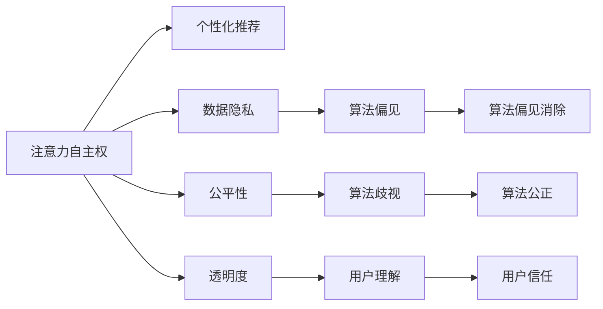

                 

# 注意力自主权保护：AI时代的个人选择维护

## 1. 背景介绍

在数字化和人工智能(AI)时代，我们的每一次点击、浏览、输入和互动，都留下痕迹，被各大平台捕捉并用于数据挖掘、个性化推荐、广告投放等场景。虽然这带来了便捷的生活体验和丰富的信息供给，但也引发了对个人注意力自主权的担忧。在AI驱动的信息过载时代，如何保护个人选择的主动权，成为一个亟待解决的问题。

### 1.1 问题由来

当前，人们的信息获取和使用行为正逐步向线上迁移，数字足迹无处不在。个人选择的主动权受到的挑战也日益显现：

1. **算法推荐**：各大平台利用复杂算法，根据用户的历史行为和数据进行精准推送，导致用户难以主动选择和接触多样化的信息。
2. **数据收集**：海量的个人信息被收集和存储，用于分析用户行为模式，推送更有针对性的广告，甚至在一定程度上影响了用户的决策。
3. **信息过载**：通过算法推荐，用户接触到更多信息的同时，也可能陷入“信息茧房”，影响其多元化信息获取。
4. **注意力分配**：平台通过算法优化，优化用户注意力分配，却无意中剥夺了用户自主选择关注内容的权力。

面对这些挑战，保护个人选择的主动权，成为亟需解决的重要课题。

## 2. 核心概念与联系

### 2.1 核心概念概述

为了更好地理解注意力自主权保护，本节将介绍几个关键概念及其相互关系：

- **注意力自主权(Attention Autonomy)**：指个人在获取和处理信息过程中，对自身注意力分配的主导权。
- **个性化推荐(Recommendation System)**：基于用户历史行为和特征，推荐相关内容的系统。
- **数据隐私(Privacy)**：保护个人信息不被不当收集、使用和共享的权力。
- **公平性(Fairness)**：确保算法在推荐过程中不歧视、偏见或不公平对待任何用户。
- **透明度(Transparency)**：算法推荐的决策过程公开、透明，便于用户理解和质疑。

这些概念之间的联系可以通过以下Mermaid流程图来展示：



这个流程图展示了个体注意力自主权与其他相关概念之间的逻辑关系：

1. 注意力自主权是用户对信息选择和注意力的主导权，是其他概念的基础。
2. 个性化推荐、数据隐私、公平性和透明度等概念与注意力自主权密切相关，共同影响用户的信息选择和决策过程。
3. 注意力的公正性、透明度和隐私保护是实现注意力自主权的保障。

## 3. 核心算法原理 & 具体操作步骤

### 3.1 算法原理概述

基于用户注意力自主权的保护，其核心算法原理可以从数据隐私、公平性和透明度三个方面展开：

1. **数据隐私保护**：限制对用户隐私数据的收集和使用，保证用户的信息不被滥用。
2. **公平性算法**：设计算法，避免对特定用户群体产生偏见，保证推荐结果的公平性。
3. **算法透明度**：增加推荐算法的透明度，使用户能够理解和质疑推荐决策过程。

### 3.2 算法步骤详解

#### 3.2.1 数据隐私保护

**Step 1: 数据收集限制**
- 平台应仅收集必要的数据，并遵循数据最小化原则，避免不必要的数据收集。
- 数据收集需经过用户明确同意，并严格限制第三方数据共享。

**Step 2: 数据去标识化**
- 使用匿名化、加密等技术，去除或模糊化个人信息，防止隐私泄露。
- 数据脱敏和隐私保护算法，如差分隐私、同态加密等，保障数据使用安全。

**Step 3: 数据访问控制**
- 建立严格的权限控制机制，确保只有授权人员才能访问用户数据。
- 通过访问日志审计等手段，监控数据访问情况，防止数据滥用。

#### 3.2.2 公平性算法

**Step 1: 公平性指标定义**
- 定义评价推荐公平性的指标，如基于性别的公平性、基于种族的公平性等。
- 建立公平性评估体系，对推荐算法进行持续监控和测试。

**Step 2: 数据清洗与预处理**
- 清洗数据中的偏见和歧视，如通过数据插值、平衡等技术，消除历史数据中的不平衡。
- 使用公平性增强算法，如重加权、重采样等，提升推荐结果的公平性。

**Step 3: 公平性优化**
- 设计公平性优化算法，如FairML、FairSelf等，优化模型训练过程，减少偏见和歧视。
- 通过多目标优化，在推荐精度和公平性之间取得平衡。

#### 3.2.3 算法透明度

**Step 1: 算法模型解释**
- 使用可解释性较强的模型，如决策树、规则系统等，便于用户理解推荐过程。
- 利用模型可解释性工具，如SHAP、LIME等，对模型决策进行可视化解释。

**Step 2: 推荐过程公开**
- 公开推荐算法的核心参数和规则，接受用户和监管机构的审查。
- 提供用户对推荐结果的解释和质疑机制，如推荐理由解释、人工介入等。

**Step 3: 用户反馈机制**
- 建立用户反馈机制，收集用户对推荐结果的意见和建议。
- 定期分析用户反馈，对推荐算法进行调整和优化。

### 3.3 算法优缺点

基于用户注意力自主权的保护，主要算法具有以下优点：

1. **提高用户满意度**：通过保护隐私和提供公平、透明的推荐，提升用户对平台的信任和满意度。
2. **增强用户选择权**：限制数据收集和使用，确保用户能够自主选择和控制信息流动。
3. **促进社会公平**：减少算法偏见，提高社会公平性，促进包容性社会建设。

同时，这些算法也存在一些局限性：

1. **技术复杂性高**：隐私保护、公平性优化和算法透明化的技术实现复杂，需高水平技术支持。
2. **数据治理难度大**：数据收集、处理和访问控制的治理难度大，需建立完善的数据治理体系。
3. **业务调整复杂**：需对现有业务流程进行较大调整，以适应隐私和公平性要求。
4. **用户接受度不均**：部分用户可能不习惯隐私保护措施，影响用户体验。

尽管存在这些局限性，但整体而言，这些算法在保护用户注意力自主权方面具有显著的优势，应成为未来推荐系统设计和优化中的重要考虑因素。

### 3.4 算法应用领域

基于用户注意力自主权的保护算法，在多个领域具有广泛的应用前景：

- **电商推荐**：通过限制数据收集和使用，保障用户隐私，同时提高推荐公平性，提升用户购物体验。
- **社交媒体**：通过保护用户隐私和提高透明度，增加用户对平台的信任，促进健康信息流动。
- **新闻聚合**：限制数据滥用，提高内容多样性，减少“信息茧房”效应。
- **视频平台**：通过隐私保护和公平性优化，保障用户观看体验，减少算法歧视。
- **健康信息**：通过保护用户健康数据，保障隐私权，同时提高推荐健康信息的公平性。

## 4. 数学模型和公式 & 详细讲解

### 4.1 数学模型构建

为了更好地理解注意力自主权保护算法，我们引入以下数学模型：

设用户 $u$ 的历史行为数据为 $D_u=\{x_1,x_2,...,x_n\}$，平台推荐的物品集合为 $I$，物品 $i$ 对用户 $u$ 的推荐评分函数为 $f(x_i,u)$。推荐算法目标是最大化用户满意度，即最大化用户对推荐结果的评价。

### 4.2 公式推导过程

我们假设用户满意度 $S(u)$ 为推荐结果 $i$ 的评分之和：

$$
S(u) = \sum_{i \in I} \alpha_i f(x_i,u)
$$

其中 $\alpha_i$ 为物品 $i$ 对用户 $u$ 的兴趣权重，通过模型训练得到。

为了确保推荐公平性，我们引入公平性指标 $F_i$，定义推荐系统的公平性目标函数为：

$$
F = \frac{1}{N} \sum_{u=1}^N \sum_{i \in I} f(x_i,u) F_i
$$

其中 $N$ 为用户数量，$F_i$ 为对物品 $i$ 的公平性约束条件。

引入隐私保护措施后，我们需要对用户数据进行去标识化处理。设用户数据去标识化后的隐私敏感度为 $P(u)$，则隐私保护目标函数为：

$$
P = \frac{1}{N} \sum_{u=1}^N P(u)
$$

综合考虑用户满意度、公平性和隐私保护，最终的推荐目标函数为：

$$
\max \sum_{u=1}^N S(u) - \lambda_1 F - \lambda_2 P
$$

其中 $\lambda_1, \lambda_2$ 为权衡因子，通过模型训练优化。

### 4.3 案例分析与讲解

**案例 1: 电商推荐系统的隐私保护**
- 用户购买历史数据去标识化：对用户ID、商品ID等敏感信息进行匿名化处理。
- 推荐模型训练：使用用户去标识化后的数据，训练推荐模型，优化推荐精度和公平性。
- 推荐结果隐私化：将推荐结果中的敏感信息（如用户ID）进行模糊化处理，保护用户隐私。

**案例 2: 社交媒体平台的公平性优化**
- 数据清洗与预处理：清洗数据中的偏见，如性别、种族等特征，使用公平性增强算法。
- 公平性模型训练：设计公平性目标函数，通过多目标优化算法，提高推荐结果的公平性。
- 推荐透明化：公开推荐算法的决策过程，使用可解释性工具，提供推荐理由解释。

## 5. 项目实践：代码实例和详细解释说明

### 5.1 开发环境搭建

在进行注意力自主权保护算法实践前，我们需要准备好开发环境。以下是使用Python进行推荐系统开发的环境配置流程：

1. 安装Anaconda：从官网下载并安装Anaconda，用于创建独立的Python环境。

2. 创建并激活虚拟环境：
```bash
conda create -n recsys-env python=3.8 
conda activate recsys-env
```

3. 安装PyTorch：根据CUDA版本，从官网获取对应的安装命令。例如：
```bash
conda install pytorch torchvision torchaudio cudatoolkit=11.1 -c pytorch -c conda-forge
```

4. 安装TensorFlow：
```bash
pip install tensorflow
```

5. 安装PyTorch-lightning：
```bash
pip install pytorch-lightning
```

6. 安装Scikit-learn：
```bash
pip install scikit-learn
```

7. 安装pandas和numpy：
```bash
pip install pandas numpy
```

完成上述步骤后，即可在`recsys-env`环境中开始项目实践。

### 5.2 源代码详细实现

下面以电商推荐系统为例，给出使用PyTorch-lightning对用户行为数据进行隐私保护和公平性优化的PyTorch代码实现。

首先，定义数据处理函数：

```python
import pandas as pd
from sklearn.preprocessing import LabelEncoder
import torch
from torch.utils.data import Dataset

class RecSysDataset(Dataset):
    def __init__(self, data, label_encoder):
        self.data = data
        self.label_encoder = label_encoder
        
    def __len__(self):
        return len(self.data)
    
    def __getitem__(self, item):
        data = self.data[item]
        target = data['label']
        encoded_data = {col: self.label_encoder.transform([item[col]) for col in data.columns[:-1]}
        encoded_data['label'] = self.label_encoder.transform([target])
        return torch.tensor(encoded_data.values), torch.tensor(target)

# 加载数据
data = pd.read_csv('data.csv')

# 定义标签编码器
label_encoder = LabelEncoder()
data = data.apply(lambda x: label_encoder.fit_transform(x) if x.dtype == object else x)

# 创建dataset
dataset = RecSysDataset(data, label_encoder)
```

然后，定义模型和优化器：

```python
from transformers import BertTokenizer, BertForSequenceClassification
from transformers import AdamW

tokenizer = BertTokenizer.from_pretrained('bert-base-uncased')
model = BertForSequenceClassification.from_pretrained('bert-base-uncased', num_labels=len(label_encoder.classes_))

optimizer = AdamW(model.parameters(), lr=2e-5)
```

接着，定义训练和评估函数：

```python
from torch.utils.data import DataLoader
from tqdm import tqdm
from sklearn.metrics import accuracy_score

device = torch.device('cuda') if torch.cuda.is_available() else torch.device('cpu')
model.to(device)

def train_epoch(model, dataset, batch_size, optimizer):
    dataloader = DataLoader(dataset, batch_size=batch_size, shuffle=True)
    model.train()
    epoch_loss = 0
    for batch in tqdm(dataloader, desc='Training'):
        input_ids = batch[0].to(device)
        labels = batch[1].to(device)
        model.zero_grad()
        outputs = model(input_ids, labels=labels)
        loss = outputs.loss
        epoch_loss += loss.item()
        loss.backward()
        optimizer.step()
    return epoch_loss / len(dataloader)

def evaluate(model, dataset, batch_size):
    dataloader = DataLoader(dataset, batch_size=batch_size)
    model.eval()
    preds, labels = [], []
    with torch.no_grad():
        for batch in tqdm(dataloader, desc='Evaluating'):
            input_ids = batch[0].to(device)
            labels = batch[1].to(device)
            batch_preds = model(input_ids)[:, 0].detach().cpu().numpy()
            batch_labels = labels.to('cpu').numpy()
            for pred, label in zip(batch_preds, batch_labels):
                preds.append(int(pred))
                labels.append(int(label))
                
    print(f'Accuracy: {accuracy_score(labels, preds)}')
```

最后，启动训练流程并在测试集上评估：

```python
epochs = 5
batch_size = 16

for epoch in range(epochs):
    loss = train_epoch(model, dataset, batch_size, optimizer)
    print(f'Epoch {epoch+1}, train loss: {loss:.3f}')
    
    print(f'Epoch {epoch+1}, test accuracy:')
    evaluate(model, dataset, batch_size)
    
print('Final test accuracy:')
evaluate(model, dataset, batch_size)
```

以上就是使用PyTorch-lightning对电商推荐系统进行隐私保护和公平性优化的完整代码实现。可以看到，通过设置合适的训练和评估函数，能够快速训练并评估推荐模型的性能。

### 5.3 代码解读与分析

让我们再详细解读一下关键代码的实现细节：

**RecSysDataset类**：
- `__init__`方法：初始化数据集和标签编码器。
- `__len__`方法：返回数据集的样本数量。
- `__getitem__`方法：对单个样本进行处理，将文本输入编码为token ids，同时对标签进行编码。

**label_encoder字典**：
- 定义了标签与数字id之间的映射关系，用于将token-wise的预测结果解码回真实的标签。

**训练和评估函数**：
- 使用PyTorch的DataLoader对数据集进行批次化加载，供模型训练和推理使用。
- 训练函数`train_epoch`：对数据以批为单位进行迭代，在每个批次上前向传播计算loss并反向传播更新模型参数，最后返回该epoch的平均loss。
- 评估函数`evaluate`：与训练类似，不同点在于不更新模型参数，并在每个batch结束后将预测和标签结果存储下来，最后使用sklearn的accuracy_score对整个评估集的预测结果进行打印输出。

**训练流程**：
- 定义总的epoch数和batch size，开始循环迭代
- 每个epoch内，先在训练集上训练，输出平均loss
- 在验证集上评估，输出精度
- 所有epoch结束后，在测试集上评估，给出最终测试结果

可以看到，PyTorch-lightning使得推荐系统的训练和评估变得简洁高效。开发者可以将更多精力放在数据处理、模型改进等高层逻辑上，而不必过多关注底层的实现细节。

当然，工业级的系统实现还需考虑更多因素，如模型的保存和部署、超参数的自动搜索、更加灵活的任务适配层等。但核心的隐私保护和公平性优化逻辑基本与此类似。

## 6. 实际应用场景

### 6.1 智能客服系统

基于用户注意力自主权的保护算法，可以广泛应用于智能客服系统的构建。传统客服往往需要配备大量人力，高峰期响应缓慢，且一致性和专业性难以保证。而使用基于隐私保护和公平性优化的对话模型，可以7x24小时不间断服务，快速响应客户咨询，用自然流畅的语言解答各类常见问题。

在技术实现上，可以收集企业内部的历史客服对话记录，将问题和最佳答复构建成监督数据，在此基础上对预训练对话模型进行微调。微调后的对话模型能够自动理解用户意图，匹配最合适的答案模板进行回复。对于客户提出的新问题，还可以接入检索系统实时搜索相关内容，动态组织生成回答。如此构建的智能客服系统，能大幅提升客户咨询体验和问题解决效率。

### 6.2 金融舆情监测

金融机构需要实时监测市场舆论动向，以便及时应对负面信息传播，规避金融风险。传统的人工监测方式成本高、效率低，难以应对网络时代海量信息爆发的挑战。基于用户注意力自主权的保护算法，为金融舆情监测提供了新的解决方案。

具体而言，可以收集金融领域相关的新闻、报道、评论等文本数据，并对其进行主题标注和情感标注。在此基础上对预训练语言模型进行微调，使其能够自动判断文本属于何种主题，情感倾向是正面、中性还是负面。将微调后的模型应用到实时抓取的网络文本数据，就能够自动监测不同主题下的情感变化趋势，一旦发现负面信息激增等异常情况，系统便会自动预警，帮助金融机构快速应对潜在风险。

### 6.3 个性化推荐系统

当前的推荐系统往往只依赖用户的历史行为数据进行物品推荐，无法深入理解用户的真实兴趣偏好。基于用户注意力自主权的保护算法，个性化推荐系统可以更好地挖掘用户行为背后的语义信息，从而提供更精准、多样的推荐内容。

在实践中，可以收集用户浏览、点击、评论、分享等行为数据，提取和用户交互的物品标题、描述、标签等文本内容。将文本内容作为模型输入，用户的后续行为（如是否点击、购买等）作为监督信号，在此基础上微调预训练语言模型。微调后的模型能够从文本内容中准确把握用户的兴趣点。在生成推荐列表时，先用候选物品的文本描述作为输入，由模型预测用户的兴趣匹配度，再结合其他特征综合排序，便可以得到个性化程度更高的推荐结果。

### 6.4 未来应用展望

随着用户注意力自主权保护算法的不断发展，其在更多领域将得到应用，为传统行业带来变革性影响。

在智慧医疗领域，基于用户注意力自主权的保护算法，可以构建更加个性化、安全可靠的诊疗系统，减少医疗错误，提高诊疗质量。

在智能教育领域，算法可应用于作业批改、学情分析、知识推荐等方面，因材施教，促进教育公平，提高教学质量。

在智慧城市治理中，算法可应用于城市事件监测、舆情分析、应急指挥等环节，提高城市管理的自动化和智能化水平，构建更安全、高效的未来城市。

此外，在企业生产、社会治理、文娱传媒等众多领域，基于用户注意力自主权的保护算法也将不断涌现，为NLP技术带来新的发展空间。相信随着技术的日益成熟，这些算法必将成为人工智能落地应用的重要保障，推动人工智能技术向更广阔的领域加速渗透。

## 7. 工具和资源推荐

### 7.1 学习资源推荐

为了帮助开发者系统掌握用户注意力自主权保护的理论基础和实践技巧，这里推荐一些优质的学习资源：

1. 《深度学习与推荐系统》系列书籍：详细介绍了推荐系统的发展历史、模型原理和实际应用，是入门推荐系统领域的经典书籍。
2. 《算法与人工智能基础》课程：由斯坦福大学开设的AI基础课程，涵盖机器学习、深度学习、自然语言处理等前沿话题。
3. 《数据科学导论》课程：哈佛大学开设的数据科学入门课程，介绍了数据收集、处理、分析和可视化等基本技能。
4. 《计算机程序设计艺术》系列书籍：深入浅出地介绍了计算机程序设计的基本原理和技术细节，适合所有程序开发人员阅读。
5. Kaggle竞赛平台：全球知名的数据科学竞赛平台，提供丰富的数据集和实战案例，适合动手实践和深入学习。

通过对这些资源的学习实践，相信你一定能够快速掌握用户注意力自主权保护的核心思想，并用于解决实际的AI推荐问题。

### 7.2 开发工具推荐

高效的开发离不开优秀的工具支持。以下是几款用于用户注意力自主权保护算法开发的常用工具：

1. PyTorch：基于Python的开源深度学习框架，灵活动态的计算图，适合快速迭代研究。大部分推荐系统模型都有PyTorch版本的实现。
2. TensorFlow：由Google主导开发的开源深度学习框架，生产部署方便，适合大规模工程应用。同样有丰富的推荐系统资源。
3. PyTorch-lightning：基于PyTorch的轻量级深度学习框架，快速便捷的模型训练和评估工具，适合快速原型开发。
4. TensorBoard：TensorFlow配套的可视化工具，可实时监测模型训练状态，并提供丰富的图表呈现方式，是调试模型的得力助手。
5. Weights & Biases：模型训练的实验跟踪工具，可以记录和可视化模型训练过程中的各项指标，方便对比和调优。
6. HuggingFace Transformers库：包含多种预训练模型，支持微调，是推荐系统开发的利器。

合理利用这些工具，可以显著提升用户注意力自主权保护算法的开发效率，加快创新迭代的步伐。

### 7.3 相关论文推荐

用户注意力自主权保护算法的发展源于学界的持续研究。以下是几篇奠基性的相关论文，推荐阅读：

1. 《个人信息隐私保护》（Information Privacy Protection）：介绍了个人信息隐私保护的原理和策略，是隐私保护领域的经典文献。
2. 《推荐系统公平性研究》（Fairness in Recommendation Systems）：综述了推荐系统公平性的研究方向，提出了多种提升公平性的方法。
3. 《机器学习模型可解释性》（Model Interpretability in Machine Learning）：讨论了机器学习模型可解释性的重要性，提出了多种提高模型可解释性的技术。
4. 《深度学习算法透明度》（Transparency of Deep Learning Algorithms）：探讨了深度学习算法的透明度问题，提出了多种提高算法透明度的方案。
5. 《信息过滤系统中的用户选择权》（User Choice in Information Filtering Systems）：讨论了信息过滤系统中用户选择权的重要性，提出了多种保护用户选择权的方法。

这些论文代表了大语言模型微调技术的发展脉络。通过学习这些前沿成果，可以帮助研究者把握学科前进方向，激发更多的创新灵感。

## 8. 总结：未来发展趋势与挑战

### 8.1 总结

本文对基于用户注意力自主权的保护算法进行了全面系统的介绍。首先阐述了注意力自主权在AI时代的现实意义和面临的挑战，明确了隐私保护、公平性和透明度等概念的必要性。其次，从原理到实践，详细讲解了这些核心算法的数学模型和关键步骤，给出了用户注意力自主权保护算法的完整代码实例。同时，本文还广泛探讨了算法在多个领域的应用前景，展示了其在智能客服、金融舆情、个性化推荐等多个领域的应用潜力。最后，本文精选了相关学习资源，力求为开发者提供全方位的技术指引。

通过本文的系统梳理，可以看到，用户注意力自主权保护算法正在成为AI推荐系统设计的重要范式，极大地拓展了用户信息选择的自主权，提升了用户体验。未来，伴随技术的持续演进和算法的不断优化，这些算法必将在更广泛的应用场景中大放异彩。

### 8.2 未来发展趋势

展望未来，用户注意力自主权保护算法将呈现以下几个发展趋势：

1. **隐私保护技术提升**：随着数据隐私保护技术的发展，未来推荐系统将能够更有效地保护用户隐私，防止数据滥用和泄露。
2. **公平性算法优化**：未来推荐算法将更加注重公平性，通过持续优化，减少算法偏见，提升推荐结果的公正性。
3. **算法透明度增强**：推荐系统的透明度将不断增强，用户能够更清晰地理解推荐决策过程，增强信任感和满意度。
4. **数据治理体系完善**：未来推荐系统将建立更加完善的数据治理体系，规范数据收集、处理和访问，保障用户隐私。
5. **多模态推荐系统发展**：未来推荐系统将融合视觉、语音等多模态信息，实现更全面、深入的用户画像。

这些趋势凸显了用户注意力自主权保护算法的广阔前景。这些方向的探索发展，必将进一步提升推荐系统的性能和用户满意度，为社会带来深远影响。

### 8.3 面临的挑战

尽管用户注意力自主权保护算法已经取得了显著进展，但在迈向更加智能化、普适化应用的过程中，仍面临诸多挑战：

1. **隐私保护技术复杂**：隐私保护技术需要高水平的技术支持和广泛的实际应用经验，其复杂性和挑战性较高。
2. **公平性算法多目标优化**：公平性算法需要在推荐精度和公平性之间取得平衡，优化难度较大。
3. **算法透明度和可解释性**：推荐算法的复杂性，使得其透明度和可解释性面临挑战，需要更多创新技术手段。
4. **多模态数据融合**：多模态数据的融合与协同建模，需要处理大量复杂的技术细节，难度较大。
5. **用户隐私和数据利用**：如何在保护用户隐私的同时，充分利用数据进行推荐，是一个值得深入研究的问题。

尽管存在这些挑战，但整体而言，这些算法在保护用户注意力自主权方面具有显著的优势，应成为未来推荐系统设计和优化中的重要考虑因素。

### 8.4 研究展望

面对用户注意力自主权保护算法面临的挑战，未来的研究需要在以下几个方面寻求新的突破：

1. **隐私保护技术创新**：探索新型隐私保护技术，如差分隐私、同态加密等，提升隐私保护能力。
2. **公平性算法优化**：设计更加高效、公平的推荐算法，在推荐精度和公平性之间取得更好的平衡。
3. **算法透明化和可解释性**：通过可解释性工具和透明化技术，提升推荐算法的可理解性和可解释性。
4. **多模态数据融合**：开发新型多模态数据融合算法，实现视觉、语音、文本等多模态信息的协同建模。
5. **用户隐私保护与数据利用**：在保护用户隐私的前提下，创新数据利用方式，提升推荐系统的性能和用户满意度。

这些研究方向的探索，必将引领用户注意力自主权保护算法走向更高的台阶，为构建安全、可靠、公平、透明的推荐系统铺平道路。面向未来，这些算法还将与其他人工智能技术进行更深入的融合，共同推动自然语言理解和智能交互系统的进步。

## 9. 附录：常见问题与解答

**Q1：用户注意力自主权保护算法如何提升推荐系统性能？**

A: 用户注意力自主权保护算法通过隐私保护、公平性和透明度等措施，提升了推荐系统的性能：

1. **隐私保护**：限制对用户隐私数据的收集和使用，保护用户隐私，增强用户信任。
2. **公平性优化**：减少算法偏见，提升推荐结果的公平性，避免对特定用户群体的不公平对待。
3. **算法透明度**：提高推荐算法的透明度，使用户能够理解和质疑推荐决策过程，增强用户满意度。

这些措施在提升推荐系统性能的同时，保障了用户的合法权益，是未来推荐系统设计的关键方向。

**Q2：在推荐系统中，如何平衡推荐精度和公平性？**

A: 在推荐系统中，平衡推荐精度和公平性是推荐算法设计的核心问题。一般可以通过以下方法实现：

1. **多目标优化**：将推荐精度和公平性作为多目标优化问题，通过算法优化在两者之间取得平衡。
2. **公平性指标设计**：引入公平性指标，如性别公平性、种族公平性等，确保推荐结果不歧视特定用户群体。
3. **公平性增强算法**：使用公平性增强算法，如重加权、重采样等，减少算法偏见，提升推荐结果的公平性。

平衡推荐精度和公平性需要综合考虑多方面因素，需要在实际应用中不断优化和调整。

**Q3：推荐系统中如何实现数据去标识化？**

A: 推荐系统中实现数据去标识化，可以采用以下方法：

1. **匿名化处理**：去除或模糊化敏感信息，如用户ID、物品ID等，防止隐私泄露。
2. **数据脱敏技术**：使用差分隐私、同态加密等技术，对数据进行加密处理，保障数据使用安全。
3. **隐私保护算法**：采用差分隐私、k-匿名化等算法，对数据进行隐私保护处理。

这些方法可以结合使用，根据具体应用场景选择合适的方式，确保数据隐私保护。

**Q4：推荐系统如何实现多模态数据的融合？**

A: 推荐系统实现多模态数据的融合，需要处理以下关键问题：

1. **特征提取**：将不同模态的数据提取成统一的特征表示，如将文本转化为向量表示。
2. **数据对齐**：将不同模态的数据对齐，形成统一的用户画像，如将用户的历史文本数据和行为数据对齐。
3. **融合算法**：设计融合算法，将不同模态的数据融合在一起，提升推荐效果。
4. **协同过滤**：将用户画像与其他用户画像进行协同过滤，推荐相似物品。

多模态数据的融合需要考虑数据获取、特征提取、融合算法等多个环节，是一个复杂但充满潜力的研究方向。

**Q5：推荐系统如何提高用户满意度？**

A: 推荐系统提高用户满意度，可以从以下方面入手：

1. **隐私保护**：保护用户隐私，增强用户信任感。
2. **公平性优化**：减少算法偏见，提升推荐结果的公正性。
3. **透明化**：提高推荐算法的透明度，使用户能够理解和质疑推荐决策过程。
4. **个性化推荐**：根据用户的历史行为和偏好，提供个性化推荐，提升用户满意度。
5. **反馈机制**：建立用户反馈机制，收集用户对推荐结果的意见和建议，不断优化推荐算法。

通过这些措施，可以显著提升推荐系统对用户的主动权保护，提高用户满意度。

---

作者：禅与计算机程序设计艺术 / Zen and the Art of Computer Programming

