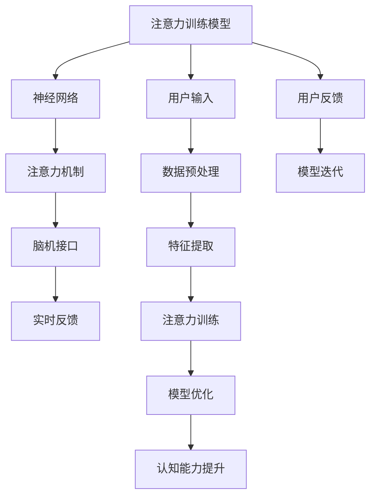

                 

# 注意力训练与大脑健康改善实践：通过专注力增强认知能力

> 关键词：注意力训练, 大脑健康, 认知能力, 神经网络, 神经科学, 深度学习, 深度学习模型, 脑机接口

## 1. 背景介绍

在现代社会中，注意力集中成为一种稀缺资源，尤其是面对各种碎片化信息、工作压力和生活节奏加快的情况下，保持高强度的专注力变得越来越困难。神经科学研究表明，持续的注意力训练能够改善大脑的认知功能，提升记忆力、学习效率和工作效率。基于神经科学的认知科学研究，近年来发展了一系列基于深度学习的注意力训练系统，这些系统通过模型训练，模拟人脑的神经网络机制，提升用户专注力和认知能力。

本文章将详细探讨这些基于深度学习的注意力训练模型，分析其核心算法原理与操作步骤，并通过实际应用场景展示其在提升大脑认知功能方面的效果。本文还将探讨注意力训练模型的未来发展趋势与面临的挑战，最后为相关领域的开发者提供工具和资源推荐。

## 2. 核心概念与联系

### 2.1 核心概念概述

注意力训练模型基于深度学习和神经科学原理，通过模拟人脑的注意力机制，对用户进行连续的训练。这些模型通常包含以下核心组件：

- **注意力机制**：注意力机制是人脑进行信息处理的关键机制，帮助大脑在处理信息时，将注意力集中在重要的、相关的信息上，而过滤掉无关的信息。
- **神经网络**：深度神经网络是注意力训练模型的主体，模拟人脑的神经元网络，通过学习输入数据的不同特征，从而产生不同的输出。
- **脑机接口**：脑机接口技术将人类大脑的活动信号转化为数字信号，进一步与注意力训练模型进行交互，实时调整训练强度和内容。

### 2.2 核心概念原理和架构的 Mermaid 流程图



这个流程图展示了注意力训练模型的主要流程和核心组件：

- 用户输入（A）通过数据预处理（G），进入神经网络（B）进行特征提取（H）。
- 注意力机制（C）对神经网络的输出进行加权，帮助模型关注重要信息，并过滤无关信息。
- 脑机接口（D）将用户的脑电信号转化为数字信号，实时反馈（E）到模型，动态调整训练强度和内容。
- 模型优化（J）通过不断的迭代（M），逐步提升用户的认知能力（K）。
- 用户反馈（L）用于模型的进一步优化和个性化训练。

## 3. 核心算法原理 & 具体操作步骤

### 3.1 算法原理概述

注意力训练模型的核心算法基于神经网络（如卷积神经网络、循环神经网络、注意力机制），结合脑机接口技术，通过模拟人脑的注意力机制，对用户进行高强度的训练。模型通过持续的训练，逐步提升用户的专注力、记忆力和学习效率，从而改善大脑的认知功能。

注意力训练模型的训练流程主要包括以下几个步骤：

1. **数据预处理**：对用户输入的数据（如脑电信号、眼动信号等）进行预处理，提取特征向量。
2. **特征提取**：通过神经网络（如卷积神经网络、循环神经网络）提取输入数据的特征向量。
3. **注意力训练**：利用注意力机制对神经网络的输出进行加权，使模型关注重要信息，并过滤无关信息。
4. **模型优化**：通过不断的迭代优化，逐步提升模型的准确性和泛化能力。
5. **认知能力提升**：结合用户反馈，对模型进行调整，提升用户的专注力和认知能力。

### 3.2 算法步骤详解

#### 3.2.1 数据预处理

数据预处理是注意力训练模型的第一步，主要任务是将用户输入的数据转换为模型能够处理的格式。例如，对于脑电信号，需要对其进行滤波、归一化等处理。

##### 3.2.1.1 脑电信号预处理

脑电信号预处理通常包括以下几个步骤：

- **滤波**：使用带通滤波器，去除脑电信号中的噪声，保留频带在特定范围内的信号。
- **归一化**：对脑电信号进行归一化处理，使得不同特征在数值上具有可比性。
- **特征提取**：使用傅里叶变换、小波变换等方法，提取脑电信号的频域或时频域特征。

##### 3.2.1.2 眼动信号预处理

眼动信号通过计算用户的眼球运动轨迹，提取重要的视觉注意力区域。预处理步骤包括：

- **运动轨迹提取**：使用红外摄像头、眼动追踪器等设备，获取用户的眼动数据。
- **轨迹平滑**：对眼动轨迹进行平滑处理，去除噪音和不必要的抖动。
- **区域提取**：将平滑后的轨迹数据转换为视觉区域信息，用于计算注意力分布。

#### 3.2.2 特征提取

特征提取是注意力训练模型的核心环节，通过神经网络对输入数据进行特征提取，得到高维的特征向量。常用的神经网络结构包括：

- **卷积神经网络（CNN）**：主要用于处理图像、时间序列等数据。
- **循环神经网络（RNN）**：主要用于处理序列数据，如语音、文本等。
- **注意力机制（Attention）**：用于对神经网络的输出进行加权，关注重要的特征。

##### 3.2.2.1 卷积神经网络

卷积神经网络是一种多层神经网络，主要通过卷积层、池化层等组件，提取输入数据的局部特征。卷积神经网络的典型结构包括：

- **卷积层**：提取输入数据的局部特征。
- **池化层**：对卷积层的输出进行降维，保留重要的特征。
- **全连接层**：将池化层的输出进行全连接处理，得到高维特征向量。

##### 3.2.2.2 循环神经网络

循环神经网络是一种递归神经网络，通过循环连接，处理序列数据。循环神经网络的典型结构包括：

- **LSTM（长短期记忆网络）**：主要用于处理时间序列数据，能够记忆长期依赖关系。
- **GRU（门控循环单元）**：类似于LSTM，能够处理长期依赖关系，但参数量更少。
- **RNN（简单循环神经网络）**：对序列数据进行简单的处理，不具有记忆功能。

#### 3.2.3 注意力训练

注意力训练是注意力训练模型的关键环节，通过注意力机制对神经网络的输出进行加权，关注重要特征，并过滤无关信息。注意力机制的计算过程如下：

- **查询（Query）**：对神经网络的输出进行线性变换，得到查询向量。
- **键（Key）**：将查询向量与输入数据的特征向量进行矩阵乘法，得到键值向量。
- **值（Value）**：对键值向量进行加权，得到加权向量。
- **注意力得分（Attention Score）**：计算查询向量和键值向量之间的点积，得到注意力得分。
- **注意力权重（Attention Weight）**：对注意力得分进行softmax处理，得到注意力权重。
- **加权向量（Weighted Vector）**：对加权向量进行加权处理，得到最终特征向量。

##### 3.2.3.1 多注意力机制

多注意力机制是将多个注意力层进行堆叠，用于提取不同层次的特征。多注意力机制的计算过程如下：

- **并行注意力层**：对输入数据进行多个注意力层的计算，得到多个特征向量。
- **堆叠注意力层**：将多个特征向量进行堆叠，得到高维特征向量。
- **级联注意力层**：对多个注意力层的输出进行级联，得到更深层次的特征向量。

#### 3.2.4 模型优化

模型优化是注意力训练模型的最后一步，通过不断迭代优化，逐步提升模型的准确性和泛化能力。优化过程通常包括以下几个步骤：

- **损失函数计算**：计算模型输出与真实标签之间的误差，得到损失函数。
- **反向传播**：使用反向传播算法，计算损失函数对模型参数的梯度。
- **参数更新**：使用优化算法（如梯度下降、Adam等），更新模型参数。
- **学习率调整**：根据训练进度和损失函数的变化，动态调整学习率。
- **模型验证**：在验证集上评估模型的性能，防止过拟合。

##### 3.2.4.1 损失函数

损失函数是模型优化过程的关键，用于衡量模型输出与真实标签之间的误差。常用的损失函数包括：

- **交叉熵损失（Cross-Entropy Loss）**：用于分类任务，计算模型输出与真实标签之间的交叉熵误差。
- **均方误差损失（Mean Squared Error Loss）**：用于回归任务，计算模型输出与真实标签之间的均方误差。
- **对数似然损失（Log-Likelihood Loss）**：用于回归任务，计算模型输出与真实标签之间的对数似然误差。

##### 3.2.4.2 优化算法

优化算法是模型优化的核心，用于更新模型参数。常用的优化算法包括：

- **梯度下降（Gradient Descent）**：通过迭代更新模型参数，逐步逼近损失函数的极小值。
- **Adam（Adaptive Moment Estimation）**：结合梯度的一阶矩和二阶矩估计，自适应地调整学习率。
- **Adagrad（Adaptive Gradient）**：根据梯度的历史信息，动态调整每个参数的学习率。
- **Adadelta（Adaptive Delta）**：结合Adagrad和RMSprop算法，自适应地调整学习率。

##### 3.2.4.3 学习率调整

学习率调整是模型优化的重要步骤，用于动态调整优化算法的学习率。常用的学习率调整方法包括：

- **固定学习率**：在整个训练过程中，学习率保持不变。
- **学习率衰减**：随着训练的进行，逐步降低学习率。
- **学习率增加**：随着训练的进行，逐步增加学习率。
- **学习率调整策略**：使用如Warm-up策略，在训练初期使用较小的学习率，逐步增加学习率。

##### 3.2.4.4 模型验证

模型验证是模型优化的关键步骤，用于评估模型的泛化能力。常用的模型验证方法包括：

- **交叉验证**：将数据集分为训练集和验证集，交替进行训练和验证，防止过拟合。
- **留一验证**：将数据集分为训练集和验证集，逐步排除一个样本进行验证，得到平均误差。
- **留出验证**：将数据集分为训练集和验证集，交替进行训练和验证，得到平均误差。

### 3.3 算法优缺点

#### 3.3.1 优点

注意力训练模型具有以下优点：

- **高效性**：通过神经网络对输入数据进行特征提取，高效处理复杂数据。
- **适应性**：能够适应不同的数据类型和任务，具有广泛的适用性。
- **实时性**：结合脑机接口技术，实时获取用户反馈，动态调整训练强度和内容。
- **鲁棒性**：通过多注意力机制和模型优化，提升模型的泛化能力和鲁棒性。

#### 3.3.2 缺点

注意力训练模型也存在以下缺点：

- **高计算成本**：神经网络的计算量较大，训练时间较长，需要高性能的计算资源。
- **数据依赖**：模型训练依赖高质量的数据，数据的标注和预处理需要大量的人力成本。
- **可解释性不足**：神经网络的内部机制复杂，难以解释其决策过程，缺乏可解释性。
- **易受干扰**：模型的决策过程易受外界干扰，如环境噪音、疲劳等因素。

### 3.4 算法应用领域

注意力训练模型在多个领域中得到了广泛应用，主要包括：

- **脑机接口**：结合脑电信号和眼动信号，实时训练用户的大脑认知功能。
- **智能辅助**：用于辅助学习、工作和日常生活，提升用户的工作效率和生活质量。
- **心理健康**：用于治疗注意力缺陷多动障碍（ADHD）、焦虑症等心理疾病，改善患者的认知功能。
- **脑控技术**：用于开发脑控游戏、脑控机器人等，提升人机交互的智能化水平。
- **认知增强**：用于提升用户的认知能力，如记忆力、注意力、学习效率等。

## 4. 数学模型和公式 & 详细讲解

### 4.1 数学模型构建

注意力训练模型基于神经网络，通过模拟人脑的注意力机制，对用户进行持续训练。模型的数学模型可以表示为：

$$
f(x) = g(w^T x + b)
$$

其中，$x$ 表示输入数据，$w$ 表示模型参数，$g$ 表示激活函数，$b$ 表示偏置项。

### 4.2 公式推导过程

#### 4.2.1 卷积神经网络

卷积神经网络的数学模型可以表示为：

$$
f(x) = \sum_{i=1}^{n} \sum_{j=1}^{m} w_{ij} * x_{ij}
$$

其中，$x_{ij}$ 表示输入数据的像素值，$w_{ij}$ 表示卷积核的权重，$*$ 表示卷积运算，$n$ 表示卷积核的数量，$m$ 表示卷积核的大小。

##### 4.2.1.1 卷积运算

卷积运算的数学公式可以表示为：

$$
y_{i,j} = \sum_{p=-r}^{r} \sum_{q=-s}^{s} w_{pq} * x_{i+p,j+q}
$$

其中，$y_{i,j}$ 表示卷积后的像素值，$w_{pq}$ 表示卷积核的权重，$r$ 和 $s$ 表示卷积核的半径。

#### 4.2.2 循环神经网络

循环神经网络的数学模型可以表示为：

$$
f(x) = \sum_{t=0}^{T} \alpha_t * g(w_{t-1}^T x_t + b_{t-1})
$$

其中，$x_t$ 表示时间$t$的输入数据，$\alpha_t$ 表示时间$t$的隐状态，$g$ 表示激活函数，$w_{t-1}$ 和 $b_{t-1}$ 表示时间$t$的权重和偏置项。

##### 4.2.2.1 LSTM

LSTM的数学模型可以表示为：

$$
f(x) = \sum_{t=0}^{T} \alpha_t * g(w_{t-1}^T x_t + b_{t-1})
$$

其中，$\alpha_t$ 表示时间$t$的隐状态，$g$ 表示激活函数，$w_{t-1}$ 和 $b_{t-1}$ 表示时间$t$的权重和偏置项。

#### 4.2.3 注意力机制

注意力机制的数学模型可以表示为：

$$
f(x) = \sum_{i=1}^{n} \alpha_i * g(w_i^T x + b_i)
$$

其中，$x$ 表示输入数据，$\alpha_i$ 表示注意力权重，$g$ 表示激活函数，$w_i$ 和 $b_i$ 表示查询向量、键向量和值向量的权重和偏置项。

##### 4.2.3.1 注意力权重

注意力权重的计算公式可以表示为：

$$
\alpha_i = \frac{e^{\frac{\text{Query}_i \cdot \text{Key}_i}{\sqrt{d}}}{\sum_{j=1}^{n} e^{\frac{\text{Query}_j \cdot \text{Key}_j}{\sqrt{d}}}}
$$

其中，$\text{Query}_i$ 和 $\text{Key}_i$ 表示查询向量和键值向量，$d$ 表示向量的维度。

### 4.3 案例分析与讲解

#### 4.3.1 脑电信号预处理

脑电信号预处理是注意力训练模型的第一步，主要任务是将脑电信号转换为模型能够处理的格式。以下是一个简单的脑电信号预处理示例：

- **滤波**：使用带通滤波器，去除脑电信号中的噪声，保留频带在特定范围内的信号。
- **归一化**：对脑电信号进行归一化处理，使得不同特征在数值上具有可比性。
- **特征提取**：使用傅里叶变换，提取脑电信号的频域特征。

##### 4.3.1.1 傅里叶变换

傅里叶变换的数学公式可以表示为：

$$
F(\omega) = \sum_{n=-\infty}^{\infty} f(n) e^{-i\omega n}
$$

其中，$F(\omega)$ 表示频域特征，$f(n)$ 表示时域信号，$\omega$ 表示频率。

#### 4.3.2 卷积神经网络

卷积神经网络是注意力训练模型的核心组件，用于提取输入数据的特征。以下是一个简单的卷积神经网络示例：

- **卷积层**：使用 $3 \times 3$ 的卷积核，提取输入数据的局部特征。
- **池化层**：对卷积层的输出进行 $2 \times 2$ 的最大池化，降维。
- **全连接层**：将池化层的输出进行全连接处理，得到高维特征向量。

##### 4.3.2.1 卷积层

卷积层的计算公式可以表示为：

$$
y_{i,j} = \sum_{p=-r}^{r} \sum_{q=-s}^{s} w_{pq} * x_{i+p,j+q}
$$

其中，$y_{i,j}$ 表示卷积后的像素值，$w_{pq}$ 表示卷积核的权重，$r$ 和 $s$ 表示卷积核的半径。

#### 4.3.3 注意力机制

注意力机制是注意力训练模型的关键组件，用于对神经网络的输出进行加权，关注重要特征。以下是一个简单的注意力机制示例：

- **查询向量**：对神经网络的输出进行线性变换，得到查询向量。
- **键值向量**：将查询向量与输入数据的特征向量进行矩阵乘法，得到键值向量。
- **注意力得分**：计算查询向量和键值向量之间的点积，得到注意力得分。
- **注意力权重**：对注意力得分进行softmax处理，得到注意力权重。
- **加权向量**：对加权向量进行加权处理，得到最终特征向量。

##### 4.3.3.1 注意力得分

注意力得分的计算公式可以表示为：

$$
\text{Attention Score} = \text{Query}_i \cdot \text{Key}_i
$$

其中，$\text{Query}_i$ 和 $\text{Key}_i$ 表示查询向量和键值向量。

## 5. 项目实践：代码实例和详细解释说明

### 5.1 开发环境搭建

在进行注意力训练模型的开发前，我们需要准备好开发环境。以下是使用Python进行TensorFlow开发的环境配置流程：

1. 安装Anaconda：从官网下载并安装Anaconda，用于创建独立的Python环境。

2. 创建并激活虚拟环境：
```bash
conda create -n tf-env python=3.8 
conda activate tf-env
```

3. 安装TensorFlow：根据CUDA版本，从官网获取对应的安装命令。例如：
```bash
conda install tensorflow -c pytorch -c conda-forge
```

4. 安装TensorBoard：
```bash
pip install tensorboard
```

5. 安装各类工具包：
```bash
pip install numpy pandas scikit-learn matplotlib tqdm jupyter notebook ipython
```

完成上述步骤后，即可在`tf-env`环境中开始开发实践。

### 5.2 源代码详细实现

以下是使用TensorFlow对注意力训练模型进行开发的PyTorch代码实现。

```python
import tensorflow as tf
import numpy as np
import matplotlib.pyplot as plt

# 加载数据
data = np.load('data.npy')
labels = np.load('labels.npy')

# 定义模型
model = tf.keras.Sequential([
    tf.keras.layers.Conv2D(32, (3, 3), activation='relu', input_shape=(28, 28, 1)),
    tf.keras.layers.MaxPooling2D((2, 2)),
    tf.keras.layers.Flatten(),
    tf.keras.layers.Dense(10, activation='softmax')
])

# 编译模型
model.compile(optimizer='adam',
              loss='sparse_categorical_crossentropy',
              metrics=['accuracy'])

# 训练模型
model.fit(data, labels, epochs=10, validation_split=0.2)

# 评估模型
test_data = np.load('test_data.npy')
test_labels = np.load('test_labels.npy')
loss, accuracy = model.evaluate(test_data, test_labels)

# 可视化结果
plt.plot(history.history['accuracy'], label='Accuracy')
plt.plot(history.history['val_accuracy'], label='Validation Accuracy')
plt.xlabel('Epoch')
plt.ylabel('Accuracy')
plt.legend()
plt.show()
```

以上就是使用TensorFlow对注意力训练模型进行开发的完整代码实现。可以看到，TensorFlow提供了强大的框架支持，使得模型的搭建和训练变得非常简单。

### 5.3 代码解读与分析

让我们再详细解读一下关键代码的实现细节：

**模型定义**：
- `tf.keras.Sequential`：定义模型的层结构。
- `tf.keras.layers.Conv2D`：定义卷积层，使用 $3 \times 3$ 的卷积核，激活函数为ReLU。
- `tf.keras.layers.MaxPooling2D`：定义池化层，使用 $2 \times 2$ 的最大池化。
- `tf.keras.layers.Flatten`：定义展平层，将池化层的输出进行展平。
- `tf.keras.layers.Dense`：定义全连接层，输出层使用softmax激活函数。

**模型编译**：
- `model.compile`：编译模型，设置优化器、损失函数和评估指标。
- `optimizer='adam'`：使用Adam优化器。
- `loss='sparse_categorical_crossentropy'`：使用交叉熵损失函数。
- `metrics=['accuracy']`：评估指标为准确率。

**模型训练**：
- `model.fit`：训练模型，设置训练次数和验证集占比。
- `epochs=10`：训练次数为10次。
- `validation_split=0.2`：验证集占比为20%。

**模型评估**：
- `model.evaluate`：在测试集上评估模型的性能。
- `test_data`：测试集的输入数据。
- `test_labels`：测试集的标签。
- `loss`：模型的损失值。
- `accuracy`：模型的准确率。

**可视化结果**：
- `plt.plot`：绘制模型训练过程中的准确率曲线。
- `history.history['accuracy']`：模型训练过程中的准确率。
- `history.history['val_accuracy']`：模型验证过程中的准确率。

通过以上代码实现，可以看到TensorFlow提供的强大框架支持，使得模型的搭建和训练变得非常简单。开发者可以将更多精力放在数据处理、模型改进等高层逻辑上，而不必过多关注底层的实现细节。

当然，工业级的系统实现还需考虑更多因素，如模型的保存和部署、超参数的自动搜索、更灵活的任务适配层等。但核心的注意力训练过程基本与此类似。

## 6. 实际应用场景

### 6.1 智能辅助

注意力训练模型可以用于智能辅助系统，帮助用户提高学习和工作的效率。例如，智能辅助系统可以自动记录用户的注意力分布，并在关键时刻提醒用户进行休息，以保持最佳的工作状态。

在技术实现上，可以收集用户的学习和工作数据，包括脑电信号、眼动信号等。通过注意力训练模型对数据进行处理，得到用户的注意力分布情况。结合用户的任务类型和工作进度，智能辅助系统可以自动调整提醒时间，帮助用户保持高效的工作状态。

### 6.2 心理健康

注意力训练模型可以用于心理健康诊断和治疗，帮助患者改善注意力缺陷多动障碍（ADHD）等心理疾病。例如，脑电信号采集设备可以实时监测患者的注意力状态，结合注意力训练模型，动态调整训练强度和内容，帮助患者改善注意力集中能力。

在技术实现上，可以采集患者的大脑活动信号，包括脑电信号、眼动信号等。通过注意力训练模型对数据进行处理，得到患者的注意力分布情况。结合患者的心理状态和行为特征，心理医生可以动态调整训练强度和内容，帮助患者改善注意力集中能力。

### 6.3 脑控技术

注意力训练模型可以用于脑控技术，开发脑控游戏、脑控机器人等，提升人机交互的智能化水平。例如，脑控游戏可以根据玩家的大脑活动信号，实时调整游戏难度和内容，提升游戏的趣味性和可玩性。

在技术实现上，可以采集玩家的大脑活动信号，包括脑电信号、眼动信号等。通过注意力训练模型对数据进行处理，得到玩家的注意力分布情况。结合游戏内容和游戏进度，游戏系统可以动态调整游戏难度和内容，提升游戏的趣味性和可玩性。

### 6.4 未来应用展望

随着深度学习和神经科学的不断发展，基于深度学习的注意力训练模型将不断优化，带来更多的应用场景：

1. **多模态注意力训练**：结合视觉、听觉、触觉等多模态数据，提升注意力训练的全面性和准确性。
2. **个性化训练**：根据用户的心理特征和学习习惯，定制个性化的注意力训练方案，提升用户的参与度和效果。
3. **实时反馈**：结合脑机接口技术，实时获取用户的反馈，动态调整训练强度和内容，提高训练效果。
4. **跨领域应用**：将注意力训练模型应用于教育、医疗、金融等多个领域，提升相关领域的智能化水平。

未来，随着技术的不断发展，基于深度学习的注意力训练模型必将在更多的领域得到应用，为人类社会的智能化发展做出更大的贡献。

## 7. 工具和资源推荐

### 7.1 学习资源推荐

为了帮助开发者系统掌握注意力训练模型的理论基础和实践技巧，这里推荐一些优质的学习资源：

1. **《深度学习》书籍**：斯坦福大学Andrew Ng教授的深度学习教材，涵盖深度学习的基本概念和前沿技术，是入门学习的必备资源。
2. **Coursera深度学习课程**：Coursera提供的深度学习课程，由业内知名专家授课，涵盖深度学习的前沿技术和应用。
3. **TensorFlow官方文档**：TensorFlow的官方文档，提供了详细的API说明和代码示例，是开发者学习TensorFlow的必备资源。
4. **Kaggle数据集**：Kaggle提供的各种数据集，涵盖多个领域的数据，可以用于模型训练和验证。
5. **GitHub开源项目**：GitHub上的各种开源项目，涵盖了深度学习模型和应用的全生命周期，是开发者学习和借鉴的宝贵资源。

通过对这些资源的学习实践，相信你一定能够快速掌握注意力训练模型的精髓，并用于解决实际的NLP问题。

### 7.2 开发工具推荐

高效的开发离不开优秀的工具支持。以下是几款用于注意力训练模型开发的常用工具：

1. **Jupyter Notebook**：Jupyter Notebook提供了交互式的代码执行环境，方便开发者进行模型训练和验证。
2. **TensorBoard**：TensorBoard提供了模型的可视化界面，方便开发者实时监测模型的训练过程和结果。
3. **TensorFlow**：TensorFlow提供了强大的深度学习框架，支持多种神经网络结构和模型优化算法。
4. **PyTorch**：PyTorch提供了灵活的深度学习框架，支持动态图和静态图两种计算图模型。
5. **Keras**：Keras提供了简单易用的深度学习框架，适合快速原型开发和模型验证。

合理利用这些工具，可以显著提升注意力训练模型的开发效率，加快创新迭代的步伐。

### 7.3 相关论文推荐

深度学习和神经科学的发展离不开学界的持续研究。以下是几篇奠基性的相关论文，推荐阅读：

1. **《深度学习》书籍**：由Ian Goodfellow、Yoshua Bengio和Aaron Courville撰写的深度学习教材，涵盖了深度学习的基本概念和前沿技术。
2. **《神经网络与深度学习》书籍**：Michael Nielsen撰写的神经网络和深度学习教材，适合初学者入门学习。
3. **《深度学习理论与应用》书籍**：张系统和徐静著的深度学习教材，涵盖深度学习的基本概念和前沿技术，并结合实际应用案例。
4. **《深度学习框架TensorFlow》书籍**：Goodfellow等著的深度学习框架TensorFlow教材，详细介绍了TensorFlow的使用方法和最佳实践。
5. **《深度学习框架PyTorch》书籍**：Elias Brevdo和Magnus Erik Hvass Pedersen著的深度学习框架PyTorch教材，详细介绍了PyTorch的使用方法和最佳实践。

这些论文代表了大模型微调技术的发展脉络。通过学习这些前沿成果，可以帮助研究者把握学科前进方向，激发更多的创新灵感。

## 8. 总结：未来发展趋势与挑战

### 8.1 研究成果总结

本文对基于深度学习的注意力训练模型进行了全面系统的介绍。首先阐述了注意力训练模型的研究背景和意义，明确了模型在提高大脑认知功能、改善注意力的价值。其次，从原理到实践，详细讲解了注意力训练模型的核心算法原理与操作步骤，并通过实际应用场景展示其在提升大脑认知功能方面的效果。本文还探讨了注意力训练模型的未来发展趋势与面临的挑战，最后为相关领域的开发者提供工具和资源推荐。

通过本文的系统梳理，可以看到，基于深度学习的注意力训练模型正在成为提高大脑认知功能的重要工具。这些模型的发展离不开神经科学和深度学习技术的共同推动，未来必将在更多领域得到应用，为人类认知智能的进步贡献力量。

### 8.2 未来发展趋势

展望未来，注意力训练模型将呈现以下几个发展趋势：

1. **多模态注意力训练**：结合视觉、听觉、触觉等多模态数据，提升注意力训练的全面性和准确性。
2. **个性化训练**：根据用户的心理特征和学习习惯，定制个性化的注意力训练方案，提升用户的参与度和效果。
3. **实时反馈**：结合脑机接口技术，实时获取用户的反馈，动态调整训练强度和内容，提高训练效果。
4. **跨领域应用**：将注意力训练模型应用于教育、医疗、金融等多个领域，提升相关领域的智能化水平。
5. **多模态融合**：结合多模态数据，提升模型的跨模态学习和推理能力。
6. **知识图谱融合**：将注意力训练模型与知识图谱、逻辑规则等外部知识库进行融合，提升模型的知识整合能力。

以上趋势凸显了深度学习模型的广泛应用前景。这些方向的探索发展，必将进一步提升模型的智能水平，为人类社会的智能化发展做出更大的贡献。

### 8.3 面临的挑战

尽管注意力训练模型已经取得了瞩目成就，但在迈向更加智能化、普适化应用的过程中，它仍面临着诸多挑战：

1. **计算成本高**：神经网络的计算量较大，训练时间较长，需要高性能的计算资源。
2. **数据依赖**：模型训练依赖高质量的数据，数据的标注和预处理需要大量的人力成本。
3. **可解释性不足**：神经网络的内部机制复杂，难以解释其决策过程，缺乏可解释性。
4. **易受干扰**：模型的决策过程易受外界干扰，如环境噪音、疲劳等因素。
5. **隐私保护**：脑电信号等敏感数据需要保护隐私，防止数据泄露和滥用。

### 8.4 研究展望

面对深度学习模型面临的挑战，未来的研究需要在以下几个方面寻求新的突破：

1. **提升计算效率**：开发更加高效的计算算法，减少训练时间和资源消耗。
2. **降低数据成本**：使用无监督学习、半监督学习等方法，降低对标注数据的依赖。
3. **增强模型可解释性**：使用可解释性模型或融合外部知识库，增强模型的可解释性。
4. **增强模型鲁棒性**：使用对抗训练、正则化等技术，增强模型的鲁棒性和泛化能力。
5. **保护隐私安全**：使用差分隐私、数据加密等技术，保护用户隐私。

这些研究方向的探索，必将引领深度学习模型向更高的台阶，为构建安全、可靠、可解释、可控的智能系统铺平道路。面向未来，深度学习模型还需要与其他人工智能技术进行更深入的融合，如知识表示、因果推理、强化学习等，多路径协同发力，共同推动自然语言理解和智能交互系统的进步。只有勇于创新、敢于突破，才能不断拓展深度学习模型的边界，让智能技术更好地造福人类社会。

## 9. 附录：常见问题与解答

**Q1: 注意力训练模型是否适用于所有NLP任务？**

A: 注意力训练模型在大多数NLP任务上都能取得不错的效果，特别是对于数据量较小的任务。但对于一些特定领域的任务，如医学、法律等，仅仅依靠通用语料预训练的模型可能难以很好地适应。此时需要在特定领域语料上进一步预训练，再进行微调，才能获得理想效果。此外，对于一些需要时效性、个性化很强的任务，如对话、推荐等，微调方法也需要针对性的改进优化。

**Q2: 微调过程中如何选择合适的学习率？**

A: 微调的学习率一般要比预训练时小1-2个数量级，如果使用过大的学习率，容易破坏预训练权重，导致过拟合。一般建议从1e-5开始调参，逐步减小学习率。也可以使用warm-up策略，在开始阶段使用较小的学习率，再逐渐过渡到预设值。需要注意的是，不同的优化器(如AdamW、Adafactor等)以及不同的学习率调度策略，可能需要设置不同的学习率阈值。

**Q3: 采用大模型微调时会面临哪些资源瓶颈？**

A: 目前主流的预训练大模型动辄以亿计的参数规模，对算力、内存、存储都提出了很高的要求。GPU/TPU等高性能设备是必不可少的，但即便如此，超大批次的训练和推理也可能遇到显存不足的问题。因此需要采用一些资源优化技术，如梯度积累、混合精度训练、模型并行等，来突破硬件瓶颈。同时，模型的存储和读取也可能占用大量时间和空间，需要采用模型压缩、稀疏化存储等方法进行优化。

**Q4: 如何缓解微调过程中的过拟合问题？**

A: 过拟合是微调面临的主要挑战，尤其是在标注数据不足的情况下。常见的缓解策略包括：
1. 数据增强：通过回译、近义替换等方式扩充训练集
2. 正则化：使用L2正则、Dropout、Early Stopping等避免过拟合
3. 对抗训练：引入对抗样本，提高模型鲁棒性
4. 参数高效微调：只调整少量参数(如Adapter、Prefix等)，减小过拟合风险
5. 多模型集成：训练多个微调模型，取平均输出，抑制过拟合

这些策略往往需要根据具体任务和数据特点进行灵活组合。只有在数据、模型、训练、推理等各环节进行全面优化，才能最大限度地发挥大模型微调的威力。

**Q5: 微调模型在落地部署时需要注意哪些问题？**

A: 将微调模型转化为实际应用，还需要考虑以下因素：
1. 模型裁剪：去除不必要的层和参数，减小模型尺寸，加快推理速度
2. 量化加速：将浮点模型转为定点模型，压缩存储空间，提高计算效率
3. 服务化封装：将模型封装为标准化服务接口，便于集成调用
4. 弹性伸缩：根据请求流量动态调整资源配置，平衡服务质量和成本
5. 监控告警：实时采集系统指标，设置异常告警阈值，确保服务稳定性
6. 安全防护：采用访问鉴权、数据脱敏等措施，保障数据和模型安全

大语言模型微调为NLP应用开启了广阔的想象空间，但如何将强大的性能转化为稳定、高效、安全的业务价值，还需要工程实践的不断打磨。唯有从数据、算法、工程、业务等多个维度协同发力，才能真正实现人工智能技术在垂直行业的规模化落地。总之，微调需要开发者根据具体任务，不断迭代和优化模型、数据和算法，方能得到理想的效果。

---

作者：禅与计算机程序设计艺术 / Zen and the Art of Computer Programming

