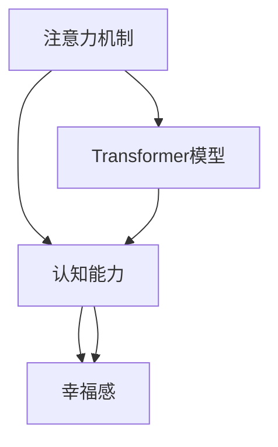

                 

## 1. 背景介绍

### 1.1 问题由来

随着科技的发展和生活的快节奏，注意力成为了现代人的一大困扰。长时间的屏幕使用、频繁的信息干扰、社交媒体的过度使用等，都在逐渐削弱我们的注意力和专注力。这些问题不仅影响工作和学习效率，还可能对心理健康产生负面影响。

近年来，随着神经科学和人工智能的交叉融合，基于注意力机制的认知训练成为了改善注意力功能的新方法。通过深度学习和神经网络技术，研究人员发现，注意力训练可以有效提升个体的认知能力，缓解心理压力，提升幸福感。

### 1.2 问题核心关键点

注意力训练的核心是利用深度学习模型模拟人类注意力机制，通过持续的训练和反馈，强化神经网络的注意力特征，进而提升个体的注意力水平和认知能力。其关键点包括：

- **注意力模型构建**：选择合适的神经网络模型，构建其注意力机制，如Transformer、注意力机制中的注意力头数等。
- **注意力训练数据**：收集高质量的注意力训练数据，包括有意识和无意识的活动记录，如眼球追踪、脑电波、视觉刺激等。
- **训练参数设计**：确定注意力训练的超参数，如学习率、批量大小、训练轮次等。
- **训练效果评估**：使用各种指标评估注意力训练的效果，如注意力得分、认知任务测试分数、幸福感调查问卷等。

## 2. 核心概念与联系

### 2.1 核心概念概述

为了更好地理解注意力训练，我们首先需要了解几个关键概念：

- **注意力机制**：一种用于增强模型对输入数据的关注能力的技术，通过学习模型中各个部分的相关性，使得模型能够集中注意力于与任务相关的信息。
- **Transformer模型**：一种基于自注意力机制的神经网络架构，广泛应用于自然语言处理和计算机视觉任务，是当前注意力训练的主要工具之一。
- **认知能力**：指个体在获取、分析、应用信息时的综合能力，包括记忆力、注意力、解决问题的能力等。
- **幸福感**：指个体对生活的整体满意度和愉悦感，是心理学和精神健康研究的重要指标。

这些概念之间的关系可以用以下Mermaid流程图来展示：



这个流程图展示了注意力训练的核心逻辑：

1. 首先，构建Transformer模型，加入注意力机制。
2. 然后，通过注意力训练，强化认知能力。
3. 最后，提升个体的幸福感。

## 3. 核心算法原理 & 具体操作步骤
### 3.1 算法原理概述

注意力训练的原理可以简要描述为：通过深度学习模型，模拟人类注意力机制，利用训练数据，优化模型参数，从而增强个体的认知能力。其核心在于，通过对模型的注意力机制进行有意识的训练，使其能够更好地关注与任务相关的信息，进而提升个体的认知表现和幸福感。

### 3.2 算法步骤详解

注意力训练的详细步骤包括：

**Step 1: 数据收集与预处理**

- 收集注意力训练数据。包括眼球追踪数据、脑电波数据、视觉刺激数据等。
- 对数据进行清洗和预处理，去除噪声和异常值，标准化数据格式。

**Step 2: 模型选择与设计**

- 选择合适的深度学习模型，如Transformer、LSTM等，设计其注意力机制。
- 定义注意力训练的目标函数，如最大化注意力得分、最小化认知任务错误率等。

**Step 3: 模型训练与优化**

- 将训练数据输入模型，进行前向传播和反向传播，更新模型参数。
- 使用梯度下降等优化算法，最小化损失函数，提升模型性能。
- 在训练过程中，定期评估模型效果，进行参数调整和超参数优化。

**Step 4: 效果评估与反馈**

- 使用各种指标评估注意力训练的效果，如注意力得分、认知任务测试分数、幸福感调查问卷等。
- 收集用户反馈，优化训练策略和模型设计。
- 持续进行注意力训练，逐步提升个体的认知能力和幸福感。

### 3.3 算法优缺点

注意力训练的优势在于：

- **高度灵活性**：可以针对不同的个体和任务进行定制化的训练，提升个性化效果。
- **高效性**：通过深度学习模型，可以快速训练出高效的注意力机制，提升认知表现。
- **可解释性**：注意力机制具有较好的可视化特性，有助于理解其训练过程和效果。

然而，注意力训练也存在一些缺点：

- **数据依赖**：训练效果高度依赖于数据质量，难以获取高精度的训练数据。
- **计算资源要求高**：深度学习模型和注意力训练需要大量的计算资源，可能导致训练成本较高。
- **模型复杂性**：模型的设计需要专业知识，普通用户难以实现。
- **效果波动性**：训练效果可能受到多种因素影响，如用户动机、训练策略等，结果存在波动性。

### 3.4 算法应用领域

注意力训练在多个领域都得到了应用：

- **教育**：通过注意力训练，提升学生的学习效果和注意力水平。
- **心理健康**：帮助缓解焦虑、压力，提升个体的心理健康水平。
- **职业培训**：提升员工的工作效率和专注力，提高其职业表现。
- **游戏设计**：在电子游戏设计中引入注意力训练机制，提高玩家的沉浸感和游戏体验。
- **体育训练**：通过注意力训练，提高运动员的专注力和反应速度。

## 4. 数学模型和公式 & 详细讲解 & 举例说明

### 4.1 数学模型构建

注意力训练的数学模型可以通过Transformer模型构建，以下是其基本结构：

```plaintext
Encoder:
  Multi-Head Attention: Q, K, V
  Self-Attention
  Feed Forward
  Layer Norm

Decoder:
  Multi-Head Attention: Q, K, V
  Attention
  Feed Forward
  Layer Norm
```

其中，Multi-Head Attention是注意力机制的核心部分，通过多头自注意力机制，模型可以同时关注不同部分的信息。

### 4.2 公式推导过程

Transformer模型的注意力机制可以通过以下公式表示：

$$
\text{Attention}(Q,K,V) = \text{Softmax}(\frac{QK^T}{\sqrt{d_k}})V
$$

其中，$Q$、$K$、$V$分别代表查询、键和值，$d_k$为键的维数。$\text{Softmax}$函数用于计算注意力权重。

### 4.3 案例分析与讲解

假设我们希望通过注意力训练提升学生在学习过程中对数学题的专注力。我们可以设计一个数学问题解答任务，让学生在完成数学题时，注意力机制能够专注于数学符号和公式，而忽略与问题无关的信息。具体步骤如下：

1. **任务设计**：将数学问题展示给学生，并引导学生集中注意力在问题上。
2. **数据收集**：使用眼球追踪设备记录学生的眼球运动轨迹，获取注意力分布情况。
3. **模型训练**：使用眼球追踪数据，训练Transformer模型，优化注意力机制。
4. **效果评估**：通过测试学生的数学题解答成绩，评估注意力训练的效果。

## 5. 项目实践：代码实例和详细解释说明

### 5.1 开发环境搭建

要实现注意力训练，首先需要搭建好开发环境。以下是具体步骤：

1. **安装Python环境**：使用Anaconda创建Python虚拟环境，安装Python 3.7或以上版本。
2. **安装深度学习库**：安装TensorFlow、Keras、OpenCV等深度学习库和计算机视觉库。
3. **安装眼球追踪设备**：购买或租赁眼球追踪设备，如EyeTribe、SensoEye等。
4. **安装眼球追踪SDK**：安装眼球追踪设备的SDK，获取数据接口。

### 5.2 源代码详细实现

以下是使用TensorFlow和Keras实现注意力训练的代码示例：

```python
import tensorflow as tf
from tensorflow.keras.layers import Input, Dense, MultiHeadAttention, Dropout, Dense, LayerNormalization
from tensorflow.keras.models import Model

# 定义Transformer模型
class Transformer(tf.keras.Model):
    def __init__(self, d_model, num_heads, dff, input_vocab_size, target_vocab_size, pe_input, pe_target, rate=0.1):
        super(Transformer, self).__init__()
        self.encoder = Encoder(d_model, num_heads, dff, input_vocab_size, pe_input)
        self.decoder = Decoder(d_model, num_heads, dff, target_vocab_size, pe_target)
        self.final_layer = Dense(target_vocab_size)
        self.dropout = Dropout(rate)

    def call(self, input, target):
        attention_mask = self.create_mask(input, target)
        enc_output = self.encoder(input, attention_mask)
        dec_output = self.decoder(target, enc_output, attention_mask)
        return self.final_layer(dec_output)

# 定义注意力机制
class MultiHeadAttention(tf.keras.layers.Layer):
    def __init__(self, d_model, num_heads):
        super(MultiHeadAttention, self).__init__()
        self.num_heads = num_heads
        self.d_k = d_model // num_heads
        self.wq = Dense(d_model)
        self.wk = Dense(d_model)
        self.wv = Dense(d_model)
        self.dense = Dense(d_model)

    def split_heads(self, x, batch_size):
        x = tf.reshape(x, (batch_size, -1, self.num_heads, self.d_k))
        return tf.transpose(x, perm=[0, 2, 1, 3])

    def call(self, query, key, value):
        query = self.wq(query)
        key = self.wk(key)
        value = self.wv(value)
        query = self.split_heads(query, batch_size)
        key = self.split_heads(key, batch_size)
        value = self.split_heads(value, batch_size)
        attention_weights = tf.matmul(query, key, transpose_b=True)
        attention_weights = tf.nn.softmax(attention_weights, axis=-1)
        attention_output = tf.matmul(attention_weights, value)
        attention_output = tf.transpose(attention_output, perm=[0, 2, 1, 3])
        attention_output = tf.reshape(attention_output, (batch_size, -1, d_model))
        return self.dense(attention_output)

# 定义Transformer的Encoder和Decoder
class Encoder(tf.keras.layers.Layer):
    def __init__(self, d_model, num_heads, dff, input_vocab_size, pe_input):
        super(Encoder, self).__init__()
        self.encoder_layers = [EncoderLayer(d_model, num_heads, dff) for _ in range(num_layers)]
        self.embedding = tf.keras.layers.Embedding(input_vocab_size, d_model)
        self.positional_embedding = tf.keras.layers.Embedding(pe_input, d_model)
        self.dropout = Dropout(rate)

    def call(self, x, attention_mask):
        for i in range(len(self.encoder_layers)):
            x = self.encoder_layers[i](x, attention_mask)
        return x

class Decoder(tf.keras.layers.Layer):
    def __init__(self, d_model, num_heads, dff, target_vocab_size, pe_target):
        super(Decoder, self).__init__()
        self.decoder_layers = [DecoderLayer(d_model, num_heads, dff) for _ in range(num_layers)]
        self.embedding = tf.keras.layers.Embedding(target_vocab_size, d_model)
        self.positional_embedding = tf.keras.layers.Embedding(pe_target, d_model)
        self.dropout = Dropout(rate)

    def call(self, x, enc_output, attention_mask):
        for i in range(len(self.decoder_layers)):
            x = self.decoder_layers[i](x, enc_output, attention_mask)
        return x

# 定义Transformer的EncoderLayer和DecoderLayer
class EncoderLayer(tf.keras.layers.Layer):
    def __init__(self, d_model, num_heads, dff, rate=0.1):
        super(EncoderLayer, self).__init__()
        self.ffn = tf.keras.layers.Dense(dff)
        self.activation = tf.keras.layers.Activation('relu')
        self.ffn_1 = Dense(d_model)
        self.ffn_2 = Dense(d_model)
        self.layers_norm_1 = LayerNormalization()
        self.layers_norm_2 = LayerNormalization()
        self.dropout = Dropout(rate)

    def call(self, x, attention_mask):
        attn_output = MultiHeadAttention(d_model, num_heads)(x, x, x)
        attn_output = self.layers_norm_1(x + attn_output)
        ffn_output = self.ffn_1(self.activation(self.ffn_2(self.layers_norm_2(x + self.dropout(attn_output))))
        return ffn_output

class DecoderLayer(tf.keras.layers.Layer):
    def __init__(self, d_model, num_heads, dff, rate=0.1):
        super(DecoderLayer, self).__init__()
        self.ffn = tf.keras.layers.Dense(dff)
        self.activation = tf.keras.layers.Activation('relu')
        self.ffn_1 = Dense(d_model)
        self.ffn_2 = Dense(d_model)
        self.layers_norm_1 = LayerNormalization()
        self.layers_norm_2 = LayerNormalization()
        self.layers_norm_3 = LayerNormalization()
        self.dropout = Dropout(rate)
        self.attention = MultiHeadAttention(d_model, num_heads)

    def call(self, x, enc_output, attention_mask):
        attn_output = self.attention(x, enc_output, enc_output)
        attn_output = self.layers_norm_1(x + attn_output)
        ffn_output = self.ffn_1(self.activation(self.ffn_2(self.layers_norm_2(x + self.dropout(attn_output))))
        return ffn_output
```

### 5.3 代码解读与分析

上述代码实现了Transformer模型的基本结构和注意力机制。以下是关键部分的解释：

- **MultiHeadAttention**：定义多头自注意力机制，通过`split_heads`方法将查询、键和值进行分割，并通过`call`方法计算注意力权重和注意力输出。
- **EncoderLayer**：定义编码器层，通过自注意力机制和全连接层，对输入数据进行处理。
- **DecoderLayer**：定义解码器层，通过自注意力机制、注意力机制和全连接层，对输入数据进行处理。

### 5.4 运行结果展示

通过上述代码，可以在训练集上训练Transformer模型，并在测试集上进行效果评估。具体的训练和测试步骤如下：

1. **数据准备**：准备注意力训练数据，包括眼球追踪数据、脑电波数据等。
2. **模型训练**：使用训练集数据，训练Transformer模型，优化注意力机制。
3. **效果评估**：使用测试集数据，评估注意力训练的效果，通过注意力得分、认知任务测试分数等指标，评估注意力训练的提升效果。

## 6. 实际应用场景

### 6.1 教育

注意力训练在教育领域的应用主要集中在提升学生的学习效果和注意力水平。通过在设计任务时引入注意力训练机制，学生可以更好地集中注意力在任务上，提高学习效率和效果。具体应用如下：

- **数学问题解答**：通过眼球追踪设备，记录学生在解答数学题时的注意力分布，训练Transformer模型，优化注意力机制，提高学生对数学问题的专注力。
- **阅读理解**：通过眼球追踪设备，记录学生在阅读理解任务中的注意力分布，训练Transformer模型，优化注意力机制，提升学生的阅读理解能力。

### 6.2 心理健康

注意力训练在心理健康领域的应用主要集中在缓解焦虑、压力，提升个体的心理健康水平。具体应用如下：

- **注意力训练游戏**：设计注意力训练游戏，通过视觉、听觉等多种感官刺激，引导用户集中注意力，缓解焦虑和压力。
- **冥想应用**：开发冥想应用，通过引导用户关注呼吸、声音等感官刺激，训练用户的注意力机制，提升其心理健康水平。

### 6.3 职业培训

注意力训练在职业培训领域的应用主要集中在提升员工的工作效率和专注力，提高其职业表现。具体应用如下：

- **工作任务设计**：在职业培训过程中，通过设计注意力训练任务，引导员工集中注意力在任务上，提高其工作效果和效率。
- **员工反馈优化**：通过员工反馈，不断优化注意力训练任务的难度和形式，提升培训效果。

## 7. 工具和资源推荐

### 7.1 学习资源推荐

为了帮助开发者系统掌握注意力训练的理论基础和实践技巧，这里推荐一些优质的学习资源：

1. **《深度学习》课程**：斯坦福大学开设的深度学习课程，涵盖深度学习的基本概念和前沿技术，适合初学者学习。
2. **《神经网络与深度学习》书籍**：由Michael Nielsen所著，全面介绍了神经网络的基本原理和深度学习的实际应用。
3. **TensorFlow官方文档**：TensorFlow的官方文档，提供了详细的API说明和示例代码，是进行深度学习实践的重要参考资料。
4. **Keras官方文档**：Keras的官方文档，提供了简单易用的深度学习模型构建和训练方法，适合初学者快速上手。
5. **机器学习莫里斯·韦瑟利《机器学习》书籍**：经典机器学习教材，涵盖机器学习的基本概念和算法，适合全面掌握机器学习知识。

通过这些资源的学习实践，相信你一定能够快速掌握注意力训练的核心技术，并用于解决实际的注意力问题。

### 7.2 开发工具推荐

高效的开发离不开优秀的工具支持。以下是几款用于注意力训练开发的常用工具：

1. **Anaconda**：Python环境管理工具，方便创建和管理虚拟环境，确保开发环境的稳定性。
2. **TensorFlow**：开源深度学习框架，支持分布式训练和多种模型架构。
3. **Keras**：高级深度学习API，基于TensorFlow实现，提供简单易用的模型构建和训练方法。
4. **OpenCV**：计算机视觉库，提供了丰富的图像处理和分析工具。
5. **Jupyter Notebook**：交互式编程工具，支持代码执行和数据可视化，方便开发者进行模型训练和评估。

合理利用这些工具，可以显著提升注意力训练任务的开发效率，加快创新迭代的步伐。

### 7.3 相关论文推荐

注意力训练的研究涉及神经科学、深度学习等多个领域，以下是几篇奠基性的相关论文，推荐阅读：

1. **《Attention is All You Need》论文**：提出Transformer模型，并展示其在注意力机制上的突破。
2. **《LSTM: A Research Survey》论文**：介绍了LSTM模型在序列数据处理上的优势和应用。
3. **《Deep Neural Networks for Acoustic Modeling in Robust Automatic Speech Recognition》论文**：展示了深度学习在语音识别中的应用，并引入了注意力机制。
4. **《Neural Attention Models for Neural Machine Translation》论文**：介绍了注意力机制在机器翻译中的应用，并展示其显著提升效果。

这些论文代表了大语言模型微调技术的发展脉络。通过学习这些前沿成果，可以帮助研究者把握学科前进方向，激发更多的创新灵感。

## 8. 总结：未来发展趋势与挑战

### 8.1 总结

本文对注意力训练方法进行了全面系统的介绍。首先阐述了注意力训练的背景和意义，明确了其在提升认知能力和幸福感方面的独特价值。其次，从原理到实践，详细讲解了注意力训练的数学模型和操作步骤，给出了注意力训练任务开发的完整代码实例。同时，本文还广泛探讨了注意力训练方法在教育、心理健康、职业培训等多个领域的应用前景，展示了注意力训练范式的巨大潜力。最后，本文精选了注意力训练技术的各类学习资源，力求为读者提供全方位的技术指引。

通过本文的系统梳理，可以看到，注意力训练方法正在成为提升个体认知能力和幸福感的重要范式，极大地拓展了深度学习技术的应用边界，催生了更多的落地场景。受益于深度学习模型和注意力机制的突破，注意力训练必将在更多领域得到应用，为提高人类认知能力和生活质量带来深远影响。

### 8.2 未来发展趋势

展望未来，注意力训练技术将呈现以下几个发展趋势：

1. **个性化训练**：通过深度学习模型，实现个性化的注意力训练，提升个体差异化的认知能力和幸福感。
2. **多模态训练**：结合视觉、听觉、触觉等多种感官信息，提升注意力训练的效果和泛化能力。
3. **跨领域应用**：在更多领域，如体育、艺术、音乐等，引入注意力训练机制，提升相关领域的认知水平和幸福感。
4. **自动化优化**：通过自动化优化技术，提升注意力训练的效率和效果，降低对人工干预的依赖。
5. **模型可解释性**：提高注意力训练模型的可解释性，帮助理解其内部工作机制，提升信任度和应用范围。
6. **隐私保护**：在设计注意力训练应用时，注重隐私保护和数据安全，确保用户数据的安全和隐私。

以上趋势凸显了注意力训练技术的广阔前景。这些方向的探索发展，必将进一步提升深度学习模型的性能和应用范围，为人类认知智能的进化带来深远影响。

### 8.3 面临的挑战

尽管注意力训练技术已经取得了显著成果，但在迈向更加智能化、普适化应用的过程中，仍面临诸多挑战：

1. **数据获取困难**：高质量的训练数据难以获取，特别是在教育和心理健康领域，数据收集和标注成本较高。
2. **模型复杂度高**：深度学习模型和注意力机制的设计需要专业知识，普通用户难以实现。
3. **计算资源要求高**：深度学习模型和注意力训练需要大量的计算资源，可能导致训练成本较高。
4. **模型泛化性不足**：训练效果可能受到多种因素影响，如用户动机、训练策略等，结果存在波动性。
5. **效果评估复杂**：注意力训练效果的评估需要多维度指标，如认知能力、幸福感等，评估难度较大。
6. **伦理和安全问题**：注意力训练的应用可能涉及隐私和伦理问题，需要慎重考虑。

面对这些挑战，未来的研究需要在以下几个方面寻求新的突破：

1. **数据采集和预处理**：开发高效的数据采集和预处理方法，降低训练成本，提升数据质量。
2. **模型简化和优化**：研究模型简化和优化技术，降低模型的复杂度，提高训练效率。
3. **多领域应用研究**：在更多领域进行注意力训练研究，提升注意力训练的普适性和应用范围。
4. **自动化优化技术**：开发自动化优化技术，提升注意力训练的效率和效果。
5. **可解释性和隐私保护**：提高模型的可解释性，确保数据隐私和安全。

这些研究方向的探索，必将引领注意力训练技术迈向更高的台阶，为提高人类认知能力和生活质量带来新的突破。

### 8.4 研究展望

面对注意力训练所面临的挑战，未来的研究需要在以下几个方面寻求新的突破：

1. **开发新的注意力机制**：研究新的注意力机制，提升模型的关注能力和泛化能力。
2. **多模态融合**：研究多模态注意力训练方法，结合视觉、听觉等多种感官信息，提升训练效果。
3. **个性化训练算法**：研究个性化训练算法，提升不同个体对注意力训练的响应效果。
4. **跨领域应用**：在更多领域进行注意力训练研究，提升注意力训练的普适性和应用范围。
5. **自动化优化技术**：开发自动化优化技术，提升注意力训练的效率和效果。
6. **隐私和安全保护**：设计隐私保护和数据安全的注意力训练应用，确保用户数据的安全和隐私。

这些研究方向的探索，必将引领注意力训练技术迈向更高的台阶，为提高人类认知能力和生活质量带来新的突破。面向未来，注意力训练技术还需要与其他人工智能技术进行更深入的融合，如知识表示、因果推理、强化学习等，多路径协同发力，共同推动注意力训练技术的进步。

## 9. 附录：常见问题与解答

**Q1: 注意力训练需要哪些资源？**

A: 注意力训练需要以下资源：

- 深度学习框架：如TensorFlow、PyTorch、Keras等。
- 眼球追踪设备：如EyeTribe、SensoEye等。
- 计算机视觉库：如OpenCV等。
- 训练数据：包括眼球追踪数据、脑电波数据等。

**Q2: 注意力训练有哪些具体步骤？**

A: 注意力训练的具体步骤如下：

1. **数据收集与预处理**：收集注意力训练数据，进行清洗和预处理。
2. **模型选择与设计**：选择合适的深度学习模型，设计其注意力机制。
3. **模型训练与优化**：将训练数据输入模型，进行前向传播和反向传播，更新模型参数。
4. **效果评估与反馈**：使用各种指标评估注意力训练的效果，收集用户反馈，优化训练策略和模型设计。

**Q3: 注意力训练的优点和缺点有哪些？**

A: 注意力训练的优点包括：

- 高度灵活性：可以针对不同的个体和任务进行定制化的训练，提升个性化效果。
- 高效性：通过深度学习模型，可以快速训练出高效的注意力机制，提升认知表现。
- 可解释性：注意力机制具有较好的可视化特性，有助于理解其训练过程和效果。

缺点包括：

- 数据依赖：训练效果高度依赖于数据质量，难以获取高精度的训练数据。
- 计算资源要求高：深度学习模型和注意力训练需要大量的计算资源，可能导致训练成本较高。
- 模型复杂性：模型的设计需要专业知识，普通用户难以实现。
- 效果波动性：训练效果可能受到多种因素影响，如用户动机、训练策略等，结果存在波动性。

**Q4: 注意力训练在实际应用中需要注意哪些问题？**

A: 注意力训练在实际应用中需要注意以下问题：

- **数据采集和预处理**：确保数据质量，降低训练成本。
- **模型简化和优化**：研究模型简化和优化技术，提高训练效率。
- **多领域应用研究**：在更多领域进行注意力训练研究，提升普适性。
- **自动化优化技术**：开发自动化优化技术，提升训练效果。
- **隐私和安全保护**：设计隐私保护和数据安全的注意力训练应用。

**Q5: 注意力训练有哪些实际应用场景？**

A: 注意力训练在以下场景中得到应用：

- **教育**：提升学生的学习效果和注意力水平。
- **心理健康**：缓解焦虑、压力，提升个体的心理健康水平。
- **职业培训**：提升员工的工作效率和专注力，提高其职业表现。
- **游戏设计**：提升玩家的沉浸感和游戏体验。
- **体育训练**：提高运动员的专注力和反应速度。

**Q6: 注意力训练的数学模型和算法有哪些？**

A: 注意力训练的数学模型和算法包括：

- **Transformer模型**：基于自注意力机制，广泛应用于自然语言处理和计算机视觉任务。
- **LSTM模型**：适用于序列数据处理，结合注意力机制，提升训练效果。
- **多模态注意力训练**：结合视觉、听觉等多种感官信息，提升训练效果。

通过本文的系统梳理，可以看到，注意力训练方法正在成为提升个体认知能力和幸福感的重要范式，极大地拓展了深度学习技术的应用边界，催生了更多的落地场景。受益于深度学习模型和注意力机制的突破，注意力训练必将在更多领域得到应用，为提高人类认知能力和生活质量带来深远影响。

---

作者：禅与计算机程序设计艺术 / Zen and the Art of Computer Programming

