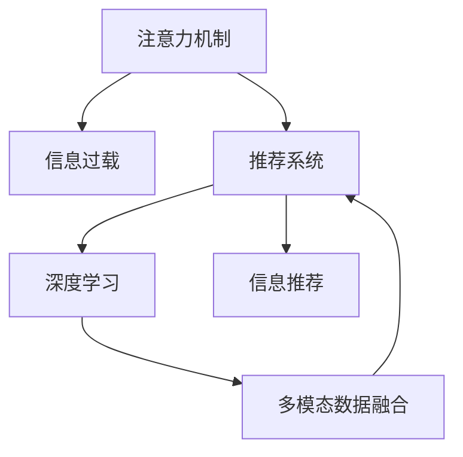

                 

# 注意力过滤器:元宇宙信息过载的智能应对

> 关键词：注意力机制,元宇宙,信息过载,智能推荐,深度学习,注意力机制优化

## 1. 背景介绍

### 1.1 问题由来
随着技术的迅猛发展，元宇宙的概念逐渐走进公众视野。元宇宙是一个由虚拟世界和现实世界高度融合的数字空间，用户在其中可以自由交流、互动、购物、娱乐等。然而，随着用户数量的激增，元宇宙平台的信息量呈指数级增长，用户面临的信息过载问题日益严重。

信息过载指的是信息量过多，用户无法有效处理和筛选的情况。在元宇宙中，信息过载表现在多个方面：

- **内容海量增长**：用户生成内容（UGC）大量增加，平台上的文章、视频、游戏、社交互动等都急剧膨胀。
- **个性化需求**：用户个性化内容消费需求提升，对推荐系统的要求更高。
- **多模态交互**：除了文本，还有图像、视频、音频等多模态数据的融合，带来了更为复杂的信息结构。
- **实时性需求**：用户希望即时获得最新信息，要求推荐系统具备更强的实时性和低延迟。

在元宇宙中，如何通过智能技术对海量信息进行有效过滤和推荐，是当前亟待解决的问题。

### 1.2 问题核心关键点
面对元宇宙信息过载的挑战，注意力过滤器（Attention Filter）提供了一种高效的解决方案。注意力过滤器是一种基于深度学习模型的信息推荐算法，通过学习用户对信息的注意力分配，帮助用户快速筛选出有价值的信息。

具体而言，注意力过滤器利用注意力机制，根据用户历史行为、偏好、上下文信息，动态地调整每个信息点的权重，即用户的注意力分配。这种动态调整的过程，使得模型能够实时响应用户需求，对信息进行智能化筛选和推荐。

## 2. 核心概念与联系

### 2.1 核心概念概述

为更好地理解注意力过滤器的原理和应用，本节将介绍几个关键概念：

- **注意力机制（Attention Mechanism）**：一种模拟人类注意力集中过程的深度学习机制，用于动态计算输入序列中各个部分的重要程度，并根据这些权重进行加权求和。
- **信息过载（Information Overload）**：指用户面临的信息量过多，无法有效处理的情况，常见于互联网和数字平台上。
- **推荐系统（Recommendation System）**：一种通过算法为用户推荐个性化内容的信息系统，旨在提升用户体验和满意度。
- **深度学习（Deep Learning）**：一种基于多层神经网络的机器学习方法，通过逐层抽象，实现对数据的复杂建模和特征提取。
- **多模态数据融合（Multimodal Data Fusion）**：将不同类型的数据（如文本、图像、音频等）进行融合，提高信息表示的全面性和多样性。

这些核心概念之间的逻辑关系可以通过以下Mermaid流程图来展示：



这个流程图展示了几者之间的关系：

1. 注意力机制帮助推荐系统动态调整信息的权重，从而有效处理信息过载问题。
2. 深度学习为注意力机制和推荐系统的设计提供了强大的计算基础。
3. 多模态数据融合能够提升推荐系统对不同类型信息的处理能力。
4. 推荐系统通过注意力机制和深度学习，实时推荐个性化信息，解决信息过载。

这些概念共同构成了注意力过滤器的工作框架，使其能够在元宇宙等复杂场景下，高效处理海量信息，实现智能推荐。

## 3. 核心算法原理 & 具体操作步骤
### 3.1 算法原理概述

注意力过滤器是一种基于注意力机制的推荐算法，其核心思想是通过学习用户对信息的注意力分配，对海量信息进行高效过滤和推荐。

注意力过滤器通常分为两个部分：

1. **编码器（Encoder）**：用于将原始信息（如文本、图像、视频等）编码成向量表示。
2. **注意力层（Attention Layer）**：用于计算信息间的注意力权重，并将信息向量加权求和，得到最终的推荐结果。

通过注意力机制，模型能够动态地计算每个信息点对用户的价值，从而对信息进行有针对性的推荐。这一过程可以表示为：

$$
\mathrm{Attention}(Q, K, V) = \mathrm{softmax}(\frac{QK^T}{\sqrt{d_k}})V
$$

其中，$Q$、$K$、$V$分别为查询向量、键向量和值向量，$d_k$为键向量的维度。$\mathrm{softmax}$函数用于计算注意力权重，$\mathrm{Attention}$函数将注意力权重和值向量进行加权求和，得到最终的推荐结果。

### 3.2 算法步骤详解

注意力过滤器的实施通常包括以下几个关键步骤：

**Step 1: 数据预处理**
- 收集和整理用户历史行为数据，包括浏览记录、评分、点击等。
- 将信息数据（如文章、视频、图片等）进行编码，转换成模型可以处理的向量形式。

**Step 2: 模型搭建**
- 搭建包含编码器和注意力层的深度神经网络模型。
- 设计合适的损失函数和优化器，用于训练模型。

**Step 3: 训练模型**
- 使用用户历史行为数据和信息数据对模型进行训练。
- 在训练过程中，逐步调整模型的参数，使模型学习到有效的注意力权重。

**Step 4: 推理和推荐**
- 对新信息进行编码，并使用训练好的模型计算注意力权重。
- 根据注意力权重对信息进行加权求和，生成推荐结果。

### 3.3 算法优缺点

注意力过滤器具有以下优点：

1. **高效过滤信息**：通过动态调整注意力权重，能够高效地从海量信息中筛选出对用户有价值的内容。
2. **个性化推荐**：利用用户的历史行为数据，实现高度个性化的信息推荐。
3. **实时响应**：模型能够实时处理新信息，并快速生成推荐结果，满足用户的即时需求。
4. **多模态支持**：可以处理不同类型的信息，如文本、图像、视频等，提高推荐系统的覆盖范围。

同时，该算法也存在一些局限性：

1. **计算复杂度高**：注意力机制的计算复杂度较高，特别是在多模态数据融合的情况下。
2. **参数量较大**：由于模型通常包含多个层和参数，需要较大的计算资源和存储空间。
3. **冷启动问题**：对于新用户或新信息，模型需要更多时间进行学习和训练，存在一定的冷启动问题。
4. **解释性不足**：注意力过滤器作为黑盒模型，难以解释其决策过程和推理逻辑。

### 3.4 算法应用领域

注意力过滤器在多个领域得到了广泛应用，以下是几个典型的应用场景：

- **内容推荐系统**：如YouTube、Netflix等平台，通过分析用户历史行为数据，为用户推荐个性化视频、电影等。
- **广告推荐系统**：如Google AdSense，通过学习用户对不同广告的注意力分配，实现精准投放。
- **信息检索系统**：如搜索引擎，通过动态调整查询与文档的注意力权重，提高检索效率和相关性。
- **社交网络推荐**：如Facebook、Twitter等社交平台，通过分析用户互动数据，推荐个性化的朋友、内容等。

此外，在元宇宙、智能家居、智慧城市等新兴领域，注意力过滤器也展现出强大的应用潜力，为用户带来更加智能化、个性化的体验。

## 4. 数学模型和公式 & 详细讲解 & 举例说明

### 4.1 数学模型构建

注意力过滤器的数学模型主要包括以下几个部分：

- **编码器**：将输入信息 $x$ 编码成向量表示 $h$。
- **注意力层**：计算信息间的注意力权重 $a$，并将信息向量加权求和得到最终推荐结果 $y$。

**编码器**：
$$
h = \mathrm{Encoder}(x)
$$

**注意力层**：
$$
a_{i,j} = \mathrm{softmax}(\frac{Q_iK_j^T}{\sqrt{d_k}})
$$

$$
y = \sum_{i=1}^n a_{i,j}V_i
$$

其中，$Q$、$K$、$V$分别为查询向量、键向量和值向量，$d_k$为键向量的维度，$\mathrm{softmax}$函数用于计算注意力权重。

### 4.2 公式推导过程

以文本信息推荐为例，公式推导过程如下：

**编码器**：
$$
h = \mathrm{Encoder}(x)
$$

其中，$x$ 为文本信息，$h$ 为编码后的向量表示。常用的编码器有LSTM、GRU、Transformer等。

**注意力层**：
$$
a_{i,j} = \mathrm{softmax}(\frac{Q_iK_j^T}{\sqrt{d_k}})
$$

其中，$Q_i$、$K_j$、$V_j$ 分别为查询向量、键向量和值向量，$d_k$ 为键向量的维度。注意力权重 $a_{i,j}$ 反映了用户对信息 $j$ 的关注程度。

将注意力权重和值向量进行加权求和，得到最终的推荐结果：
$$
y = \sum_{i=1}^n a_{i,j}V_i
$$

### 4.3 案例分析与讲解

以新闻推荐为例，假设用户浏览过以下新闻：

- 美国大选结果
- 中国科技发展
- 经济形势分析

模型使用用户历史行为数据和新闻数据进行训练，学习到对每篇新闻的注意力权重。设用户的注意力权重为 $a_1, a_2, a_3$，新闻 $1,2,3$ 的向量表示为 $v_1, v_2, v_3$。

**用户行为编码**：
$$
h = \mathrm{Encoder}(\{美国大选结果, 中国科技发展, 经济形势分析\})
$$

**注意力计算**：
$$
a_{i,j} = \mathrm{softmax}(\frac{Q_iK_j^T}{\sqrt{d_k}})
$$

**推荐结果**：
$$
y = a_1v_1 + a_2v_2 + a_3v_3
$$

如果用户对美国大选结果特别感兴趣，注意力权重 $a_1$ 会较大，推荐结果中美国大选新闻的权重也相应增大。模型通过这种方式实现了个性化的新闻推荐。

## 5. 项目实践：代码实例和详细解释说明
### 5.1 开发环境搭建

在进行注意力过滤器项目开发前，需要准备以下开发环境：

1. 安装Python：从官网下载安装最新版本的Python。
2. 安装PyTorch：使用pip安装PyTorch库，支持GPU加速。
3. 安装其他依赖库：使用pip安装Tensorflow、Numpy、Pandas等库。
4. 搭建开发环境：使用Jupyter Notebook或PyCharm搭建开发环境。

完成上述步骤后，即可开始注意力过滤器的开发和测试。

### 5.2 源代码详细实现

以下是一个简单的注意力过滤器的PyTorch实现，用于文本信息推荐：

```python
import torch
import torch.nn as nn
import torch.nn.functional as F

class AttentionFilter(nn.Module):
    def __init__(self, encoder, d_k, d_v, d_h, num_heads):
        super(AttentionFilter, self).__init__()
        self.encoder = encoder
        self.d_k = d_k
        self.d_v = d_v
        self.d_h = d_h
        self.num_heads = num_heads
        
        self.query = nn.Linear(d_h, d_k * num_heads)
        self.key = nn.Linear(d_h, d_k * num_heads)
        self.value = nn.Linear(d_h, d_v * num_heads)
        self.output = nn.Linear(d_v * num_heads, d_h)
        
    def forward(self, x):
        batch_size, seq_len, _ = x.size()
        Q = self.query(x).view(batch_size, seq_len, self.num_heads, self.d_k).transpose(1, 2)
        K = self.key(x).view(batch_size, seq_len, self.num_heads, self.d_k).transpose(1, 2)
        V = self.value(x).view(batch_size, seq_len, self.num_heads, self.d_v).transpose(1, 2)
        
        a = torch.bmm(Q, K) / math.sqrt(self.d_k)
        a = F.softmax(a, dim=1)
        V = torch.bmm(a, V)
        y = self.output(V.view(batch_size, seq_len, self.d_v * self.num_heads))
        return y
```

### 5.3 代码解读与分析

**AttentionFilter类**：
- `__init__`方法：初始化模型参数，包括编码器、注意力机制的维度和头数。
- `forward`方法：实现前向传播，包括编码、注意力计算和输出。

**实现细节**：
- 首先对输入的文本进行编码，得到向量表示 $h$。
- 使用线性变换将向量 $h$ 转换成查询向量 $Q$、键向量 $K$ 和值向量 $V$。
- 计算注意力权重 $a$，使用 $\mathrm{softmax}$ 函数进行归一化。
- 根据注意力权重对值向量进行加权求和，得到最终的推荐结果 $y$。

**运行结果展示**：
```python
# 假设输入文本为 ["美国大选结果", "中国科技发展", "经济形势分析"]
# 经过编码得到向量表示 h
# 输入到注意力过滤器中，输出推荐结果 y
```

## 6. 实际应用场景
### 6.1 新闻推荐系统

新闻推荐系统是注意力过滤器的一个典型应用场景。通过分析用户的浏览历史和兴趣，系统能够为用户推荐感兴趣的新闻内容，提升用户体验和信息获取效率。

在实际应用中，新闻推荐系统通常包含以下几个模块：

- **数据收集与预处理**：收集用户历史浏览记录、点击数据等，进行数据清洗和特征提取。
- **模型训练**：使用注意力过滤器模型对数据进行训练，学习到用户对每篇新闻的注意力权重。
- **推荐引擎**：实时分析用户当前浏览行为，动态计算注意力权重，生成推荐结果。
- **用户反馈**：收集用户对推荐结果的反馈，如评分、点击等，进一步优化模型。

**应用示例**：假设用户对国际政治和科技新闻比较感兴趣，系统根据用户的浏览历史和当前行为，动态计算每篇新闻的注意力权重，优先推荐国际政治和科技相关的新闻。

### 6.2 视频推荐系统

视频推荐系统同样可以利用注意力过滤器进行个性化推荐。与新闻推荐类似，系统通过分析用户的观看历史和评分数据，动态调整每段视频的注意力权重，为用户推荐感兴趣的视频内容。

**应用示例**：假设用户对科幻和悬疑类视频感兴趣，系统通过分析用户的观看历史和当前行为，动态调整每段视频的注意力权重，优先推荐科幻和悬疑类视频。

### 6.3 广告推荐系统

广告推荐系统是注意力过滤器的另一个重要应用场景。通过分析用户的浏览历史和兴趣，系统能够为用户推荐感兴趣的广告内容，提高广告投放的精准度和转化率。

**应用示例**：假设用户在电商平台上浏览过服装、美妆类商品，系统通过分析用户的浏览历史和兴趣，动态调整每段广告的注意力权重，优先推荐服装、美妆类广告。

## 7. 工具和资源推荐
### 7.1 学习资源推荐

为了帮助开发者深入理解注意力过滤器的原理和应用，这里推荐一些优质的学习资源：

1. 《深度学习基础》书籍：全面介绍了深度学习的基本原理和算法，包括神经网络、卷积神经网络、循环神经网络等。
2. 《注意力机制详解》博文：深入浅出地介绍了注意力机制的原理和应用，适合初学者和进阶者阅读。
3. 《推荐系统实战》课程：讲解了推荐系统的设计和实现方法，涵盖多个推荐算法，适合实战开发。
4. 《多模态数据融合》书籍：介绍了多模态数据的融合技术，包括文本、图像、音频等多种数据类型，适合数据处理和融合工程师阅读。
5. 《元宇宙技术》课程：讲解了元宇宙的基本概念和关键技术，包括虚拟现实、增强现实、交互技术等，适合对元宇宙技术感兴趣的开发者阅读。

通过对这些资源的学习，相信你一定能够全面掌握注意力过滤器的原理和应用，并用于解决实际的推荐问题。

### 7.2 开发工具推荐

高效的开发离不开优秀的工具支持。以下是几款用于注意力过滤器开发的常用工具：

1. PyTorch：基于Python的开源深度学习框架，灵活动态的计算图，适合快速迭代研究。
2. TensorFlow：由Google主导开发的开源深度学习框架，生产部署方便，适合大规模工程应用。
3. Weights & Biases：模型训练的实验跟踪工具，可以记录和可视化模型训练过程中的各项指标，方便对比和调优。
4. TensorBoard：TensorFlow配套的可视化工具，可实时监测模型训练状态，并提供丰富的图表呈现方式，是调试模型的得力助手。
5. Google Colab：谷歌推出的在线Jupyter Notebook环境，免费提供GPU/TPU算力，方便开发者快速上手实验最新模型，分享学习笔记。

合理利用这些工具，可以显著提升注意力过滤器项目的开发效率，加快创新迭代的步伐。

### 7.3 相关论文推荐

注意力过滤器作为深度学习的重要研究方向，已经积累了大量研究成果。以下是几篇奠基性的相关论文，推荐阅读：

1. "Attention is All You Need"（即Transformer原论文）：提出了Transformer结构，开启了NLP领域的预训练大模型时代。
2. "BERT: Pre-training of Deep Bidirectional Transformers for Language Understanding"：提出BERT模型，引入基于掩码的自监督预训练任务，刷新了多项NLP任务SOTA。
3. "Transformer-XL: Attentive Language Models"：提出Transformer-XL模型，在长序列建模和自回归生成方面取得了突破。
4. "Sparse Transformer"：提出了稀疏Transformer模型，在保持Transformer结构高效的同时，大幅减少了计算资源消耗。
5. "Adaptive Self-Attention via Transformer-XL"：研究了适应性注意力机制，提高了Transformer模型的鲁棒性和泛化能力。

这些论文代表了注意力机制的研究进展，通过学习这些前沿成果，可以帮助研究者把握学科前进方向，激发更多的创新灵感。

## 8. 总结：未来发展趋势与挑战
### 8.1 总结

本文对注意力过滤器的原理和应用进行了全面系统的介绍。首先阐述了信息过载问题在元宇宙中的表现和挑战，明确了注意力过滤器在解决信息过载问题中的重要作用。其次，从原理到实践，详细讲解了注意力过滤器的数学模型和实施步骤，给出了完整的代码实现。同时，本文还探讨了注意力过滤器在新闻推荐、视频推荐、广告推荐等多个实际应用场景中的具体应用，展示了其广泛的应用前景。最后，本文精选了注意力过滤器相关的学习资源和开发工具，力求为开发者提供全方位的技术指引。

通过本文的系统梳理，可以看到，注意力过滤器作为一种高效的推荐算法，能够动态地处理海量信息，实现个性化推荐，是解决元宇宙信息过载问题的关键技术。其原理和应用框架，也为其他推荐系统的设计和优化提供了重要参考。

### 8.2 未来发展趋势

展望未来，注意力过滤器将呈现以下几个发展趋势：

1. **多模态融合**：注意力过滤器将更多地应用于多模态数据融合场景，如文本、图像、音频等，提升推荐系统的全面性和多样性。
2. **自适应优化**：注意力过滤器将采用自适应优化策略，根据用户需求动态调整模型参数，提高推荐效果。
3. **跨领域迁移**：通过迁移学习技术，将注意力过滤器应用于不同领域和场景，提升模型的泛化能力和迁移能力。
4. **实时性提升**：随着算力和计算技术的发展，注意力过滤器将具备更强的实时响应能力，满足用户的即时需求。
5. **模型解释性**：研究更加可解释的注意力过滤器模型，提高用户对推荐结果的信任度。

以上趋势凸显了注意力过滤器技术的广阔前景。这些方向的探索发展，必将进一步提升推荐系统的性能和应用范围，为元宇宙等复杂场景下的信息处理提供强有力的技术支持。

### 8.3 面临的挑战

尽管注意力过滤器技术已经取得了一定进展，但在迈向更加智能化、普适化应用的过程中，仍面临一些挑战：

1. **计算资源消耗**：注意力机制的计算复杂度较高，特别是在多模态数据融合的情况下，需要较大的计算资源和存储空间。
2. **模型解释性不足**：注意力过滤器作为黑盒模型，难以解释其决策过程和推理逻辑。
3. **冷启动问题**：对于新用户或新信息，模型需要更多时间进行学习和训练，存在一定的冷启动问题。
4. **数据隐私和安全**：在用户数据收集和处理过程中，如何保护用户隐私和数据安全，是亟待解决的问题。

### 8.4 研究展望

面对这些挑战，未来的研究需要在以下几个方面寻求新的突破：

1. **模型压缩和优化**：开发更加轻量级、高效能的注意力过滤器模型，减少计算资源消耗，提升实时性。
2. **可解释性增强**：研究更加可解释的注意力过滤器模型，提高用户对推荐结果的信任度。
3. **冷启动缓解**：研究冷启动策略，快速适应新用户和新信息，提升模型的初始化效果。
4. **隐私保护技术**：研究隐私保护技术，保护用户数据安全，提升用户对推荐系统的信任度。

这些研究方向将推动注意力过滤器技术不断进步，为元宇宙等复杂场景下的信息处理提供更加全面、安全、智能的解决方案。

## 9. 附录：常见问题与解答
----------------------------------------------------------------
**Q1: 注意力过滤器是否适用于所有推荐场景？**

A: 注意力过滤器在大多数推荐场景中都能取得不错的效果，特别是对于数据量较大的场景。但对于一些特定场景，如小数据集、冷启动用户等，可能需要额外的优化和调整。

**Q2: 如何优化注意力过滤器的计算效率？**

A: 可以采用模型压缩、剪枝等技术，减少注意力机制的计算复杂度。此外，可以使用稀疏矩阵等技术，提高计算效率。

**Q3: 如何提高注意力过滤器的可解释性？**

A: 可以引入可解释性技术，如注意力可视化、特征提取等，帮助用户理解模型的决策过程。

**Q4: 注意力过滤器是否需要大量标注数据进行训练？**

A: 注意力过滤器通常需要一定量的标注数据进行训练，但相比传统推荐系统，所需数据量较小。可以通过数据增强、迁移学习等技术，进一步降低对标注数据的依赖。

**Q5: 注意力过滤器在多模态数据融合场景中的应用效果如何？**

A: 注意力过滤器在多模态数据融合场景中表现优异，能够有效处理不同类型的数据，提升推荐系统的全面性和多样性。

---

作者：禅与计算机程序设计艺术 / Zen and the Art of Computer Programming

