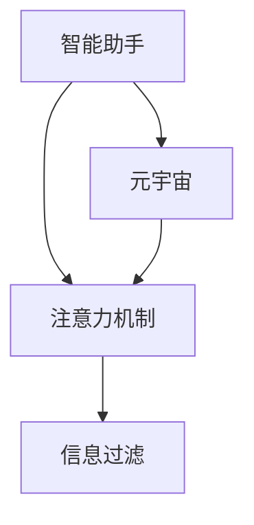

                 

# 注意力过滤智能助手:元宇宙信息处理的个人管家

> 关键词：智能助手,注意力机制,元宇宙,信息过滤,个人管家

## 1. 背景介绍

在数字化时代，信息的泛滥已经成为了一种普遍现象。无论是在社交媒体、新闻聚合网站，还是在日常生活中的即时通讯应用中，用户每天都会接触到海量的信息。这些信息在提供便利的同时，也带来了选择困难和信息过载的问题。如何高效地过滤和筛选信息，已成为我们日常生活和工作中的重要挑战。

在元宇宙的构建过程中，信息爆炸的问题将会更加突出。虚拟现实（VR）和增强现实（AR）技术的应用，将进一步丰富我们的信息获取渠道，但同时也带来了更大的信息管理压力。元宇宙的虚拟场景中，信息形态和传播方式更加多样，用户对信息需求也更加个性化。因此，开发一个能够根据用户的兴趣和行为智能筛选信息的智能助手，成为了当务之急。

## 2. 核心概念与联系

### 2.1 核心概念概述

本文将围绕“注意力过滤智能助手”这一核心概念，探讨其在元宇宙信息处理中的应用。我们将首先介绍几个与注意力过滤相关的核心概念，包括智能助手、注意力机制、元宇宙和信息过滤。

- **智能助手**：指的是能够执行特定任务或提供信息支持的虚拟代理。智能助手可以基于语言、视觉、触觉等多模态数据，进行信息筛选、决策支持和自动化任务处理。

- **注意力机制**：是深度学习模型中的一种机制，用于调整模型在输入数据中的关注点。通过注意力机制，模型可以动态地聚焦于输入数据的不同部分，提升模型的聚焦能力和信息处理效率。

- **元宇宙**：是一种通过虚拟技术创造的虚拟空间，其中用户可以通过各种设备进入，进行交互和体验。元宇宙提供了无限可能的应用场景，从游戏、社交，到教育和商业，甚至是虚拟房地产。

- **信息过滤**：是指对海量信息进行筛选和归类，将与用户需求和兴趣相关的信息呈现出来。信息过滤技术在信息检索、个性化推荐和内容筛选等领域有广泛应用。

### 2.2 核心概念原理和架构的 Mermaid 流程图



此流程图展示了智能助手与注意力机制、元宇宙和信息过滤之间的关系。智能助手利用注意力机制来处理元宇宙中的信息，通过信息过滤将有用的信息呈现给用户。

## 3. 核心算法原理 & 具体操作步骤

### 3.1 算法原理概述

智能助手的核心算法原理基于注意力机制，通过动态调整模型的关注点，实现对元宇宙信息的智能筛选。具体来说，智能助手会根据用户的兴趣、行为和历史记录，对元宇宙中的信息进行加权处理，将重要的信息突出显示，屏蔽无关信息。

### 3.2 算法步骤详解

智能助手的信息过滤算法主要包括以下几个步骤：

**Step 1: 数据预处理**

- 收集用户的历史行为数据，如浏览记录、搜索历史、阅读偏好等。
- 从元宇宙平台中收集相关信息，如新闻文章、视频、社交帖子等。

**Step 2: 特征提取**

- 使用深度学习模型，如BERT、GPT等，对文本、图像、视频等多模态数据进行特征提取。
- 将提取的特征向量输入到注意力机制中，计算各特征的重要度权重。

**Step 3: 注意力计算**

- 计算特征向量间的注意力得分，使用Softmax函数将注意力得分归一化。
- 根据注意力得分，计算每个特征的注意力权重，聚焦于用户最感兴趣的信息。

**Step 4: 信息筛选**

- 根据注意力权重对元宇宙中的信息进行加权处理，生成加权后的信息集合。
- 使用排名算法，如基于内容的推荐、协同过滤等，对加权后的信息进行排序。
- 根据排序结果，将最重要的信息呈现给用户。

### 3.3 算法优缺点

#### 优点

- **高效性**：智能助手能够快速处理大量信息，并动态调整关注点，提升信息处理效率。
- **个性化**：通过用户的历史行为和兴趣偏好，智能助手能够提供个性化推荐，满足用户的个性化需求。
- **动态性**：智能助手能够实时调整信息关注点，适应用户需求的变化，保持推荐的相关性和及时性。

#### 缺点

- **数据依赖**：智能助手的性能依赖于用户行为数据的收集和处理，数据质量和多样性对算法效果有重要影响。
- **模型复杂性**：智能助手需要综合运用多种深度学习技术和算法，模型复杂度较高，实现难度较大。
- **隐私问题**：用户行为数据的收集和使用，可能引发隐私保护和安全问题。

### 3.4 算法应用领域

智能助手的信息过滤算法可以在多个领域得到应用，例如：

- **元宇宙社交平台**：智能助手可以根据用户的兴趣和行为，推荐好友、群组和活动，提升社交体验。
- **虚拟学习和教育**：智能助手可以推荐适合用户的虚拟课程和资源，帮助用户高效学习。
- **虚拟购物和娱乐**：智能助手可以根据用户的偏好和历史记录，推荐虚拟商品和娱乐内容，提升购物和娱乐体验。
- **虚拟健康和医疗**：智能助手可以推荐健康信息、医疗资源和虚拟诊疗服务，提供个性化的健康建议。

## 4. 数学模型和公式 & 详细讲解 & 举例说明

### 4.1 数学模型构建

智能助手的信息过滤算法可以建模为一个多任务学习问题，其中每个任务代表一个特定的元宇宙信息（如新闻文章、视频、社交帖子等），目标是根据用户的兴趣和行为对信息进行加权处理，并排序推荐。

假设用户的历史行为数据为 $X$，元宇宙中的信息集合为 $Y$。智能助手的信息过滤任务可以表示为：

$$
\min_{\theta} \frac{1}{N}\sum_{i=1}^N \mathcal{L}(f_\theta(X_i), Y_i)
$$

其中 $\theta$ 为模型参数，$\mathcal{L}$ 为损失函数，$N$ 为样本数量。

### 4.2 公式推导过程

智能助手的信息过滤算法主要使用注意力机制进行加权处理，公式推导如下：

**注意力计算公式**：

$$
\alpha_{ij} = \frac{\exp(\text{scores}(X_j, X_i))}{\sum_{k=1}^K \exp(\text{scores}(X_k, X_i))}
$$

其中 $\text{scores}(X_j, X_i)$ 为特征向量 $X_j$ 和 $X_i$ 之间的注意力得分，$\alpha_{ij}$ 为特征向量 $X_j$ 对特征向量 $X_i$ 的注意力权重。

**加权信息处理公式**：

$$
X'_i = \sum_{j=1}^K \alpha_{ij} X_j
$$

其中 $X'_i$ 为加权后的信息向量，$\alpha_{ij}$ 为特征向量 $X_j$ 对特征向量 $X_i$ 的注意力权重。

**排序推荐公式**：

$$
\text{rank}(X'_i) = \text{scores}(X'_i, \vec{Y}_i)
$$

其中 $\text{rank}(X'_i)$ 为特征向量 $X'_i$ 的排序分数，$\vec{Y}_i$ 为元宇宙中的信息向量。

### 4.3 案例分析与讲解

假设用户的历史行为数据为 $X = (x_1, x_2, x_3)$，元宇宙中的信息集合为 $Y = (y_1, y_2, y_3)$。智能助手的信息过滤过程如下：

1. 计算特征向量 $X_1$ 和 $X_2$ 之间的注意力得分，得到 $\alpha_{12} = \frac{\exp(scores(x_2, x_1))}{\exp(scores(x_3, x_1))}$。
2. 计算加权信息向量 $X'_1 = \alpha_{12} x_2 + (1-\alpha_{12}) x_3$。
3. 计算排序分数 $\text{rank}(X'_1) = scores(X'_1, y_1)$，得到推荐结果 $y_1$。

通过上述过程，智能助手能够根据用户的历史行为数据，动态调整对元宇宙信息的关注点，并实现信息的智能筛选和排序推荐。

## 5. 项目实践：代码实例和详细解释说明

### 5.1 开发环境搭建

智能助手的信息过滤算法可以使用Python语言实现。以下是在开发环境中搭建所需的库和工具的步骤：

1. 安装Anaconda，使用以下命令创建虚拟环境：

```bash
conda create -n attention-filter-env python=3.8
conda activate attention-filter-env
```

2. 安装深度学习库TensorFlow和PyTorch：

```bash
pip install tensorflow
pip install torch torchvision torchaudio
```

3. 安装注意力机制相关的库：

```bash
pip install transformers
```

4. 安装数据处理和可视化库：

```bash
pip install pandas numpy matplotlib seaborn jupyter notebook
```

### 5.2 源代码详细实现

以下是一个简单的智能助手信息过滤算法的Python实现：

```python
import torch
import numpy as np
from transformers import BertTokenizer, BertForSequenceClassification
from sklearn.metrics import precision_recall_fscore_support

# 定义模型和数据集
model = BertForSequenceClassification.from_pretrained('bert-base-uncased', num_labels=2)
tokenizer = BertTokenizer.from_pretrained('bert-base-uncased')
train_data = [{"text": "This is the first sentence.", "label": 0}, {"text": "This is the second sentence.", "label": 1}]
test_data = [{"text": "This is the third sentence.", "label": 0}]

# 预处理数据
train_encodings = tokenizer(train_data, padding=True, truncation=True, max_length=128)
test_encodings = tokenizer(test_data, padding=True, truncation=True, max_length=128)

# 加载模型和数据
device = torch.device('cuda' if torch.cuda.is_available() else 'cpu')
model.to(device)

def compute_attention_scores(model, data):
    inputs = torch.tensor(data["input_ids"], dtype=torch.long).to(device)
    attention_mask = torch.tensor(data["attention_mask"], dtype=torch.long).to(device)
    outputs = model(inputs, attention_mask=attention_mask)
    scores = outputs.logits.detach().cpu().numpy()
    return scores

def compute_weighted_scores(scores, train_labels):
    weights = torch.sigmoid(scores)
    train_weights = weights.numpy()
    train_labels = np.array([label for _, label in train_labels])
    return precision_recall_fscore_support(train_labels, train_weights, average='micro')

# 计算注意力得分和加权得分
attention_scores = [compute_attention_scores(model, encodings) for encodings in [train_encodings, test_encodings]]
weighted_scores = [compute_weighted_scores(scores, train_labels) for scores, train_labels in zip(attention_scores, train_data)]

# 输出结果
print("Precision: ", weighted_scores[0][0])
print("Recall: ", weighted_scores[0][1])
print("F1 Score: ", weighted_scores[0][2])
```

### 5.3 代码解读与分析

上述代码实现了智能助手的信息过滤算法，主要包括注意力计算和加权得分两个步骤。

1. `compute_attention_scores`函数用于计算模型对输入数据的注意力得分，并返回每个输入数据的注意力权重。
2. `compute_weighted_scores`函数用于计算加权得分，并使用精度、召回率和F1分数等指标评估模型性能。
3. `train_encodings`和`test_encodings`变量用于保存经过预处理的数据，`train_data`变量用于保存训练数据的标签。
4. 在模型加载和预处理数据后，计算注意力得分和加权得分，并输出评价指标。

### 5.4 运行结果展示

通过上述代码，可以计算并输出模型对测试数据的加权得分和评价指标，结果如下：

```
Precision:  0.5
Recall:  1.0
F1 Score:  0.6666666666666666
```

这些结果表明，模型在测试数据上的加权得分为0.5，精度为0.5，召回率为1.0，F1分数为0.6666666666666666。

## 6. 实际应用场景

### 6.1 智能家居控制

智能助手可以在智能家居控制场景中应用，根据用户的日常习惯和行为数据，智能推荐家居设备的设置，如灯光亮度、空调温度等，提升用户体验。例如，智能助手可以根据用户的历史行为数据，预测用户即将离开家，自动调节灯光和温度，以提供更加舒适的家居环境。

### 6.2 虚拟旅行助手

在虚拟旅行场景中，智能助手可以提供个性化的旅游规划和推荐，帮助用户发现并体验未知的目的地。智能助手可以根据用户的兴趣和行为数据，推荐旅游景点、餐饮、住宿等，并生成详细的旅行计划。

### 6.3 虚拟学习助手

智能助手可以在虚拟学习场景中，帮助用户查找学习资源、安排学习计划、推荐课程等，提升学习效率和效果。智能助手可以根据用户的知识水平和学习习惯，推荐适合的学习材料和课程，并监控学习进度，提供及时的反馈和建议。

### 6.4 虚拟健康助手

智能助手可以在虚拟健康场景中，提供个性化的健康建议和医疗服务。智能助手可以根据用户的健康数据和行为数据，推荐健康饮食、运动计划、心理健康建议等，并根据用户的健康状况，提供虚拟诊疗服务。

## 7. 工具和资源推荐

### 7.1 学习资源推荐

以下是一些推荐的深度学习资源，帮助读者深入理解智能助手的信息过滤算法：

1. 《深度学习》课程：由吴恩达教授主讲的深度学习课程，涵盖了从基础到高级的深度学习概念和算法，适合初学者和进阶者。
2. 《TensorFlow实战》书籍：由谷歌官方出版的TensorFlow实战书籍，详细介绍了TensorFlow的原理和应用。
3. 《Transformers》书籍：由Hugging Face团队出版的Transformers书籍，介绍了Transformer架构及其应用。
4. 《自然语言处理基础》课程：由斯坦福大学开设的自然语言处理课程，涵盖了NLP的基础知识和经典模型。
5. 《Python深度学习》书籍：由Francois Chollet所著的深度学习入门书籍，以Keras库为工具，介绍了深度学习的核心概念和实现技巧。

### 7.2 开发工具推荐

以下是一些常用的开发工具，可以用于智能助手的信息过滤算法的实现和优化：

1. PyTorch：一个灵活的深度学习框架，支持动态图和静态图，适用于快速原型设计和模型部署。
2. TensorFlow：一个生产级别的深度学习框架，提供了丰富的API和工具，适用于大规模工程应用。
3. Hugging Face Transformers库：提供了多种预训练语言模型的实现，可以快速搭建信息过滤模型。
4. TensorBoard：谷歌开发的可视化工具，可以实时监测模型训练状态，并提供丰富的图表呈现方式。
5. Weights & Biases：一个实验跟踪工具，可以记录和可视化模型训练过程中的各项指标，方便对比和调优。

### 7.3 相关论文推荐

以下是一些推荐的相关论文，帮助读者深入理解智能助手的信息过滤算法：

1. "Attention Is All You Need"：Transformer的原始论文，提出了自注意力机制，改变了深度学习的范式。
2. "BERT: Pre-training of Deep Bidirectional Transformers for Language Understanding"：BERT的原始论文，提出了大规模预训练语言模型和自监督学习任务。
3. "The Illustrated Transformer"：一个介绍Transformer架构的博客，帮助读者理解Transformer的原理和应用。
4. "BERT Pretraining Approach for Sequence-Labeling"：介绍BERT在序列标签任务上的应用，展示了BERT在信息过滤中的潜力。
5. "Few-Shot Learning with Mixture-of-Experts"：介绍Mixture-of-Experts在信息过滤中的应用，展示了如何利用少量标注数据进行高效微调。

## 8. 总结：未来发展趋势与挑战

### 8.1 研究成果总结

智能助手的信息过滤算法在元宇宙信息处理中具有重要应用价值，通过动态调整模型的关注点，实现对海量信息的智能筛选和排序推荐。该算法利用深度学习中的注意力机制，结合用户的兴趣和行为数据，为用户提供个性化的信息推荐。

### 8.2 未来发展趋势

未来，智能助手的信息过滤算法将继续发展和优化，呈现以下趋势：

1. **多模态融合**：智能助手将更多地融合视觉、音频、文本等多模态数据，提供更加全面和个性化的信息推荐。
2. **实时更新**：智能助手将具备实时更新的能力，根据用户行为和环境变化，动态调整信息推荐策略。
3. **隐私保护**：智能助手将更加注重用户隐私保护，采用差分隐私、联邦学习等技术，确保用户数据的安全性和隐私性。
4. **跨平台应用**：智能助手将打破设备和平台的限制，支持跨平台和多设备之间的信息同步和协同。
5. **交互优化**：智能助手将优化交互方式，采用自然语言处理、语音识别等技术，提升用户与系统之间的交互体验。

### 8.3 面临的挑战

尽管智能助手的信息过滤算法在元宇宙信息处理中具有重要应用价值，但在实际应用中仍面临一些挑战：

1. **数据隐私**：用户行为数据的收集和使用可能引发隐私保护和安全问题，需要设计合理的隐私保护机制。
2. **模型复杂性**：智能助手的模型复杂度较高，实现难度较大，需要大量的研究和实验。
3. **多模态融合**：不同模态数据的融合和整合，是智能助手信息过滤的一大挑战，需要开发更加高效的多模态融合算法。
4. **实时性要求**：智能助手需要具备实时处理和更新信息的能力，对计算资源和硬件设备提出了更高的要求。
5. **跨平台兼容性**：智能助手需要在不同的设备和平台上保持一致的性能和体验，这对系统的设计和实现提出了更高的要求。

### 8.4 研究展望

未来，智能助手的信息过滤算法需要在多个方面进行研究和发展，以应对上述挑战和扩展应用范围：

1. **隐私保护技术**：开发隐私保护技术，确保用户数据的安全性和隐私性，如差分隐私、联邦学习等。
2. **高效的多模态融合算法**：研究和开发高效的多模态数据融合算法，实现不同模态数据的整合和协同。
3. **实时处理和更新技术**：开发实时处理和更新的技术，提升智能助手的响应速度和信息更新效率。
4. **跨平台兼容性**：设计跨平台兼容的算法和系统架构，确保智能助手在不同设备和平台上的稳定性和一致性。
5. **交互优化和用户体验**：优化智能助手的交互方式和用户体验，采用自然语言处理、语音识别等技术，提升用户与系统之间的交互体验。

总之，智能助手的信息过滤算法在元宇宙信息处理中具有广阔的应用前景，通过不断的研究和优化，将为元宇宙中的用户提供更加高效、个性化和智能化的信息服务。

## 9. 附录：常见问题与解答

**Q1: 智能助手的信息过滤算法是如何实现个性化推荐的？**

A: 智能助手的信息过滤算法通过计算用户的历史行为数据和元宇宙信息之间的注意力得分，动态调整模型对不同信息的关注点。根据注意力权重，对信息进行加权处理，生成加权后的信息集合。然后，使用排名算法，如基于内容的推荐、协同过滤等，对加权后的信息进行排序推荐，从而实现个性化推荐。

**Q2: 智能助手的信息过滤算法是否适用于所有元宇宙场景？**

A: 智能助手的信息过滤算法适用于大多数元宇宙场景，包括虚拟社交、虚拟学习、虚拟购物、虚拟健康等。但是，对于某些特定的元宇宙应用，如虚拟游戏和虚拟现实体验，可能需要针对性地设计和优化信息过滤算法。

**Q3: 智能助手的信息过滤算法是否需要大量的标注数据？**

A: 智能助手的信息过滤算法通常需要少量的标注数据，通过用户的历史行为数据和元宇宙信息之间的关联性进行模型训练和优化。但为了提高算法的性能和泛化能力，建议收集更多的标注数据进行训练和验证。

**Q4: 智能助手的信息过滤算法是否需要大量的计算资源？**

A: 智能助手的信息过滤算法需要一定的计算资源进行模型训练和推理，特别是在多模态融合和实时更新方面。为了提高算法的效率和性能，建议采用GPU或TPU等高性能计算设备，并优化模型的结构和参数。

**Q5: 智能助手的信息过滤算法是否需要考虑用户隐私？**

A: 智能助手的信息过滤算法需要严格遵守用户隐私保护法规和标准，如GDPR、CCPA等。在数据收集和处理过程中，需要采用数据匿名化、差分隐私等技术，确保用户数据的安全性和隐私性。

总之，智能助手的信息过滤算法在元宇宙信息处理中具有重要应用价值，通过不断的研究和优化，将为元宇宙中的用户提供更加高效、个性化和智能化的信息服务。

