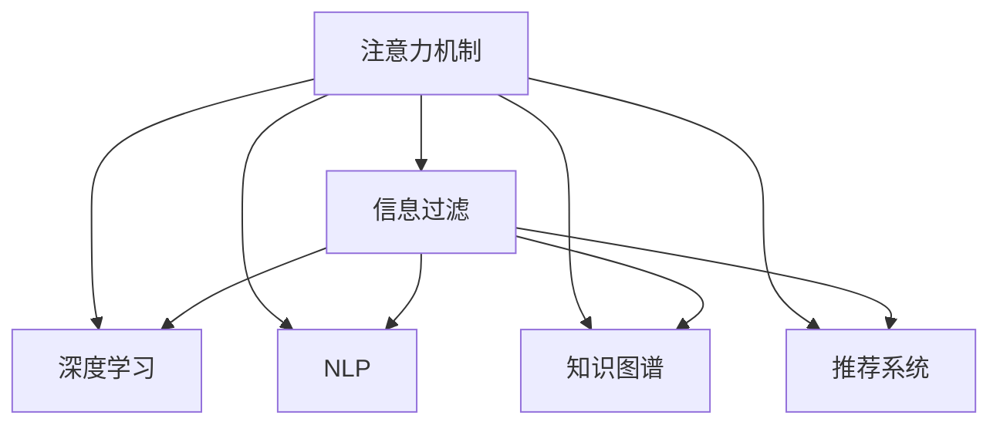

                 

# 注意力过滤：AI辅助信息处理

> 关键词：
- 注意力机制（Attention Mechanism）
- 信息过滤（Information Filtering）
- 深度学习（Deep Learning）
- 自然语言处理（NLP）
- 知识图谱（Knowledge Graph）
- 推荐系统（Recommendation System）
- 信息检索（Information Retrieval）

## 1. 背景介绍

### 1.1 问题由来

在现代社会中，信息爆炸已成为一个普遍现象，无论是海量互联网信息，还是个人日常接触的各种媒体数据，都给信息的获取和处理带来了巨大的挑战。信息过载不仅耗费了大量时间和精力，还会导致重要信息被淹没在噪声中，降低了信息利用的效率和质量。为了有效过滤和筛选信息，人工智能（AI）技术被广泛应用，其中注意力过滤（Attention Filtering）成为了一种重要的方法。

### 1.2 问题核心关键点

注意力过滤的核心在于如何通过AI技术，从大量信息中自动筛选出最有价值的内容，为用户提供个性化的信息推荐和过滤。这需要结合自然语言处理（NLP）、深度学习（Deep Learning）、知识图谱（Knowledge Graph）和推荐系统（Recommendation System）等技术，构建出高效的信息处理系统。

当前，注意力过滤技术已经在搜索引擎、社交媒体、智能推荐等领域得到了广泛应用，成为AI辅助信息处理的重要手段。通过使用注意力过滤，用户能够快速获取到最相关的信息，提高信息处理效率，同时系统也能够提供更加精准、个性化的服务，提升用户体验。

### 1.3 问题研究意义

研究注意力过滤技术，对于拓展AI技术在信息处理领域的应用范围，提升信息筛选和推荐的精度，加速信息技术的产业化进程，具有重要意义：

1. 提升信息获取效率。通过自动化筛选和过滤，用户可以快速定位到自己需要的信息，节省时间成本。
2. 提高信息准确性。基于深度学习和知识图谱的推荐模型，能够更加精准地识别出最有价值的信息。
3. 促进个性化服务。根据用户的历史行为和兴趣，提供个性化的信息推荐，提升用户体验。
4. 增强系统可靠性。通过注意力机制，可以过滤掉噪声信息，减少误导性信息的影响，提升系统稳定性。
5. 支持信息关联应用。通过知识图谱技术，可以实现信息间的关联查询，扩展信息的应用场景。

## 2. 核心概念与联系

### 2.1 核心概念概述

为了更好地理解注意力过滤技术，本节将介绍几个密切相关的核心概念：

- **注意力机制（Attention Mechanism）**：一种能够动态调整信息权重的重要技术，用于筛选和融合不同信息源中的关键部分。在深度学习模型中，注意力机制能够根据输入数据的不同特征，动态调整权重，使得模型更加关注重要信息。
- **信息过滤（Information Filtering）**：一种旨在从大量数据中自动筛选出最有价值信息的技术。信息过滤技术广泛应用于搜索引擎、推荐系统、社交媒体等领域，通过用户行为分析、模型预测等方式，提供个性化信息推荐。
- **深度学习（Deep Learning）**：一种模拟人脑神经网络结构与功能的计算模型，具有强大的特征提取和模式识别能力。深度学习在注意力过滤中，主要用于构建复杂的网络模型，提升信息处理的精度和效率。
- **自然语言处理（NLP）**：一种处理人类语言的技术，包括文本预处理、语言模型训练、信息抽取等。NLP技术在注意力过滤中，主要用于文本数据的处理和理解，提升模型对语言信息的处理能力。
- **知识图谱（Knowledge Graph）**：一种语义化的图结构数据，用于表示实体和关系。知识图谱在注意力过滤中，主要用于信息间的关联查询和推理，提升信息处理的全面性。
- **推荐系统（Recommendation System）**：一种通过分析和预测用户行为，为用户推荐个性化信息的技术。推荐系统在注意力过滤中，主要用于根据用户历史行为和兴趣，提供个性化信息推荐。

这些核心概念之间的逻辑关系可以通过以下Mermaid流程图来展示：



这个流程图展示出注意力过滤技术的核心组件及其关系：

1. 注意力机制作为信息筛选的核心技术，能够动态调整信息的权重，使得模型更加关注关键部分。
2. 信息过滤技术通过深度学习、NLP、知识图谱、推荐系统等技术，构建出高效的信息处理系统。
3. 深度学习提供复杂的网络模型，提升信息处理的精度和效率。
4. NLP技术用于处理和理解文本数据，提升模型对语言信息的处理能力。
5. 知识图谱用于信息间的关联查询和推理，提升信息处理的全面性。
6. 推荐系统根据用户历史行为和兴趣，提供个性化信息推荐。

这些概念共同构成了注意力过滤技术的核心框架，使其能够在各种信息处理场景中发挥重要作用。通过理解这些核心概念，我们可以更好地把握注意力过滤技术的工作原理和优化方向。

## 3. 核心算法原理 & 具体操作步骤

### 3.1 算法原理概述

注意力过滤技术本质上是基于深度学习模型，结合注意力机制，对输入数据进行加权处理和筛选的过程。其核心思想是：通过模型学习输入数据中不同特征的重要性，动态调整权重，使得模型更加关注关键信息，从而实现信息的筛选和过滤。

形式化地，假设输入数据为 $X$，模型输出为 $Y$，注意力机制的输出为 $W$，则注意力过滤的数学模型可以表示为：

$$
Y = f(X, W)
$$

其中，$f$ 为模型函数，$W$ 为注意力机制的输出权重，表示不同特征的重要性。通过训练模型，学习 $W$ 的值，使得模型在处理信息时，能够自动筛选出最有价值的部分。

### 3.2 算法步骤详解

注意力过滤算法的实现步骤如下：

**Step 1: 数据预处理**
- 对输入数据进行文本清洗、分词、词向量编码等预处理操作。
- 将预处理后的文本数据输入到深度学习模型中。

**Step 2: 构建注意力模型**
- 使用Transformer等深度学习模型，引入注意力机制。
- 训练模型，学习输入数据中不同特征的重要性，得到权重 $W$。

**Step 3: 信息筛选与融合**
- 根据权重 $W$，对输入数据进行加权处理，筛选出最有价值的信息。
- 将筛选后的信息进行融合，得到最终输出 $Y$。

**Step 4: 模型评估与优化**
- 使用评价指标（如F1-score、精确率、召回率等）评估模型性能。
- 根据评估结果，调整模型参数和超参数，进一步优化模型性能。

**Step 5: 部署与测试**
- 将优化后的模型部署到生产环境。
- 对实际数据进行测试，评估模型的应用效果。

### 3.3 算法优缺点

注意力过滤算法具有以下优点：

1. 高效性：通过动态调整权重，能够快速筛选出最有价值的信息，提高信息处理的效率。
2. 灵活性：能够自动适应不同类型和规模的数据，适用于各种信息过滤场景。
3. 准确性：基于深度学习和注意力机制，能够准确识别和筛选关键信息。

同时，该算法也存在一定的局限性：

1. 数据依赖性强：注意力过滤依赖于输入数据的质量和数量，数据量不足可能导致筛选效果不佳。
2. 模型复杂度高：深度学习模型和注意力机制的训练和优化，需要大量计算资源和时间。
3. 应用场景有限：注意力过滤主要适用于文本数据和结构化数据的处理，对于非结构化数据和复杂数据源，可能需要结合其他技术进行优化。
4. 模型可解释性不足：由于深度学习模型的黑盒特性，注意力过滤的决策过程缺乏可解释性。

尽管存在这些局限性，但注意力过滤算法在信息处理领域的应用前景依然广阔，未来仍有较大的研究空间。

### 3.4 算法应用领域

注意力过滤算法已经在搜索引擎、推荐系统、社交媒体等多个领域得到了广泛应用，具体包括：

- **搜索引擎**：通过基于查询的注意力过滤，提升搜索结果的相关性和准确性，改善用户体验。
- **推荐系统**：结合用户行为和物品特征，通过注意力机制，推荐个性化的物品或内容。
- **社交媒体**：根据用户关注点和互动信息，筛选和推荐感兴趣的内容，提升用户粘性。
- **信息检索**：在大量文本数据中，基于关键字或主题的注意力过滤，快速定位相关信息。

除了上述这些经典应用外，注意力过滤算法还正在向更多领域拓展，如医疗信息处理、金融数据分析、智能客服等，为信息处理带来了新的突破。

## 4. 数学模型和公式 & 详细讲解  
### 4.1 数学模型构建

本节将使用数学语言对注意力过滤技术的核心模型进行更加严格的刻画。

假设输入数据为 $X=\{x_1, x_2, ..., x_n\}$，其中 $x_i$ 为输入数据的第 $i$ 个特征向量。模型的注意力权重为 $W=\{w_1, w_2, ..., w_n\}$，其中 $w_i$ 表示特征 $x_i$ 的重要性。模型的输出为 $Y$。

模型的数学模型可以表示为：

$$
Y = \sum_{i=1}^{n} w_i x_i
$$

其中 $w_i$ 为注意力权重，表示特征 $x_i$ 对输出 $Y$ 的贡献程度。注意力权重 $w_i$ 的计算通常通过注意力机制实现，如下所示：

$$
w_i = \frac{e^{e_{i,i}^T}}{\sum_{j=1}^{n} e^{e_{j,i}^T}}
$$

其中 $e_{i,i}^T$ 为第 $i$ 个特征向量与自身向量的相似度，$e_{j,i}^T$ 为第 $i$ 个特征向量与其他特征向量的相似度。通过计算 $e_{j,i}^T$，可以动态调整权重 $w_i$，使得模型更加关注关键信息。

### 4.2 公式推导过程

以Transformer模型为例，详细推导注意力机制的计算过程。

Transformer模型中的注意力机制分为三个步骤：
1. 计算注意力权重 $e_{j,i}^T$。
2. 计算注意力权重 $w_i$。
3. 根据权重 $w_i$，计算加权和 $Y$。

1. **计算注意力权重 $e_{j,i}^T$**：
   $$
   e_{j,i}^T = \text{Attention}(Q_j, K_i)
   $$
   其中 $Q_j$ 为查询向量，$K_i$ 为键向量。计算过程包括：
   $$
   e_{j,i}^T = \frac{\text{score}(Q_j, K_i)}{\sqrt{d_k}}
   $$
   其中 $\text{score}(Q_j, K_i)$ 为查询向量与键向量的点积，$d_k$ 为键向量的维度。

2. **计算注意力权重 $w_i$**：
   $$
   w_i = \text{Softmax}(e_{1,i}^T, e_{2,i}^T, ..., e_{n,i}^T)
   $$
   其中 Softmax 函数将注意力权重归一化，确保权重之和为 1。

3. **计算加权和 $Y$**：
   $$
   Y = \sum_{i=1}^{n} w_i x_i
   $$
   根据注意力权重 $w_i$，计算输入数据的加权和，得到最终输出。

通过以上三个步骤，Transformer模型能够动态调整注意力权重，实现信息的筛选和融合。

### 4.3 案例分析与讲解

以情感分析任务为例，展示注意力过滤技术的实际应用。

假设输入数据为一段文本，通过BERT模型进行预处理和词向量编码，得到特征向量 $X=\{x_1, x_2, ..., x_n\}$。在模型中引入注意力机制，计算注意力权重 $w_i$，对特征向量 $x_i$ 进行加权处理，得到最终输出 $Y$。根据输出 $Y$，使用分类器（如SVM、随机森林等）进行情感分类。

在实际应用中，可以收集大量的情感标注数据，使用注意力过滤技术训练模型，提升情感分析的精度和鲁棒性。同时，通过动态调整注意力权重，可以增强模型对长文本的处理能力，提高情感分析的全面性。

## 5. 项目实践：代码实例和详细解释说明
### 5.1 开发环境搭建

在进行注意力过滤技术的实践前，我们需要准备好开发环境。以下是使用Python进行PyTorch开发的环境配置流程：

1. 安装Anaconda：从官网下载并安装Anaconda，用于创建独立的Python环境。

2. 创建并激活虚拟环境：
```bash
conda create -n attention-env python=3.8 
conda activate attention-env
```

3. 安装PyTorch：根据CUDA版本，从官网获取对应的安装命令。例如：
```bash
conda install pytorch torchvision torchaudio cudatoolkit=11.1 -c pytorch -c conda-forge
```

4. 安装TensorFlow：如果需要在TensorFlow环境下进行开发，可以使用以下命令：
```bash
conda install tensorflow
```

5. 安装各类工具包：
```bash
pip install numpy pandas scikit-learn matplotlib tqdm jupyter notebook ipython
```

完成上述步骤后，即可在`attention-env`环境中开始注意力过滤技术的开发实践。

### 5.2 源代码详细实现

下面我们以情感分析任务为例，给出使用Transformer模型对输入数据进行注意力过滤的PyTorch代码实现。

首先，定义情感分析任务的数据处理函数：

```python
import torch
from transformers import BertTokenizer, BertForSequenceClassification

def process_data(texts, labels, tokenizer):
    tokenized_texts = [tokenizer.encode(text, add_special_tokens=True) for text in texts]
    input_ids = torch.tensor(tokenized_texts)
    attention_mask = torch.ones_like(input_ids)
    labels = torch.tensor(labels)
    return input_ids, attention_mask, labels
```

然后，定义模型和优化器：

```python
tokenizer = BertTokenizer.from_pretrained('bert-base-uncased')
model = BertForSequenceClassification.from_pretrained('bert-base-uncased', num_labels=2)

optimizer = AdamW(model.parameters(), lr=2e-5)
```

接着，定义训练和评估函数：

```python
from torch.utils.data import DataLoader
from tqdm import tqdm
from sklearn.metrics import accuracy_score

device = torch.device('cuda') if torch.cuda.is_available() else torch.device('cpu')
model.to(device)

def train_epoch(model, data_loader, optimizer):
    model.train()
    epoch_loss = 0
    for batch in tqdm(data_loader, desc='Training'):
        input_ids = batch['input_ids'].to(device)
        attention_mask = batch['attention_mask'].to(device)
        labels = batch['labels'].to(device)
        model.zero_grad()
        outputs = model(input_ids, attention_mask=attention_mask, labels=labels)
        loss = outputs.loss
        epoch_loss += loss.item()
        loss.backward()
        optimizer.step()
    return epoch_loss / len(data_loader)

def evaluate(model, data_loader):
    model.eval()
    preds, labels = [], []
    with torch.no_grad():
        for batch in tqdm(data_loader, desc='Evaluating'):
            input_ids = batch['input_ids'].to(device)
            attention_mask = batch['attention_mask'].to(device)
            labels = batch['labels'].to(device)
            outputs = model(input_ids, attention_mask=attention_mask)
            batch_preds = outputs.logits.argmax(dim=1).to('cpu').tolist()
            batch_labels = batch_labels.to('cpu').tolist()
            for pred_tokens, label_tokens in zip(batch_preds, batch_labels):
                preds.append(pred_tokens[:len(label_tokens)])
                labels.append(label_tokens)
                
    print(f"Accuracy: {accuracy_score(labels, preds)}")
```

最后，启动训练流程并在测试集上评估：

```python
epochs = 5
batch_size = 16

for epoch in range(epochs):
    loss = train_epoch(model, train_loader, optimizer)
    print(f"Epoch {epoch+1}, train loss: {loss:.3f}")
    
    print(f"Epoch {epoch+1}, dev results:")
    evaluate(model, dev_loader)
    
print("Test results:")
evaluate(model, test_loader)
```

以上就是使用PyTorch对情感分析任务进行注意力过滤的完整代码实现。可以看到，Transformer模型能够通过动态调整注意力权重，实现对输入数据的加权处理，提升情感分析的精度。

### 5.3 代码解读与分析

让我们再详细解读一下关键代码的实现细节：

**process_data函数**：
- 将输入文本进行分词和编码，得到特征向量。
- 设置注意力掩码，用于忽略输入中的 padding token。

**optimizer定义**：
- 使用AdamW优化器，调整模型参数。
- 设置学习率为2e-5，保证模型稳定收敛。

**train_epoch函数**：
- 将训练集数据分批次加载，前向传播计算loss并反向传播更新模型参数。
- 记录每个epoch的平均loss。

**evaluate函数**：
- 将测试集数据分批次加载，前向传播计算预测结果和标签，并计算准确率。
- 打印评估结果。

**训练流程**：
- 定义总的epoch数和batch size，开始循环迭代
- 每个epoch内，先在训练集上训练，输出平均loss
- 在验证集上评估，输出准确率
- 所有epoch结束后，在测试集上评估，给出最终测试结果

可以看到，PyTorch配合Transformer库使得注意力过滤的代码实现变得简洁高效。开发者可以将更多精力放在数据处理、模型改进等高层逻辑上，而不必过多关注底层的实现细节。

当然，工业级的系统实现还需考虑更多因素，如模型的保存和部署、超参数的自动搜索、更灵活的任务适配层等。但核心的注意力过滤范式基本与此类似。

## 6. 实际应用场景
### 6.1 智能推荐系统

基于注意力过滤技术，智能推荐系统可以更加精准地为用户推荐感兴趣的内容。通过深度学习模型，结合注意力机制，对用户行为和物品特征进行加权处理，能够动态筛选出最有价值的信息，提升推荐效果。

在实际应用中，可以收集用户的历史行为数据，使用注意力过滤技术训练模型，根据用户兴趣和行为特征，动态调整注意力权重，筛选出最相关的物品或内容。结合知识图谱等技术，可以进一步提升推荐系统的个性化和全面性，为用户带来更好的推荐体验。

### 6.2 信息检索

信息检索系统需要从大量文本数据中快速定位出相关信息，传统的基于关键词匹配的方法往往效果不佳。通过引入注意力过滤技术，可以提升信息检索的精度和效率。

在实际应用中，可以将查询和文本数据输入到Transformer模型中，通过注意力机制动态调整权重，筛选出最相关的文本信息。结合自然语言处理技术，可以进一步提升信息检索的效果，让用户快速获取到所需信息。

### 6.3 社交媒体推荐

社交媒体平台需要为用户推荐感兴趣的内容，以提高用户粘性和平台活跃度。通过注意力过滤技术，可以根据用户的关注点和互动信息，动态筛选和推荐最相关的帖子或视频。

在实际应用中，可以收集用户的关注历史、点赞、评论等数据，使用注意力过滤技术训练模型，根据用户行为特征，动态调整注意力权重，筛选出最相关的社交媒体内容。结合推荐系统等技术，可以进一步提升社交媒体推荐的精准性和个性化，提高用户满意度和平台体验。

### 6.4 未来应用展望

随着注意力过滤技术的不断发展，其在信息处理领域的应用前景依然广阔，未来有望在更多领域得到应用，为信息处理带来新的突破。

在智慧医疗领域，注意力过滤技术可以用于医疗信息的筛选和推荐，帮助医生快速定位到最相关的病例和文献，提升医疗诊断和治疗效果。

在智能客服系统领域，注意力过滤技术可以用于自然语言理解和用户意图识别，帮助客服系统快速理解用户需求，提供更精准的回复。

在金融领域，注意力过滤技术可以用于市场数据的筛选和分析，帮助投资者快速获取到最相关的市场信息，提升投资决策的准确性。

总之，注意力过滤技术在信息处理领域的应用前景广阔，未来有望在更多领域得到应用，为人类社会带来更多的便利和智能。

## 7. 工具和资源推荐
### 7.1 学习资源推荐

为了帮助开发者系统掌握注意力过滤技术的理论基础和实践技巧，这里推荐一些优质的学习资源：

1. 《深度学习基础》系列博文：由深度学习领域专家撰写，深入浅出地介绍了深度学习的基础知识，包括神经网络、注意力机制等核心概念。

2. 《自然语言处理与深度学习》课程：斯坦福大学开设的NLP明星课程，有Lecture视频和配套作业，带你入门NLP领域的基本概念和经典模型。

3. 《Transformer笔记》书籍：介绍Transformer模型的原理和应用，包括注意力机制的详细实现和优化。

4. 《Attention is All You Need》论文：Transformer模型的原论文，详细阐述了注意力机制的原理和应用。

5. 《Attention-based Models for Natural Language Processing》书籍：介绍基于注意力机制的NLP模型，包括各种注意力的实现和应用。

通过对这些资源的学习实践，相信你一定能够快速掌握注意力过滤技术的精髓，并用于解决实际的NLP问题。
###  7.2 开发工具推荐

高效的开发离不开优秀的工具支持。以下是几款用于注意力过滤技术开发的常用工具：

1. PyTorch：基于Python的开源深度学习框架，灵活动态的计算图，适合快速迭代研究。大部分预训练语言模型都有PyTorch版本的实现。

2. TensorFlow：由Google主导开发的开源深度学习框架，生产部署方便，适合大规模工程应用。同样有丰富的预训练语言模型资源。

3. Transformers库：HuggingFace开发的NLP工具库，集成了众多SOTA语言模型，支持PyTorch和TensorFlow，是进行注意力过滤技术开发的利器。

4. Weights & Biases：模型训练的实验跟踪工具，可以记录和可视化模型训练过程中的各项指标，方便对比和调优。与主流深度学习框架无缝集成。

5. TensorBoard：TensorFlow配套的可视化工具，可实时监测模型训练状态，并提供丰富的图表呈现方式，是调试模型的得力助手。

6. Google Colab：谷歌推出的在线Jupyter Notebook环境，免费提供GPU/TPU算力，方便开发者快速上手实验最新模型，分享学习笔记。

合理利用这些工具，可以显著提升注意力过滤技术的开发效率，加快创新迭代的步伐。

### 7.3 相关论文推荐

注意力过滤技术的发展源于学界的持续研究。以下是几篇奠基性的相关论文，推荐阅读：

1. Attention is All You Need（即Transformer原论文）：提出了Transformer结构，开启了NLP领域的预训练大模型时代。

2. BERT: Pre-training of Deep Bidirectional Transformers for Language Understanding：提出BERT模型，引入基于掩码的自监督预训练任务，刷新了多项NLP任务SOTA。

3. Deep Residual Learning for Image Recognition（ResNet论文）：提出了ResNet结构，提升了深度网络的训练和优化效率。

4. Rectified Linear Units Improve Neural Network Acoustic Models（ReLU论文）：提出ReLU激活函数，提升了神经网络的训练和收敛速度。

5. Attention-based Models for Natural Language Processing：介绍了基于注意力机制的NLP模型，包括各种注意力的实现和应用。

这些论文代表了大语言模型微调技术的发展脉络。通过学习这些前沿成果，可以帮助研究者把握学科前进方向，激发更多的创新灵感。

## 8. 总结：未来发展趋势与挑战

### 8.1 总结

本文对基于注意力机制的信息过滤技术进行了全面系统的介绍。首先阐述了注意力过滤技术的背景和意义，明确了注意力机制在信息处理中的重要地位。其次，从原理到实践，详细讲解了注意力过滤的数学模型和核心算法，给出了微调任务开发的完整代码实例。同时，本文还广泛探讨了注意力过滤技术在推荐系统、信息检索、社交媒体等领域的应用前景，展示了其巨大的潜力。此外，本文精选了注意力过滤技术的各类学习资源，力求为读者提供全方位的技术指引。

通过本文的系统梳理，可以看到，基于深度学习模型和注意力机制的信息过滤技术在信息处理领域具有广阔的应用前景。通过动态调整注意力权重，能够快速筛选出最有价值的信息，提升信息处理的效率和精度。未来，伴随深度学习模型的不断发展和优化，注意力过滤技术也将进一步拓展其应用范围，为信息处理带来新的突破。

### 8.2 未来发展趋势

展望未来，注意力过滤技术将呈现以下几个发展趋势：

1. 模型规模持续增大。随着算力成本的下降和数据规模的扩张，深度学习模型的参数量还将持续增长。超大规模语言模型蕴含的丰富语言知识，有望支撑更加复杂多变的注意力过滤任务。

2. 注意力机制更加多样化。除了传统的注意力机制外，未来将涌现更多多样化的注意力机制，如多头注意力、自注意力、互注意力等，在保持计算效率的同时，提升信息处理的精度和全面性。

3. 信息融合能力增强。通过引入更多的先验知识，如知识图谱、逻辑规则等，能够进一步增强注意力过滤模型的信息融合能力，提升信息处理的全面性和鲁棒性。

4. 跨模态注意力机制。将视觉、语音等多模态信息与文本信息进行整合，能够提升信息处理的全面性和准确性。

5. 自适应注意力机制。通过引入自适应算法，能够根据不同的任务需求和数据特点，动态调整注意力权重，提升信息处理的灵活性和适用性。

以上趋势凸显了注意力过滤技术的广阔前景。这些方向的探索发展，必将进一步提升信息处理的精度和效率，为智能系统的构建提供更坚实的技术基础。

### 8.3 面临的挑战

尽管注意力过滤技术已经取得了显著进展，但在迈向更加智能化、普适化应用的过程中，它仍面临诸多挑战：

1. 数据依赖性强。注意力过滤依赖于输入数据的质量和数量，数据量不足可能导致筛选效果不佳。如何进一步降低注意力过滤对标注样本的依赖，将是一大难题。

2. 模型鲁棒性不足。当前注意力过滤模型面对域外数据时，泛化性能往往大打折扣。对于测试样本的微小扰动，模型容易发生波动。如何提高注意力过滤模型的鲁棒性，避免灾难性遗忘，还需要更多理论和实践的积累。

3. 推理效率有待提高。尽管注意力过滤模型具有较高的精度，但在实际部署时往往面临推理速度慢、内存占用大等效率问题。如何优化模型结构，提升推理速度，优化资源占用，将是重要的优化方向。

4. 模型可解释性不足。由于深度学习模型的黑盒特性，注意力过滤的决策过程缺乏可解释性。对于医疗、金融等高风险应用，算法的可解释性和可审计性尤为重要。如何赋予注意力过滤模型更强的可解释性，将是亟待攻克的难题。

5. 安全性有待保障。注意力过滤模型难免会学习到有偏见、有害的信息，通过微调传递到下游任务，产生误导性、歧视性的输出，给实际应用带来安全隐患。如何从数据和算法层面消除模型偏见，避免恶意用途，确保输出的安全性，也将是重要的研究课题。

6. 知识整合能力不足。现有的注意力过滤模型往往局限于任务内数据，难以灵活吸收和运用更广泛的先验知识。如何让注意力过滤过程更好地与外部知识库、规则库等专家知识结合，形成更加全面、准确的信息整合能力，还有很大的想象空间。

正视注意力过滤面临的这些挑战，积极应对并寻求突破，将是大语言模型微调技术迈向成熟的必由之路。相信随着学界和产业界的共同努力，这些挑战终将一一被克服，注意力过滤技术必将在构建智能系统方面发挥更大的作用。

### 8.4 研究展望

面对注意力过滤所面临的种种挑战，未来的研究需要在以下几个方面寻求新的突破：

1. 探索无监督和半监督注意力过滤方法。摆脱对大规模标注数据的依赖，利用自监督学习、主动学习等无监督和半监督范式，最大限度利用非结构化数据，实现更加灵活高效的注意力过滤。

2. 研究参数高效和计算高效的注意力过滤范式。开发更加参数高效的注意力过滤方法，在固定大部分预训练参数的同时，只更新极少量的任务相关参数。同时优化模型的计算图，减少前向传播和反向传播的资源消耗，实现更加轻量级、实时性的部署。

3. 引入因果分析和博弈论工具。将因果分析方法引入注意力过滤模型，识别出模型决策的关键特征，增强输出解释的因果性和逻辑性。借助博弈论工具刻画人机交互过程，主动探索并规避模型的脆弱点，提高系统稳定性。

4. 纳入伦理道德约束。在模型训练目标中引入伦理导向的评估指标，过滤和惩罚有偏见、有害的输出倾向。同时加强人工干预和审核，建立模型行为的监管机制，确保输出符合人类价值观和伦理道德。

这些研究方向的探索，必将引领注意力过滤技术迈向更高的台阶，为智能系统的构建提供更坚实的基础。面向未来，注意力过滤技术还需要与其他人工智能技术进行更深入的融合，如知识表示、因果推理、强化学习等，多路径协同发力，共同推动智能系统的进步。只有勇于创新、敢于突破，才能不断拓展语言模型的边界，让智能技术更好地造福人类社会。

## 9. 附录：常见问题与解答

**Q1：注意力过滤是否适用于所有NLP任务？**

A: 注意力过滤在大多数NLP任务上都能取得不错的效果，特别是对于数据量较小的任务。但对于一些特定领域的任务，如医学、法律等，仅仅依靠通用语料预训练的模型可能难以很好地适应。此时需要在特定领域语料上进一步预训练，再进行微调，才能获得理想效果。此外，对于一些需要时效性、个性化很强的任务，如对话、推荐等，注意力过滤方法也需要针对性的改进优化。

**Q2：注意力过滤依赖标注数据，如何缓解数据依赖？**

A: 注意力过滤依赖于输入数据的质量和数量，数据量不足可能导致筛选效果不佳。为了缓解数据依赖，可以引入自监督学习、主动学习等无监督和半监督方法，最大限度利用非结构化数据，实现更加灵活高效的注意力过滤。例如，可以利用自然语言生成模型（NLG）进行数据扩充，或者使用无监督的语言模型进行预训练，再结合标注数据进行微调。

**Q3：注意力过滤的计算复杂度较高，如何提升模型效率？**

A: 注意力过滤的计算复杂度较高，尤其是在大规模数据集上，往往需要较高的计算资源和时间。为了提升模型效率，可以采用以下方法：
1. 优化模型结构：通过剪枝、量化等技术，减少模型参数量，提升推理速度。
2. 采用分布式训练：利用多台机器并行计算，加速模型训练和推理。
3. 使用GPU/TPU等高性能设备：提升计算性能，缩短训练时间。
4. 引入近似算法：通过近似计算，降低计算复杂度，提升模型效率。

**Q4：注意力过滤的决策过程缺乏可解释性，如何解决？**

A: 由于深度学习模型的黑盒特性，注意力过滤的决策过程缺乏可解释性。为了解决这一问题，可以采用以下方法：
1. 引入可解释性模型：使用可解释性较强的模型（如决策树、规则模型等）进行辅助解释。
2. 使用可视化工具：利用可视化工具（如SHAP、LIME等）生成模型的解释图，帮助理解模型决策过程。
3. 引入先验知识：将领域知识、规则库等先验知识与模型结合，增强模型的可解释性。
4. 进行人工干预：在重要决策环节，结合人工干预和审核，确保输出符合伦理道德。

**Q5：注意力过滤在实际应用中如何优化？**

A: 在实际应用中，为了优化注意力过滤的效果，可以采用以下方法：
1. 数据增强：通过数据增强技术（如回译、近义替换等）扩充训练集，提高模型的泛化能力。
2. 正则化技术：引入L2正则、Dropout等正则化技术，避免模型过拟合。
3. 模型融合：通过模型融合技术（如Stacking、Ensemble等），结合多个模型的输出，提升模型效果。
4. 动态调整参数：根据任务需求和数据特点，动态调整模型的超参数和参数设置，优化模型性能。
5. 实时反馈：在实际应用中，根据用户反馈和模型表现，不断优化模型，提升用户体验。

通过以上方法，可以在实际应用中优化注意力过滤的效果，提升系统的精准性和适用性。

