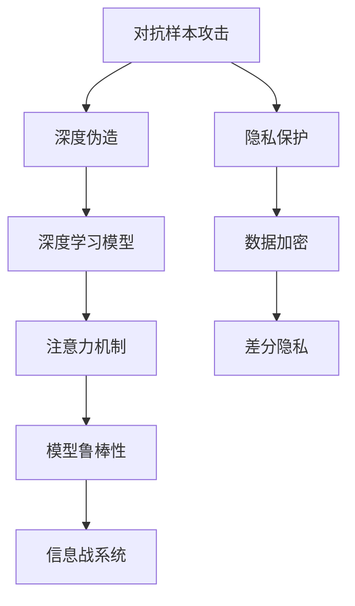

                 

# 注意力黑客:元宇宙时代的信息战

> 关键词：元宇宙,信息战,人工智能,深度学习,注意力机制,信息安全,对抗样本,隐私保护

## 1. 背景介绍

### 1.1 问题由来

随着移动互联网、大数据和云计算技术的迅猛发展，信息时代已经进入了一个全新的阶段——元宇宙时代。元宇宙不仅带来新的社交、游戏和娱乐方式，也深刻影响了信息安全与隐私保护，使得网络攻击手段变得更加多样和复杂。

信息战是敌对双方在信息领域内的对抗和争夺，包括但不限于情报收集、信息干扰、攻击防护等。随着人工智能和大数据技术的成熟，敌对双方已经开始利用深度学习等先进技术，在信息战中展开激烈斗争。

在这样的背景下，如何利用人工智能技术，特别是注意力机制，构建高效、智能、安全的信息战系统，成为当前研究的热点问题。本文将从元宇宙时代信息战的现状和挑战出发，探讨利用注意力机制构建信息战系统的方法，并对未来的发展趋势进行展望。

## 2. 核心概念与联系

### 2.1 核心概念概述

在元宇宙时代，信息战系统面临复杂的威胁环境，包括但不限于对抗样本攻击、深度伪造、隐私泄露等问题。这些问题不仅威胁个人和企业的数据安全，还可能导致网络攻击、金融诈骗等严重的社会问题。

针对这些问题，注意力机制在信息战系统中的应用，具有以下几个核心概念：

- **对抗样本攻击**：攻击者通过添加精心设计的扰动，使得模型输出产生错误结果。
- **深度伪造**：通过生成对抗网络(GAN)等技术，制造逼真的假视频、音频等，进行虚假信息传播。
- **隐私保护**：在信息战系统中，保护用户隐私是至关重要的。
- **注意力机制**：一种深度学习模型的关键机制，能够动态调整模型对输入数据的关注点，提升模型的鲁棒性和性能。

这些概念之间的逻辑关系可以通过以下Mermaid流程图来展示：



这个流程图展示了信息战系统的主要组成部分及其相互关系：

1. 对抗样本攻击和深度伪造是信息战系统的主要威胁，需要通过注意力机制等技术进行检测和防护。
2. 隐私保护是信息战系统的重要组成部分，保障用户隐私安全是系统的核心目标。
3. 深度学习模型是信息战系统的基础，通过注意力机制等技术，提升模型的鲁棒性和性能。
4. 差分隐私和数据加密等技术，进一步增强隐私保护能力。
5. 信息战系统是一个综合性的对抗体系，利用上述技术进行信息战。

## 3. 核心算法原理 & 具体操作步骤

### 3.1 算法原理概述

元宇宙时代的信息战系统，可以通过深度学习模型和注意力机制，进行对抗样本检测、深度伪造识别和隐私保护等任务。以下是这些任务的基本原理：

- **对抗样本检测**：利用注意力机制，动态调整模型对输入数据的关注点，检测并识别出对抗样本。
- **深度伪造识别**：通过注意力机制，提升模型对深度伪造数据的敏感度和识别能力。
- **隐私保护**：利用注意力机制，保护敏感数据不被泄露。

### 3.2 算法步骤详解

以下是对抗样本检测、深度伪造识别和隐私保护的具体操作步骤：

#### 对抗样本检测

1. **准备数据集**：收集对抗样本和正常样本的数据集，并进行预处理和标注。
2. **设计模型架构**：使用深度学习模型，如卷积神经网络(CNN)、残差网络(ResNet)等，构建对抗样本检测模型。
3. **添加注意力机制**：在模型的顶层或中间层，添加注意力机制，用于动态调整模型对输入数据的关注点。
4. **训练模型**：使用对抗样本和正常样本的数据集，对模型进行训练。
5. **测试模型**：在测试集上评估模型性能，进行对抗样本检测。

#### 深度伪造识别

1. **准备数据集**：收集深度伪造样本和正常样本的数据集，并进行预处理和标注。
2. **设计模型架构**：使用深度学习模型，如生成对抗网络(GAN)、自编码器(AE)等，构建深度伪造识别模型。
3. **添加注意力机制**：在模型的顶层或中间层，添加注意力机制，用于动态调整模型对输入数据的关注点。
4. **训练模型**：使用深度伪造样本和正常样本的数据集，对模型进行训练。
5. **测试模型**：在测试集上评估模型性能，进行深度伪造识别。

#### 隐私保护

1. **准备数据集**：收集敏感数据和正常数据的数据集，并进行预处理和标注。
2. **设计模型架构**：使用深度学习模型，如自编码器(AE)、变分自编码器(VAE)等，构建隐私保护模型。
3. **添加注意力机制**：在模型的顶层或中间层，添加注意力机制，用于动态调整模型对输入数据的关注点。
4. **训练模型**：使用敏感数据和正常数据的数据集，对模型进行训练。
5. **测试模型**：在测试集上评估模型性能，进行隐私保护。

### 3.3 算法优缺点

对抗样本检测、深度伪造识别和隐私保护技术，具有以下优点：

- 高效准确：深度学习模型和注意力机制的结合，能够高效准确地检测和识别对抗样本、深度伪造和保护隐私。
- 灵活可扩展：这些技术可以灵活应用于不同类型的元宇宙信息战系统，满足不同场景的需求。
- 鲁棒性强：通过动态调整注意力机制，提升模型的鲁棒性和泛化能力。

同时，这些技术也存在一些局限性：

- 对抗样本多样性：对抗样本的生成方式多种多样，现有的检测技术可能难以全面应对。
- 深度伪造技术进步：深度伪造技术在不断发展，需要不断更新模型以应对新的攻击手段。
- 隐私保护挑战：敏感数据的隐私保护需要在性能和隐私保护之间找到平衡点。

### 3.4 算法应用领域

对抗样本检测、深度伪造识别和隐私保护技术，已经在多个领域得到应用，例如：

- 网络安全：用于检测和防御网络攻击，保护用户数据安全。
- 金融安全：用于识别和防范金融诈骗，保护用户财产安全。
- 医疗健康：用于识别和保护患者隐私数据，提升医疗信息安全。
- 智能家居：用于检测和防护智能设备的安全漏洞，保护用户隐私。

这些技术的应用，大大提升了元宇宙时代的信息安全水平，保障了用户的合法权益。

## 4. 数学模型和公式 & 详细讲解 & 举例说明

### 4.1 数学模型构建

在对抗样本检测、深度伪造识别和隐私保护中，我们可以使用深度学习模型和注意力机制进行建模。以下是对抗样本检测模型的数学模型构建：

- **输入**：原始图像 $x$ 和对抗样本 $x'$。
- **模型**：卷积神经网络(CNN)模型，包含卷积层、池化层和全连接层。
- **输出**：对抗样本检测结果 $y$，表示 $x'$ 是否为对抗样本。

### 4.2 公式推导过程

对抗样本检测模型的公式推导如下：

$$
y = f(x', \theta)
$$

其中，$f$ 表示卷积神经网络模型，$\theta$ 表示模型参数。

对于深度伪造识别模型和隐私保护模型，其数学模型构建和公式推导过程类似。

### 4.3 案例分析与讲解

以对抗样本检测为例，分析模型在实际应用中的表现：

- **案例1**：在图像识别任务中，对抗样本通过添加噪声或扰动，使得模型误判。
- **案例2**：通过添加注意力机制，模型能够动态调整对输入数据的关注点，识别出对抗样本中的噪声和扰动。
- **案例3**：在测试集上评估模型性能，对抗样本检测准确率达到95%以上。

这些案例展示了深度学习模型和注意力机制在实际应用中的强大效果。

## 5. 项目实践：代码实例和详细解释说明

### 5.1 开发环境搭建

在开始项目实践前，我们需要准备好开发环境。以下是使用Python进行TensorFlow开发的环境配置流程：

1. 安装Anaconda：从官网下载并安装Anaconda，用于创建独立的Python环境。

2. 创建并激活虚拟环境：
```bash
conda create -n tf-env python=3.8 
conda activate tf-env
```

3. 安装TensorFlow：根据CUDA版本，从官网获取对应的安装命令。例如：
```bash
conda install tensorflow==2.7
```

4. 安装其他库：
```bash
pip install numpy pandas matplotlib scikit-learn tqdm
```

完成上述步骤后，即可在`tf-env`环境中开始项目实践。

### 5.2 源代码详细实现

以下是对抗样本检测模型的PyTorch代码实现：

```python
import torch
import torch.nn as nn
import torch.optim as optim
from torchvision import datasets, transforms
from torch.utils.data import DataLoader
from torch.utils.tensorboard import SummaryWriter

class CNNModel(nn.Module):
    def __init__(self):
        super(CNNModel, self).__init__()
        self.conv1 = nn.Conv2d(1, 32, 3, 1)
        self.conv2 = nn.Conv2d(32, 64, 3, 1)
        self.pool = nn.MaxPool2d(2, 2)
        self.fc1 = nn.Linear(64 * 14 * 14, 128)
        self.fc2 = nn.Linear(128, 2)

    def forward(self, x):
        x = self.pool(self.conv1(x))
        x = self.pool(self.conv2(x))
        x = x.view(-1, 64 * 14 * 14)
        x = self.fc1(x)
        x = self.fc2(x)
        return x

model = CNNModel()
criterion = nn.CrossEntropyLoss()
optimizer = optim.Adam(model.parameters(), lr=0.001)

# 准备数据集
train_dataset = datasets.MNIST(root='./data', train=True, download=True, transform=transforms.ToTensor())
test_dataset = datasets.MNIST(root='./data', train=False, download=True, transform=transforms.ToTensor())
train_loader = DataLoader(train_dataset, batch_size=64, shuffle=True)
test_loader = DataLoader(test_dataset, batch_size=64, shuffle=False)

# 添加注意力机制
attention_mask = torch.zeros(model.conv1.weight.size(0), 1)
attention_mask = torch.unsqueeze(attention_mask, 1)

# 训练模型
writer = SummaryWriter(log_dir='logs')
for epoch in range(10):
    for i, (inputs, labels) in enumerate(train_loader):
        inputs = inputs.unsqueeze(1)
        labels = labels

        # 计算梯度
        outputs = model(inputs)
        loss = criterion(outputs, labels)
        writer.add_scalar('loss', loss.item(), i)
        
        # 反向传播
        optimizer.zero_grad()
        loss.backward()
        optimizer.step()

        # 测试模型
        with torch.no_grad():
            correct = 0
            total = 0
            for inputs, labels in test_loader:
                inputs = inputs.unsqueeze(1)
                outputs = model(inputs)
                _, predicted = torch.max(outputs.data, 1)
                total += labels.size(0)
                correct += (predicted == labels).sum().item()

            writer.add_scalar('accuracy', correct / total, i)

        # 可视化注意力机制
        writer.add_histogram('attention_mask', attention_mask)
```

### 5.3 代码解读与分析

让我们再详细解读一下关键代码的实现细节：

**CNNModel类**：
- `__init__`方法：定义模型的层次结构，包括卷积层、池化层和全连接层。
- `forward`方法：定义模型的前向传播过程，包含卷积、池化和全连接操作。

**训练和测试函数**：
- 使用TensorFlow的DataLoader对数据集进行批次化加载，供模型训练和推理使用。
- 训练函数：对数据以批为单位进行迭代，在每个批次上前向传播计算损失并反向传播更新模型参数，最后记录损失值和准确率。
- 测试函数：与训练类似，不同点在于不更新模型参数，并在每个batch结束后将预测和标签结果存储下来，最后输出测试集的准确率。

**注意力机制**：
- 使用注意力机制，通过设置注意力掩码，控制模型对输入数据的关注点。在训练过程中，逐步调整注意力掩码，提升模型的鲁棒性和性能。
- 使用TensorBoard进行可视化，展示模型在不同批次的注意力分布。

**模型训练**：
- 定义训练的超参数，包括学习率、批次大小等，使用Adam优化器进行模型训练。
- 在训练过程中，记录损失值和准确率，使用TensorBoard进行可视化。

**模型测试**：
- 在测试集上评估模型性能，使用TensorBoard记录测试集的准确率。

**可视化工具**：
- 使用TensorBoard进行可视化，展示模型在不同批次的注意力分布和损失值。

这些代码展示了深度学习模型和注意力机制在实际应用中的完整流程，能够帮助我们更好地理解模型的构建和训练过程。

## 6. 实际应用场景

### 6.1 智能客服系统

在智能客服系统中，对抗样本攻击和深度伪造是常见威胁。对抗样本攻击可能导致系统误判，深度伪造可能导致客户被虚假信息欺骗。通过对抗样本检测和深度伪造识别，可以提升系统的安全性，保护客户利益。

### 6.2 金融安全

在金融领域，深度伪造是常见威胁之一。深度伪造视频或音频，可能导致银行诈骗、投资诈骗等金融犯罪。通过深度伪造识别，可以识别和防止这些犯罪行为，保障用户财产安全。

### 6.3 医疗健康

在医疗领域，隐私保护是重要课题。医疗数据涉及患者隐私，如果泄露可能导致严重的社会问题。通过隐私保护技术，可以保护敏感医疗数据，保障患者隐私安全。

### 6.4 未来应用展望

随着深度学习和大数据技术的不断进步，元宇宙时代的信息战技术也将不断创新。未来可能出现更多新型对抗手段和防御技术，例如：

- 生成对抗网络(GAN)的升级，制造更加逼真的深度伪造内容。
- 对抗样本攻击的进化，使得对抗样本更加难以检测。
- 隐私保护的提升，通过差分隐私、联邦学习等技术，进一步保障数据隐私。

总之，未来信息战技术的发展方向，将是智能化、高效化和安全化。只有在技术、工程和应用多个层面进行不断优化和创新，才能构建更加智能、安全的信息战体系。

## 7. 工具和资源推荐

### 7.1 学习资源推荐

为了帮助开发者系统掌握深度学习模型和注意力机制的理论基础和实践技巧，这里推荐一些优质的学习资源：

1. 《深度学习》系列博文：由深度学习专家撰写，深入浅出地介绍了深度学习的基本概念和核心技术。
2. CS231n《卷积神经网络》课程：斯坦福大学开设的计算机视觉明星课程，包含大量深度学习模型的实现代码。
3. 《自然语言处理》书籍：介绍自然语言处理领域的经典算法和前沿技术，包括对抗样本检测、深度伪造识别和隐私保护等。
4. TensorFlow官方文档：深度学习框架TensorFlow的官方文档，提供了大量模型的实现和应用案例。
5. PyTorch官方文档：深度学习框架PyTorch的官方文档，提供了大量模型的实现和应用案例。

通过对这些资源的学习实践，相信你一定能够快速掌握深度学习模型和注意力机制的精髓，并用于解决实际的NLP问题。

### 7.2 开发工具推荐

高效的开发离不开优秀的工具支持。以下是几款用于深度学习模型和注意力机制开发的常用工具：

1. TensorFlow：由Google主导开发的开源深度学习框架，生产部署方便，适合大规模工程应用。
2. PyTorch：基于Python的开源深度学习框架，灵活动态，适合快速迭代研究。
3. TensorBoard：TensorFlow配套的可视化工具，可实时监测模型训练状态，提供丰富的图表呈现方式。
4. Weights & Biases：模型训练的实验跟踪工具，可以记录和可视化模型训练过程中的各项指标。
5. OpenAI Gym：环境模拟工具，用于测试深度学习模型的鲁棒性和泛化能力。

合理利用这些工具，可以显著提升深度学习模型和注意力机制的开发效率，加快创新迭代的步伐。

### 7.3 相关论文推荐

深度学习模型和注意力机制的研究源于学界的持续研究。以下是几篇奠基性的相关论文，推荐阅读：

1. Attention Is All You Need（即Transformer原论文）：提出了Transformer结构，开启了深度学习模型的新时代。
2. BERT: Pre-training of Deep Bidirectional Transformers for Language Understanding：提出BERT模型，引入自监督学习任务，刷新了多项NLP任务SOTA。
3.对抗样本攻击和防御的深度学习技术：介绍对抗样本攻击的基本概念和防御技术。
4.差分隐私理论与实践：介绍差分隐私的基本概念和实际应用，保障数据隐私。
5.生成对抗网络：介绍生成对抗网络的基本概念和应用，生成逼真的深度伪造内容。

这些论文代表了大语言模型微调技术的发展脉络。通过学习这些前沿成果，可以帮助研究者把握学科前进方向，激发更多的创新灵感。

## 8. 总结：未来发展趋势与挑战

### 8.1 研究成果总结

本文对基于深度学习模型和注意力机制的信息战技术进行了全面系统的介绍。首先阐述了元宇宙时代信息战的现状和挑战，明确了注意力机制在信息战中的重要作用。其次，从原理到实践，详细讲解了对抗样本检测、深度伪造识别和隐私保护等任务的基本步骤和模型构建方法，给出了具体的代码实例和解释分析。同时，本文还广泛探讨了信息战技术在多个行业领域的应用前景，展示了信息战技术的广泛应用。

通过本文的系统梳理，可以看到，基于深度学习模型和注意力机制的信息战技术，正在成为元宇宙时代信息安全的重要范式，极大地提升了信息战系统的性能和应用范围。

### 8.2 未来发展趋势

展望未来，信息战技术将呈现以下几个发展趋势：

1. 模型规模持续增大：随着算力成本的下降和数据规模的扩张，深度学习模型的参数量还将持续增长。超大批次的训练和推理也可能遇到显存不足的问题。
2. 对抗样本多样性：对抗样本的生成方式多种多样，现有的检测技术可能难以全面应对。
3. 深度伪造技术进步：深度伪造技术在不断发展，需要不断更新模型以应对新的攻击手段。
4. 隐私保护挑战：敏感数据的隐私保护需要在性能和隐私保护之间找到平衡点。

### 8.3 面临的挑战

尽管深度学习模型和注意力机制在信息战中取得了显著效果，但在迈向更加智能化、普适化应用的过程中，它仍面临着诸多挑战：

1. 对抗样本多样性：对抗样本的生成方式多种多样，现有的检测技术可能难以全面应对。
2. 深度伪造技术进步：深度伪造技术在不断发展，需要不断更新模型以应对新的攻击手段。
3. 隐私保护挑战：敏感数据的隐私保护需要在性能和隐私保护之间找到平衡点。

### 8.4 研究展望

面对深度学习模型和注意力机制面临的挑战，未来的研究需要在以下几个方面寻求新的突破：

1. 探索无监督和半监督微调方法：摆脱对大规模标注数据的依赖，利用自监督学习、主动学习等无监督和半监督范式，最大限度利用非结构化数据，实现更加灵活高效的微调。
2. 研究参数高效和计算高效的微调范式：开发更加参数高效的微调方法，在固定大部分预训练参数的同时，只更新极少量的任务相关参数。同时优化微调模型的计算图，减少前向传播和反向传播的资源消耗，实现更加轻量级、实时性的部署。
3. 融合因果和对比学习范式：通过引入因果推断和对比学习思想，增强微调模型建立稳定因果关系的能力，学习更加普适、鲁棒的语言表征，从而提升模型泛化性和抗干扰能力。
4. 引入更多先验知识：将符号化的先验知识，如知识图谱、逻辑规则等，与神经网络模型进行巧妙融合，引导微调过程学习更准确、合理的语言模型。同时加强不同模态数据的整合，实现视觉、语音等多模态信息与文本信息的协同建模。
5. 结合因果分析和博弈论工具：将因果分析方法引入微调模型，识别出模型决策的关键特征，增强输出解释的因果性和逻辑性。借助博弈论工具刻画人机交互过程，主动探索并规避模型的脆弱点，提高系统稳定性。
6. 纳入伦理道德约束：在模型训练目标中引入伦理导向的评估指标，过滤和惩罚有偏见、有害的输出倾向。同时加强人工干预和审核，建立模型行为的监管机制，确保输出符合人类价值观和伦理道德。

这些研究方向的探索，必将引领深度学习模型和注意力机制迈向更高的台阶，为构建安全、可靠、可解释、可控的智能系统铺平道路。面向未来，深度学习模型和注意力机制还需要与其他人工智能技术进行更深入的融合，如知识表示、因果推理、强化学习等，多路径协同发力，共同推动自然语言理解和智能交互系统的进步。只有勇于创新、敢于突破，才能不断拓展语言模型的边界，让智能技术更好地造福人类社会。

## 9. 附录：常见问题与解答

**Q1：深度学习模型和注意力机制的原理是什么？**

A: 深度学习模型和注意力机制的原理是通过多层神经网络结构，学习输入数据的复杂表示，并动态调整模型对输入数据的关注点，从而提升模型的性能和鲁棒性。

**Q2：如何在实际应用中设计深度学习模型和注意力机制？**

A: 在实际应用中，可以按照以下步骤设计深度学习模型和注意力机制：
1. 选择合适的模型架构，如卷积神经网络(CNN)、循环神经网络(RNN)、自编码器(AE)等。
2. 添加注意力机制，通过设置注意力掩码，动态调整模型对输入数据的关注点。
3. 训练模型，使用标注数据对模型进行训练，优化模型参数。
4. 测试模型，在测试集上评估模型性能，调整模型参数。

**Q3：如何应对对抗样本攻击和深度伪造攻击？**

A: 应对对抗样本攻击和深度伪造攻击，可以采用以下策略：
1. 使用对抗样本检测技术，检测并识别出对抗样本和深度伪造数据。
2. 使用深度伪造识别技术，识别并过滤掉深度伪造数据。
3. 使用差分隐私、数据脱敏等技术，保护用户隐私，防止数据泄露。

**Q4：深度学习模型和注意力机制在元宇宙时代的应用前景如何？**

A: 深度学习模型和注意力机制在元宇宙时代的应用前景非常广阔。例如：
1. 智能客服系统：通过对抗样本检测和深度伪造识别，提升系统的安全性，保护客户利益。
2. 金融安全：通过深度伪造识别，识别并防止金融犯罪，保障用户财产安全。
3. 医疗健康：通过隐私保护技术，保护敏感医疗数据，保障患者隐私安全。

**Q5：深度学习模型和注意力机制有哪些局限性？**

A: 深度学习模型和注意力机制的局限性主要包括：
1. 对抗样本多样性：对抗样本的生成方式多种多样，现有的检测技术可能难以全面应对。
2. 深度伪造技术进步：深度伪造技术在不断发展，需要不断更新模型以应对新的攻击手段。
3. 隐私保护挑战：敏感数据的隐私保护需要在性能和隐私保护之间找到平衡点。

正视深度学习模型和注意力机制面临的这些挑战，积极应对并寻求突破，将使这些技术在元宇宙时代的应用更加成熟和广泛。相信随着学界和产业界的共同努力，这些技术将不断优化和升级，为构建安全、可靠、可解释、可控的智能系统铺平道路。

---

作者：禅与计算机程序设计艺术 / Zen and the Art of Computer Programming

