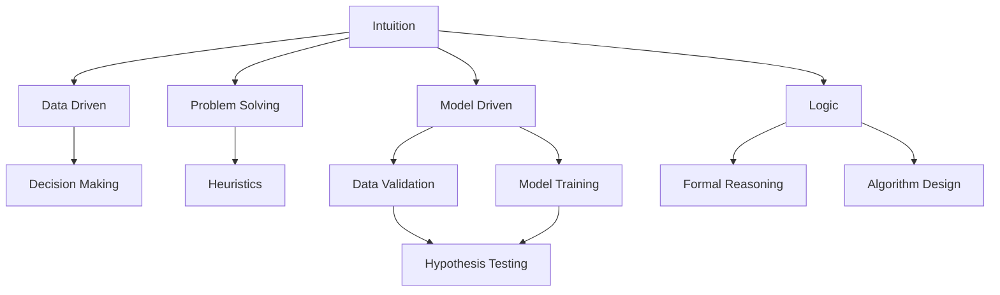

                 

## 1. 背景介绍

在人工智能和数据科学领域，直觉与逻辑的较量始终是一个引人入胜的话题。直觉，即通过经验或直觉对问题进行快速判断，常常在解决问题时显得更加灵活和快速。逻辑，则依赖于系统化的方法论和精确的计算，能够提供更加严密和可重复的推理路径。在数据驱动的时代，如何平衡直觉与逻辑的关系，成为了一个亟待解答的问题。本文将从多个维度探讨这一问题，并尝试找到其中的平衡点。

## 2. 核心概念与联系

### 2.1 核心概念概述

为了更好地理解直觉与逻辑在人工智能和数据科学中的应用，本节将介绍几个关键概念：

- **直觉**：基于个人经验、常识或先验知识，对问题进行快速、非正式的判断和决策的能力。直觉在数据分析和问题解决中具有重要的作用，尤其是在面对复杂问题时，能够提供快速且有效的解决方案。

- **逻辑**：通过形式化的方法和严谨的推理，对问题进行系统的分析和解决的能力。逻辑在人工智能和数据科学中扮演着重要的角色，尤其是数据模型训练和验证过程中，逻辑提供了严格的框架和可重复的推理路径。

- **数据驱动**：基于数据和统计分析进行决策和推理的能力。数据驱动方法强调数据的价值，通过数据分析和模型训练，从数据中提炼出有价值的知识和洞察力。

- **模型驱动**：基于模型和算法进行决策和推理的能力。模型驱动方法强调模型的准确性和可靠性，通过模型训练和验证，对问题进行精确的预测和分析。

这些概念之间的逻辑关系可以通过以下Mermaid流程图来展示：



这个流程图展示了几大核心概念之间的联系：

1. 直觉（A）在问题解决（D）和数据驱动（B）中起到启发作用。
2. 数据驱动（B）通过数据模型训练（H）和验证（G），提炼出有价值的知识和洞察力。
3. 模型驱动（F）强调模型的准确性和可靠性，通过模型训练和验证，对问题进行精确的预测和分析。
4. 逻辑（J）提供了系统的推理路径和严谨的算法设计（L），支持模型的训练和验证（G、H、I）。

这些概念共同构成了人工智能和数据科学的决策和推理框架，使得机器能够在面对复杂问题时，既能快速提供直觉判断，又能通过逻辑推理提供精确的分析。

## 3. 核心算法原理 & 具体操作步骤

### 3.1 算法原理概述

在人工智能和数据科学中，直觉与逻辑的结合通常通过数据驱动和模型驱动的模型训练和验证来实现。具体来说，数据驱动方法强调从数据中提炼出有价值的知识和洞察力，而模型驱动方法则侧重于通过模型和算法提供精确的预测和分析。这种结合的原理，可以总结如下：

1. **数据预处理**：通过对数据进行清洗、特征提取和标准化等预处理操作，将数据转化为模型可以处理的格式。
2. **模型训练**：通过选择合适的模型和算法，对预处理后的数据进行训练，得到一个能够对新数据进行预测或分类的模型。
3. **模型验证**：通过交叉验证、测试集验证等方法，评估模型的性能和泛化能力，确保模型在未知数据上的表现良好。
4. **模型应用**：将训练好的模型应用于实际问题，通过逻辑推理和直觉判断，提供准确的预测和决策支持。

### 3.2 算法步骤详解

数据驱动和模型驱动的结合通常包括以下关键步骤：

**Step 1: 数据收集与预处理**
- 收集相关领域的原始数据，并进行清洗、去重、缺失值处理等预处理操作，确保数据质量。
- 对数据进行特征提取，将原始数据转化为模型可以处理的格式。
- 对数据进行标准化处理，确保不同特征在模型中的重要性相等。

**Step 2: 模型选择与训练**
- 选择合适的数据驱动或模型驱动模型，如回归模型、分类模型、聚类模型等。
- 对模型进行训练，通过优化算法（如梯度下降、Adam等）更新模型参数，最小化损失函数。
- 使用交叉验证等技术评估模型性能，避免过拟合。

**Step 3: 模型验证与优化**
- 使用独立的测试集对模型进行验证，评估模型的泛化能力和性能。
- 根据验证结果调整模型参数和特征选择，进行模型优化。
- 使用对抗样本等技术提高模型的鲁棒性。

**Step 4: 模型应用与决策**
- 将训练好的模型应用于实际问题，通过逻辑推理和直觉判断，提供准确的预测和决策支持。
- 在应用过程中，不断收集反馈信息，优化模型和参数，提升模型性能。

### 3.3 算法优缺点

数据驱动和模型驱动的结合具有以下优点：
1. 能够将直觉和逻辑结合起来，提供更全面、更准确的决策支持。
2. 数据驱动能够提供丰富的数据支持，模型驱动能够提供精确的预测和分析。
3. 数据驱动和模型驱动的结合，可以处理复杂、多变的问题，提升决策的可靠性和有效性。

同时，该方法也存在一定的局限性：
1. 对数据质量要求高，数据预处理和特征选择对模型性能有重要影响。
2. 模型选择和训练需要专业知识，需要耗费大量时间和资源。
3. 模型过度依赖数据和算法，缺乏对外部环境变化的灵活应对。
4. 模型复杂度较高，难以进行实时推理和快速决策。

尽管存在这些局限性，但就目前而言，数据驱动和模型驱动的结合仍是大数据和人工智能应用的主流范式。未来相关研究的重点在于如何进一步降低数据依赖，提高模型的鲁棒性和实时性，同时兼顾可解释性和伦理安全性等因素。

### 3.4 算法应用领域

数据驱动和模型驱动的结合在人工智能和数据科学中具有广泛的应用场景：

- **金融风控**：通过数据驱动的方法，对客户行为和交易数据进行分析，构建风险模型。结合模型驱动的方法，对新客户和新交易进行风险评估和决策支持。
- **医疗诊断**：通过数据驱动的方法，对患者的症状和历史数据进行分析，构建诊断模型。结合模型驱动的方法，对新患者的症状进行快速诊断和决策支持。
- **电商推荐**：通过数据驱动的方法，对用户的浏览和购买数据进行分析，构建推荐模型。结合模型驱动的方法，对新用户和新商品进行推荐和决策支持。
- **自动驾驶**：通过数据驱动的方法，对车辆传感器数据进行分析，构建感知模型。结合模型驱动的方法，对车辆进行路径规划和决策支持。
- **智能客服**：通过数据驱动的方法，对客户问题和历史数据进行分析，构建知识图谱。结合模型驱动的方法，对新客户问题和需求进行快速响应和决策支持。

除了上述这些经典应用外，数据驱动和模型驱动的结合还被创新性地应用到更多场景中，如实时数据分析、智能合约、供应链优化等，为人工智能技术带来了全新的突破。

## 4. 数学模型和公式 & 详细讲解 & 举例说明

### 4.1 数学模型构建

在数据驱动和模型驱动的结合中，常用的数学模型包括回归模型、分类模型、聚类模型等。以回归模型为例，其数学模型构建如下：

假设输入数据为 $X = (x_1, x_2, ..., x_n)$，目标输出为 $y$，回归模型可以表示为：

$$
y = f(X) = \sum_{i=1}^{n} \theta_i x_i + \epsilon
$$

其中 $\theta_i$ 为模型参数，$\epsilon$ 为噪声项。通过最小化损失函数，优化模型参数，得到最优回归模型：

$$
\hat{y} = f_{\theta}(X) = \sum_{i=1}^{n} \hat{\theta_i} x_i
$$

### 4.2 公式推导过程

回归模型的推导过程如下：

1. **目标函数**：设定回归模型的目标函数为均方误差损失函数，表示为：

$$
L(\theta) = \frac{1}{N} \sum_{i=1}^{N} (y_i - f(X_i; \theta))^2
$$

2. **梯度下降**：通过梯度下降算法最小化目标函数，得到模型参数 $\theta$ 的更新公式：

$$
\theta_i \leftarrow \theta_i - \eta \frac{\partial L(\theta)}{\partial \theta_i}
$$

其中 $\eta$ 为学习率。

3. **最优解**：当目标函数的最小值达到时，得到最优模型参数 $\hat{\theta_i}$。

通过上述推导，我们可以看到回归模型的建立和优化过程，展示了数据驱动和模型驱动相结合的基本逻辑。

### 4.3 案例分析与讲解

以金融风控为例，展示数据驱动和模型驱动的结合：

**数据驱动**：
- 收集客户的交易记录、基本信息等数据。
- 对数据进行清洗和预处理，提取关键特征（如年龄、职业、交易金额等）。
- 通过逻辑回归、决策树等模型对数据进行训练，构建风控模型。

**模型驱动**：
- 通过对抗样本、交叉验证等技术，评估模型的泛化能力和性能。
- 结合逻辑推理和直觉判断，对新客户和新交易进行风险评估和决策支持。

在金融风控中，数据驱动提供了丰富的数据支持，模型驱动提供了精确的预测和分析，两者结合能够提升风险评估的准确性和可靠性。

## 5. 项目实践：代码实例和详细解释说明

### 5.1 开发环境搭建

在进行项目实践前，我们需要准备好开发环境。以下是使用Python进行Scikit-Learn开发的常见环境配置流程：

1. 安装Anaconda：从官网下载并安装Anaconda，用于创建独立的Python环境。

2. 创建并激活虚拟环境：
```bash
conda create -n scikit-learn-env python=3.8 
conda activate scikit-learn-env
```

3. 安装Scikit-Learn和其他相关库：
```bash
pip install scikit-learn numpy pandas matplotlib seaborn joblib
```

4. 安装TensorFlow（可选）：
```bash
pip install tensorflow
```

5. 安装Jupyter Notebook：
```bash
pip install jupyter notebook
```

完成上述步骤后，即可在`scikit-learn-env`环境中开始项目实践。

### 5.2 源代码详细实现

这里我们以回归分析为例，给出使用Scikit-Learn进行数据驱动的代码实现。

首先，定义数据集：

```python
import pandas as pd
from sklearn.model_selection import train_test_split
from sklearn.linear_model import LinearRegression

# 读取数据
data = pd.read_csv('data.csv')

# 定义特征和标签
X = data[['age', 'income', 'education']]
y = data['default']

# 划分训练集和测试集
X_train, X_test, y_train, y_test = train_test_split(X, y, test_size=0.2, random_state=42)
```

然后，定义模型并进行训练：

```python
# 定义线性回归模型
model = LinearRegression()

# 训练模型
model.fit(X_train, y_train)
```

接着，评估模型并进行预测：

```python
# 评估模型
y_pred = model.predict(X_test)

# 计算R平方值
r_squared = model.score(X_test, y_test)
print(f'R平方值: {r_squared:.2f}')

# 进行预测
new_data = [[40, 50000, 'Masters']]
new_pred = model.predict(new_data)
print(f'新数据的预测结果: {new_pred}')
```

以上就是使用Scikit-Learn进行回归分析的完整代码实现。可以看到，Scikit-Learn提供了简洁的API，使得回归分析的代码实现变得十分简便。

### 5.3 代码解读与分析

让我们再详细解读一下关键代码的实现细节：

**数据集定义**：
- 使用Pandas库读取数据集，并定义特征和标签。
- 使用train_test_split方法将数据集划分为训练集和测试集，保留20%的数据用于测试。

**模型定义和训练**：
- 定义线性回归模型，通过fit方法对训练集进行模型训练。

**模型评估和预测**：
- 使用score方法计算模型在测试集上的R平方值，评估模型性能。
- 使用predict方法对新数据进行预测。

**新数据预测**：
- 定义一个包含新数据特征的列表，使用predict方法对新数据进行预测。

通过上述代码实现，我们可以看到数据驱动和模型驱动的结合，通过Scikit-Learn库可以非常方便地实现。在实际应用中，开发者可以根据具体任务，选择合适的算法和库，进行数据驱动和模型驱动的结合，以解决实际问题。

## 6. 实际应用场景

### 6.1 金融风控

金融风控是数据驱动和模型驱动结合的经典应用场景。传统金融风控依赖于人工审查和经验判断，耗费大量时间和人力成本。而通过数据驱动和模型驱动的结合，金融风控系统可以实现自动化、智能化和实时化。

在实际应用中，可以通过收集客户的交易记录、基本信息等数据，构建客户画像和风险模型。使用数据驱动的方法，对客户行为进行分析和预测，识别潜在风险。结合模型驱动的方法，对新客户和新交易进行实时监控和风险评估，提供决策支持。

### 6.2 医疗诊断

医疗诊断是另一个数据驱动和模型驱动结合的重要领域。传统的医疗诊断依赖于医生的经验和直觉，存在较高的误诊和漏诊率。通过数据驱动和模型驱动的结合，医疗诊断系统可以实现高效、准确和可重复的诊断。

在实际应用中，可以通过收集患者的症状、病史等数据，构建医疗诊断模型。使用数据驱动的方法，对患者症状进行分析和预测，识别潜在疾病。结合模型驱动的方法，对新患者的症状进行快速诊断和决策支持，提升诊断的准确性和效率。

### 6.3 电商推荐

电商推荐系统是数据驱动和模型驱动结合的典型应用。传统的电商推荐依赖于人工推荐和经验判断，缺乏个性化和实时性。通过数据驱动和模型驱动的结合，电商推荐系统可以实现个性化、实时化和高效化。

在实际应用中，可以通过收集用户的浏览和购买数据，构建用户画像和推荐模型。使用数据驱动的方法，对用户行为进行分析和预测，推荐感兴趣的商品。结合模型驱动的方法，对新用户和新商品进行实时推荐和决策支持，提升推荐的效果和用户体验。

### 6.4 未来应用展望

随着数据驱动和模型驱动的结合不断深入，未来在人工智能和数据科学中，这一范式将得到更广泛的应用。

在智慧城市治理中，数据驱动和模型驱动的结合，可以实现实时监测和智能决策。通过收集城市事件、交通流量等数据，构建智慧城市模型，实时监测城市运行状态，提供决策支持。

在智能制造中，数据驱动和模型驱动的结合，可以实现智能生产和管理。通过收集设备运行数据和生产过程数据，构建智能制造模型，实时监测和优化生产过程，提升生产效率和产品质量。

在农业生产中，数据驱动和模型驱动的结合，可以实现精准农业和智能管理。通过收集土壤、气候、作物生长等数据，构建精准农业模型，实时监测和优化农业生产，提升农业生产效益。

除了上述这些经典应用外，数据驱动和模型驱动的结合，还将被创新性地应用到更多场景中，为人工智能技术带来新的突破。相信随着技术的不断演进，数据驱动和模型驱动的结合将在更多领域发挥重要作用，推动人工智能技术向更广泛的应用场景渗透。

## 7. 工具和资源推荐

### 7.1 学习资源推荐

为了帮助开发者系统掌握数据驱动和模型驱动的理论基础和实践技巧，这里推荐一些优质的学习资源：

1. 《Python数据科学手册》：由Jake VanderPlas撰写，全面介绍了Python在数据科学中的应用，涵盖数据处理、模型训练、可视化等内容。

2. 《机器学习实战》：由Peter Harrington撰写，提供丰富的案例和实践指导，帮助开发者快速上手机器学习。

3. 《深度学习入门》：由斋藤康毅撰写，介绍深度学习的原理和应用，涵盖数据预处理、模型训练、模型评估等内容。

4. 《Kaggle竞赛指南》：由Zachary Parthenia撰写，提供参加Kaggle竞赛的实战经验和技术指南，帮助开发者提升数据科学能力。

5. 《机器学习实战》（Python版）：由Peter Harrington撰写，提供丰富的案例和实践指导，帮助开发者快速上手机器学习。

6. 《Scikit-Learn实战》：由Lars Buitinck撰写，介绍Scikit-Learn库的使用方法和实践技巧，涵盖数据预处理、模型训练、模型评估等内容。

通过对这些资源的学习实践，相信你一定能够快速掌握数据驱动和模型驱动的理论基础和实践技巧，并用于解决实际的业务问题。

### 7.2 开发工具推荐

高效的开发离不开优秀的工具支持。以下是几款用于数据驱动和模型驱动开发常用的工具：

1. Python：作为数据科学和机器学习的主流编程语言，Python提供了丰富的库和工具支持，方便开发者进行数据处理和模型训练。

2. Scikit-Learn：一个基于Python的机器学习库，提供了丰富的模型和算法支持，涵盖回归、分类、聚类等常用模型。

3. TensorFlow：由Google主导开发的开源深度学习框架，提供了丰富的模型和工具支持，适合大规模工程应用。

4. PyTorch：由Facebook主导开发的开源深度学习框架，提供了灵活的计算图和模型支持，适合研究和开发。

5. Jupyter Notebook：一个交互式的开发环境，支持Python、R等语言，方便开发者进行数据处理和模型训练。

6. Weights & Biases：模型训练的实验跟踪工具，可以记录和可视化模型训练过程中的各项指标，方便对比和调优。

合理利用这些工具，可以显著提升数据驱动和模型驱动的开发效率，加快创新迭代的步伐。

### 7.3 相关论文推荐

数据驱动和模型驱动的研究源于学界的持续研究。以下是几篇奠基性的相关论文，推荐阅读：

1. 《机器学习》（周志华）：介绍机器学习的基本概念和算法，涵盖监督学习、非监督学习、半监督学习等内容。

2. 《深度学习》（Ian Goodfellow）：介绍深度学习的原理和应用，涵盖神经网络、优化算法、模型评估等内容。

3. 《数据科学实战》（Jake VanderPlas）：提供丰富的案例和实践指导，帮助开发者快速上手数据科学。

4. 《机器学习实战》（Peter Harrington）：提供丰富的案例和实践指导，帮助开发者快速上手机器学习。

5. 《深度学习入门》（斋藤康毅）：介绍深度学习的原理和应用，涵盖数据预处理、模型训练、模型评估等内容。

6. 《数据挖掘与统计学习》（Lars Buitinck）：介绍数据挖掘和统计学习的原理和应用，涵盖数据预处理、模型训练、模型评估等内容。

这些论文代表了大数据和人工智能研究的发展脉络。通过学习这些前沿成果，可以帮助研究者把握学科前进方向，激发更多的创新灵感。

## 8. 总结：未来发展趋势与挑战

### 8.1 总结

本文对数据驱动和模型驱动的结合进行了全面系统的介绍。首先阐述了数据驱动和模型驱动在人工智能和数据科学中的重要性，明确了直觉与逻辑在问题解决中的独特价值。其次，从原理到实践，详细讲解了数据驱动和模型驱动的数学模型和算法流程，给出了数据驱动和模型驱动结合的完整代码实例。同时，本文还广泛探讨了数据驱动和模型驱动在多个领域的应用前景，展示了数据驱动和模型驱动的巨大潜力。

通过本文的系统梳理，可以看到，数据驱动和模型驱动的结合在人工智能和数据科学中具有广阔的应用前景，极大地拓展了数据模型的应用边界，催生了更多的落地场景。数据驱动和模型驱动的结合，不仅能够提供丰富的数据支持，还能够通过模型和算法提供精确的预测和分析，成为人工智能和数据科学的重要范式。

### 8.2 未来发展趋势

展望未来，数据驱动和模型驱动的结合将呈现以下几个发展趋势：

1. 数据质量日益提升。随着数据采集技术的进步和数据标注方法的完善，数据质量将进一步提升，为数据驱动和模型驱动的结合提供更可靠的数据基础。

2. 模型复杂度不断降低。随着模型压缩、轻量化等技术的发展，模型的复杂度将不断降低，实现在低资源环境下的高效推理和实时决策。

3. 智能算法不断涌现。随着AI算法和模型的不停演进，更多的智能算法将涌现出来，进一步提升数据驱动和模型驱动的结合效果。

4. 数据与算法协同进化。随着数据驱动和模型驱动的不断结合，数据与算法将形成更加紧密的协同进化，共同推动人工智能技术的发展。

5. 跨领域应用不断拓展。随着数据驱动和模型驱动的结合技术不断发展，其在更多领域的应用将得到拓展，如智慧城市、智能制造、精准农业等。

以上趋势凸显了数据驱动和模型驱动的结合技术的广阔前景。这些方向的探索发展，必将进一步提升人工智能和数据科学的性能和应用范围，为人类生产生活方式带来深远影响。

### 8.3 面临的挑战

尽管数据驱动和模型驱动的结合技术已经取得了瞩目成就，但在迈向更加智能化、普适化应用的过程中，它仍面临着诸多挑战：

1. 数据质量瓶颈。数据驱动需要高质量的数据，数据采集和标注的成本较高，且数据质量容易受外部环境干扰。

2. 模型复杂度问题。随着模型复杂度的不断提升，模型的训练和推理成本也会增加，实时性和资源消耗成为瓶颈。

3. 模型解释性不足。当前模型驱动的输出缺乏可解释性，难以理解模型的决策过程和内部工作机制。

4. 安全性和隐私问题。数据驱动和模型驱动的结合依赖于大量的数据和模型训练，数据泄露和模型攻击成为潜在威胁。

5. 多领域应用问题。不同领域的业务需求和数据特征差异较大，数据驱动和模型驱动的结合方法需要针对不同领域进行定制化设计。

6. 资源限制问题。数据驱动和模型驱动的结合需要大量的计算资源和存储空间，如何高效利用资源成为重要问题。

正视数据驱动和模型驱动面临的这些挑战，积极应对并寻求突破，将是大数据和人工智能技术走向成熟的必由之路。相信随着学界和产业界的共同努力，这些挑战终将一一被克服，数据驱动和模型驱动的结合必将在构建智能系统和人机协同的智能时代中扮演越来越重要的角色。

### 8.4 研究展望

面对数据驱动和模型驱动所面临的种种挑战，未来的研究需要在以下几个方面寻求新的突破：

1. 探索更高效的数据采集和标注方法。降低数据采集和标注的成本，提高数据质量，为数据驱动和模型驱动的结合提供可靠的数据基础。

2. 开发更轻量级的模型。通过模型压缩、剪枝、量化等技术，降低模型的复杂度和资源消耗，提升模型的实时性和可部署性。

3. 引入更多智能算法。结合因果推断、强化学习等算法，增强数据驱动和模型驱动的结合效果，提升系统的智能性。

4. 加强模型可解释性。通过可解释性算法和模型可视化，提升数据驱动和模型驱动的结合模型的可解释性，帮助用户理解和信任模型的输出。

5. 引入伦理和安全约束。在数据驱动和模型驱动的结合过程中，引入伦理和安全约束，确保模型的公正性、透明性和安全性。

6. 开发跨领域的应用方法。针对不同领域的业务需求和数据特征，设计通用的数据驱动和模型驱动的结合方法，提升方法的普适性和可扩展性。

这些研究方向的探索，必将引领数据驱动和模型驱动的结合技术迈向更高的台阶，为构建安全、可靠、可解释、可控的智能系统铺平道路。面向未来，数据驱动和模型驱动的结合技术还需要与其他人工智能技术进行更深入的融合，如知识表示、因果推理、强化学习等，多路径协同发力，共同推动人工智能技术的发展。只有勇于创新、敢于突破，才能不断拓展数据驱动和模型驱动的边界，让智能技术更好地造福人类社会。

## 9. 附录：常见问题与解答

**Q1：数据驱动和模型驱动在实际应用中如何进行选择？**

A: 数据驱动和模型驱动的选择取决于具体问题和数据特征。当数据量较小且质量较高时，数据驱动方法更适用于快速获取初步见解和决策支持。当数据量较大且质量参差不齐时，模型驱动方法更适用于精确的预测和分析。在实际应用中，可以先使用数据驱动方法进行初步分析，然后结合模型驱动方法进行精确预测和决策支持。

**Q2：数据驱动和模型驱动的结合如何避免过拟合问题？**

A: 避免过拟合的关键在于数据和模型的合理选择和优化。数据驱动和模型驱动的结合中，数据预处理和特征选择对模型的泛化能力有重要影响。在数据驱动阶段，应尽量使用多种数据源和样本，避免数据集偏倚。在模型驱动阶段，应使用适当的正则化技术（如L2正则、Dropout等），避免模型过拟合。同时，可以通过交叉验证等技术，评估模型的泛化能力和性能。

**Q3：如何平衡数据驱动和模型驱动的结合？**

A: 数据驱动和模型驱动的平衡应根据具体问题和业务需求进行灵活调整。在实际应用中，可以先使用数据驱动方法获取初步见解和决策支持，然后结合模型驱动方法进行精确预测和分析。对于复杂问题，数据驱动和模型驱动的结合可以提供更全面、更准确的决策支持。对于简单问题，数据驱动方法即可满足需求。

**Q4：数据驱动和模型驱动的结合在实际应用中如何实现？**

A: 数据驱动和模型驱动的结合通常包括以下关键步骤：

1. 数据收集与预处理：收集相关领域的原始数据，并进行清洗、去重、缺失值处理等预处理操作。
2. 特征提取与选择：对数据进行特征提取和选择，将原始数据转化为模型可以处理的格式。
3. 模型选择与训练：选择合适的数据驱动或模型驱动模型，对预处理后的数据进行训练，得到一个能够对新数据进行预测或分类的模型。
4. 模型验证与优化：使用独立的测试集对模型进行验证，评估模型的泛化能力和性能。根据验证结果调整模型参数和特征选择，进行模型优化。
5. 模型应用与决策：将训练好的模型应用于实际问题，通过逻辑推理和直觉判断，提供准确的预测和决策支持。

合理利用这些步骤，可以最大限度地发挥数据驱动和模型驱动的结合效果，解决实际问题。

通过本文的系统梳理，可以看到，数据驱动和模型驱动的结合在人工智能和数据科学中具有广阔的应用前景，极大地拓展了数据模型的应用边界，催生了更多的落地场景。未来，伴随数据驱动和模型驱动技术的不断演进，相信人工智能和数据科学将在更广泛的应用领域发挥重要作用，深刻影响人类的生产生活方式。

---

作者：禅与计算机程序设计艺术 / Zen and the Art of Computer Programming

