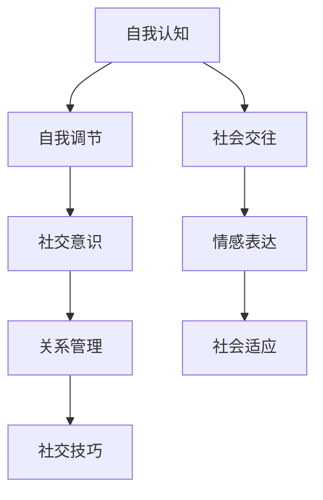

                 

## 1. 背景介绍

在当今社会，社交智慧（Social Intelligence）被视为一种关键能力，对于个人的成功和幸福、组织的效率与创新，乃至整个社会的和谐与进步，都具有深远的影响。特别是在数字化、网络化的浪潮下，社交智慧的应用场景日益广泛，包括但不限于社交媒体、在线教育、远程办公、智能客服、社交机器人等。如何提升社交智慧，特别是在大数据、人工智能等技术的支持下，成为当下学术界和产业界的热点问题。

本文旨在通过分析社交智慧的核心概念、关键技术和实际应用场景，探讨如何在人工智能技术的辅助下，实现对社交智慧的全面理解和提升。我们将深入探讨数据驱动的社交分析、情绪计算、情感智能、群体动力学等前沿技术，并结合具体案例，展示这些技术如何在实际应用中落地。

## 2. 核心概念与联系

### 2.1 核心概念概述

社交智慧（Social Intelligence, SI）是指个体在社交互动中所展现的感知、理解、表达和管理他人心理状态的能力，以及基于这些能力的策略制定和执行。这一概念最早由心理学家丹尼尔·戈尔曼（Daniel Goleman）在其著作《情商：为什么情商比智商更重要》中提出，强调了情商（Emotional Intelligence, EQ）在人际交往中的重要性。社交智慧包括五个主要方面：自我认知、自我调节、社交意识、关系管理和社交技巧。

### 2.2 核心概念原理和架构的 Mermaid 流程图



这个流程图展示了社交智慧的主要组成部分及其相互关系。自我认知和自我调节是个体内部过程，社交意识、关系管理和社交技巧则涉及个体与他人的互动，而情感表达和社会适应则是连接内外部过程的桥梁。

### 2.3 核心概念的联系与作用机制

社交智慧的核心在于理解和管理自我和他人的心理状态，以及在此基础上进行的社交互动和决策。这涉及到感知、认知、情感、行为等多个层面的综合运用，如图1所示。


在大数据和人工智能技术的支持下，社交智慧的分析和管理可以更加精准、高效。例如，通过对社交媒体数据的情感分析，可以理解用户的情感状态和需求，从而提供更个性化的服务。情感计算技术可以识别和响应用户的情感变化，提升用户体验。群体动力学模型可以预测群体行为，优化组织决策和团队合作。

## 3. 核心算法原理 & 具体操作步骤

### 3.1 算法原理概述

社交智慧的计算和分析，可以通过数据驱动的方式进行。其中，情感计算和情绪计算是两个核心技术。情感计算通过分析语音、文本、图像等数据，识别和量化情感状态。情绪计算则更进一步，结合情感计算的结果，模拟和推断情绪变化的原因和趋势。这些技术可以应用于社交媒体、智能客服、心理健康等领域。

### 3.2 算法步骤详解

#### 3.2.1 数据预处理

数据预处理是情感计算和情绪计算的基础。常用的预处理方法包括：

- 数据清洗：去除噪声、填补缺失值、标准化等。
- 特征提取：将文本、语音等非结构化数据转换为数值特征，如使用词袋模型、TF-IDF、词向量等。
- 数据标注：为数据添加情感或情绪标签，如正面、负面、中性、愤怒、悲伤等。

#### 3.2.2 情感计算

情感计算通过分析情感标签和情感强度，计算文本、语音、图像等数据的情感状态。常用的情感计算方法包括：

- 基于词典的方法：使用情感词典，将情感标签和情感强度映射到数值。
- 机器学习方法：使用分类或回归模型，训练情感识别模型。
- 深度学习方法：使用卷积神经网络（CNN）、循环神经网络（RNN）、Transformer等模型，进行情感状态分类和强度预测。

#### 3.2.3 情绪计算

情绪计算是在情感计算的基础上，结合社交场景和个体差异，模拟和推断情绪变化的原因和趋势。常用的情绪计算方法包括：

- 基于规则的方法：使用规则库，模拟情绪变化过程。
- 基于深度学习的方法：使用序列模型，如RNN、LSTM、Transformer，模拟情绪变化过程。

### 3.3 算法优缺点

#### 3.3.1 优点

- 数据驱动：情感计算和情绪计算可以处理大规模数据，提供深度洞察。
- 可解释性强：通过深度学习模型，可以理解数据背后的复杂关系和模式。
- 应用广泛：广泛应用于社交媒体、智能客服、心理健康等领域。

#### 3.3.2 缺点

- 数据依赖：情感计算和情绪计算依赖于数据质量和数量，数据不足时效果受限。
- 模型复杂：深度学习模型复杂度高，训练和推理耗时较长。
- 模型偏见：模型可能学习到数据中的偏见，导致输出结果不公平。

### 3.4 算法应用领域

情感计算和情绪计算在社交媒体、智能客服、心理健康、远程办公等多个领域都有广泛应用。以下以社交媒体情感分析为例，介绍情感计算的应用：

1. **情感趋势分析**：通过分析社交媒体上的文本数据，识别情感变化趋势，帮助企业了解用户情感变化，优化产品和服务。
2. **情感分类**：将用户评论、反馈等文本数据分类为正面、负面、中性等，帮助企业快速响应用户需求。
3. **情感预测**：结合用户历史数据和当前情感状态，预测用户未来的情感变化，提供个性化推荐和客服。
4. **情感趋势预测**：预测社交媒体上的情感趋势，帮助企业提前应对舆情变化，规避风险。

## 4. 数学模型和公式 & 详细讲解 & 举例说明

### 4.1 数学模型构建

情感计算和情绪计算的数学模型通常基于向量空间模型（VSM）、深度学习模型（如CNN、RNN、Transformer）等构建。以基于深度学习的情感分类模型为例，其数学模型可以表示为：

$$
\mathcal{M} = f(\mathbf{x}; \theta)
$$

其中，$\mathbf{x}$ 为输入数据，$\theta$ 为模型参数，$f$ 为模型函数。常用的情感分类模型包括卷积神经网络（CNN）和循环神经网络（RNN）。

### 4.2 公式推导过程

以基于CNN的情感分类模型为例，其公式推导过程如下：

1. 输入数据经过卷积层提取特征：
$$
\mathbf{H} = \mathcal{C}(\mathbf{x}; \omega)
$$
其中，$\mathcal{C}$ 为卷积操作，$\omega$ 为卷积核参数。

2. 特征经过池化层降维：
$$
\mathbf{h} = \mathcal{P}(\mathbf{H})
$$

3. 池化后的特征通过全连接层输出情感分类结果：
$$
y = \mathcal{F}(\mathbf{h}; \beta)
$$
其中，$\mathcal{F}$ 为全连接操作，$\beta$ 为全连接层参数。

### 4.3 案例分析与讲解

以情感分类模型在社交媒体情感分析中的应用为例，其具体实现步骤如下：

1. 数据预处理：清洗和标准化社交媒体数据，提取文本特征。
2. 情感计算：使用情感词典或深度学习模型，计算每个文本的情感强度和情感标签。
3. 模型训练：使用标注好的情感数据，训练情感分类模型。
4. 模型评估：使用验证集和测试集评估模型性能，优化模型参数。
5. 情感预测：使用训练好的模型，对新的社交媒体数据进行情感分类。

## 5. 项目实践：代码实例和详细解释说明

### 5.1 开发环境搭建

- **Python环境**：安装Anaconda，创建虚拟环境。
- **深度学习框架**：安装TensorFlow或PyTorch。
- **数据预处理工具**：安装NLTK、spaCy等自然语言处理库。
- **情感词典**：使用VADER（Valence Aware Dictionary and sEntiment Reasoner）等情感词典。
- **深度学习框架**：使用Keras或PyTorch构建情感分类模型。

### 5.2 源代码详细实现

```python
import tensorflow as tf
from tensorflow.keras import layers, models
from tensorflow.keras.preprocessing.text import Tokenizer
from tensorflow.keras.preprocessing.sequence import pad_sequences
import numpy as np
import nltk
from nltk.corpus import vader_lexicon

# 情感词典
nltk.download('vader_lexicon')
vader = vader_lexicon.PolarityLexicon()

# 数据预处理
data = load_data()
texts = data['texts']
labels = data['labels']
tokenizer = Tokenizer(oov_token='<OOV>')
tokenizer.fit_on_texts(texts)
sequences = tokenizer.texts_to_sequences(texts)
sequences = pad_sequences(sequences, maxlen=100)
labels = np.array(labels)

# 模型构建
model = models.Sequential([
    layers.Embedding(len(tokenizer.word_index) + 1, 128, input_length=100),
    layers.Conv1D(64, 5, activation='relu'),
    layers.MaxPooling1D(4),
    layers.Conv1D(64, 5, activation='relu'),
    layers.MaxPooling1D(4),
    layers.Conv1D(64, 5, activation='relu'),
    layers.MaxPooling1D(4),
    layers.Flatten(),
    layers.Dense(64, activation='relu'),
    layers.Dense(1, activation='sigmoid')
])

# 模型训练
model.compile(optimizer='adam', loss='binary_crossentropy', metrics=['accuracy'])
model.fit(sequences, labels, epochs=10, validation_split=0.2)

# 模型评估
loss, acc = model.evaluate(sequences_val, labels_val)
print(f'Validation loss: {loss:.4f}')
print(f'Validation accuracy: {acc:.4f}')

# 情感预测
new_texts = ['This movie is awesome!', 'I hate this movie.']
new_sequences = tokenizer.texts_to_sequences(new_texts)
new_sequences = pad_sequences(new_sequences, maxlen=100)
preds = model.predict(new_sequences)
print(preds)
```

### 5.3 代码解读与分析

- **数据预处理**：使用NLTK库中的VADER情感词典，计算每个文本的情感强度和情感标签。
- **模型构建**：使用Keras库构建卷积神经网络模型，使用Embedding层进行文本特征提取，卷积层和池化层提取特征，全连接层输出情感分类结果。
- **模型训练**：使用标注好的情感数据训练模型，设置Adam优化器和二元交叉熵损失函数。
- **模型评估**：在验证集上评估模型性能，输出损失和准确率。
- **情感预测**：使用训练好的模型对新的社交媒体数据进行情感分类预测。

## 6. 实际应用场景

### 6.1 智能客服系统

智能客服系统可以通过情感计算和情绪计算，提高用户体验和响应效率。具体而言，可以通过分析客户的语音和文本数据，识别客户情感状态，提供个性化的服务和解决方案。例如，使用语音情感识别技术，可以实时监测客户情绪变化，及时调整客服策略。使用文本情感分类技术，可以分析客户反馈，优化客服流程和产品服务。

### 6.2 心理健康评估

心理健康评估可以通过情绪计算和情感分析，帮助个体和专业人士了解心理健康状态。具体而言，可以通过分析用户的社交媒体数据和电子邮件，识别情感变化趋势和情绪状态，预测心理健康风险。例如，使用情绪计算技术，可以监测用户情绪变化，及时发现异常情况。使用情感分类技术，可以分析用户的情感变化，提供心理健康建议。

### 6.3 远程办公协作

远程办公协作可以通过情感计算和群体动力学，提高团队合作效率和沟通效果。具体而言，可以通过分析团队成员的沟通数据，识别情感状态和情绪变化，优化沟通方式和团队协作。例如，使用情感分类技术，可以分析团队成员的情感状态，提升沟通效率。使用群体动力学模型，可以预测团队行为，优化团队决策和合作。

### 6.4 未来应用展望

未来，社交智慧的计算和分析将更加精准、高效。情感计算和情绪计算技术将在更多场景中得到应用，为个体和组织的决策和行为提供科学依据。随着数据技术的不断进步，社交智慧的计算和分析将更加深入和全面，有助于构建更加智能、和谐的社会。

## 7. 工具和资源推荐

### 7.1 学习资源推荐

- **《情感计算：理论、算法与应用》**：由张伟平教授著，系统介绍了情感计算的理论基础和应用实例。
- **《情绪计算：理论与应用》**：由张伟平教授著，全面介绍了情绪计算的理论框架和应用技术。
- **《自然语言处理综述》**：由Jurgen Schmid.de等著，系统综述了自然语言处理的基本概念和技术。
- **Coursera《情感分析与情感计算》**：由David Evans等讲授，介绍情感分析的基本方法和应用场景。
- **Kaggle数据竞赛**：参加Kaggle的情感分类和情绪分析竞赛，提高实践能力和模型评估能力。

### 7.2 开发工具推荐

- **Python**：Python是数据科学和机器学习的主流语言，支持大量开源库和框架。
- **TensorFlow**：TensorFlow是深度学习的主流框架，支持分布式训练和模型部署。
- **PyTorch**：PyTorch是深度学习的另一个主流框架，支持动态图和GPU加速。
- **NLTK**：NLTK是自然语言处理的基本库，支持文本预处理和情感分析。
- **spaCy**：spaCy是自然语言处理的高性能库，支持实体识别、情感分析等任务。

### 7.3 相关论文推荐

- **"Opinion Mining and Sentiment Analysis: A Survey"**：由Gyves Adam和Lilian Rose评价，全面综述了情感分析的方法和应用。
- **"Sentiment Analysis Using Machine Learning Techniques"**：由Saifullah Khan等著，介绍机器学习在情感分析中的应用。
- **"A Survey on Sentiment Analysis and Opinion Mining"**：由Shaoqing Xu等著，综述了情感分析的最新进展和应用。

## 8. 总结：未来发展趋势与挑战

### 8.1 研究成果总结

社交智慧的计算和分析在大数据和人工智能技术的支持下，取得了显著进展。情感计算和情绪计算技术已经在社交媒体、智能客服、心理健康等领域得到广泛应用。未来，随着数据技术的不断进步，社交智慧的计算和分析将更加深入和全面，有助于构建更加智能、和谐的社会。

### 8.2 未来发展趋势

未来，社交智慧的计算和分析将呈现以下几个发展趋势：

1. **多模态情感计算**：结合文本、语音、图像等多模态数据，进行更全面、精准的情感和情绪计算。
2. **实时情感分析**：通过流式计算和大数据技术，实现实时情感分析，及时发现情感变化趋势。
3. **情感模拟与推断**：结合社会心理学理论，模拟和推断情感变化的原因和趋势，提高情感计算的准确性。
4. **跨文化情感分析**：结合文化差异和语言特点，进行跨文化情感分析，提升情感计算的普适性。
5. **情感计算与心理健康**：结合心理学和神经科学，研究情感计算对心理健康的影响，提供个性化心理健康服务。

### 8.3 面临的挑战

尽管社交智慧的计算和分析取得了显著进展，但在实际应用中仍面临诸多挑战：

1. **数据质量**：情感计算和情绪计算依赖于数据质量，数据偏差和噪声会影响模型的性能。
2. **模型复杂度**：深度学习模型复杂度高，训练和推理耗时较长，需要高效的计算资源。
3. **模型偏见**：模型可能学习到数据中的偏见，导致输出结果不公平。
4. **隐私保护**：情感计算和情绪计算需要处理大量敏感数据，隐私保护是一个重要问题。
5. **跨领域应用**：不同领域的数据和场景差异较大，需要针对性地开发情感计算和情绪计算模型。

### 8.4 研究展望

未来，社交智慧的计算和分析需要从以下几个方面进行突破：

1. **数据增强**：通过数据增强技术，提高情感计算和情绪计算的数据质量。
2. **模型优化**：通过模型压缩和优化，提高情感计算和情绪计算的效率。
3. **隐私保护**：结合差分隐私和联邦学习等技术，保护数据隐私。
4. **跨领域应用**：针对不同领域的数据和场景，开发适用于特定领域的情感计算和情绪计算模型。
5. **跨学科融合**：结合心理学、神经科学、社会学等学科知识，提升情感计算和情绪计算的科学性和普适性。

## 9. 附录：常见问题与解答

**Q1: 什么是情感计算和情绪计算？**

A: 情感计算和情绪计算是利用人工智能技术对情感和情绪进行识别、模拟和推断的过程。情感计算主要应用于社交媒体、智能客服等领域，通过分析文本和语音数据，识别情感状态和情感强度。情绪计算则更进一步，模拟和推断情绪变化的原因和趋势，广泛应用于心理健康、远程办公等领域。

**Q2: 如何处理情感计算和情绪计算中的数据偏差问题？**

A: 数据偏差是情感计算和情绪计算中常见的问题，可以通过以下方法解决：

1. 数据清洗：去除噪声和异常值，确保数据质量。
2. 数据增强：通过数据增强技术，扩充训练集，减少数据偏差。
3. 多模态融合：结合文本、语音、图像等多模态数据，综合分析情感和情绪状态。
4. 模型优化：使用公平性约束的模型优化方法，减少模型偏见。

**Q3: 情感计算和情绪计算的模型有哪些？**

A: 情感计算和情绪计算的模型包括但不限于：

1. 基于词典的方法：使用情感词典，将情感标签和情感强度映射到数值。
2. 机器学习方法：使用分类或回归模型，训练情感识别模型。
3. 深度学习方法：使用卷积神经网络（CNN）、循环神经网络（RNN）、Transformer等模型，进行情感状态分类和强度预测。

**Q4: 情感计算和情绪计算在实际应用中有哪些挑战？**

A: 情感计算和情绪计算在实际应用中面临以下挑战：

1. 数据依赖：情感计算和情绪计算依赖于数据质量和数量，数据不足时效果受限。
2. 模型复杂：深度学习模型复杂度高，训练和推理耗时较长。
3. 模型偏见：模型可能学习到数据中的偏见，导致输出结果不公平。
4. 隐私保护：情感计算和情绪计算需要处理大量敏感数据，隐私保护是一个重要问题。

**Q5: 未来情感计算和情绪计算的研究方向有哪些？**

A: 未来情感计算和情绪计算的研究方向包括：

1. 多模态情感计算：结合文本、语音、图像等多模态数据，进行更全面、精准的情感和情绪计算。
2. 实时情感分析：通过流式计算和大数据技术，实现实时情感分析，及时发现情感变化趋势。
3. 情感模拟与推断：结合社会心理学理论，模拟和推断情感变化的原因和趋势，提高情感计算的准确性。
4. 跨文化情感分析：结合文化差异和语言特点，进行跨文化情感分析，提升情感计算的普适性。
5. 情感计算与心理健康：结合心理学和神经科学，研究情感计算对心理健康的影响，提供个性化心理健康服务。

---

作者：禅与计算机程序设计艺术 / Zen and the Art of Computer Programming

