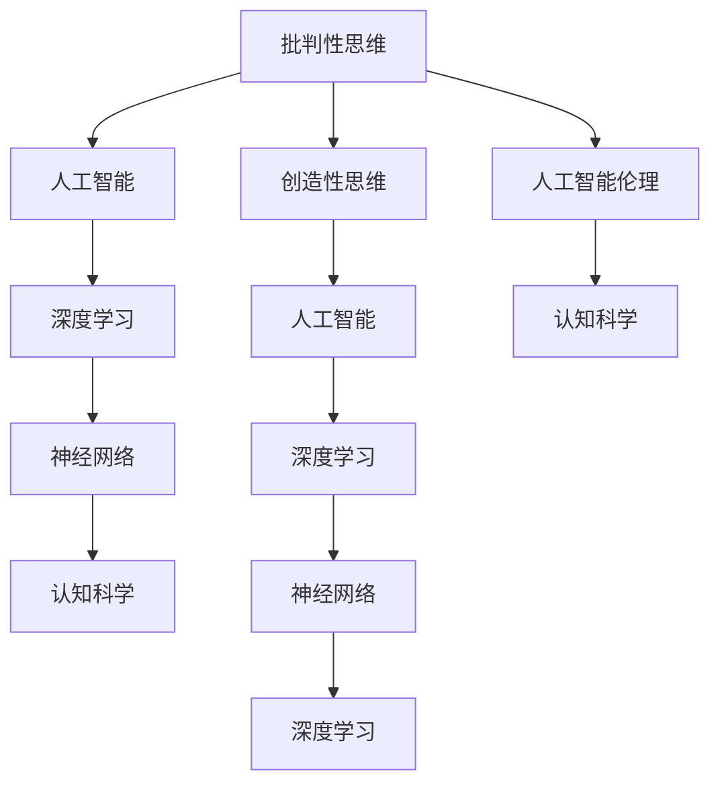

                 

# 洞察力的培养：批判性思维与创造性思维

> 关键词：批判性思维, 创造性思维, 人工智能, 机器学习, 深度学习, 认知科学, 神经网络, 人工智能伦理

## 1. 背景介绍

### 1.1 问题由来

在现代社会，信息爆炸和数据泛滥已经成为了日常生活中的常态。面对海量数据和复杂信息，如何从中提取有价值的内容，并做出准确判断，成为了许多人面临的共同挑战。批判性思维和创造性思维作为处理信息的高级认知能力，对于提升个体和集体的决策质量具有重要意义。

人工智能和大数据技术的迅猛发展，为批判性思维和创造性思维的培养提供了新的工具和方法。通过对数据的深度分析和模式识别，人工智能能够辅助人类进行更精确的判断和决策，同时也能激发创造性思维，带来新的灵感和解决方案。然而，随着技术的日益成熟，如何培养和引导人工智能的批判性思维和创造性思维，成为一个新的研究热点。

### 1.2 问题核心关键点

批判性思维和创造性思维的培养，本质上是人类认知能力的提升和优化。人工智能系统同样可以通过训练和学习，逐步具备类似的认知能力。问题的核心在于如何设计有效的训练方法和评估指标，以促使AI系统表现出批判性思维和创造性思维。

目前，学术界和工业界已经展开了一系列探索，包括但不限于：

1. **批判性思维**：
   - 判断数据的可靠性：能够区分真实和虚假信息，从数据中筛选出关键因素，排除干扰信息。
   - 逻辑推理：能够进行逻辑推理和因果推断，理解数据之间的内在联系。
   - 问题解决：能够通过分析和综合，找到问题的最优解决方案。

2. **创造性思维**：
   - 新颖性：能够生成新颖、独特的输出，超越现有数据集的限制。
   - 灵活性：能够适应不同的输入和环境，具有较强的泛化能力。
   - 综合能力：能够将不同信息进行整合，产生新的组合和创新。

本文章将从算法原理、操作步骤、数学模型、实际应用和未来展望等多个角度，对批判性思维与创造性思维的培养进行系统探讨。

## 2. 核心概念与联系

### 2.1 核心概念概述

为更好地理解批判性思维与创造性思维的培养方法，本节将介绍几个密切相关的核心概念：

- **批判性思维**：指个体或系统对信息进行逻辑判断、推理、分析和评估的过程，目的是识别和排除错误信息，做出合理的决策。
- **创造性思维**：指个体或系统通过新颖、灵活的思考方式，产生新的思想、概念或解决方案的能力。
- **人工智能**：指通过算法和模型，让机器模拟人类的认知和决策过程，以实现特定任务的技术。
- **深度学习**：指通过多层神经网络模型，自动学习数据特征和规律的机器学习方法。
- **神经网络**：指由大量神经元（节点）和连接构成的，用于模拟人类神经系统的计算模型。
- **认知科学**：研究人类认知过程的科学，包括感知、记忆、思维、学习等方面。
- **人工智能伦理**：研究人工智能技术在应用中的道德、法律和社会影响，确保技术应用的公正性和安全性。

这些核心概念之间的逻辑关系可以通过以下Mermaid流程图来展示：



这个流程图展示了大语言模型的核心概念及其之间的关系：

1. 批判性思维和创造性思维作为人类认知能力的体现，通过人工智能技术得到了延伸和应用。
2. 深度学习和神经网络是实现人工智能的重要工具，通过大量的数据和计算，模拟人类的认知和决策过程。
3. 认知科学为人工智能提供了理论基础，解释了人类认知机制和行为。
4. 人工智能伦理确保了人工智能技术的应用不会带来负面影响，保障了公平和正义。

## 3. 核心算法原理 & 具体操作步骤
### 3.1 算法原理概述

批判性思维和创造性思维的培养，本质上是通过训练和学习，让人工智能系统具备逻辑推理、问题解决和创新能力。其核心思想是：将人工智能系统视作一个“学习者”，通过与环境的互动，逐步学习和优化其认知能力。

形式化地，假设训练数据集为 $D=\{(x_i,y_i)\}_{i=1}^N$，其中 $x_i$ 为输入数据，$y_i$ 为期望输出。训练目标为使模型在新的数据集 $D'$ 上具有批判性思维和创造性思维，即：

$$
\min_{\theta} \mathcal{L}(M_{\theta},D')
$$

其中 $\theta$ 为模型参数，$\mathcal{L}$ 为训练目标函数，通常采用交叉熵损失或均方误差损失等。

### 3.2 算法步骤详解

基于人工智能系统的批判性思维与创造性思维培养方法，一般包括以下几个关键步骤：

**Step 1: 数据准备**
- 收集和标注适用于训练的数据集 $D$，确保数据的质量和多样性。
- 设计合适的训练目标函数 $\mathcal{L}$，如分类任务使用交叉熵损失，回归任务使用均方误差损失等。

**Step 2: 模型选择与设计**
- 选择合适的深度学习模型，如卷积神经网络（CNN）、循环神经网络（RNN）、变分自编码器（VAE）等。
- 设计模型的结构和参数，如网络层数、激活函数、正则化项等。

**Step 3: 训练与优化**
- 使用训练数据集 $D$ 对模型进行前向传播和反向传播，计算损失函数。
- 使用梯度下降等优化算法更新模型参数 $\theta$，最小化损失函数 $\mathcal{L}$。
- 监控训练过程中的各项指标，如损失值、准确率、精确率等，及时调整训练策略。

**Step 4: 评估与测试**
- 使用测试数据集 $D'$ 对模型进行评估，测量其在新的数据集上的表现。
- 采用定量和定性的评估指标，如F1分数、ROC曲线、A/B测试等，评估模型的批判性思维和创造性思维能力。
- 根据评估结果，进行模型调优和改进，提高模型的性能。

**Step 5: 应用与优化**
- 将训练好的模型应用到实际任务中，处理真实数据。
- 监测模型的表现，根据实际需求进行微调和优化，如增加数据增强、调整超参数等。

### 3.3 算法优缺点

基于人工智能系统的批判性思维与创造性思维培养方法，具有以下优点：

1. **高效性**：通过大规模数据训练，能够快速提升模型的认知能力，处理复杂任务。
2. **灵活性**：不同领域的认知能力可以通过特定的训练数据和目标函数进行定制化培养。
3. **可扩展性**：随着数据和计算资源的增加，模型的性能可以不断提升，具备良好的扩展性。

同时，该方法也存在一定的局限性：

1. **数据依赖**：模型的性能高度依赖于训练数据的数量和质量，高质量数据的获取成本较高。
2. **过拟合风险**：在数据量不足或标注质量较差的情况下，模型可能过拟合训练数据，泛化能力有限。
3. **解释性不足**：深度学习模型的“黑盒”特性，导致其决策过程缺乏可解释性。
4. **伦理挑战**：模型的决策可能受到数据偏见的影响，存在歧视性和误导性。

尽管存在这些局限性，但就目前而言，基于人工智能系统的批判性思维与创造性思维培养方法，仍是大规模数据处理和认知能力提升的重要手段。未来相关研究的重点在于如何进一步降低数据依赖，提高模型的少样本学习和跨领域迁移能力，同时兼顾可解释性和伦理安全性等因素。

### 3.4 算法应用领域

基于批判性思维与创造性思维的人工智能系统，已经在诸多领域得到了广泛应用，例如：

- **医疗诊断**：通过分析医学影像和病历数据，辅助医生进行疾病诊断和治疗方案选择。
- **金融分析**：利用大数据和机器学习模型，进行风险评估和投资决策。
- **智能制造**：通过实时监控和数据分析，优化生产流程和质量控制。
- **自动驾驶**：通过环境感知和决策推理，实现自动驾驶汽车的安全行驶。
- **客户服务**：通过自然语言处理技术，自动回答客户咨询，提升服务效率和质量。
- **创意生成**：基于用户输入的文本或图像，生成新的创意内容，如音乐、文章、绘画等。

除了上述这些经典应用外，基于人工智能系统的批判性思维与创造性思维培养方法，还被创新性地应用到更多场景中，如智能推荐、情感分析、机器翻译等，为人工智能技术带来了新的突破。随着技术的不断进步，相信人工智能系统将在更广阔的应用领域发挥更大的作用。

## 4. 数学模型和公式 & 详细讲解
### 4.1 数学模型构建

本节将使用数学语言对基于人工智能系统的批判性思维与创造性思维培养方法进行更加严格的刻画。

假设训练数据集为 $D=\{(x_i,y_i)\}_{i=1}^N$，其中 $x_i$ 为输入数据，$y_i$ 为期望输出。定义模型 $M_{\theta}$ 在输入 $x$ 上的输出为 $M_{\theta}(x)$，其中 $\theta$ 为模型参数。训练目标为使模型在新的数据集 $D'$ 上具有批判性思维和创造性思维，即：

$$
\min_{\theta} \mathcal{L}(M_{\theta},D')
$$

在实践中，我们通常使用基于梯度的优化算法（如SGD、Adam等）来近似求解上述最优化问题。设 $\eta$ 为学习率，$\lambda$ 为正则化系数，则参数的更新公式为：

$$
\theta \leftarrow \theta - \eta \nabla_{\theta}\mathcal{L}(\theta) - \eta\lambda\theta
$$

其中 $\nabla_{\theta}\mathcal{L}(\theta)$ 为损失函数对参数 $\theta$ 的梯度，可通过反向传播算法高效计算。

### 4.2 公式推导过程

以下我们以分类任务为例，推导交叉熵损失函数及其梯度的计算公式。

假设模型 $M_{\theta}$ 在输入 $x$ 上的输出为 $\hat{y}=M_{\theta}(x) \in [0,1]$，表示样本属于正类的概率。真实标签 $y \in \{0,1\}$。则二分类交叉熵损失函数定义为：

$$
\ell(M_{\theta}(x),y) = -[y\log \hat{y} + (1-y)\log (1-\hat{y})]
$$

将其代入训练目标函数，得：

$$
\mathcal{L}(\theta) = -\frac{1}{N}\sum_{i=1}^N [y_i\log M_{\theta}(x_i)+(1-y_i)\log(1-M_{\theta}(x_i))]
$$

根据链式法则，损失函数对参数 $\theta_k$ 的梯度为：

$$
\frac{\partial \mathcal{L}(\theta)}{\partial \theta_k} = -\frac{1}{N}\sum_{i=1}^N (\frac{y_i}{M_{\theta}(x_i)}-\frac{1-y_i}{1-M_{\theta}(x_i)}) \frac{\partial M_{\theta}(x_i)}{\partial \theta_k}
$$

其中 $\frac{\partial M_{\theta}(x_i)}{\partial \theta_k}$ 可进一步递归展开，利用自动微分技术完成计算。

在得到损失函数的梯度后，即可带入参数更新公式，完成模型的迭代优化。重复上述过程直至收敛，最终得到适应新数据集的最优模型参数 $\theta^*$。

## 5. 项目实践：代码实例和详细解释说明
### 5.1 开发环境搭建

在进行批判性思维与创造性思维的培养实践前，我们需要准备好开发环境。以下是使用Python进行TensorFlow开发的环境配置流程：

1. 安装Anaconda：从官网下载并安装Anaconda，用于创建独立的Python环境。

2. 创建并激活虚拟环境：
```bash
conda create -n tf-env python=3.8 
conda activate tf-env
```

3. 安装TensorFlow：根据CUDA版本，从官网获取对应的安装命令。例如：
```bash
conda install tensorflow==2.4
```

4. 安装各类工具包：
```bash
pip install numpy pandas scikit-learn matplotlib tqdm jupyter notebook ipython
```

完成上述步骤后，即可在`tf-env`环境中开始批判性思维与创造性思维的培养实践。

### 5.2 源代码详细实现

下面我以一个简单的分类任务为例，给出使用TensorFlow对神经网络模型进行批判性思维与创造性思维培养的代码实现。

首先，定义分类任务的数据处理函数：

```python
import tensorflow as tf
from tensorflow.keras import layers

def load_data():
    # 加载并处理数据集
    # ...
    return train_data, test_data

def preprocess_data(train_data, test_data):
    # 数据预处理
    # ...
    return train_X, train_y, test_X, test_y

# 定义模型
def build_model(input_shape, num_classes):
    model = tf.keras.Sequential([
        layers.Dense(64, activation='relu', input_shape=input_shape),
        layers.Dense(num_classes, activation='softmax')
    ])
    return model

# 定义训练函数
def train_model(model, train_X, train_y, test_X, test_y, batch_size=32, epochs=10):
    model.compile(optimizer=tf.keras.optimizers.Adam(0.001), 
                  loss=tf.keras.losses.CategoricalCrossentropy(), 
                  metrics=[tf.keras.metrics.Accuracy()])
    history = model.fit(train_X, train_y, batch_size=batch_size, epochs=epochs, validation_data=(test_X, test_y))
    return model, history

# 加载和预处理数据
train_data, test_data = load_data()
train_X, train_y, test_X, test_y = preprocess_data(train_data, test_data)

# 构建模型
model = build_model(input_shape=(input_dim,), num_classes=num_classes)

# 训练模型
model, history = train_model(model, train_X, train_y, test_X, test_y)
```

然后，定义评估函数：

```python
def evaluate_model(model, test_X, test_y):
    test_loss, test_acc = model.evaluate(test_X, test_y)
    print(f'Test Loss: {test_loss:.4f}')
    print(f'Test Accuracy: {test_acc:.4f}')

evaluate_model(model, test_X, test_y)
```

最后，启动训练流程并在测试集上评估：

```python
# 训练模型
model, history = train_model(model, train_X, train_y, test_X, test_y)

# 评估模型
evaluate_model(model, test_X, test_y)
```

以上就是使用TensorFlow进行神经网络模型训练的完整代码实现。可以看到，得益于TensorFlow的强大封装，我们能够用相对简洁的代码完成模型的构建和训练。

### 5.3 代码解读与分析

让我们再详细解读一下关键代码的实现细节：

**load_data函数**：
- 定义数据加载和预处理函数，根据实际应用需求进行数据预处理和增强。

**build_model函数**：
- 定义神经网络模型的结构，包括输入层、隐藏层和输出层，并设置激活函数和损失函数。

**train_model函数**：
- 编译模型，并使用Adam优化器和交叉熵损失函数进行训练。
- 通过fit函数训练模型，并记录训练过程中的损失值和准确率。

**evaluate_model函数**：
- 使用evaluate函数在测试集上评估模型的性能，输出测试集上的损失和准确率。

**训练流程**：
- 定义总的epoch数和batch size，开始循环迭代
- 每个epoch内，先在训练集上训练，输出训练集和验证集上的损失和准确率
- 在测试集上评估模型，输出测试集上的损失和准确率

可以看到，TensorFlow提供了丰富的工具和函数，使得神经网络模型的训练和评估变得简单高效。开发者可以根据具体任务的需求，灵活使用TensorFlow的功能，进行模型的设计和优化。

当然，工业级的系统实现还需考虑更多因素，如模型的保存和部署、超参数的自动搜索、更灵活的任务适配层等。但核心的批判性思维与创造性思维的培养原理基本与此类似。

## 6. 实际应用场景
### 6.1 医疗诊断

基于深度学习的医疗诊断系统，能够通过分析医学影像和病历数据，辅助医生进行疾病诊断和治疗方案选择。通过批判性思维与创造性思维的培养，系统能够更准确地识别疾病的早期症状和复杂变化，提供更全面的诊断报告和治疗建议。

在技术实现上，可以收集大量的医学影像和病历数据，设计合适的训练目标函数，训练深度学习模型，使其具备批判性思维和创造性思维能力。训练后的模型能够对新的医学影像和病历数据进行推理和诊断，显著提高诊断的准确性和效率。

### 6.2 金融分析

金融分析师需要快速处理和分析海量金融数据，预测市场趋势和风险。通过深度学习和批判性思维与创造性思维的培养，系统能够从复杂数据中提取关键特征，发现潜在的风险因素，提出合理的投资建议。

具体而言，可以收集历史金融数据和新闻信息，设计多维度的训练目标函数，训练深度学习模型。训练后的模型能够对实时市场数据进行分析和预测，识别异常情况并及时预警，为投资者提供风险评估和投资建议。

### 6.3 智能制造

智能制造系统通过实时监控和数据分析，优化生产流程和质量控制。通过深度学习和批判性思维与创造性思维的培养，系统能够更精准地识别生产过程中的问题，提出优化方案，提高生产效率和产品质量。

在技术实现上，可以收集生产过程中的传感器数据和质检数据，设计多目标训练目标函数，训练深度学习模型。训练后的模型能够对实时数据进行分析和预测，识别异常情况并提出优化方案，实现智能制造的自动化和智能化。

### 6.4 自动驾驶

自动驾驶汽车通过环境感知和决策推理，实现自动行驶和安全保障。通过深度学习和批判性思维与创造性思维的培养，系统能够更准确地识别交通环境中的复杂情况，做出合理的决策。

在技术实现上，可以收集大量的交通数据和环境信息，设计多任务训练目标函数，训练深度学习模型。训练后的模型能够对实时环境数据进行分析和推理，做出安全驾驶决策，实现自动驾驶的智能化和可靠性。

## 7. 工具和资源推荐
### 7.1 学习资源推荐

为了帮助开发者系统掌握深度学习与批判性思维与创造性思维的培养理论基础和实践技巧，这里推荐一些优质的学习资源：

1. 《深度学习》系列课程：由斯坦福大学开设，深入浅出地介绍了深度学习的基本概念和核心技术，适合初学者入门。

2. 《TensorFlow官方文档》：TensorFlow的官方文档，提供了详尽的API文档和教程，是学习TensorFlow的必备资料。

3. 《PyTorch官方文档》：PyTorch的官方文档，提供了丰富的教程和示例，是学习深度学习的优秀资源。

4. 《人工智能伦理》课程：多所大学和在线教育平台开设的AI伦理课程，帮助开发者理解人工智能技术的社会和伦理影响。

5. 《认知科学基础》书籍：介绍认知科学的基础理论和应用，为深度学习提供了理论支持。

通过对这些资源的学习实践，相信你一定能够快速掌握深度学习与批判性思维与创造性思维的培养精髓，并用于解决实际的AI问题。
###  7.2 开发工具推荐

高效的开发离不开优秀的工具支持。以下是几款用于深度学习和批判性思维与创造性思维培养开发的常用工具：

1. TensorFlow：由Google主导开发的深度学习框架，支持GPU/TPU等高性能设备，生产部署方便。

2. PyTorch：Facebook开发的深度学习框架，灵活易用，适合研究和原型开发。

3. Jupyter Notebook：开源的交互式开发环境，支持多种编程语言，非常适合数据科学和机器学习项目。

4. Keras：基于TensorFlow和Theano的高级API，提供简单易用的深度学习模型构建接口。

5. Scikit-Learn：Python机器学习库，提供了丰富的机器学习算法和数据预处理工具。

6. Matplotlib：Python绘图库，支持各种数据可视化需求。

合理利用这些工具，可以显著提升深度学习和批判性思维与创造性思维培养任务的开发效率，加快创新迭代的步伐。

### 7.3 相关论文推荐

深度学习和批判性思维与创造性思维的培养发展源于学界的持续研究。以下是几篇奠基性的相关论文，推荐阅读：

1. ImageNet Classification with Deep Convolutional Neural Networks：提出卷积神经网络（CNN）模型，广泛应用于图像识别和分类任务。

2. Deep Learning for NLP Tasks：介绍了深度学习在自然语言处理（NLP）任务中的应用，包括文本分类、机器翻译、问答系统等。

3. Generative Adversarial Networks：提出生成对抗网络（GAN）模型，用于生成新颖、多样的输出。

4. Reinforcement Learning：介绍强化学习算法，用于训练智能体在复杂环境中做出最优决策。

5. Transformer Model for Attention-Based Machine Translation：提出Transformer模型，广泛应用于机器翻译和自然语言处理任务。

这些论文代表了大规模数据处理和认知能力提升的研究脉络。通过学习这些前沿成果，可以帮助研究者把握学科前进方向，激发更多的创新灵感。

## 8. 总结：未来发展趋势与挑战

### 8.1 总结

本文对基于深度学习的批判性思维与创造性思维的培养方法进行了全面系统的介绍。首先阐述了深度学习在批判性思维与创造性思维培养中的应用背景和意义，明确了批判性思维与创造性思维的培养在提升AI系统认知能力中的重要价值。其次，从原理到实践，详细讲解了深度学习模型训练的过程和关键步骤，给出了深度学习模型训练的完整代码实例。同时，本文还广泛探讨了深度学习模型在医疗诊断、金融分析、智能制造、自动驾驶等多个领域的应用前景，展示了深度学习模型的强大潜力。此外，本文精选了深度学习与批判性思维与创造性思维的培养的学习资源，力求为读者提供全方位的技术指引。

通过本文的系统梳理，可以看到，基于深度学习的批判性思维与创造性思维培养方法正在成为AI系统认知能力提升的重要手段，极大地拓展了深度学习模型的应用边界，催生了更多的落地场景。得益于大规模数据处理和计算能力的提升，深度学习模型在处理复杂任务时表现出了越来越强的能力。未来，伴随深度学习技术的不断演进，批判性思维与创造性思维的培养必将在更广泛的领域得到应用，为AI系统的发展注入新的动力。

### 8.2 未来发展趋势

展望未来，深度学习与批判性思维与创造性思维的培养技术将呈现以下几个发展趋势：

1. 模型规模持续增大。随着算力成本的下降和数据规模的扩张，深度学习模型的参数量还将持续增长。超大规模模型蕴含的丰富特征表示，有望支撑更加复杂多变的任务。

2. 模型训练方法日趋多样。未来将涌现更多高效的训练方法和优化策略，如分布式训练、自适应学习率、模型蒸馏等，进一步提升模型的训练效率和性能。

3. 模型泛化能力增强。通过引入迁移学习、自监督学习等方法，深度学习模型能够更好地泛化到新领域和新任务，实现更广泛的适应性和可扩展性。

4. 模型解释性和可控性提升。通过引入可解释性技术，如可视化、因果推理等，深度学习模型的决策过程将变得更加透明和可控，增强系统的可靠性。

5. 模型伦理和公平性保障。通过引入伦理约束和公平性评估指标，深度学习模型将在决策过程中更加符合人类价值观和社会规范，减少偏见和歧视。

这些趋势展示了深度学习与批判性思维与创造性思维的培养技术的广阔前景。这些方向的探索发展，必将进一步提升深度学习模型的性能和应用范围，为AI系统的发展注入新的动力。

### 8.3 面临的挑战

尽管深度学习与批判性思维与创造性思维的培养技术已经取得了瞩目成就，但在迈向更加智能化、普适化应用的过程中，它仍面临诸多挑战：

1. 数据依赖性高。深度学习模型的性能高度依赖于训练数据的数量和质量，高质量数据的获取成本较高。如何降低数据依赖，提高模型的自监督学习能力，是未来的研究方向。

2. 泛化能力不足。深度学习模型在处理特定任务时表现优异，但在处理新任务时泛化能力有限。如何增强模型的泛化能力，提升模型在不同任务和环境中的适应性，是亟待解决的问题。

3. 解释性不足。深度学习模型的“黑盒”特性，导致其决策过程缺乏可解释性。如何赋予深度学习模型更强的可解释性，增强模型的透明性和可信度，是未来研究的重要方向。

4. 伦理和社会影响。深度学习模型在实际应用中可能带来伦理和社会问题，如隐私保护、偏见歧视等。如何构建公平、透明的AI系统，确保技术应用的社会责任，是未来研究的重要课题。

尽管存在这些挑战，但随着学界和产业界的共同努力，深度学习与批判性思维与创造性思维的培养技术将在不断进步中逐步克服这些难题，为AI系统的发展提供更强大的支持。

### 8.4 研究展望

面对深度学习与批判性思维与创造性思维的培养技术所面临的挑战，未来的研究需要在以下几个方面寻求新的突破：

1. 探索无监督和半监督学习范式。摆脱对大规模标注数据的依赖，利用自监督学习、主动学习等方法，最大化利用非结构化数据，提高模型的自监督学习能力。

2. 研究多模态学习技术。将视觉、听觉等多模态信息与文本信息进行融合，增强模型的综合能力和泛化能力。

3. 引入因果推理机制。通过引入因果推理机制，增强深度学习模型的因果推理能力，提高模型的可解释性和可靠性。

4. 加强伦理和社会影响研究。引入伦理和社会影响评估指标，构建公平、透明的AI系统，确保技术应用的社会责任和公正性。

这些研究方向展示了深度学习与批判性思维与创造性思维的培养技术的广阔前景。这些方向的探索发展，必将引领深度学习与批判性思维与创造性思维的培养技术迈向更高的台阶，为构建安全、可靠、可解释、可控的AI系统铺平道路。面向未来，深度学习与批判性思维与创造性思维的培养技术还需要与其他人工智能技术进行更深入的融合，如知识表示、因果推理、强化学习等，多路径协同发力，共同推动AI系统的发展进步。只有勇于创新、敢于突破，才能不断拓展深度学习模型的边界，让AI系统更好地造福人类社会。

## 9. 附录：常见问题与解答

**Q1：深度学习模型如何培养批判性思维与创造性思维？**

A: 深度学习模型培养批判性思维与创造性思维的核心在于模型的训练目标函数和优化策略。通过设计合理的训练目标函数和损失函数，引导模型学习识别关键特征和规律，理解数据之间的因果关系。同时通过优化算法和正则化技术，避免模型过拟合训练数据，提高模型的泛化能力和泛化能力。

**Q2：深度学习模型在实际应用中存在哪些局限性？**

A: 深度学习模型在实际应用中存在数据依赖性高、泛化能力不足、解释性不足、伦理和社会影响等局限性。为了克服这些局限性，需要通过数据增强、自监督学习、可解释性技术、伦理约束等方法进行优化和改进。

**Q3：如何在深度学习模型中引入因果推理机制？**

A: 在深度学习模型中引入因果推理机制，可以通过引入因果图模型、因果变量抽取技术、因果关系学习算法等方法，增强模型的因果推理能力。通过理解数据之间的因果关系，深度学习模型能够做出更加可靠和可解释的决策。

**Q4：如何提高深度学习模型的解释性和可控性？**

A: 提高深度学习模型的解释性和可控性，可以通过引入可视化技术、因果推理机制、可解释性模型等方法。可视化技术能够帮助开发者理解模型的内部工作机制，因果推理机制能够增强模型的决策透明性，可解释性模型能够提供模型的输入输出解释，增强模型的可控性。

**Q5：未来深度学习技术的发展方向是什么？**

A: 未来深度学习技术的发展方向包括模型规模持续增大、模型训练方法日趋多样、模型泛化能力增强、模型解释性和可控性提升、模型伦理和公平性保障等。这些方向展示了深度学习技术的广阔前景，也将推动深度学习技术在更广泛领域的应用和发展。

这些问题的解答展示了深度学习与批判性思维与创造性思维的培养技术的深度和广度。通过不断探索和优化，深度学习技术必将在未来实现更大突破，为人类社会带来更多的创新和变革。

---

作者：禅与计算机程序设计艺术 / Zen and the Art of Computer Programming

