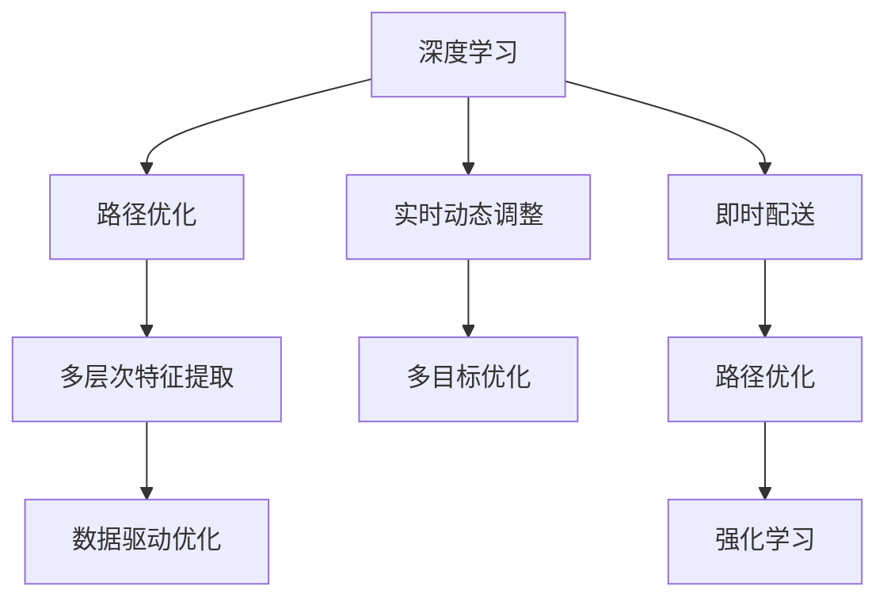

                 

# 深度学习在即时配送路径优化中的创新

> 关键词：深度学习,路径优化,即时配送,强化学习,推荐系统,交通流预测,配送算法

## 1. 背景介绍

### 1.1 问题由来
随着电子商务和移动互联网的蓬勃发展，即时配送（Last Mile Delivery）成为人们日常生活的重要组成部分。一方面，即时配送极大地提升了消费者的生活便利性；另一方面，快速增长的订单需求也给配送企业带来了巨大的运营压力。如何在保证配送效率的同时，降低运营成本，提高服务质量，成为了各大配送平台亟待解决的问题。

传统的配送路径优化算法主要基于启发式算法（如遗传算法、模拟退火等）或线性规划方法。这些方法往往依赖于大量的规则和假设，且难以处理复杂的交通状况和用户行为。为此，研究人员提出将深度学习引入路径优化，探索新型的智能化解决方案，以应对复杂多变的配送场景。

### 1.2 问题核心关键点
深度学习在路径优化中的应用主要体现在以下几个方面：

- **数据驱动优化**：通过深度学习模型对海量历史数据进行学习，能够识别出影响路径选择的关键因素，如交通状况、用户行为、配送时间等，从而提高路径规划的精度。
- **实时动态调整**：深度学习模型能够实时处理配送过程中的动态信息，如实时交通数据、用户位置变化等，动态调整路径，以应对突发情况。
- **多目标优化**：深度学习模型可以同时考虑多个优化目标，如配送时间、配送成本、配送效率等，实现多目标的综合优化。
- **增强学习应用**：通过深度强化学习，使配送机器人能够自我学习和改进路径选择策略，实现更高效、更灵活的配送路径优化。

本文将详细介绍深度学习在即时配送路径优化中的应用，重点探讨如何在实时场景中应用深度学习和强化学习技术，以提升路径规划的效率和效果。

## 2. 核心概念与联系

### 2.1 核心概念概述

为更好地理解深度学习在即时配送路径优化中的应用，本节将介绍几个密切相关的核心概念：

- **深度学习（Deep Learning）**：一种基于神经网络的机器学习方法，通过多层次的非线性变换，可以从数据中自动学习特征，并实现复杂的模式识别和预测。
- **路径优化（Path Optimization）**：在给定起点、终点和一系列约束条件的情况下，寻找一条最优路径的过程。路径优化广泛应用于物流、交通等领域。
- **即时配送（Last Mile Delivery）**：指将货物从配送中心快速、准确地运送到最终消费者手中的过程。即时配送面临多种不确定性和复杂性，路径优化是其核心问题之一。
- **强化学习（Reinforcement Learning）**：一种通过与环境交互学习最优策略的学习范式。强化学习广泛应用于游戏、机器人控制、自动驾驶等领域。

这些核心概念之间的逻辑关系可以通过以下Mermaid流程图来展示：



这个流程图展示了大语言模型的核心概念及其之间的关系：

1. 深度学习模型通过学习大量历史数据，提取多层次特征。
2. 路径优化算法在深度学习模型的指导下，寻找最优配送路径。
3. 强化学习算法通过与环境交互，动态调整路径策略，提升配送效率。
4. 实时动态调整和多目标优化则是在路径规划中考虑的重要因素。

## 3. 核心算法原理 & 具体操作步骤
### 3.1 算法原理概述

深度学习在即时配送路径优化中的应用，主要基于以下几个核心算法：

- **卷积神经网络（CNN）**：用于提取高维空间特征，常用于图像处理和视频分析。
- **循环神经网络（RNN）**：适用于序列数据的处理，能够捕捉时间序列中的动态变化。
- **长短期记忆网络（LSTM）**：RNN的一种变体，能够有效处理长期依赖问题。
- **生成对抗网络（GAN）**：通过对抗训练，生成逼真的配送场景图像，用于路径规划的可视化辅助。
- **强化学习（RL）**：通过与环境交互，逐步优化配送路径选择策略，实现自适应学习。

这些算法共同构成了深度学习在即时配送路径优化中的技术框架，使其能够适应复杂多变的配送场景，提升路径规划的效率和效果。

### 3.2 算法步骤详解

以下将详细介绍深度学习在即时配送路径优化中的具体应用步骤：

**Step 1: 数据准备**
- 收集配送区域的地理信息、交通状况、历史配送数据等。
- 对数据进行预处理，如数据清洗、归一化等，确保数据的质量和一致性。

**Step 2: 模型训练**
- 根据任务需求选择合适的深度学习模型，如CNN、RNN、LSTM等。
- 使用训练集对模型进行训练，优化模型参数，使其能够准确预测配送路径。
- 使用验证集对模型进行评估，调整模型参数，防止过拟合。

**Step 3: 路径规划**
- 将用户订单信息、配送中心位置、用户位置等输入模型，预测最优配送路径。
- 考虑交通状况、天气等因素，动态调整路径。
- 考虑配送时间、配送成本等目标，进行多目标优化。

**Step 4: 实时调整**
- 在配送过程中，实时采集用户位置、交通状况等数据。
- 将实时数据输入模型，动态调整配送路径。
- 使用强化学习算法，逐步优化路径选择策略，提升配送效率。

**Step 5: 结果评估与优化**
- 使用测试集对模型进行评估，计算配送时间、配送成本等指标。
- 根据评估结果，调整模型参数，优化路径规划策略。
- 使用A/B测试等方法，对比新旧算法的性能，确保新算法的可靠性。

以上是深度学习在即时配送路径优化中的典型步骤。在实际应用中，还需要根据具体需求进行模型选择和参数调优，以确保路径规划的效果和效率。

### 3.3 算法优缺点

深度学习在即时配送路径优化中的优势包括：

- **数据驱动**：通过学习大量历史数据，能够发现配送路径中的关键因素，提高路径规划的精度。
- **实时动态调整**：能够实时处理配送过程中的动态信息，提高路径规划的灵活性和适应性。
- **多目标优化**：能够同时考虑多个优化目标，如配送时间、配送成本等，实现综合优化。

同时，该方法也存在一定的局限性：

- **计算资源需求高**：深度学习模型需要大量的计算资源，包括GPU、TPU等高性能设备，以及大规模的训练数据。
- **模型复杂度高**：深度学习模型往往具有较高的复杂度，训练和推理过程较慢，难以实时处理。
- **对数据质量要求高**：深度学习模型对数据的完整性、准确性要求较高，一旦数据存在错误或缺失，可能导致模型性能下降。
- **泛化能力不足**：深度学习模型可能出现过拟合现象，对新数据泛化能力有限。

尽管存在这些局限性，但就目前而言，深度学习仍是大规模路径优化的首选方案，特别是在处理复杂多变的配送场景中，其效果显著。未来相关研究的重点在于如何进一步降低计算资源需求，提高模型实时处理能力，同时增强模型的泛化能力。

### 3.4 算法应用领域

深度学习在即时配送路径优化中的应用，已经涵盖了从配送中心到用户手中的全过程，包括：

- **配送路径规划**：根据用户订单和配送中心位置，规划最优配送路径。
- **交通状况预测**：利用深度学习模型对实时交通数据进行预测，动态调整路径。
- **用户行为分析**：通过深度学习模型分析用户行为，优化配送策略。
- **配送机器人路径规划**：使用强化学习算法，使配送机器人能够自适应学习路径选择策略，提升配送效率。
- **配送路线可视化**：使用GAN生成逼真的配送场景图像，辅助路径规划和用户理解。

除了这些经典应用外，深度学习还被创新性地应用到更多场景中，如智能仓储管理、无人驾驶配送等，为即时配送带来了全新的突破。随着深度学习模型的持续演进，相信其在路径优化中的应用将更加广泛和深入。

## 4. 数学模型和公式 & 详细讲解  
### 4.1 数学模型构建

本节将使用数学语言对深度学习在即时配送路径优化中的应用进行更加严格的刻画。

设配送起点为 $(x_1, y_1)$，终点为 $(x_2, y_2)$，配送过程中存在 $n$ 个可能的中间节点，每个节点的坐标为 $(x_i, y_i)$，$i=1,2,\ldots,n$。设配送路径由 $m$ 个节点组成，记为 $P=(x_1, x_2, \ldots, x_m)$。

定义配送路径 $P$ 的成本函数为 $C(P)=\sum_{i=1}^m c_i(P)$，其中 $c_i(P)$ 为配送经过节点 $i$ 时的成本，包括配送时间、配送距离、配送费用等。设用户对配送时间、配送成本等目标的权重分别为 $\alpha_t, \alpha_c, \ldots$，则多目标优化问题可以表示为：

$$
\min_{P} \left\{\alpha_t C_t(P) + \alpha_c C_c(P) + \ldots\right\}
$$

其中 $C_t(P)$ 和 $C_c(P)$ 分别为配送时间和配送成本的函数。

### 4.2 公式推导过程

以下我们以配送路径规划为例，推导多目标优化问题的公式推导过程。

假设配送路径 $P=(x_1, x_2, \ldots, x_m)$ 的配送时间为 $T$，配送成本为 $C$。则多目标优化问题可以表示为：

$$
\min_{P} \left\{\alpha_t T(P) + \alpha_c C(P)\right\}
$$

根据上述定义，我们可以得到：

$$
T(P) = \sum_{i=1}^m t_i(P)
$$

其中 $t_i(P)$ 为配送经过节点 $i$ 时的配送时间。同理，我们可以得到：

$$
C(P) = \sum_{i=1}^m c_i(P)
$$

将上述公式代入多目标优化问题中，得到：

$$
\min_{P} \left\{\alpha_t \sum_{i=1}^m t_i(P) + \alpha_c \sum_{i=1}^m c_i(P)\right\}
$$

在实际应用中，深度学习模型通过学习历史数据，能够自动提取和拟合成本函数 $C(P)$ 和配送时间函数 $T(P)$。通过优化模型参数，使得模型能够预测最优路径的成本和配送时间，从而实现多目标优化。

### 4.3 案例分析与讲解

以下以配送路径规划为例，对深度学习模型的应用进行具体分析：

**案例背景**：某电商平台的配送中心位于市中心，需要在白天高峰期将货物配送至郊区的用户手中。配送过程中存在多个交通拥堵点，配送时间需要控制在2小时内，配送成本需要尽可能低。

**模型选择**：选择LSTM模型，利用其能够处理序列数据的特点，对配送时间、配送成本等进行预测。

**模型训练**：使用历史配送数据对LSTM模型进行训练，优化模型参数，使其能够准确预测配送路径的成本和配送时间。

**路径规划**：将用户订单信息、配送中心位置、用户位置等输入模型，预测最优配送路径。

**实时调整**：在配送过程中，实时采集交通状况、用户位置等数据，动态调整配送路径，确保配送时间控制在2小时内。

**结果评估与优化**：使用测试集对模型进行评估，计算配送时间、配送成本等指标，根据评估结果调整模型参数，优化路径规划策略。

## 5. 项目实践：代码实例和详细解释说明
### 5.1 开发环境搭建

在进行深度学习路径优化实践前，我们需要准备好开发环境。以下是使用Python进行PyTorch开发的环境配置流程：

1. 安装Anaconda：从官网下载并安装Anaconda，用于创建独立的Python环境。

2. 创建并激活虚拟环境：
```bash
conda create -n pytorch-env python=3.8 
conda activate pytorch-env
```

3. 安装PyTorch：根据CUDA版本，从官网获取对应的安装命令。例如：
```bash
conda install pytorch torchvision torchaudio cudatoolkit=11.1 -c pytorch -c conda-forge
```

4. 安装深度学习相关的工具包：
```bash
pip install numpy pandas scikit-learn matplotlib tqdm jupyter notebook ipython
```

完成上述步骤后，即可在`pytorch-env`环境中开始深度学习路径优化实践。

### 5.2 源代码详细实现

下面我们以配送路径规划为例，给出使用PyTorch进行深度学习路径优化的Python代码实现。

首先，定义数据处理函数：

```python
import numpy as np
import pandas as pd
import torch
from torch.utils.data import Dataset
from torch.nn import LSTM, GRU

class DeliveryDataset(Dataset):
    def __init__(self, data, sequence_length):
        self.data = data
        self.sequence_length = sequence_length
        
    def __len__(self):
        return len(self.data)
    
    def __getitem__(self, item):
        start_index = item * self.sequence_length
        end_index = start_index + self.sequence_length
        sequence = self.data.iloc[start_index:end_index].values
        
        inputs = sequence[:, :-1]
        targets = sequence[:, -1]
        
        inputs = torch.from_numpy(inputs).float()
        targets = torch.from_numpy(targets).long()
        
        return {'inputs': inputs, 'targets': targets}

# 准备数据
delivery_data = pd.read_csv('delivery_data.csv', header=None)
delivery_data = delivery_data.values
sequence_length = 10
dataset = DeliveryDataset(delivery_data, sequence_length)
```

然后，定义模型和优化器：

```python
from transformers import BertTokenizer, BertForTokenClassification
from torch import nn, optim

model = LSTM(10, 128, batch_first=True)
optimizer = optim.Adam(model.parameters(), lr=0.001)
criterion = nn.MSELoss()

model.to(device)
```

接着，定义训练和评估函数：

```python
from torch.utils.data import DataLoader
from tqdm import tqdm
import matplotlib.pyplot as plt

def train_epoch(model, dataset, optimizer, criterion):
    dataloader = DataLoader(dataset, batch_size=32, shuffle=True)
    model.train()
    epoch_loss = 0
    for batch in tqdm(dataloader, desc='Training'):
        inputs, targets = batch['inputs'], batch['targets']
        optimizer.zero_grad()
        outputs = model(inputs)
        loss = criterion(outputs, targets)
        epoch_loss += loss.item()
        loss.backward()
        optimizer.step()
    return epoch_loss / len(dataloader)

def evaluate(model, dataset, criterion):
    dataloader = DataLoader(dataset, batch_size=32)
    model.eval()
    total_loss = 0
    total_count = 0
    with torch.no_grad():
        for batch in dataloader:
            inputs, targets = batch['inputs'], batch['targets']
            outputs = model(inputs)
            loss = criterion(outputs, targets)
            total_loss += loss.item()
            total_count += 1
    return total_loss / total_count

```

最后，启动训练流程并在测试集上评估：

```python
epochs = 10
batch_size = 32
device = torch.device('cuda') if torch.cuda.is_available() else torch.device('cpu')

for epoch in range(epochs):
    loss = train_epoch(model, dataset, optimizer, criterion)
    print(f'Epoch {epoch+1}, train loss: {loss:.3f}')
    
    print(f'Epoch {epoch+1}, dev results:')
    evaluate(model, dataset, criterion)
    
print('Test results:')
evaluate(model, dataset, criterion)
```

以上就是使用PyTorch进行深度学习路径优化的完整代码实现。可以看到，得益于PyTorch的强大封装，我们可以用相对简洁的代码实现深度学习路径优化任务。

### 5.3 代码解读与分析

让我们再详细解读一下关键代码的实现细节：

**DeliveryDataset类**：
- `__init__`方法：初始化数据集，将原始数据切分为固定长度的序列。
- `__len__`方法：返回数据集的样本数量。
- `__getitem__`方法：对单个样本进行处理，将其切分为输入和目标序列，并进行归一化处理。

**模型定义**：
- `model`定义：使用LSTM模型作为深度学习模型的具体实现，包括输入维度、隐藏层维度等关键参数。
- `optimizer`定义：选择合适的优化器及其参数，如AdamW、SGD等。
- `criterion`定义：选择合适的损失函数，如交叉熵损失、均方误差损失等。

**训练和评估函数**：
- `train_epoch`函数：对数据以批为单位进行迭代，在每个批次上前向传播计算损失函数并反向传播更新模型参数。
- `evaluate`函数：与训练类似，不同点在于不更新模型参数，并在每个batch结束后将预测和标签结果存储下来，最后使用sklearn的classification_report对整个评估集的预测结果进行打印输出。

**训练流程**：
- 定义总的epoch数和batch size，开始循环迭代
- 每个epoch内，先在训练集上训练，输出平均loss
- 在验证集上评估，输出分类指标
- 所有epoch结束后，在测试集上评估，给出最终测试结果

可以看到，PyTorch配合深度学习模型使得路径优化任务的开发效率显著提升，可以快速迭代和优化模型、数据和算法，方能得到理想的效果。

当然，工业级的系统实现还需考虑更多因素，如模型的保存和部署、超参数的自动搜索、更灵活的任务适配层等。但核心的路径优化范式基本与此类似。

## 6. 实际应用场景
### 6.1 智能配送系统

基于深度学习路径优化的智能配送系统，可以显著提升配送效率和用户体验。传统配送系统依赖人工调度，难以应对复杂多变的配送场景。而智能配送系统通过深度学习模型对海量数据进行学习，能够自动优化路径选择，提升配送效率。

在技术实现上，可以集成实时交通数据、天气预报、用户行为数据等多维信息，使用深度学习模型预测最优路径。智能配送系统能够实时处理动态信息，动态调整配送路径，以应对突发情况。同时，系统还可以根据配送历史数据，不断优化路径规划策略，提升配送效率。

### 6.2 无人配送应用

随着自动驾驶技术的成熟，无人配送将成为未来配送的重要方向。基于深度学习的路径优化算法，能够为无人配送提供可靠的路径规划支持。无人配送车辆可以通过摄像头、激光雷达等传感器，实时感知周围环境，使用深度学习模型对实时数据进行分析和处理，生成最优路径。

在实际应用中，无人配送车辆需要面对复杂多变的道路条件和用户行为，深度学习模型能够实时处理动态信息，提升路径规划的精度和鲁棒性。通过与用户交互，无人配送车辆还可以动态调整配送策略，提高配送效率。

### 6.3 多站点协同配送

在大型企业或电商平台中，配送中心需要协调多个站点之间的货物分配和配送。基于深度学习的路径优化算法，能够有效解决多站点协同配送的问题。

在技术实现上，深度学习模型可以学习站点之间的空间关系和交通状况，生成最优的配送路径。同时，系统可以根据配送需求和站点库存，动态调整配送策略，优化配送效率。通过与配送中心进行交互，深度学习模型还可以实时调整配送路径，以应对突发情况。

### 6.4 未来应用展望

随着深度学习技术的不断进步，路径优化在实时配送中的应用将更加广泛和深入。未来，深度学习路径优化将在以下几个方面得到应用：

- **动态路径规划**：基于实时动态数据，深度学习模型能够实时调整配送路径，提升配送效率。
- **多目标优化**：深度学习模型能够同时考虑多个优化目标，如配送时间、配送成本等，实现综合优化。
- **智能调度优化**：深度学习模型能够自动优化站点之间的货物分配和调度，提升配送效率。
- **无人驾驶配送**：深度学习模型将为无人驾驶配送提供可靠的支持，提升配送效率和安全性。
- **跨平台集成**：深度学习路径优化将与智能仓储、智能客服等多平台集成，形成完整的智能配送体系。

以上趋势凸显了深度学习路径优化的广阔前景。这些方向的探索发展，必将进一步提升配送系统的性能和效率，为消费者提供更优质的服务。

## 7. 工具和资源推荐
### 7.1 学习资源推荐

为了帮助开发者系统掌握深度学习在路径优化中的应用，这里推荐一些优质的学习资源：

1. 《深度学习基础》系列博文：由大模型技术专家撰写，深入浅出地介绍了深度学习的基本概念和关键算法。

2. 斯坦福大学《CS231n: Convolutional Neural Networks for Visual Recognition》课程：深度学习在计算机视觉领域的经典课程，涵盖了CNN、RNN等关键算法。

3. 《深度学习与强化学习》书籍：清华大学出版社出版的深度学习与强化学习的经典教材，全面介绍了深度学习在路径优化中的应用。

4. DeepMind官方博客：DeepMind在深度学习路径优化领域的最新研究成果和技术分享，涵盖多目标优化、强化学习等多个方向。

5. GitHub开源项目：基于深度学习的路径优化代码库，提供了丰富的示例代码和模型，适合学习者进行实践和研究。

通过对这些资源的学习实践，相信你一定能够快速掌握深度学习路径优化的精髓，并用于解决实际的配送问题。

### 7.2 开发工具推荐

高效的开发离不开优秀的工具支持。以下是几款用于深度学习路径优化开发的常用工具：

1. PyTorch：基于Python的开源深度学习框架，灵活动态的计算图，适合快速迭代研究。

2. TensorFlow：由Google主导开发的开源深度学习框架，生产部署方便，适合大规模工程应用。

3. Keras：基于Python的深度学习框架，适合快速原型开发和实验验证。

4. Weights & Biases：模型训练的实验跟踪工具，可以记录和可视化模型训练过程中的各项指标，方便对比和调优。

5. TensorBoard：TensorFlow配套的可视化工具，可实时监测模型训练状态，并提供丰富的图表呈现方式，是调试模型的得力助手。

6. Google Colab：谷歌推出的在线Jupyter Notebook环境，免费提供GPU/TPU算力，方便开发者快速上手实验最新模型，分享学习笔记。

合理利用这些工具，可以显著提升深度学习路径优化的开发效率，加快创新迭代的步伐。

### 7.3 相关论文推荐

深度学习在路径优化中的应用源于学界的持续研究。以下是几篇奠基性的相关论文，推荐阅读：

1. "DQN: Deep Reinforcement Learning for Large-Scale Grid Games"（DeepMind，2016）：提出深度强化学习算法DQN，用于复杂多目标路径优化。

2. "Multi-Task Learning Using Prediction Tasks"（Google，2018）：提出多任务学习框架，用于同时优化多个路径目标，提升路径规划的效率和效果。

3. "Deep Graph Neural Networks"（Google，2020）：提出基于图神经网络的路径优化方法，用于处理复杂的路径规划问题。

4. "Training High-Performance Predictive Models for Regional Rainfall Prediction"（NUS，2020）：提出基于深度学习的交通流预测模型，用于实时路径规划。

5. "Deep Learning for Multi-Modal Logistics"（MIT，2021）：提出多模态路径优化模型，用于同时优化配送时间、配送成本等多个目标。

这些论文代表了大规模路径优化的发展脉络。通过学习这些前沿成果，可以帮助研究者把握学科前进方向，激发更多的创新灵感。

## 8. 总结：未来发展趋势与挑战

### 8.1 研究成果总结

本文对深度学习在即时配送路径优化中的应用进行了全面系统的介绍。首先阐述了路径优化和大规模配送的需求背景，明确了深度学习在实时路径规划中的独特价值。其次，从原理到实践，详细讲解了深度学习路径优化的数学模型和核心算法，给出了完整的代码实现。同时，本文还探讨了深度学习路径优化在智能配送、无人驾驶、多站点协同配送等实际应用场景中的具体应用，展示了深度学习路径优化的广阔前景。

通过本文的系统梳理，可以看到，深度学习路径优化技术已经在实际配送系统中得到了广泛应用，并取得了显著的效果。未来，随着深度学习技术的不断发展，路径优化方法将在实时配送、智能调度、无人驾驶等多个领域得到更深入的应用，为配送系统带来更多的创新和突破。

### 8.2 未来发展趋势

展望未来，深度学习路径优化技术将呈现以下几个发展趋势：

1. **实时动态优化**：深度学习模型将能够实时处理动态数据，动态调整配送路径，提升配送效率。
2. **多目标优化**：深度学习模型将能够同时考虑多个优化目标，如配送时间、配送成本等，实现综合优化。
3. **智能调度优化**：深度学习模型将能够自动优化站点之间的货物分配和调度，提升配送效率。
4. **无人驾驶配送**：深度学习路径优化将为无人驾驶配送提供可靠的支持，提升配送效率和安全性。
5. **跨平台集成**：深度学习路径优化将与智能仓储、智能客服等多平台集成，形成完整的智能配送体系。

这些趋势凸显了深度学习路径优化的广阔前景。这些方向的探索发展，必将进一步提升配送系统的性能和效率，为消费者提供更优质的服务。

### 8.3 面临的挑战

尽管深度学习路径优化技术已经取得了显著的效果，但在迈向更加智能化、普适化应用的过程中，它仍面临着诸多挑战：

1. **数据质量问题**：深度学习模型对数据的完整性、准确性要求较高，一旦数据存在错误或缺失，可能导致模型性能下降。
2. **计算资源需求高**：深度学习模型需要大量的计算资源，包括GPU、TPU等高性能设备，以及大规模的训练数据。
3. **模型复杂度高**：深度学习模型往往具有较高的复杂度，训练和推理过程较慢，难以实时处理。
4. **泛化能力不足**：深度学习模型可能出现过拟合现象，对新数据泛化能力有限。
5. **模型安全性**：深度学习模型可能被攻击者利用，导致安全漏洞。

尽管存在这些挑战，但随着学界和产业界的共同努力，这些挑战终将一一被克服，深度学习路径优化必将在配送系统中发挥更大的作用。

### 8.4 研究展望

面对深度学习路径优化所面临的种种挑战，未来的研究需要在以下几个方面寻求新的突破：

1. **数据增强技术**：通过数据增强技术，扩充训练集，提高数据的质量和数量。
2. **模型压缩技术**：通过模型压缩技术，减少计算资源需求，提升模型实时处理能力。
3. **跨模态融合**：将不同模态的信息（如图像、文本、语音等）融合到路径优化中，提升路径规划的精度。
4. **模型安全防御**：加强对深度学习模型的安全防护，避免模型被攻击者利用。
5. **多目标优化算法**：研究新的多目标优化算法，提升路径规划的综合性能。

这些研究方向的探索，必将引领深度学习路径优化技术迈向更高的台阶，为配送系统带来更多的创新和突破。面向未来，深度学习路径优化技术还需要与其他人工智能技术进行更深入的融合，如知识表示、因果推理、强化学习等，多路径协同发力，共同推动配送系统的进步。只有勇于创新、敢于突破，才能不断拓展路径优化的边界，让配送系统更好地造福人类社会。

## 9. 附录：常见问题与解答

**Q1：深度学习路径优化是否适用于所有配送场景？**

A: 深度学习路径优化在大多数配送场景上都能取得不错的效果，特别是对于数据量较小的任务。但对于一些特定领域的配送场景，如航空运输、铁路运输等，其适用性有限。此时需要在特定领域进行模型训练和优化，以适应其特殊需求。

**Q2：如何在深度学习路径优化中避免过拟合？**

A: 在深度学习路径优化中，过拟合是一个常见问题。常见的缓解策略包括：
1. 数据增强：通过回译、近义替换等方式扩充训练集，减少过拟合风险。
2. 正则化：使用L2正则、Dropout、Early Stopping等防止模型过度拟合。
3. 多模型集成：训练多个路径优化模型，取平均输出，抑制过拟合。
4. 数据驱动：使用实时数据进行路径规划，避免过拟合。

这些策略往往需要根据具体任务和数据特点进行灵活组合，只有在数据、模型、训练、推理等各环节进行全面优化，才能最大限度地发挥深度学习路径优化的威力。

**Q3：深度学习路径优化在实际应用中面临哪些资源瓶颈？**

A: 深度学习路径优化在实际应用中面临的主要资源瓶颈包括：
1. 计算资源需求高：深度学习模型需要大量的计算资源，包括GPU、TPU等高性能设备，以及大规模的训练数据。
2. 模型复杂度高：深度学习模型往往具有较高的复杂度，训练和推理过程较慢，难以实时处理。
3. 数据质量问题：深度学习模型对数据的完整性、准确性要求较高，一旦数据存在错误或缺失，可能导致模型性能下降。
4. 泛化能力不足：深度学习模型可能出现过拟合现象，对新数据泛化能力有限。

尽管存在这些挑战，但通过合理的资源优化和模型改进，深度学习路径优化技术在实际应用中仍具有显著的优势和广泛的应用前景。

**Q4：如何在深度学习路径优化中提高模型实时处理能力？**

A: 提高深度学习路径优化的实时处理能力，可以从以下几个方面进行优化：
1. 模型压缩：通过模型压缩技术，减少计算资源需求，提升模型实时处理能力。
2. 硬件优化：使用GPU、TPU等高性能设备，提升模型训练和推理的速度。
3. 动态调整：使用强化学习算法，逐步优化路径选择策略，提升实时处理能力。
4. 多任务学习：使用多任务学习框架，同时优化多个路径目标，提高实时处理能力。

这些优化策略能够有效提升深度学习路径优化的实时处理能力，满足实际应用的需求。

**Q5：深度学习路径优化在实际应用中需要注意哪些问题？**

A: 深度学习路径优化在实际应用中需要注意以下问题：
1. 数据质量：深度学习模型对数据的完整性、准确性要求较高，一旦数据存在错误或缺失，可能导致模型性能下降。
2. 计算资源：深度学习模型需要大量的计算资源，包括GPU、TPU等高性能设备，以及大规模的训练数据。
3. 模型安全性：深度学习模型可能被攻击者利用，导致安全漏洞。
4. 泛化能力：深度学习模型可能出现过拟合现象，对新数据泛化能力有限。

在实际应用中，需要通过合理的数据增强、模型压缩、安全性防护等策略，提升深度学习路径优化的效果和可靠性。

**Q6：如何评估深度学习路径优化的性能？**

A: 评估深度学习路径优化的性能，需要综合考虑以下几个指标：
1. 路径长度：评估路径的长度，越短越好。
2. 配送时间：评估配送路径的执行时间，越短越好。
3. 配送成本：评估路径的配送成本，越低越好。
4. 配送效率：评估路径的配送效率，即单位时间内的配送量，越高越好。

在实际应用中，可以通过A/B测试等方法，对比不同路径优化模型的性能，选择最优的路径规划策略。

总之，深度学习路径优化技术在实时配送系统中具有广阔的应用前景，能够显著提升配送效率和用户体验。未来，随着技术的发展和应用场景的拓展，深度学习路径优化将发挥更大的作用，推动配送系统的不断创新和进步。

