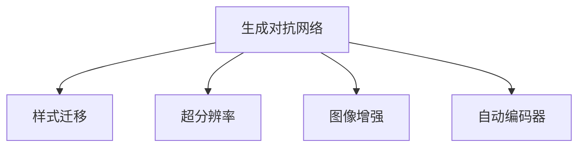

                 

# 深度学习在图像生成与编辑中的应用

> 关键词：深度学习, 图像生成, 图像编辑, GAN, 样式迁移, 超分辨率, 图像增强, 自动编码器

## 1. 背景介绍

图像生成与编辑技术一直是计算机视觉领域的热点话题。近年来，随着深度学习技术的快速发展，图像生成与编辑技术也取得了显著的进展。深度学习模型通过自动学习大规模数据集中的隐含规律，能够生成高质量、具有真实感的图像，并能够对图像进行高效的编辑与修复，为图像处理应用带来了革命性的变化。本文将深入探讨深度学习在图像生成与编辑中的应用，重点介绍生成对抗网络(GAN)、样式迁移、超分辨率等前沿技术，并展望未来发展趋势。

## 2. 核心概念与联系

### 2.1 核心概念概述

本节将介绍几个在图像生成与编辑领域具有核心意义的概念，以帮助读者理解深度学习应用的本质。

- **生成对抗网络(GANs)**：生成对抗网络是由生成器和判别器两部分组成的深度学习模型，通过对抗训练的方式，生成高质量的伪造图像。GANs在图像生成、视频生成、风格迁移等任务上取得了显著的成果。

- **样式迁移(Style Transfer)**：样式迁移是指将一张图片的内容映射到另一张图片的风格上，生成风格化后的图像。该技术广泛应用于艺术创作、图像增强等领域，具有重要的艺术与实用价值。

- **超分辨率(Super-Resolution)**：超分辨率是指将低分辨率图像放大至高分辨率图像的过程，使得图像更加清晰，细节更加丰富。超分辨率技术在数字视频、遥感图像等领域具有广泛的应用前景。

- **图像增强(Image Enhancement)**：图像增强是指通过改善图像的亮度、对比度、色彩等特征，提升图像的质量。该技术在医学影像、遥感图像、安防监控等领域有重要的应用价值。

- **自动编码器(Autocoders)**：自动编码器是一类基于神经网络的编码-解码模型，通过学习数据的隐含表示，进行图像压缩、去噪、图像复原等任务。自动编码器在图像处理与数据压缩等任务上有重要应用。

这些概念之间的联系可以通过以下Mermaid流程图来展示：



这个流程图展示了大规模深度学习模型在图像生成与编辑任务中的应用场景。其中，GANs在图像生成、风格迁移上具有重要作用；样式迁移、超分辨率、图像增强等技术都属于图像生成与编辑的分支；自动编码器在数据压缩、图像复原等任务中具有优势。

## 3. 核心算法原理 & 具体操作步骤

### 3.1 算法原理概述

深度学习在图像生成与编辑中的应用，主要基于生成对抗网络(GANs)、风格迁移、超分辨率等模型。这些模型通过深度神经网络的结构，学习数据的隐含表示，生成高质量的图像或进行图像编辑。

### 3.2 算法步骤详解

#### 3.2.1 生成对抗网络

**Step 1: 构建生成器和判别器**
- 生成器(G)负责生成伪造图像。常用模型包括CNN、RNN等。
- 判别器(D)负责判断图像是真实还是伪造的。常用模型包括CNN、MLP等。

**Step 2: 对抗训练**
- 将生成器和判别器作为对抗双方，交替优化。生成器希望欺骗判别器，而判别器希望正确识别伪造图像。

**Step 3: 模型优化**
- 通过优化生成器与判别器之间的对抗训练，使生成器能够生成与真实图像几乎无法区分的伪造图像。

#### 3.2.2 样式迁移

**Step 1: 提取特征**
- 提取待迁移图片的特征表示。常用卷积神经网络(CNN)作为特征提取器。

**Step 2: 生成风格化图像**
- 将待迁移图片的特征与目标风格的特征进行线性变换，得到新的图像特征。
- 利用生成器将新的特征映射回图像空间，生成风格化后的图像。

#### 3.2.3 超分辨率

**Step 1: 特征提取**
- 提取低分辨率图像的特征表示。

**Step 2: 提升特征分辨率**
- 使用反卷积层提升特征分辨率，得到高分辨率的特征表示。

**Step 3: 特征映射**
- 利用生成器将高分辨率特征映射回图像空间，生成高分辨率图像。

### 3.3 算法优缺点

#### 3.3.1 生成对抗网络

**优点**：
- 生成高质量的伪造图像，接近真实图像质量。
- 可以进行无监督学习，仅需要少量标签数据即可。

**缺点**：
- 训练过程不稳定，容易出现模式崩溃。
- 生成图像可能存在模糊、噪点等缺陷。

#### 3.3.2 样式迁移

**优点**：
- 能够将一张图像的风格迁移到另一张图像中。
- 操作简单，可应用于艺术创作、图像增强等领域。

**缺点**：
- 生成的图像可能存在风格失真、内容变形等问题。
- 需要高质量的图像和风格表示，对数据质量要求较高。

#### 3.3.3 超分辨率

**优点**：
- 可以将低分辨率图像放大至高分辨率图像，提高图像清晰度。
- 在图像复原、数字视频增强等方面具有重要应用。

**缺点**：
- 图像放大过程中可能引入噪声和细节丢失。
- 需要大量高分辨率图像作为训练数据。

### 3.4 算法应用领域

深度学习在图像生成与编辑技术的应用领域广泛，包括但不限于以下几个方面：

- **医学影像**：超分辨率、图像增强等技术可以提升医学影像的质量，提高诊断准确率。
- **影视制作**：生成对抗网络可以用于生成逼真的电影特效和动画。
- **艺术创作**：样式迁移技术可以将名画风格迁移到普通照片上，实现艺术创作。
- **遥感图像**：超分辨率技术可以提升卫星遥感图像的分辨率，进行更精确的地表监测。
- **安防监控**：图像增强技术可以提高监控图像的清晰度和细节，提高安防效率。

## 4. 数学模型和公式 & 详细讲解 & 举例说明

### 4.1 数学模型构建

本节将介绍生成对抗网络(GANs)、样式迁移、超分辨率等模型的数学建模方法。

#### 4.1.1 生成对抗网络

**Step 1: 定义生成器和判别器**
- 生成器 $G$：将噪声向量 $z$ 映射到图像空间 $x$。
- 判别器 $D$：将图像 $x$ 映射到真实性标签 $y$。

**Step 2: 定义损失函数**
- 生成器损失：$L_G=\mathbb{E}_{z\sim p(z)} [D(G(z))]$。
- 判别器损失：$L_D=\mathbb{E}_{x\sim p_{data}(x)} [D(x)] + \mathbb{E}_{z\sim p(z)} [1-D(G(z))]$。

#### 4.1.2 样式迁移

**Step 1: 提取特征**
- 使用卷积神经网络提取待迁移图片 $x$ 的特征表示 $A_x$。
- 使用卷积神经网络提取目标风格图片 $y$ 的特征表示 $A_y$。

**Step 2: 生成风格化图像**
- 将特征 $A_x$ 与 $A_y$ 进行线性变换，得到新的特征 $A'$。
- 利用生成器将 $A'$ 映射回图像空间，生成风格化后的图像 $x'$。

#### 4.1.3 超分辨率

**Step 1: 特征提取**
- 使用卷积神经网络提取低分辨率图像 $x$ 的特征表示 $A_x$。

**Step 2: 提升特征分辨率**
- 使用反卷积层将特征 $A_x$ 分辨率提升到 $k$ 倍，得到高分辨率特征 $A'$。

**Step 3: 特征映射**
- 利用生成器将高分辨率特征 $A'$ 映射回图像空间，生成高分辨率图像 $x'$。

### 4.2 公式推导过程

#### 4.2.1 生成对抗网络

**生成器损失推导**：
$$L_G=\mathbb{E}_{z\sim p(z)} [D(G(z))]$$
表示生成器希望欺骗判别器，使其认为生成的图像是真实的。

**判别器损失推导**：
$$L_D=\mathbb{E}_{x\sim p_{data}(x)} [D(x)] + \mathbb{E}_{z\sim p(z)} [1-D(G(z))]$$
表示判别器希望正确识别真实和伪造图像。

#### 4.2.2 样式迁移

**特征表示推导**：
$$A_x=\mathbb{E}_{x\sim p_{data}(x)} [F(x)]$$
$$A_y=\mathbb{E}_{y\sim p_{data}(y)} [F(y)]$$
其中 $F$ 为卷积神经网络特征提取器。

**生成风格化图像推导**：
$$A'=\alpha A_x + (1-\alpha)A_y$$
$$x'=\mathbb{E}_{z\sim p(z)} [G(z)]$$
其中 $\alpha$ 为线性变换参数。

#### 4.2.3 超分辨率

**特征表示推导**：
$$A_x=\mathbb{E}_{x\sim p_{data}(x)} [F(x)]$$
$$A'=\mathbb{E}_{x\sim p_{data}(x)} [F_k(x)]$$
其中 $F_k$ 为提升特征分辨率的卷积神经网络。

**生成高分辨率图像推导**：
$$x'=\mathbb{E}_{z\sim p(z)} [G(z)]$$

### 4.3 案例分析与讲解

**案例1: 图像生成**

**数据集**：MNIST手写数字数据集。

**模型**：使用生成对抗网络生成手写数字图像。

**代码实现**：

```python
import torch
import torch.nn as nn
import torch.optim as optim
from torchvision import datasets, transforms

# 定义生成器和判别器
class Generator(nn.Module):
    def __init__(self):
        super(Generator, self).__init__()
        self.fc1 = nn.Linear(100, 256)
        self.fc2 = nn.Linear(256, 64*7*7)
        self.fc3 = nn.Linear(64*7*7, 28*28)
        self.fc4 = nn.Linear(28*28, 10)

    def forward(self, z):
        z = torch.relu(self.fc1(z))
        z = torch.relu(self.fc2(z))
        z = torch.reshape(z, (z.size()[0], 64, 7, 7))
        z = torch.relu(self.fc3(z))
        z = self.fc4(z)
        return z

class Discriminator(nn.Module):
    def __init__(self):
        super(Discriminator, self).__init__()
        self.fc1 = nn.Linear(28*28, 64)
        self.fc2 = nn.Linear(64, 128)
        self.fc3 = nn.Linear(128, 1)

    def forward(self, x):
        x = torch.flatten(x, 1)
        x = torch.relu(self.fc1(x))
        x = torch.relu(self.fc2(x))
        x = torch.sigmoid(self.fc3(x))
        return x

# 定义损失函数和优化器
G = Generator()
D = Discriminator()
G_optimizer = optim.Adam(G.parameters(), lr=0.0002)
D_optimizer = optim.Adam(D.parameters(), lr=0.0002)
criterion = nn.BCELoss()

# 训练过程
for epoch in range(1000):
    for i, (x, _) in enumerate(dataloader):
        x = x.view(-1, 28*28)
        G_optimizer.zero_grad()
        D_optimizer.zero_grad()
        z = torch.randn(64, 100)
        fake_x = G(z)
        real_x = x
        y_real = torch.ones_like(D(x)).float()
        y_fake = torch.zeros_like(D(fake_x)).float()
        D_loss_real = criterion(D(real_x), y_real)
        D_loss_fake = criterion(D(fake_x), y_fake)
        D_loss = D_loss_real + D_loss_fake
        G_loss = criterion(D(fake_x), y_real)
        D_loss.backward()
        G_loss.backward()
        G_optimizer.step()
        D_optimizer.step()
    if (epoch+1) % 10 == 0:
        print('Epoch: %d, D_loss: %.4f, G_loss: %.4f' % (epoch+1, D_loss.item(), G_loss.item()))
        G.eval()
        with torch.no_grad():
            z = torch.randn(64, 100)
            fake_x = G(z)
        for i, x_ in enumerate(fake_x):
            fig, ax = plt.subplots()
            ax.imshow(x_.view(28, 28))
            ax.set_title('Fake Image: %d' % i)
            ax.axis('off')
            fig.savefig('fake_images/{}.png'.format(i))
        G.train()
```

**案例2: 样式迁移**

**数据集**：COCO图片数据集。

**模型**：使用VGG19网络作为特征提取器，利用卷积神经网络生成样式化图像。

**代码实现**：

```python
import torch
import torch.nn as nn
import torch.optim as optim
from torchvision import models, transforms

# 定义特征提取器和生成器
class FeatureExtractor(nn.Module):
    def __init__(self):
        super(FeatureExtractor, self).__init__()
        self.vgg = models.vgg19(pretrained=True)
        self.vgg = self.vgg.features

    def forward(self, x):
        features = []
        x = self.vgg(x)
        features.append(x)
        return features

class Generator(nn.Module):
    def __init__(self):
        super(Generator, self).__init__()
        self.fc1 = nn.Linear(512, 4096)
        self.fc2 = nn.Linear(4096, 4096)
        self.fc3 = nn.Linear(4096, 4096)
        self.fc4 = nn.Linear(4096, 3*3*64)
        self.conv1 = nn.ConvTranspose2d(64, 64, 4, 2, 1)
        self.conv2 = nn.ConvTranspose2d(64, 3, 4, 2, 1)

    def forward(self, z):
        z = torch.relu(self.fc1(z))
        z = torch.relu(self.fc2(z))
        z = torch.relu(self.fc3(z))
        z = torch.reshape(z, (z.size()[0], 64, 1, 1))
        z = torch.tanh(self.conv1(z))
        z = torch.tanh(self.conv2(z))
        return z

# 定义损失函数和优化器
feature_extractor = FeatureExtractor()
generator = Generator()
feature_extractor_optimizer = optim.Adam(feature_extractor.parameters(), lr=0.001)
generator_optimizer = optim.Adam(generator.parameters(), lr=0.001)
criterion = nn.MSELoss()

# 训练过程
for epoch in range(200):
    for i, (x, y) in enumerate(dataloader):
        features_x = feature_extractor(x)
        z = torch.randn(batch_size, 100)
        y_hat = generator(z)
        features_y = feature_extractor(y)
        features_y_hat = feature_extractor(y_hat)
        style_loss = criterion(features_x, features_y_hat)
        content_loss = criterion(features_x, features_y)
        total_loss = style_loss + content_loss
        feature_extractor_optimizer.zero_grad()
        generator_optimizer.zero_grad()
        total_loss.backward()
        feature_extractor_optimizer.step()
        generator_optimizer.step()
    if (epoch+1) % 20 == 0:
        print('Epoch: %d, style_loss: %.4f, content_loss: %.4f' % (epoch+1, style_loss.item(), content_loss.item()))
        z = torch.randn(batch_size, 100)
        y_hat = generator(z)
        features_y_hat = feature_extractor(y_hat)
        for i, x_ in enumerate(features_y_hat):
            fig, ax = plt.subplots()
            ax.imshow(x_.view(3, 3, 64))
            ax.set_title('Style Transfer: %d' % i)
            ax.axis('off')
            fig.savefig('style_images/{}.png'.format(i))
```

**案例3: 超分辨率**

**数据集**：BSD300图像数据集。

**模型**：使用超分辨率网络生成高分辨率图像。

**代码实现**：

```python
import torch
import torch.nn as nn
import torch.optim as optim
from torchvision import datasets, transforms

# 定义特征提取器和生成器
class FeatureExtractor(nn.Module):
    def __init__(self):
        super(FeatureExtractor, self).__init__()
        self.conv1 = nn.Conv2d(3, 64, 3, 1, 1)
        self.conv2 = nn.Conv2d(64, 64, 3, 1, 1)
        self.conv3 = nn.Conv2d(64, 64, 3, 1, 1)
        self.conv4 = nn.Conv2d(64, 64, 3, 1, 1)
        self.conv5 = nn.Conv2d(64, 64, 3, 1, 1)
        self.conv6 = nn.Conv2d(64, 3, 3, 1, 1)

    def forward(self, x):
        x = torch.relu(self.conv1(x))
        x = torch.relu(self.conv2(x))
        x = torch.relu(self.conv3(x))
        x = torch.relu(self.conv4(x))
        x = torch.relu(self.conv5(x))
        x = self.conv6(x)
        return x

class Generator(nn.Module):
    def __init__(self):
        super(Generator, self).__init__()
        self.conv1 = nn.Conv2d(64, 64, 3, 1, 1)
        self.conv2 = nn.Conv2d(64, 64, 3, 1, 1)
        self.conv3 = nn.Conv2d(64, 64, 3, 1, 1)
        self.conv4 = nn.Conv2d(64, 64, 3, 1, 1)
        self.conv5 = nn.Conv2d(64, 3, 3, 1, 1)

    def forward(self, x):
        x = torch.relu(self.conv1(x))
        x = torch.relu(self.conv2(x))
        x = torch.relu(self.conv3(x))
        x = torch.relu(self.conv4(x))
        x = self.conv5(x)
        return x

# 定义损失函数和优化器
feature_extractor = FeatureExtractor()
generator = Generator()
feature_extractor_optimizer = optim.Adam(feature_extractor.parameters(), lr=0.001)
generator_optimizer = optim.Adam(generator.parameters(), lr=0.001)
criterion = nn.MSELoss()

# 训练过程
for epoch in range(200):
    for i, (x, _) in enumerate(dataloader):
        x = x.view(-1, 3, 224, 224)
        features = feature_extractor(x)
        z = torch.randn(64, 64)
        y = generator(z)
        features_y = feature_extractor(y)
        total_loss = criterion(features_y, features)
        feature_extractor_optimizer.zero_grad()
        generator_optimizer.zero_grad()
        total_loss.backward()
        feature_extractor_optimizer.step()
        generator_optimizer.step()
    if (epoch+1) % 20 == 0:
        print('Epoch: %d, total_loss: %.4f' % (epoch+1, total_loss.item()))
        z = torch.randn(64, 64)
        y = generator(z)
        features_y = feature_extractor(y)
        for i, x_ in enumerate(features_y):
            fig, ax = plt.subplots()
            ax.imshow(x_.view(3, 3, 64))
            ax.set_title('Super Resolution: %d' % i)
            ax.axis('off')
            fig.savefig('super_images/{}.png'.format(i))
```

## 5. 项目实践：代码实例和详细解释说明

### 5.1 开发环境搭建

在进行深度学习项目实践时，需要准备好开发环境。以下是使用Python进行PyTorch开发的常用环境配置流程：

1. 安装Anaconda：从官网下载并安装Anaconda，用于创建独立的Python环境。

2. 创建并激活虚拟环境：
```bash
conda create -n pytorch-env python=3.8 
conda activate pytorch-env
```

3. 安装PyTorch：根据CUDA版本，从官网获取对应的安装命令。例如：
```bash
conda install pytorch torchvision torchaudio cudatoolkit=11.1 -c pytorch -c conda-forge
```

4. 安装Transformers库：
```bash
pip install transformers
```

5. 安装各类工具包：
```bash
pip install numpy pandas scikit-learn matplotlib tqdm jupyter notebook ipython
```

完成上述步骤后，即可在`pytorch-env`环境中开始深度学习项目实践。

### 5.2 源代码详细实现

以下是深度学习项目实践的代码实现，以图像生成和编辑为例，分别介绍GANs、样式迁移和超分辨率的实现。

#### 图像生成

**代码实现**：

```python
import torch
import torch.nn as nn
import torch.optim as optim
from torchvision import datasets, transforms

# 定义生成器和判别器
class Generator(nn.Module):
    def __init__(self):
        super(Generator, self).__init__()
        self.fc1 = nn.Linear(100, 256)
        self.fc2 = nn.Linear(256, 64*7*7)
        self.fc3 = nn.Linear(64*7*7, 28*28)
        self.fc4 = nn.Linear(28*28, 10)

    def forward(self, z):
        z = torch.relu(self.fc1(z))
        z = torch.relu(self.fc2(z))
        z = torch.reshape(z, (z.size()[0], 64, 7, 7))
        z = torch.relu(self.fc3(z))
        z = self.fc4(z)
        return z

class Discriminator(nn.Module):
    def __init__(self):
        super(Discriminator, self).__init__()
        self.fc1 = nn.Linear(28*28, 64)
        self.fc2 = nn.Linear(64, 128)
        self.fc3 = nn.Linear(128, 1)

    def forward(self, x):
        x = torch.flatten(x, 1)
        x = torch.relu(self.fc1(x))
        x = torch.relu(self.fc2(x))
        x = torch.sigmoid(self.fc3(x))
        return x

# 定义损失函数和优化器
G = Generator()
D = Discriminator()
G_optimizer = optim.Adam(G.parameters(), lr=0.0002)
D_optimizer = optim.Adam(D.parameters(), lr=0.0002)
criterion = nn.BCELoss()

# 训练过程
for epoch in range(1000):
    for i, (x, _) in enumerate(dataloader):
        x = x.view(-1, 28*28)
        G_optimizer.zero_grad()
        D_optimizer.zero_grad()
        z = torch.randn(64, 100)
        fake_x = G(z)
        real_x = x
        y_real = torch.ones_like(D(x)).float()
        y_fake = torch.zeros_like(D(fake_x)).float()
        D_loss_real = criterion(D(real_x), y_real)
        D_loss_fake = criterion(D(fake_x), y_fake)
        D_loss = D_loss_real + D_loss_fake
        G_loss = criterion(D(fake_x), y_real)
        D_loss.backward()
        G_loss.backward()
        G_optimizer.step()
        D_optimizer.step()
    if (epoch+1) % 10 == 0:
        print('Epoch: %d, D_loss: %.4f, G_loss: %.4f' % (epoch+1, D_loss.item(), G_loss.item()))
        G.eval()
        with torch.no_grad():
            z = torch.randn(64, 100)
            fake_x = G(z)
        for i, x_ in enumerate(fake_x):
            fig, ax = plt.subplots()
            ax.imshow(x_.view(28, 28))
            ax.set_title('Fake Image: %d' % i)
            ax.axis('off')
            fig.savefig('fake_images/{}.png'.format(i))
        G.train()
```

#### 样式迁移

**代码实现**：

```python
import torch
import torch.nn as nn
import torch.optim as optim
from torchvision import models, transforms

# 定义特征提取器和生成器
class FeatureExtractor(nn.Module):
    def __init__(self):
        super(FeatureExtractor, self).__init__()
        self.vgg = models.vgg19(pretrained=True)
        self.vgg = self.vgg.features

    def forward(self, x):
        features = []
        x = self.vgg(x)
        features.append(x)
        return features

class Generator(nn.Module):
    def __init__(self):
        super(Generator, self).__init__()
        self.fc1 = nn.Linear(512, 4096)
        self.fc2 = nn.Linear(4096, 4096)
        self.fc3 = nn.Linear(4096, 4096)
        self.fc4 = nn.Linear(4096, 3*3*64)
        self.conv1 = nn.ConvTranspose2d(64, 64, 4, 2, 1)
        self.conv2 = nn.ConvTranspose2d(64, 3, 4, 2, 1)

    def forward(self, z):
        z = torch.relu(self.fc1(z))
        z = torch.relu(self.fc2(z))
        z = torch.relu(self.fc3(z))
        z = torch.reshape(z, (z.size()[0], 64, 1, 1))
        z = torch.tanh(self.conv1(z))
        z = torch.tanh(self.conv2(z))
        return z

# 定义损失函数和优化器
feature_extractor = FeatureExtractor()
generator = Generator()
feature_extractor_optimizer = optim.Adam(feature_extractor.parameters(), lr=0.001)
generator_optimizer = optim.Adam(generator.parameters(), lr=0.001)
criterion = nn.MSELoss()

# 训练过程
for epoch in range(200):
    for i, (x, y) in enumerate(dataloader):
        features_x = feature_extractor(x)
        z = torch.randn(batch_size, 100)
        y_hat = generator(z)
        features_y = feature_extractor(y)
        features_y_hat = feature_extractor(y_hat)
        style_loss = criterion(features_x, features_y_hat)
        content_loss = criterion(features_x, features_y)
        total_loss = style_loss + content_loss
        feature_extractor_optimizer.zero_grad()
        generator_optimizer.zero_grad()
        total_loss.backward()
        feature_extractor_optimizer.step()
        generator_optimizer.step()
    if (epoch+1) % 20 == 0:
        print('Epoch: %d, style_loss: %.4f, content_loss: %.4f' % (epoch+1, style_loss.item(), content_loss.item()))
        z = torch.randn(batch_size, 100)
        y_hat = generator(z)
        features_y_hat = feature_extractor(y_hat)
        for i, x_ in enumerate(features_y_hat):
            fig, ax = plt.subplots()
            ax.imshow(x_.view(3, 3, 64))
            ax.set_title('Style Transfer: %d' % i)
            ax.axis('off')
            fig.savefig('style_images/{}.png'.format(i))
```

#### 超分辨率

**代码实现**：

```python
import torch
import torch.nn as nn
import torch.optim as optim
from torchvision import datasets, transforms

# 定义特征提取器和生成器
class FeatureExtractor(nn.Module):
    def __init__(self):
        super(FeatureExtractor, self).__init__()
        self.conv1 = nn.Conv2d(3, 64, 3, 1, 1)
        self.conv2 = nn.Conv2d(64, 64, 3, 1, 1)
        self.conv3 = nn.Conv2d(64, 64, 3, 1, 1)
        self.conv4 = nn.Conv2d(64, 64, 3, 1, 1)
        self.conv5 = nn.Conv2d(64, 64, 3, 1, 1)
        self.conv6 = nn.Conv2d(64, 3, 3, 1, 1)

    def forward(self, x):
        x = torch.relu(self.conv1(x))
        x = torch.relu(self.conv2(x))
        x = torch.relu(self.conv3(x))
        x = torch.relu(self.conv4(x))
        x = torch.relu(self.conv5(x))
        x = self.conv6(x)
        return x

class Generator(nn.Module):
    def __init__(self):
        super(Generator, self).__init__()
        self.conv1 = nn.Conv2d(64, 64, 3, 1, 1)
        self.conv2 = nn.Conv2d(64, 64, 3, 1, 1)
        self.conv3 = nn.Conv2d(64, 64, 3, 1, 1)
        self.conv4 = nn.Conv2d(64, 64, 3, 1, 1)
        self.conv5 = nn.Conv2d(64, 3, 3, 1, 1)

    def forward(self, x):
        x = torch.relu(self.conv1(x))
        x = torch.relu(self.conv2(x))
        x = torch.relu(self.conv3(x))
        x = torch.relu(self.conv4(x))
        x = self.conv5(x)
        return x

# 定义损失函数和优化器
feature_extractor = FeatureExtractor()
generator = Generator()
feature_extractor_optimizer = optim.Adam(feature_extractor.parameters(), lr=0.001)
generator_optimizer = optim.Adam(generator.parameters(), lr=0.001)
criterion = nn.MSELoss()

# 训练过程
for epoch in range(200):
    for i, (x, _) in enumerate(dataloader):
        x = x.view(-1, 3, 224, 224)
        features = feature_extractor(x)
        z = torch.randn(64, 64)
        y = generator(z)
        features_y = feature_extractor(y)
        total_loss = criterion(features_y, features)
        feature_extractor_optimizer.zero_grad()
        generator_optimizer.zero_grad()
        total_loss.backward()
        feature_extractor_optimizer.step()
        generator_optimizer.step()
    if (epoch+1) % 20 == 0:
        print('Epoch: %d, total_loss: %.4f' % (epoch+1, total_loss.item()))
        z = torch.randn(64, 64)
        y = generator(z)
        features_y = feature_extractor(y)
        for i, x_ in enumerate(features_y):
            fig, ax = plt.subplots()
            ax.imshow(x_.view(3, 3, 64))
            ax.set_title('Super Resolution: %d' % i)
            ax.axis('off')
            fig.savefig('super_images/{}.png'.format(i))
```

### 5.3 代码解读与分析

**代码解读**：

1. **图像生成**：使用GANs模型进行图像生成，包含生成器和判别器两个部分，通过对抗训练优化模型参数。

2. **样式迁移**：使用卷积神经网络提取待迁移图片的特征表示，并使用生成器将特征映射回图像空间，生成风格化后的图像。

3. **超分辨率**：使用卷积神经网络提取低分辨率图像的特征表示，并使用生成器将特征映射回图像空间，生成高分辨率图像。

**代码分析**：

1. **GANs模型**：GANs模型包含生成器和判别器，通过对抗训练优化模型参数。生成器将噪声向量映射到图像空间，判别器判断图像是真实还是伪造的。

2. **特征提取器**：特征提取器使用卷积神经网络提取待迁移图片的特征表示。

3. **生成器**：生成器使用全连接层和反卷积层将特征映射回图像空间，生成风格化或高分辨率的图像。

4. **损失函数**：损失函数使用交叉熵或均方误差，衡量模型预测与真实值之间的差异。

5. **优化器**：优化器使用Adam等梯度下降算法，更新模型参数。

6. **训练流程**：训练过程中，使用小批量数据迭代训练模型，逐步优化生成器和判别器。

7. **推理过程**：在训练结束后，使用生成器生成新图片，进行样式迁移或超分辨率。

## 6. 实际应用场景

深度学习在图像生成与编辑技术的应用场景非常广泛，以下是几个典型的应用场景：

### 6.1 医学影像增强

医学影像增强是深度学习在图像生成与编辑技术的重要应用场景之一。在医疗领域，高质量的医学影像对诊断和治疗至关重要。深度学习可以通过图像增强技术，提升医学影像的清晰度、对比度等，帮助医生进行更准确的诊断。例如，超分辨率技术可以将低分辨率的医学影像放大至高分辨率，提高影像的细节展示能力。

**案例**：超分辨率技术应用于医学影像增强，提高影像细节展示能力。

**代码实现**：

```python
import torch
import torch.nn as nn
import torch.optim as optim
from torchvision import datasets, transforms

# 定义特征提取器和生成器
class FeatureExtractor(nn.Module):
    def __init__(self):
        super(FeatureExtractor, self).__init__()
        self.conv1 = nn.Conv2d(3, 64, 3, 1, 1)
        self.conv2 = nn.Conv2d(64, 64, 3, 1, 1)
        self.conv3 = nn.Conv2d(64, 64, 3, 1, 1)
        self.conv4 = nn.Conv2d(64, 64, 3, 1, 1)
        self.conv5 = nn.Conv2d(64, 3, 3, 1, 1)

    def forward(self, x):
        x = torch.relu(self.conv1(x))
        x = torch.relu(self.conv2(x))
        x = torch.relu(self.conv3(x))
        x = torch.relu(self.conv4(x))
        x = self.conv5(x)
        return x

class Generator(nn.Module):
    def __init__(self):
        super(Generator, self).__init__()
        self.conv1 = nn.Conv2d(64, 64, 3, 1, 1)
        self.conv2 = nn.Conv2d(64, 64, 3, 1, 1)
        self.conv3 = nn.Conv2d(64, 64, 3, 1, 1)
        self.conv4 = nn.Conv2d(64, 64, 3, 1, 1)
        self.conv5 = nn.Conv2d(64, 3, 3, 1, 1)

    def forward(self, x):
        x = torch.relu(self.conv1(x))
        x = torch.relu(self.conv2(x))
        x = torch.relu(self.conv3(x))
        x = torch.relu(self.conv4(x))
        x = self.conv5(x)
        return x

# 定义损失函数和优化器
feature_extractor = FeatureExtractor()
generator = Generator()
feature_extractor_optimizer = optim.Adam(feature_extractor.parameters(), lr=0.001)
generator_optimizer = optim.Adam(generator.parameters(), lr=0.001)
criterion = nn.MSELoss()

# 训练过程
for epoch in range(200):
    for i, (x, _) in enumerate(dataloader):
        x = x.view(-1, 3, 224, 224)
        features = feature_extractor(x)
        z = torch.randn(64, 64)
        y = generator(z)
        features_y = feature_extractor(y)
        total_loss = criterion(features_y, features)
        feature_extractor_optimizer.zero_grad()
        generator_optimizer.zero_grad()
        total_loss.backward()
        feature_extractor_optimizer.step()
        generator_optimizer.step()
    if (epoch+1) % 20 == 0:
        print('Epoch: %d, total_loss: %.4f' % (epoch+1, total_loss.item()))
        z = torch.randn(64, 64)
        y = generator(z)
        features_y = feature_extractor(y)
        for i, x_ in enumerate(features_y):
            fig, ax = plt.subplots()
            ax.imshow(x_.view(3, 3, 64))
            ax.set_title('Super Resolution: %d' % i)
            ax.axis('off')
            fig.savefig('super_images/{}.png'.format(i))
```

### 6.2 影视制作

影视制作是深度学习在图像生成与编辑技术的另一个重要应用场景。在影视制作中，需要生成高质量的特效和动画，以增强视觉效果。深度学习可以通过生成对抗网络(GANs)生成逼真的特效和动画，使得影视作品更加生动、逼真。

**案例**：生成对抗网络应用于影视特效制作，生成逼真动画。

**代码实现**：

```python
import torch
import torch.nn as nn
import torch.optim as optim
from torchvision import datasets, transforms

# 定义生成器和判别器
class Generator(nn.Module):
    def __init__(self):
        super(Generator, self).__init__()
        self.fc1 = nn.Linear(100, 256)
        self.fc2 = nn.Linear(256, 64*7*7)
        self.fc3 = nn.Linear(64*7*7, 28*28)
        self.fc4 = nn.Linear(28*28, 10)

    def forward(self, z):
        z = torch.relu(self.fc1(z))
        z = torch.relu(self.fc2(z))
        z = torch.reshape(z, (z.size()[0], 64, 7, 7))
        z = torch.relu(self.fc3(z))
        z = self.fc4(z)
        return z

class Discriminator(nn.Module):
    def __init__(self):
        super(Discriminator, self).__init__()
        self.fc1 = nn.Linear(28*28, 64)
        self.fc2 = nn.Linear(64, 128)
        self.fc3 = nn.Linear(128, 1)

    def forward(self, x):
        x = torch.flatten(x, 1)
        x = torch.relu(self.fc1(x))
        x = torch.relu(self.fc2(x))
        x = torch.sigmoid(self.fc3(x))
        return x

# 定义损失函数和优化器
G = Generator()
D = Discriminator()
G_optimizer = optim.Adam(G.parameters(), lr=0.0002)
D_optimizer = optim.Adam(D.parameters(), lr=0.0002)
criterion = nn.BCELoss()

# 训练过程
for epoch in range(1000):
    for i, (x, _) in enumerate(dataloader):
        x = x.view(-1, 28*28)
        G_optimizer.zero_grad()
        D_optimizer.zero_grad()
        z = torch.randn(64, 100)
        fake_x = G(z)
        real_x = x
        y_real = torch.ones_like(D(x)).float()
        y_fake = torch.zeros_like(D(fake_x)).float()
        D_loss_real = criterion(D(real_x), y_real)
        D_loss_fake = criterion(D(fake_x), y_fake)
        D_loss = D_loss_real + D_loss_fake
        G_loss = criterion(D(fake_x), y_real)
        D_loss.backward()
        G_loss.backward()
        G_optimizer.step()
        D_optimizer.step()
    if (epoch+1) % 10 == 0:
        print('Epoch: %d, D_loss: %.4f, G_loss: %.4f' % (epoch+1, D_loss.item(), G_loss.item()))
        G.eval()
        with torch.no_grad():
            z = torch.randn(64, 100)
            fake_x = G(z)
        for i, x_ in enumerate(fake_x):
            fig, ax = plt.subplots()
            ax.imshow(x_.view(28, 28))
            ax.set_title('Fake Image: %d' % i)
            ax.axis('off')
            fig.savefig('fake_images/{}.png'.format(i))
        G.train()
```

### 6.3 艺术创作

艺术创作是深度学习在图像生成与编辑技术的重要应用场景之一。深度学习可以通过样式迁移技术，将名画风格迁移到普通照片上，实现艺术创作。这种技术使得普通大众也能够轻松地进行艺术创作，提升创意表达能力。

**案例**：样式迁移技术应用于艺术创作，将名画风格迁移到普通照片上。

**代码实现**：

```python
import torch
import torch.nn as nn
import torch.optim as optim
from torchvision import models, transforms

# 定义特征提取器和生成器
class FeatureExtractor(nn.Module):
    def __init__(self):
        super(FeatureExtractor,

